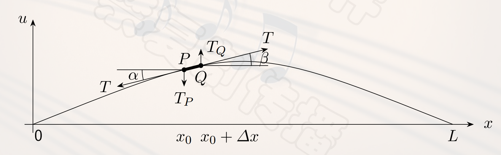
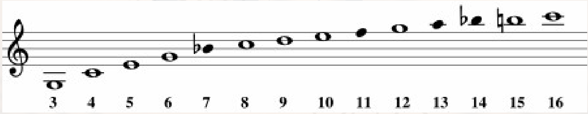
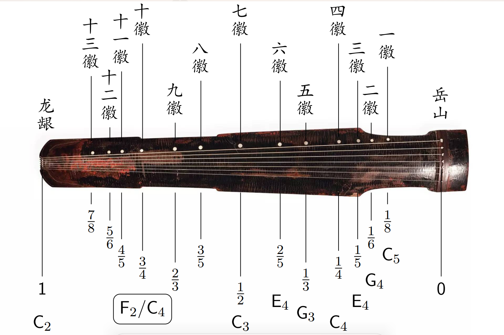
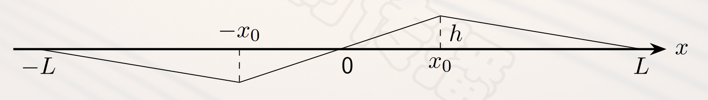

## 一维振动方程
### 乐器的分类
- **气鸣**乐器：边棱、唇鸣、簧鸣等。
- **弦鸣**乐器：弓拨、弹拨、击打等。
- **电鸣**乐器。
- **体鸣**乐器：打击乐、木琴。
- **膜鸣**乐器：鼓、卡祖笛等。
- 一维上我们只考虑**弦鸣乐器**。
### 抽象化
- 一个**假设**：**均匀细弦**。
- 三个参数：**长度**$L$，**受到张力**$T$，**单位长度的质量/弦密度**$\rho$，用于衡量弦**粗细**。
### 数学建模
- 一条**水平弦**被**固定**在水平轴$(0,0)$和$(L,0)$之间，设$u(x,t)$为位置$x$在时刻$t$时的**位移**。取弦上的一小段$\overline{PQ}$,其中$P=(x_0,u(x_0,t)),Q=(x_0+\Delta x,u(x_0+\Delta x,t))$.

- 运用牛顿第二定律，$PQ$受到的力$F=T_Q-T_P \approx T(\tan \beta - \tan \alpha)$，质量$m=\rho \Delta x$.
- 由牛顿第二定律得到，$T(\frac{\partial u}{\partial x} \mid_{x=x_0+\Delta x}-\frac{\partial u}{\partial x} \mid_{x=x_0})=\rho \Delta x \cdot a$.
- 化简得到$\frac{(\frac{\partial u}{\partial x} \mid_{x=x_0+\Delta x}-\frac{\partial u}{\partial x} \mid_{x=x_0})}{\Delta x}=\frac{\rho}{T} \cdot a$.
- 令$\Delta x \to 0$，得到$\frac{\partial^2 u}{\partial x^2}=\frac{\rho}{T}\frac{\partial^2 u}{\partial T^2}|_{x=x_0}$.
- 由于$x$的**任意性**，得到$\frac{\partial^2 u}{\partial x^2}=\frac{\rho}{T}\frac{\partial^2 u}{\partial t^2}$.
- 再令$c=\sqrt{\frac{T}{\rho}}$，得到均匀细弦上的位移函数$u(x,t)$需满足的**一维振动方程**：$\frac{\partial^2 u}{\partial t^2}=c^2\frac{\partial^2 u}{\partial x^2}$
- 由于弦的两边是**固定**的，所以上述一维振动方程还需要满足**边值条件**：$u(0,t)=u(L,t)=0,\forall t \geq 0$.
- 使用**分离变量法**解上述方程。
- 得到方程的解$u(x,t)=\sum\limits_{n=1}^{+\infty}(a_n \cos \frac{n \pi c}{L}t+b_n \sin \frac{n \pi c}{L}t) \sin (\frac{n \pi}{L}x)$.
- 对于每个$u_n(x,t)$，它是两部分的乘积，前一部分是**时间的函数**，后一部分是**位置的函数**，令$w_n=\frac{n \pi c}{L}, \tan \theta_n=\frac{a_n}{b_n},$得到$u(x,t)=\sqrt{a_n^2+b_n^2} \sin (w_nt+\theta_n) \sin \frac{n \pi}{L}x$.
## 振动模态与泛音
### 振动模态
- 弦的振动是**无穷多个正弦振动**的**叠加**。
- 对于$u(x,t)=\sqrt{a_n^2+b_n^2} \sin (w_nt+\theta_n) \sin \frac{n \pi}{L}x$，称为弦振动的第$n$个**振动模态**。
- 在弦中间**任意固定**一点$x_0$，则可以得到$x_0$的第$n$个振动模态。
- $\mathrm{Mersenne}$定律：$x_0$的**第$n$个振动模态**频率为$f_n=\frac{n}{2L}\sqrt{\frac{T}{\rho}}$，$n=1$时，$f_1=\frac{1}{2L}\sqrt{\frac{T}{\rho}}$.
### 泛音
- 弦的**振动频率**组成的序列$f_1,f_2,\ldots$称为弦的**固有频率**。
- **基频**：$f_1$，相应的声音称为**基音**。
- **泛音**：$f_n(n>1)$对应的声音，通常称$f_2$对应**第一泛音**，$f_3$对应**第二泛音**等等。
- 由上述公式可知，所有泛音的频率都是基频**整数倍**。
- **泛音列**：$f,2f,3f,\ldots$。
- **波节**：振幅为**0**，即点$x=\frac{kL}{n}$处，即高中物理中的**波峰波谷**。
- **波腹**：振幅**最大**，即点$x=\frac{kL}{2n}$处，即高中物理中的**平衡位置**。
### 协和音程泛音列重合理论
- 由**赫尔姆霍兹**发现，一个音列与**泛音列**的**重合度越高**，那么这个音听起来**越和谐**。
- 例如八度音程$2f,4f,\ldots$有一半的音与泛音列重合，听起来非常和谐。
- 纯五度音程$\frac{3}{2}f,3f,\frac{9}{2}f,\ldots$有一部分音与泛音列重合，听起来比较和谐。
- 大二度音程$\frac{9}{8}f,\frac{9}{4}f,\frac{27}{8}f$，没有任何音与泛音列重合，听起来不和谐。
### 泛音与小号
- **自然小号/巴洛克小号**：长度为现代小号的两倍，声音比现代小号**低一个八度**。号管上没有**开孔**和**活塞按键**，只能发出**基频的自然泛音**。
- C调自然小号的**基音**是$C_2$，**第一泛音**为$C_3$，通常演奏者从**第二泛音**($G_3$)开始。
- 由于小三度的比例为$6:5=1.2$，得出4倍基频的为$C_4$，5倍基频的为$E_4$，6倍基频的为$G_4$，又由于$7:6 \approx 1.16$，7倍基频为$\flat B_4$，八倍基频的为$C_5$。
- 大二度的比例为$9:8=1.125$，所以9倍基频为$D_5$，10倍基频为$E_5$，由于$11:9 \approx 1.2$，11倍基频为$F_5$，$12:10=1.2$，12倍基频为$G_5$，由于$13:12 \approx 1.08$，13倍基频为$A_6$。

### 泛音与古琴
- 泛音演奏：古琴曲《流水》，《沧海一声笑》。
- 古琴音色按照弹法可以分为三类：
  - **泛音**：象征天，有清冷入仙感，轻盈活泼。
  - **散音**：象征地，松陈旷远，深沉浑厚。
  - **按音**：象征人，婉转抒情，缥缈多变。
- 古琴的结构如下图所示，若按一下七徽则**奇数倍**基频**被破坏**，**偶数倍基频不变**。
- 得出结论，按一下，**相乘能成为整数**的基频倍数**不被破坏**。

### 泛音与呼麦
- **呼麦/喉音唱法/泛音唱法/多声唱法**：演唱者运用口腔**不同部位的气息**控制，突出某些泛音，产生**同时唱出两个声部**的效果。
- 2009年，呼麦被列入联合国教科文组织非物质文化遗产代表名录。
## 拨弦与傅里叶级数
- 为确定$a_n,b_n$，需要以下方程：

$$\begin{cases}
\frac{\partial^2 u}{\partial t^2}=c^2 \frac{\partial^2 u}{\partial x^2}, & x \in [0,L],t \geq 0 \\\\
u(0,t)=u(L,t)=0, & \forall t \geq 0 , \quad (边值条件) \\\\
u(x,0)=\phi(x), & \forall x \in [0,L] , \quad (初始形状) \\\\
\frac{\partial u}{\partial t}_{t=0}=\psi(x), & \forall x \in [0,L] , \quad (初始速度) \\\\
\end{cases}$$

- 本课程主要介绍特殊情况，即``拨弦``。
- 给定$x_0 \in (0,L)$和常数$h>0$，假设把弦上$x_0$点拨到距离原来位置$h$的的地方，则此时的$\phi(x)$是**折线函数**，方程为$\phi(x)=\begin{cases}\frac{hx}{x_0}, \quad 0 \leq x \leq x_0, \\\\ \frac{h(x-L)}{x_0-L}, \quad x_0 \leq x \leq L \end{cases}$.
- 将$t=0$代入，得$\phi(x)=u(x,0)=\sum\limits_{n=1}^{+\infty}a_n \sin (\frac{n \pi}{L}x)$.
- 有关傅里叶级数的介绍，详见《高等数学A（下）》课程。
- 将$\phi(x)$**奇延拓**到$[-L,0]$，再进行**周期延拓**，得到$a_n=\frac{1}{L}\int_{-L}^{L}\phi(x) \sin \frac{n \pi}{L}xdx$.
- $\psi(x)$也被表示为一个傅里叶级数，$\psi(x)=\sum\limits_{n=1}^{+\infty}b_n \frac{n \pi c}{L} \sin (\frac{n \pi}{L}x)$。
- 同理可以求出$b_n=\frac{1}{L}\int_{-L}^{L}\psi(x) \sin \frac{n \pi}{L}xdx$.
- 假设在拨弦的**手指放开**时弦是**静止的**，即弦上任一点的的**初速度**为$0$，$\psi(x)=0,\forall x \in [0,L],$则所有的系数$b_n=0$。
- 得到最终结果，给定长度为$L$，两端均**固定**的弦，在其中点$\frac{L}{2}$处拨动，假定释放时弦上各处的**初速度**均为**0**，则弦产生的振动为$u(x,t)=\sum\limits_{n=1}^{+\infty}(a_n \cos \frac{n \pi c}{L}t+b_n \sin \frac{n \pi c}{L}t) \sin (\frac{n \pi}{L}x)=\sum\limits_{k=0}^{+\infty}\frac{8}{(2k+1)^2 \pi^2} \cos (\frac{(2k+1) \pi c}{L}t) \sin (\frac{(2k+1) \pi}{L}x)$.
- 拨弦的**各振动模态**的频率都是**基频的奇数倍**，在弦振动的**固有频率**中，只有**对应于奇数的频率才会出现**。
- 几何解释：在$\frac{L}{2}$释放弦后，弦的振动应当始终保持**关于其对称**，$n$为**奇数**时是**对称**的，而**偶数**时的波形是**反对称**的。
- 吉他上的品与泛音息息相关，十二品处于中间位置。

## 空穴来风
### 管乐器
- 管乐器通常分为两组：
  - **木管组**：短笛、长笛、双簧管、单簧管、大管等。
  - **铜管组**：小号、圆号、长号、大号等。
- **木管五重奏**通常由**长笛、双簧管、单簧管、大管和圆号**组成。
- 管乐器的**振动主体**是管内的**空气柱**，但**边值条件**与弦振动的不同。振动的空气柱会**超出管的端口**，需要对其**音高/频率**进行**端口校正**。最早由明朝朱载堉提出。
- 声音是**纵波**，管子中的**空气柱振动**时，沿着管子的**轴向方向**形成**疏密相间的拨动**。
- **不考虑管口校正**的情况下，在**开口**处，空气柱可以**自由移动**，振动幅度**最大**，形成**波腹**。
- 如果管子的**一端是封闭的**，则该处的空气柱**无法做纵向的振动**，形成**波节**。
- 从波腹到波节刚好构成**一个完整振动周期**的$\frac{1}{4}$，即距离恰等于$\frac{1}{4}$波长。
### 开管的振动模态
- **不计管口校正**，**开口**位置总是位于振动的**波腹**，**闭口**位置只能位于**波节**。
- 对于基频，有$L=\frac{\lambda_1}{2}$，对于$f_n$，有$L=\frac{n\lambda_n}{2}$。
- 即开管的**泛音列**为$f,2f,3f,\ldots$。
### 闭管的振动模态
- **不计管口校正**，**开口**位置总是位于振动的**波腹**，**闭口**位置只能位于**波节**。
- 对于基频，有$L=\frac{\lambda_1}{4}$，对于$f_n$，有$L=\frac{(2n-1)\lambda_n}{4}$。
- 即闭管的**泛音列**为$f,3f,5f,\ldots$，即闭管只有**偶次泛音**。
### 管乐器实例
- **长笛**是一种**开管**，**单簧管**是一种**闭管**。
- 假设有效管长$L \approx 0.66m,$声速$v=340m/s$。
- 对于长笛，其基频$f_1=\frac{v}{\lambda_1}=\frac{v}{2L}=\frac{340}{1.32}=258 \mathrm{Hz}$。
- 对于单簧管，其基频$f_1=\frac{v}{\lambda_1}=\frac{v}{4L}=\frac{340}{2.64}=129 \mathrm{Hz}$。
- 普通长笛的**最低音**为$C_4$（中央$C$），普通的$\flat B$单簧管的**最低音**为$D_3$，记谱为$E_3 -$**移调乐器**。
- **长笛**的泛音列中，第二项的频率为$2f$，超吹产生**高八度**的音。
- **单簧管**的泛音列中，第二项的频率为$3f$，超吹产生**高十二度**的音。
## 思考题
- 乐音和噪音的本质区别是什么？
- 发出乐音的声源的振动是规则的，而发出噪音的声源的振动是不规则的。乐音是由一系列频率整数倍关系的正弦波叠加而成的，而噪音则是由频率分布较为均匀的波叠加而成的。
- 为什么单簧管只能发出偶次泛音，而自然小号可以发出所有的泛音？
- 因为单簧管是一种闭管，而自然小号是一种开管。
## 声明
本笔记的部分内容来自[喵喵的学习笔记](https://zhuanlan.zhihu.com/p/719184665)，如有侵权请联系我删除。