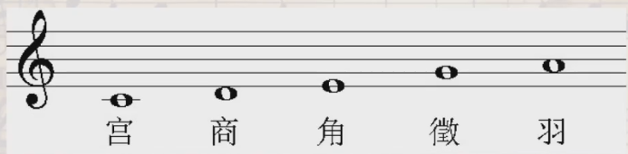
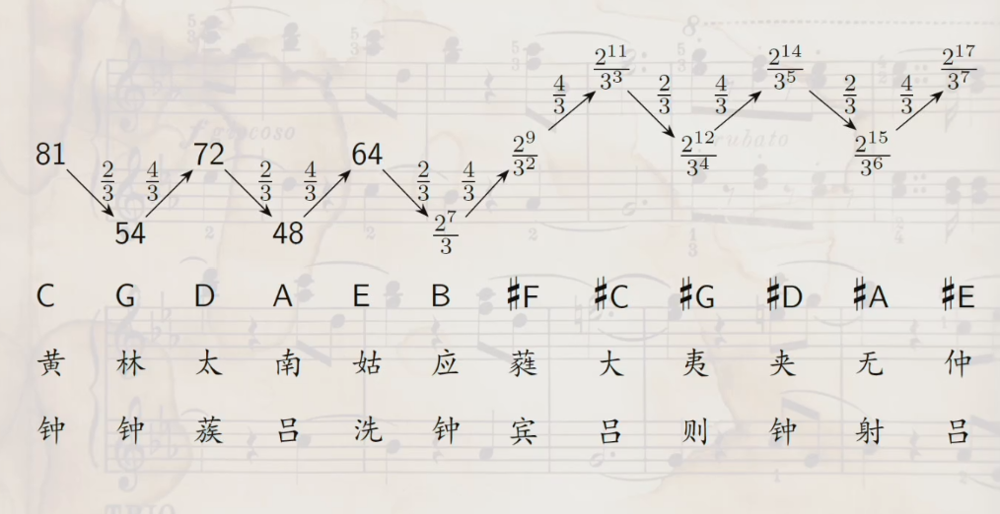
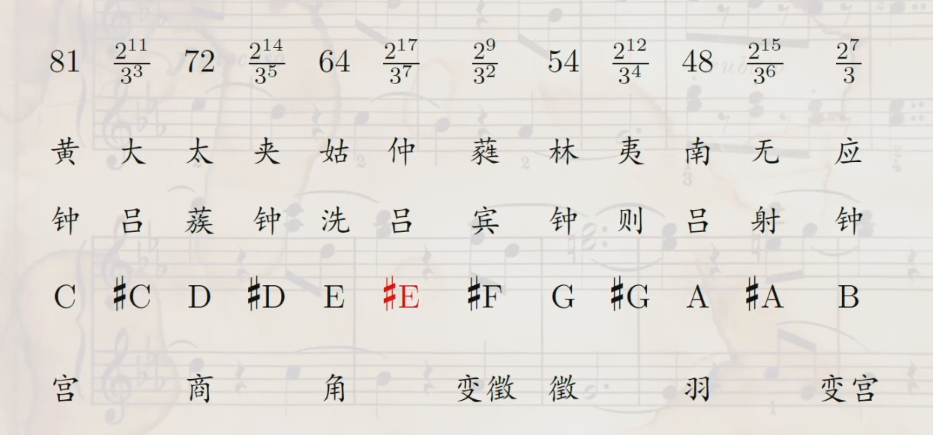
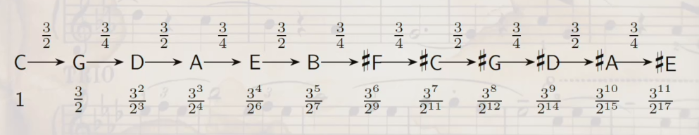
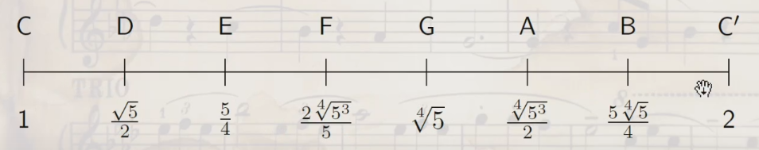

## 乐音体系的生成
- 乐音体系是**有限多个音级**组成的集合，这个集合中的元素是如何确定的？
- 这就是**律学**要解决的问题：
  - 确定**绝对音高**，就是要确定**每个音级对应的振动频率**。
  - 确定**同一个八度**内**不同音级的相对音高**。 
- 一定意义上说，**相对音高**更为重要。
- 因为八度音程对应的频率比为$1:2$，如果**同一个八度**内的12个音级之间的**频率比值确定**，那么确定**任意一个音级**的振动频率，这个八度内其他音级的频率就随之确定。然后可以得到其他八度内各个音级对应的振动频率。
## 三分损益
- 在春秋时期《管子》一书"地员"篇中记载。
- 首先，计算初始值，即**宫音**，$3^4=81$。
- 对**宫音**增加三分之一，即**徵音**，$81 \times \frac{4}{3}=108$。
- 对**徽音**减少三分之一，即**商音**，$108 \times \frac{2}{3}=72$。
- 对**商音**增加三分之一，即**羽音**，$72 \times \frac{4}{3}=96$。
- 对**羽音**减少三分之一，即**角音**，$96 \times \frac{2}{3}=64$。
- 由于**弦的长度**与**发声频率**成**反比**，所以**数字越大**的音级**频率越低**，把**徵音**和**羽音**分别**除以2**，得到高八度的两个音级。
- 整理得到以下音列：

| (徵)  | (羽) | 宫  | 商  | 角  | 徵  | 羽  |
| ----- | ---- | --- | --- | --- | --- | --- |
| (108) | (96) | 81  | 72  | 64  | 54  | 48  |

- 假设**宫音**对应中央$C$，得到五声音阶$C,D,E,G,A$。

- **徵音**与**宫音**的频率比为$4:3$，符合**理想纯四度**的简单整数比。
- **宫音**与**高八度的徵音**频率比为$3:2$，符合**理想纯五度**的简单整数比。
- 但是**宫音**与**角音**的频率比为$81:64$，不符合**理想大三度**的简单整数比。
- 对**角音**继续做**三分损益**，得到**变宫音**$64 \times \frac{4}{3}=\frac{256}{3} \approx 85$和**变徵音**$\frac{256}{3} \times \frac{2}{3}=\frac{512}{9} \approx 87$。
- 整理得到新的音列

| (徵)  | (羽) | (变宫)          | 宫  | 商  | 角  | 变徵            | 徵  | 羽  | 变宫            |
| ----- | ---- | --------------- | --- | --- | --- | --------------- | --- | --- | --------------- |
| (108) | (96) | $\frac{256}{3}$ | 81  | 72  | 64  | $\frac{512}{9}$ | 54  | 48  | $\frac{128}{3}$ |

- 古代以**清浊**形容音的**高低**，``清宫``就是**比宫音高八度**的音级，假设**宫音**为中央$C$，则三分损益法得到的七声音阶为

- 这就是传统音乐中的**雅乐音阶**，亦称为**古音阶**。
### 十二律
- 战国时期，《吕氏春秋》提出了十二律的名称和相生关系。
- 本质上是对**七声音阶的拓展**。

- 把十二律对应的数值**从大到小**（**音高从低到高**）排列，它与五音的联系如下：

- 得到$\sharp E$对应的数值后，继续做三分损益，得到它上方纯五度的$\sharp B$，其数值为$\frac{2^{17}}{3^7} \times \frac{2}{3}=\frac{2^{18}}{3^8}$
- 在现代律制中，$\sharp B$与高八度的$C'$等音，但实际上十二律会现代律制比**略低**，即**旋宫不归**。

## 五度相生
- 毕达哥拉斯假设中央$C$对应的**频率为1**，其上方**五度**的$G$对应的频率为$\frac{3}{2}$。
- 而$G$上方五度音的频率应该是$\frac{9}{4}>2$，**超出同一个八度**，因此**降低一个八度**，得到$D$对应的频率为$\frac{9}{8}$。
- 以此类推，产生**全部十二个音名**，完整的五度相生音阶。

- **纯五度和纯四度**的音程频率都符合理想整数比，**大三度频率**，如$C \sim E$，其频率比为$\frac{81}{64} > \frac{5}{4}$，**出现一定偏差**。
- 得到音级$\sharp E$后，可以接着考虑其上方纯五度音的频率，$\frac{3^{11}}{2^{17}} \times \frac{3}{2}=\frac{3^{12}}{2^{18}}>2$。
- 将其**降低八度**，得到其频率为$\frac{3^{12}}{2^{19}} \approx 1.01 >1$。
- 按照现代律制，$\sharp E$上方五度应该是 $\sharp B$ ，**降低八度**后应该得到$C$，即上述式子应该等于1。
- 这就是著名的**毕达哥拉斯音差**。
- **单声音乐**：**单音曲调**构成的音乐，包括**没有伴奏**的独唱、独奏，以及**曲调作同度或八度重叠**的齐唱、齐奏。
- 通常合唱比赛的都是齐唱，而非合唱，因为男女声部不算分声部。
- **多声部音乐**：
  - 公元9世纪前后出现**奥尔加农音乐样式**，是多声部音乐的雏形。
  - 可以分为复调音乐和主调音乐。
  - **复调音乐**：**不同声部**具有各自的**相对独立性**，按照**对位法**结合在一起。
  - **主调音乐**：以**一个声部**为**主要旋律声部**，其余声部相对**缺少独立性**，对主要旋律起**伴奏、烘托**作用。
  - 里切卡尔/无差部赋格：16-17世纪的一种复调器乐曲。
  - 17世纪后出现了贯穿主题模仿的里切卡尔，结构近似赋格。
  - 巴赫《音乐的奉献》中有一首六声部里切卡尔。
  - 复调音乐如今不多见，**常见的为主调音乐**，如《军队进行曲》。
  - 也可以在音乐中**同时使用主调和复调**，如贺绿汀《牧童短笛》。

## 纯律
- 文艺复兴开始，西方音乐越来越重视使用**三度和六度**音程。
- **纯律**：在五度相生法中添加一个**生律元素**，理想大三度的比例 5:4，形成纯律。
- 据传为意大利音乐理论家扎利诺提出。
- 在纯律中， $E$ 的音高为 $\frac{5}{4}$，由于$E$和$B$形成纯五度，因此$B$的音高为 $\frac{15}{8}$。
- 又$F$和高音$C$构成纯五度音，因此$F$的音高为 $\frac{4}{3}$。
- 而$F$和$A$构成大三度音，因此$A$的音高为 $\frac{5}{3}$。
- 于是，正三和弦 $C-E-G,F-A-C',G-B-D'$都符合理想整数比$4:5:6$，对于多声部音乐有重要意义。
- 纯律也有不足之处，即五度音程$D-A$不协和，其比例为$\frac{5}{3}:\frac{9}{8}=\frac{40}{27}<\frac{3}{2}$，**比理想的纯五度窄**。
- 同时，有两种**不同的大二度(全音)**，音程$C-D,F-G,A-B$的比例为 $\frac{9}{8}$，而音程$D-E,G_A$的比例为 $\frac{10}{9}$。
- 存在**音差(Comma)问题**，从$C$出发**升高4个纯五度**，再**降低两个八度和一个大三度**，得到 $(\frac{3}{2})^4 \times (\frac{1}{2})^2 \times \frac{4}{5}=\frac{81}{80}$，即回到比$C$高一点的地方，这个数值被称为**谐调音差(Syntonic Comma)**。
- 存在**转调问题**。例如《保卫黄河》，《青花瓷》。
- 例如，对于$1=C$调好的音阶，要转为$1=D$，则其上方纯五度为$A$，其比例为 $\frac{5}{3} \times \frac{8}{9}=\frac{40}{27}<\frac{3}{2}$

- 三分损益、五度相生和纯律都发挥过重要作用，但它们都存在缺陷。
- 我国出现过**六十律、新律、三百六十律、十八律**等律法。

## 中庸全音律
- 假定音名$C$的频率为$f$，则高八度$C'$的频率为$2f$，再高一个八度的$C''$对应频率为 $4f$。
- 如果$C$上方五度的频率为 $\frac{3}{2}f$，则再高一个八度对应频率为 $(\frac{3}{2})^2 f$
- 经过 $n$ 次后，希望能有比 $C$ 高 $m$ 个八度的音级，对应频率满足 $(\frac{3}{2})^n \cdot f=2^m \cdot f$
- 即 $3^n=2^{m+n}$，易见不可能成立，即**有理数范围内无法调好律**。
- 回顾第一次数学危机，毕达哥拉斯学派是否认无理数的(他的学生希帕索斯发现无理数)。
- 于是，目标变为**消除音差**，通过牺牲纯五度的比例 $3:2$。
- 需要想办法将音差分配给不同的音级，**新律**实现了这种平均。
- 但是音程关系是**频率的比值**，对应于乘除而非加减，因此**无法用算术平均**解决问题。
- 假设 $a=\frac{81}{80}$ 为谐调音差，则其 $\frac{1}{4}$ 应该等于 $d=\sqrt[4]{a}$。
- 于是，得到缩小 $\frac{1}{4}$ 谐调音差后的纯五度音程比值为 $\frac{3}{2} \div \sqrt[4]{\frac{81}{80}}=\frac{3}{2} \times \frac{2\sqrt[4]{5}}{3}=\sqrt[4]{5}$ 。
- 再考虑 $F$ ，由于其上方五度的音级 $C'$ 与 $F$ 的比值应该等于生律元素 $\sqrt[4]{5}$，解得 $F$ 的音级为 $\frac{2\cdot 5^{\frac{3}{4}}}{5}$。
- 于是得到7个自然音级对应的数值：

- 这就是**中庸全音律**。
- 有区分**自然律**和**人工律**，**自然律**就是**泛音列**，其音级都是**有理数**；而无理数**一定是人工律**。
- 纯律中有两种不同的大二度（全音），即 $C-D$ 和 $D-E$，它们的**几何平均**恰为中庸全音律中 $D$ 的值。
- 这说明了中庸全音律不仅**保持了大三度**音程的理想比例，又使得**大二度音程的频率比相等**。
- 计算小二度（半音） $B-C'$ 和 $E-F$ 的频率比，它们是相同的。但是两个小二度叠加，得到的频率比**略大于一个全音**。
- 中庸全音律**消除了谐调音差**，**各个全音音程**和**各个半音音程**一致，**大小三度**和**大小六度**都合于纯律，并且能**在一定范围内转调**，这是它的优点。
- 它**牺牲了纯五度的理想比例**，纯五度音程 $C-G$ 的比例等于 $\sqrt[4]{5}<\frac{3}{2}$，经过**多次五度相生**会产生**与纯五度相差极大**的五度音程，历史上称为**狼五度**。

## 平均律
- 设一个八度之间有12个半音，则相应的音级对应的频率构成一个**等比数列**，计算出其公比为 $r=\sqrt[12]{2}$，这就构成了**十二平均律**。
- 世界上第一个通过准确计算提出平均律的人是**朱载堉**，他把自己提出的平均律称为**新法密率**，并且精确到了小数点后**25位**。
- 巴赫的《音乐的奉献》基于"国王主题"，包括两首无插入赋格，有一首是六声部的，还有十首卡农和一首以长笛为特色的三重奏奏鸣曲。
- 十首卡农中有一首"canon per tonos"，意为"经由种种调性的卡农"。
- 它有三个声部，不断变调后又回到最初的 $C$ 小调。

## 音分
- 是**度量不同声音的频率之比**的单位，设两个声音的频率分别为 $f_1<f_2$ ，则两个声音之间的音分数是 $1200\log_{2} (\frac{f_2}{f_1})$。
- 对于**平均律**，则半音之间的音分是100音分。
- 同样，有音分可以求频率比， $r=2^{\frac{c}{1200}}$
- 将音级 $C$ 的频率记为 $f$，则 $G$ 的频率应该是 $2^{\frac{7}{12}} \approx 1.4983f$
- 普通人通常能分辨出 $4 \sim 6$ 音分的频率差。
- 对比平均律和纯律的音高，可以发现 $E$ 和 $A$ 分别高出了14音分和16音分，差距较大。
- **八度循环** $2:1$，**五度纯正** $3:2$，**和弦协和** $5:4$，这三个比例一直推动着人们进行不停探索，它们也被称为**三条彩线**。
- 上面提到的都是**相对音高**，历史上**没有标准的绝对音高**。
- 人们倾向于**不断提高音高**，主观上作曲家、演奏家和乐器制造者都追求用**明亮、华丽的音色**吸引听众，**材料和制造技术**的进步为提高绝对音高提供了客观可能性。
- 1939年国际标准化协会(ISA)确立 $A=440 \mathrm{Hz}$ 为**音乐会音高**。
- **MIDI(Musical Instrument Digital Interface)**：乐器数字接口。
- 它用音符数 $21 \sim 108$ 代表 $A_0 \sim C_8$ 这88个音级。
- 若采用**十二平均律**和**音乐会音高标准**，则音符数 $n$ 对应的频率 $f$ 可以这样求出： $f=440 \cdot 2^{\frac{n-69}{12}}$

## 思考题
- 纯律中各自然音级之间的频率比能够唯一确定吗？
- 纯律中，各自然音级之间的频率比并不能唯一确定。例如 $A$ 的频率，我们先用高音 $C$ 推出 $F$ 的频率为 $4:3$，然后再通过大三度音得到 $A$ 的频率为 $5:3$。若通过 $D-A$ 构成纯五度音，推出 $A$ 的频率应该为 $27:16$。因此，纯律中的频率比并不唯一缺点。计算的方式不同，结果也不尽相同。
- 在纯律中，确定了各自然音级之间的频率比后，如何进一步确定变化音级的频率？
- 首先根据 $B$ 的频率 $15:8$ 推出 $\sharp F$ 的频率 $16:15$。
- 根据 $\sharp F$ 跟高八度的 $\sharp C$ 构成纯五度音，推出 $\sharp C$ 的频率 $16:15$。
- 根据 $\sharp C$ 和 $\sharp G$ 构成纯五度音，得到 $\sharp G$ 的频率 $8:5$。
- $\sharp G$ 和高八度的 $\sharp D$ 构成纯五度音，得到 $\sharp D$ 的频率 $6:5$。
- 最后根据 $\sharp D$ 和 $\sharp A$ 构成纯五度音，得到 $\sharp A$ 的频率为 $9:5$，这样得到了完整的七声音阶。 
- 在实际演奏中，小提琴、二胡等弓弦乐器通常依照哪种律制确定其空弦的音高？
- 小提琴依据十二平均律确定，二胡依据五度相生确定。

## 声明
本笔记的部分内容来自[喵喵的学习笔记](https://zhuanlan.zhihu.com/p/719294158)，如有侵权请联系我删除。