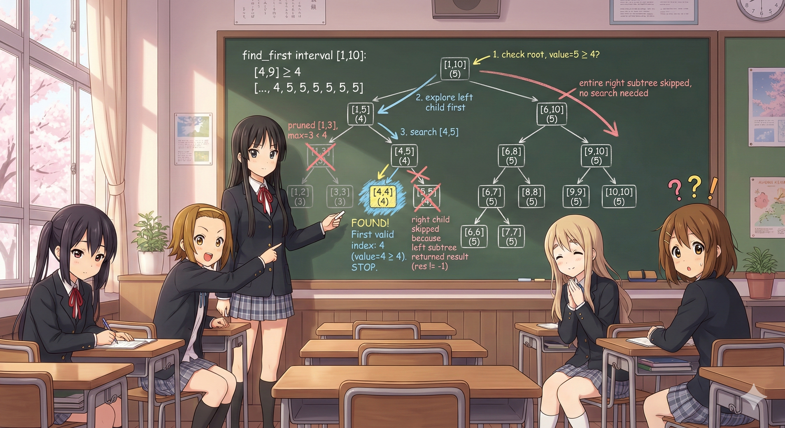

## 前言
这里是一个二次元的堕落之路啦，虽然窝觉得也没人能看到这里~

看番的口味从奇幻到党争到百合再到萌豚，说明越来越躺平摆烂了，事情实在太多，有时候腾出点时间写写博客就是莫大的消遣了。

好吧，也许ICS的笔记应该排除在外，不过谁会拒绝可爱的二次元纸片人呢哈哈哈，光是看着就很治愈耶~

那么进入正题，为什么要开始写这一篇长期更新的博文？

众所周知，Codeforces的题目，思维要求非常灵活，并且目前我所在的分段，刚好就是拼Div2前几道题的思维与手速。

因此，进行复盘是非常必要的，包括我之前板刷的时候，不时会发现自己赛时会做但是第二次不会的情况。

希望在未来一年里Rating能有所进步，加油加油！

- By Elainafan，2025.11.29，写于发烧之时

## 看番日记
| Date       | Round      | div    | id   | sol | rk   | perf | A   | B   | C   | D   | E   | F   | G   | H   | I   |
| ---------- | ---------- | ------ | ---- | --- | ---- | ---- | --- | --- | --- | --- | --- | --- | --- | --- | --- |
| 2025.10.12 | R1058      | div2   | 2160 | 3   | vp   | vp   | √   | √   | √   |     |     |     |     |     |     |  |
| 2025.10.19 | R1060      | div2   | 2154 | 3   | 3145 | 1536 | √   | √   | √   |     |     |     |     |     |     |  |
| 2025.10.25 | R1061      | div2   | 2156 | 2   | 9898 | 1033 | √   | √   | B   |     |     |     |     |     |     |  |
| 2025.10.28 | R1062      | div4   | 2167 | 5   | vp   | vp   | √   | √   | √   | √   |     |     | √   |     |     |  |
| 2025.11.10 | R1063      | div2   | 2163 | 2   | 2470 | 1582 | √   |     | √   |     |     |     |     |     |     |  |
| 2025.11.14 | Edu184     | edu    | 2169 | 3   | 4838 | 1333 | H   | √   | √   | √   |     |     |     |     |     |  |
| 2025.11.20 | R1065      | div3   | 2171 | 5   | 2504 | 1474 | √   | √   | √   | √   | √   |     | B   |     |     |  |
| 2025.11.28 | Edu185     | edu    | 2170 | 3   | 1885 | 1658 | √   | √   | √   |     |     |     |     |     |     |  |
| 2025.11.29 | R1067      | div2   | 2158 | 3   | 2812 | 1490 | √   | √   | √   |     |     |     |     |     |     |  |
| 2025.12.03 | R1064      | div1/2 | 2166 | 3   | vp   | 1483 | √   | √   | √   |     |     |     |     |     |     |  |
| 2025.12.05 | R1068      | div2   | 2173 | 3   | 2748 | 1532 | √   | √   | √   |     |     |     |     |     |     |  |
| 2025.12.06 | R1069      | div1/2 | 2175 | 3   | 934  | 1728 | √   | √   | √   | B   |     |     |     |     |     |  |
| 2025.12.11 | R1070      | div2   | 2176 | 3   | 2051 | 1611 | √   | √   | √   | B   |     |     |     |     |     |  |
| 2025.12.17 | GR30       | div1+2 | 2164 | 3   | vp   | 1521 | √   | √   | √   |     |     |     |     |     |     |  |
| 2025.12.19 | GR31       | div1+2 | 2180 | 3   | 1870 | 1800 | √   | √   | √   | B   |     |     |     |     |     |  |
| 2025.12.23 | R1071      | div3   | 2179 | 5   | 1266 | 1758 | √   | √   | √   | √   | √   | B   |     |     |     |  |
| 2025.12.29 | Edu186     | edu    | 2182 | 3   | 5418 | 1256 | √   | √   | √   | B   | B   |     |     |     |     |  |
| 2026.01.07 | Gb 2025    | div1+2 | 2178 | 4   | vp   | 1642 | √   | √   | √   | √   | B   |     |     |     |     |  |
| 2026.01.07 | Hello 2026 | div1+2 | 2183 | 4   | 1989 | 1786 | √   | √   | √   | √   |     |     |     |     |     |  |
| 2026.01.12 | R1072      | div3   | 2184 | 6   | 822  | 1921 | √   | √   | √   | √   | √   | √   | B   |     |     |  |
| 2026.01.17 | R1073      | div1/2 | 2191 | 4   | 4312 | 1330 | √   | √   | √   | √   | B   |     |     |     |     |  |
| 2026.01.18 | R1074      | div4   | 2185 | 7   | 679  | 1997 | √   | √   | √   | √   | √   | √   | √   |     |     |  |
| 2026.01.23 | R1075      | div1/2 | 2189 | 3   | 3891 | 1429 | √   | √   | √   | B   | B   | B   |     |     |     |  |
| 2026.01.25 | R1076      | div3   | 2193 | 5   | 2619 | 1464 | √   | √   | √   | H   | √   | √   | B   |     |     |  |
| 2026.01.29 | R1077      | div1/2 | 2188 | 4   | 1344 | 1723 | √   | √   | √   | √   |     |     |     |     |     |  |
| 2026.02.08 | R1078      | div2   | 2194 | 4   | 2090 | 1582 | √   | √   | √   | √   | B   |     |     |     |     |  |
| 2026.02.11 | R1079      | div1/2 | 2197 | 4   | 1643 | 1650 | √   | √   | √   | √   | B   | B   |     |     |     |  |
| 2026.02.21 | R1080      | div.3  | 2195 | 6   | 401  | 2075 | √   | √   | √   | √   | √   | √   | B   |     |     |  |

## Codeforces Round #1072(Div.3)
第一次在d3做出六道题，事实上G理论也能出，只是AB花太多时间了，唉唉我的AK。

也是第一次写这样的博文，瞎写的，多多见谅~
### C 
题目大意： 有一堆大小为 $n$ 的苹果，每次可以对一堆苹果进行操作，将其分为大小为 $\lfloor \frac{n}{2} \rfloor$ 和 $\lceil \frac{n}{2} \rceil$ 的两堆，问能否得到大小为 $k$ 的一堆，若能请给出最少操作次数。

数据范围： $1 \leq n,k \leq 10^9$

思路：就是裸的DFS啊，这个时间复杂度绝对不会爆的，放心放心~

```cpp
void solve() {
    ll n, k;
    cin >> n >> k;
    if (n < k) {
        cout << -1 << endl;
        return;
    }
    int ans = INT_MAX;
    map<ll, int> ma;
    auto dfs = [&](this auto&& dfs, ll x, int t) {
        if (ma.count(x)) return;
        if (x < k) return;
        ma[x]++;
        if (x == k) {
            ans = min(ans, t);
            return;
        }
        if (x % 2 == 0)
            dfs(x / 2, t + 1);
        else {
            dfs(x / 2, t + 1);
            dfs(x / 2 + 1, t + 1);
        }
        return;
    };
    dfs(n, 0);
    if (ans == INT_MAX)
        cout << -1 << endl;
    else
        cout << ans << endl;
    return;
}
```

### D 
题目大意：Alice跟Bob玩游戏，Alice每次可以进行两种操作中的其中一种，即将当前数减一或者将当前数除以2（必须是偶数时才能进行），当Alice将这个数变为0时，她就获胜了。给出 $n=2^d$ ，Bob需要求出 $1 \sim n$ 中，作为初始值无法使Alice在 $k$ 个回合内获胜的个数。

数据范围： $1 \leq n,k \leq 10^9$

思路：考虑最高位为第 $i$ 位时，在 $1 \sim (i-1)$ 位共有 $j$ 位为0，则低位共有 $i-1-j$ 个1，每个1提供2步的容错，每个0跟最高位1提供1步的容错，因此一共需要 $2*(i-1-j)+j+1=2*i-j-1$ 步，考虑当其 $>k$ 时的组合数即可，注意组合数初始化的方法。

```cpp
ll cn[32][32];
void init() {
    for (int i = 0; i <= 31; i++) {
        cn[i][0] = cn[i][i] = 1;
        for (int j = 1; j < i; j++) {
            cn[i][j] = cn[i - 1][j - 1] + cn[i - 1][j];
        }
    }
}
void solve() {
    int n, k;
    cin >> n >> k;
    int tem = __lg(n);
    tem++;
    ll ans = 0;
    for (int i = 1; i <= tem - 1; i++) {
        if (2 * i - 1 <= k) continue;
        for (int j = 0; j <= i - 1; j++) {
            if (2 * i - j - 1 > k) ans += cn[i - 1][j];
        }
    }
    if (tem > k) ans++;
    cout << ans << endl;
    return;
}
```

### E 
题目大意：如果一个数组至少有两个元素，且其中任意相邻元素至少相差 $k$ ，称其为 $k-$ 数组。给定一个 $1 \sim n$ 的排列 ，请求出从 $k \in \{1 \sim n-1\}$ 的 $k-$ 子数组个数。

数据范围： $2 \leq n \leq 10^5$

思路：首先预处理出所有相邻元素之间的差值。考虑贡献法，先用单调栈处理出某个差值作为子数组最小值对应的贡献，倒着遍历 $n-1 \sim 1$ ，如果当前差值刚好等于 $i$ ，则考虑其作为子数组最小元素的贡献，并累加到总值中即可，注意相邻差值若相等，两侧预处理时一侧有等号一侧没有等号，算是比较板的题。

```cpp
void solve() {
    int n;
    cin >> n;
    vector<int> a(n);
    for (int i = 0; i <= n - 1; i++) cin >> a[i];
    vector<int> res(n - 1);
    vector<int> diff(n - 1);
    for (int i = 0; i < n - 1; i++) diff[i] = abs(a[i + 1] - a[i]);
    vector<int> r(n - 1, n - 1);
    vector<int> l(n - 1, -1);
    stack<int> s;
    vector<vector<int>> ma(n);
    for (int i = 0; i < n - 1; i++) ma[diff[i]].push_back(i);
    for (int i = n - 2; i >= 0; i--) {
        while (!s.empty() && diff[s.top()] >= diff[i]) s.pop();
        if (!s.empty()) r[i] = s.top();
        s.push(i);
    }
    while (!s.empty()) s.pop();
    for (int i = 0; i <= n - 2; i++) {
        while (!s.empty() && diff[s.top()] > diff[i]) s.pop();
        if (!s.empty()) l[i] = s.top();
        s.push(i);
    }
    vector<ll> ans(n);
    ll cnt = 0;
    for (int i = n - 1; i >= 1; i--) {
        for (int p : ma[i]) {
            cnt += 1LL * (r[p] - p) * (p - l[p]);
        }
        ans[i] = cnt;
    }
    for (int i = 1; i <= n - 1; i++) cout << ans[i] << ' ';
    cout << endl;
    return;
}
```

注：本题似乎还存在并查集+链表的做法，放一个朋友的提交链接在这里[Kita3's submission](https://codeforces.com/contest/2184/submission/357673035)。

### F 
题目大意：给一棵顶点编号为 $1 \sim n$ 的有根树，树根默认为1。每个叶子都有一颗樱桃，每次操作可以选择某个节点使以其为根的子树的所有叶子的樱桃掉落，若某个叶子的樱桃已经掉落则不能被摇动第二次，问是否能使摇动次数为3的倍数？

数据范围： $2 \leq n \leq 2 \cdot 10^5$ 

思路：一眼树上状态机，如果难点可以出树上背包？可以作为思考题。首先，需要知道的是对于某个非根节点，摇动它能节省的次数就是（以它为根子树的叶子数-1），然后就可以对每个节点维护，以其为根的子树中是否存在节省操作数模3的余数为1或为2的状态，逐步回传即可。

```cpp
void solve() {
    int n;
    cin >> n;
    int x, y;
    vector<vector<int>> ma(n);
    for (int i = 0; i < n - 1; i++) {
        cin >> x >> y;
        ma[x - 1].push_back(y - 1);
        ma[y - 1].push_back(x - 1);
    }
    int ans = 0;
    for (int i = 0; i <= n - 1; i++) {
        if (ma[i].size() == 1 && i != 0) ans++;
    }
    if (ans % 3 == 0) {
        cout << "YES" << endl;
        return;
    }
    int r = ans % 3;
    bool flag = false;
    vector<int> mt(n);
    auto dfs = [&](this auto&& dfs, int x, int pa) -> int {
        if (ma[x].size() == 1 && pa != -1) return 1;
        int cnt = 0;
        int cnt1 = 0, cnt2 = 0;
        for (int p : ma[x]) {
            if (p == pa) continue;
            cnt += dfs(p, x);
        }
        mt[x] = cnt;
        if ((cnt + 2) % 3 == r) flag = true;
        return cnt;
    };
    auto dfs2 = [&](this auto&& dfs2, int x, int pa) -> pair<bool, bool> {
        if (ma[x].size() == 1 && pa != -1) return {false, false};
        bool pd1 = false, pd2 = false;
        for (int p : ma[x]) {
            if (p == pa) continue;
            auto tem = dfs2(p, x);
            if (pd1 == true && tem.first) pd2 = true;
            if (pd2 == true && tem.second) pd1 = true;
            pd1 = pd1 | tem.first;
            pd2 = pd2 | tem.second;
        }
        if (r == 1 && pd1) flag = true;
        if (r == 2 && pd2) flag = true;
        if (mt[x] % 3 == 2) pd1 = true;
        if (mt[x] % 3 == 0) pd2 = true;
        return {pd1, pd2};
    };
    dfs(0, -1);
    dfs2(0, -1);
    if (flag)
        cout << "YES" << endl;
    else
        cout << "NO" << endl;
    return;
}
```

### G 
题目大意：给定编号为 $1 \sim n$ 的 $n$ 个元素 $a_1,a_2,\ldots,a_n$ ，定义 $[l,r](1 \leq l \leq r \leq n)$ 的恶心度为满足 $\mathrm{min}(a_l,a_{l+1},\ldots,a_{l+d})=d, 0 \leq d \leq r-l$ 的 $d$ 的个数。

现在给定 $q$ 个查询，分别为操作1和操作2，操作1把 $a[idx]$ 改为 $x$ ，操作2查询 $[l,r]$ 的恶心度。

数据范围： $1 \leq n,q \leq 2 \cdot 10^5, 1 \leq a_i \leq 2 \cdot 10^5, 1 \leq x \leq 2 \cdot 10^5$

思路：首先，注意到 $\mathrm{min}(a_l,\ldots,a_{l+d})$ 为单调递减函数，而 $d$ 为严格单调递增函数，因此它们的交点至多只有一个。

一种显然的思路是，用线段树动态维护区间最小值，同时在 $[l,r]$ 上二分，线段树的查询复杂度为 $O(logn)$ ，因此总的时间复杂度为 $O(q logn logn)$

```cpp
template <typename T>
class SegmentTree {
    int n;
    vector<T> tree;
    T merge_val(T a, T b) const { return min(a, b); }  // 合并子树

    void maintain(int node) {  // 维护整棵树
        tree[node] = merge_val(tree[node * 2], tree[node * 2 + 1]);
    }

    void build(const vector<T>& a, int node, int l, int r) {
        if (l == r) {
            tree[node] = a[l];
            return;
        }
        int m = (l + r) / 2;
        build(a, node * 2, l, m);
        build(a, node * 2 + 1, m + 1, r);
        maintain(node);
    }  // 建树

    void update(int node, int l, int r, int i, T val) {
        if (l == r) {
            tree[node] = val;
            return;
        }
        int m = (l + r) / 2;
        if (i <= m)
            update(node * 2, l, m, i, val);
        else
            update(node * 2 + 1, m + 1, r, i, val);
        maintain(node);
    }  // 更新i处的值为val

    T query(int node, int l, int r, int ql, int qr) const {
        if (ql <= l && r <= qr) return tree[node];
        int m = (l + r) / 2;
        if (qr <= m) return query(node * 2, l, m, ql, qr);
        if (ql > m) return query(node * 2 + 1, m + 1, r, ql, qr);
        T l_res = query(node * 2, l, m, ql, qr);
        T r_res = query(node * 2 + 1, m + 1, r, ql, qr);
        return merge_val(l_res, r_res);
    }  // 查询[ql,qr]的值

    int find_first(int node, int l, int r, int ql, int qr, T val) const {
        if (r < ql || l > qr) return -1;
        if (tree[node] < val) return -1;
        if (l == r) return l;
        int m = (l + r) >> 1;
        int res = find_first(node << 1, l, m, ql, qr, val);
        if (res != -1) return res;
        return find_first(node << 1 | 1, m + 1, r, ql, qr, val);
    } 

    int find_last(int node, int l, int r, int ql, int qr, T val) const {
        if (r < ql || l > qr) return -1;
        if (tree[node] < val) return -1;
        if (l == r) return l;
        int m = (l + r) >> 1;
        int res = find_last(node << 1 | 1, m + 1, r, ql, qr, val);
        if (res != -1) return res;
        return find_last(node << 1, l, m, ql, qr, val);
    }

public:
    SegmentTree(int n, T init_val) : SegmentTree(vector<T>(n, init_val)) {}

    SegmentTree(const vector<T>& a) : n(a.size()), tree(2 << bit_width(a.size() - 1)) { build(a, 1, 0, n - 1); }  // 传入一个数组维护

    void update(int i, T val) { update(1, 0, n - 1, i, val); }  // 更新i的值为val

    T query(int ql, int qr) const { return query(1, 0, n - 1, ql, qr); }  // 查询[ql,qr]的值

    T get(int i) const { return query(1, 0, n - 1, i, i); }  // 取出i处的值

    int find_first(int ql, int qr, T val) const { return find_first(1, 0, n - 1, ql, qr, val); } // 查询[ql,qr]中第一个满足条件的下标

    int find_last(int ql, int qr, T val) const { return find_last(1, 0, n - 1, ql, qr, val); } // 查询[ql,qr]中最后一个满足条件的下标
};
void solve() {
    int n, q, op, x, y;
    cin >> n >> q;
    vector<int> a(n);
    for (int i = 0; i <= n - 1; i++) cin >> a[i];
    SegmentTree tree(a);
    auto check = [&](this auto&& check, int l, int mid) -> bool {
        int tem = tree.query(l, mid);
        if (tem <= mid - l) return true;
        return false;
    };
    for (int i = 1; i <= q; i++) {
        cin >> op;
        if (op == 1) {
            cin >> x >> y;
            tree.update(x - 1, y);
        } else {
            cin >> x >> y;
            int sl = --x, sr = --y;
            int l = sl, r = sr, mid;
            while (l + 1 < r) {
                mid = (l + r) / 2;
                if (check(sl, mid))
                    r = mid;
                else
                    l = mid;
            }
            if (tree.query(sl, r) == r - sl)
                cout << 1 << endl;
            else
                cout << 0 << endl;
        }
    }
    return;
}
```

但是，这种做法并不是最优的，是否能直接进行线段树二分，把复杂度降到 $O(qlogn)$ ？ 这里先瞎放张图。



当然，上面是普通的线段树二分流程，而这题固定了左端点，就要考虑怎么求右端点了。

回想起线段树有个性质，即某个节点的左子树必然先于其右子树被遍历到，因此，到遍历到某个 $[l,r]$ ，则 $[1,l]$ 必然都被遍历过，因此若遍历到被 $[ql,qr]$ 完全包裹的区间 $[l,r]$ ，则代表之前所有的 $[ql,l)$ 都被遍历过了，而且都是以完全包裹的形式，因此可以使用一个全局变量（或者直接在查找时传引用），当完全包裹并且不行的时候就进行更新（因为如果行那么直接接着二分，直到不行被更新或者得到一个点）。

```cpp
template <typename T>
class SegmentTree {
    int n;
    vector<T> tree;
    T merge_val(T a, T b) const { return min(a, b); }  // 合并子树

    void maintain(int node) {  // 维护整棵树
        tree[node] = merge_val(tree[node * 2], tree[node * 2 + 1]);
    }

    void build(const vector<T>& a, int node, int l, int r) {
        if (l == r) {
            tree[node] = a[l];
            return;
        }
        int m = (l + r) / 2;
        build(a, node * 2, l, m);
        build(a, node * 2 + 1, m + 1, r);
        maintain(node);
    }  // 建树

    void update(int node, int l, int r, int i, T val) {
        if (l == r) {
            tree[node] = val;
            return;
        }
        int m = (l + r) / 2;
        if (i <= m)
            update(node * 2, l, m, i, val);
        else
            update(node * 2 + 1, m + 1, r, i, val);
        maintain(node);
    }  // 更新i处的值为val

    T query(int node, int l, int r, int ql, int qr) const {
        if (ql <= l && r <= qr) return tree[node];
        int m = (l + r) / 2;
        if (qr <= m) return query(node * 2, l, m, ql, qr);
        if (ql > m) return query(node * 2 + 1, m + 1, r, ql, qr);
        T l_res = query(node * 2, l, m, ql, qr);
        T r_res = query(node * 2 + 1, m + 1, r, ql, qr);
        return merge_val(l_res, r_res);
    }  // 查询[ql,qr]的值

    int find_first(int node, int l, int r, int ql, int qr, T& val) const {
        if (r < ql || l > qr) return -1;
        if (ql <= l && r <= qr && min(tree[node], val) > r - ql) {
            val = min(tree[node], val);
            return -1;
        }
        if (l == r) return l;
        int m = (l + r) >> 1;
        int res = find_first(node << 1, l, m, ql, qr, val);
        if (res != -1) return res;
        return find_first(node << 1 | 1, m + 1, r, ql, qr, val);
    }

    int find_last(int node, int l, int r, int ql, int qr, T val) const {
        if (r < ql || l > qr) return -1;
        if (tree[node] < val) return -1;
        if (l == r) return l;
        int m = (l + r) >> 1;
        int res = find_last(node << 1 | 1, m + 1, r, ql, qr, val);
        if (res != -1) return res;
        return find_last(node << 1, l, m, ql, qr, val);
    }

public:
    SegmentTree(int n, T init_val) : SegmentTree(vector<T>(n, init_val)) {}

    SegmentTree(const vector<T>& a) : n(a.size()), tree(2 << bit_width(a.size() - 1)) { build(a, 1, 0, n - 1); }  // 传入一个数组维护

    void update(int i, T val) { update(1, 0, n - 1, i, val); }  // 更新i的值为val

    T query(int ql, int qr) const { return query(1, 0, n - 1, ql, qr); }  // 查询[ql,qr]的值

    T get(int i) const { return query(1, 0, n - 1, i, i); }  // 取出i处的值

    int find_first(int ql, int qr, T& val) const { return find_first(1, 0, n - 1, ql, qr, val); }  // 查询[ql,qr]中第一个满足条件的下标

    int find_last(int ql, int qr, T val) const { return find_last(1, 0, n - 1, ql, qr, val); }  // 查询[ql,qr]中最后一个满足条件的下标
};
void solve() {
    int n, q, op, x, y;
    cin >> n >> q;
    vector<int> a(n);
    for (int i = 0; i <= n - 1; i++) cin >> a[i];
    SegmentTree tree(a);
    for (int i = 1; i <= q; i++) {
        cin >> op;
        if (op == 1) {
            cin >> x >> y;
            tree.update(x - 1, y);
        } else {
            cin >> x >> y;
            int sl = --x, sr = --y;
            int cur = INT_MAX;
            int tem = tree.find_first(sl, sr, cur);
            if (tem != -1 && tree.query(sl, tem) == tem - sl)
                cout << 1 << endl;
            else
                cout << 0 << endl;
        }
    }
    return;
}
```

最后是灵神的点评：


## Codeforces Round #1073(Div.2)
最近脑子不是很好使，掉大分。

### C 
题目大意：Alice和Bob在二进制字符串上博弈，Alice先手，双方轮流。

每个回合，选择一个非递增序列并将其排序，这个非递增序列必须同时包含0和1，最终无法下的人输棋。请确定胜者，若Alice获胜，则输出第一步。

数据范围： $1 \leq n \leq 2 \cdot 10^5$

思路：非常搞笑的是，这道题只有两种情况，即Alice一开始就下不了导致Bob赢棋，或者Alice一步赢下Bob。第一种情况就是整个字符串一开始就有序，第二种情况是Alice第一步将整个字符串中，最开始不应该属于自己位置的1，跟不应该属于自己位置的0对换。最近我确实就是缺少这种一眼看出只有两个答案的思维。

```cpp
void solve() {
    int n;
    cin >> n;
    string s;
    cin >> s;
    int cnt0 = 0, cnt1 = 0;
    vector<int> res;
    for (int i = 0; i <= n - 1; i++) {
        if (s[i] == '0') {
            cnt0++;
        } else if (s[i] == '1')
            cnt1++;
    }
    vector<int> res1;
    for (int i = 0; i <= cnt0 - 1; i++) {
        if (s[i] == '1') res1.push_back(i + 1);
    }
    for (int i = cnt0; i <= n - 1; i++) {
        if (s[i] == '0') res.push_back(i + 1);
    }
    if (cnt1 == 0 || cnt0 == 0 || res1.size() == 0) {
        cout << "Bob" << endl;
        return;
    }
    cout << "Alice" << endl;
    cout << 2 * res1.size() << endl;
    for (int p : res1) cout << p << ' ';
    for (int p : res) cout << p << ' ';
    cout << endl;
    return;
}
```

### D1 
题目大意：给定一个长度为 $n$ 的正则括号序列 $s$ ，请求出它的最长优子序列的长度。

优的定义为：必须为正则括号序列，被优的序列为其前缀或第一个不相等的位置，优子序列为``(``而被优子序列为``)``。

数据范围： $2 \leq n \leq 2 \cdot 10^5$

思路：需要最小化，那么当然是考虑跳过某个配对的括号序列，注意完全可以做到，对于``(()()``这样的序列，考虑是否只跳过一个``)``，注意到只需要后面少拿一个``(``，且只要能构成相应正则序列即可，如果后面都无法少拿一个``(``，那么显然就无法成立，答案为-1。而若能少拿，考虑将少拿的位置放在最前面，则考虑后面是否有至少2个``(``，因为如果少拿需要保证正则性会减掉一个。

```cpp
void solve() {
    int n;
    cin >> n;
    string s;
    cin >> s;
    int las = -1, tem = 1;
    int ans = INT_MAX;
    vector<int> res;
    for (int i = 1; i <= n - 1; i++) {
        if (s[i] == s[i - 1])
            tem++;
        else {
            res.push_back(tem);
            tem = 1;
        }
    }
    res.push_back(tem);
    int m = res.size();
    vector<int> maxx(m, 0);
    maxx[m - 2] = res[m - 2];
    for (int i = m - 4; i >= 0; i -= 2) {
        maxx[i] = maxx[i + 2] + res[i];
    }
    if (m > 2 && maxx[2] > 1)
        cout << n - 2 << endl;
    else
        cout << -1 << endl;
    return;
}
```

### D2 
题目大意：给定一个长度为 $n$ 的括号序列 $s$ （**不一定正则**），请求出它的所有正则子序列的最长优子序列的长度和。

数据范围： $1 \leq n \leq 100$

思路：首先，需要发现一个思路，就是同D1中所讲，某个``)``之后必须要包含至少两个``(``，即形成``)((``结构，根据这个数据结构考虑使用动态规划计数，记录这个结构的形成程度（即0-3），而对于正则括号序列常见的表示形式是将其视为1和-1，即需要一个``平衡度``来记录，最终取``平衡度``为0的值，同时由于每次的条件为 $|n|-2$ ，因此可以记录总共的长度以及总共的个数，从而形成三维滚动（其实四维也可以）。说到底这题其实不难，就是考察基本功底了。

```cpp
const int MOD = 998244353;
void solve() {
    int n;
    cin >> n;
    string s;
    cin >> s;
    vector<array<array<ll, 2>, 4>> dp(n + 1);
    dp[0][0][0] = 1;
    for (auto c : s) {
        auto ndp = dp;
        for (int i = 0; i <= n; i++) {
            int tem = i + (c == ')' ? -1 : 1);
            if (tem < 0 || tem > n) continue;
            for (int j = 3; j >= 0; j--) {
                if (j < 3 && c == ")(("[j]) {
                    ndp[tem][j + 1][1] += dp[i][j][0] % MOD;
                    ndp[tem][j + 1][1] %= MOD;
                    ndp[tem][j + 1][1] += dp[i][j][1] % MOD;
                    ndp[tem][j + 1][1] %= MOD;
                    ndp[tem][j + 1][0] += dp[i][j][0] % MOD;
                    ndp[tem][j + 1][0] %= MOD;
                } else {
                    ndp[tem][j][1] += dp[i][j][0] % MOD;
                    ndp[tem][j][1] %= MOD;
                    ndp[tem][j][1] += dp[i][j][1] % MOD;
                    ndp[tem][j][1] %= MOD;
                    ndp[tem][j][0] += dp[i][j][0] % MOD;
                    ndp[tem][j][0] %= MOD;
                }
            }
        }
        dp = ndp;
    }
    cout << (dp[0][3][1] - 2 * dp[0][3][0] + 2 * MOD) % MOD << endl;
    return;
}
```

## Codeforces Round #1074(Div.4) 
D脑子抽了WA了五发，H不是我能做出来的，赛时出A-G差不多了，反正是Unr。

### D 
题目大意： 给定 $a_1,a_2,\ldots,a_n$ ，进行 $m$ 次操作，每次 $a_{b_i}+=c_i$ ，当任意元素大于 $h$ 时，所有元素重置回初始值，请求出最后的结果数。

数据范围： $1 \leq n,m \leq 2 \cdot 10^5,1 \leq h \leq 10^9$ ，其中 $n,m$ 的和不超过 $2 \cdot 10^5$ 。

思路：一开始想的就是模拟，但是没想到d4D就能上强度，直接吃了一发TLE，随后脑子有点蠢，一直想着二分最后一次重置或者倒序遍历，但是注意到重置只和顺序遍历有关，倒序或者二分会丢失这一信息，因此还是顺序遍历。

于是，顺序遍历怎么优化呢？由于每个数组的变化是稀疏的，因此完全可以用一个数组存储上次重置到这次的所有变化而不更新原数组，每次检测到重置则直接清空数组，最终用存储的变化更新原来数组就是最终结果，时间复杂度为 $O(N+M)$ 。

```cpp
void solve() {
    int n, m, h;
    cin >> n >> m >> h;
    vector<int> a(n);
    for (int i = 0; i <= n - 1; i++) cin >> a[i];
    vector<int> b(m);
    vector<int> c(m);
    vector<int> diff(n);
    vector<int> re;
    for (int i = 0; i <= m - 1; i++) {
        cin >> b[i] >> c[i];
        diff[b[i] - 1] += c[i];
        re.push_back(i);
        if (diff[b[i] - 1] + a[b[i] - 1] > h) {
            for (int p : re) {
                diff[b[p] - 1] = 0;
            }
            re.clear();
        }
    }
    for (int i = 0; i <= n - 1; i++) cout << a[i] + diff[i] << ' ';
    cout << endl;
    return;
}
```

### E 
题目大意：在一条数轴上有 $n$ 个机器人和 $m$ 个障碍物，机器人走到障碍物上就会死。现在给定长度为 $k$ 的字符串，其为``L``则代表机器人全部往左走一步，反之全部往右走一步，问对于所有的 $i (1 \leq i \leq k)$ ，给出第 $i$ 步后活着的机器人数量。

数据范围： $1 \leq n,m,k \leq 2 \cdot 10^5$ ，它们的和不超过 $2 \cdot 10^5$

思路：注意到机器人如果死，必然是走到左右的障碍物死的，因此可以预处理轨迹的时间点，再预处理左右的距离，得到每个时间点死去的机器人数量，最后使用差分即可。

```cpp
void solve() {
    int n, m, k;
    cin >> n >> m >> k;
    vector<int> a(n);
    vector<int> b(m);
    for (int i = 0; i <= n - 1; i++) cin >> a[i];
    for (int i = 0; i <= m - 1; i++) cin >> b[i];
    ranges::sort(b);
    string s;
    cin >> s;
    vector<int> mo(k + 1);
    vector<int> l(n, INT_MIN);
    vector<int> r(n, INT_MAX);
    vector<int> die(k + 1, 0);
    map<int, int> ma;
    for (int i = 1; i <= k; i++) {
        if (s[i - 1] == 'L')
            mo[i] = mo[i - 1] - 1;
        else
            mo[i] = mo[i - 1] + 1;
        if (!ma.count(mo[i])) ma[mo[i]] = i;
    }
    for (int i = 0; i <= n - 1; i++) {
        auto x = ranges::lower_bound(b, a[i]);
        if (x == b.end()) {
            l[i] = *(--x) - a[i];
            if (ma.count(l[i])) die[ma[l[i]]]++;
        } else if (x == b.begin()) {
            r[i] = *x - a[i];
            if (ma.count(r[i])) die[ma[r[i]]]++;
        } else {
            r[i] = *x - a[i];
            l[i] = *(--x) - a[i];
            int tem = INT_MAX;
            if (ma.count(l[i])) tem = min(tem, ma[l[i]]);
            if (ma.count(r[i])) tem = min(tem, ma[r[i]]);
            if (tem != INT_MAX) die[tem]++;
        }
    }
    for (int i = 2; i <= k; i++) die[i] += die[i - 1];
    for (int i = 1; i <= k; i++) {
        cout << n - die[i] << ' ';
    }
    cout << endl;
    return;
}
```

### F 
题目大意：现在给定 $2^n$ 头牛，它们有自己的技能等级 $a_i$ 并各自属于自己的一个栈，每个栈的总技能等级记为其中所有牛技能等级的异或和，现在会重复进行以下过程：奇数位置的栈与右边的栈进行战斗，技能等级较高的栈赢得比赛，若平局则奇数位置的赢得比赛。赢家会把自己的栈堆叠到输家上面，形成新的栈，如此直至最后只剩一个栈。

现有 $q$ 次查询，每次查询将牛 $b$ 的技能等级改变为 $c$ （注意是模拟改变，不是永久改变）， 问最终时有多少头牛在它上面。

数据范围： $1 \leq n \leq 18, 1 \leq q \leq 2 \cdot 10^5, 1 \leq a_i \leq 2^{30}, 1 \leq b \leq 2^n, 1 \leq c \leq 2^{30}$

思路：由于是动态查询和动态修改，很容易想到线段树。而整个过程就是类似二叉树自底向上的一个过程，只需要每次模拟需要查询的牛的所在位置，并用贡献法统计它周围栈比赛会跑到它上面的牛数量即可，经过估算发现复杂度为 $O(qn^2)$ ，显然是可以过的。

```cpp
template <typename T>
class SegmentTree {
    int n;
    vector<T> tree;
    T merge_val(T a, T b) const { return a ^ b; }  // 合并子树

    void maintain(int node) {  // 维护整棵树
        tree[node] = merge_val(tree[node * 2], tree[node * 2 + 1]);
    }

    void build(const vector<T>& a, int node, int l, int r) {
        if (l == r) {
            tree[node] = a[l];
            return;
        }
        int m = (l + r) / 2;
        build(a, node * 2, l, m);
        build(a, node * 2 + 1, m + 1, r);
        maintain(node);
    }  // 建树

    void update(int node, int l, int r, int i, T val) {
        if (l == r) {
            tree[node] = val;
            return;
        }
        int m = (l + r) / 2;
        if (i <= m)
            update(node * 2, l, m, i, val);
        else
            update(node * 2 + 1, m + 1, r, i, val);
        maintain(node);
    }  // 更新i处的值为val

    T query(int node, int l, int r, int ql, int qr) const {
        if (ql <= l && r <= qr) return tree[node];
        int m = (l + r) / 2;
        if (qr <= m) return query(node * 2, l, m, ql, qr);
        if (ql > m) return query(node * 2 + 1, m + 1, r, ql, qr);
        T l_res = query(node * 2, l, m, ql, qr);
        T r_res = query(node * 2 + 1, m + 1, r, ql, qr);
        return merge_val(l_res, r_res);
    }  // 查询[ql,qr]的值

    int find_first(int node, int l, int r, int ql, int qr, T val) const {
        if (r < ql || l > qr) return -1;
        if (tree[node] < val) return -1;
        if (l == r) return l;
        int m = (l + r) >> 1;
        int res = find_first(node << 1, l, m, ql, qr, val);
        if (res != -1) return res;
        return find_first(node << 1 | 1, m + 1, r, ql, qr, val);
    }  // 若遇到固定左端点的情况，需要使用全局变量（或者传入引用）记录前缀分段最大值，加一个被待求区间完全覆盖的剪枝

    int find_last(int node, int l, int r, int ql, int qr, T val) const {
        if (r < ql || l > qr) return -1;
        if (tree[node] < val) return -1;
        if (l == r) return l;
        int m = (l + r) >> 1;
        int res = find_last(node << 1 | 1, m + 1, r, ql, qr, val);
        if (res != -1) return res;
        return find_last(node << 1, l, m, ql, qr, val);
    }

public:
    SegmentTree(int n, T init_val) : SegmentTree(vector<T>(n, init_val)) {}

    SegmentTree(const vector<T>& a) : n(a.size()), tree(2 << bit_width(a.size() - 1)) { build(a, 1, 0, n - 1); }  // 传入一个数组维护

    void update(int i, T val) { update(1, 0, n - 1, i, val); }  // 更新i的值为val

    T query(int ql, int qr) const { return query(1, 0, n - 1, ql, qr); }  // 查询[ql,qr]的值

    T get(int i) const { return query(1, 0, n - 1, i, i); }  // 取出i处的值

    int find_first(int ql, int qr, T val) const { return find_first(1, 0, n - 1, ql, qr, val); }  // 查询[ql,qr]中第一个满足条件的下标

    int find_last(int ql, int qr, T val) const { return find_last(1, 0, n - 1, ql, qr, val); }  // 查询[ql,qr]中最后一个满足条件的下标
};
void solve() {
    int n, q, b, c;
    cin >> n >> q;
    vector<int> a((1 << n));
    for (int i = 0; i <= (1 << n) - 1; i++) cin >> a[i];
    SegmentTree tree(a);
    for (int i = 1; i <= q; i++) {
        cin >> b >> c;
        b--;
        int tem = a[b];
        tree.update(b, c);
        int tem2 = b;
        int ans = 0;
        for (int j = 0; j <= n - 1; j++) {
            int tem3 = tem2 >> j;
            if (tem3 & 1) {
                int pre = tree.query(tem3 << j, (tem3 << j) + (1 << j) - 1);
                int pre2 = tree.query((tem3 - 1) << j, (tem3 << j) - 1);
                if (pre <= pre2) ans += (1 << j);
            } else {
                int pre = tree.query(tem3 << j, (tem3 << j) + (1 << j) - 1);
                int pre2 = tree.query((tem3 + 1) << j, ((tem3 + 1) << j) + (1 << j) - 1);
                if (pre < pre2) ans += (1 << j);
            }
        }
        tree.update(b, tem);
        cout << ans << endl;
    }
    return;
}
```

### G 
题目大意： 给定 $n$ 个数组 $a_1,a_2,\ldots,a_n$ ，每个数组的长度为 $l_1,l_2,\ldots,l_n$ ，现在只进行**一次**以下操作，即选择 $1 \leq i \leq n$ 与 $1 \leq j \leq l_i$ ，将 $a_{ij}$ 添加到 $a_k ( k\not ={i})$ 中，求对于所有有序对 $(i,j,k)$ ， $\sum\limits_{i=1}^{n} \mathrm{MEX}(a_i)$ 。

数据范围： $2 \leq n \leq 2 \cdot 10^5, 1 \leq l_i \leq 10^5, 0 \leq a_i \leq 10^6$ ， $l_i$ 之和不超过 $2 \cdot 10^5$ 。

思路：看到这里肯定考虑贡献法，首先判断取出的数会不会影响当前数组的MEX，即它是否在MEX的范围内，且是否有替代，同时考虑加入的数组中会不会影响该数组的MEX，注意加入的数不一定是让当前数组的MEX+1，完全可能是连接上两段不相干的数，因此需要预处理原始MEX和可能存在的缝合一次后的MEX，并计算贡献。

```cpp
void solve() {
    int n;
    cin >> n;
    vector<int> l(n);
    vector<vector<int>> a(n);
    for (int i = 0; i <= n - 1; i++) {
        cin >> l[i];
        a[i].resize(l[i]);
        for (int j = 0; j < l[i]; j++) {
            cin >> a[i][j];
        }
    }
    vector<int> mex(n, 0);
    ll tot = 0;
    ll ans = 0;
    vector<map<int, int>> ma(n);
    map<int, int> ma2;
    for (int i = 0; i <= n - 1; i++) {
        int cnt = 0;
        for (int& p : a[i]) ma[i][p]++;
        while (ma[i].count(cnt)) cnt++;
        mex[i] = cnt;
        tot += 1LL * cnt;
        int cnt2 = cnt + 1;
        while (ma[i].count(cnt2)) cnt2++;
        ma2[cnt] += cnt2 - cnt;
    }
    for (int i = 0; i <= n - 1; i++) {
        for (int j = 0; j <= l[i] - 1; j++) {
            if (a[i][j] <= mex[i]) {
                int tem = ma2[a[i][j]];
                if (ma[i][a[i][j]] >= 2) {
                    ans += (n - 1) * tot + 1LL * tem;
                } else {
                    ans += (n - 1) * tot + 1LL * tem;
                    ans -= 1LL * (n - 1) * (mex[i] - a[i][j]);
                }
            } else {
                int tem = ma2[a[i][j]];
                ans += (n - 1) * tot + 1LL * tem;
            }
        }
    }
    cout << ans << endl;
    return;
}
```

## Codeforces Round #1075(Div.2)
掉大分，但是这场也挺edu的。
### C1 
题目大意：给定 $n$ ，求一个长度为 $n$ 的排列 $p$ ，使得对于每个 $i(2 \leq i \leq n-1)$ 都存在一个 $j(i \leq j \leq n),p_i=p_j \bigoplus i$ 。

数据范围： $3 \leq n \leq 2 \cdot 10^5$

思路：第一反应，猜测这个影响所有数的的数是 $1$ 或者 $n$ ，然后打表发现是行的，直接冲。

```cpp
void solve() {
    int n;
    cin >> n;
    vector<int> a(n);
    a[n - 1] = 1;
    map<int, int> ma;
    for (int i = 2; i <= n - 1; i++) ma[1 ^ i]++;
    int idx = 1;
    for (int i = 2; i <= n; i++) {
        if (!ma.count(i)) {
            idx = i;
            break;
        }
    }
    a[0] = idx;
    for (int i = 1; i < n - 1; i++) {
        a[i] = 1 ^ (i + 1);
    }
    for (int p : a) cout << p << ' ';
    cout << endl;
    return;
}
```

### C2 
题目大意：跟上题一样，但是 $1 \leq i \leq n-1$ ，如果不行就输出-1。

数据范围： $3 \leq n \leq 2 \cdot 10^5$

思路：赛时没有开出来，肯定跟上题有关系，但不知道是什么关系。

首先，打表发现 $n=2^x$ 的时候是不行的，为什么？

若 $n=2^x$ 位于 $0 \sim n-2$ 的位置，则必然存在它后面有一个数能成立，而由原来的公式是不可行的。

那么，当 $n$ 在 $n-1$ 的位置呢？此时考虑 $n-2$ 位置的数，必然是 $n \bigoplus (n-1) = p_{n-2}$ ，这显然也不对。

然后，再看可行的构造，由 $C1$ 题打表后发现可以交换 $a_1$ 跟 $a_{lowbit(n)}$ 位置的数，为什么？（一个启示：位运算题lowbit是很重要的）

由于有 $p_1 =n,p_{lowbit(n)}=p_k \bigoplus lowbit(n),$ 而 $p_{lowbit(n)}=lowbit(n) \bigoplus 1=lowbit(n)+1$ 因此往前交换后会发现， $p_1=lowbit(n)+1= lowbit(n) \bigoplus 1,p_{lowbit(n)}=n = (n \bigoplus lowbit(n)) \bigoplus lowbit(n)$ ，前者自然没啥问题，后者由于 $n-lowbit(n)=(n-lowbit(n)+1) \bigoplus 1$ ，因此也在它后面。

这时候会问，如果 $n$ 是奇数呢？奇数情况完全不需要交换，用C1构造的数列就能成立。

```cpp
void solve() {
    int n;
    cin >> n;
    int tem = popcount((unsigned)n);
    if (tem == 1) {
        cout << -1 << endl;
        return;
    }
    vector<int> a(n + 1);
    map<int, int> ma;
    a[n] = 1;
    ma[1]++;
    for (int i = 2; i <= n - 1; i++) {
        a[i] = (i ^ 1);
        ma[i ^ 1]++;
    }
    for (int i = 1; i <= n; i++) {
        if (!ma.count(i)) {
            a[1] = i;
            break;
        }
    }
    swap(a[1], a[lowbit(n)]);
    for (int i = 1; i <= n; i++) cout << a[i] << ' ';
    cout << endl;
    return;
}
```

### D1 
题目大意：给定一个字符串 $s$ ，在D1中它只是0-1字符串， $s[i]=0$ 代表在数组 $0 \sim n-1$ 的排列中不会出现子数组的MEX值为 $i$ ，反之则出现子数组的MEX值为 $i$ ，又给定一个数 $c$ ，求这样子数组不被 $c$ 整除的最小值，并模 $10^9+7$ ，若不存在则输出-1。

数据范围： $3 \leq n \leq 2 \cdot 10^5,1 \leq c \leq 10^9$ 

思路：组合数学题，而且这题的 $c$ 用处不大，因此原题中能构造的排列数是定值。

首先，如果字符串的首位和末位是``0``，那么肯定是不行的，因此输出-1。

随后考虑插空法，这是一个很常见的方法，也就是从MEX的角度考虑逐步拓展，从 $2 \sim n-1$ ，此时存在连续子数组能够表示 $0 \sim i-1$ 了，如果不能表示MEX为 $i$ 的话，就把 $i$ 插进这个子数组中，反之插到它的两侧。

于是，这样计数即可，需要注意的是 $c$ 可以每次直接除一下公因数，判断最后是否为1。
 
```cpp
const int MOD = 1e9 + 7;
void solve() {
    int n, c;
    cin >> n >> c;
    string s;
    cin >> s;
    if (s[0] == '0' || s[n - 1] == '0') {
        cout << -1 << endl;
        return;
    }
    ll res = 1;
    map<int, int> ma;
    for (int i = 1; i <= n - 1; i++) {
        if (s[i] == '1') {
            res = res * 2;
            res %= MOD;
            c /= __gcd(c, 2);
        } else {
            res = res * i;
            res %= MOD;
            c /= __gcd(c, i);
        }
    }
    cout << (c == 1 ? -1 : res) << endl;
    return;
}
```

### D2
题目大意：跟上题一样，但是字符串中存在``?``，表示不知道取0还是取1。

数据范围：跟上题一样。

思路：其实很简单，首先先把所有不是``?``的对应元素乘出来（最后一格跟第一格由于有默认元素了，也能算），然后考虑对应``?``的元素，考虑贪心。

首先，如果用``1``是偶数的话，那么肯定不如取``2``，再考虑奇数，此时从高位倒着遍历到低位，如果此时剩下的 $c$ 没有奇数因子，那么肯定此时能给的``2``都给高位，如果有奇数因子，那么可以全部取 $2$ 。

```cpp
constexpr int MOD = 1e9 + 7;
void solve() {
    int n, c;
    cin >> n >> c;
    string s;
    cin >> s;
    if (s[0] == '0' || s[n - 1] == '0') {
        cout << -1 << endl;
        return;
    }
    ll ans = 2;
    c /= __gcd(c, 2);
    vi res;
    rep(i, 1, n - 2) {
        if (s[i] == '0') {
            ans = ans * i % MOD;
            c /= __gcd(c, i);
        } else if (s[i] == '1') {
            ans = ans * 2 % MOD;
            c /= __gcd(c, 2);
        } else
            res.push_back(i);
    }
    frep(i, sz(res) - 1, 0) {
        if (res[i] % 2 == 0) {
            ans = ans * 2 % MOD;
            c /= __gcd(c, 2);
        }
    }
    frep(i, sz(res) - 1, 0) {
        if (res[i] == 1 || res[i] % 2 == 0) continue;
        if (c <= 2) {
            ans = ans * res[i] % MOD;
            c /= __gcd(c, res[i]);
        } else {
            ans = ans * 2 % MOD;
            c /= __gcd(c, 2);
        }
    }
    cout << ((c == 1) ? -1 : ans) << endl;
    return;
}
```

这里给出一道类题：[CF1699C](https://codeforces.com/contest/1699/problem/C)。

## Codeforces Round #1076(Div.3)
非常的生气啊，本来可以一把开六道题爽爽地回蓝的，结果前缀和数组忘记开long long了，还碰上weak pretest了，于是D被hack，以后写前缀和必须开ll！。

至少证明了我是有1600的水平的，呜呜呜~

### E 
题目大意：黑板上写有 $n$ 个 $1 \sim n$ 的数，每次允许选用其中任意一个元素进行乘法，求对于 $i \in [1,n],$ 最终乘积为 $i$ 的最小元素数。

数据范围： $1 \leq n \leq 3 \cdot 10^5$

思路：这题可以看出是调和级数的模版题，可以使用bfs建图和dp求解，但是注意需要提前退出以及对 $a_i$ 去重。

```cpp
void solve() {
    int n;
    cin >> n;
    vector<int> a(n);
    for (int i = 0; i <= n - 1; i++) cin >> a[i];
    vector<int> b;
    for (int& p : a) {
        if (p != 1) b.push_back(p);
    }
    ranges::sort(b);
    b.erase(unique(b.begin(), b.end()), b.end());
    vector<int> dp(n + 1, -1);
    queue<int> q;
    for (int& p : b) {
        q.push(p);
        dp[p] = 1;
    }
    while (!q.empty()) {
        int x = q.front();
        q.pop();
        for (int& p : b) {
            ll tem = 1LL * x * p;
            if (tem > n) break;
            if (dp[tem] == -1) {
                dp[tem] = dp[x] + 1;
                q.push(tem);
            }
        }
    }
    if (*min_element(a.begin(), a.end()) == 1)
        cout << 1 << ' ';
    else
        cout << -1 << ' ';
    for (int i = 2; i <= n; i++) {
        cout << dp[i] << ' ';
    }
    cout << endl;
    return;
}

void solve() {
    int n;
    cin >> n;
    vector<int> a(n);
    vector<int> dp(n + 1, INT_MAX / 2);
    for (int i = 0; i <= n - 1; i++) {
        cin >> a[i];
        dp[a[i]] = 1;
    }
    for (int i = 1; i <= n; i++) {
        for (int j = i; j <= n; j += i) {
            dp[j] = min(dp[j], dp[i] + dp[j / i]);
        }
    }
    for (int i = 1; i <= n; i++) {
        if (dp[i] == INT_MAX / 2) dp[i] = -1;
        cout << dp[i] << ' ';
    }
    cout << endl;
    return;
}
```

### F 
题目大意： 需要从 $(ax,ay)$ 开始送披萨到 $n$ 个地点，然后回到 $(bx,by)$ ，每次可以向上、向下、向右走一步，问最少需要走多少步。

数据范围： $1 \leq n \leq 2 \cdot 10^5$ ， $ax <  x_i < bx, 1 \leq y_i \leq 10^9$

思路：这道题是非常典的典题，只需考虑对于相同的横坐标，最终停在最上面还是最下面，并进行状态机DP即可。

```cpp
void solve() {
    int n, ax, ay, bx, by;
    cin >> n >> ax >> ay >> bx >> by;
    vector<pair<int, int>> ma(n);
    for (int i = 0; i <= n - 1; i++) cin >> ma[i].first;
    for (int i = 0; i <= n - 1; i++) cin >> ma[i].second;
    ranges::sort(ma);
    map<int, vector<int>> s;
    map<int, vector<ll>> s2;
    s[ax].push_back(ay);
    s2[ax].push_back(0);
    s[bx].push_back(by);
    s2[bx].push_back(LLONG_MAX);
    for (auto& [x, y] : ma) {
        s[x].push_back(y);
        s2[x].push_back(LLONG_MAX);
    }
    for (auto it = s.begin(); it != s.end(); it++) {
        auto itt = it;
        itt++;
        if (itt == s.end()) break;
        int tem = it->second.size();
        int tem2 = itt->second.size();
        int x = it->first;
        int x2 = itt->first;
        ll d = x2 - x;
        ll d2 = 1LL * abs(itt->second[tem2 - 1] - itt->second[0]);
        s2[x2][0] = min(s2[x2][0], s2[x][0] + d + 1LL * abs(it->second[0] - itt->second[tem2 - 1]) + d2);
        s2[x2][0] = min(s2[x2][0], s2[x][tem - 1] + d + 1LL * abs(it->second[tem - 1] - itt->second[tem2 - 1]) + d2);
        s2[x2][tem2 - 1] = min(s2[x2][tem2 - 1], s2[x][0] + d + 1LL * abs(it->second[0] - itt->second[0]) + d2);
        s2[x2][tem2 - 1] = min(s2[x2][tem2 - 1], s2[x][tem - 1] + d + 1LL * abs(it->second[tem - 1] - itt->second[0]) + d2);
    }
    cout << s2[bx][0] << endl;
    return;
}
```

### G 

题目大意：交互题，给定一棵 $n$ 个点的树的结构，图中有 $u,v$ 两个**可能相同**的隐藏节点，每次查询 $(x,y)$ 将会返回 $(x,y)$ 之间的路径与 $(u,v)$ 之间的路径是否相交（0或1），要求在 $\lfloor \frac{n}{2} \rfloor +1$ 次查询内找到 $(u,v)$ 路径上的至少一个顶点。

数据范围： $2 \leq n \leq 2 \cdot 10^5$

思路：这道题先介绍一个知识点：DFS序，即DFS的遍历顺序。

这个知识点是干啥的呢？首先，在一棵树上，设 $x$ 的DFS序为 $dfn[x]$ ，以 $x$ 为根节点的子树大小为 $siz[x]$ ，则 $[dfn[x],dfn[x]+siz[x]-1]$ 则为$x$ 的整棵子树范围，可以用于判断子树，并结合数据结构对整棵子树进行操作。

同时，如果 $x+1=y$ ，那么要么 $x$ 是 $y$ 的父节点，要么 $y$ 是 $x$ 回溯后遍历的下一个节点，这也是这题我们要用到的关键。

首先看这题的数据范围，一个 $\lfloor \frac{n}{2} \rfloor$ 非常明显地表示是要通过两两配对进行查询。

那么，怎么两两配对呢？赛时我想的是不断查询叶子，但是这样其实是错的。

正解则是对DFS序相邻的两个节点进行查询，如果这两个节点位于路径上，那么若它们是相邻的，则查其中一个节点即可，若它们不相邻，则这两个点路径上的其他节点必然已经被查询过了，因此还是只查询这两个节点就可以。最后，当 $n$ 为奇数时，由于之前的所有节点都被查过了，因此最后一个节点必然为答案。

所以，DFS序在思考树上问题时，还是非常重要的。

```cpp
void solve() {
    int n, op;
    cin >> n;
    vector<vector<int>> ma(n);
    vector<int> dfn(n);
    vector<int> fdfn(n);
    vector<int> siz(n);
    int cnt = 0;
    int x, y;
    for (int i = 0; i < n - 1; i++) {
        cin >> x >> y;
        ma[x - 1].push_back(y - 1);
        ma[y - 1].push_back(x - 1);
    }
    auto dfs = [&](this auto&& dfs, int x, int pa) -> int {
        dfn[x] = cnt;
        fdfn[cnt] = x;
        cnt++;
        int tem = 1;
        for (int& p : ma[x]) {
            if (p == pa) continue;
            tem += dfs(p, x);
        }
        siz[x] = tem;
        return tem;
    };
    dfs(0, -1);
    for (int i = 0; i < n - 1; i += 2) {
        ask(fdfn[i] + 1, fdfn[i + 1] + 1);
        cin >> op;
        if (op == 1) {
            ask(fdfn[i] + 1, fdfn[i] + 1);
            cin >> op;
            if (op == 1)
                report(fdfn[i] + 1);
            else
                report(fdfn[i + 1] + 1);
            return;
        }
    }
    report(fdfn[n - 1] + 1);
    return;
}
```

## Codeforces Round #1077(Div.2)
大豆和包子等等一车人出的场，总之题目是有点阴间的，特别是D2B。

还是上了点分，这没的说。
### B 
题目大意：有 $n$ 个座位，学生不能相邻坐，现在给定一个字符串 $s$ ，$s[i]=1$ 表示已经被占用了，问这一排不可能再有其他座位时，最少的学生总数。

数据范围： $1 \leq n \leq 2 \cdot 10^5$ 

思路：首先考虑一条空白的，那么配置形式肯定是 $01001001 \ldots$ 这样的，现在只需要处理边界就可以了，一种简单的方式是在两侧加上 $01$ ，这样可以避免讨论。

```cpp
oid solve() {
    int n;
    cin >> n;
    string s;
    cin >> s;
    int las = -1;
    int tem = 0;
    int ans = 0;
    for (int i = 0; i <= n - 1; i++) {
        if (s[i] == '1') {
            if (i == 0) {
                las = i;
                ans++;
                continue;
            }
            if (s[i - 1] == '0') {
                if (las == -1) {
                    if (tem == 1)
                        ans += 0;
                    else if (tem <= 3)
                        ans++;
                    else if ((tem - 1) % 3 == 0)
                        ans += (tem - 1) / 3;
                    else
                        ans += (tem - 1) / 3 + 1;
                } else {
                    if (tem <= 2)
                        ans += 0;
                    else if (tem <= 4)
                        ans++;
                    else if ((tem - 2) % 3 == 0)
                        ans += (tem - 2) / 3;
                    else
                        ans += (tem - 2) / 3 + 1;
                }
            }
            las = i;
            tem = 0;
            ans++;
        } else
            tem++;
    }
    if (las == -1) {
        if (tem <= 2)
            ans++;
        else if (tem % 3 == 0)
            ans += tem / 3;
        else
            ans += tem / 3 + 1;
    } else {
        if (tem <= 1)
            ans += 0;
        else if (tem <= 3)
            ans++;
        else if ((tem - 1) % 3 == 0)
            ans += (tem - 1) / 3;
        else
            ans += (tem - 1) / 3 + 1;
    }
    cout << ans << endl;
    return;
}
```

### C 
题目大意：给定一个数组 $a$ ，对于整数 $k$ ，当且仅当执行以下任意次数的操作，可以将 $a$ 排序后，才称它为小猪数组，操作为交换 $a_i,a_j,|a_i-a_j| \geq k$ ，请确定最大的小猪整数，若不存在则输出-1。

数据范围： $1 \leq n \leq 2 \cdot 10^5,1 \leq a_i \leq 10^9$ 

思路：考虑冒泡排序中，所有没有被正确排序的整数，都构成一个置换环，这个环内要求都能相互交换。

同时，在这个环之外，还能引入其他的整数进来形成新环，因此考虑引进最大的整数和最小的整数作为媒介（或者它们本来就在里面），进行交换，而最大的整数和最小的整数保持不动，于是得到答案。

本题更显然的做法是手玩。

```cpp
void solve() {
    int n;
    cin >> n;
    vector<int> a(n);
    for (int i = 0; i <= n - 1; i++) cin >> a[i];
    auto b = a;
    ranges::sort(b);
    bool flag = true;
    map<int, set<int>> ma;
    for (int i = 0; i < n - 1; i++) {
        if (a[i] <= a[i + 1]) continue;
        flag = false;
        break;
    }
    if (flag) {
        cout << -1 << endl;
        return;
    }
    int maxx = *max_element(a.begin(), a.end());
    int mixx = *min_element(a.begin(), a.end());
    int ans = INT_MAX;
    for (int i = n - 1; i >= 0; i--) {
        if (a[i] != b[i]) {
            int tem2 = max(maxx - a[i], a[i] - mixx);
            ans = min(ans, tem2);
        }
    }
    cout << ans << endl;
    return;
}
```

### D 
题目大意：给定整数 $x,y$ 要求求出 $p,q$ ，其中 $p&q=0,$ 且 $|x-p|+|y-q|$ 最小。

数据范围： $0 \leq x,y < 2^{30}$

思路：这道题的正解其实是贪心，也就是一个数跟原来的相等。

赛时的做法是，进行数位DP，既然 $p&q=0$ ，那么它们每个位的组成必然只有 $(0,0),(1,0),(0,1)$ 两种，同时可以观察到 $p$ 跟 $x$ ，$q$ 跟 $y$ 的关系只由高位决定，因此可以算出它们的差，并用记忆化搜索取最优，状态设计就设计为当前数大于/小于/等于 $x,y$ 。

至于还原路径，可以通过每次记录的最优状态，重新跑一遍DP，就这样。

```cpp
void solve() {
    int x, y;
    cin >> x >> y;
    if ((x & y) == 0) {
        cout << x << ' ' << y << endl;
        return;
    }
    if (x == 1) {
        cout << 0 << ' ' << y << endl;
        return;
    }
    if (y == 1) {
        cout << x << ' ' << 0 << endl;
        return;
    }
    vector<array<array<int, 3>, 3>> vis(31);  // 0一样大，1比x大，2比x小
    vector<array<array<int, 3>, 3>> ma(31);
    vector<pair<int, int>> tem = {{0, 0}, {1, 0}, {0, 1}};
    for (int i = 0; i <= 30; i++) {
        for (int j = 0; j <= 2; j++) {
            for (int v = 0; v <= 2; v++) {
                vis[i][j][v] = false;
                ma[i][j][v] = INT_MAX;
            }
        }
    }
    vector<array<array<pair<int, int>, 3>, 3>> pa(31);
    auto dfs = [&](this auto&& dfs, int t, int tx, int ty) -> int {
        if (t < 0) return 0;
        if (vis[t][tx][ty]) return ma[t][tx][ty];
        ll res = LLONG_MAX;
        int mask = (1 << t);
        for (auto& [a, b] : tem) {
            int ttx = tx, tty = ty;
            int xt = (x >> t) & 1, yt = (y >> t) & 1;
            ll temp = 0;
            if (tx == 0) {
                if (xt < a) {
                    temp += 1LL * mask;
                    ttx = 2;
                } else if (xt > a) {
                    temp += 1LL * mask;
                    ttx = 1;
                } else
                    ttx = 0;
            } else if (tx == 1)
                temp += 1LL * (xt - a) * mask;
            else if (tx == 2)
                temp += 1LL * (a - xt) * mask;
            if (ty == 0) {
                if (yt < b) {
                    temp += 1LL * mask;
                    tty = 2;
                } else if (yt > b) {
                    temp += 1LL * mask;
                    tty = 1;
                } else
                    tty = 0;
            } else if (ty == 1)
                temp += 1LL * (yt - b) * mask;
            else if (ty == 2)
                temp += 1LL * (b - yt) * mask;
            temp += dfs(t - 1, ttx, tty);
            if (temp < res) {
                res = temp;
                pa[t][tx][ty] = {a, b};
            }
        }
        vis[t][tx][ty] = true;
        ma[t][tx][ty] = res;
        return res;
    };
    dfs(30, 0, 0);
    int fx = 0, fy = 0;
    int tx = 0, ty = 0;
    for (int i = 30; i >= 0; i--) {
        auto& [a, b] = pa[i][tx][ty];
        if (a) fx += (1 << i);
        if (b) fy += (1 << i);
        int xt = (x >> i) & 1, yt = (y >> i) & 1;
        if (tx == 0) {
            if (a > xt)
                tx = 2;
            else if (a < xt)
                tx = 1;
        }
        if (ty == 0) {
            if (b > yt)
                ty = 2;
            else if (b < yt)
                ty = 1;
        }
    }
    cout << fx << ' ' << fy << endl;
    return;
}
```

## Codeforces Round #1078(Div.2)
最trivial的一集，都是比较简单的题目，但是代码编写很烦人。
### B 
题目大意：有 $n$ 家银行，每次转出只能转出 $x$ 元，同时转入到对方银行 $y$ 元，最后将所有钱汇聚到某家银行，它的最大值是多少？

数据范围： $2 \leq n \leq 2 \cdot 10^5, 1 \leq y \leq x \leq 10^9$ 。

思路：手玩样例可知，最后其他银行把钱全部转到某家银行即可，那么可流动资金是知道的，因此可以直接扣掉转入银行的流动资金，遍历 $O(n)$ 取最大值。

```cpp
void solve() {
    int n, x, y;
    cin >> n >> x >> y;
    vi a(n);
    rep(i, 0, n - 1) cin >> a[i];
    ll ans = 0;
    rep(i, 0, n - 1) ans += 1LL * (a[i] / x) * y;
    ll res = LLONG_MIN;
    rep(i, 0, n - 1) { res = max(res, a[i] + ans - 1LL * (a[i] / x) * y); }
    cout << res << endl;
    return;
}
```

### C 
题目大意：给定 $k$ 个纸条，每个长度为 $n$ ，要求构造一个新的字符串 $s$ ，且 $s_j \in \{ma[i][j],0 \leq i \leq k-1,0 \leq j \leq n-1 \}$ ，使得 $s$ 的最小正周期最小。

数据范围： $2 \leq n,k \leq 50000,4 \leq n \cdot k \leq 10^5$ 

思路：看到最小正周期，很trivial的一个思路就是枚举它的最小正周期，时间复杂度为 $O(\sqrt{n})$ 。

然后再跑一遍 $O(n)$ 的遍历，由于状态只有 $26$ ，因此可以考虑使用状压求集合交，类似一个分组循环的形式，时间复杂度为 $O(n \sqrt{n})$ 。

```cpp
void solve() {
    int n, k;
    cin >> n >> k;
    vector<string> ma(k);
    rep(i, 0, k - 1) cin >> ma[i];
    vi ma2(n);
    rep(i, 0, k - 1) { rep(j, 0, n - 1) ma2[j] |= (1 << (ma[i][j] - 'a')); }
    string ans = "";
    vector<int> d;
    auto init = [&](int x) -> void {
        for (int i = 1; i * i <= x; i++) {
            if (x % i == 0) {
                d.push_back(i);
                d.push_back(n / i);
            }
        }
        return;
    };
    init(n);
    ranges::sort(d);
    int m = sz(d);
    int res = 0;
    rep(i, 0, m - 1) {
        int val = d[i];
        bool flag = true;
        for (int j = 0; j <= val - 1; j++) {
            int tem = INT_MAX;
            for (int v = j; v <= n - 1; v += val) {
                tem &= ma2[v];
            }
            if (tem == 0) {
                flag = false;
                break;
            }
        }
        if (flag) {
            for (int j = 0; j <= val - 1; j++) {
                int tem = INT_MAX;
                for (int v = j; v <= n - 1; v += val) {
                    tem &= ma2[v];
                }
                rep(v, 0, 25) {
                    if ((tem >> v) & 1) {
                        ans += (char)('a' + v);
                        break;
                    }
                }
            }
            int res = n / d[i];
            string tem2 = ans;
            rep(i, 1, res - 1) ans += tem2;
            break;
        }
    }
    cout << ans << endl;
    return;
}
```

### D 
题目大意：在一个 $n \times m$ 的0-1网格上，请从左上到右下划一刀，刀口只能向右或者向下，请使得切割后两部分的1数量乘积最大，并输出刀口。

数据范围： $1 \leq n,m \leq 3 \cdot 10^5,2 \leq n \cdot m \leq 3 \cdot 10^5$ 。

思路：首先第一反应肯定是两部分都切到总数的 $\frac{1}{2}$ ，但是一定能这么切吗？

烧烤一下，其实贪心一下可以这么切，也就是首先第一块将所有的都切到，然后刀口直接往下调整即可，这也是记录方案的方法。

```cpp
void solve() {
    int n, m;
    cin >> n >> m;
    vvi ma(n, vi(m));
    int tot = 0;
    rep(i, 0, n - 1) {
        rep(j, 0, m - 1) {
            cin >> ma[i][j];
            if (ma[i][j] == 1) tot++;
        }
    }
    cout << 1LL * (tot / 2) * (tot - tot / 2) << endl;
    vi dp(m);
    int tem = 0;
    int idx = 0;
    rep(j, 0, m - 1) {
        if (tem == tot / 2) {
            dp[j] = n;
            continue;
        }
        frep(i, n - 1, 0) {
            tem += ma[i][j];
            dp[j] = i;
            if (tem == tot / 2) break;
        }
    }
    string ans = "";
    rep(i, 0, m - 1) {
        if (i > 0) {
            rep(j, 1, dp[i] - dp[i - 1]) { ans += 'D'; }
        } else {
            rep(j, 1, dp[i]) { ans += 'D'; }
        }
        ans += 'R';
    }
    rep(i, 1, n - dp[m - 1]) { ans += 'D'; }
    cout << ans << endl;
    return;
}
```

### E 
题目大意：在一个 $n \times m$ 的网格上，Bob可以将某个格子的数取相反数，问Alice从左上角到右下角的路径，至少的路径总和是多少，其中Alice会在Bob操作后按照最优情况行动。

数据范围： $1 \leq n,m \leq 10^6,1 \leq n \cdot m \leq 10^6, -10^9 \leq a_{i,j} \leq 10^9$ 

思路：肯定是网格图DP，再往下看，不难发现Bob如果要反转一个格子，那么肯定是翻转最优路径上的格子。

于是出现两种情况，一种是直接按照原来路径踩着翻转的格子过去，一种是绕过去。

前者的计算不难，绕过去怎么计算？假设翻转的格子是 $(x,y)$ ，则绕过去的格子必然经过 $(a,b),$ 其中 $a>x,b<y$ 或者 $a<x,b>y$ ，然后就变为前后缀分解问题了，可以使用二维前缀最大值将查询复杂度降为 $O(1)$ ，总时间复杂度为 $O(n \cdot m)$ 。

同时，由上文的讲解，这道题还需要还原路径，因为需要从被翻转的点上做文章。

```cpp
void solve() {
    int n, m;
    cin >> n >> m;
    vvl ma(n, vl(m));
    rep(i, 0, n - 1) { rep(j, 0, m - 1) cin >> ma[i][j]; }
    vvl dp(n, vl(m, LLONG_MIN / 2));
    dp[0][0] = ma[0][0];
    rep(i, 0, n - 1) {
        rep(j, 0, m - 1) {
            if (i == 0 && j == 0) continue;
            int ax = i - 1, ay = j;
            int bx = i, by = j - 1;
            if (ax >= 0 && ax <= n - 1 && ay >= 0 && ay <= m - 1) {
                dp[i][j] = max(dp[i][j], dp[ax][ay] + 1LL * ma[i][j]);
            }
            if (bx >= 0 && bx <= n - 1 && by >= 0 && by <= m - 1) {
                dp[i][j] = max(dp[i][j], dp[bx][by] + 1LL * ma[i][j]);
            }
        }
    }
    ll ans = dp[n - 1][m - 1];
    vvl fdp(n, vl(m, LLONG_MIN / 2));
    fdp[n - 1][m - 1] = ma[n - 1][m - 1];
    frep(i, n - 1, 0) {
        frep(j, m - 1, 0) {
            if (i == n - 1 && j == m - 1) continue;
            int ax = i + 1, ay = j;
            int bx = i, by = j + 1;
            if (ax >= 0 && ax <= n - 1 && ay >= 0 && ay <= m - 1) {
                fdp[i][j] = max(fdp[i][j], fdp[ax][ay] + ma[i][j]);
            }
            if (bx >= 0 && bx <= n - 1 && by >= 0 && by <= m - 1) {
                fdp[i][j] = max(fdp[i][j], fdp[bx][by] + ma[i][j]);
            }
        }
    }
    vvl pre1(n, vl(m, LLONG_MIN / 2));
    vvl pre2(n, vl(m, LLONG_MIN / 2));
    frep(i, n - 1, 0) {
        rep(j, 0, m - 1) {
            if (i != n - 1) pre1[i][j] = max(pre1[i][j], pre1[i + 1][j]);
            if (j != 0) pre1[i][j] = max(pre1[i][j], pre1[i][j - 1]);
            pre1[i][j] = max(pre1[i][j], dp[i][j] + fdp[i][j] - ma[i][j]);
        }
    }
    rep(i, 0, n - 1) {
        frep(j, m - 1, 0) {
            if (i != 0) pre2[i][j] = max(pre2[i][j], pre2[i - 1][j]);
            if (j != m - 1) pre2[i][j] = max(pre2[i][j], pre2[i][j + 1]);
            pre2[i][j] = max(pre2[i][j], dp[i][j] + fdp[i][j] - ma[i][j]);
        }
    }
    int x = n - 1, y = m - 1;
    vector<pii> path;
    path.emplace_back(x, y);
    while (!(x == 0 && y == 0)) {
        if (x == 0 && y != 0)
            y--;
        else if (x != 0 && y == 0)
            x--;
        else {
            if (dp[x - 1][y] > dp[x][y - 1])
                x--;
            else
                y--;
        }
        path.emplace_back(x, y);
    }
    rep(i, 0, sz(path) - 1) {
        auto& [x, y] = path[i];
        ll res = LLONG_MIN;
        res = max(res, dp[n - 1][m - 1] - 2 * ma[x][y]);
        if (x != n - 1 && y != 0) res = max(res, pre1[x + 1][y - 1]);
        if (x != 0 && y != m - 1) res = max(res, pre2[x - 1][y + 1]);
        ans = min(ans, res);
    }
    cout << ans << endl;
    return;
}
```

## Codeforces Round #1079(Div.2)
最近的场好像风格奇怪了起来，感觉大部分都挺trivial的~

这个E1跟E2也不难，其实看着挺显然的，就是考验代码调试能力。

D刚好当天上午学了根号分治，晚上就考到了，我不好说，总之这把虽然很唐但是回蓝啦。
### B 
题目大意：给定一个长度为 $n$ 的排列 $p$ 和长度为 $n$ 的数组 $a$ ，可以对 $p$ 进行任意次以下操作： $p_i=p_{i+1}$ 或者 $p_{i+1}=p_i$ ，是否能把 $p$ 转变为 $a$ ？

数据范围： $2 \leq n \leq 2 \cdot 10^5,1 \leq p_i \leq n,1 \leq a_i \leq n$ 。

思路：手玩样例，不难发现如果能转变需要两个条件，一是需要 $a$ 中每个数的出现都要连续，二是相对 $p$ 中原来元素的出现顺序， $a$ 中的出现不能交错，也就是 $a$ 去重后是 $p$ 的子序列。

```cpp
void solve() {
    int n;
    cin >> n;
    vi p(n);
    vi a(n);
    rep(i, 0, n - 1) cin >> p[i];
    rep(i, 0, n - 1) cin >> a[i];
    vector<pair<int, int>> pos(n + 1, {INT_MAX, INT_MIN});
    vi cnt(n + 1);
    map<int, int> ma;
    rep(i, 0, n - 1) {
        pos[a[i]].first = min(pos[a[i]].first, i);
        pos[a[i]].second = max(pos[a[i]].second, i);
        cnt[a[i]]++;
        ma[p[i]] = i;
    }
    rep(i, 1, n) {
        if (pos[i] == make_pair(INT_MAX, INT_MIN)) continue;
        if (pos[i].second - pos[i].first + 1 != cnt[i]) {
            cout << "No" << endl;
            return;
        }
    }
    int l = 0;
    int r = 0;
    auto a2 = a;
    a2.erase(unique(all(a2)), a2.end());
    int m = sz(a2);
    rep(i, 0, m - 1) {
        if (ma[a2[i]] < l) {
            cout << "No" << endl;
            return;
        }
        l = max(l, ma[a2[i]]);
    }
    cout << "Yes" << endl;
    return;
}
```

### C 
题目大意：Alice和Bob在玩游戏，一开始给定两个数 $p$ 和 $q$ ，每次当 $p>0$ 可以将 $p$ 减一，当 $q>1$ 可以将 $q$ 减一。当 $p=0$ 且 $q=1$ 时，游戏结束。如果在任意时候 $\frac{p}{q}=\frac{2}{3}$ ，则Bob获胜，反之Alice获胜，请求出胜者。

数据范围： $1 \leq p,q \leq 10^18$

思路：手玩样例，发现当 $p-2x=q-3x$ 时，Bob可以操纵获得胜利，反之Alice获得胜利。

```cpp
void solve() {
    ll p, q;
    cin >> p >> q;
    ll tot = p * 3;
    ll tot2 = p + q - 1LL;
    ll x = q - p;
    if ((tot % 2 == 0 && tot / 2 == q)  || (x > 0 && 1LL * 3 * x < q && 1LL * 2 * x < p)) {
        cout << "Bob" << endl;
        return;
    }
    cout << "Alice" << endl;
    return;
}
```

### D 
题目大意：给定数组 $a$ ，请求出 $a_i \cdot a_j=j-i$ 的下标对 $(i,j)$ 数量。

数据范围：$2 \leq n \leq 2 \cdot 10^5, 1 \leq a_i \leq 10^9$ 。

思路：这道题，由于左边的乘法式子并没有什么好的性质，因此考虑如何降低复杂度。

我的第一思路是，通过式子进行放缩然后求解，发现会被 $1,n,\ldots,1\ldots,1$ 卡掉。

然后，就开始瞪，发现可以用调和级数来枚举，但是还是被 $1,\ldots,1$ 卡掉。

刚好早上刚学过根号分治，于是就往这方面想了，这也是启发一个思路，就是根号复杂度是一个很好的复杂度（这句话不能给伊人看到，毕竟我还是黑子）。

可以看出当 $a_i$ 较大的时候，使用调和级数枚举右维护左，一次操作的复杂度为 $O(\frac{n}{a_i})$ 。

然后，当 $a_i$ 较小的时候，完全可以直接枚举一遍，操作复杂度为 $O(n)$ 。

设分界点为 $B$ ，有总操作复杂度为 $O(nB+(n-B) \cdot \frac{n}{B})$ 显然当 $B=\sqrt{n}$ 的时候取得最优。

```cpp
void solve() {
    int n;
    cin >> n;
    vi a(n);
    rep(i, 0, n - 1) cin >> a[i];
    ll ans = 0;
    int B = sqrt(n);
    rep(i, 1, B - 1) {
        rep(j, 0, n - 1) {
            ll tem = 1LL * j + 1LL * i * a[j];
            if (tem < 0 || tem >= n) continue;
            if (a[tem] == i) ans++;
        }
    }
    rep(i, 0, n - 1) {
        ll tem = a[i];
        if (a[i] < B) continue;
        while (tem <= i) {
            ll tem2 = 1LL * i - tem;
            if (tem2 < 0) break;
            if (a[tem2] == tem / (1LL * a[i])) ans++;
            tem += 1LL * a[i];
        }
    }
    cout << ans << endl;
    return;
}
```

### E1 
题目大意：交互题，给定一个有向无环图，有 $n$ 个顶点和 $m$ 条边（这里 $m$ 是未知数），每次通过查询 $x$ 来找出按字典序排序的所有路径中的第 $x$ 条路径，请在 $32 \cdot (n+m)$ 次查询内找出这个图中所有的边。

数据范围： $n \leq 15$ 。

思路：首先考虑有向无环图的性质，根据前置知识知道它可以被拓扑排序，且拓扑序就是按照DFS/BFS进行的排序，因此按照字典序排序，就是``a/a->b/a->b->c/b``这样排的。

看到32其实会很自然地想到二分，这里可以直接按照路径的前两个点（一条新边）进行二分查找。

```cpp
void solve() {
    int n;
    cin >> n;
    vector<pii> res;
    rep(i, 0, n - 1) {
        int las = -1;
        while (true) {
            int l = 1, r = (1 << 30), mid;
            int ans = r;
            while (l <= r) {
                mid = (l + r) / 2;
                vi tem = ask(mid);
                if (tem.empty())
                    r = mid - 1;
                else if (sz(tem) == 1 && tem[0] > i + 1)
                    r = mid - 1;
                else if (sz(tem) == 1 && tem[0] <= i + 1)
                    l = mid + 1;
                else if (sz(tem) >= 2) {
                    if (tem[0] < i + 1)
                        l = mid + 1;
                    else if (tem[0] > i + 1)
                        r = mid - 1;
                    else if (tem[0] == i + 1) {
                        if (tem[1] > las) {
                            r = mid - 1;
                            ans = mid;
                        } else
                            l = mid + 1;
                    }
                }
            }
            vi tem = ask(ans);
            if (sz(tem) <= 1) break;
            res.emplace_back(tem[0], tem[1]);
            las = tem[1];
        }
    }
    report(res);
    return;
}
```

### E2 
题目大意：跟上题一样，查询次数变为 $n+m$ 次，且 $n \leq 30$ 。

数据范围： $n \leq 30$ 。

思路：这里的查询次数变少了，因此肯定需要新的性质来做。

回想起，有向无环图可以在拓扑序上做DP，同时列举一下这里的字典序顺序可以发现，有很多需要跳过的部分，也就是遇到某个已经访问过点时需要跳过它的子树部分。

并且观察到，字典序相邻的两条路径，要么前者是后者的前缀（刚好增加一个顶点），要么删除一个顶点后缀，添加一个新的顶点后缀。

还没完，如果每次访问到一个已经访问的节点（指路径的最后一个顶点），直接跳过它的子树部分，那么每次访问，要么拓展一条新的边，要么跳到一个单顶点的路径，因此一共 $n+m$ 次，这里代码保证每次一定跳到单顶点路径，因此调的比较久。

```cpp
void solve() {
    int n;
    cin >> n;
    vector<pii> res;
    vector<bool> pd(n, false);
    vl dp(n, 1);
    vi tem;
    ll cnt = 1;
    rep(i, 0, n - 1) {
        cnt += 1LL * dp[i];
        pd[i] = true;
        while (true) {
            tem = ask(cnt);
            if (sz(tem) <= 1) {
                break;
            }
            rep(j, 0, sz(tem) - 2) dp[tem[j] - 1] += dp[tem.back() - 1];
            res.emplace_back(tem[sz(tem) - 2], tem[sz(tem) - 1]);
            if (pd[tem.back() - 1]) {
                cnt += dp[tem.back() - 1];
                continue;
            }
            pd[tem.back() - 1] = true;
            cnt++;
        }
    }
    report(res);
    return;
}
```

## Codeforces Round #1080(Div.3)
这次除了H构造，确实都很trivial啊，G的思路不难但是写得少~

为什么AB会WA呢，还是不够稳。
### D
题目大意：现在有隐藏序列 $a_1,a_2,\ldots,a_n$ ，保证 $|a_i| \leq 1000$ ，现在给定 $p_1,p_2,\ldots,p_n,p_i=\sum\limits_{i=1}^{n}a_i \cdot |i-x|$ ，要求还原原来的 $a_i$ 。 

数据范围： $2 \leq n \leq 3 \cdot 10^5, -10^{14} \leq p_i \leq 10^{14}$

思路：把式子写出来，然后拆项加和差分啥的，简单的数学直觉，有群友跑去高斯消元还做不出来，我不好评价。

```cpp
void solve() {
    int n;
    cin >> n;
    vl f(n);
    vl a(n);
    rep(i, 0, n - 1) cin >> f[i];
    ll tot = (f[0] + f[n - 1]) / (n - 1);
    ll tem = 0;
    rep(i, 0, n - 2) {
        a[i] = (tot - (f[i] - f[i + 1] + 2LL * tem)) / 2;
        tem += a[i];
    }
    a[n - 1] = tot;
    rep(i, 0, n - 2) a[n - 1] -= a[i];
    rep(i, 0, n - 1) cout << a[i] << ' ';
    cout << endl;
    return;
}
```

### E
题目大意：有 $n+1$ 个顶点的二叉树，每个顶点上最多可以写一个字母，所有顶点上最初啥都不写，根为0，0直接跟1连着，除0外不存在只有一个子节点的节点，现在Bob发明了白痴优先搜索，规则如下，经验证可以让他最终走到0，请给出每个节点走到0的步数，并模 $10^9+7$ 。

规则：如果当前节点是叶子，那么移动到父节点，否则，若顶点为空，则写入 $L$ ，并移动到左顶点，若为 $L$ ，则覆盖为 $R$ ，并移动到右顶点，若为 $R$ 则删掉并移动到父节点。

数据范围： $1 \leq n \leq 3 \cdot 10^5 +1$

思路：手玩一下样例，发现由于走到父节点后父节点还会再下来走一次，而且题目的形式非常像换根，因此考虑自上而下换根DP。

```cpp
const int MOD = 1e9 + 7;
void solve() {
    int n;
    cin >> n;
    vector<pii> ma(n + 1);
    rep(i, 1, n) cin >> ma[i].first >> ma[i].second;
    vector<pll> siz(n + 1);
    vl res(n + 1);
    auto dfs = [&](this auto&& dfs, int x) -> int {
        if (ma[x].first != 0) siz[x].first = dfs(ma[x].first);
        if (ma[x].second != 0) siz[x].second = dfs(ma[x].second);
        return siz[x].first + siz[x].second + 1;
    };
    dfs(1);
    res[1] = (2LL * siz[1].first + 2LL * siz[1].second + 1) % MOD;
    auto dfs2 = [&](this auto&& dfs2, int x, int pa) -> void {
        if (x != 1) {
            res[x] = (res[pa] + 2LL * siz[x].first + 2LL * siz[x].second + 1) % MOD;
        }
        if (ma[x].first) dfs2(ma[x].first, x);
        if (ma[x].second) dfs2(ma[x].second, x);
        return;
    };
    dfs2(1, -1);
    rep(i, 1, n) cout << res[i] << ' ';
    cout << endl;
    return;
}
```

### F
题目大意：给定 $n$ 个二次函数，其中 $f_i=a_i x^2+b_i x + c_i$ ，如果两个函数没有交点，那么称他们为独立函数，如果某个集合中函数两两独立，那么称为独立集，请求出最大独立集大小。

数据范围： $1 \leq n \leq 3000, -10^6 \leq a_i,b_i,c_i \leq 10^6$

思路：考虑不交的函数有什么性质，判别式不为0？（或者注意二次项系数一样时的情况），由零点存在性原理，是恒大于或者恒小于，那么这里就存在偏序关系了，包含某个点的最大集合，就是拓扑排序中最长链的长度（因为显然地，这里存在一个有向无环图），按照拓扑序DP即可。

```cpp
void solve() {
    int n, a, b, c;
    cin >> n;
    vector<tuple<ll, ll, ll>> ma(n);
    rep(i, 0, n - 1) {
        cin >> a >> b >> c;
        ma[i] = make_tuple(a, b, c);
    }
    vi res(n);
    vvi ma2(n);
    vvi ma3(n);
    vi deg(n);
    vi deg2(n);
    rep(i, 0, n - 1) {
        rep(j, i + 1, n - 1) {
            ll a1 = get<0>(ma[i]), a2 = get<0>(ma[j]);
            ll b1 = get<1>(ma[i]), b2 = get<1>(ma[j]);
            ll c1 = get<2>(ma[i]), c2 = get<2>(ma[j]);
            if (a1 != a2 && (b1 - b2) * (b1 - b2) - 4 * (a1 - a2) * (c1 - c2) < 0) {
                if (a1 > a2) {
                    ma2[i].push_back(j);
                    ma3[j].push_back(i);
                    deg[j]++;
                    deg2[i]++;
                } else {
                    ma2[j].push_back(i);
                    ma3[i].push_back(j);
                    deg[i]++;
                    deg2[j]++;
                }

            } else if (a1 == a2 && b1 == b2 && c1 != c2) {
                if (c1 > c2) {
                    ma2[i].push_back(j);
                    ma3[j].push_back(i);
                    deg[j]++;
                    deg2[i]++;
                } else {
                    ma2[j].push_back(i);
                    ma3[i].push_back(j);
                    deg[i]++;
                    deg2[j]++;
                }
            }
        }
    }
    vi dp(n);
    vi fdp(n);
    auto bfs = [&](this auto&& bfs, vvi& ma, vi& deg, vi& dp) -> void {
        queue<int> q;
        rep(i, 0, n - 1) {
            if (deg[i] == 0) q.push(i);
        }
        while (!q.empty()) {
            auto node = q.front();
            q.pop();
            for (int& p : ma[node]) {
                dp[p] = max(dp[p], dp[node] + 1);
                if (--deg[p] == 0) {
                    q.push(p);
                }
            }
        }
    };
    bfs(ma2, deg, dp);
    bfs(ma3, deg2, fdp);
    rep(i, 0, n - 1) cout << dp[i] + fdp[i] + 1 << ' ';
    cout << endl;
}
```

### G
题目大意：跟E题一样，但是此时给出 $q$ 个询问，每个询问需要回答最开始位置为 $x$ ，走了 $k$ 步后的位置。

数据范围： $1 \leq n \leq 3 \cdot 10^5+1, 1 \leq q \leq 4 \cdot 10^5, 1 \leq v_j \leq n, 0 \leq k_j \leq \mathrm{min}(10^9+7,T_{v_j})$ 

思路：既然是数数题，那么很显然地，需要使用树上倍增，赛时能一眼看破这个，但是不大会写，补的时候参照了一下前排大佬的代码。

同时，注意到这里遍历的顺序比较奇怪，也就是说刚好是欧拉序（欧拉序：每次到一个节点就记录它，子树走完再回来），如果跳到某个祖先还有剩下的步数，那么使用欧拉序求解。

最后，需要使用数数来计数向上跳的步数，这里注意到应该自下而上先统计一个节点走到它的父节点所需步数，再在倍增的时候直接跳，需要注意的是， $up$ 和 $st$ 两个数组的含义不同，写的时候需要辨别。

```cpp
const int MOD = 1e9 + 7;
const ll INF = (1LL << 50);
void solve() {
    int n, q, v, k;
    cin >> n >> q;
    vector<pii> ma(n + 1);
    vi pa(n + 1);
    vl dp(n + 1);
    vvi up(n + 1, vi(20));
    vvl st(n + 1, vl(20, INF));
    pa[1] = 0;
    rep(i, 1, n) {
        cin >> ma[i].first >> ma[i].second;
        if (ma[i].first != 0) pa[ma[i].first] = i;
        if (ma[i].second != 0) pa[ma[i].second] = i;
    }
    vi path;
    vector<pll> siz(n + 1);
    vi pos(n + 1);
    auto dfs = [&](this auto&& dfs, int x) -> int {
        pos[x] = sz(path);
        path.push_back(x);
        if (ma[x].first != 0) {
            siz[x].first = dfs(ma[x].first);
            dp[x] += dp[ma[x].first] + 1;
            path.push_back(x);
            siz[x].second = dfs(ma[x].second);
            dp[x] += dp[ma[x].second] + 1;
            path.push_back(x);
        }
        dp[x]++;
        return siz[x].first + siz[x].second + 1;
    };
    dfs(1);
    path.push_back(0);
    rep(i, 0, n) up[i][0] = pa[i], st[i][0] = dp[i];
    rep(j, 0, 18) {
        rep(i, 1, n) {
            int mid = up[i][j];
            if (mid) {
                up[i][j + 1] = up[mid][j];
                if (st[i][j] != INF && st[mid][j] != INF) st[i][j + 1] = st[mid][j] + st[i][j];
            }
        }
    }
    rep(i, 0, q - 1) {
        cin >> v >> k;
        frep(j, 19, 0) {
            if (up[v][j] && st[v][j] <= k) {
                k -= st[v][j];
                v = up[v][j];
            }
        }
        cout << path[pos[v] + k] << ' ';
    }
    cout << endl;
    return;
}
```