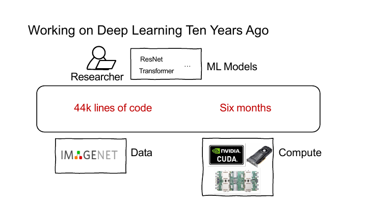
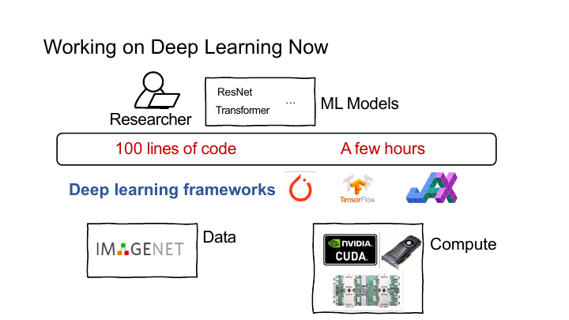

## 课程内容

一条 PyTorch 图像分类程序会把数据、网络、损失函数和优化器接在一起。继续向下拆分，程序中还藏着 CUDA 算子、计算图、自动微分、编译优化和多设备通信。

最开始直接用 PyTorch 完成 CIFAR-10 图像分类，熟悉 Tensor、`Dataset`、`DataLoader`、`nn.Module` 和优化器的配合方式。随后把 ReLU、卷积、池化和全连接写成 CUDA kernel，处理线程组织、显存布局、同步与通信。

算子能够独立运行后，还要为 Tensor 建立计算图，保存前向传播中的依赖关系，并根据链式法则生成反向传播。图编译器进一步整理算子、规划内存并选择后端实现。单机训练框架完成后，再把参数和梯度分布到多块设备与多个节点上。

## 深度学习与框架

### 数据、算力与网络

AlexNet 在 ImageNet 图像分类上展示了深层卷积网络的效果，AlphaGo 把深度网络用于策略与价值估计，StyleGAN 则用生成网络合成人脸。它们解决的问题不同，却都依赖大规模数据、可用的计算资源和能够训练的网络结构。

数据规模从 MNIST 的六万张图片增长到 ImageNet 的一千四百多万张图片，再到包含数十亿图文对的 LAION。模型随之变深、变宽，单次训练所需的矩阵乘法和卷积数量也迅速增加。GPU 提供的大量并行计算单元让这些运算能够在可接受的时间内完成。

### 框架层次

早期模型常把数据读取、前向计算、手写反向传播和设备代码混在同一个工程中。网络结构一变，算子与梯度实现也要跟着修改。



深度学习框架把常用能力分成几层。

- Python API 提供 Tensor、Module、Optimizer 和数据加载接口。
- 计算图记录算子及其依赖，供自动微分和图优化使用。
- 算子分发根据设备、数据类型和布局选择 CPU 或 GPU 实现。
- 后端把算子映射到 CUDA kernel、cuBLAS、cuDNN 或其他硬件库。
- 运行时管理显存、异步队列、跨设备通信与分布式执行。



同一段模型代码因此可以换用不同设备和后端。接口虽然简短，框架仍要完成算子选择、内存分配、执行调度与梯度计算。

## 图像分类

### 线性分类器

CIFAR-10 的彩色图片可以展平成长度为 $3072$ 的向量。线性分类器为每个类别保存一组权重，计算十个类别分数

$$
s=Wx+b
$$

其中 $W \in \mathbb{R}^{10 \times 3072}$ 表示权重矩阵， $b \in \mathbb{R}^{10}$ 表示偏置。预测类别取分数最大的下标

$$
\widehat{y}=\operatorname*{arg\,max}_c s_c
$$

线性分类器只能用一个超平面划分类别。加入隐藏层与非线性激活后，模型可以写成

$$
s=W_2\sigma(W_1x+b_1)+b_2
$$

卷积网络仍然输出类别分数，只是用卷积和池化先提取局部特征，再把特征交给分类层。

### 损失与梯度下降

训练集给出样本 $x_i$ 与标签 $y_i$ 两个值。参数的目标是让所有样本的平均损失尽量小

$$
L(W)=\frac{1}{N}\sum_{i=1}^{N}\ell\bigl(f(x_i;W),y_i\bigr)
$$

梯度指出损失上升最快的方向，因此每一步沿负梯度更新参数

$$
W\leftarrow W-\eta\nabla_W L
$$

学习率 $\eta$ 决定单次更新的步长。神经网络包含大量参数和中间变量，自动微分负责沿计算图求出 $\nabla_W L$ 这一梯度，优化器再执行参数更新。

## 第一个 PyTorch 程序

CIFAR-10 中的图片大小为 $32 \times 32$ 并分为十个类别。第一个程序依次准备数据、搭建 LeNet、计算损失和梯度，最后用优化器更新参数。

### Tensor 与数据

Tensor 是带有元信息的多维数组。数组元素存放在一段内存中，Tensor 对象还要记录这段内存应该怎样解释。

- `shape` 记录各维长度。
- `stride` 记录某一维下标增加 $1$ 时，线性地址需要跨过多少个元素。
- `dtype` 决定元素类型与单个元素占用的字节数。
- `device` 说明数据位于 CPU 还是某块 GPU。
- `data` 指向真正保存元素的内存。

```python
import numpy as np
import torch

data = [[1, 2], [3, 4]]
x_data = torch.tensor(data)

np_array = np.array(data, dtype=np.float32)
x_np = torch.from_numpy(np_array)

x_ones = torch.ones_like(x_np)
x_rand = torch.rand_like(x_np)
```

`torch.tensor` 会根据 Python 数据创建新的 Tensor。`torch.from_numpy` 通常与 NumPy 数组共享底层内存，因此修改一方可能影响另一方。共享内存省去了一次复制，也要求两边共同维护数据的生命周期。

#### Shape 与 Stride

一批彩色图片常用 `[N, C, H, W]` 表示。

- `N` 是 batch size，即这一批包含多少张图片。
- `C` 是通道数，RGB 图像通常有三个通道。
- `H` 和 `W` 分别是高度和宽度。

假设输入形状为 `[4, 3, 32, 32]`，它包含四张 $32 \times 32$ 的彩色图片。卷积层按相同规则处理这四张图片，batch 维不会参与单张图片内部的卷积。

#### Device 与数据搬运

CPU 内存与 GPU 显存属于不同的地址空间。`.to("cuda")` 可能分配一块新的显存，并把数据从主机复制到设备。

```python
device = torch.device("cuda" if torch.cuda.is_available() else "cpu")
x_gpu = x_data.to(device)
```

把每个小算子的结果来回搬运会让传输时间盖过计算时间。实际训练通常在进入循环后把输入搬到 GPU，让同一批数据在设备上连续完成多个算子，直到需要打印、保存或交给 CPU 处理时再取回结果。

### Dataset 与 DataLoader

`Dataset` 描述一个样本怎样读取，`DataLoader` 负责把样本组成 batch。两者分开后，同一份数据集可以换用不同的 batch size、打乱方式和并行加载设置。

```python
import torchvision
from torchvision import transforms

transform = transforms.Compose(
    [
        transforms.ToTensor(),
        transforms.Normalize(
            (0.5, 0.5, 0.5),
            (0.5, 0.5, 0.5),
        ),
    ]
)

train_set = torchvision.datasets.CIFAR10(
    root="./data",
    train=True,
    download=True,
    transform=transform,
)

train_loader = torch.utils.data.DataLoader(
    train_set,
    batch_size=4,
    shuffle=True,
    num_workers=2,
)
```

`ToTensor` 把图像转换为浮点 Tensor，并把通道维移到前面。`Normalize` 再按通道做线性变换。这里使用均值和标准差均为 `0.5` 的配置，像素大致会从 `[0, 1]` 映射到 `[-1, 1]`。

`shuffle=True` 会在每轮训练前打乱样本顺序。`num_workers=2` 让两个子进程准备数据，但并不表示 GPU 上只会运行两个线程。数据加载发生在 CPU 侧，与后面 CUDA kernel 的线程组织是两套机制。

### LeNet

LeNet 将局部特征逐步汇总为十个类别分数。卷积层在图像上滑动小窗口，池化层缩小空间尺寸，全连接层再把提取到的特征映射到类别空间。


```python
import torch
import torch.nn as nn
import torch.nn.functional as F


class LeNet(nn.Module):
    def __init__(self):
        super().__init__()
        self.conv1 = nn.Conv2d(3, 6, 5)
        self.pool = nn.MaxPool2d(2, 2)
        self.conv2 = nn.Conv2d(6, 16, 5)
        self.fc1 = nn.Linear(16 * 5 * 5, 120)
        self.fc2 = nn.Linear(120, 84)
        self.fc3 = nn.Linear(84, 10)

    def forward(self, x):
        x = self.pool(F.relu(self.conv1(x)))
        x = self.pool(F.relu(self.conv2(x)))
        x = torch.flatten(x, start_dim=1)
        x = F.relu(self.fc1(x))
        x = F.relu(self.fc2(x))
        return self.fc3(x)
```

`nn.Module` 会登记赋给成员变量的子模块和参数。调用 `model.parameters()` 时，PyTorch 可以沿这些成员收集所有需要训练的权重。`forward` 只写数据怎样流动，不直接处理参数更新。

以一张 $32 \times 32$ 的图片为例，第一层 $5 \times 5$ 卷积得到大小为 $28 \times 28$ 的特征图，池化后得到大小为 $14 \times 14$ 的特征图。第二组卷积和池化继续得到 $16 \times 5 \times 5$ 的特征。`flatten` 保留 batch 维，将其余三维展成长度为 $400$ 的向量，再送入全连接层。

最后一层输出的是 logits。它们可以为任意实数，也不要求所有分数相加得到 $1$ 这个值。`CrossEntropyLoss` 内部会用稳定的方式完成 LogSoftmax 和负对数似然，不应在模型末尾再手动加一次 Softmax。

### 自动微分与参数更新

前向计算过程中，只要输入或参数需要梯度，PyTorch 就会记录算子和数据依赖。损失是一个标量，`loss.backward()` 从它出发，按依赖关系的反方向应用链式法则。

```python
model = LeNet().to(device)
criterion = nn.CrossEntropyLoss()
optimizer = torch.optim.SGD(
    model.parameters(),
    lr=1e-3,
    momentum=0.9,
    weight_decay=5e-4,
)

images, labels = next(iter(train_loader))
images = images.to(device)
labels = labels.to(device)

optimizer.zero_grad()
logits = model(images)
loss = criterion(logits, labels)
loss.backward()
optimizer.step()
```

每个参数的梯度保存在 `.grad` 中。梯度默认累加，因此本轮反向传播之前要调用 `zero_grad()`，否则当前 batch 的梯度会叠在上一轮结果上。累加本身并非错误，梯度累积训练正是利用这个性质模拟更大的 batch，只是普通训练循环需要显式清零。

最朴素的梯度下降可以写成

```python
learning_rate = 1e-3

with torch.no_grad():
    for parameter in model.parameters():
        parameter -= learning_rate * parameter.grad
```

`torch.no_grad()` 防止参数更新本身进入计算图。实际训练交给 `torch.optim`，因为 Momentum、Adam、权重衰减和混合精度训练还要维护额外状态。

### 训练循环

数据、网络、损失函数和优化器准备完成后，一轮训练可以写成下面这段循环。

```python
for images, labels in train_loader:
    images = images.to(device)
    labels = labels.to(device)

    optimizer.zero_grad()
    logits = model(images)
    loss = criterion(logits, labels)
    loss.backward()
    optimizer.step()
```

每个 batch 依次经历五步。

1. `DataLoader` 从数据集中取出一批图片和标签。
2. `model(images)` 依次执行卷积、激活、池化和全连接等算子。
3. 损失函数把预测结果与标签比较，得到一个标量。
4. `backward()` 沿前向计算留下的依赖关系反向求导。
5. 优化器读取梯度，更新模型参数。

程序表面只有几次函数调用，底层已经涉及数据读取、算子执行、自动微分和参数更新。CUDA 决定算子怎样落到 GPU，计算图保存数据依赖，编译器整理和优化算子，多块设备之间还要同步参数与梯度。

`loss.backward()` 在 Python 端只表现为一次调用，框架内部却要找到反向图、准备中间 Tensor、选择设备算子、安排执行顺序，并在需要时跨设备归并梯度。
