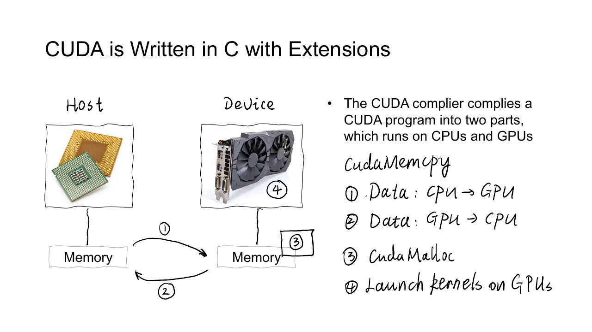
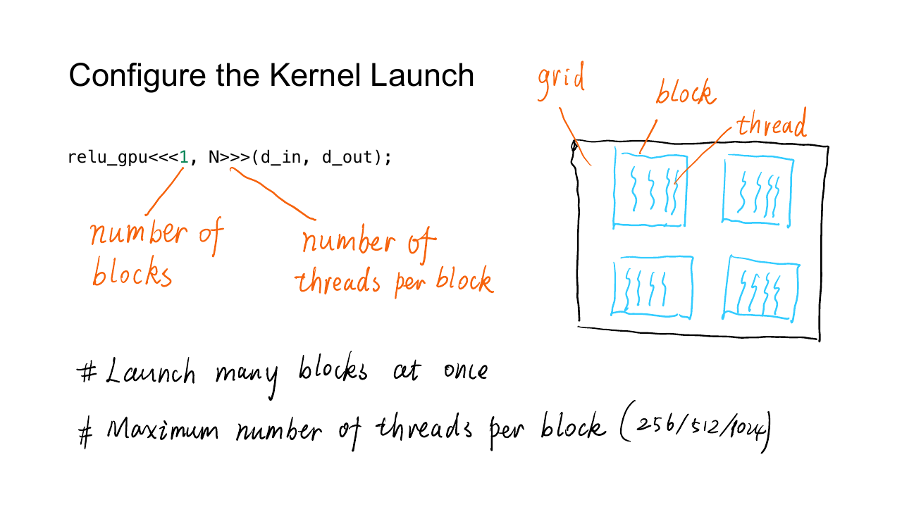
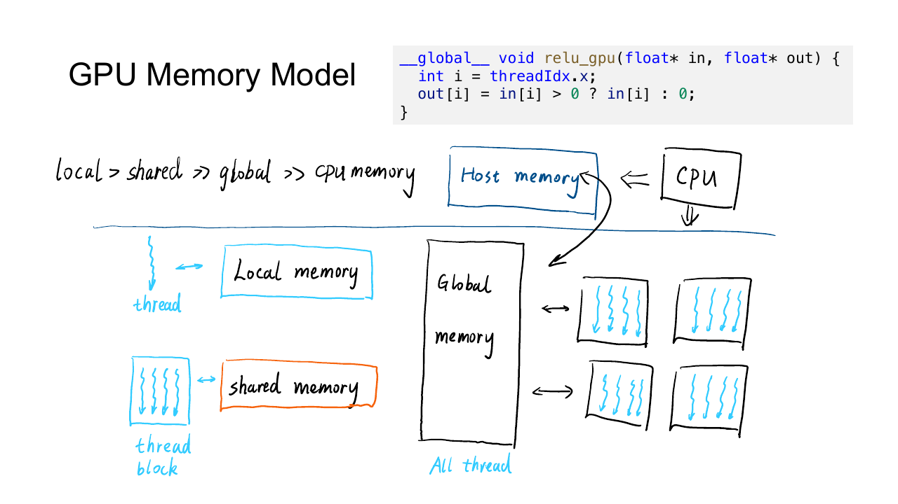
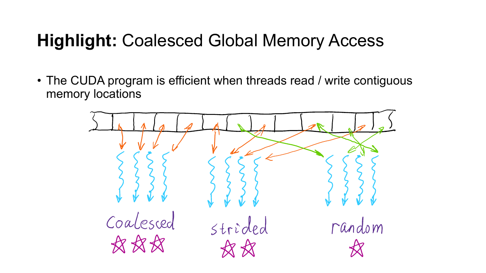

## CPU 与 GPU

提高时钟频率曾经是提升处理器性能的直接办法，但更高的频率会带来更高的功耗和散热压力。芯片上可用的晶体管仍在增加，于是计算能力的增长逐渐转向多核与并行执行。

CPU 和 GPU 对性能的取舍不同。

- CPU 希望尽快完成一条控制逻辑复杂的任务。它有较大的缓存、复杂的分支预测和乱序执行单元，擅长降低单个任务的延迟。
- GPU 希望单位时间内处理尽可能多的数据。它把更多晶体管留给计算单元，用大量线程执行结构相近的工作，擅长提高吞吐量。

GPU 并不会让任意程序自动变快。一个任务需要能拆成许多规模相近的子任务，子任务之间的依赖不能太强，而且数据传输的开销要能被足够多的计算摊薄。逐元素激活、矩阵乘法和卷积符合这些条件，复杂的递归与频繁分支通常不适合直接搬到 GPU。

## Host、Device 与显存

CUDA 程序同时包含 CPU 和 GPU 上执行的代码。CPU 一侧称为 host，GPU 一侧称为 device。



Host 负责准备输入、分配显存、发起数据复制和启动 kernel。Device 接收这些命令，用大量线程执行 kernel。一次最小的 CUDA 计算会经历以下过程。

1. 在 host memory 中准备输入。
2. 使用 `cudaMalloc` 分配 device memory。
3. 使用 `cudaMemcpy` 把输入从 host 复制到 device。
4. 启动 kernel。
5. 等待 GPU 完成，并检查执行错误。
6. 把结果复制回 host。
7. 使用 `cudaFree` 释放显存。

下面的程序用 GPU 计算一维数组的 ReLU。显存分配、数据复制、kernel launch 和结果回传都保留在代码中。

```cpp
#include <cstdio>
#include <cstdlib>
#include <cuda_runtime.h>

__global__ void relu_kernel(
    const float* input,
    float* output,
    int n
) {
    int i = blockIdx.x * blockDim.x + threadIdx.x;
    if (i < n) {
        output[i] = input[i] > 0.0F ? input[i] : 0.0F;
    }
}

int main() {
    constexpr int n = 1000;
    constexpr int bytes = n * sizeof(float);

    float* h_input = static_cast<float*>(std::malloc(bytes));
    float* h_output = static_cast<float*>(std::malloc(bytes));

    for (int i = 0; i < n; ++i) {
        h_input[i] = 0.1F * (i - 500);
    }

    float* d_input = nullptr;
    float* d_output = nullptr;
    cudaMalloc(&d_input, bytes);
    cudaMalloc(&d_output, bytes);

    cudaMemcpy(
        d_input,
        h_input,
        bytes,
        cudaMemcpyHostToDevice
    );

    constexpr int threads = 256;
    const int blocks = (n + threads - 1) / threads;
    relu_kernel<<<blocks, threads>>>(d_input, d_output, n);

    cudaDeviceSynchronize();

    cudaMemcpy(
        h_output,
        d_output,
        bytes,
        cudaMemcpyDeviceToHost
    );

    cudaFree(d_output);
    cudaFree(d_input);
    std::free(h_output);
    std::free(h_input);
}
```

把代码保存为 `relu.cu` 后，可以直接交给 `nvcc` 编译。

```bash
nvcc -O2 -std=c++17 relu.cu -o relu
./relu
```

`nvcc` 会分别处理 host 代码与 device 代码，再把两部分链接成同一个可执行文件。普通 C++ 编译器不认识 `__global__`、kernel launch 语法和设备端指令，因此不能直接用 `g++ relu.cu` 代替。项目需要面向特定 GPU 架构时，还可以通过 `-arch=sm_xx` 指定目标；`xx` 应与实际设备的 compute capability 对应。

变量名前的 `h_` 与 `d_` 只是常用命名习惯，用来区分 host pointer 和 device pointer。二者都是 C++ 指针，但 host 代码不能直接解引用普通 device pointer。把地址传给 kernel 后，GPU 才能访问对应显存。

频繁调用 `cudaMalloc` 和跨设备复制都很昂贵。深度学习框架会复用显存块，并让多个算子连续处理已经留在 GPU 上的数据。

## Kernel 与线程组织

Kernel 是从 host 启动、在 device 上执行的函数。`__global__` 声明这种函数，返回类型必须为 `void`。一次 launch 会让许多 GPU 线程从同一个函数入口开始执行，每个线程通过自己的索引找到应处理的数据。

```cpp
relu_kernel<<<blocks, threads>>>(d_input, d_output, n);
```

尖括号中的第一个参数是 grid 包含的 block 数，第二个参数是每个 block 包含的 thread 数。函数圆括号里仍然是普通参数。上面的配置为每个 block 分配 $256$ 个线程。

### Thread、Block 与 Grid

CUDA 用三级结构组织线程。

- Thread 是执行 kernel 的最小逻辑单位。
- Block 是一组能够共享片上内存并进行同步的线程。
- Grid 是一次 kernel launch 创建的全部 block。



每一级都可以是一维、二维或三维。CUDA 提供四组内置坐标。

- `threadIdx` 是 thread 在 block 内的位置。
- `blockIdx` 是 block 在 grid 内的位置。
- `blockDim` 是一个 block 的尺寸。
- `gridDim` 是整个 grid 的尺寸。

一维数组中，线程的全局编号为

$$
i=\texttt{blockIdx.x}\times\texttt{blockDim.x}
  +\texttt{threadIdx.x}
$$

假设 $n=1000$ 且每个 block 有 $256$ 个线程，需要的 block 数为

$$
\left\lceil\frac{1000}{256}\right\rceil=4
$$

四个 block 一共创建 $1024$ 个线程。最后 $24$ 个线程没有对应数据，所以 kernel 中必须保留 `if (i < n)`。向上取整的整数写法是

```cpp
const int blocks = (n + threads - 1) / threads;
```

二维图像通常让 `x` 方向对应列，`y` 方向对应行。

```cpp
dim3 block(16, 16);
dim3 grid(
    (width + block.x - 1) / block.x,
    (height + block.y - 1) / block.y
);

kernel<<<grid, block>>>(input, output, height, width);
```

Kernel 内部计算二维坐标。

```cpp
int x = blockIdx.x * blockDim.x + threadIdx.x;
int y = blockIdx.y * blockDim.y + threadIdx.y;
```

逻辑维度只是编程模型。硬件不会因为写了二维 block 就自动理解图像，最终仍要把 `(y, x)` 转换为线性内存地址。

### Grid-stride loop

线程总数不一定要与元素数完全相同。grid-stride loop 让一个线程每隔整个 grid 的线程数继续处理下一个元素。

```cpp
__global__ void relu_grid_stride(
    const float* input,
    float* output,
    int n
) {
    int i = blockIdx.x * blockDim.x + threadIdx.x;
    int stride = blockDim.x * gridDim.x;

    for (; i < n; i += stride) {
        output[i] = input[i] > 0.0F ? input[i] : 0.0F;
    }
}
```

这种写法可以限制 grid 大小，也能处理远大于当前线程数的数据。相邻线程在每轮循环中仍访问相邻元素，不会破坏合并访问。

## 异步执行

Kernel launch 通常只把任务放入 GPU 的执行队列，随后便把控制权还给 CPU。CPU 运行到下一行时，GPU 可能尚未完成 kernel。

这会带来两个常见误区。

- 用 CPU 时钟包住 kernel launch，只测到了提交命令的时间。
- launch 成功不代表 kernel 执行成功，越界访问等错误可能在后续同步时才暴露。

`cudaGetLastError` 可以检查 launch 配置等即时错误，`cudaDeviceSynchronize` 会等待设备完成，并返回执行期间出现的错误。

```cpp
relu_kernel<<<blocks, threads>>>(d_input, d_output, n);

cudaError_t launch_error = cudaGetLastError();
if (launch_error != cudaSuccess) {
    std::fprintf(
        stderr,
        "CUDA launch error: %s\n",
        cudaGetErrorString(launch_error)
    );
}

cudaError_t run_error = cudaDeviceSynchronize();
if (run_error != cudaSuccess) {
    std::fprintf(
        stderr,
        "CUDA runtime error: %s\n",
        cudaGetErrorString(run_error)
    );
}
```

调试时可以在 kernel 后同步，尽快确定错误位置。性能版本只在 host 真正需要结果、跨 stream 建立依赖或计时时同步，否则 CPU 与 GPU 无法重叠工作。

## Tensor 布局与访存

Tensor 在逻辑上是多维数组，物理上通常对应一段线性内存。形状为 `[2, 3]` 的连续 Tensor 可以按行保存六个元素，stride 为 `[3, 1]`。



位置 `[i, j]` 的线性偏移为

$$
\operatorname{offset}(i,j)=3i+j
$$

转置可以只交换 shape 与 stride，而不复制元素。原 Tensor 的 stride 为 `[3, 1]`，转置后的视图可以使用 `[1, 3]`。此时逻辑上的相邻元素在物理内存中未必相邻，这种 Tensor 称为 non-contiguous。

以一次转置为例，`transpose` 没有搬动元素，只修改了 Tensor 对存储的解释方式。

```python
x = torch.arange(6).reshape(2, 3)
y = x.transpose(0, 1)

print(x.stride())          # (3, 1)
print(y.stride())          # (1, 3)
print(y.is_contiguous())   # False
```

`view` 只允许在现有 shape、stride 与起始偏移能够表示新布局时重解释存储。对上面的 `y` 直接执行 `y.view(-1)` 会报错，因为它的逻辑顺序无法映射成一段连续区间。`y.contiguous()` 会按当前逻辑顺序复制出一份连续存储，之后才能安全地 `view`。

`reshape` 会先尝试返回 view，做不到时再创建副本，所以它能成功并不表示没有复制。`permute` 与大多数转置操作通常只改元信息，切片则可能改变 stride 和起始偏移。CUDA kernel 若只按连续数组寻址，就要在入口处要求 contiguous；需要接受任意视图时，则必须把各维 stride 纳入地址计算。

### GPU 存储层次

GPU 上的存储位置在容量、延迟、作用域和生命周期上不同。

- Register 由单个线程私有，速度快，数量有限。
- Shared memory 由同一个 block 中的线程共享，位于片上，需要程序显式组织读写。
- Global memory 对整个 device 可见，容量大，延迟也高。
- Constant memory 与 texture 路径适合特定只读和访问模式。
- Host memory 位于 CPU 侧，GPU 访问或跨总线复制的代价更高。

CUDA 文档中的 local memory 容易让人误解。它在语义上属于单个线程，但线程私有数组、过多寄存器造成的 spill 往往放在 device memory 中，延迟接近 global memory，并不等于快速的片上私有内存。

Shared memory 的常见用法是把一个 block 会重复读取的数据块从 global memory 搬到片上。每个线程负责搬一部分，所有线程等待装载完成，再复用这份数据。矩阵乘法与卷积的分块优化都建立在这个过程上。

### 合并访问

GPU 以 warp 为单位执行线程，也会把同一 warp 的 global memory 请求尽量合并。若相邻线程读取相邻地址，硬件可以用较少的内存事务取回整段数据。



下面的访问中，warp 内第 $t$ 个线程读取 `input[base + t]`，地址连续，适合合并。

```cpp
float value = input[base + threadIdx.x];
```

若每个线程读取 `input[base + 32 * t]`，相邻线程之间跨过很多元素，同一批请求会散落到多个内存段，所需事务数明显增加。

二维矩阵按行连续存储时，让 `threadIdx.x` 对应列通常能得到连续访问。若让相邻线程沿列移动，地址步长变为一整行。转置 kernel 会先将矩阵块搬入 shared memory，再交换行列坐标，使读写两侧都保持连续。
