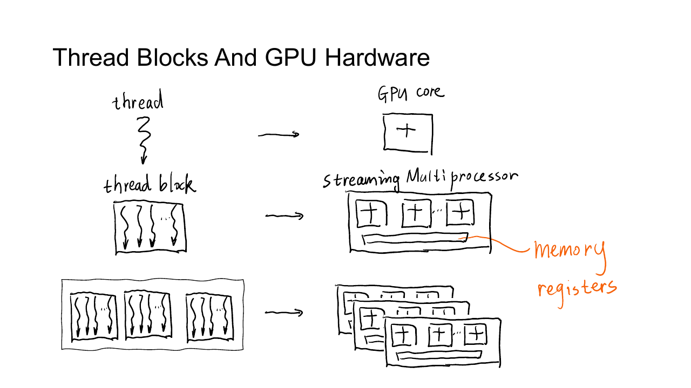
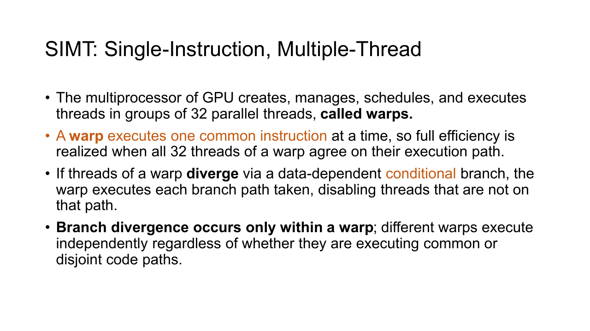
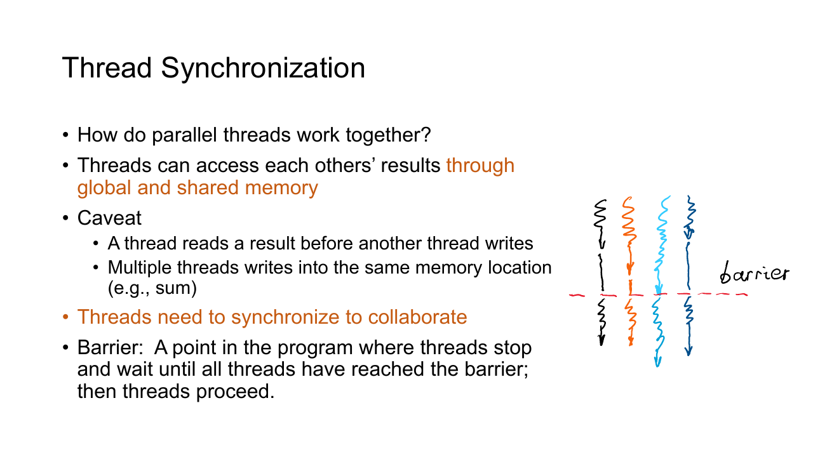
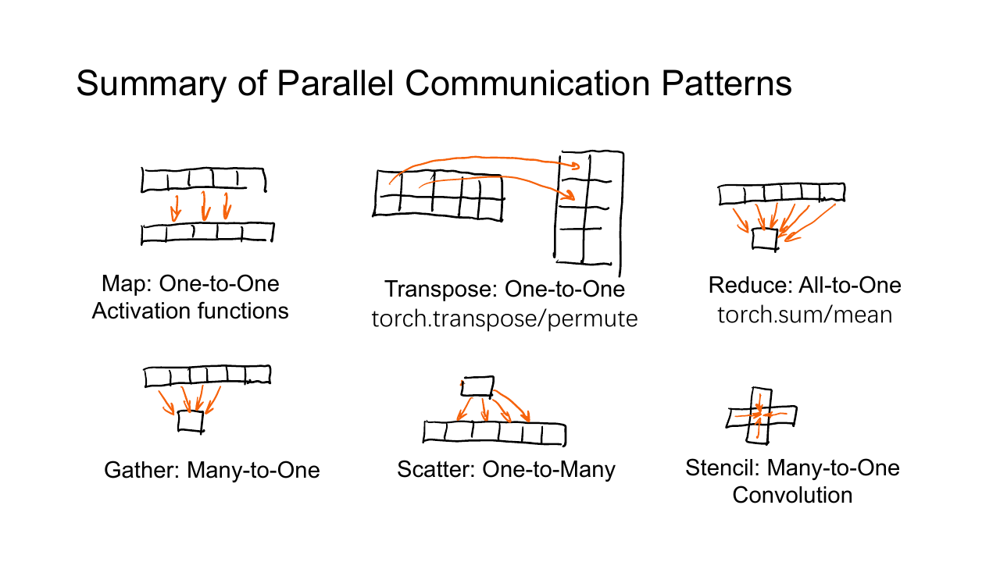

## Block、SM 与 Warp

CUDA 代码用 thread、block 和 grid 描述逻辑上的并行任务，GPU 再把 block 调度到 Streaming Multiprocessor，简称 SM。



一个 block 从开始到结束只会驻留在一个 SM 上。同一 block 的线程因此可以访问同一块 shared memory，也能使用 `__syncthreads()` 建立 barrier。不同 block 可能同时运行在不同 SM，也可能分批运行，程序不能假设它们的先后顺序。

一个 SM 可以同时驻留多个 block，具体数量受三类资源限制。

- 每个 SM 能容纳的 thread 与 block 数有上限。
- 每个 block 使用的 register 越多，同时驻留的 warp 可能越少。
- 每个 block 占用的 shared memory 越多，SM 能同时放下的 block 越少。

让更多 warp 同时驻留称为提高 occupancy。某个 warp 等待 global memory 时，调度器可以切换到另一个可运行的 warp，用并发隐藏访存延迟。Occupancy 并非越高越快，若为了提高它而减少 register 或 shared memory，反而可能增加访存。

CUDA 只保证同一 stream 中，后一个 kernel 会在前一个 kernel 完成后开始。一个 kernel 内没有普通的跨 block barrier。需要全 grid 的阶段同步时，最直接的办法是结束当前 kernel，再启动下一个 kernel。

### Warp 与 SIMT

NVIDIA GPU 通常以 $32$ 个线程组成一个 warp。调度器给一个 warp 发出一条指令，warp 中处于 active 状态的线程各自用自己的寄存器和地址执行这条指令。这种模型称为 Single Instruction, Multiple Threads，简称 SIMT。

SIMT 与把 $32$ 个标量线程机械地看成一条向量指令并不完全相同。每个线程仍有自己的程序状态，也可以访问不同地址。硬件只是在执行时把它们成组调度。

### 分支发散

同一 warp 中的线程若进入不同分支，硬件要分别执行各条路径。执行某条路径时，不属于该路径的线程暂时失活；所有路径结束后，线程再汇合。



```cpp
if (threadIdx.x % 2 == 0) {
    output[i] = left(input[i]);
} else {
    output[i] = right(input[i]);
}
```

一个 warp 中偶数线程走左侧，奇数线程走右侧，这两组工作通常不能在同一时刻完成。若前 $16$ 个线程走一条路径、后 $16$ 个线程走另一条路径，仍然会发散；只有分支边界恰好落在 warp 之间时，不同 warp 才能独立执行各自路径。

短小分支不一定值得强行消除。优化前要判断它是否位于热点、两条路径的工作量是否明显，以及编译器是否已经使用 predication。为了避免一个很小的分支而增加大量计算，收益可能更差。

## 同步与数据竞争

多个线程并发访问同一地址，并且至少一个访问是写操作时，若没有合适的同步或原子语义，结果会依赖实际执行顺序。这种错误称为 data race。

考虑相邻求和。

```cpp
__global__ void shift_sum(float* array, int n) {
    int i = blockIdx.x * blockDim.x + threadIdx.x;
    if (i + 1 < n) {
        array[i] = array[i] + array[i + 1];
    }
}
```

线程 $i$ 需要读取 `array[i + 1]`，线程 $i+1$ 却可能先把这个位置改写。于是前者有时读到旧值，有时读到新值。即使所有线程执行相同代码，也不能由源码顺序推断它们的读写顺序。

### Barrier

Barrier 把一个 block 内的执行分成阶段。所有线程都到达 `__syncthreads()` 后，任何线程才能继续执行 barrier 后的代码；barrier 前的 shared/global memory 写入也会对同 block 的线程可见。



相邻求和可以先把输入装入 shared memory，等整个 tile 装好后再读取邻居。

```cpp
__global__ void shift_sum(
    const float* input,
    float* output,
    int n
) {
    extern __shared__ float tile[];

    int local = threadIdx.x;
    int global = blockIdx.x * blockDim.x + local;

    tile[local] = global < n ? input[global] : 0.0F;
    __syncthreads();

    if (global < n) {
        float value = tile[local];
        if (local + 1 < blockDim.x && global + 1 < n) {
            value += tile[local + 1];
        }
        output[global] = value;
    }
}
```

Barrier 必须位于条件分支之外，保证 block 中全部线程都会到达。若把 `__syncthreads()` 放进 `if (global < n)`，最后一个不满的 block 只会有部分线程等待，其余线程永远不到达，kernel 可能挂起。

`__syncthreads()` 只同步当前 block。若 `array[i + 1]` 位于相邻 block，shared memory 方案还要给 tile 增加 halo，或者把计算拆成多个 kernel。Barrier 也不能修复多个线程同时更新同一 global address 的问题，因为线程越过 barrier 后仍可能同时执行读、改、写。

### 原子操作

`sum[0] += value` 在机器上至少包含读取旧值、做加法、写回新值三个步骤。两个线程可能读到同一个旧值，后写回的结果会覆盖先写回的结果。

```cpp
sum[0] += value[i];
```

`atomicAdd` 将对一个地址的 read-modify-write 作为原子操作执行，保证每份贡献都进入结果。

```cpp
atomicAdd(&sum[0], value[i]);
```

原子操作解决正确性，不代表访问可以免费并行。大量线程竞争同一个地址时，更新会被串行化。Reduce 和 Histogram 常先在 warp 或 block 内得到局部结果，再用少量原子操作合并到 global memory。

浮点加法不满足结合律。`atomicAdd` 保证更新不丢失，但不同线程的原子操作顺序仍可能变化，因此末位结果可能不完全一致。固定随机种子也不能消除所有并行浮点运算带来的非确定性。

## CUDA 计时

CPU 时钟不能直接测量异步 kernel 的执行时间。下面的写法主要测到 launch 开销。

```cpp
auto start = std::chrono::steady_clock::now();
kernel<<<blocks, threads>>>(input, output, n);
auto end = std::chrono::steady_clock::now();
```

CUDA event 会记录某个 stream 执行到指定位置的时间。结束 event 完成后，二者的时间差才是 GPU 工作经过的时间。

```cpp
cudaEvent_t start;
cudaEvent_t stop;
cudaEventCreate(&start);
cudaEventCreate(&stop);

cudaEventRecord(start);
kernel<<<blocks, threads>>>(input, output, n);
cudaEventRecord(stop);

cudaEventSynchronize(stop);

float milliseconds = 0.0F;
cudaEventElapsedTime(&milliseconds, start, stop);

cudaEventDestroy(stop);
cudaEventDestroy(start);
```

正式计时前通常先 warm up，让 CUDA context 初始化、内核模块加载和缓存建立不计入结果。每个配置重复运行多次，再报告中位数或稳定区间。

PyTorch 对 event 做了封装。

```python
start = torch.cuda.Event(enable_timing=True)
stop = torch.cuda.Event(enable_timing=True)

start.record()
output = operation(input_tensor)
stop.record()

stop.synchronize()
print(start.elapsed_time(stop))
```

## 通信模式

并行算法常反复出现几种数据流。先识别数据从哪里读、向哪里写，再决定是否需要 barrier、atomic 或 shared memory，往往比从循环语法出发更清楚。



最简单的是一对一的 **Map**。输出 `y[i]` 只依赖输入 `x[i]`，ReLU、逐元素加法和缩放都属于这种模式。每个线程独占一个位置，既不需要同步，也不会出现写冲突。它的数据流可以写成

$$
y_i=f(x_i)
$$

**Gather** 让一个输出从多个输入位置收集数据。卷积输出的一个像素读取输入中的局部窗口，Reduce 的一个局部结果读取一段数组，都属于多对一。

每个线程独占一个输出时通常没有写冲突，但同一输入可能被许多线程重复读取。规则邻域可以先装入 shared memory，减少 global memory 流量。

与之相反，**Scatter** 把一个输入贡献到多个输出位置。卷积反向传播和直方图更新常出现这种模式。多个输入可能写到同一输出，因此实现时要使用 atomic、分块归约，或者重新组织算法，让每个线程改为 gather 自己负责的输出。

选择 Gather 还是 Scatter，往往决定了同步成本。Gather 让线程负责最终输出，写入天然互斥，代价是输入可能被重复读取；Scatter 顺着输入贡献传播，读取更直接，却要处理并发累加。两种写法计算的是同一关系时，GPU 上通常优先尝试 Gather，再看重复读取能否通过缓存或 shared memory 消化。

**Stencil** 是邻域固定的 Gather。二维卷积、池化、图像滤波和有限差分都从当前位置周围的规则区域读取数据。

输入边界外的元素如何处理是 stencil 定义的一部分。可以补零、复制边缘、反射或循环读取。实现时还要给 shared memory tile 留出 halo，否则 block 边界附近的线程拿不到相邻数据。

**Transpose** 不做数值聚合，只改变索引的对应关系。对按行连续的矩阵，朴素转置读取连续、写入跨步，或者读取跨步、写入连续，无法同时照顾两侧。

Shared memory 可以充当中转 tile。线程先以连续方式读取输入，完成 block 内同步后交换行列坐标，再以连续方式写出。为了减少 shared memory bank conflict，常把方形 tile 的第二维多留一列。
