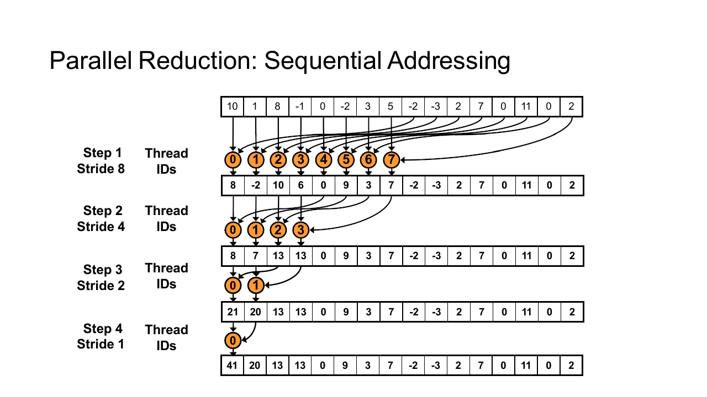
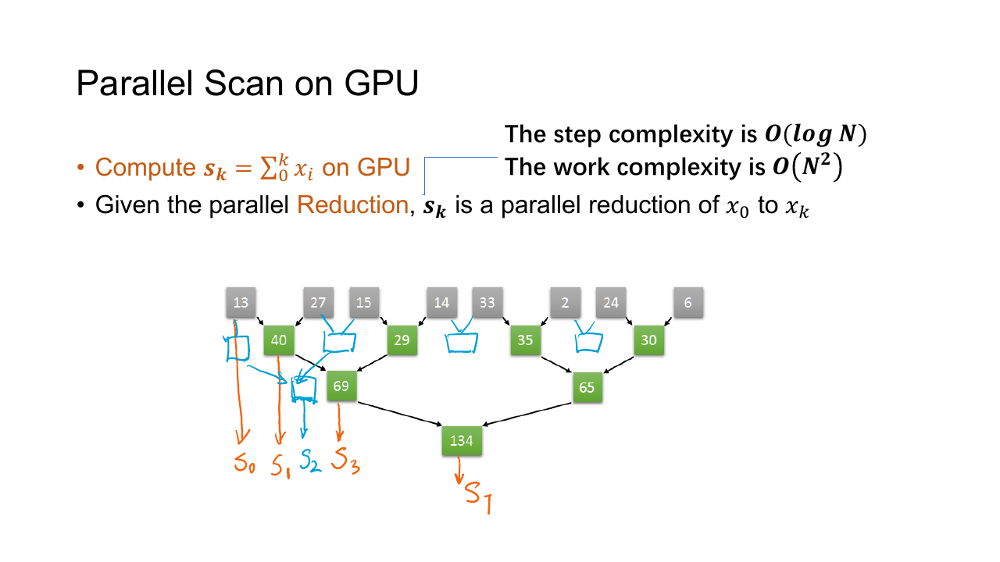
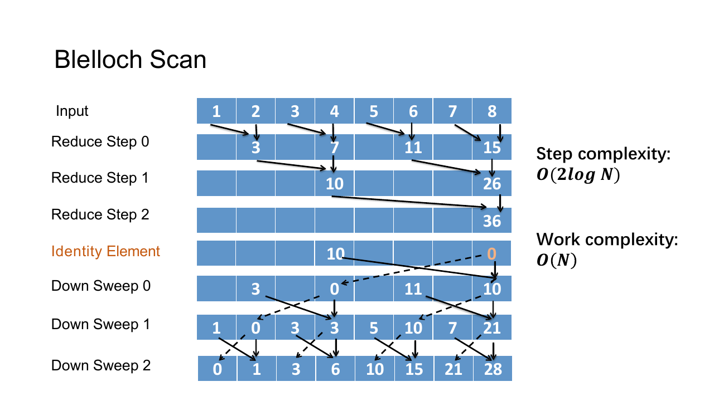
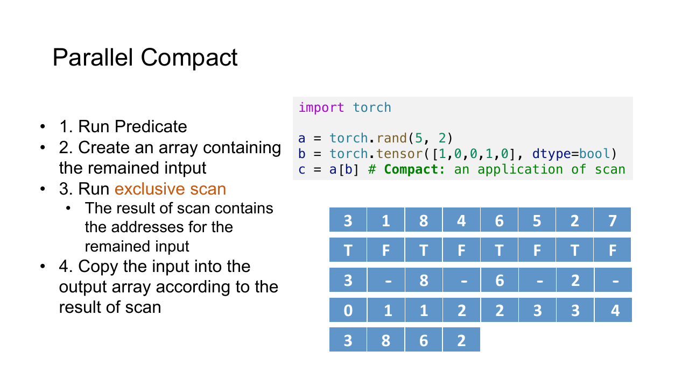
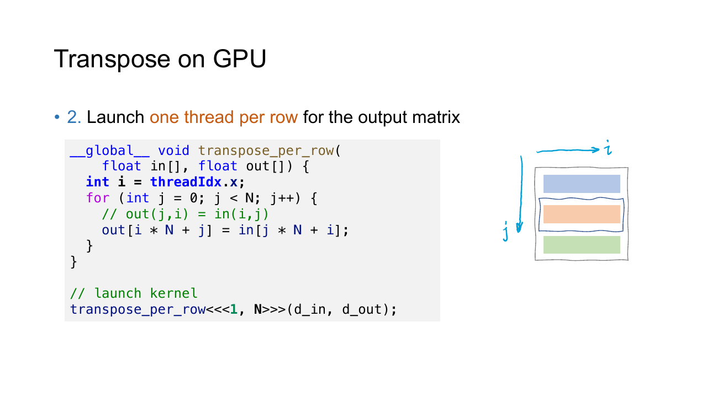

## 并行算法的代价

分析串行算法时，通常只计算总操作数。并行算法还要区分 work complexity 与 step complexity。

- Work 是所有处理单元执行的操作总数。
- Step 是拥有足够多处理单元时，关键依赖链上至少要依次经过多少步。

对 $N$ 个数求和，串行循环的 work 与 step 都是 $O(N)$ 量级。若每轮把相邻元素两两相加，问题规模会从 $N/2$ 缩小到 $N/4$ 等规模，直到只剩一个数。总 work 仍为 $O(N)$ 量级，step 降为 $O(\log N)$ 量级。

并行算法并不只追求更少的 step。若为了把 step 降低一点而让 work 从 $O(N)$ 增长到 $O(N^2)$ 的规模，处理器数量有限时可能更慢。GPU 实现还要计算 global memory 流量、同步次数和线程利用率。

## Reduce

Reduce 用一个二元运算把一组元素合并为一个结果。求和、最大值、最小值和逻辑与都属于 Reduce，可以写成

$$
r=x_0\mathbin{\circ}x_1\mathbin{\circ}\cdots\mathbin{\circ}x_{N-1}
$$

并行树会改变括号结合顺序，所以运算 $\circ$ 至少要满足结合律。浮点加法在数学上可结合，在有限精度下却会受到舍入顺序影响，因此并行求和与串行求和可能只在误差范围内相等。

### 归约树

最直接的 GPU 归约让一个 block 处理一段输入。每轮保留一半线程，每个 active thread 把另一半位置加到自己负责的位置，随后全 block 同步。



假设 block 中有八个值。第一轮完成四次加法，第二轮完成两次，第三轮完成一次。最后由 thread $0$ 写出当前 block 的局部和。

```cpp
__global__ void reduce_sum(
    const float* input,
    float* block_sum,
    int n
) {
    extern __shared__ float tile[];

    int local = threadIdx.x;
    int global = blockIdx.x * blockDim.x + local;

    tile[local] = global < n ? input[global] : 0.0F;
    __syncthreads();

    for (int stride = blockDim.x / 2;
         stride > 0;
         stride >>= 1) {
        if (local < stride) {
            tile[local] += tile[local + stride];
        }
        __syncthreads();
    }

    if (local == 0) {
        block_sum[blockIdx.x] = tile[0];
    }
}
```

启动时，动态 shared memory 的大小由第三个尖括号参数指定。

```cpp
int shared_bytes = threads * sizeof(float);
reduce_sum<<<blocks, threads, shared_bytes>>>(
    input,
    partial,
    n
);
```

一个 kernel 只能得到每个 block 的局部结果。若输入需要多个 block，host 继续对 `partial` 启动 Reduce，直到结果数只剩 $1$ 时停止。Kernel 边界同时充当全 grid 的同步点。

### 寻址

早期写法常让 active thread 的编号间隔逐轮变大。

```cpp
int index = 2 * stride * threadIdx.x;
if (index < blockDim.x) {
    tile[index] += tile[index + stride];
}
```

这种 interleaved addressing 会让一个 warp 中的 active 与 inactive 线程交错，产生分支发散，访问模式也不够规整。顺序寻址让 active thread 始终集中在 block 前半部分，线程条件写成 `local < stride`，更适合 warp 执行。

后几轮只剩一个 warp 活跃时，可以使用 warp shuffle 在寄存器之间交换值，减少 shared memory 与 block barrier。实现仍要处理 block size 不是二次幂、输入越界和不同 dtype 的精度问题。

### Histogram

Histogram 将每个输入映射到一个 bin，再累加该 bin 的计数。

```cpp
int bin = get_bin(input[i]);
atomicAdd(&histogram[bin], 1);
```

所有线程直接更新 global histogram 时，热门 bin 会产生严重竞争。常见做法是每个 block 在 shared memory 中维护一份局部 histogram，完成后再合并到 global memory。Bin 数很大时，一份局部数组可能放不进 shared memory，需要按区间分批、按 warp 私有化，或者改用排序与 Reduce。

## Scan

Scan 为每个位置计算一个前缀结果。以加法为例，inclusive scan 包含当前位置，exclusive scan 不包含当前位置。

输入为

$$
[3,1,4,2]
$$

对应的 inclusive scan 为

$$
[3,4,8,10]
$$

exclusive scan 为

$$
[0,3,4,8]
$$

串行前缀和只做 $O(N)$ 的 work，却有 $O(N)$ 的依赖链。Scan 的价值在于用额外并行工作缩短这条依赖链，并为 compact、radix sort 和稀疏矩阵等算法提供位置索引。

### Hillis-Steele Scan

Hillis-Steele scan 在第 $k$ 轮让位置 $i$ 加上距离 $2^k$ 的前驱。



对长度为 $8$ 的数组，偏移从 $1$ 开始，随后变为 $2$ 和 $4$ 的距离，三轮后得到 inclusive scan。每轮必须读取上一轮的完整结果，不能让某些线程读到同一轮刚写入的值。实现可以使用双缓冲，也可以先把旧值读进寄存器，再用 barrier 隔开读与写。

它需要 $O(\log N)$ 个 step。每一轮最多有 $N$ 个线程工作，所以总 work 达到 $O(N\log N)$ 量级。结构规整、容易实现，数据规模不大时很实用。

### Blelloch Scan

Blelloch scan 用一棵平衡树把 work 保持在 $O(N)$ 量级。



Up-sweep 阶段与 Reduce 相似。每个内部节点保存对应区间的和，树根最终得到全数组总和。为了生成 exclusive scan，先把树根设置为值 $0$ 再开始向下传播。

Down-sweep 从树根向下传播前缀。对每个内部节点，左孩子接收父节点的旧前缀，右孩子接收父前缀与左子树总和的和。经过 $2\log N$ 层后，叶子位置就是 exclusive scan。

输入长度不是二次幂时，可以补到下一个二次幂，补充值使用运算的单位元。块内 scan 完成后，每个 block 还要输出自己的区间和；再 scan 这些区间和，并把对应偏移加回各 block，才能得到全数组结果。

## Scan 的应用

### Compact

Parallel Compact 从数组中保留满足条件的元素，并把它们紧密写入输出。假设输入与保留标记为

$$
x=[7,2,9,4,5],\qquad
p=[1,0,1,0,1]
$$

对标记做 exclusive scan 得到

$$
s=[0,1,1,2,2]
$$



对满足 $p_i=1$ 的位置，把 $x_i$ 写到输出数组下标 $s_i$ 对应的位置。三个保留元素会依次占据前三个位置，得到 `[7, 9, 5]`。最后一个 scan 值与最后一个标记之和给出输出长度。

这一过程分为 predicate、scan 与 scatter 三步。Scan 先为每个保留元素分配唯一目标位置，scatter 因而没有写冲突。

### Segmented Scan

Segmented scan 在一条数组中同时计算多个彼此独立的前缀。除数值外，还要有一组 segment head 标记，说明哪些位置是新段的起点。

例如值与段起点为

$$
x=[2,1,3,4,5],\qquad
h=[1,0,1,0,0]
$$

分段 inclusive sum 的结果为

$$
[2,3,3,7,12]
$$

运算跨过 segment head 时必须丢弃左侧前缀。稀疏矩阵按行求和、按 key 聚合和批量处理不同长度序列都可以转化为 segmented scan。

## Transpose

按行连续存储的矩阵做转置时，朴素 kernel 很难让读写两侧同时连续。让相邻线程读同一行可以合并读取，但写到输出同一列时会跨步。



Shared memory tile 把操作拆成两段。

1. 线程按行从输入连续读取，写入 shared memory。
2. 全 block 同步。
3. 交换 block 与 thread 的行列坐标。
4. 从 shared memory 转置读取，按行连续写入输出。

```cpp
constexpr int tile_size = 32;

__global__ void transpose(
    const float* input,
    float* output,
    int height,
    int width
) {
    __shared__ float tile[tile_size][tile_size + 1];

    int x = blockIdx.x * tile_size + threadIdx.x;
    int y = blockIdx.y * tile_size + threadIdx.y;

    if (x < width && y < height) {
        tile[threadIdx.y][threadIdx.x] =
            input[y * width + x];
    }

    __syncthreads();

    int out_x = blockIdx.y * tile_size + threadIdx.x;
    int out_y = blockIdx.x * tile_size + threadIdx.y;

    if (out_x < height && out_y < width) {
        output[out_y * height + out_x] =
            tile[threadIdx.x][threadIdx.y];
    }
}
```

Shared memory 的第二维使用 `tile_size + 1`。多出的一列改变了转置读取时的 bank 映射，避免一个 warp 的线程集中访问同一 bank。它不保存有效矩阵元素，只用于调整片上布局。
