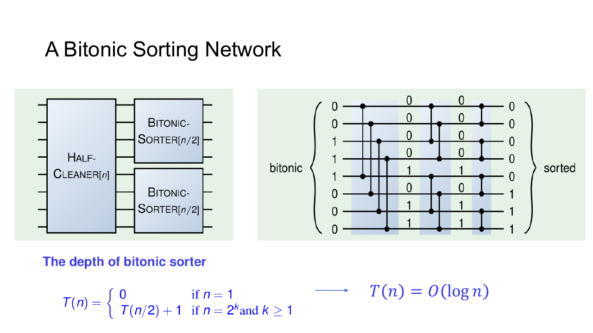
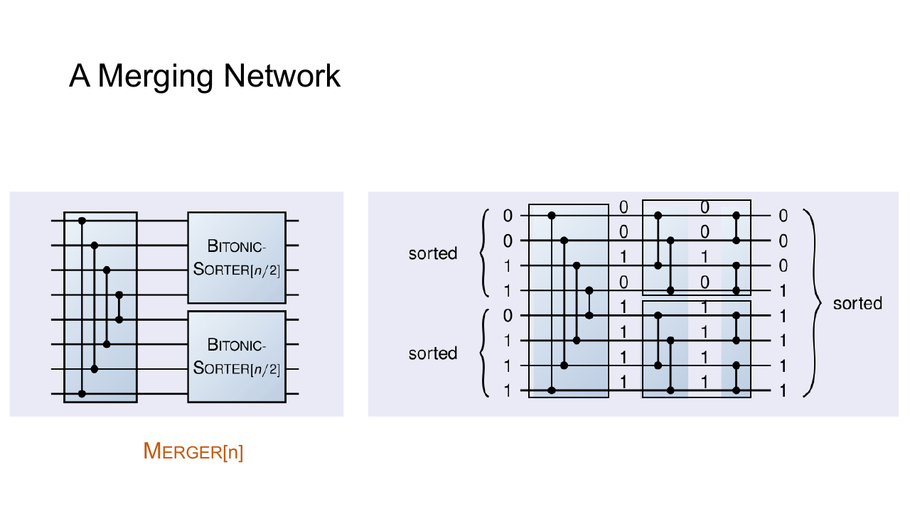
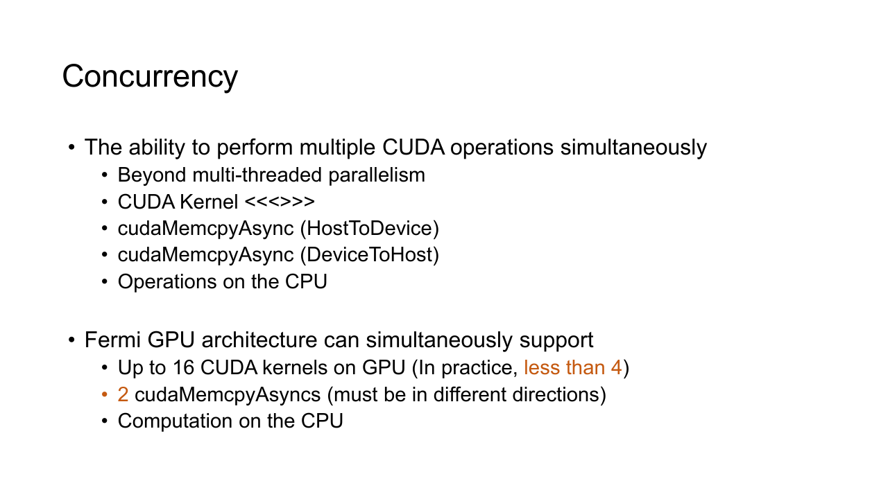
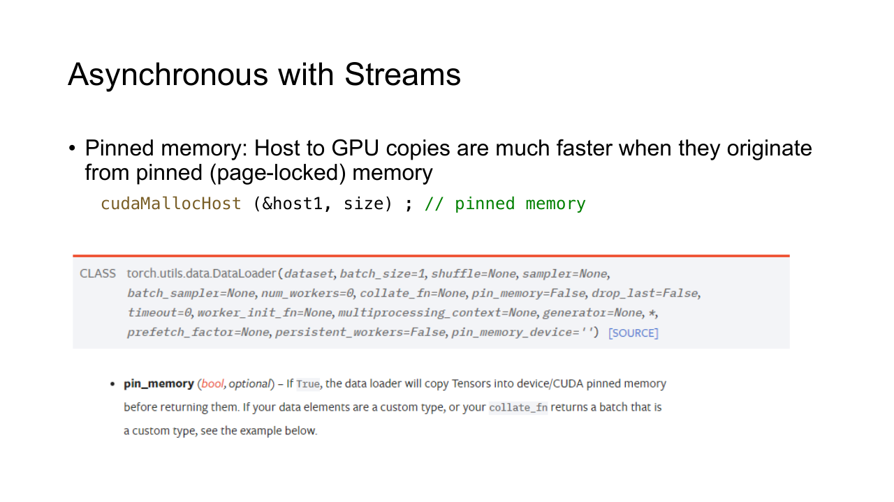

## 并行排序

串行排序常根据前一次比较的结果决定下一次比较。GPU 更喜欢事先确定每一阶段比较哪些位置，让同一阶段中的比较互不冲突。

### Brick Sort

Odd-even transposition sort 将相邻比较拆成两组。偶数阶段比较

$$
(0,1),(2,3),(4,5),\ldots
$$

奇数阶段比较

$$
(1,2),(3,4),(5,6),\ldots
$$

同一阶段的比较对没有重叠，可以各交给一个 thread。两类阶段交替执行 $N$ 轮后，所有逆序对都会被消去。

```cpp
int left = 2 * thread_id + phase;
if (left + 1 < n && data[left] > data[left + 1]) {
    swap(data[left], data[left + 1]);
}
```

它的 step complexity 为 $O(N)$ 量级，总 work 仍为 $O(N^2)$ 量级。实现简单，适合很短的序列；数据量增大后，比较次数与多轮同步会迅速压过它的便利。

### Merge Sort

Merge sort 先分别排好左右两半，再把两个有序段合并。串行递归满足

$$
T(N)=2T(N/2)+O(N)
$$

GPU 实现通常自底向上进行。第一轮把相邻单元素段合并为长度 2 的段，随后处理长度 4、8、16 的段。每轮结束后启动下一轮 kernel，kernel 边界提供阶段同步。

只让一个 thread 合并一整个长段，后期会浪费大量并行度。并行 merge 让每个 thread 负责输出中的一段。给定输出分界位置，可以在两个输入有序段上做二分查找，确定该分界左侧应分别取多少元素。这条在二维下标网格中寻找分界的路径常称为 merge path。

小段可以在 register 或 shared memory 中处理，中等段由一个 block 协作，大段再拆给多个 block。不同规模使用同一种策略，容易出现前期任务太碎、后期任务太少的问题。

### Sorting Network

排序网络由固定连接的 compare-exchange 组成。一个比较器接收两个输入 $x$ 和 $y$ 并输出

$$
\min(x,y),\qquad\max(x,y)
$$

只要两个比较器没有读写同一条线，就能位于网络的同一层并行执行。网络连接只由输入规模决定，不依赖具体数值，因此没有数据相关分支。

零一原理给出一个方便的正确性判据。若比较网络能正确排序所有零一序列，它就能排序任意全序集合。实际运行仍然处理原始值，二进制输入只用于证明网络连接是正确的。

### Bitonic Sort

Bitonic sequence 先单调增加后单调减少，循环移位后满足这一形态的序列也视为 bitonic。两个方向相反的有序段首尾连接，就能构造 bitonic sequence。

以八个元素为例，half-cleaner 比较相距四个位置的元素。每一对的较小值放在前半，较大值放在后半。处理后，上半的任意元素不大于下半的任意元素，而且上下两半仍然是 bitonic sequence。



随后分别对两半重复相同步骤。长度从 8 变为 4，再变为 2，经过 $\log N$ 层后，整个 bitonic sequence 变为有序序列。这部分结构称为 bitonic merger。



完整排序还要先构造越来越长的 bitonic sequence。第 $k$ 个阶段把长度 $2^{k-1}$ 的有序段配成长度 $2^k$ 的 bitonic 段，再执行 merger。总网络深度为 $O(\log^2 N)$ 量级。

每层比较位置固定，GPU 可以让一个 thread 负责一个 compare-exchange。实现通常要求长度为二次幂，不足部分补上正无穷或负无穷。Bitonic sort 的比较次数多于高效串行排序，但对短序列、固定大小 tile 和硬件电路很合适。

### Radix Sort

Radix sort 不比较数值大小，而是按 digit 稳定分组。二进制最低位优先排序中，每一轮处理一个 bit。

假设当前 bit 的标记为

$$
b=[0,1,0,1,1,0]
$$

先根据 $z_i=1-b_i$ 生成零标记，对 $z$ 做 exclusive scan，便得到每个零元素在前半区的目标位置。总零数确定一元素区间的起点，再对 $b$ 做 scan，得到每个一元素的位置。最后执行一次 scatter。

每轮由 Map、Scan 与 Scatter 组成。稳定性保证低位已经排好的相对顺序不会被高位打乱。对固定字长整数，轮数由每次处理的 bit 数决定。工程实现常一次处理多个 bit，以更大的局部 histogram 换取更少轮次。

## Stream

Stream 是一条有序的设备工作队列。Host 把 kernel、内存复制和 event 依次提交到 stream，同一 stream 中的工作按顺序执行。

Kernel launch 对 host 通常是异步的。异步只表示 CPU 不等待 GPU，并不表示两个 kernel 会自动并行。若它们位于同一 stream，后一个仍要等待前一个完成。

不同 stream 的工作在满足三个条件时才有机会重叠。

- 操作之间没有尚未声明的数据依赖。
- GPU 有足够的计算、copy engine 和其他资源。
- 使用的 API 与内存类型支持异步执行。

### 分块流水线

一大批数据可以切成多个 chunk。每个 chunk 依次经历 host-to-device、kernel、device-to-host 三步，不同 chunk 放入不同 stream。



```cpp
constexpr int stream_count = 3;
cudaStream_t streams[stream_count];

for (auto& stream : streams) {
    cudaStreamCreate(&stream);
}

for (int i = 0; i < stream_count; ++i) {
    cudaMemcpyAsync(
        device_input[i],
        host_input[i],
        bytes,
        cudaMemcpyHostToDevice,
        streams[i]
    );

    kernel<<<blocks, threads, 0, streams[i]>>>(
        device_input[i],
        device_output[i],
        n
    );

    cudaMemcpyAsync(
        host_output[i],
        device_output[i],
        bytes,
        cudaMemcpyDeviceToHost,
        streams[i]
    );
}
```

单个 stream 内仍保持复制、计算、复制的顺序。设备可以在 stream $0$ 计算时，为 stream $1$ 复制下一块输入，再把 stream $2$ 的结果传回 host，形成流水线。

Chunk 太小会让 launch 与调度开销占比过高，太大又会减少可重叠的阶段数。合适大小要结合传输带宽、kernel 时间和显存容量测量。

### Pinned memory

真正的异步 host-device 复制要求 host 缓冲区位于 pinned memory，也称 page-locked memory。操作系统不会把这部分物理页换出，GPU 的 DMA engine 因而可以直接访问稳定的物理地址。



```cpp
float* host_input = nullptr;
float* host_output = nullptr;

cudaMallocHost(&host_input, bytes);
cudaMallocHost(&host_output, bytes);

// 使用缓冲区

cudaFreeHost(host_output);
cudaFreeHost(host_input);
```

普通 pageable memory 传给 `cudaMemcpyAsync` 时，runtime 可能先复制到临时 pinned buffer，调用也可能出现额外阻塞。Pinned memory 占用不可换出的物理页，分配成本较高，过量使用会影响整个系统。数据管线通常维护少量长期复用的 pinned buffer。

### Event 与依赖

跨 stream 共享数据时，提交顺序本身不能建立依赖。可以在生产者 stream 记录 event，再让消费者 stream 等待该 event。

```cpp
cudaEvent_t ready;
cudaEventCreate(&ready);

produce<<<grid, block, 0, producer_stream>>>(buffer);
cudaEventRecord(ready, producer_stream);

cudaStreamWaitEvent(consumer_stream, ready);
consume<<<grid, block, 0, consumer_stream>>>(buffer);
```

`cudaStreamWaitEvent` 只阻塞 consumer stream，不阻塞 host，也不影响其他无关 stream。相比 `cudaDeviceSynchronize`，它保留了更多并行机会。

常见同步 API 的范围不同。

- `cudaDeviceSynchronize` 等待 device 上此前提交的全部工作。
- `cudaStreamSynchronize` 只等待指定 stream。
- `cudaEventSynchronize` 等待某个 event 完成。
- `cudaStreamWaitEvent` 在设备队列之间建立依赖。

排序算法描述一个 kernel 内部怎样组织比较，stream 描述多个 kernel 与数据传输怎样排队。完整 GPU 程序通常同时利用这两层并行。
