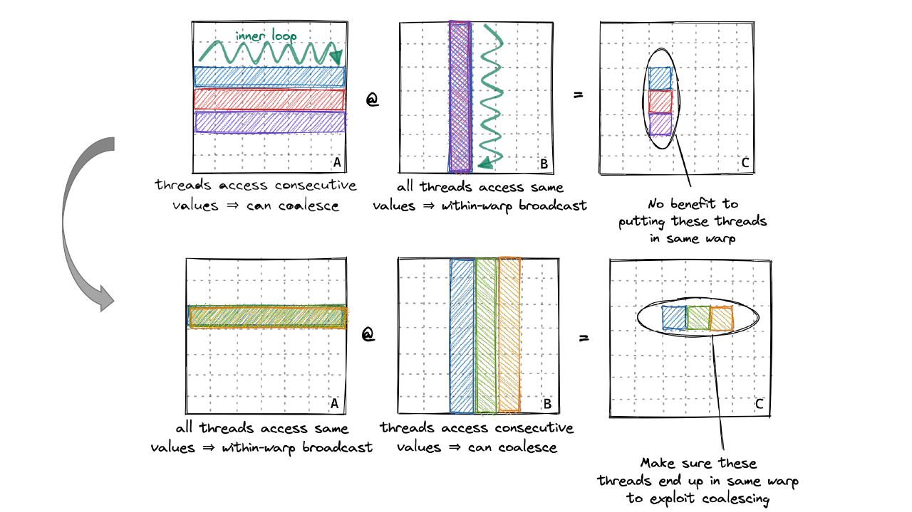
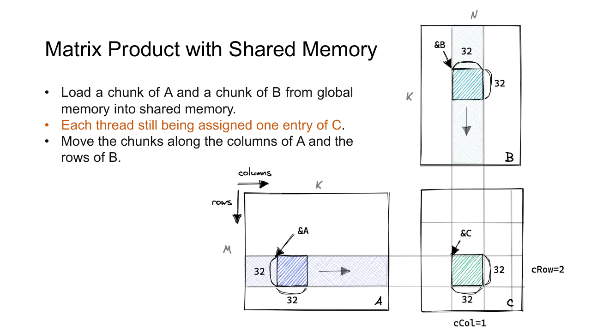
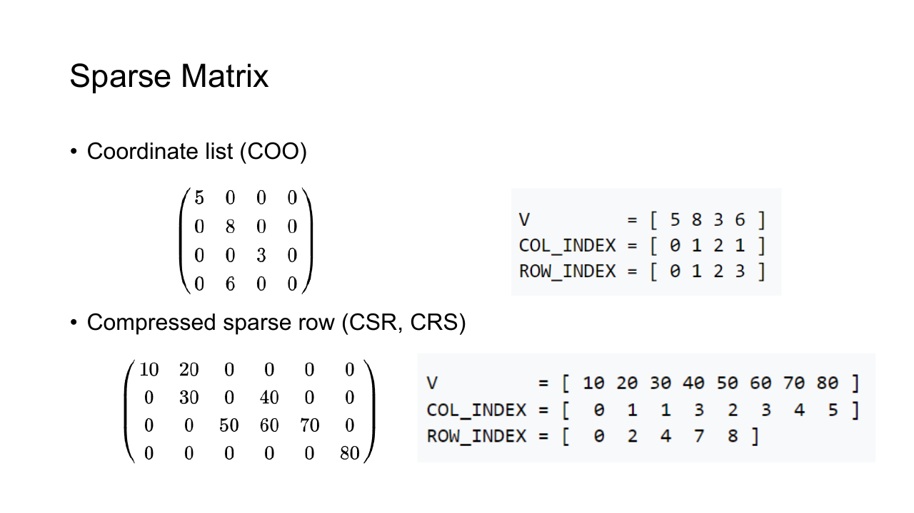
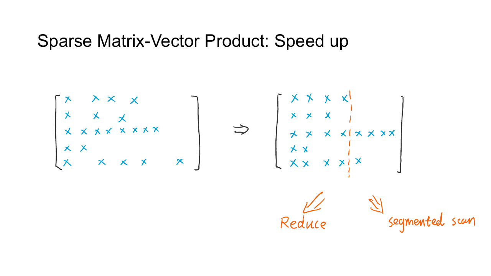
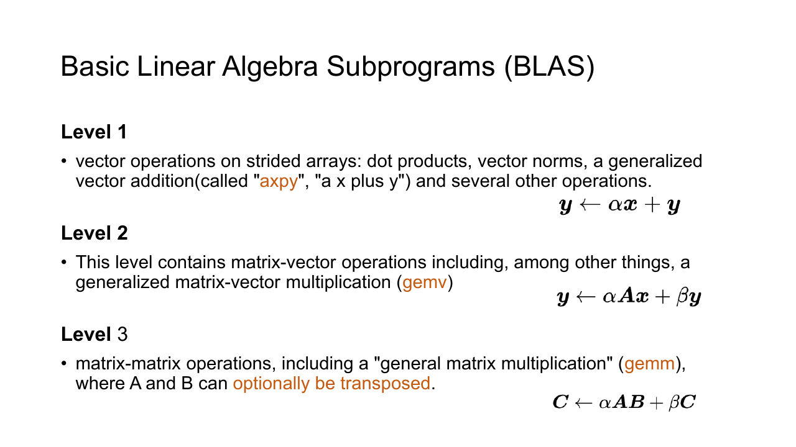

## 稠密矩阵乘法

设矩阵 $A$ 有 $M$ 行和 $K$ 列，矩阵 $B$ 有 $K$ 行和 $N$ 列，结果 $C=AB$ 的尺寸为 $M\times N$ 。其中一个输出元素为

$$
C_{i,j}=\sum_{p=0}^{K-1}A_{i,p}B_{p,j}
$$

BLAS 将更一般的形式称为 General Matrix Multiplication，简称 GEMM，其定义为

$$
C=\alpha AB+\beta C
$$

$\alpha$ 与 $\beta$ 让调用者可以在同一次操作中完成缩放和累加。全连接层、注意力中的线性投影和卷积的矩阵化实现都可以归结为 GEMM。

### 行主序

C/C++ 二维数组通常采用 row-major layout。同一行的元素在内存中连续，地址偏移为

$$
\operatorname{offset}(i,j)=iN+j
$$

下面的 CPU 实现直接对应矩阵乘法定义。

```cpp
void matmul_cpu(
    const float* a,
    const float* b,
    float* c,
    int m,
    int k,
    int n
) {
    for (int row = 0; row < m; ++row) {
        for (int col = 0; col < n; ++col) {
            float sum = 0.0F;
            for (int p = 0; p < k; ++p) {
                sum += a[row * k + p] * b[p * n + col];
            }
            c[row * n + col] = sum;
        }
    }
}
```

三重循环的 work complexity 为 $O(MKN)$ 量级。调整循环顺序不会改变运算次数，却会改变缓存与连续访存情况。上面的内层循环沿 $A$ 的一行连续前进，同时沿 $B$ 的一列跨步访问。

### 朴素 CUDA 实现

$C$ 中各元素彼此独立，可以让一个 thread 负责一个输出位置。二维 block 的 $x$ 方向对应列，并让 block 的 $y$ 方向对应行。

```cpp
__global__ void matmul_naive(
    const float* a,
    const float* b,
    float* c,
    int m,
    int k,
    int n
) {
    int row = blockIdx.y * blockDim.y + threadIdx.y;
    int col = blockIdx.x * blockDim.x + threadIdx.x;

    if (row >= m || col >= n) {
        return;
    }

    float sum = 0.0F;
    for (int p = 0; p < k; ++p) {
        sum += a[row * k + p] * b[p * n + col];
    }
    c[row * n + col] = sum;
}
```



相邻 thread 拥有相邻的 `col`，因此它们读取 `B[p * n + col]` 和写入 `C[row * n + col]` 时地址连续。它们在同一轮读取相同的 `A[row * k + p]`，硬件可以利用缓存与广播路径，但每个 block 仍会从 global memory 反复取回相同数据。

启动配置可写成

```cpp
dim3 block(16, 16);
dim3 grid(
    (n + block.x - 1) / block.x,
    (m + block.y - 1) / block.y
);

matmul_naive<<<grid, block>>>(a, b, c, m, k, n);
```

矩阵边长不是 block size 的整数倍时，边缘 block 会包含越界 thread。边界判断保证正确性，也意味着这些 block 的一部分计算资源处于空闲状态。

### Shared Memory Tiling

一个 $T\times T$ 的输出 tile 需要 $A$ 的 $T\times K$ 行片段和 $B$ 的 $K\times T$ 列片段。若每个 thread 都从 global memory 独立读取，那么 $A$ 与 $B$ 的同一元素会被同 block 的多个 thread 重复访问。

Tiling 沿 $K$ 维把输入切成宽度为 $T$ 的小块。一个 block 每轮协作加载 $A$ 与 $B$ 的两个 tile，再让每个 thread 复用 shared memory 中的数据计算部分点积。



```cpp
template<int tile_size>
__global__ void matmul_tiled(
    const float* a,
    const float* b,
    float* c,
    int m,
    int k,
    int n
) {
    __shared__ float a_tile[tile_size][tile_size];
    __shared__ float b_tile[tile_size][tile_size];

    int row = blockIdx.y * tile_size + threadIdx.y;
    int col = blockIdx.x * tile_size + threadIdx.x;
    float sum = 0.0F;

    for (int base = 0; base < k; base += tile_size) {
        int a_col = base + threadIdx.x;
        int b_row = base + threadIdx.y;

        a_tile[threadIdx.y][threadIdx.x] =
            row < m && a_col < k
                ? a[row * k + a_col]
                : 0.0F;

        b_tile[threadIdx.y][threadIdx.x] =
            b_row < k && col < n
                ? b[b_row * n + col]
                : 0.0F;

        __syncthreads();

        for (int p = 0; p < tile_size; ++p) {
            sum += a_tile[threadIdx.y][p]
                 * b_tile[p][threadIdx.x];
        }

        __syncthreads();
    }

    if (row < m && col < n) {
        c[row * n + col] = sum;
    }
}
```

第一个 barrier 保证两个 tile 已经装载完毕。第二个 barrier 防止某些 thread 提前进入下一轮并覆盖其他 thread 尚在读取的数据。

朴素实现中，一个输出 tile 每完成 $T^2K$ 次乘加，需要反复读取输入。分块后，每轮从 global memory 读取约 $2T^2$ 个元素，供 $T^2$ 个输出共同使用。Tile 越大，复用程度越高，但 thread 数、shared memory 与 register 压力也会增加。常见的 $16\times16$ 或 $32\times32$ 只是起点，生产 kernel 还会使用 register tiling、向量化加载、双缓冲和 Tensor Core。

### Roofline

Arithmetic intensity 表示每搬运一个 byte 完成多少次浮点运算。Roofline model 给出的性能上界为

$$
P\leq
\min\left(
P_{\mathrm{peak}},
I B_{\mathrm{memory}}
\right)
$$

设备峰值算力用 $P_{\mathrm{peak}}$ 表示，arithmetic intensity 用 $I$ 表示，内存带宽用 $B_{\mathrm{memory}}$ 表示。

Intensity 较低时，算子受带宽限制，减少 global memory 流量比增加算术指令更有效。Tiling 通过复用输入提高 intensity。达到计算受限区域后，继续减少少量访存不会再按比例加速，指令吞吐、Tensor Core 利用率和占用率会成为主要限制。

供应商库会针对不同矩阵形状、dtype 和架构选择专门 kernel。手写版本适合理解线程映射与数据复用，实际模型通常调用 cuBLAS 或框架中的 GEMM 后端。

## 稀疏矩阵

矩阵中只有少量非零元素时，可以省去零元素的存储和乘法。代价是额外保存索引，并承受不规则访存与负载不均衡。

考虑矩阵

$$
A=
\begin{bmatrix}
0&5&0&0\\\\
2&0&0&7\\\\
0&0&3&0
\end{bmatrix}
$$

它有四个非零元素。若矩阵并不够稀疏，索引开销和低效访存可能让稀疏运算比稠密 GEMM 更慢。



### COO

Coordinate List 为每个非零元素保存 value、row index 和 column index。上面的矩阵可以写成

```text
values = [5, 2, 7, 3]
rows   = [0, 1, 1, 2]
cols   = [1, 0, 3, 2]
```

COO 容易从一组离散坐标构造，也方便追加元素。相同行的元素未必连续，重复坐标还需要先合并。PyTorch 使用 `torch.sparse_coo_tensor` 创建这种布局。

### CSR

Compressed Sparse Row 仍保存 `values` 与 `column_indices`，但不再为每个元素重复保存行号。`row_offsets[i]` 记录第 $i$ 行从哪个非零元素开始。

```text
values         = [5, 2, 7, 3]
column_indices = [1, 0, 3, 2]
row_offsets    = [0, 1, 3, 4]
```

矩阵有三行，所以 `row_offsets` 长度为四。第 $i$ 行对应半开区间

$$
[\mathrm{row\_offsets}[i],
  \mathrm{row\_offsets}[i+1])
$$

第零行使用下标区间 `[0, 1)`，第一行使用 `[1, 3)`，第二行使用 `[3, 4)`。最后一个 offset 等于非零元素总数。

把 COO 转成 CSR 时，可以先对 row index 做 histogram，得到每行非零数，再做 prefix scan 生成 `row_offsets`。PyTorch 对应接口为 `torch.sparse_csr_tensor`。

### SpMV

Sparse Matrix-Vector Multiplication，简称 SpMV。每个非零元素先与向量对应位置相乘，随后把同一行的乘积相加。



COO 可以执行一次 Map，再按 row index 做 segmented reduction。CSR 已经把每行元素放在连续区间中，可以让一个 thread、warp 或 block 负责一行。

行长度差异很大时，固定每行一个 warp 会让短行浪费 lane，长行拖慢整个任务。常见实现会把长行切段，把短行打包，或者根据统计信息选择不同 kernel。工程中通常调用 cuSPARSE。

## CUDA 数值库

CUDA 生态为常见基础操作提供了成熟实现。

- Thrust 提供与 STL 相似的并行容器和算法。
- cuBLAS 实现稠密线性代数。
- cuSPARSE 实现稀疏线性代数。
- cuDNN 实现卷积、池化和归一化等神经网络算子。
- cuRAND 在 device 上生成随机数。
- TensorRT 面向推理优化与部署。

### Thrust

`thrust::host_vector` 与 `thrust::device_vector` 分别管理 host 和 device memory。容器析构时会释放资源，二者之间的赋值会触发跨设备复制。

```cpp
#include <thrust/device_vector.h>
#include <thrust/host_vector.h>
#include <thrust/reduce.h>
#include <thrust/scan.h>
#include <thrust/sort.h>

thrust::host_vector<int> host{3, 1, 4, 1, 5};
thrust::device_vector<int> device = host;

thrust::sort(device.begin(), device.end());
thrust::inclusive_scan(
    device.begin(),
    device.end(),
    device.begin()
);
int sum = thrust::reduce(
    device.begin(),
    device.end(),
    0
);
```

逐个读取 `device[i]` 会在 host 与 device 之间传递单个元素，不应放进循环。应把完整计算交给 `transform`、`reduce`、`scan` 与 `sort`，最后一次性复制结果。

### BLAS



- Level 1 处理向量与向量，例如 AXPY，work 为 $O(N)$ 量级。
- Level 2 处理矩阵与向量，例如 GEMV，work 为 $O(N^2)$ 量级。
- Level 3 处理矩阵与矩阵，例如 GEMM，work 为 $O(N^3)$ 量级。

Level 3 的每个输入元素能参与更多运算，数据复用空间最大，也最容易接近设备峰值算力。

cuBLAS 使用 handle 保存库的执行上下文。Handle 应长期复用，并在结束时销毁；每次矩阵乘都重新创建会引入不必要的开销。

```cpp
cublasHandle_t handle;
cublasCreate(&handle);

// 多次调用 cublasSgemm 或 cublasGemmEx

cublasDestroy(handle);
```

传统 cuBLAS 接口默认按 column-major 解释矩阵。输入来自 row-major C 数组时，需要交换操作数并调整转置参数，或使用支持显式 layout 的 cuBLASLt。矩阵形状恰好对上不代表内存解释正确，调用前应先用小矩阵与 CPU reference 对拍。

cuRAND 同样使用显式 generator。随机数直接写入 device memory，种子决定伪随机序列。

```cpp
curandGenerator_t generator;
curandCreateGenerator(
    &generator,
    CURAND_RNG_PSEUDO_DEFAULT
);
curandSetPseudoRandomGeneratorSeed(generator, seed);
curandGenerateUniform(generator, data, count);
curandDestroyGenerator(generator);
```

## 全连接层

PyTorch 的线性层计算

$$
Y=XW^\mathsf{T}+b
$$

若输入形状为 `[N, C, H, W]`，进入全连接层前通常保留 batch 维，把其余维度展平。

```python
x = torch.flatten(x, start_dim=1)
x = torch.nn.functional.linear(x, weight, bias)
```

`torch.nn.Linear(in_features, out_features, bias=True)` 会创建并登记权重与偏置。设损失对输出的梯度为 $G=\partial L/\partial Y$ ，反向传播需要计算

$$
\begin{aligned}
\frac{\partial L}{\partial X}&=GW,\\\\
\frac{\partial L}{\partial W}&=G^\mathsf{T}X,\\\\
\frac{\partial L}{\partial b}&=\sum_{i=1}^{N}G_{i,:}
\end{aligned}
$$

若 $X$ 的形状为 `[N, in_features]`， $W$ 的形状为 `[out_features, in_features]`，则 $G$ 的形状为 `[N, out_features]`。输入梯度和权重梯度都是矩阵乘法，bias 梯度则沿 batch 维把每个输出通道的贡献相加。

框架需要保留前向时的输入 $X$ 与权重 $W$ ，反向 kernel 才能得到上面两次 GEMM 的操作数。只冻结 bias 不会省掉权重梯度的矩阵乘法；冻结整层权重后，才可以跳过 $\partial L/\partial W$ 与 $\partial L/\partial b$ 的计算。

全连接层让每个输出与全部输入相连，参数量为 `in_features * out_features`。卷积层通过局部连接与空间权重共享减少参数，而全连接层没有这种结构先验。
