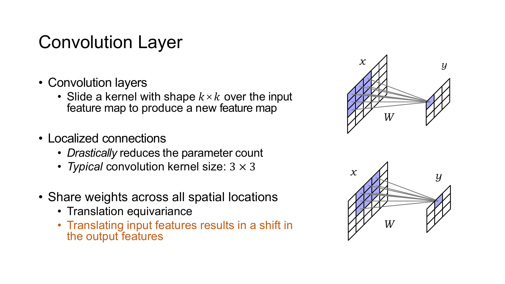
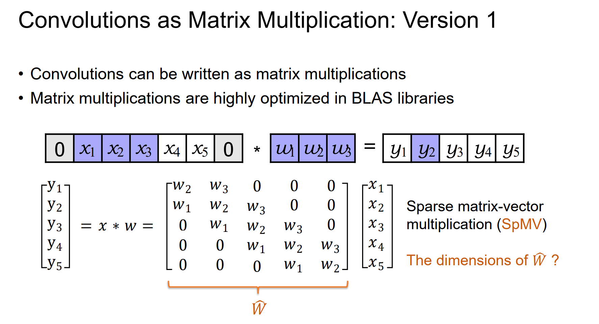
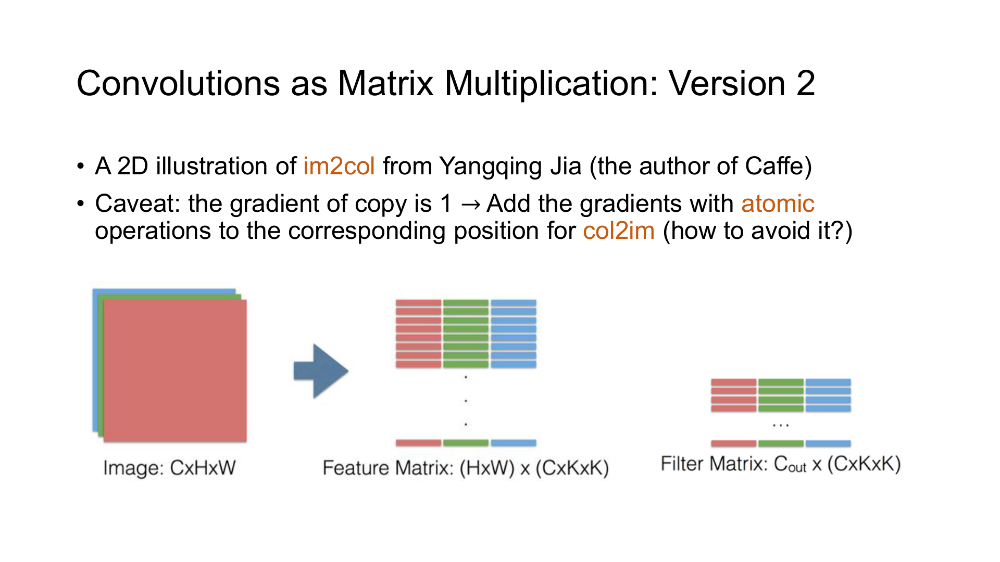
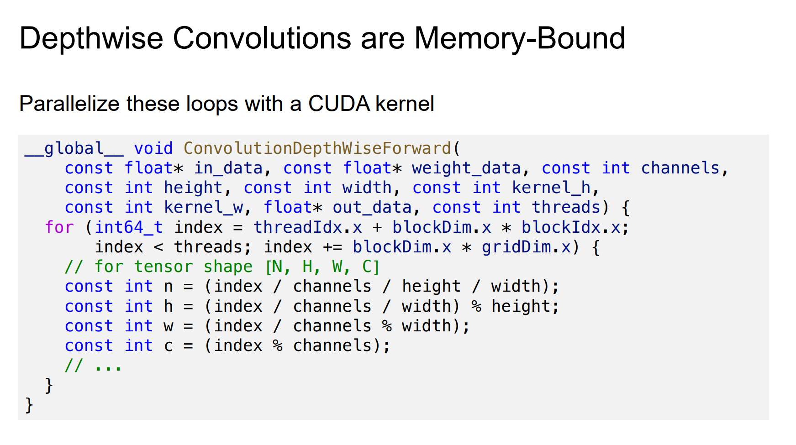
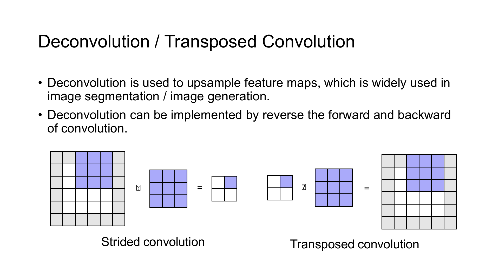
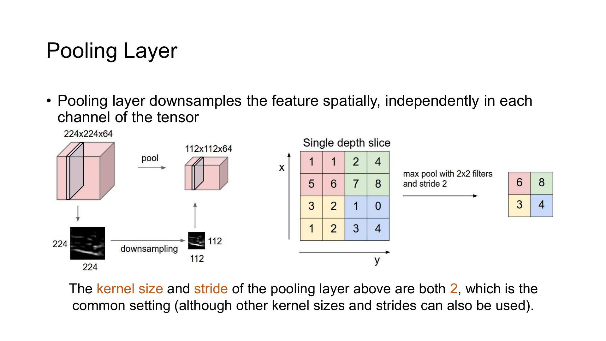
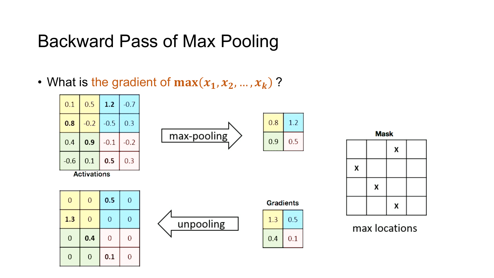
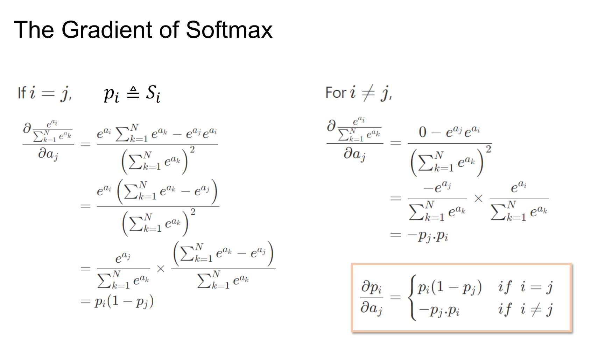
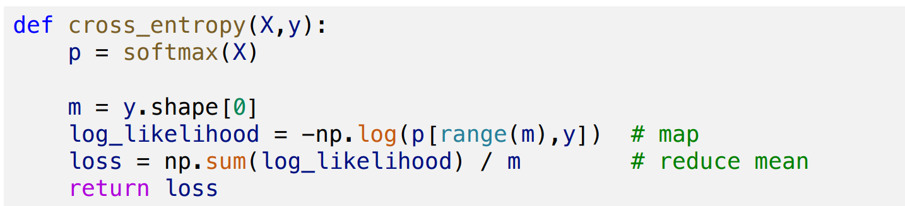
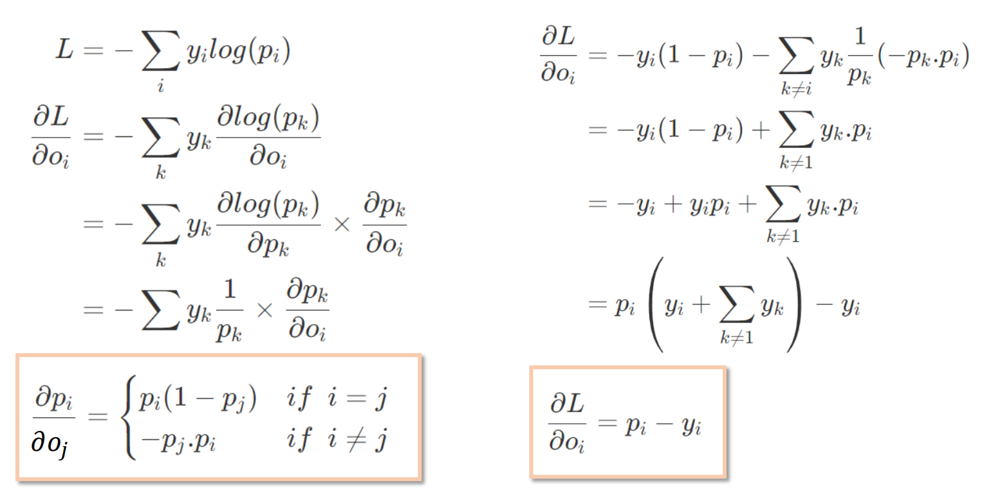

## 卷积

二维卷积让一个小窗口在输入上滑动。窗口每到一个位置，就把覆盖区域与卷积核逐元素相乘并求和，得到一个输出元素。



对单通道输入，用 $W$ 表示 $3\times3$ 卷积核。当前窗口左上角坐标取 $(h,w)$ 时，输出为

$$
Y_{h,w} =
\sum_{i=0}^{2}
\sum_{j=0}^{2}
W_{i,j}X_{h+i,w+j}
$$

同一组 $W$ 会用于所有空间位置，这称为 weight sharing。全连接层要为每对输入、输出分别保存权重，卷积只连接局部窗口并复用参数，因此更适合图像。

输入平移后，输出特征也随之平移，这一性质称为 translation equivariance。它并不等于平移不变。只有继续做全局聚合、池化或其他丢弃位置信息的操作，最终表示才可能对小幅平移近似不变。

深度学习框架的 `conv2d` 实际执行 cross-correlation，不会把 kernel 先上下、左右翻转。网络训练会直接学到适合这一约定的权重，所以命名差异不影响使用。

### Batch 与 Channel

一批二维特征图的输入形状为 `[N, C_in, H, W]`。

- $N$ 是 batch size。
- $C_{\mathrm{in}}$ 是输入通道数。
- $H$ 与 $W$ 是空间高度和宽度。

权重形状为 `[C_out, C_in, K_H, K_W]`。一个输出通道拥有 $C_{\mathrm{in}}$ 个二维 kernel，它们分别处理各输入通道，最后沿通道求和。输出形状为 `[N, C_out, H_out, W_out]`。

用 $S$ 表示 stride，用 $D$ 表示 dilation，用 $P$ 表示 padding，输出元素为

$$
Y_{n,o,h,w} =
b_o
+
\sum_{c=0}^{C_{\mathrm{in}}-1}
\sum_{i=0}^{K_H-1}
\sum_{j=0}^{K_W-1}
W_{o,c,i,j}
X_{n,c,hS_H+iD_H-P_H,wS_W+jD_W-P_W}
$$

超出输入边界的位置按 padding 规则处理。输出高度为

$$
H_{\mathrm{out}} =
\left\lfloor
\frac{
H+2P_H-D_H(K_H-1)-1
}{
S_H
}
+1
\right\rfloor
$$

宽度同理。对于 $3\times3$ kernel，stride、padding 与 dilation 分别取 1、1、1 时，空间尺寸保持不变。

### 步幅与填充

Stride 决定窗口每次移动几格。Stride 为 $2$ 时，输出高宽大约减半，卷积同时完成特征提取与下采样。

Dilation 决定 kernel 相邻采样点之间的间隔。以 $3\times3$ kernel 为例，dilation 取 2 时覆盖的有效范围是 $5\times5$ 大小，参数数量仍为九个。

Padding 为边界附近的窗口提供输入。常见方案包括

- `constant` 使用常数填充，卷积中通常补零；
- `reflect` 从边界向内反射；
- `replicate` 复制边缘像素；
- `circular` 从另一侧循环取值。

边界规则会改变图像边缘的响应。训练与推理应使用同一种规则。

PyTorch 接口为

```python
torch.nn.functional.conv2d(
    input,
    weight,
    bias=None,
    stride=1,
    padding=0,
    dilation=1,
    groups=1,
)
```

## 卷积的矩阵化

朴素卷积包含 batch、输出通道、输入通道、输出坐标与 kernel 坐标等多层循环。直接写 CUDA kernel 可以完成计算，但成熟 GEMM 已经对缓存、shared memory、向量指令和 Tensor Core 做了大量优化。许多卷积实现会先改变数据布局，再调用矩阵乘法。

### 稀疏矩阵表示

将输入与输出全部展平后，卷积可以写成线性变换。矩阵的一行记录某个输出位置需要读取哪些输入元素，其余位置为零。



这张稀疏矩阵不对应一份新的可训练参数。卷积核中的同一个系数会出现在许多行中，因为它要作用于所有合法的空间位置。矩阵中看似不同的非零元，可能都对应卷积核里的同一个坐标，这正是 weight sharing 在矩阵表示中的样子。

设展开后的算子为 $\widetilde{W}$ ，前向传播可以写成 $Y=\widetilde{W}X$ 。输入梯度使用转置算子 $\widetilde{W}^\mathsf{T}$ ，它会把所有覆盖同一输入像素的输出梯度累加回来。Padding、stride 与 dilation 改变的只是非零元落在矩阵中的位置。

权重梯度还多一步归并。所有引用同一个卷积核系数的矩阵位置都共享一份参数，因此这些位置产生的梯度必须按 kernel 坐标求和，不能把它们当成彼此独立的矩阵元素更新。并行实现可以让线程先产生局部贡献，再用 Reduce 或按 key 的 segmented reduction 完成累加。

这种表示适合推导前向和反向关系，却不适合直接构造。矩阵中绝大多数元素为零，即使改成稀疏格式，索引与间接访存也会吞掉卷积规则结构带来的好处。稠密卷积通常采用 direct kernel、implicit GEMM 或 im2col，而不会真的保存 $\widetilde{W}$ 。

### Im2col

Im2col 不展开权重矩阵，而是把输入中的每个滑动窗口复制为一列。



若卷积窗口展开后的长度为

$$
K=C_{\mathrm{in}}K_HK_W
$$

每张图片共有 $H_{\mathrm{out}}W_{\mathrm{out}}$ 个窗口。把 batch 一并展开后，得到形状为

$$
K\times
\left(
NH_{\mathrm{out}}W_{\mathrm{out}}
\right)
$$

这就是展开矩阵 $\widetilde{X}$ 的尺寸。权重展开后的尺寸为 $C_{\mathrm{out}}\times K$ 大小，前向传播变成

$$
Y=W\widetilde{X}
$$

原来七层循环的大部分索引工作被移到 im2col，数值计算交给 GEMM。

Im2col 会复制重叠窗口。Stride 为 $1$ 的 $3\times3$ 卷积中，一个内部像素可能出现在九个窗口里，因此 $\widetilde{X}$ 会远大于原输入。它实现简单、容易复用高性能 GEMM，代价是额外工作区和内存流量。cuDNN 会根据形状、dtype、workspace 限制与硬件选择 direct、implicit GEMM 或其他算法，不会固定使用显式 im2col。

### 前向与反向

前向计算为

$$
Y=W\widetilde{X}+b
$$

给定记作 $\partial L/\partial Y$ 的上游梯度，权重梯度为

$$
\frac{\partial L}{\partial W} =
\frac{\partial L}{\partial Y}
\widetilde{X}^{\mathsf T}
$$

展开后输入的梯度为

$$
\frac{\partial L}{\partial\widetilde{X}} =
W^{\mathsf T}
\frac{\partial L}{\partial Y}
$$

Col2im 再把 $\partial L/\partial\widetilde{X}$ 放回原输入布局。多个窗口会覆盖同一输入位置，这些贡献必须相加。GPU 可以使用 atomic add，也可以重新分配任务，让每个 thread gather 自己负责的输入梯度。

Bias 对同一输出通道的所有 batch 与空间位置共享，因此 bias 梯度沿 batch、高度和宽度三个维度做 Reduce。

## 卷积变体

### 分组卷积

`groups` 把输入、输出通道划分为互不连接的组。普通卷积使用 `groups=1`，每个输出通道读取全部输入通道。

当 `groups=C_in` 且 $C_{\mathrm{out}}$ 是 $C_{\mathrm{in}}$ 的整数倍时，每组只包含一个输入通道，这就是 depthwise convolution。若输入、输出通道数相同，权重形状可以看成 `[C_in, 1, K_H, K_W]`。

普通卷积的一个输出元素需要 $C_{\mathrm{in}}K_HK_W$ 次乘法，depthwise convolution 只需 $K_HK_W$ 次。



Depthwise convolution 不混合不同通道，通常再接一个 $1\times1$ pointwise convolution。Pointwise convolution 负责通道组合，depthwise convolution 负责空间邻域，两者合称 depthwise separable convolution。

计算量减少后，算子可能从 compute-bound 变为 memory-bound。理论 FLOPs 很低并不保证实际延迟按同样比例下降，布局转换和 kernel launch 的占比会变大。

### 转置卷积

普通卷积展平后可以写成线性变换

$$
Y=WX
$$

其输入梯度为

$$
\frac{\partial L}{\partial X} =
W^\mathsf{T}
\frac{\partial L}{\partial Y}
$$

Transposed convolution 把 $W^\mathsf{T}$ 对应的数据流当作新的前向算子。Stride 大于 $1$ 时，一个输入元素会向更大的输出平面散射贡献，重叠位置需要累加。



设输入高度为 $H_{\mathrm{in}}$ ，stride、padding、dilation、kernel size 与 output padding 分别为 $S_H$ 、 $P_H$ 、 $D_H$ 、 $K_H$ 与 $O_H$ ，输出高度为

$$
H_{\mathrm{out}} =
\left(H_{\mathrm{in}}-1\right)S_H
-2P_H
+D_H\left(K_H-1\right)
+O_H
+1
$$

普通卷积可能把不同大小的输入压到同一个输出尺寸，因此仅凭输出无法反推出原输入尺寸。`output_padding` 用来在这些候选尺寸中选定一个结果，只改变输出 shape，不会真的在结果边缘补上一圈数值。

转置卷积常用于图像分割与生成模型中的上采样，但不能恢复普通卷积已经丢掉的信息。名称中的 transposed 指线性变换矩阵的转置，不表示它是卷积的逆运算。

## Pooling

Pooling 在每个通道内独立聚合局部窗口，不混合通道，也没有需要训练的 kernel 权重。若 $\Omega_{p,q}$ 表示输出位置 $(p,q)$ 对应的窗口，Max Pooling 与 Average Pooling 分别计算

$$
\begin{aligned}
Y^{\mathrm{max}}_{n,c,p,q}
&=
\max_{(i,j)\in\Omega_{p,q}}X_{n,c,i,j}
\\
Y^{\mathrm{avg}}_{n,c,p,q}
&=
\frac{1}{|\Omega_{p,q}|}
\sum_{(i,j)\in\Omega_{p,q}}X_{n,c,i,j}
\end{aligned}
$$

Max Pooling 保留窗口中最强的响应，Average Pooling 则把窗口整体压成均值。最常见的窗口大小为 $2\times2$ 且 stride 取 2，输入的 batch 与 channel 数保持不变，高宽各缩小一半。小范围内的响应位置发生偏移时，最大值可能仍然不变，但这不等于整张特征图已经获得平移不变性。



设高度方向的 kernel size、stride、padding 与 dilation 分别为 $K_H$ 、 $S_H$ 、 $P_H$ 与 $D_H$ ，默认向下取整时的输出高度为

$$
H_{\mathrm{out}} =
\left\lfloor
\frac{
H+2P_H-D_H\left(K_H-1\right)-1
}{S_H}
+1
\right\rfloor
$$

宽度按同一方式计算。窗口通常互不重叠，但 stride 小于 kernel size 时也可以重叠；stride 大于 kernel size 时，部分输入位置不会进入任何窗口。

```python
torch.nn.functional.max_pool2d(
    input,
    kernel_size,
    stride=None,
    padding=0,
    dilation=1,
    ceil_mode=False,
    return_indices=False,
)
```

输入采用 `[N, C, H, W]` 这一布局。`kernel_size`、`stride`、`padding` 与 `dilation` 都可以分别指定高、宽两个方向；`stride` 省略时默认等于 `kernel_size`。Max Pooling 的 padding 按负无穷处理，边界外的值不会压过一个全为负数的有效窗口。

`ceil_mode=True` 使用向上取整，允许最后一个窗口从有效输入内开始，即使它的右侧或下侧越过边界。Average Pooling 还要决定边界窗口的除数，PyTorch 用 `count_include_pad` 控制 padding 是否参与计数。

前向 CUDA kernel 可以让一个 thread 负责一个输出元素。Thread 先由线性 index 解出 $(n,c,p,q)$ ，再扫描对应窗口。Max Pooling 同时写出最大值与 argmax，Average Pooling 只需累加并除以窗口中的计数。

Max Pooling 的反向传播把上游梯度送回前向选中的 argmax，窗口中其他位置得到零。若窗口中有多个相同最大值，反向仍沿前向记录的那个位置传递，因此 value 与 index 必须使用同一次前向结果。



Average Pooling 的梯度会平均分给窗口内的输入。若一个窗口包含 $k$ 个计入均值的元素，上游梯度 $g$ 对每个元素贡献 $g/k$ 。边界是否把 padding 纳入 $k$ ，必须与前向使用同一约定。

窗口互相重叠时，同一输入元素可能接收多个输出窗口的梯度，这些贡献需要累加。按输出位置分配 thread 会自然形成 scatter，写回重叠输入时可能需要 atomic add；按输入位置分配 thread 则要反查覆盖它的所有窗口，改成 gather。

`return_indices=True` 保存的 argmax 还可以交给 Max Unpooling，把池化结果放回较大的稀疏平面。它的数据流与 Max Pooling 的反向传播相似，但用途不同，也无法补回前向时丢弃的非最大元素。

卷积与池化都属于 stencil。每个输出从规则邻域 gather 数据，邻域较大或窗口重叠较多时，可以用 shared memory tile 复用输入。

## 分类输出与损失

### Softmax

分类网络输出的 logits 没有范围限制。Softmax 将一行 logits 变为和为 1 的正数，其定义为

$$
p_i =
\frac{e^{z_i}}
{\sum_j e^{z_j}}
$$

指数函数很容易上溢。令行最大值为 $m=\max_j z_j$ 并利用 Softmax 的平移不变性，可以改写为

$$
p_i =
\frac{e^{z_i-m}}
{\sum_j e^{z_j-m}}
$$

减去最大值后，最大的指数为 1，其余指数也不超过 1。CUDA 上的一行 Softmax 包含 row max、指数变换、row sum 与归一化。短行可以由一个 warp 负责，长行需要 block 级或多阶段 Reduce。

Softmax 的 Jacobian 为

$$
\frac{\partial p_i}{\partial z_j} =
p_i(\delta_{ij}-p_j)
$$



### Cross Entropy

对 one-hot 标签 $y$ 和预测分布 $p$ 计算交叉熵

$$
L=-\sum_i y_i\log p_i
$$

若正确类别为 $t$ ，one-hot 中只有 $y_t=1$ ，损失便是 $-\log p_t$ 。模型给正确类别的概率越低，惩罚越大；其余类别则通过 Softmax 的归一化共同影响梯度。



Softmax 与 Cross Entropy 联合求导后，关于 logits 的梯度化为

$$
\frac{\partial L}{\partial z_i}=p_i-y_i
$$

正确类别对应的梯度为 $p_t-1$ ，会推动它的 logit 上升；其他类别的梯度为 $p_i$ ，会压低各自的 logit。一个 batch 中的样本还要按 `sum` 或 `mean` 等 reduction 规则合并，反向时必须保留相同的缩放。



实际实现不会先保存概率再逐项取对数，而是直接使用 LogSoftmax 或 log-sum-exp 计算损失。这样既避免极小概率下溢，也少写入一个中间 Tensor。
