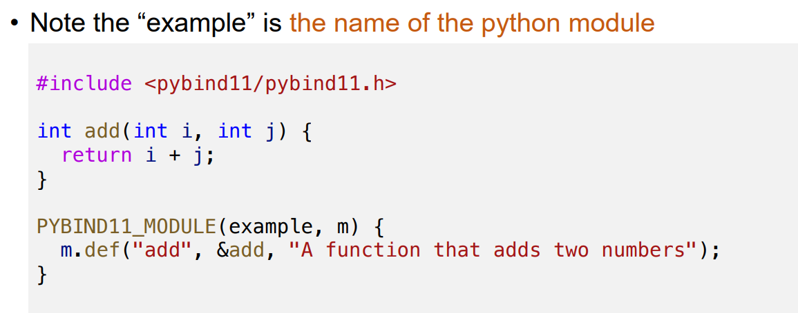
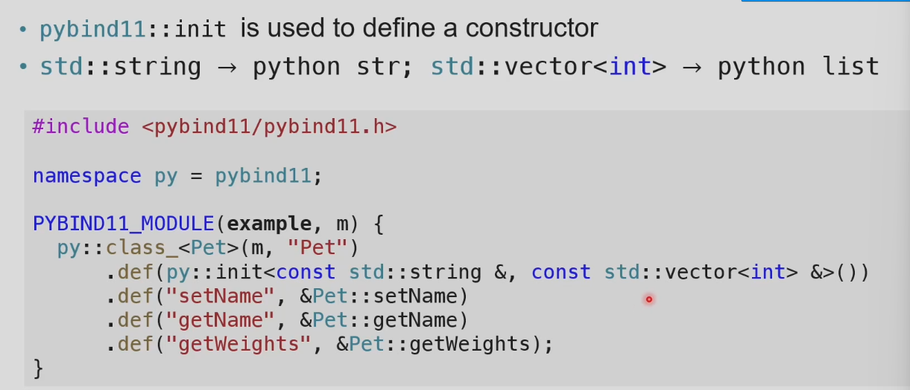
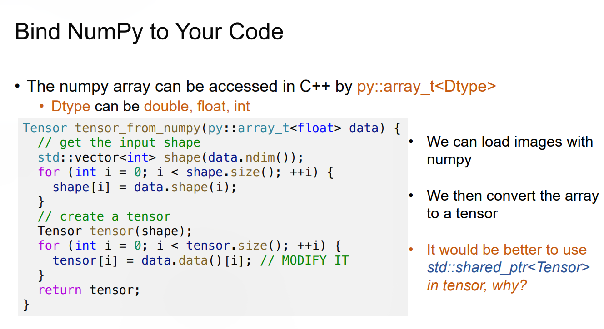
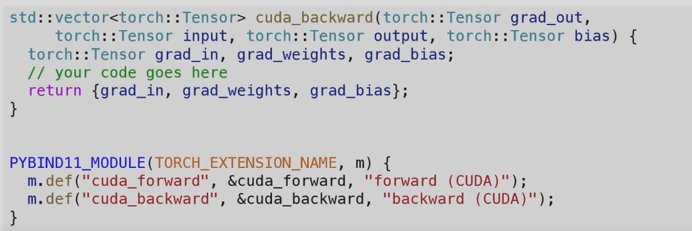
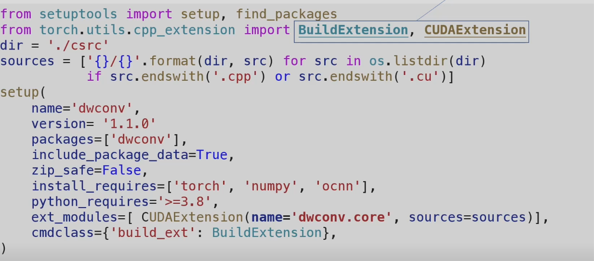

## Python 与 C++ 的分工

模型结构、训练循环和实验配置经常变化，使用 Python 编写更方便。卷积、矩阵乘法等算子执行次数多、性能要求高，通常由 C++ 或 CUDA 实现。

一次 Python 调用自定义 CUDA 算子时，数据会经过几层边界。

1. Python 接收 Tensor 并调用扩展模块。
2. PyBind 把 Python 对象转换为 C++ 能使用的对象。
3. C++ 入口检查 shape、dtype、device 与 layout。
4. CUDA 代码在当前设备和 stream 上启动 kernel。
5. C++ 返回一个由 PyTorch 管理内存的 Tensor。

PyBind11 只处理语言绑定，不会自动把 Python 代码变快。若每个元素都跨一次语言边界，调用开销会非常明显。通常把一个完整算子放入 C++，一次传入整块数组或 Tensor。

## PyBind11

PyBind11 是 header-only C++ 库。`PYBIND11_MODULE` 定义 Python import 时加载的模块，`module.def` 把 C++ 函数登记为 Python 属性。

### 第一个模块

```cpp
#include <pybind11/pybind11.h>

namespace py = pybind11;

int add(int lhs, int rhs) {
    return lhs + rhs;
}

PYBIND11_MODULE(example, module) {
    module.doc() = "A minimal PyBind11 module";
    module.def(
        "add",
        &add,
        py::arg("lhs"),
        py::arg("rhs")
    );
}
```



编译后得到 Python 可以动态加载的 shared library。文件后缀包含当前 Python 的 ABI 信息。模块名 `example` 必须与生成扩展的名称一致，否则 import 时找不到初始化符号。

最小 CMake 配置为

```cmake
cmake_minimum_required(VERSION 3.18)
project(example LANGUAGES CXX)

find_package(pybind11 REQUIRED)
pybind11_add_module(example bindings.cpp)
target_compile_features(example PRIVATE cxx_std_17)
```

构建并测试模块。

```bash
cmake -S . -B build
cmake --build build --config Release
python -c "import example; print(example.add(2, 3))"
```

扩展所在目录需要位于 `sys.path`。开发阶段也可以使用 `pip install -e .` 把包以 editable mode 安装到当前环境，避免每次手动修改搜索路径。

### 参数转换

整数、浮点数、字符串和常见 STL 容器可以由 PyBind11 自动转换。自动转换很方便，也可能隐式复制数据。

```cpp
#include <pybind11/stl.h>

int sum_vector(const std::vector<int>& values) {
    return std::accumulate(
        values.begin(),
        values.end(),
        0
    );
}
```

Python list 传入 `std::vector<int>` 时，会创建一份 C++ vector。函数内部修改这份 vector 不会原地修改原 Python list。大数组应使用 buffer protocol、NumPy 或 Tensor 接口，避免逐元素转换。

### 绑定类

```cpp
class Counter {
public:
    explicit Counter(int value) : value_(value) {}

    void increment() {
        ++value_;
    }

    int value() const {
        return value_;
    }

private:
    int value_;
};

PYBIND11_MODULE(example, module) {
    py::class_<Counter>(module, "Counter")
        .def(py::init<int>())
        .def("increment", &Counter::increment)
        .def_property_readonly("value", &Counter::value);
}
```



Python 对象销毁时，PyBind11 会根据 holder 释放 C++ 对象。默认 holder 通常是 `std::unique_ptr`。需要共享所有权时，可以在 `py::class_` 中指定 `std::shared_ptr<Counter>`。

返回 C++ 内部成员的指针或引用时，必须保证父对象仍然存活。`py::return_value_policy::reference_internal` 可以把返回对象的生命期绑定到父对象，但更稳妥的接口通常直接返回值，或者让所有权在类型设计中清楚表达。

## NumPy 与 GIL

`py::array_t<T>` 通过 NumPy 的 buffer protocol 暴露 data pointer、shape、stride 与 dtype。C++ 可以直接读取 NumPy 内存，不必先转换成 `std::vector`。



```cpp
#include <pybind11/numpy.h>

float sum(
    py::array_t<
        float,
        py::array::c_style | py::array::forcecast
    > array
) {
    py::buffer_info info = array.request();
    const auto* data = static_cast<const float*>(info.ptr);

    float result = 0.0F;
    for (py::ssize_t i = 0; i < info.size; ++i) {
        result += data[i];
    }
    return result;
}
```

`c_style` 要求数组按 C 顺序连续，`forcecast` 允许 PyBind11 在 dtype 或布局不匹配时创建临时副本。这个接口保证 C++ 端可以线性读取，但调用者未必得到零拷贝。

若接口接受任意布局，就要按 `info.shape` 与 `info.strides` 寻址。NumPy stride 的单位是 byte，不是元素个数。转置数组看起来仍是二维矩阵，底层地址却可能跨步。

C++ 返回的 NumPy array 若引用外部内存，外部内存不能在 Python array 之前释放。可以用 capsule 保存析构函数，也可以把拥有内存的 Python 对象作为 base。把局部 `std::vector` 的 `data()` 直接返回会留下悬空指针。

### GIL

Global Interpreter Lock 保证同一 Python 解释器中只有一个线程执行 Python bytecode。长时间运行且完全不调用 Python API 的 C++ 计算可以暂时释放 GIL。

```cpp
module.def(
    "run_kernel",
    &run_kernel,
    py::call_guard<py::gil_scoped_release>()
);
```

释放 GIL 后，其他 Python 线程可以运行。C++ 代码若需要创建 Python 对象、抛出依赖 Python 状态的异常或调用回调，必须重新获取 GIL。

## PyTorch Extension

PyTorch C++ Extension 把 PyBind11、ATen Tensor API、C++ 编译器和 NVCC 接在同一构建流程中。一个小型算子通常分成三层。

```text
Python wrapper
    -> C++ binding and validation
        -> CUDA kernel
```

绑定文件只暴露稳定入口。

```cpp
#include <torch/extension.h>

torch::Tensor relu_cuda(torch::Tensor input);

PYBIND11_MODULE(TORCH_EXTENSION_NAME, module) {
    module.def(
        "relu",
        &relu_cuda,
        "ReLU CUDA forward"
    );
}
```



`TORCH_EXTENSION_NAME` 由构建系统传入，使初始化符号与最终模块名保持一致。Python 侧可以使用 `CUDAExtension` 同时编译 `.cpp` 与 `.cu` 文件。

```python
from setuptools import setup
from torch.utils.cpp_extension import (
    BuildExtension,
    CUDAExtension,
)

setup(
    name="ai_ops",
    ext_modules=[
        CUDAExtension(
            name="ai_ops._C",
            sources=[
                "bindings.cpp",
                "relu.cu",
            ],
        )
    ],
    cmdclass={"build_ext": BuildExtension},
)
```



### Tensor 检查

Python 允许调用者传入各种 Tensor，kernel 却常只实现一种 dtype、device 与 layout。入口处应在取 data pointer 前检查约束。

```cpp
TORCH_CHECK(
    input.is_cuda(),
    "input must be a CUDA tensor"
);
TORCH_CHECK(
    input.scalar_type() == torch::kFloat32,
    "input must be float32"
);
TORCH_CHECK(
    input.is_contiguous(),
    "input must be contiguous"
);
```

还要检查维度、空 Tensor 和 shape 关系。输出应使用 `torch::empty`、`empty_like` 等 ATen API 分配，让 Tensor 自己管理显存。不要在返回前释放输出指针，也不要把临时 host memory 包装成 CUDA Tensor。

多 GPU 程序中，kernel 要在输入所在 device 上启动。异步执行还要使用 PyTorch 当前 CUDA stream，不能偷偷切回默认 stream，否则上游算子与自定义 kernel 之间的依赖可能失效。

### Autograd

只绑定 forward 并不会自动产生 backward。可以先在 Python 中继承 `torch.autograd.Function`，显式连接两段扩展代码。

```python
class CustomReLU(torch.autograd.Function):
    @staticmethod
    def forward(ctx, input_tensor):
        output = ai_ops.relu_forward(input_tensor)
        ctx.save_for_backward(input_tensor)
        return output

    @staticmethod
    def backward(ctx, grad_output):
        (input_tensor,) = ctx.saved_tensors
        grad_input = ai_ops.relu_backward(
            grad_output.contiguous(),
            input_tensor,
        )
        return grad_input
```

`ctx.save_for_backward` 保存 backward 真正需要的 Tensor。保存过多中间量会增加显存占用，保存过少则只能在反向时重算。更完整的框架集成可以通过 PyTorch dispatcher 注册 CPU、CUDA 与 Autograd 实现。

## 单元测试

GPU 算子最方便的 reference 往往是 PyTorch 自带实现。测试给两边相同输入，再比较输出与梯度。

一次随机输入通过并不充分。边界尺寸最容易暴露索引错误，例如元素数刚好等于 block size、刚好多一个元素、某一维为零，以及矩阵边长无法整除 tile size。

### 接口与边界

```python
import unittest

import torch

import ai_ops


class ReLUTest(unittest.TestCase):
    def test_forward(self):
        torch.manual_seed(0)
        input_tensor = torch.randn(
            37,
            65,
            device="cuda",
        )

        expected = torch.relu(input_tensor)
        actual = ai_ops.relu(input_tensor)

        torch.testing.assert_close(
            actual,
            expected,
        )

    def test_empty_tensor(self):
        input_tensor = torch.empty(
            0,
            device="cuda",
        )
        actual = ai_ops.relu(input_tensor)
        self.assertEqual(actual.numel(), 0)

    def test_rejects_cpu_tensor(self):
        with self.assertRaisesRegex(
            RuntimeError,
            "CUDA",
        ):
            ai_ops.relu(torch.randn(8))


if __name__ == "__main__":
    unittest.main()
```

黑盒测试只验证公开输入输出，适合与 reference 对拍。白盒测试根据实现路径构造样例，例如专门跨过 tile 边界、触发有无 bias 分支，或者让最后一个 block 只有一个有效 thread。


浮点结果使用 `torch.testing.assert_close`。容差要与 dtype 和归约长度相符。`float16` 的累计误差通常大于 `float32`，但把容差设得过宽会掩盖漏项和错误索引。

### Fixture、覆盖率与 Mock

`unittest.TestCase` 采用 xUnit 的组织方式。多项测试都要创建相同输入或初始化同一套扩展时，可以把这部分准备工作放进 `setUp`，把临时文件、环境变量和外部资源的清理放进 `tearDown`。它们会在每个 test method 前后各执行一次，前一项测试留下的状态不会直接流入后一项。

```python
class LinearTest(unittest.TestCase):
    def setUp(self):
        torch.manual_seed(0)
        self.input = torch.randn(
            17,
            31,
            device="cuda",
        )

    def tearDown(self):
        torch.cuda.synchronize()
```

初始化代价很高的只读资源可以放进 `setUpClass`，它在整组测试开始前运行一次。可变的 GPU buffer 不宜在测试间直接共享，否则上一次 kernel 的异步执行或原地写入可能让失败结果依赖测试顺序。

Line coverage 只说明某行代码执行过，branch coverage 进一步检查条件的真假分支。它们都不能证明数值结果正确。一个越界 kernel 可能碰巧在当前输入上没有报错，一条归约路径也可能执行完整却漏加最后一个 tile。覆盖率适合寻找从未触达的区域，结果仍要靠 reference、边界样例和梯度检查判断。

Mock 用来替换测试对象之外的依赖，例如远程存储、时钟或 RPC client。测试 CUDA 算子时不应把 kernel 本身 mock 掉，否则只验证了 Python 包装层；可以 mock 的是下载输入、写日志或上报指标等外围行为。这样既保留算子的真实执行，也不会让单元测试依赖网络和外部服务。

### 梯度检查

Backward 可以直接与 reference 比较。

```python
input_ref = input_tensor.detach().clone().requires_grad_(True)
input_custom = input_tensor.detach().clone().requires_grad_(True)
grad_output = torch.randn_like(input_tensor)

torch.relu(input_ref).backward(grad_output)
CustomReLU.apply(input_custom).backward(grad_output)

torch.testing.assert_close(
    input_custom.grad,
    input_ref.grad,
)
```

`torch.autograd.gradcheck` 使用有限差分检查解析梯度，通常要求 double precision 与很小的输入。

```python
input_tensor = torch.randn(
    4,
    5,
    dtype=torch.double,
    device="cuda",
    requires_grad=True,
)

self.assertTrue(
    torch.autograd.gradcheck(
        custom_function,
        (input_tensor,),
    )
)
```

不可导点附近的数值梯度会不稳定。测试 ReLU 时应避免输入恰好为零，或明确约定该点采用哪一侧导数。

### CUDA 错误定位

Kernel launch 异步返回，测试若只构造输出而不读取它，越界访问可能到后续用例才报错。调试测试可以在自定义算子后调用 `torch.cuda.synchronize()`，把错误定位到当前用例。

性能测试、显存泄漏检查和多 stream 并发测试不应与普通功能测试混在一起。它们运行时间长，环境依赖也更强，适合单独标记并在稳定硬件上执行。
