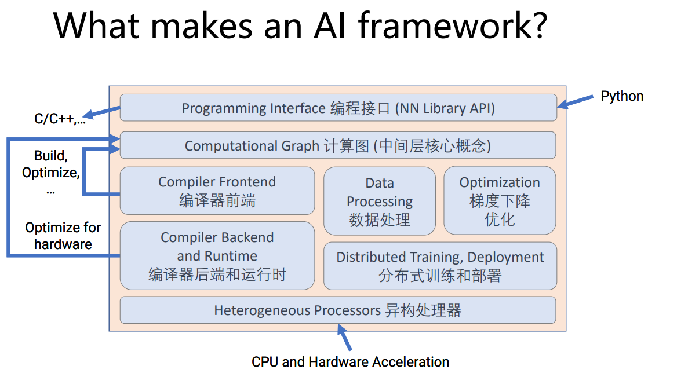
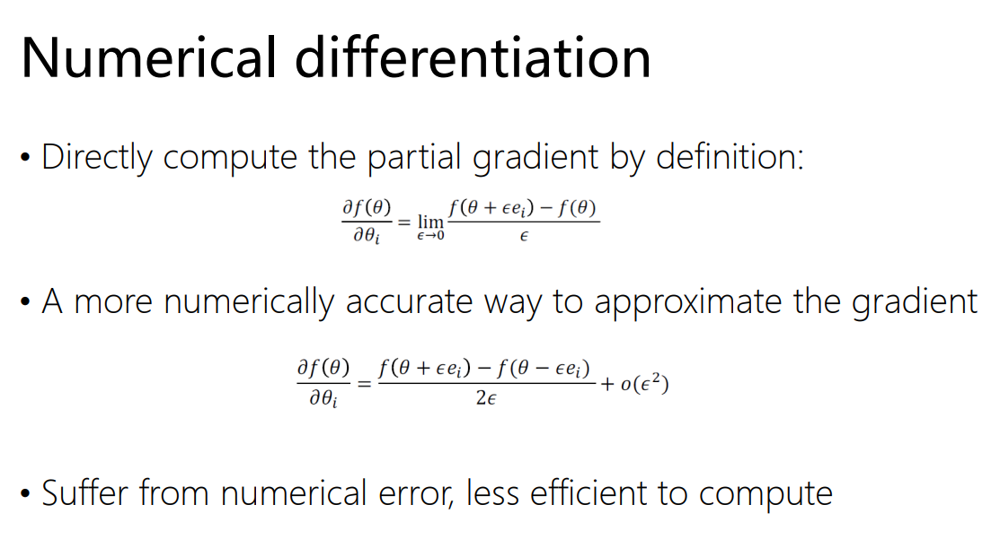
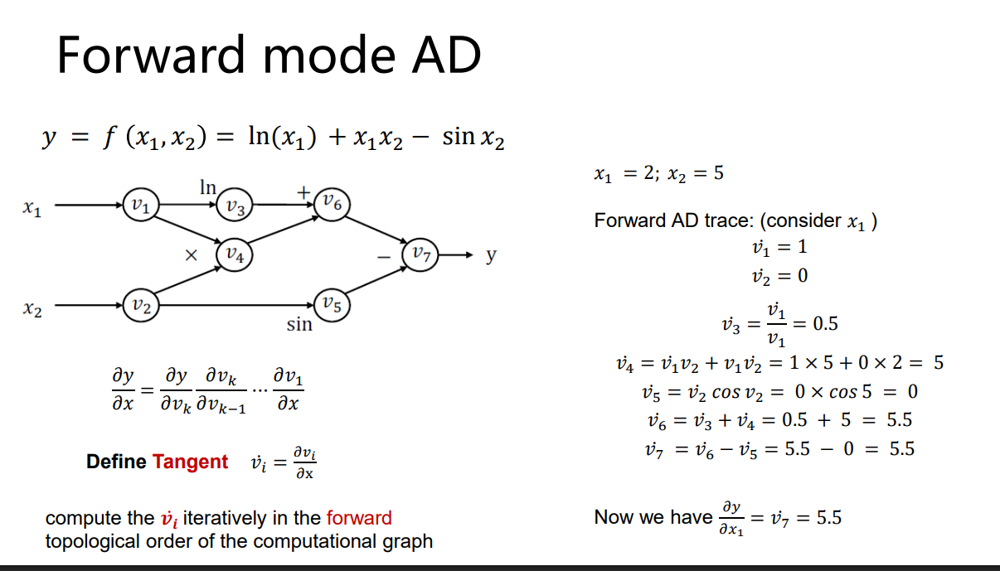
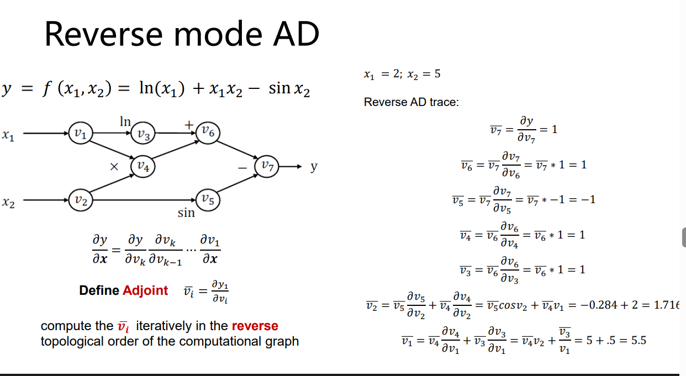
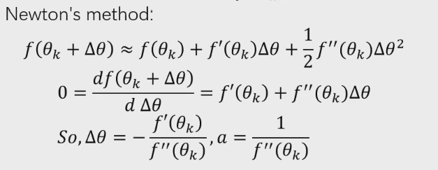

训练代码里最常见的一组调用是 `loss.backward()` 和 `optimizer.step()`。前者算出损失对每个参数的梯度，后者才根据梯度修改参数。模型可能有数十亿个参数，但我们不需要手写数十亿条求导公式，这件事由自动微分完成。

自动微分处理的是程序实际执行过的数值运算。加法、乘法、指数、矩阵乘法等基础算子各自提供局部导数，框架把它们串成计算图，再用链式法则得到最终梯度。



## 三种求导方法

符号微分把表达式当作代数对象，应用求导规则后生成一条新的表达式。它很适合处理规模不大的显式公式，例如 SymPy 可以直接计算导函数。

```python
import sympy as sp

x = sp.symbols("x")
function = sp.sin(x) * sp.exp(x)
derivative = sp.diff(function, x)
```

神经网络并不总能写成一条紧凑的公式。模型里有循环、分支、张量索引和大量重复子式，直接展开符号表达式会变得很大，也很难保留普通程序的控制流。

数值微分只调用原函数。中心差分近似为

$$
f'(x)\approx
\frac{f(x+\varepsilon)-f(x-\varepsilon)}
{2\varepsilon}
$$



当 $\varepsilon$ 太大时，近似带来的截断误差明显；当 $\varepsilon$ 太小时，两个接近的浮点数相减会损失有效数字。若函数有 $n$ 个输入，只求一阶梯度也要额外执行约 $O(n)$ 次前向计算。数值微分因此常用于检查少量梯度，很少承担训练时的完整反向传播。

自动微分仍然执行数值程序，但在执行过程中额外传播导数。它没有有限差分的截断误差，也不会把整个网络展开成一条巨大的符号表达式。

## 从一张小图算起

考虑输入 $x_1$ 和 $x_2$ 以及三个中间结果

$$
u=x_1x_2
$$

$$
v=\sin u
$$

$$
y=v+x_2
$$



图上的每个节点只需知道自己的局部导数。乘法节点有

$$
\frac{\partial u}{\partial x_1}=x_2
\qquad
\frac{\partial u}{\partial x_2}=x_1
$$

正弦节点有

$$
\frac{\partial v}{\partial u}=\cos u
$$

最后一个加法节点对两个输入的导数都是 $1$ 这个常数。完整导数由这些局部结果沿路径相乘，再把通向同一变量的不同路径相加。于是

$$
\frac{\partial y}{\partial x_1}
=
x_2\cos(x_1x_2)
$$

$$
\frac{\partial y}{\partial x_2}
=
x_1\cos(x_1x_2)+1
$$

$x_2$ 对输出有两条影响路径。一条经过乘法和正弦，另一条直接进入最后的加法，所以它的梯度里出现了两项。以后看到残差连接、同一参数被反复使用，反向传播也遵守同样的累加规则。

## 前向模式

前向模式为每个中间变量同时保存普通数值和方向导数。普通数值常称为 primal，方向导数常称为 tangent。给定输入方向

$$
\dot{x}
=
\begin{bmatrix}
\dot{x}_1\\
\dot{x}_2
\end{bmatrix}
$$

前面的计算会按原来的顺序继续传播

$$
\dot{u}
=
x_2\dot{x}_1+x_1\dot{x}_2
$$

$$
\dot{v}
=
\cos(u)\dot{u}
$$

$$
\dot{y}
=
\dot{v}+\dot{x}_2
$$

若把输入方向取为 $\dot{x}_1=1,\ \dot{x}_2=0$ 这一组值，最终的 $\dot{y}$ 就是输出对 $x_1$ 的偏导。换一个输入方向，需要再运行一次传播。

对于映射 $f:\mathbb{R}^n\to\mathbb{R}^m$ 而言，一次前向模式计算的是 Jacobian-vector product

$$
J_f(x)v
$$

输入维度较小而输出维度较大时，前向模式很合适。例如函数只有少量控制参数，却要生成一个很长的状态向量，只需对关心的几个输入方向分别传播。

Dual Number 可以把这套规则写进运算符。令双数单位满足 $\epsilon^2=0$ 以后，对光滑函数有

$$
f(x+\epsilon\dot{x})
=
f(x)+\epsilon f'(x)\dot{x}
$$

普通部分保存函数值，而 $\epsilon$ 的系数保存方向导数。加法和乘法只要遵守 Dual Number 的运算规则，整段程序便会自动带着导数向前运行。

## 反向模式

神经网络训练通常有很多参数，最后只产生一个标量损失。若对每个参数方向分别运行前向模式，代价会随参数数量增长。反向模式先完成一次前向计算，再从标量输出向输入倒着传播，一次便能得到全部参数梯度。

用 $L$ 表示损失，用 $u$ 表示中间变量，它的伴随量记作

$$
\bar{u}
=
\frac{\partial L}{\partial u}
$$

反向传播从 $\bar{L}=1$ 开始。若变量 $u$ 被节点 $v$ 使用，这个节点会向 $u$ 贡献

$$
\bar{u}
\mathrel{+}=
\bar{v}
\frac{\partial v}{\partial u}
$$



前面小图的反向计算从 $\bar{y}=1$ 开始。加法节点把 $1$ 作为变量 $v$ 的梯度，也直接给 $x_2$ 累加一份数值为 $1$ 的梯度。正弦节点把伴随量更新为 $\bar{u}=\cos u$ 后，乘法节点再得到

$$
\bar{x}_1
=
\bar{u}x_2
$$

$$
\bar{x}_2
\mathrel{+}=
\bar{u}x_1
$$

第二条式子使用 `+=` 很重要。变量 $x_2$ 已经从加法节点收到一份梯度，乘法节点到来时不能覆盖它。

对于映射 $f:\mathbb{R}^n\to\mathbb{R}^m$ 而言，给定输出端向量 $v$ 后，一次反向模式计算 vector-Jacobian product

$$
v^\mathsf{T}J_f(x)
$$

标量损失的输出维度满足 $m=1$ 这一条件，输出端只需用 $1$ 作为起点。训练框架因此普遍使用反向模式。

## 框架怎样记录运算

动态图框架会在 Tensor 运算发生时创建图节点。输出 Tensor 保存生成它的操作、父节点，以及反向时要调用的函数。一个极简的乘法可以写成

```python
class Tensor:
    def __mul__(self, other):
        output = Tensor(self.data * other.data)
        output.parents = (self, other)

        def backward(grad_output):
            self.accumulate_grad(grad_output * other.data)
            other.accumulate_grad(grad_output * self.data)

        output.backward_fn = backward
        return output
```

执行反向传播时，框架从输出节点做逆拓扑遍历。一个节点只有在所有后继的梯度都汇总后，才能调用自己的 backward。否则分叉路径上的梯度还没到齐，结果会少一部分。

真实算子还要处理形状变化。若前向发生了 broadcasting，例如偏置 $b$ 从形状 $[C]$ 扩展到 $[N,C]$ 这样的形状，反向时要沿 batch 维求和，把梯度收回原来的 $[C]$ 形状。`reshape` 和 `transpose` 虽然常只改变 metadata，反向仍要按原 shape 与 stride 把梯度映射回去。

叶子 Tensor 通常是用户创建的参数或输入。PyTorch 默认把梯度累积到需要求导的叶子 Tensor 的 `.grad` 中；中间 Tensor 为了节省内存不会保留 `.grad`，调试时可以显式调用 `retain_grad()`。

## 前向值为什么要保存

许多局部导数依赖前向结果。乘法需要原来的两个输入，ReLU 要知道哪些位置大于零，卷积的 backward 需要输入和权重。前向算完以后，这些值不能立刻全部释放。

保存所有 activation 会占用大量显存。Gradient Checkpointing 只保留若干边界，在反向来到某段网络时重新执行那一段前向计算。它减少显存用量，同时增加计算量。

In-place 操作会直接覆盖已有存储。如果被覆盖的值恰好是 backward 需要的输入，导数就无法正确计算。PyTorch 为 Tensor 维护 version counter，发现保存后的值被原地修改时会报错，而不是悄悄给出错误梯度。

## 在 PyTorch 中使用 Autograd



一轮最小训练过程可以写成

```python
optimizer.zero_grad(set_to_none=True)

prediction = model(features)
loss = criterion(prediction, labels)
loss.backward()

optimizer.step()
```

`.backward()` 会把新梯度加到已有 `.grad` 上，因此每轮训练都要主动清理。使用 `set_to_none=True` 后，没有收到梯度的参数仍保持 `None`，也能省去一次把整块梯度内存写零的操作。

若输出不是标量，调用 `backward` 时要提供同形状的外部梯度。

```python
x = torch.tensor([1.0, 2.0], requires_grad=True)
y = x**2
y.backward(torch.tensor([0.5, 3.0]))
```

这段代码计算的是向量 $[0.5,3.0]$ 与 Jacobian 的乘积，并不是自动把向量输出求和。

推理时不需要计算参数梯度，可以使用 `torch.no_grad()`。`torch.inference_mode()` 还会关闭一部分与 Autograd 相关的 metadata 更新，限制也更强，适合纯推理路径。

## 检查梯度

自己实现 CUDA 算子时，forward 能跑通并不说明 backward 正确。可以用中心差分抽查少量元素

$$
g_i^{\mathrm{num}}
\approx
\frac{
L(\theta+\varepsilon e_i)
-
L(\theta-\varepsilon e_i)
}
{2\varepsilon}
$$

数值梯度与自动微分梯度常用相对误差比较

$$
\frac{
\lVert g^{\mathrm{num}}-g^{\mathrm{ad}}\rVert
}
{
\max\left(
1,
\lVert g^{\mathrm{num}}\rVert,
\lVert g^{\mathrm{ad}}\rVert
\right)
}
$$

梯度检查应使用 `float64`、较小输入和确定性算子。ReLU 的零点、`max` 的并列最大值等位置本来就不可微或导数不唯一，随机抽到这些点时，数值结果可能与框架选择的次梯度不同。

## 高阶导数

如果 backward 内部也由可微算子构成，反向传播可以继续构图。PyTorch 用 `create_graph=True` 保留这部分关系。

```python
x = torch.tensor(2.0, requires_grad=True)
y = x**3

first, = torch.autograd.grad(y, x, create_graph=True)
second, = torch.autograd.grad(first, x)
```

完整 Hessian 有 $n^2$ 个元素，参数很多时无法直接保存。实际计算更常使用 Hessian-vector product，它只求 Hessian 作用在某个向量上的结果，可以由前向模式与反向模式组合完成。
