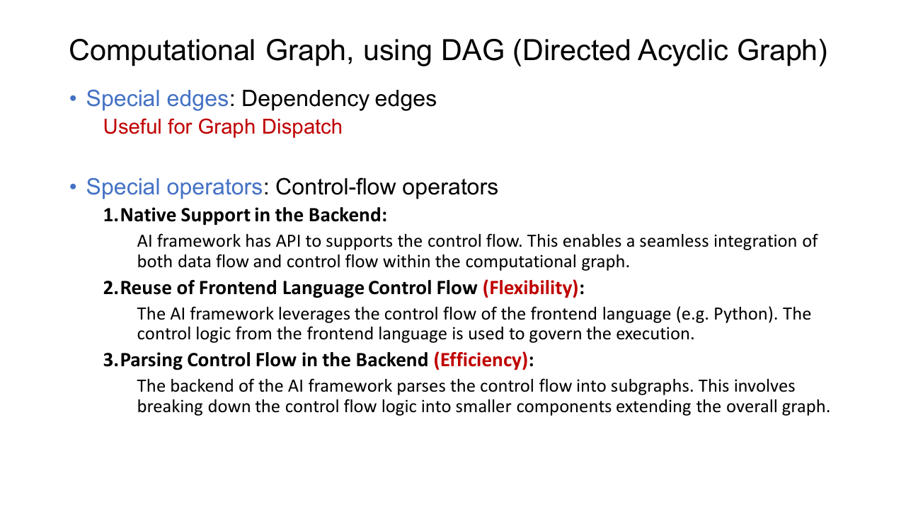
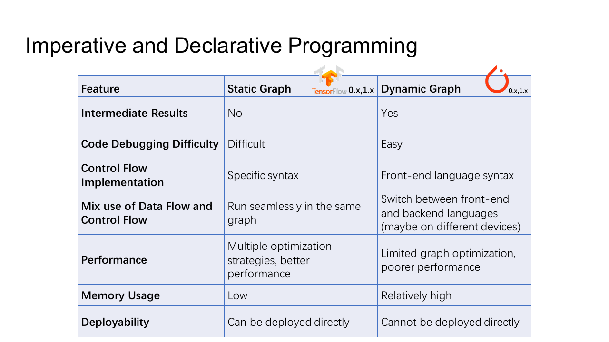
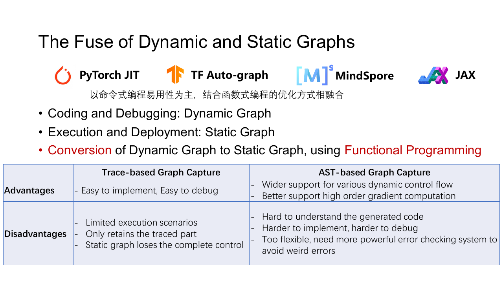
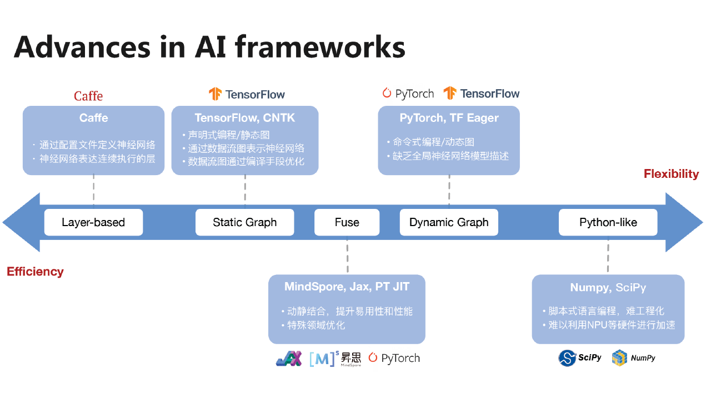
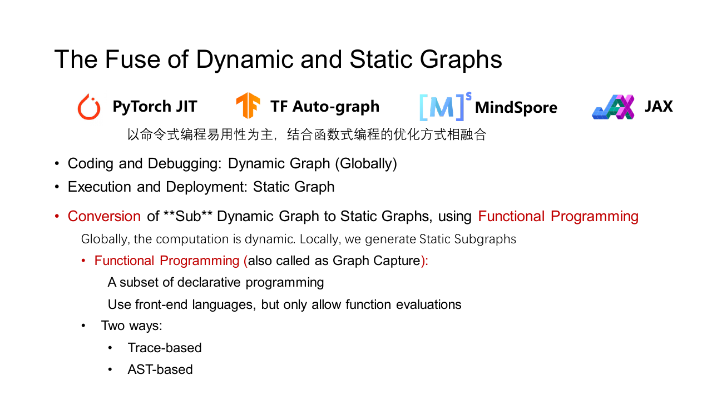

自动微分需要知道一个结果由哪些运算得到，编译器也要知道哪些算子可以融合、哪些数据可以复用内存。计算图把这些关系从 Python 代码中提取出来，变成框架能够分析的结构。

考虑一层很普通的网络

```python
hidden = x @ weight
biased = hidden + bias
output = torch.relu(biased)
loss = output.mean()
```

图里会出现矩阵乘法、加法、ReLU 和 ReduceMean 四个算子节点。`x`、`weight`、`bias` 与各级中间 Tensor 沿边流动。只看这张图，就能知道 ReLU 必须等待加法，加法必须等待矩阵乘法，而 `x` 与 `weight` 在矩阵乘法开始前都要准备好。

## 节点、边与属性

图中的节点一般表示算子，边表示算子之间传递的值。没有循环控制流时，这是一张 Directed Acyclic Graph。边除了保存 Tensor 的连接关系，还可附带 shape、dtype、device、stride 和 layout；节点则保存算子类型、轴、步长、padding 等属性。

边上的值并不只限于稠密 Tensor。稀疏 Tensor、标量、tuple、列表和通信句柄都可能进入图。框架越灵活，图的类型系统就越需要准确描述这些对象。

若算子 $B$ 读取算子 $A$ 的输出，图中存在从 $A$ 到 $B$ 的数据依赖。按拓扑序执行节点，就能保证 Consumer 不会早于 Producer。

有些先后关系不传递数据。例如参数更新必须等梯度计算结束，写入同一状态的两个操作也不能随意交换。这类关系用控制依赖表达。控制边只规定执行顺序，不携带 Tensor。



两个节点之间若没有依赖路径，执行器可以让它们并行。两个独立分支可以进入不同 CUDA stream，直到后面的拼接或求和节点再汇合。计算图因此既是表达模型的结构，也是运行时调度的依据。

## 控制流怎样进入图

神经网络里也会出现条件和循环。RNN 要按序列长度循环，Mixture of Experts 会按路由结果选择专家，部分模型还会根据输入内容提前退出。

Python 可以直接决定本次运行走哪条路径。

```python
def normalize_or_clip(x):
    if x.norm() < 10:
        return x / x.norm()
    return x.clamp(-1, 1)
```

动态图只记录这次实际执行的分支。下一次输入改变时，Python 可以重新作出决定并生成另一张图。这种方式调试方便，但编译器看不到未执行的路径。

静态图会用 `If`、`While` 一类图内算子保存控制流。条件、循环变量、两个分支和循环体都成为 IR 的一部分。后端能够统一优化和部署，但 shape 推断、内存规划与自动微分都要同时处理多条路径。

固定次数的短循环还可以展开成重复节点。展开后容易优化，却会增大图，也不适合运行次数依赖输入的循环。

## 动态图与静态图

动态图采用 define-by-run。Python 代码一边执行，框架一边记录 Tensor 运算；遇到普通 Python 逻辑时，解释器照常处理。

静态图采用 define-and-run。程序先建立完整图，再进行类型检查、优化与内存规划，最后反复执行同一份计划。



| 方面 | 动态图 | 静态图 |
| --- | --- | --- |
| 构图时机 | 每次运行时记录 | 执行前建立 |
| 调试 | 可使用普通 Python 调试器 | 错误要映射回图节点 |
| Python 控制流 | 直接执行 | 需要转换为图内控制流 |
| 全局优化 | 只能观察当前捕获区域 | 容易分析完整子图 |
| 部署 | 常依赖 Python 运行时 | 容易导出独立执行计划 |

现代框架通常同时使用两者。用户仍按动态图方式写模型，稳定的 Tensor 计算区域则被捕获并编译。动态图保留开发体验，静态子图承担融合、代码生成和部署。

## 从 Python 捕获图

### Tracing

Tracing 用一组示例输入执行函数，并记录发生过的 Tensor 操作。对于没有数据相关控制流的网络，它简单而有效。

```python
def function(x):
    if x.sum() > 0:
        return x * 2
    return x - 2
```

若示例输入让条件成立，tracer 只看到 `x * 2`。生成的静态图没有 Python 的 `if`，以后传入负数也可能继续乘以 $2$ 这个固定系数。Tracing 得到的是一次执行轨迹，不能凭空恢复没有走过的分支。

模型中的 shape 也会产生相似问题。若代码用 `x.shape[0]` 计算 Python 整数，tracer 可能把示例 batch size 固化为常量。更换输入形状后，图要么报错，要么产生错误结果。

### Source Transformation

Source Transformation 读取 Python 的抽象语法树，识别变量、分支和循环，再把它们改写为图 IR。它能保留更多控制流，却必须处理闭包、异常、副作用、反射和动态类型。Python 语义很宽，任何无法可靠分析的功能都可能迫使编译器回退。

### 局部捕获与 Graph Break

实际系统常只编译连续的 Tensor 运算。遇到文件 I/O、依赖运行时值的 Python 对象修改，或编译器不认识的库调用时，当前子图在这里结束，代码回到 Python 执行；后面再次出现可捕获区域时，再建立下一张子图。



这条边界称为 graph break。偶尔一次不会影响正确性，数量太多时却会把大图切成许多小块。每块都要单独编译和下发，跨边界的融合、调度与内存复用也无法进行。

编译结果通常带有 guard。假设第一次捕获时输入为 `float32`、二维，并且第二维固定为 $768$ 这一大小，生成的代码只在这些条件成立时复用。新输入破坏 guard 后，框架会编译另一个版本或回退到普通执行。动态 shape 很多时，版本数量可能快速增长。

## 一张图经历的步骤



仍以 `relu(x @ weight + bias)` 为例，图从 Python 到 GPU 大致经历这些处理。

1. 捕获矩阵乘法、加法和 ReLU，记录输入输出关系。
2. 推断每条边的 shape、dtype、layout 与 device。
3. 训练时生成 backward 图，并标出必须保存的前向值。
4. 删除无用节点，折叠常量，尝试把加法和 ReLU 融合。
5. 选择矩阵乘法库或生成 kernel，决定 bias 的广播方式。
6. 规划中间 Tensor 的存储，并生成可执行计划。

训练图的输出不止模型结果，还包括参数梯度和优化器更新。推理图没有这部分依赖，可以释放更多中间值，也可以把固定权重提前变换成硬件偏好的布局。

## 执行器怎样跑图

最简单的执行器按拓扑序逐个运行节点。实现容易，但两条无关分支也会被强制串行。

并行执行器会给每个节点维护未完成前驱数。某个节点的全部输入准备好后，它进入 ready queue；CPU 线程池、GPU stream 或其他设备队列再从中取任务。节点完成时，执行器减少后继的未完成计数，新的节点因此变为可运行状态。

GPU kernel 的提交通常是异步的。Host 把任务放入 stream 后可以继续准备下一项，只有这些位置需要等待：

- CPU 要读取 GPU 结果。
- 一个 stream 要使用另一个 stream 的输出。
- 跨设备复制尚未完成。
- 用户显式调用同步操作。

同步过多会让 CPU 与 GPU 轮流等待。同步太少又可能破坏真实依赖，因此运行时会在图边对应的位置插入 event，而不对整个设备做全局同步。

多设备图还会增加 `Send`、`Recv`、device copy 或 collective communication 节点。它们与普通计算一样参与依赖调度。若梯度 AllReduce 只依赖某一层 backward 的输出，它可以在更早层还在计算时开始通信。

## 图为何要交给编译器

预先实现的算子库可以直接执行图中的每个节点，但大量小算子会反复启动 kernel、读写 global memory。编译器看到整段依赖后，可以把相邻算子合并，消除中间 Tensor，并为当前 shape 生成更合适的实现。



AI 编译器通常分成两部分。前端接收框架程序或模型文件，建立统一 IR，完成 shape 推断和设备无关的图优化；后端根据 CPU、GPU 或其他加速器选择循环结构、数据布局、存储层次和机器指令。

早期系统把算子库当作不可拆分的黑盒，图优化只能重排或连接现有算子。新的编译路径会把 Tensor 算子继续降低成循环和标量操作，再生成目标 kernel。这样做能越过原有算子边界，但也让编译时间、动态 shape 和代码缓存变得更难处理。
