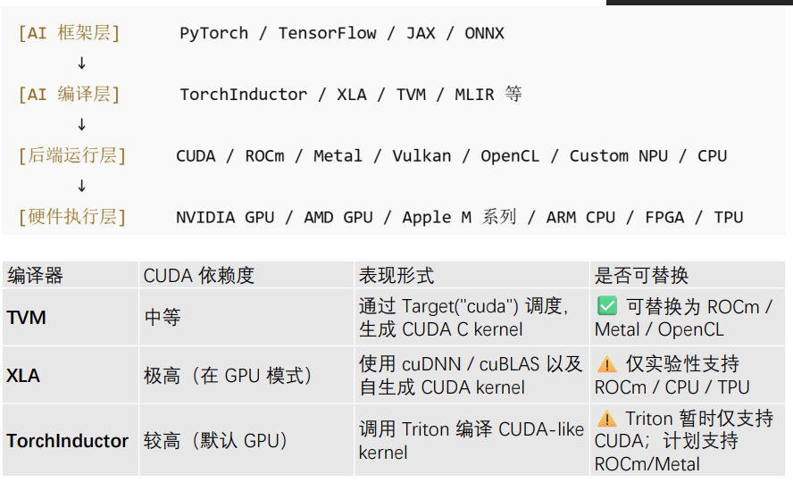
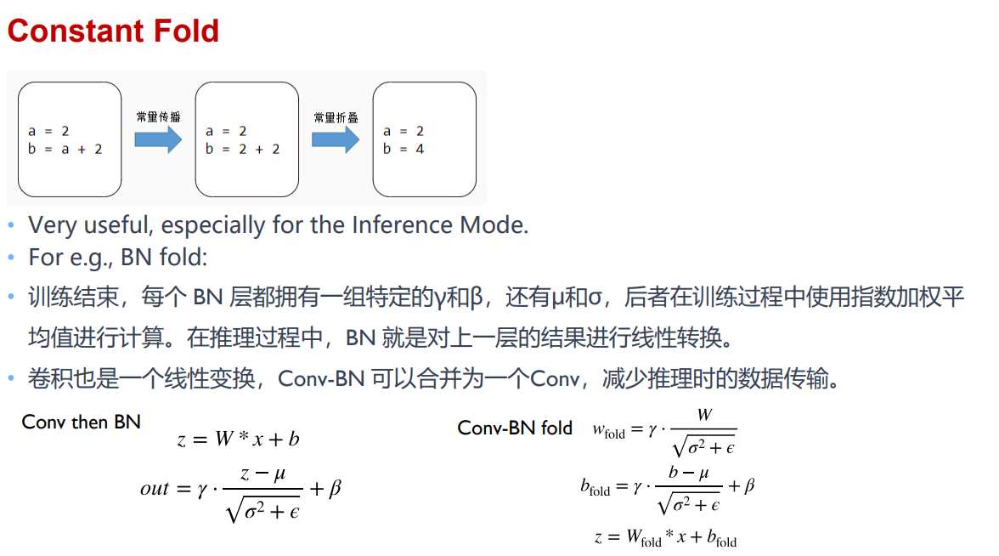
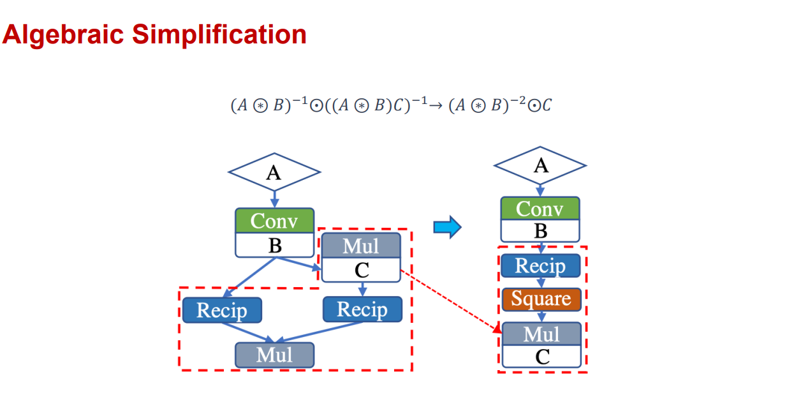
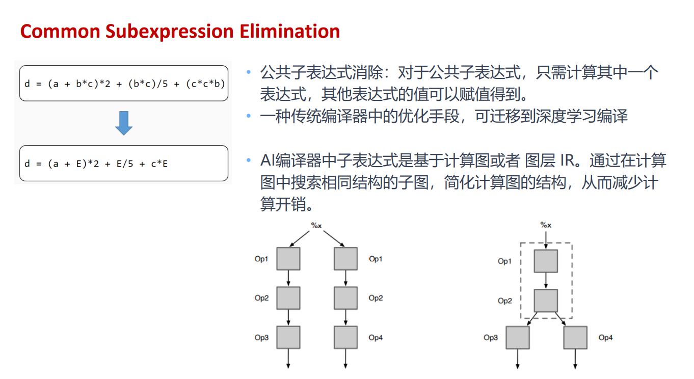
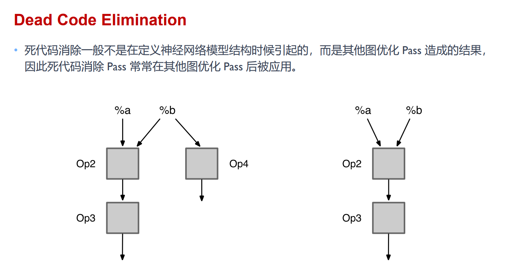
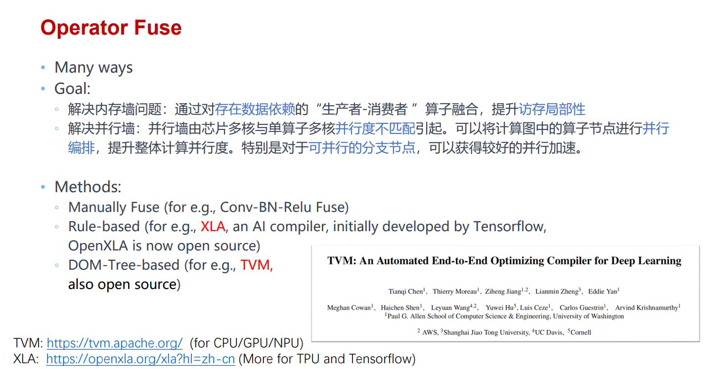
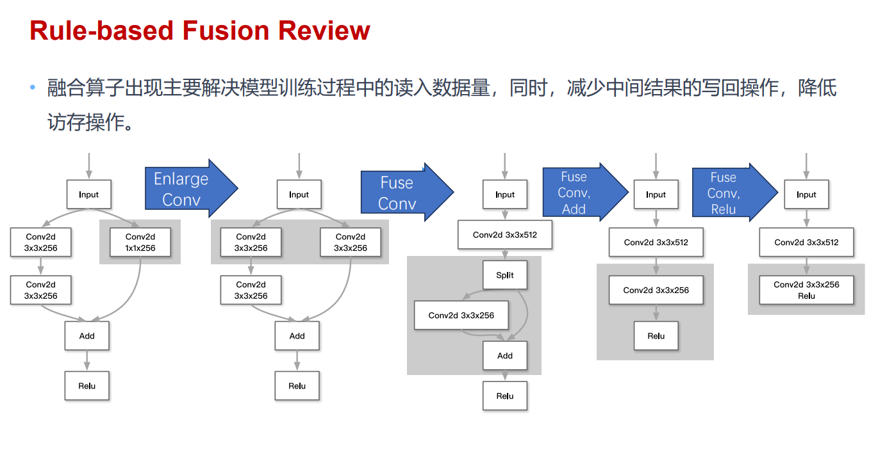
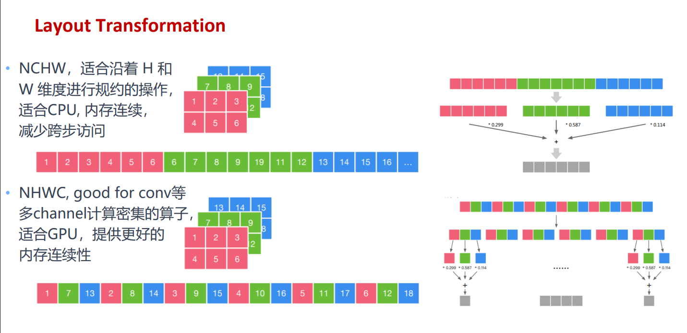
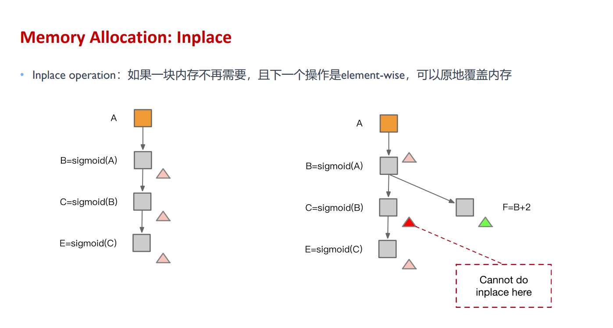
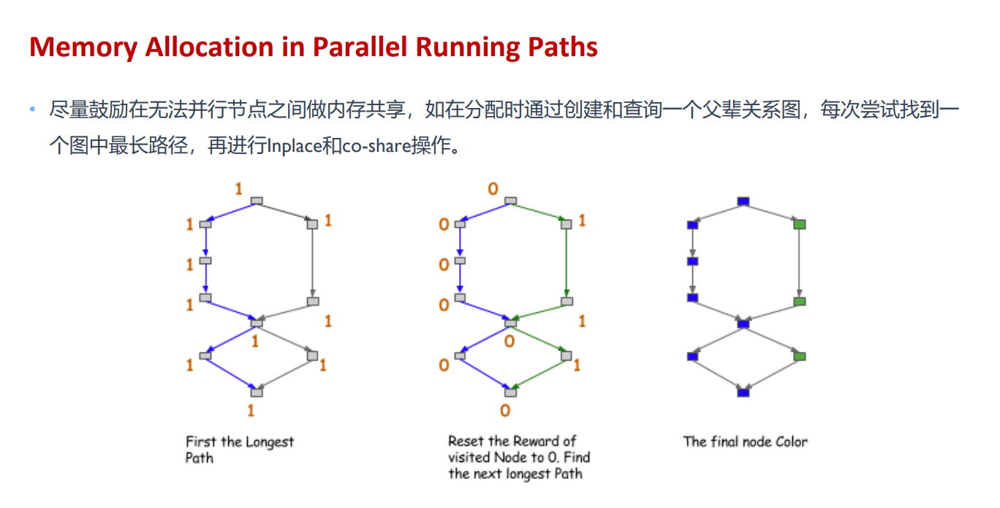

用户写下的是带有类、函数和 Python 控制流的模型，硬件执行的却是形状明确的 Tensor 运算与 kernel。编译器前端负责把前一种表达逐步整理成后一种表达，同时尽量保留模型原本的数值语义。



以这段代码为例

```python
def layer(x, weight, bias):
    return torch.relu(x @ weight + bias)
```

前端要识别矩阵乘法、广播加法与 ReLU，确定每条边的类型和形状，检查设备是否一致，再把结构交给优化 pass。处理结束后，后端才决定矩阵乘法调用哪个库、ReLU 是否并入同一个 kernel，以及线程怎样映射。

## 从模型程序到 IR

Intermediate Representation 是编译器内部使用的程序表示。它比 Python 约束更明确，又比机器指令保留更多 Tensor 语义。一个系统通常不只使用一种 IR。

- Graph IR 用节点和边表示算子与 Tensor 依赖，适合跨算子融合、常量传播和生命周期分析。
- Linear IR 把操作排成有序指令，控制流和数据流都已显式化，适合更低层的优化。
- Loop IR 把矩阵乘法、卷积等算子展开为循环、索引和缓冲区访问，便于做 tiling 与并行化。
- Machine IR 接近目标指令，负责寄存器分配、指令选择和最终代码生成。

同一个操作会经过多次 lowering。例如高层 `linear` 可以先拆成矩阵乘法和加法，再降低成块矩阵循环，最后映射到 CUDA thread 与 Tensor Core 指令。每下降一层，表达更接近硬件，也会失去一部分高层信息。

LLVM 用统一低层 IR 连接语言前端和机器后端。MLIR 允许不同 dialect 在同一套基础设施里共存，可以让神经网络算子、线性代数循环、GPU kernel 和 LLVM 指令依次出现。前一层完成适合自己的优化后，再转换到下一层。

## Shape 与类型推断

前端拿到 `x @ weight` 时，要先验证两个输入能否相乘。若

$$
x\in\mathbb{R}^{B\times K}
$$

$$
W\in\mathbb{R}^{K\times N}
$$

输出采用 $[B,N]$ 这一 shape。若 `bias` 采用 $[N]$ 这一 shape，广播结果仍为 $[B,N]$ 这一 shape。内维不一致时，错误可以在编译阶段报告，不必等 kernel 真正运行。

静态 shape 的每个维度都是常数，内存大小和循环边界可以提前确定。动态 shape 则用符号维度与约束表示，例如符号 $B$ 满足 $B>0$ 且维度 $K$ 能被 $16$ 整除。编译器可以生成通用实现，也可以为常见尺寸建立多个专用版本，并用 guard 在运行时选择。

dtype 推断同样会影响结果。`float16` 矩阵乘法可能用 `float32` 累加，整数卷积也常使用更宽的 accumulator。若前端只记录输入 dtype，不记录计算 dtype 与输出 dtype，后面的融合可能悄悄改变溢出和舍入行为。

Device 与 layout 也属于类型信息。CPU Tensor 与 CUDA Tensor 不能直接参加同一个普通加法；NCHW 与 NHWC 的逻辑 shape 可以对应同一幅图像，但物理地址计算完全不同。

## 用一条算子链看图优化

假设捕获到这样的子图

```text
constant -> reshape ┐
                    ├-> add -> relu -> multiply -> output
input --------------┘
```

其中 `reshape` 的输入和目标形状都在编译期已知。前端可以先执行 `reshape`，把结果直接保存为常量，这就是常量折叠。



若某个分支只用于调试，最终输出无法到达它，死代码消除会删除这条分支。若两处计算具有相同操作、相同输入与相同属性，公共子表达式消除可以让它们共享一个结果。

这些判断都要求算子没有副作用。随机数、文件写入、状态更新和 collective communication 即使输入相同，两次执行也可能有意产生不同结果，不能按普通纯函数去重。

代数简化会使用局部恒等式

$$
x+0=x
$$

$$
x\times1=x
$$

$$
\operatorname{transpose}
\left(
\operatorname{transpose}(x)
\right)
=x
$$



浮点运算不满足严格结合律。`(a + b) + c` 与 `a + (b + c)` 的舍入结果可能不同，NaN、Inf 和 signed zero 也会让部分恒等变换失效。编译器会根据精度模式与 fast-math 选项决定能否重排。





## 算子融合

GPU 执行 `add`、`relu`、`multiply` 三个独立 kernel 时，中间 Tensor 至少要写回和读出 global memory，三个 kernel 也各自承担 launch overhead。若每个输出元素的索引关系一致，可以让一个 thread 连续完成三步。



融合后，中间值有机会留在寄存器中。

```cpp
float value = input[index] + bias[channel];
value = value > 0.0f ? value : 0.0f;
output[index] = value * scale;
```

Producer 直接嵌入 Consumer 的循环称为垂直融合。Element-wise 链最容易这样处理，矩阵乘法的 bias 与激活也经常组成 epilogue。



多个互不依赖的小算子还可以装进同一个 kernel，由不同 thread 区间分别处理，这称为水平融合。它主要减少启动次数，不一定复用中间数据。

融合并非越多越好。一个很大的 kernel 会占用更多寄存器和 shared memory，降低同时驻留的 block 数；Producer 有多个 Consumer 时，内联还可能重复计算。前端先判断依赖和索引是否允许，后端的资源模型再判断这样做是否划算。

## Layout Transformation

逻辑形状相同的 Tensor 可以采用不同物理布局。图像常见 NCHW 与 NHWC，矩阵还分 row-major、column-major 和分块布局。Tensor Core 对内部排列、对齐和维度倍数也有要求。



独立 transpose 会读写整块 Tensor，代价可能比目标算子本身还高。前端会尝试把布局变换推入 Producer 或 Consumer。例如 Consumer 只要改一下索引就能读取转置视图时，没有必要先 materialize 一份连续副本。

`reshape`、`transpose` 和切片常常只修改 shape、stride 与 offset，共享原来的存储。后续算子若只支持 contiguous 输入，才需要真正复制。编译器必须区分 view 与拥有独立存储的 Tensor，否则内存复用会覆盖仍被其他 view 使用的数据。

## 内存规划

Tensor 的生命周期从 Producer 写完开始，到最后一个 Consumer 读完为止。生命周期不重叠的 Tensor 可以复用同一段缓冲区。



假设图里先产生记作 $A$ 的 Tensor，再产生记作 $B$ 的 Tensor，最后产生记作 $C$ 的 Tensor。若 $A$ 在 $C$ 出现前已经没有 Consumer，原先分给 $A$ 的存储就能交给 $C$ 使用。静态内存规划先计算每个 Tensor 的 live interval，再按大小、对齐和设备要求分配 offset。First fit、best fit 与按大小排序的 greedy allocation 都是常见策略。

图中存在并行分支时，拓扑序本身不足以判断生命周期。两个节点虽然在某个串行顺序中前后出现，却可能被放到不同 stream 同时执行，它们的 workspace 不能重叠。



训练图还要保存 backward 所需的 activation。前端可以标记哪些值必须保留、哪些值能够重算，后端再据此安排显存。

## Pass 怎样配合

一个 pass 只负责一种变换。常量折叠可能让条件恒定，随后死代码消除删掉未选择的分支；代数简化去掉无效节点后，原本隔开的两个 element-wise 算子又可以融合。优化 pipeline 因此会多轮执行部分 pass，直到图稳定或达到迭代上限。

较常见的顺序是

1. 规范化算子并完成 shape、dtype、device 推断。
2. 折叠常量，传播已知属性。
3. 做代数简化、公共子表达式消除和死代码消除。
4. 选择或传播 layout，寻找融合区域。
5. 分区到目标设备，标出通信边。
6. 计算 Tensor 生命周期并规划内存。

顺序不是固定模板。布局选择会改变融合机会，融合也会改变内存需求；训练图与推理图的安全变换也不同。编译器需要在每次变换后继续验证 IR，而不能只看最终图能否运行。

## 前端交给后端什么

处理后的 IR 已经明确每个算子的语义、输入输出类型和设备归属。跨设备边会变成 `Send`、`Recv` 或 collective，能够并行的节点保留独立依赖。

前端通常不会决定每个 CUDA block 有多少 thread，也不会直接选择 Tensor Core 指令。这些选择依赖具体 GPU、shape 和存储层次，属于后端调度。前端负责让程序变得清楚、合法并暴露优化机会，后端再把这些机会落实成实际机器代码。
