自动微分给出损失对参数的梯度，优化器再决定怎样使用这份梯度。参数更新看起来只有一两行公式，训练能否稳定收敛却同时受到学习率、batch、数值精度、正则化和数据顺序影响。

## 梯度下降与 Mini-batch

用 $\theta$ 表示参数，用 $L(\theta)$ 表示损失。梯度指向当前位置上升最快的方向，沿相反方向走一步便得到

$$
\theta_{t+1} =
\theta_t-\eta_t\nabla L(\theta_t)
$$

学习率 $\eta_t$ 控制步长。用一维函数

$$
L(\theta) =
(\theta-3)^2
$$

它的梯度为 $2(\theta-3)$ 。从 $\theta_0=0$ 出发，学习率取为 $\eta=0.1$ 后

$$
\theta_1 =
0-0.1\times(-6) =
0.6
$$

参数向最小值 $3$ 靠近。若学习率过小，每一步移动很短；若学习率过大，参数会越过低谷，在两侧反复震荡，甚至越走越远。

真实模型的不同方向常有不同曲率。狭长谷底中，陡峭方向的梯度会频繁换符号，平缓方向的梯度却一直较小，普通梯度下降因此走出锯齿形路线。

### Batch 与梯度累积

全批量梯度下降每一步遍历整个训练集，方向稳定，但单步成本很高。随机梯度下降每次只用一个样本，更新便宜，噪声也很大。训练中更常使用 mini-batch

$$
g_t =
\frac{1}{|B_t|}
\sum_{x_i\in B_t}
\nabla_\theta
\ell(x_i;\theta_t)
$$

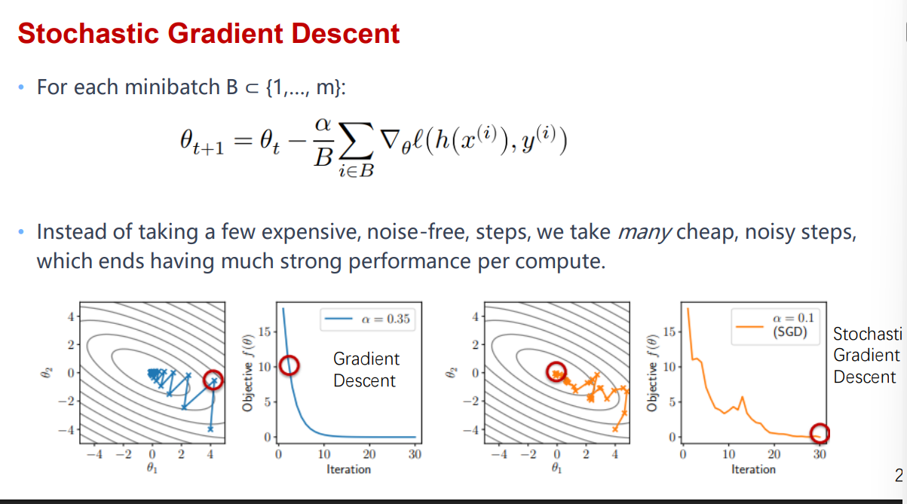

若 batch 是无偏采样，估计量 $g_t$ 是全数据梯度的无偏估计。它不等于真实梯度，却能用远少于完整数据集的计算换来一个可用方向。

Batch 太小时，GPU 利用率低，梯度噪声也大；batch 增大后，矩阵运算更饱满，梯度估计更稳定，但显存占用随之上升。很大的 batch 还可能需要同步提高学习率，并配合 warmup，避免训练初期直接越过稳定区域。

梯度累积可以在不增加单步显存的情况下模拟更大 batch。

```python
optimizer.zero_grad(set_to_none=True)

for micro_batch in micro_batches:
    loss = model_step(micro_batch) / accumulation_steps
    loss.backward()

optimizer.step()
```

除以 `accumulation_steps` 是为了保持梯度平均值的尺度。分布式训练还会在各设备之间聚合梯度，实际 global batch 等于每卡 batch、设备数和累积步数的乘积。

## 一阶优化器

### Momentum

Momentum 保存过去梯度的指数累积

$$
v_t =
\beta v_{t-1}+g_t
$$

$$
\theta_{t+1} =
\theta_t-\eta v_t
$$

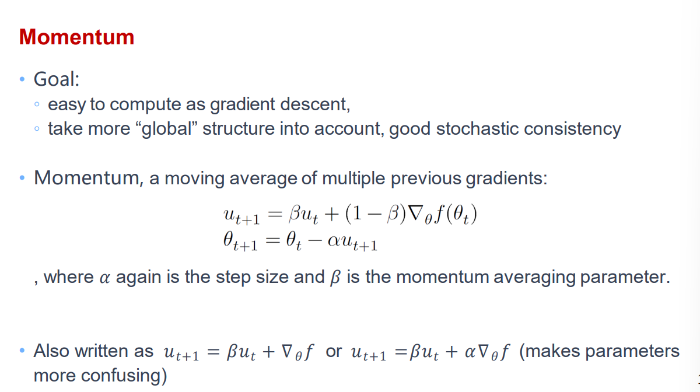

若某个方向长期同向，历史梯度会不断加强移动；若某个方向来回震荡，正负梯度会彼此抵消。狭长谷底中的轨迹因此更平滑。

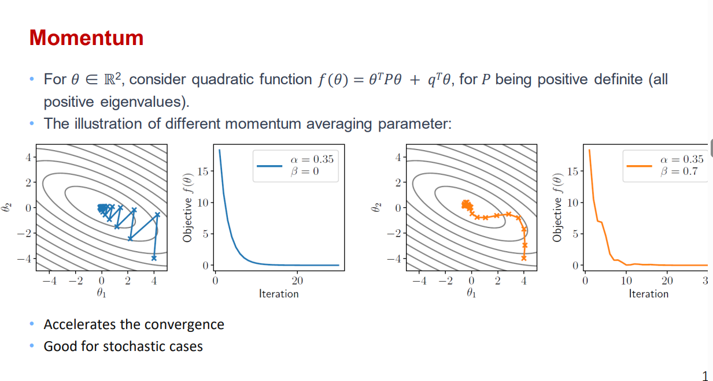

动量也会带来惯性。参数靠近低谷后，已有速度可能让它继续冲过头。Nesterov Accelerated Gradient 会先沿当前动量预估下一位置，再在那里计算梯度

$$
g_t =
\nabla L
\left(
\theta_t-\eta\beta v_{t-1}
\right)
$$

这相当于提前观察即将到达的位置，再修正速度。不同框架对 buffer、dampening 与更新顺序的定义有细微区别，复现实验时要以具体实现为准。

### 自适应学习率

所有参数共用一个学习率时，梯度尺度差异很大的维度很难同时照顾。自适应方法会为每个参数维护自己的缩放状态。

AdaGrad 累积历史梯度平方

$$
r_t =
r_{t-1}+g_t\odot g_t
$$

$$
\theta_{t+1} =
\theta_t -
\frac{\eta}
{\sqrt{r_t}+\epsilon}
\odot g_t
$$

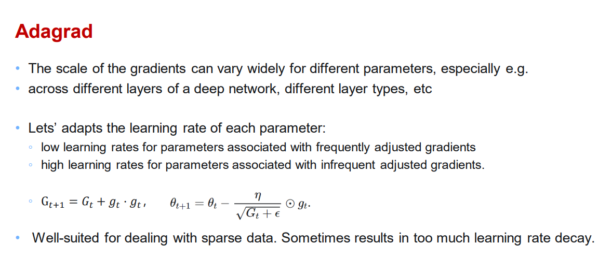

频繁出现大梯度的维度，分母增长更快，有效学习率会下降。稀疏特征偶尔才收到梯度，仍能保留较大步长。问题在于 $r_t$ 只增不减，训练很久以后，所有维度都可能走得过慢。

RMSProp 把累计平方改成指数移动平均

$$
r_t =
\rho r_{t-1}
+
(1-\rho)
g_t\odot g_t
$$

早期梯度会逐渐淡出，分母能够适应近期尺度。

Adam 同时保存一阶矩与二阶矩

$$
m_t =
\beta_1m_{t-1}
+
(1-\beta_1)g_t
$$

$$
v_t =
\beta_2v_{t-1}
+
(1-\beta_2)g_t\odot g_t
$$

两个状态都从零开始，训练初期会偏小。Bias correction 写成

$$
\widehat{m}_t =
\frac{m_t}{1-\beta_1^t}
$$

$$
\widehat{v}_t =
\frac{v_t}{1-\beta_2^t}
$$

参数更新为

$$
\theta_{t+1} =
\theta_t -
\eta
\frac{\widehat{m}_t}
{\sqrt{\widehat{v}_t}+\epsilon}
$$

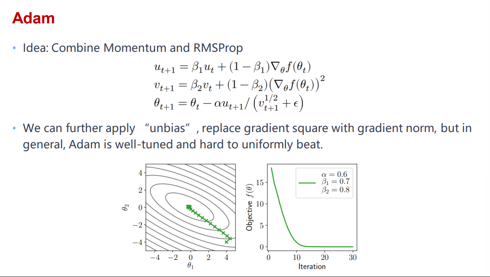

Adam 对各维梯度尺度较为宽容，是训练新模型时常用的起点。SGD with Momentum 在部分视觉任务上仍可能得到更好的最终结果，不能只凭优化器名字判断优劣。

## 二阶优化

一阶方法只看当前位置的斜率，二阶方法还考虑曲率。Newton Method 在当前位置用二次函数近似损失，其方向为

$$
\Delta\theta =
-H^{-1}g
$$

用 $g=\nabla L(\theta)$ 表示梯度，用 $H=\nabla^2L(\theta)$ 表示 Hessian。带步长的更新写成

$$
\theta_{t+1} =
\theta_t+\alpha\Delta\theta
$$

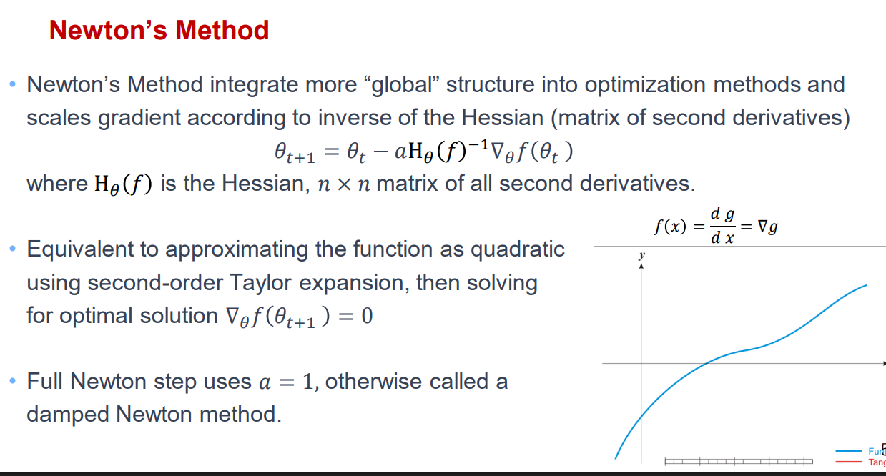

一维情况下，二阶导告诉我们曲线弯得有多快。曲率大时步子会缩短，曲率小时可以走得更远。靠近良性极值点时，Newton Method 收敛很快。

神经网络有 $d$ 个参数时，Hessian 包含 $d^2$ 个元素，显式保存与分解都难以承受；它还可能不是正定矩阵，方向未必指向下降处。大型模型很少直接做完整 Newton update。

Quasi-Newton 根据相邻两轮的参数变化与梯度变化估计曲率。令

$$
s_t =
\theta_{t+1}-\theta_t
$$

$$
y_t =
g_{t+1}-g_t
$$

BFGS 用这两组向量更新逆 Hessian 近似。

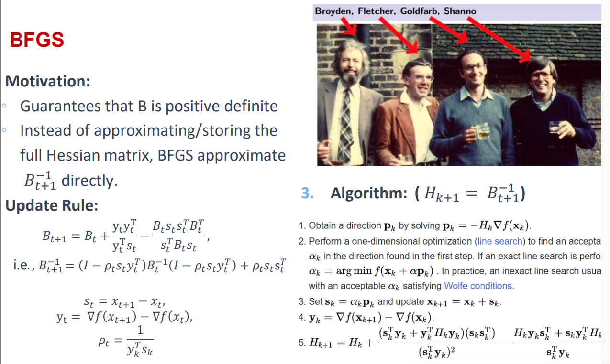

L-BFGS 只保留最近若干组 $(s_t,y_t)$ 向量，通过 two-loop recursion 计算方向，空间从 $O(d^2)$ 降到 $O(md)$ 这一量级。它更适合全批量、目标平滑的任务，mini-batch 噪声会让曲率估计变得不稳定。

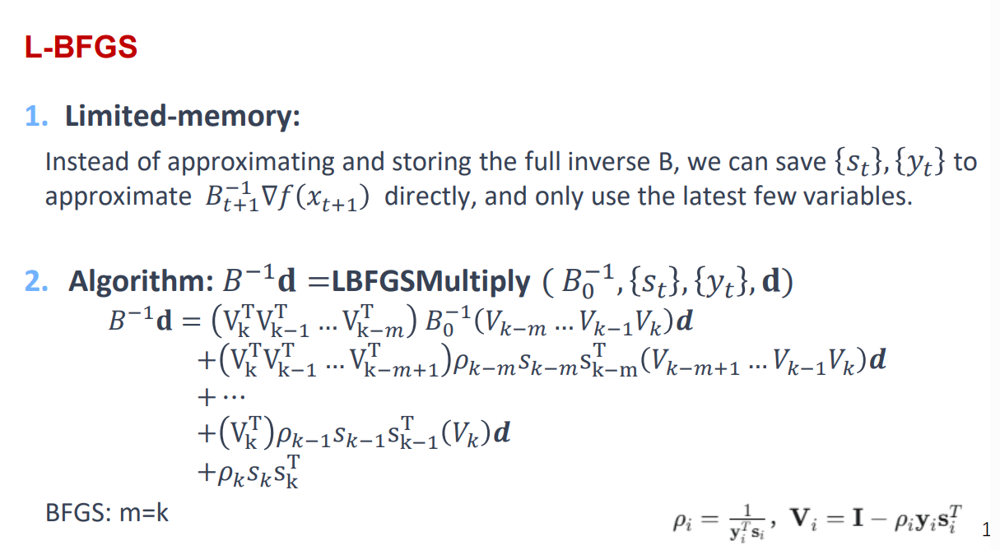

## 学习率与正则化

固定学习率很少从头用到尾。训练初期参数与梯度状态尚不稳定，warmup 让学习率从较小值逐步升高；进入稳定阶段后，再用 step decay、cosine decay 或 polynomial decay 缩小步长。

Cosine schedule 常写成

$$
\eta_t =
\eta_{\min}
+
\frac{1}{2}
\left(
\eta_{\max}-\eta_{\min}
\right)
\left(
1+\cos\frac{\pi t}{T}
\right)
$$

Scheduler 的更新单位要与实现匹配。有的按 optimizer step 更新，有的按 epoch 更新。梯度累积时，micro-batch 次数不等于 optimizer step 次数，混用会让 schedule 提前走完。


### Weight Decay 与正则化

L2 regularization 在损失中加入

$$
\frac{\lambda}{2}
\lVert\theta\rVert_2^2
$$

额外梯度 $\lambda\theta$ 会作用于参数。普通 SGD 中，这与按比例缩小参数等价；Adam 会再用自适应分母缩放这项梯度，两者不再完全相同。

AdamW 把 weight decay 从梯度更新中分离出来

$$
\theta
\leftarrow
(1-\eta\lambda)\theta
$$

随后再执行 Adam 的梯度步。这样可以直接控制参数衰减，不让它被各维自适应缩放改变。

L1 regularization 使用 $\lambda\lVert\theta\rVert_1$ 作为惩罚项，会推动更多参数靠近零。零点处不可导，需要次梯度或 proximal method 处理。

模型过度贴合训练数据时，还可从训练过程控制泛化。

- Dropout 在训练时随机屏蔽激活，推理时关闭随机屏蔽。
- Data Augmentation 对输入执行保持语义的变化，扩大有效数据分布。
- Early Stopping 在验证指标长期不再改善时停止训练。
- Label Smoothing 不把分类目标写成绝对的 one-hot，减弱过度自信。

Batch Normalization 与 Layer Normalization 主要解决尺度与训练稳定性。它们可能附带正则化效果，但用途不应只归结为防止过拟合。

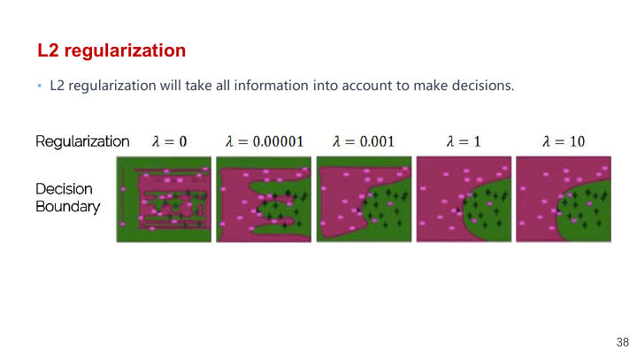

## 训练稳定性

### 梯度裁剪与混合精度

循环网络和大模型训练中，梯度范数可能突然变大。按范数裁剪会在超过阈值时整体缩放

$$
g
\leftarrow
g
\min\left(
1,
\frac{\tau}{\lVert g\rVert_2}
\right)
$$

它保留方向，只限制长度。逐元素 clipping 则直接截断每个分量，行为不同。

`float16` 能提高吞吐并减少显存，但很小的梯度可能下溢为零。Automatic Mixed Precision 会让适合的算子使用低精度，同时保留一份高精度参数或累加结果。GradScaler 在反向前放大损失

$$
L_{\mathrm{scaled}} =
sL
$$

得到的梯度也放大 $s$ 倍。更新前再除回原尺度，并检查是否出现 Inf 或 NaN。

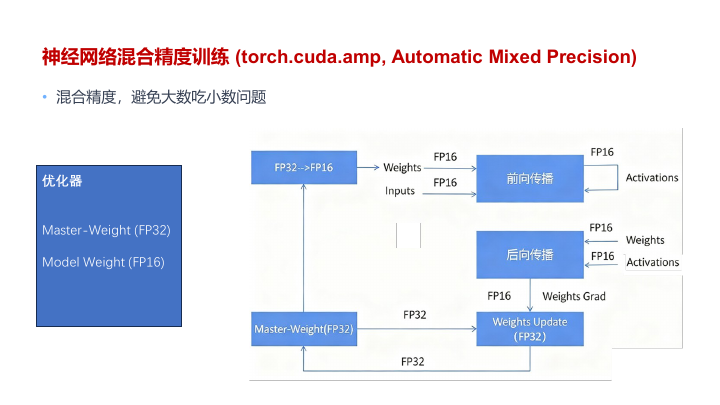

```python
optimizer.zero_grad(set_to_none=True)

with torch.autocast(device_type="cuda", dtype=torch.float16):
    prediction = model(features)
    loss = criterion(prediction, labels)

scaler.scale(loss).backward()
scaler.unscale_(optimizer)
torch.nn.utils.clip_grad_norm_(model.parameters(), max_norm=1.0)
scaler.step(optimizer)
scaler.update()
```

梯度裁剪要放在 `unscale_` 之后，否则阈值面对的是被人为放大的梯度。检测到溢出时，`scaler.step` 会跳过这次参数更新，并降低 scale。

### 数据顺序

每个 epoch 重新 shuffle 可以减弱固定顺序带来的相关性。若样本长期按类别排列，连续 batch 的梯度会朝不同类别来回偏移。

分布式训练中，各 rank 要使用相同的全局随机排列，再取得互不重叠的切片。通常会把 epoch 写入 sampler，使每轮得到新的确定性顺序。

Curriculum Learning 会先呈现较容易的样本，再逐步加入困难样本。它依赖合理的难度定义，不能简单替代常规 shuffle。课程顺序结束后，训练仍常恢复混合采样。

## 约束与优化器状态

### 约束优化

有时参数必须满足明确约束，例如概率非负且总和必须等于 $1$ 这一类条件，或权重范数不能超过上限。

软约束把违背程度加进损失

$$
L_{\mathrm{total}} =
L(\theta)
+
\lambda R(\theta)
$$

硬约束则要求每次更新后仍落在可行集合中。Projected Gradient Descent 先做普通梯度步，再投影回集合

$$
\theta_{t+1} =
\Pi_{\mathcal{C}}
\left(
\theta_t-\eta\nabla L(\theta_t)
\right)
$$

等式约束还可以使用 Lagrange multiplier，把约束函数与目标组合后求鞍点。实际选择取决于约束能否投影、是否允许轻微违反，以及优化稳定性。

### Optimizer 状态

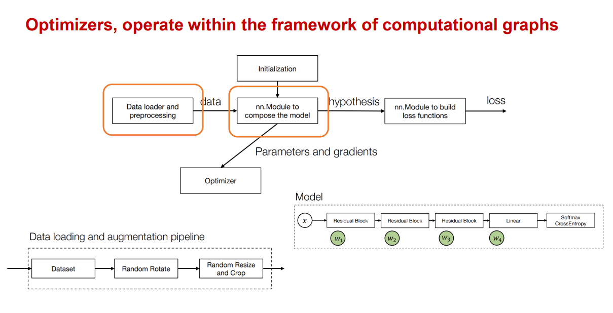

优化器持有参数引用和状态。SGD with Momentum 为每个参数保存 velocity，Adam 保存一阶矩、二阶矩与 step count。Scheduler 和 GradScaler 也有自己的状态。

```python
optimizer.zero_grad(set_to_none=True)
loss.backward()
torch.nn.utils.clip_grad_norm_(model.parameters(), max_norm=1.0)
optimizer.step()
scheduler.step()
```

Checkpoint 若只保存模型权重，恢复后虽然能继续前向计算，优化轨迹却已经改变。想从中断处继续训练，还要保存 optimizer、scheduler、scaler、随机数状态和当前 global step。
