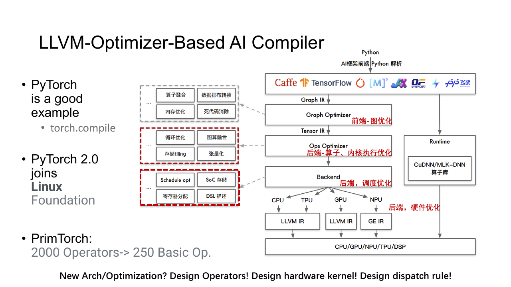
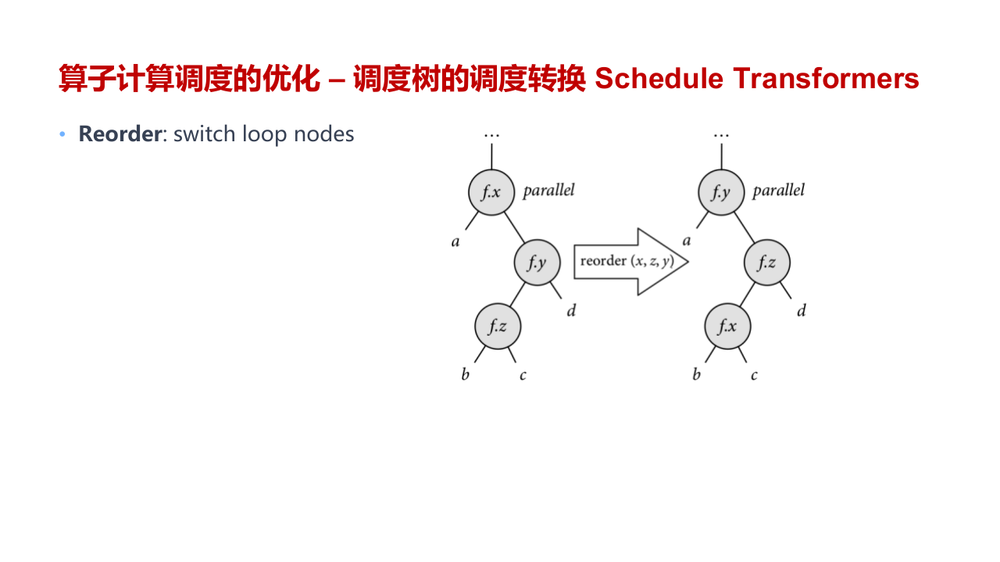
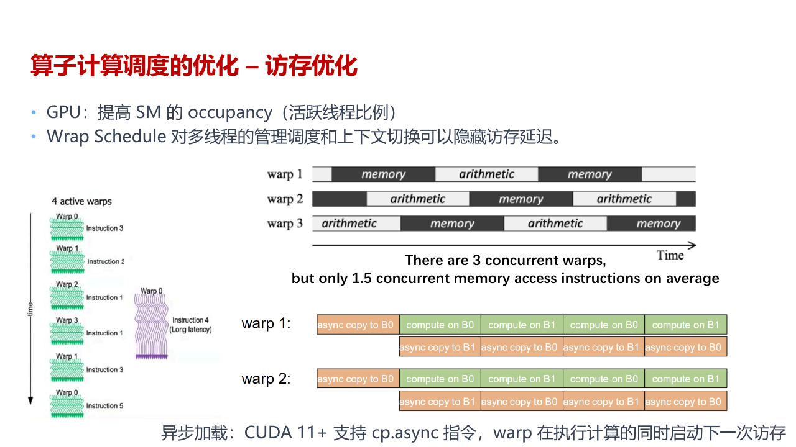
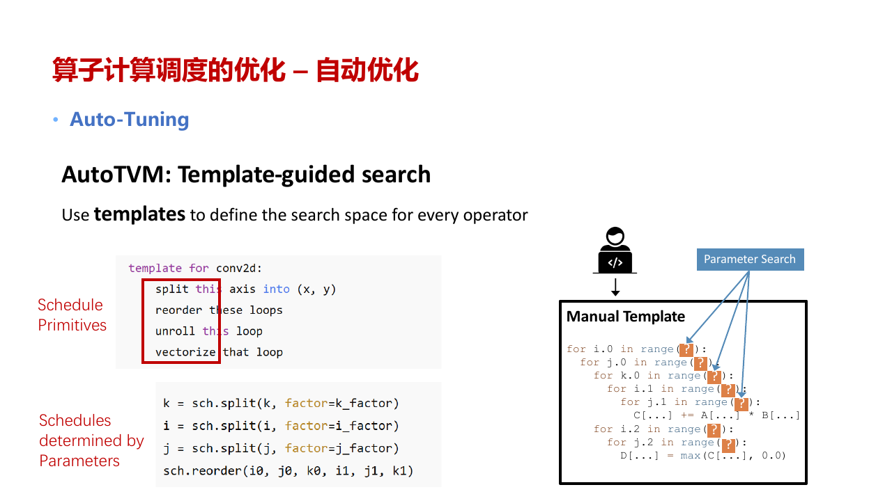
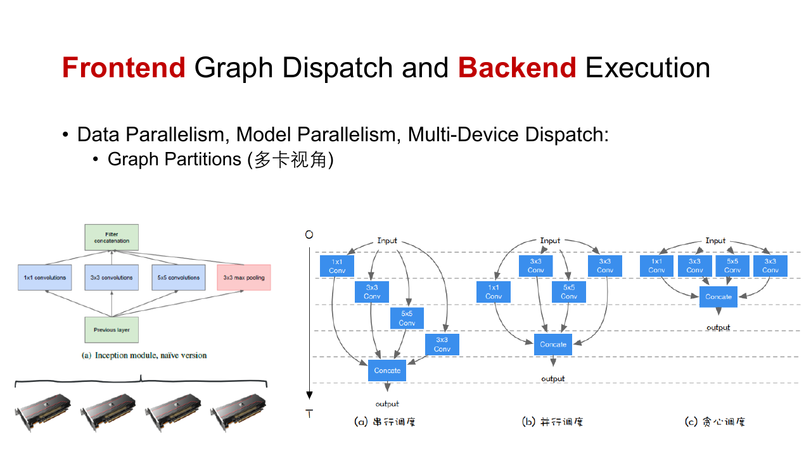

前端交给后端的是合法、类型明确的 IR。后端要把其中的 Tensor 运算变成目标设备能高效执行的代码。相同的矩阵乘法放在 CPU、普通 CUDA Core 和 Tensor Core 上，计算结果一致，循环、数据布局与指令选择却完全不同。



后端的输出可以是一段机器代码、GPU kernel、设备二进制，也可以是一份包含 kernel 与数据传输的执行计划。

## 计算与调度

计算定义回答要算什么。以矩阵乘法为例

$$
C_{ij} =
\sum_{k=0}^{K-1}
A_{ik}B_{kj}
$$

最直接的实现是三层循环。

```cpp
for (int i = 0; i < rows; ++i) {
    for (int j = 0; j < columns; ++j) {
        float value = 0.0f;
        for (int k = 0; k < inner; ++k) {
            value += a[i][k] * b[k][j];
        }
        c[i][j] = value;
    }
}
```

Schedule 回答这些循环怎样执行。它会决定循环顺序、分块大小、并行轴、向量化方式，以及数据在 global memory、shared memory 和 register 之间何时搬运。

同一个计算定义可以有许多合法 Schedule。它们都返回相同矩阵，性能却可能相差几个数量级。

### 循环变换

Interchange 调整循环顺序。若内层循环沿连续地址前进，cache line 或 memory transaction 中的数据能被充分使用；若每次跨很大步长，带宽会浪费在没有访问的字节上。

Split 把一条长轴拆成外层与内层。例如长度为 $N$ 的轴可以写成

$$
i =
i_oT+i_i
$$

这里用 $T$ 表示 tile size，用 $i_i$ 表示一个 tile 内的位置。二维矩阵的两条轴都 split 后，就得到矩形 tile。

Tile 让一小块数据在更快的存储层里反复使用。矩阵乘法中，一个 $A$ 子块和一个 $B$ 子块先进入 shared memory，再被同一 block 内的多个 thread 使用。

Fuse 把多个循环轴压成一条线性轴，方便映射到 thread id。Unroll 展开短循环，减少分支与索引开销；展开过多会增加指令体积和寄存器压力。Vectorize 把连续标量操作映射到 SIMD 指令，Tensorize 则把一段特定循环映射到 Tensor Core MMA 一类硬件 intrinsic。



这些变换会互相影响。更大的 tile 能增加复用，也会占用更多 shared memory；融合减少中间写回，却可能生成一个寄存器需求很高的 kernel。后端要同时满足依赖关系与资源限制。

## 调度表示与 GPU 映射

### 调度树

Schedule 可以表示为一棵嵌套树。树上包含循环节点、存储节点与计算节点。

```text
root
└── block_y
    └── block_x
        └── load_shared_tile
            └── thread_y
                └── thread_x
                    └── compute
```

移动计算节点的位置，会改变中间结果何时计算以及复用多久。若 Producer 放在 Consumer 的外层循环之外，它只计算一次，但要保存较大的中间 Tensor；若把它放进内层循环，中间值可以很小，却可能重复计算。

存在循环携带依赖时，变换还要保证顺序。例如前缀和的第 $i$ 项依赖第 $i-1$ 项，不能直接把这条轴上的所有迭代并行执行。Tensor 算子中的循环通常规则，依赖也比较清楚，因此适合做自动分析。

### 矩阵乘法的 GPU 映射

GPU Schedule 会把外层 tile 绑定到 block，把 tile 内的工作分给 warp 与 thread。



一个常见路径可以拆成这些动作。

1. 每个 block 负责输出矩阵中的一个矩形区域。
2. Thread 协作把 $A$ 与 $B$ 的子块从 global memory 读入 shared memory。
3. Block 内同步，保证子块已经完整到达。
4. 每个 thread 在 register 中累加若干输出元素。
5. 沿 $K$ 轴处理下一对子块。
6. 累加完成后，把输出写回 global memory。

若目标支持 Tensor Core，中间计算会继续切成 MMA 指令要求的 fragment。后端还要处理维度不足整块时的边界、数据对齐和累加精度。

可用 Schedule 受到硬件上限约束。

- 一个 block 的 thread 数不能超过设备上限。
- Block 使用的 shared memory 不能超过 SM 可分配容量。
- 每个 thread 使用的 register 越多，一个 SM 能同时驻留的 block 越少。
- Global memory 访问要尽量合并，shared memory 要避免严重 bank conflict。
- Tensor Core 对 shape、layout、alignment 与 dtype 有固定要求。

Occupancy 表示一个 SM 上实际活跃 warp 相对硬件上限的比例。较高 occupancy 有助于隐藏访存延迟，但并不自动带来最高性能。计算密集 kernel 可能更需要 register 复用，强行降低寄存器用量反而会增加访存。

## 算子选择与自动调优

### 整图代价

后端可以调用 cuBLAS、cuDNN 一类库，也可以生成专用 kernel。通用库覆盖大量 shape，成熟且稳定；生成代码能够针对固定 shape、融合区域或特殊布局专门优化。

Arithmetic Intensity 较高的算子更容易受峰值算力限制，较低的算子更容易受内存带宽限制。Element-wise 运算每读一个元素只做少量计算，单独优化算术指令意义不大；把它并入前后 kernel，减少一次完整读写往往更有效。

布局选择必须看整张图。某个卷积在 NHWC 下更快，但前后都使用 NCHW 时，两次 layout transform 可能抵消收益。后端要比较一串算子的总代价，而不是只选每个节点的局部最快实现。

自动混合精度也属于这类选择。矩阵乘法可以用 `float16` 输入和 `float32` 累加，归一化、指数与 loss reduction 则可能保留更高精度。插入过多 cast 会损失性能，精度过低又会溢出或下溢。

后端通常先标出适合低精度的候选算子。MatMul 与 Conv 能使用 Tensor Core，降低输入精度的收益明显；Softmax、归约、`exp`、`log` 和较小数值的累加更容易受舍入影响，常保留 `float32`。候选表只能给出起点，最终选择还要结合输入范围、累加 dtype 和用户允许的精度策略。

精度可以沿连续的兼容算子传播。例如 MatMul 后接 bias 与 ReLU 时，三者都接受低精度，就不必在每个节点之间往返 cast。到达需要 `float32` 的 Reduce 前再转换，既减少 kernel 和内存流量，也缩短低精度值的传播范围。若一个低精度分支很短，转换两次的开销可能比该算子省下的时间更大，整图代价模型应保留原精度。

训练图还要顾及 backward。Forward 某个输出改成低精度后，它可能成为 backward 保存的 activation，并影响梯度计算。混合精度 pass 因此不能只看前向节点的白名单，还要检查保存值、梯度累加和 loss scaling 的路径。

### Auto-Tuning

Tile size、循环顺序、unroll factor、thread binding 和 vector width 组合起来会形成很大的搜索空间。手写规则很难覆盖所有设备和 shape，Auto-Tuning 会生成候选 Schedule，并实际测量其中一部分。



一次搜索由 Search Space、Cost Model 和 Search Strategy 共同完成。

1. Search Space 定义哪些变换与参数组合合法。
2. Cost Model 根据已经测过的候选预测性能。
3. Search Strategy 选择下一批值得编译运行的配置。

随机搜索、模拟退火、遗传算法、贝叶斯优化和强化学习都可以用于挑选候选。Cost Model 只能减少实测次数，无法完全替代测量。Cache 命中、bank conflict、编译器指令选择和频率变化很难只靠静态特征准确估计。

测量程序要预热设备，多次运行并排除异常值。若 kernel 只有几微秒，Python 调用和同步开销会淹没真实时间，应在设备端连续执行多次并使用 CUDA event 计时。

调优结果通常按算子、shape、dtype、layout 与设备架构存入数据库。输入条件变化后，原来的最优 Schedule 未必仍然合适。

## 内存、执行与缓存

### 内存与执行计划

单算子 Schedule 决定局部数据放进 register、shared memory 还是 global memory。整图后端还要复用 Tensor 缓冲区、分配 workspace，并安排 device copy。

并行和内存之间经常冲突。两个算子放到不同 stream 可以重叠执行，但各自的 workspace 必须同时存在；改为串行后能够复用内存，吞吐则可能下降。

训练还要在 activation、gradient、optimizer state 与通信 buffer 之间分配显存。部分 activation 可以在 backward 时重算，省下的空间可能用来增大 batch。

交互式执行由 host 按依赖逐个提交 kernel。它与 Python 动态控制流配合自然，调试也方便，但小算子很多时，dispatch 与 launch overhead 会变得明显。

下沉式执行把较大的静态子图一次交给设备 runtime，后续调度不再逐节点返回 host。



一份模型可以混合两种方式。无法捕获的动态区域保留交互式执行，稳定子图下沉；少量动态维度通过 guard、shape bucket 或设备侧控制流处理。

### 编译缓存

JIT 的首次运行要经历图捕获、优化、代码生成与编译，延迟可能远高于普通前向。生成结果只有被反复复用，编译成本才值得。

缓存键通常包含设备架构、dtype、shape、stride、算子属性和影响控制流的 Python 常量。键太细会为相近输入生成大量版本，键太粗又可能错误复用不兼容 kernel。

动态输入常采用两层策略。常见 shape 生成专用 kernel，获得较好性能；低频 shape 使用支持符号边界的通用 kernel。缓存还要设置容量与淘汰规则，否则长期服务会不断积累编译产物。
