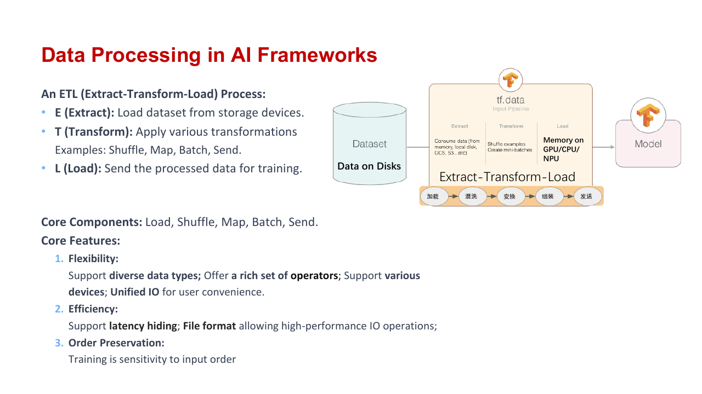
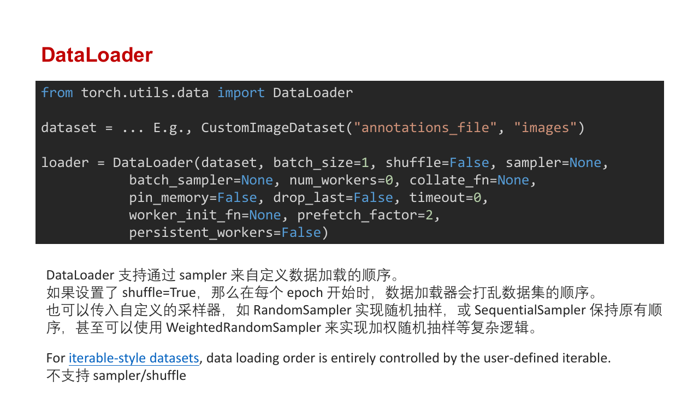
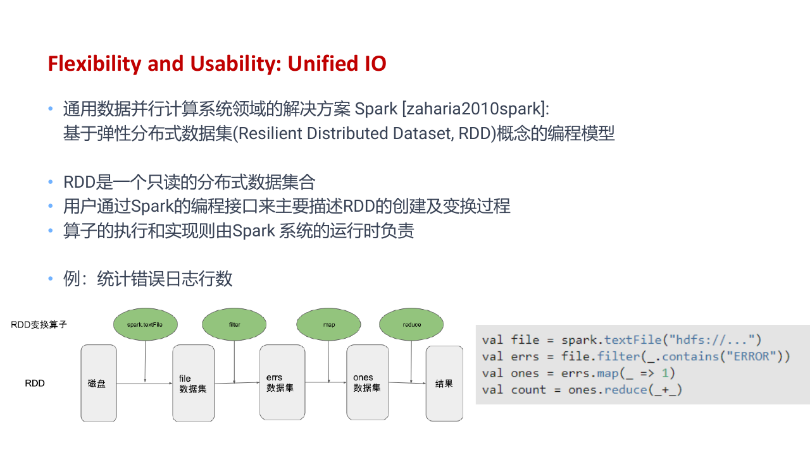
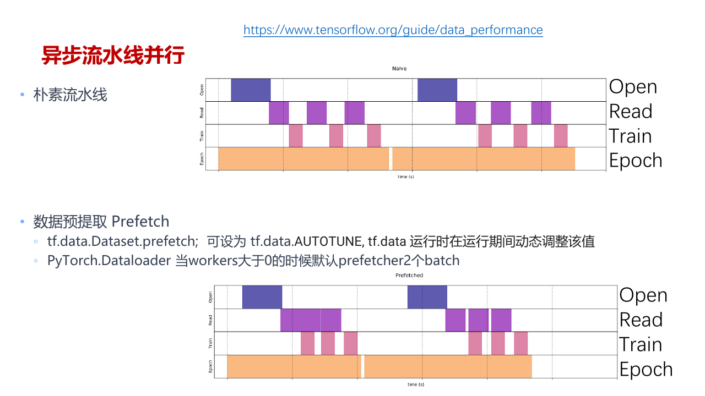
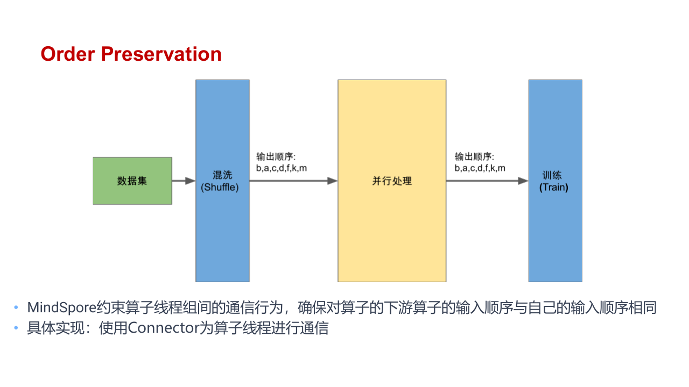
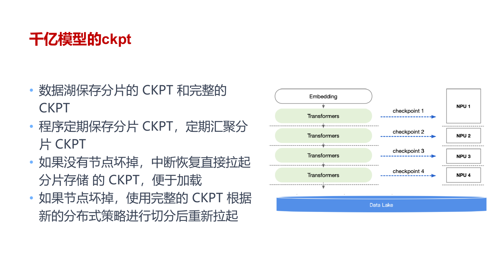

训练循环每次拿到的 `features` 和 `labels` 已经是整齐的 Tensor。它们在进入模型前，往往经历了文件读取、解码、随机变换、batch 组装、页锁定内存和设备传输。任何一环跟不上，GPU 都会停下来等数据。



一批图像从磁盘到模型大致经过这条路径

```text
文件或对象存储
    -> 读取压缩字节
    -> JPEG 解码
    -> 随机裁剪与归一化
    -> 组成 batch
    -> pinned host memory
    -> CUDA copy
    -> model
```

每一级都可以有自己的 worker 和队列。调优数据管线时，要找出最慢的一级，而不是盲目把 `num_workers` 调到很大。

## Dataset 表达样本来源

Map-style Dataset 实现 `__len__` 与 `__getitem__`。给定一个 index，它能定位并返回对应样本。

```python
from torch.utils.data import Dataset


class ImageDataset(Dataset):
    def __init__(self, records, transform=None):
        self.records = records
        self.transform = transform

    def __len__(self):
        return len(self.records)

    def __getitem__(self, index):
        image, label = load_record(self.records[index])
        if self.transform is not None:
            image = self.transform(image)
        return image, label
```

Dataset 只描述怎样取得一个样本，不决定访问顺序。Sampler 产生 index 序列，因此随机采样、按类别加权、分布式切分都能在不修改 Dataset 的情况下完成。

Map-style 适合有明确长度、能够随机定位记录的数据。单张图片、单条文本或带索引的二进制 shard 都可以使用它。

Iterable-style Dataset 实现 `__iter__`，样本按流产生。日志流、远程数据库、压缩归档和无限生成数据通常无法高效地按 index 随机访问，更适合这种形式。



```python
from torch.utils.data import IterableDataset, get_worker_info


class ShardedStream(IterableDataset):
    def __init__(self, shards):
        self.shards = shards

    def __iter__(self):
        worker = get_worker_info()
        if worker is None:
            assigned = self.shards
        else:
            assigned = self.shards[worker.id::worker.num_workers]

        for shard in assigned:
            yield from read_shard(shard)
```

多个 worker 各自拥有 Dataset 副本。若每个副本都从第一个 shard 开始读，同一份数据会被重复多次。`get_worker_info()` 让每个 worker 只处理自己的 shard。分布式训练还要先按 rank 分一次，再在 rank 内按 worker 继续分。

流式数据可能没有精确长度，epoch 可以由读取样本数、token 数或训练 step 数定义。

## 文件组织会影响吞吐

数百万个小文件会产生大量目录查找与随机 I/O。每张图片本身很小，打开文件的成本却无法忽略。常见做法是把许多样本打包成较大的 shard，并在 shard 内保存索引。

训练时可以随机打乱 shard 顺序，再顺序读取每个 shard 内的字节。这样减少了 metadata 操作，也更适合对象存储的高延迟访问。



统一 reader 可以让本地文件、HDFS 和 S3 使用相似 API，但它们的延迟、重试和一致性并不相同。远程存储通常需要本地 cache、超时与重试；若缓存没有容量限制，训练几天后也可能把磁盘占满。

JPEG decode、音频解码与 tokenization 常在 CPU 上进行。增加 worker 只在这些操作能够并行、且存储带宽尚未饱和时有效。瓶颈已经是网络或磁盘时，再开进程只会增加竞争。

## Shuffle 到底打乱了什么

Map-style Dataset 可以在每个 epoch 生成完整 index permutation，获得全局 shuffle。

流式数据不能先把所有样本 index 放进内存，常用固定大小的 shuffle buffer。先读入 $B$ 个样本，每次随机取出一个交给下游，再用新样本补上空位。缓冲区大小 $B$ 越大，顺序越接近全局随机，内存与启动等待也越大。

只打乱 shard 而不打乱 shard 内样本时，同源数据仍会成段出现。通常会同时随机 shard 顺序，并在每个 shard 内或跨少量 shard 使用 buffer。

为了复现实验，随机种子应区分这三个量：

- Epoch 决定每轮顺序不同。
- Distributed rank 决定各进程取得不同切片。
- Worker id 决定同一进程里的 worker 不生成相同随机变换。

只保存一个全局 seed 还不够。精确恢复流式训练时，还要记住当前 shard、reader offset 和 shuffle buffer 状态。

## Transform 与 Collate

Transform 把单个原始样本变成模型需要的表示。训练集可以随机裁剪、翻转或加入颜色扰动；验证集应保留确定性的 resize 与 normalize，不能沿用训练增强。

`collate_fn` 接收一组样本并组成 batch。固定形状 Tensor 可以直接 `stack`，长度不同的文本或语音则要 padding，并额外返回真实长度或 mask。

```python
def collate_batch(samples):
    sequences, labels = zip(*samples)
    lengths = torch.tensor([len(sequence) for sequence in sequences])
    padded = torch.nn.utils.rnn.pad_sequence(
        sequences,
        batch_first=True,
    )
    return padded, lengths, torch.tensor(labels)
```

按长度分桶可以减少 padding。若把整个数据集彻底按长度排序，相邻 batch 会长期包含相似样本，随机性也随之下降。更稳妥的做法是先全局 shuffle，再在局部窗口内按长度组 batch。

## DataLoader 中有哪些进程

`DataLoader` 把 Dataset、Sampler、worker process、batching 与队列组合起来。

```python
loader = torch.utils.data.DataLoader(
    dataset,
    batch_size=128,
    shuffle=True,
    num_workers=8,
    pin_memory=True,
    persistent_workers=True,
    prefetch_factor=2,
)
```

`num_workers=0` 时，训练进程亲自调用 `__getitem__`、Transform 和 Collate。代码最容易调试，但读取或解码较慢时，模型计算会频繁等待。

`num_workers>0` 时，worker 提前准备 batch，再通过 multiprocessing queue 送回主进程。Dataset 对象会进入各 worker，数据库连接、文件句柄和不可序列化对象不能想当然地共享。通常应在 worker 内懒初始化这些资源。

Linux 的 `fork` 与 Windows 的 `spawn` 创建进程方式不同。使用 `spawn` 时，启动入口要放在 `if __name__ == "__main__":` 下，否则子进程导入主模块时可能再次创建 DataLoader。

`persistent_workers=True` 让 worker 跨 epoch 保留，省去反复启动进程与建立连接的成本。Dataset 状态若依赖 epoch，需要显式通知 worker 更新；长期增长的 worker cache 也会造成内存泄漏。

## Prefetch 与设备传输



Prefetch 让 worker 在 GPU 处理当前 batch 时准备后面的 batch。`prefetch_factor=2` 表示每个 worker 最多预先排队两个 batch。队列太浅时 GPU 容易断粮，太深时 host memory 占用很大，异常也会更晚暴露。

普通 pageable host memory 进行 CUDA copy 时，runtime 往往先把数据复制到临时 pinned memory。`pin_memory=True` 让 DataLoader 提前把返回 Tensor 放入页锁定内存，DMA 才能稳定地异步读取。

训练循环还要使用 `non_blocking=True`。

```python
for features, labels in loader:
    features = features.to("cuda", non_blocking=True)
    labels = labels.to("cuda", non_blocking=True)
    output = model(features)
```

这并不保证复制一定与计算重叠。Host 源数据要位于 pinned memory，复制与计算还要进入能够并行的 CUDA stream，代码也不能立即读取结果并触发同步。

更完整的预取器会在 copy stream 中传输下一批数据，让 compute stream 继续处理当前 batch。使用下一批前，compute stream 等待对应 event 即可，不需要同步整张 GPU。

## 顺序、队列与背压

不同样本的解码时间可能相差很大。多个 worker 并行时，后面的 batch 已经完成，前面的慢 batch 却仍未返回。若 DataLoader 严格遵守 Sampler 顺序，完成的后续 batch只能在队列里等待，这叫 head-of-line blocking。



允许乱序可以提高吞吐，却会改变训练样本顺序，也让恢复与复现更困难。是否值得取决于任务是否依赖稳定顺序。

Producer 快于 Consumer 时，队列不能无限增长。每一级都要设置容量上限，队列满后让上游暂时停止，这就是 backpressure。Consumer 经常等空队列，则说明读取、解码、变换或传输中的某一级太慢。

可以分别记录这些时间：

- 训练循环等待 DataLoader 的时间。
- Host-to-device copy 的时间。
- 模型 forward、backward 与 optimizer 的时间。
- GPU utilization 与存储吞吐。

只有 DataLoader wait 明显占比高时，增加 worker 或预取才可能有效。

## 分布式采样

数据并行中，每个 rank 都有一份模型副本，但必须取得不同样本。Distributed Sampler 先生成同一份全局随机排列，再按 rank 切成若干子序列。

数据量不能整除 world size 时，可以补齐少量样本，也可以丢弃尾部。补齐会重复样本，丢弃会减少每个 epoch 实际使用的数据。所有 rank 的 step 数必须一致，否则某些进程进入梯度 collective 后，其他进程已经没有数据可算，训练会一直等待。

Map-style Dataset 通常在每个 epoch 调用 `sampler.set_epoch(epoch)`，让所有 rank 使用共同的新随机排列。Iterable Dataset 则要在 reader 内同时考虑 rank 与 worker 的 shard 划分。

## Checkpoint 还要保存数据位置

训练恢复涉及模型参数、optimizer、scheduler、GradScaler、随机数状态、epoch 与 global step。



若希望恢复后继续读取完全相同的数据顺序，还要保存 sampler permutation、流式 reader offset、当前 shard 和 shuffle buffer。只恢复模型权重，训练能够继续，但后续样本可能重复或跳过。

大模型 checkpoint 往往由多个 rank 分片写入。每个进程保存自己持有的参数与 optimizer state，metadata 记录这些分片怎样重组。写入时可以先生成临时文件，全部完成后再原子更新 manifest，避免中断后留下一个名称完整、内容却缺失的 checkpoint。
