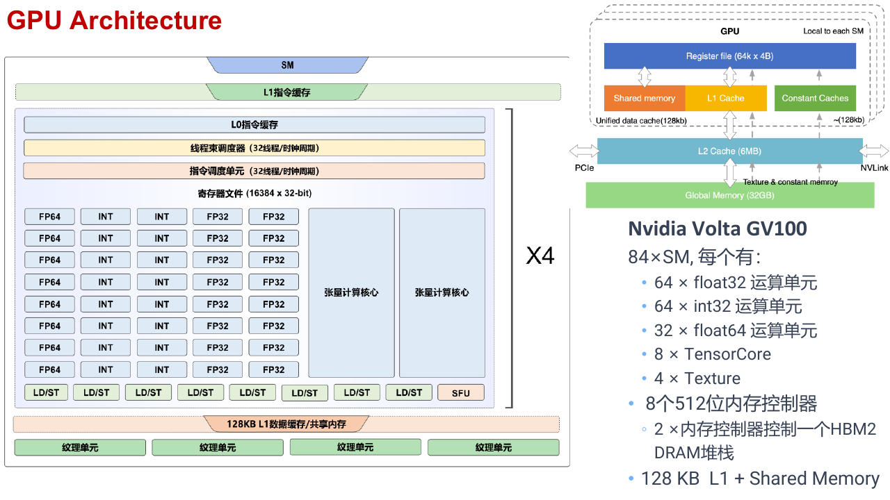
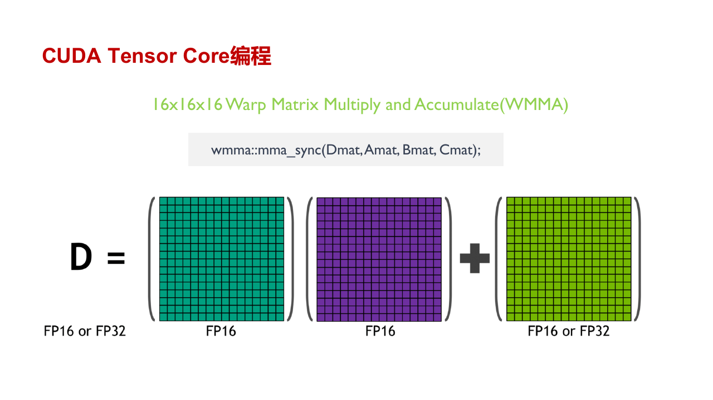
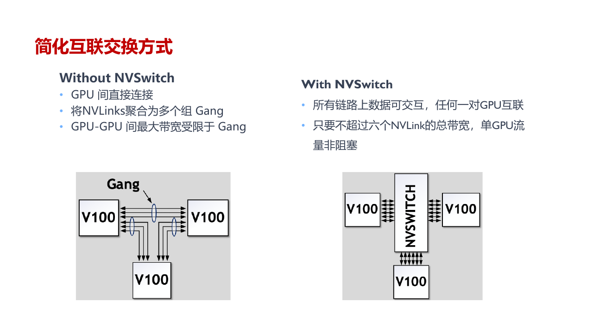
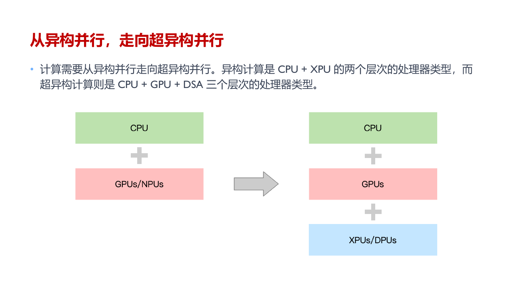
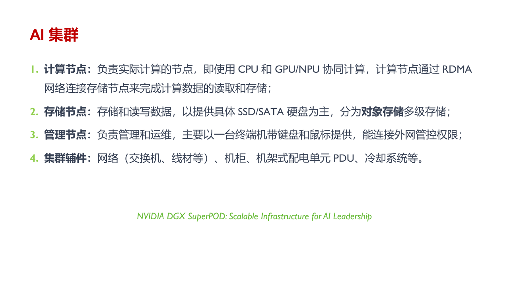
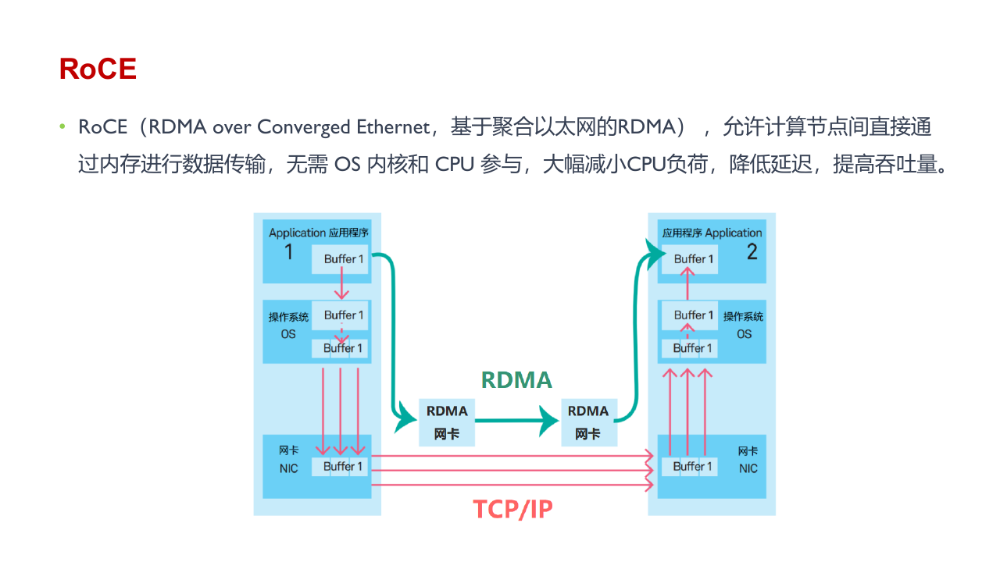
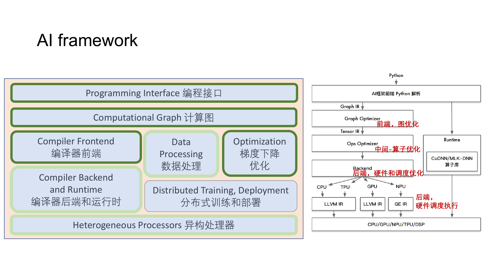

## AI 加速器

深度学习处理器围绕大规模矩阵运算、低精度计算和高带宽数据搬运设计。GPU 仍保留图形与通用并行计算能力，NPU、TPU 等加速器则把更多芯片面积用于 Tensor 运算阵列和片上存储。

一颗处理器的峰值算力不能单独说明模型速度。算子还受内存带宽、片上容量、互连、软件栈和实际利用率影响。稀疏或带复杂控制流的模型可能无法长期占满矩阵单元。

CPU 与 GPU 的设计取向不同。CPU 用较少的复杂核心处理分支、系统调用和不规则任务，并用较大的 cache 降低单条线程的延迟。GPU 放置大量相对简单的计算单元，用许多 warp 覆盖访存等待，适合让成千上万个元素执行相似操作。

以 `relu(x @ weight + bias)` 为例，Python 与 runtime 在 CPU 上准备参数和启动命令，矩阵数据位于 GPU global memory。Thread block 被分配到 SM 后，warp 协作读取矩阵子块；普通 CUDA Core 或 Tensor Core 完成乘加，bias 与 ReLU 可以接在矩阵乘法的 epilogue 中。结果写回显存后，下一层直接消费。只有程序真的要在 CPU 读取结果时，数据才需要跨 PCIe 返回 host。

这条路径里任一环节都可能限制速度。矩阵单元空闲可能是数据没到，显存带宽没满可能是 kernel 太碎，GPU utilization 很高也可能只是大量 warp 在等待通信。

### GPU 结构

NVIDIA GPU 由若干 Graphics Processing Cluster 组成，每个 GPC 继续包含 Texture Processing Cluster 与 Streaming Multiprocessor。CUDA thread block 会被调度到某个 SM，warp 则是 SIMT 执行的基本单位。

SM 内包含 CUDA Core、Tensor Core、warp scheduler、register file、shared memory 与 L1 cache。不同 GPU 代际会调整这些单元的比例和共享方式，但层次结构相近。

一个 kernel 的实际吞吐受资源共同限制：

- 每个 block 使用的 thread 数。
- 每个 thread 使用的 register 数。
- 每个 block 使用的 shared memory。
- warp 中的分支一致性与内存访问是否合并。
- 指令中计算、加载和同步的比例。

若 register 或 shared memory 使用过多，一个 SM 能同时驻留的 block 会减少。Occupancy 下降后，等待内存时可切换的 warp 也更少。

### Tensor Core

Tensor Core 执行小矩阵的 fused multiply-add，并把许多小块组合成 GEMM。Volta 引入的 WMMA 接口以 warp 为协作单位，后续架构继续扩展支持的数据类型和 tile shape。

概念上的运算形式为

$$
D=AB+C
$$

输入可以使用 `float16`、`bfloat16`、TF32 或整数，累加常使用更高精度。硬件峰值很高，但要满足 shape、alignment、layout 和数据类型条件。矩阵边长太小、无法整除 tile，或频繁转换布局时，Tensor Core 的优势会被准备成本抵消。

CUDA 的 `wmma` namespace 可以显式管理 fragment。生产代码一般通过 cuBLAS、cuDNN 或编译器生成 Tensor Core kernel，因为它们还会处理不同架构、边界 tile 和 pipeline。

### GPU、NPU 与 TPU

GPU 具有较成熟的通用编程生态和较强的算子覆盖，适合训练、推理以及非 AI 并行任务。NPU 通常针对移动端或数据中心推理设计，强调能效和固定算子路径。TPU 使用大规模矩阵阵列，并通过 XLA 等编译系统安排数据流。

不同设备不能只比较 TOPS：

- MAC count 与 FLOP count 的口径可能不同，一次乘加有时记为一次操作，有时记为两次。
- INT8 峰值不能直接与 FP16 或 FP32 峰值比较。
- 稀疏峰值可能假设固定结构稀疏，模型不满足时无法获得。
- 端到端速度还包括预处理、通信、非矩阵算子和 host 调度。

吞吐率描述单位时间完成的样本、token 或请求数，延迟描述单个任务完成时间。硬件利用率则比较实测吞吐与理论峰值。三者对应的优化目标并不相同。

### 运行生态

一块加速卡能否用于真实模型，还取决于它上面的软件是否完整。框架要能创建 device Tensor，编译器要能降低计算图，算子库要覆盖模型中的卷积、矩阵乘法、归一化和 attention，通信库还要支持多卡 collective。任何一层缺少实现，模型都可能回退到 CPU，或在 device 之间多做一次格式转换。

CUDA 生态从 driver 与 runtime 向上提供了多组专用库。cuBLAS 负责稠密线性代数，cuDNN 提供神经网络算子，cuSPARSE、cuFFT 与 cuRAND 处理各自的计算类型，NCCL 负责 GPU collective。PyTorch 等框架通常调用这些库，遇到需要融合或定制的子图时再生成 CUDA 或 Triton kernel。

ROCm 采用 HIP 作为编程接口，并提供 rocBLAS、MIOpen、rocSPARSE、rocFFT、rocRAND 与 RCCL 等对应组件。接口名称能够映射，不代表程序一定可以直接迁移。算子覆盖、支持的 dtype、编译器行为、kernel 性能与框架版本都可能不同，依赖 CUDA 特定扩展的项目还需要单独移植。

NPU SDK 也要解决相同问题，只是底层指令、内存层次和算子格式由厂商定义。一个算子即使能够运行，若需要频繁在设备偏好的 layout 与框架 layout 之间转换，端到端速度仍可能低于理论算力。评价硬件时，开发工具、调试器、profiler 和长期版本兼容性与 TOPS 同样重要。

## 节点内互连

PCIe 负责连接 CPU、GPU、网卡和存储设备，兼容性强，也承担 host 与 device 之间的大部分传输。它的物理拓扑并不是一条共享总线。两张 GPU 可能位于同一个 PCIe switch 下，也可能分别连接到不同 CPU socket；后一种路径需要跨 root complex 或 CPU 间互连，延迟更高，peer-to-peer 甚至可能不可用。

NVLink 为 GPU 之间提供比 PCIe 更高带宽的点对点连接。它同样不保证任意两张卡直接相连：数据可能经过另一张 GPU 转发，也可能退回 PCIe。程序看到的 GPU 编号不能说明实际距离，通信库会读取拓扑后再安排 ring 或 tree。

NVSwitch 把多条 NVLink 接成交换网络，让节点内 GPU 获得更接近全互连的通信能力。这样 collective 不必依赖少数 GPU 充当中转点，多组传输也能同时占用不同交换路径。

Collective library 会结合消息大小和拓扑选择 ring、tree 或分层算法。节点内先沿 NVLink 或 PCIe 完成 ReduceScatter，节点间再走 RDMA，最后回到节点内 AllGather，是大型训练中常见的两级通信结构。若进程与 GPU、CPU NUMA node 和网卡绑定错误，即使每一层硬件都很快，数据也可能绕一段不必要的慢路。

## 系统与集群

### 异构计算

同构系统使用同类处理器，任务切分与负载均衡相对直接。异构系统同时使用 CPU、GPU、NPU 或专用 accelerator，把不同阶段放到更合适的设备。

CPU 擅长控制流、系统调用与不规则数据结构，GPU 擅长规则的大规模并行，专用处理器则对特定算子具有更高能效。异构系统的难点是设备之间内存不统一，迁移数据可能比计算本身还贵。

任务图需要同时考虑计算成本和 transfer cost。把一个很小的算子单独送到 GPU 往往得不偿失；把相邻算子融合或把完整阶段下沉到 device，才能摊薄传输与 launch overhead。

超异构系统继续把基础设施任务交给 DPU 或其他领域专用处理器。CPU 保留 Python、控制流和系统服务，GPU 或 NPU 执行矩阵与 Tensor 运算，DPU 处理虚拟化、网络、存储和安全。用户看到的仍是一段模型程序，编译器与 runtime 要把子图、数据和控制消息送到不同处理器。

这种分工让大部分算力落在高能效的专用单元上，同时保留 CPU 的可编程性。代价是系统边界更多。一次算子切分可能跨越不同地址空间，任务完成顺序要用 event 或消息表达，错误也可能来自 host、device、网络或编译后的某一层，不能只检查单个 kernel。

### 集群

单机显存与算力有限，大模型训练会扩展到由大量计算节点组成的集群。节点通常包含多 GPU、CPU、host memory、本地 SSD 与高速网卡。

按职责划分，集群中的机器并不全都承担模型计算：

- 计算节点运行训练进程，GPU、CPU 与网卡之间的拓扑会直接影响集合通信速度。
- 存储节点保存数据集与 checkpoint，通常更看重大吞吐和并发读取能力。
- 管理节点负责调度、镜像分发、监控、日志和故障恢复。
- 登录与辅助节点提供开发入口、编译环境和集群服务，不应承载持续的训练流量。

集群网络常区分几种平面：

- 计算网络承载训练 collective 和 parameter traffic。
- 存储网络读取数据集与 checkpoint。
- 管理网络负责部署、监控与故障处理。
- 带外网络在主系统失效时仍可访问 BMC 等管理控制器。

前三类流量一般走操作系统可见的带内网络。BMC 使用独立的带外通道，即使计算节点死机或主网络配置错误，管理员仍可远程查看硬件状态并执行重启。

训练网络强调高带宽、低延迟与可预测的 tail latency。存储网络更关心总吞吐和大对象读取。把全部流量混在同一网络中，checkpoint 或数据读取可能与梯度同步互相争抢。

## 通信与软件栈

### RDMA 与 RoCE

Remote Direct Memory Access 允许网卡直接在远端注册内存与本地内存之间传输，减少 CPU 参与和额外复制。InfiniBand 原生提供 RDMA，RoCE 则把 RDMA 语义运行在 Ethernet 上。

GPU Direct RDMA 可以让网卡直接访问 GPU memory，省去先拷贝到 host buffer 的路径。要稳定获得性能，还需配置 lossless 或拥塞控制、队列、路由和 NUMA affinity。网络中少量拥塞就可能拖慢等待同一次 collective 的全部 worker。

### 软件栈

硬件之上还需要驱动、runtime、通信库、算子库、编译器与框架。它们并非彼此独立的工具集合，一次普通的模型调用会从上到下穿过整条路径。

Python 接口先接收模型与 Tensor。Eager 模式会逐个下发算子，编译模式则捕获连续的计算区域，建立带有 shape、dtype、layout 与 device 信息的 Graph IR。自动微分在这里生成反向依赖，图优化再执行常量折叠、死代码消除与算子融合。

编译器后端接过 Tensor IR 后选择算子实现、tile、并行轴和内存布局。成熟算子可以直接调用 cuBLAS、cuDNN、MIOpen 等库；融合子图或特殊 shape 则可能由 Triton、CUDA、HIP 或厂商编译器生成 kernel。选中的实现还要满足精度、workspace 和 determinism 等限制，不能只挑理论 FLOPs 最高的一项。

Runtime 负责分配 device memory、管理 stream 与 event、装载 kernel 并提交 launch。Driver 再把这些命令交给硬件队列。多卡训练还要经过 NCCL、RCCL 或厂商通信库，把框架中的 AllReduce、AllGather 和 AllToAll 映射到 NVLink、PCIe、InfiniBand 或 RoCE。

以 `relu(x @ weight + bias)` 为例，前端可以把三个操作识别成一个子图，后端为矩阵乘法选择 Tensor Core kernel，并把 bias 与 ReLU 放进 epilogue。Runtime 准备参数和 stream 依赖，driver 启动 kernel。若 shape 不满足 tile 条件，后端可能改用普通 CUDA Core；若 device 上没有某个算子，框架甚至会插入数据传输并回退到 host。

模型迁移失败时，应先确定问题停在哪一层。Graph break 属于捕获边界，unsupported dtype 或 layout 常出现在编译与算子选择阶段，invalid device function 多半与生成代码和硬件架构不匹配，collective timeout 则要继续检查 rank 顺序、网络和进程状态。把这些错误都归因于“设备不支持”很难找到真正的边界。

完整性能分析也要沿同一层次展开。Framework profiler 用来观察算子和 Graph break，kernel timeline 检查 launch、并发和同步，硬件计数器给出 memory bandwidth 与计算单元利用率，collective duration 与网络计数器则解释跨卡等待。DataLoader wait time 还会暴露 host 端供数不足。只看 GPU utilization 无法区分计算繁忙、通信等待或大量细碎 kernel。
