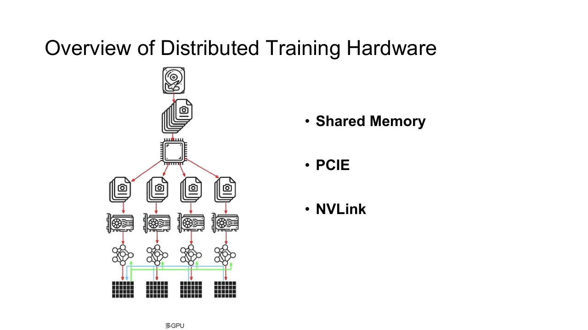
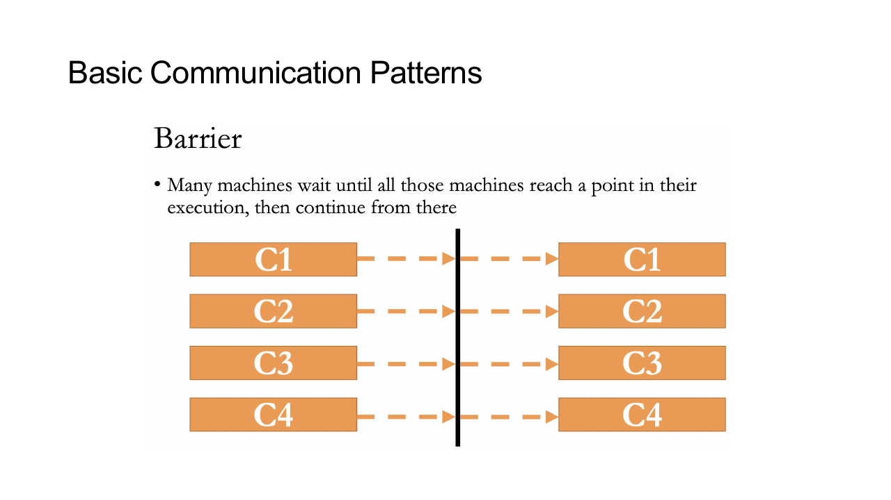
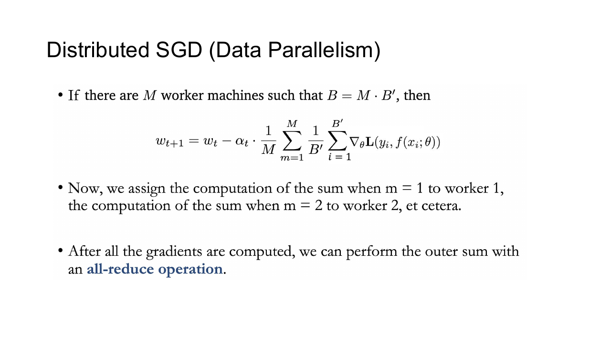
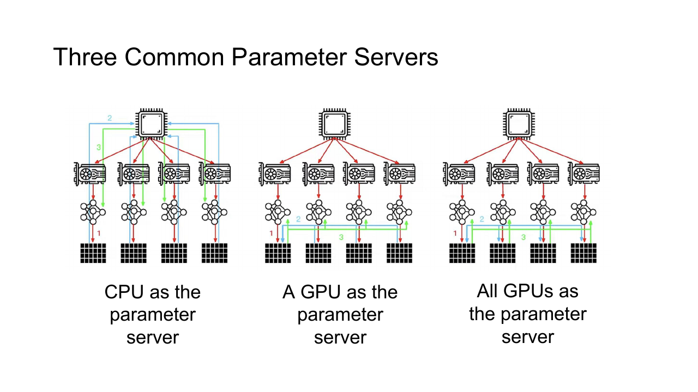
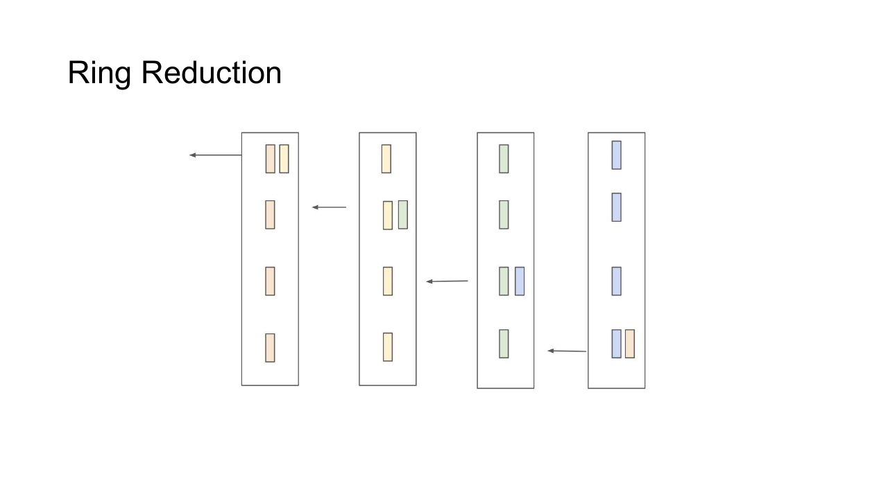
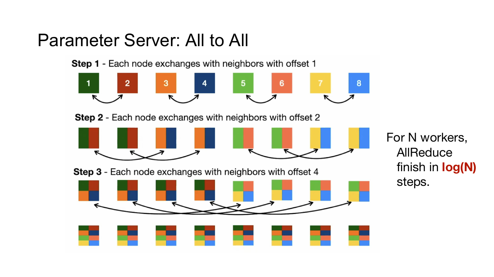

## 为什么要分布式训练

模型参数、训练数据和单次实验所需算力都在增长。单个加速器可能放不下模型，也可能需要几个月才能完成训练。分布式训练把计算、内存和存储扩展到多个 device 与多个节点。



扩展并不会自动带来线性加速。节点越多，计算被切得越细，通信、同步和负载不均衡所占比例越大。Amdahl's Law 表明无法并行的部分会限制最终 speedup。

分布式程序通常让每张 GPU 对应一个进程。每个进程有唯一的 rank，参与训练的进程总数称为 world size。多个 rank 先组成 process group，collective communication 只在这个 group 内发生。

```python
import os

import torch


torch.distributed.init_process_group(backend="nccl")

local_rank = int(os.environ["LOCAL_RANK"])
torch.cuda.set_device(local_rank)

model = model.to(local_rank)
model = torch.nn.parallel.DistributedDataParallel(
    model,
    device_ids=[local_rank],
)
```

一机四卡时，rank 常取 $0$ 到 $3$ 这四个值，每个进程只控制自己的 GPU。多机训练还需要把全局 rank 映射到节点和本地设备，不能把 global rank 直接当作本机 CUDA id。

## 通信层次

同一系统内的传输路径可以分成几层：

- 同一 GPU 内由 register、shared memory 和 global memory 连接 thread。
- 节点内 GPU 之间经过 PCIe、NVLink 或 NVSwitch。
- 节点间通过 Ethernet、InfiniBand、RoCE 与 RDMA。
- 远程存储还会占用独立或共享的网络链路。

通信时间常用简单模型表示

$$
T(n)=\alpha+\beta n
$$

$\alpha$ 是每次通信的固定启动延迟， $\beta$ 是每 byte 的传输成本， $n$ 是消息大小。小消息主要受 latency 限制，大消息主要受 bandwidth 限制。把许多小 Tensor 合并成 bucket，可以减少重复支付 $\alpha$ 的次数。

## Collective Communication

Collective 由一组 rank 共同参与。所有 rank 必须以一致的顺序进入相同 collective，否则程序会永久等待或直接报错。



- Broadcast 把一个 rank 的数据复制给所有 rank。
- Scatter 把一份数据切成若干块并分发。
- Gather 收集各 rank 的分片到一个 rank。
- AllGather 让所有 rank 都得到全部分片。
- Reduce 聚合所有 rank 的数据到一个 rank。
- AllReduce 聚合后把结果发给所有 rank。
- ReduceScatter 聚合并把结果分片留在各 rank。
- AllToAll 让每个 rank 分别向所有 rank 发送一个分片。

Reduce 的运算可以是 sum、max、min 或其他满足要求的结合操作。浮点加法不严格满足结合律，通信树和 rank 数改变后，低位结果可能略有差异。

## MapReduce

MapReduce 把数据处理拆成 Map、Shuffle 与 Reduce。Map 将输入记录变成键值对，Shuffle 把同 key 的值送到同一个 Reduce，Reduce 再完成聚合。

它适合离线数据处理，却不直接等同于每个 step 都要低延迟同步的神经网络训练。训练借用了分片与归约思想，但需要更紧密的迭代状态和高频 collective。

## 数据并行

Data Parallelism 在每个 rank 保存完整模型，把 mini-batch 按 rank 切分。rank $r$ 计算本地梯度

$$
g_r=\frac{1}{|B_r|}\sum_{x_i\in B_r}\nabla_\theta\ell(x_i;\theta)
$$

当各 rank 的 local batch size 相同时，随后对梯度执行 AllReduce 并取平均

$$
g=\frac{1}{P}\sum_{r=1}^{P}g_r
$$

所有 rank 使用相同 $g$ 更新相同参数，因此下一步仍保持一致。



若每个 rank 的 local batch size 不变，world size 增大后 global batch size 也会增大。学习率、warmup、正则化和训练步数可能都要调整。若保持 global batch 不变，则每个 rank 的计算量变小，通信更难被摊薄。

### 梯度 Bucket

Backward 从输出层向输入层逐步产生梯度。DistributedDataParallel 不必等所有梯度计算完再通信，而是把梯度按 bucket 组织；某个 bucket 中的梯度全部 ready 后，立即启动异步 AllReduce，与后续 backward 重叠。

Bucket 太小会产生大量小 collective，太大则推迟第一轮通信。参数在 backward 中的 ready 顺序与 bucket 顺序不匹配时，也会形成等待。

## 同步与异步 SGD

Synchronous SGD 每一步等待所有 worker 完成梯度。参数版本一致，行为最接近单机大 batch；最慢 worker 会决定整步时间，straggler 因此很昂贵。

Asynchronous SGD 允许 worker 使用稍旧的参数计算并独立提交梯度。它减少全局等待，却引入 staleness：梯度对应的模型版本可能已经落后。异步程度过高时，收敛会变慢或不稳定。

实践中的 GPU 大模型训练通常使用同步 collective，再通过数据预取、通信重叠和故障恢复降低等待成本。

## Parameter Server

Parameter Server 架构把参数分片放在 server，worker 拉取参数、计算梯度并推送更新。



它可以支持同步、异步和 bounded-staleness 多种一致性模型，也方便处理超大稀疏参数。热点参数或 server 网卡可能成为瓶颈，需要进一步分片、复制或分层聚合。

AllReduce 则让 worker 直接协作完成聚合，不保留中心 server。稠密梯度训练中，它通常能更充分地利用集群互连。

## Reduction 拓扑

### Tree Reduction

Tree 以 $O(\log P)$ 轮完成归约与广播，固定延迟较低，适合消息较小或层次化网络。树的上层链路需要承载更多聚合结果，拓扑不匹配时可能形成热点。

### Ring AllReduce

Ring AllReduce 分成 ReduceScatter 与 AllGather。每个 rank 把 Tensor 切成 $P$ 块，沿 ring 发送和聚合，之后再沿 ring 收集完整结果。



设四个 rank 各有一份分成四块的梯度。ReduceScatter 的每一轮中，每个 rank 向右邻居发送一块，同时从左邻居接收一块并累加。三轮后，每个 rank 持有一块已经聚合完成的结果。AllGather 再传三轮，把四块结果传播给所有 rank。最终每个 rank 都得到同一份完整梯度。

每个 rank 传输的数据量接近

$$
2\frac{P-1}{P}N
$$

当消息很大时，ring 能接近链路带宽上限；它需要 $2(P-1)$ 个通信阶段，小消息则容易被阶段延迟拖慢。

真实库会根据消息大小、rank 数和硬件拓扑在 ring、tree、CollNet 等算法间选择。多节点系统还可以先在节点内 ReduceScatter，再跨节点归约，最后回到节点内 AllGather。

## AllReduce 与 AllToAll

数据并行以 AllReduce 为主，Mixture-of-Experts 的 token dispatch 则常使用 AllToAll。



AllToAll 中每个 rank 都与其他 rank 交换不同分片，对网络双向带宽、路由和负载均衡要求更高。Expert 分配不均时，即使总 token 数相同，最拥挤的 rank 仍会决定整体速度。

## 性能分析

单步时间可以粗略拆成

$$
T_{step}=T_{input}+T_{forward}+T_{backward}+T_{communication}+T_{update}-T_{overlap}
$$

只增加 GPU 数而不改变模型和 global batch 时，单 rank 计算量下降，通信量却未必同步下降，scaling efficiency 会逐渐变差。

常见问题包括：

- DataLoader 让部分 rank 更晚进入 step。
- 不同输入长度造成计算不均衡。
- collective 顺序不一致或 bucket 过碎。
- 跨 NUMA、跨 PCIe root complex 或跨慢链路通信。
- 某个 rank 的频率、温度、网络重传或后台任务异常。
- 频繁读取 host scalar 导致隐式 device synchronization。

分析时要对齐各 rank 的 timeline。单看某一张 GPU 图，很容易把等待其他 rank 的空白误判成自身 kernel 性能不足。

## 容错与 Checkpoint

同步训练中任一 rank 失效都会中断 collective。训练系统需要定期保存模型、optimizer、scheduler、scaler 与数据位置。大规模任务还会使用 sharded checkpoint，避免由单一 rank 汇总全部状态。

Elastic training 可以在节点退出后重新组成 process group，但 world size 改变会影响 batch size、sampler 和学习率语义。恢复点必须明确记录这些配置，不能只依赖权重文件。
