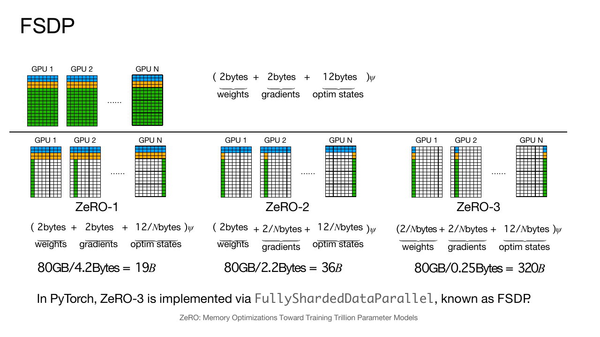
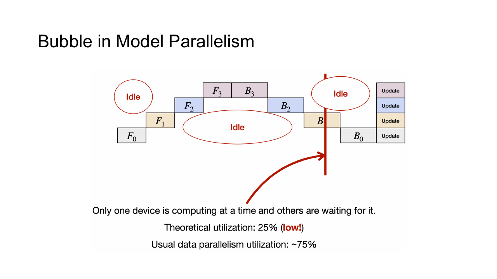
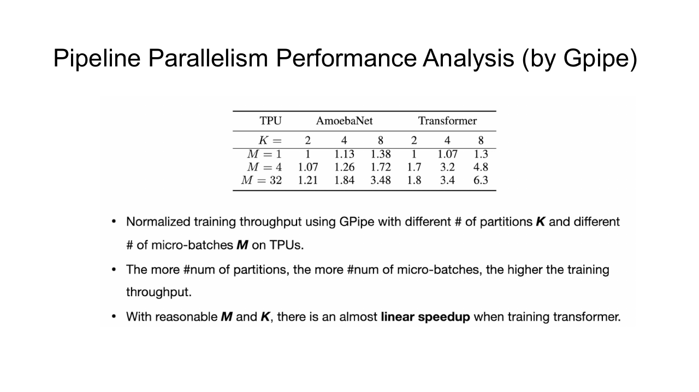
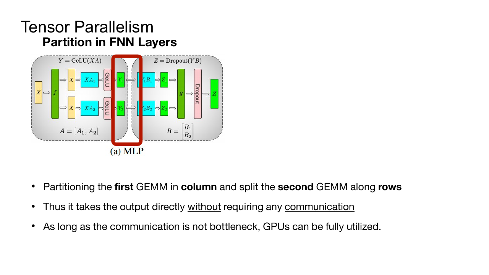
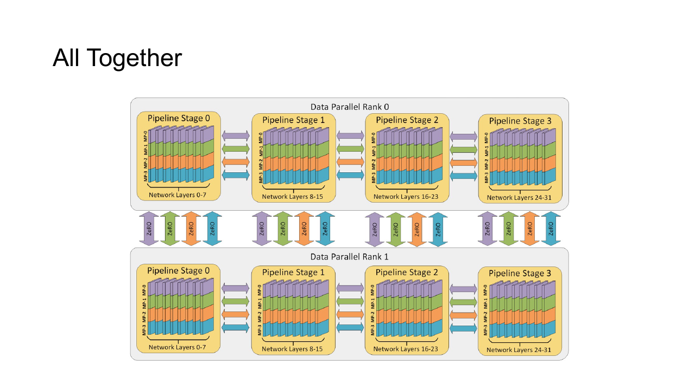
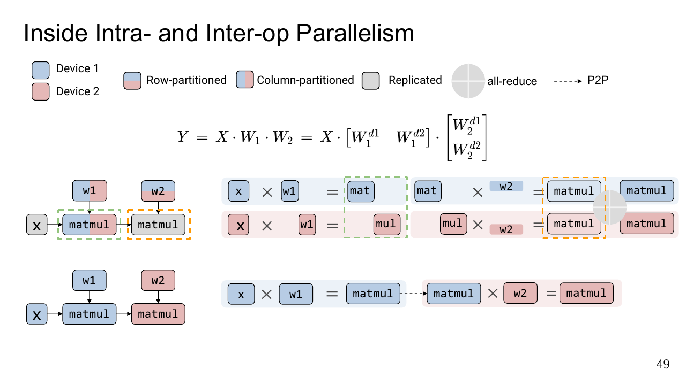
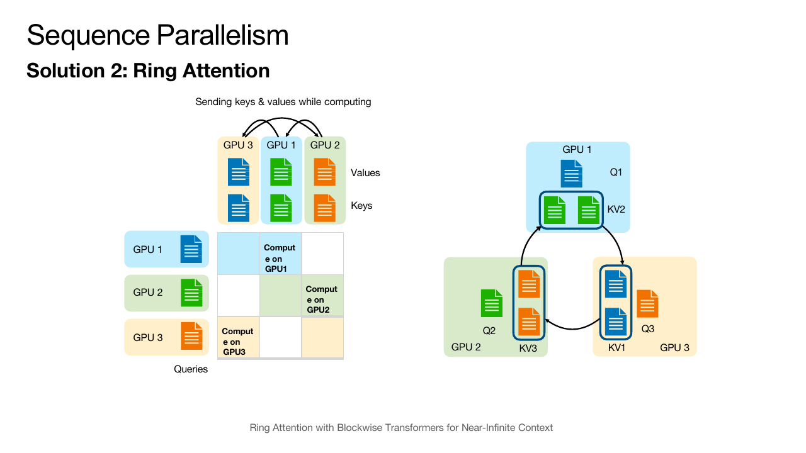
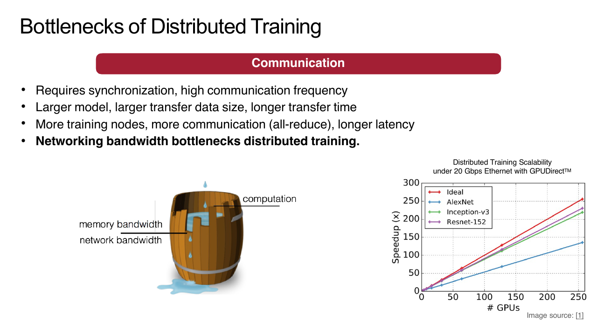

## 状态分片

普通数据并行要求每个 rank 保存完整参数、梯度和 optimizer state。以混合精度 Adam 为例，一份参数可能同时对应低精度权重、FP32 master weight、梯度以及两份 moment，实际占用远大于模型文件本身。

模型并行把参数或计算切到多块 device。切分方法决定了通信发生在层间、层内还是序列维，也决定每块 device 要保存哪些 activation。

一个常用的粗略估算是每个参数需要 $16$ byte。FP16 参数和梯度各占 $2$ byte，FP32 master weight、Adam 一阶矩和二阶矩各占 $4$ byte。以 $7$ billion 参数为例，仅这些状态就约需 $112$ GB，还没有计算 activation、临时 workspace 和通信 buffer。模型文件能放进显存，并不代表模型能够训练。

### ZeRO

Zero Redundancy Optimizer 逐步消除数据并行 rank 之间重复保存的状态。

- ZeRO-1 只分片 optimizer state。
- ZeRO-2 继续分片 gradient。
- ZeRO-3 连 parameter 也分片。

在 $P$ 个 rank 上，理想分片部分的单 rank 占用约降到原来的 $1/P$ 。通信量与通信时机则随 stage 改变。

ZeRO-1 中，每个 rank 仍保存完整参数和梯度，但只负责一部分参数的 Adam moment 与更新。一次 optimizer step 后，各 rank 需要交换自己更新的参数分片，让下一轮 forward 重新看到同一份模型。它主要省下占用最大的 optimizer state，改动也相对温和。

ZeRO-2 进一步让梯度在 ReduceScatter 后只留在负责该参数分片的 rank。这样既完成了跨 rank 求和，又避免每个 rank 都保存完整梯度。参数在 forward 时仍然完整，因此这一阶段没有解决模型权重本身放不进单卡的问题。

ZeRO-3 连参数也只保留分片。某层计算开始前先 AllGather 所需参数，计算结束后再释放完整副本；backward 到达该层时还要重新 gather。显存下降得最多，通信也变得更频繁。若层太小，每次 gather 的启动延迟会很显眼；若一次 gather 太多层，临时完整参数又会抬高峰值显存。

### FSDP

Fully Sharded Data Parallel 与 ZeRO-3 接近。每个 rank 平时只保存参数分片，执行某一层前 AllGather 出完整参数，计算结束后释放；backward 再次 gather 参数，并用 ReduceScatter 留下本 rank 的梯度分片。

一次 FSDP 单元的 forward 会经历参数 AllGather、局部计算和参数释放。Backward 到达该单元时，再次 AllGather 参数，算出梯度后执行 ReduceScatter。每个 rank 最终只留下自己的参数、梯度和 optimizer 分片。临时完整参数仍会形成峰值，因此 wrap 边界与预取距离会直接影响显存。

Gather 太细会产生大量小通信，太粗又会让峰值显存升高。实际系统把若干层 wrap 成 FSDP unit，并 prefetch 下一单元参数，使通信与当前计算重叠。

参数、梯度和 optimizer 分片还改变 checkpoint 格式。保存 full state dict 需要额外聚合内存；sharded state dict 更适合大模型，但恢复时必须知道原分片 metadata。

## 流水线并行

Pipeline Parallelism 按连续层切分模型。Device 0 完成前几层后，把 activation 发送给 Device 1；反向传播则把 gradient 反向发送。

若整个 batch 一次通过各 stage，除了当前工作的 stage，其余 device 大多空闲。把 batch 拆成 $m$ 个 micro-batch 后，各 stage 可以像流水线一样交叠。

假设模型被切成两个 stage。第一个 micro-batch 离开 Stage 0 后进入 Stage 1，此时 Stage 0 已经可以处理第二个 micro-batch。流水线填满后，两张 GPU 同时工作；开头等待后级启动、结尾等待前级排空的区域就是 bubble。

对于 $p$ 个 stage 的简单 GPipe schedule，forward pipeline 的有效利用率近似为

$$
\frac{m}{m+p-1}
$$

micro-batch 越多，bubble 比例越小，但 activation 数量、调度开销与 gradient accumulation 也会增加。

GPipe 先完成全部 forward 再执行 backward，需要保存很多 activation。1F1B schedule 在 warmup 后交替执行 one-forward-one-backward，可以降低峰值 activation。若各 stage 计算量不均衡，最慢 stage 仍会限制吞吐，因此分区时要按实测时间而非层数平均。

## 张量并行

Tensor Parallelism 在单个算子内部切分权重和计算。Transformer 中计算量最大的部分是线性层和 attention projection，很适合沿矩阵行或列分片。

### MLP

Feed Forward Network 可以写成

$$
Y=\phi(XA)B
$$

第一层权重 $A$ 按输出维 column partition 后，每个 rank 计算不同 hidden shard。激活函数逐元素执行，不需要先通信。第二层 $B$ 按输入维 row partition，每个 rank 得到部分输出，最后 AllReduce 求和。

若有两个 rank，第一层的 hidden width 会被切成左右两半。Rank 0 只生成前半激活，Rank 1 只生成后半激活；逐元素激活不会跨越两半。第二层各自把本地一半投影回输出维，两个结果相加才是完整输出，所以末尾需要一次 AllReduce。

这种 column-parallel 接 row-parallel 的组合只需在两层末尾通信一次。如果分片方向选择不当，就会在每层之间额外 AllGather。

### Attention

Self-attention 的四个线性变换可以写成

$$
Q=XW_Q,
\qquad
K=XW_K,
\qquad
V=XW_V,
\qquad
Y=\operatorname{Attention}(Q,K,V)W_O
$$

$W_Q$ 、 $W_K$ 与 $W_V$ 可以按输出维切分。每个 rank 只生成一部分 head，并在本地完成对应 head 的 score、Softmax 与 value 聚合。不同 head 在这段计算中互不依赖，不需要先交换完整的 Q、K、V。

Output projection $W_O$ 再按输入维切分。每个 rank 用自己的 head 输出计算一份局部结果，所有局部结果相加才得到完整的 $Y$ ，因此末尾需要 AllReduce 或 ReduceScatter。这样 QKV projection 到 attention 主体之间不通信，代价集中在 output projection 之后。

Head 数必须能够合理分给 tensor-parallel group。Multi-Query Attention 让所有 Q head 共用一组 K/V，Grouped Query Attention 则让若干 Q head 共用一组 K/V。K/V head 少于 rank 数时，不能再简单地让每个 rank 独占不同 head，通常要复制 K/V、缩小 tensor-parallel group，或沿 head 之外的维度继续切分。分片方案既要整除 shape，也要避免为了很小的 K/V Tensor 引入一次额外 collective。

## 序列与算子并行

**Inter-op parallelism** 把不同算子放到不同 device，典型形式是 pipeline。**Intra-op parallelism** 切分单个算子，典型形式是 tensor parallel。

计算图分区后，边上的 Tensor 可能从 replicated 变成 sharded，也可能沿另一维重新分片。编译器需要插入 AllGather、ReduceScatter、AllReduce 或 AllToAll 完成 reshard。两个局部最优分区之间若需要昂贵 reshard，整图性能仍可能很差。

Tensor parallel 常让 layer norm、dropout 等操作的 activation 在每个 rank 重复保存。**Sequence Parallelism** 把这些操作沿 sequence 维切分，减少 activation memory，并在进入需要不同布局的算子前执行 AllGather 或 ReduceScatter。

它与 tensor parallel 通常使用同一组 rank。通信量未必减少，但每 rank activation 占用降低，适合长序列训练。

上面的 Sequence Parallelism 主要切分 layer norm、dropout 等逐元素操作，attention 仍可能需要重新收集序列。若希望 attention 本身也保持 sequence shard，可以让每个 rank 固定保存一段 query，再逐步取得其余位置的 key 与 value。

标准 attention 需要构造长度为 $S$ 的 query 与 key 交互，计算量和 score matrix 都随 $S^2$ 增长。Ring Attention 沿 sequence 维切分 Q、K、V，每个 rank 保留一段 query，并让 K/V block 沿 ring 轮转。

每轮计算当前本地 Q 与收到的 K/V block，使用 online softmax 合并局部结果。轮转一圈后，每个 query 都见过完整 sequence。通信能与 block attention 计算重叠时，长序列可以扩展到多设备；网络太慢时，K/V 轮转会成为瓶颈。

Causal mask 允许跳过部分无效 block，但各 rank 的工作量可能因此不均衡，需要重新排列 block 或使用 load-balanced ring。

## 多维并行

大模型训练常同时使用多个维度：

- Data Parallelism 复制模型并切 batch。
- FSDP 分片数据并行副本中的状态。
- Tensor Parallelism 切单层矩阵。
- Pipeline Parallelism 切连续层。
- Sequence Parallelism 切 activation 的序列维。
- Expert Parallelism 在 Mixture-of-Experts 中切 experts，并通过 AllToAll 路由 token。

总 world size 是各并行维度乘积。每个维度建立自己的 process group，collective 只能在对应 group 内执行。rank mapping 应让通信最频繁的 tensor parallel 尽量留在节点内，较能容忍延迟的数据并行再跨节点。

并行方案的收益取决于计算与通信之比。Tensor parallel 几乎每层都通信，对 latency 很敏感；pipeline 主要传 activation 和 gradient，频率较低但容易产生 bubble；FSDP 频繁 AllGather 参数，对带宽和预取策略要求较高。

常见优化包括：

- 使用通信 bucket 合并小 Tensor。
- 提前 prefetch 下一层参数或 activation。
- 在独立 stream 中执行 collective，并用 event 表达依赖。
- 把通信密集 group 放在 NVLink 或同一高速网络域。
- 使用 activation checkpointing 降低显存，以额外重算换取更大的 micro-batch。
- 调整模型分区，使各 stage 的计算与显存接近均衡。

并行方案不能只按参数量决定。参数、activation、optimizer state、每层计算量、collective message size 和实际拓扑都会改变结果，最终还要用 profiler 检查通信与计算是否重叠。
