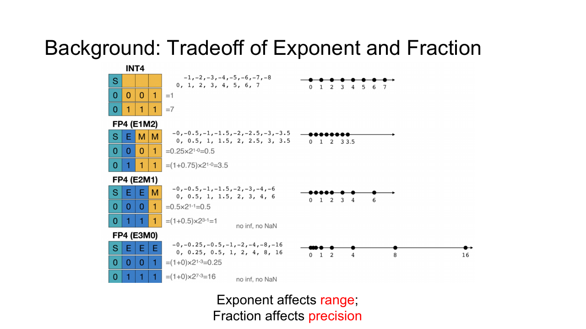
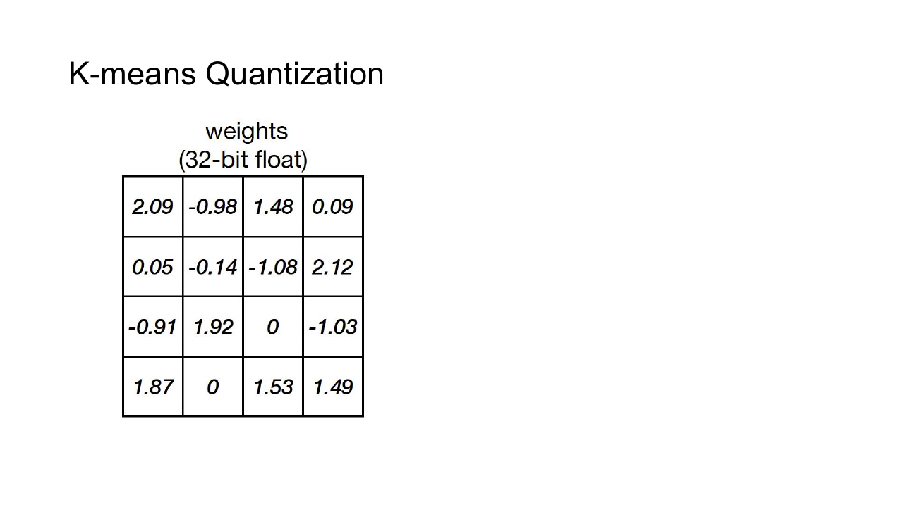
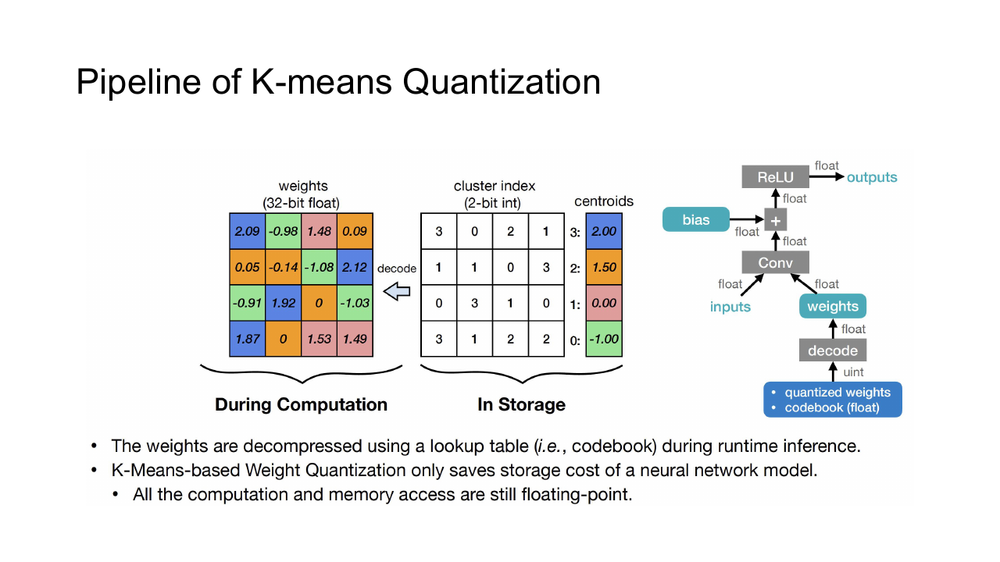
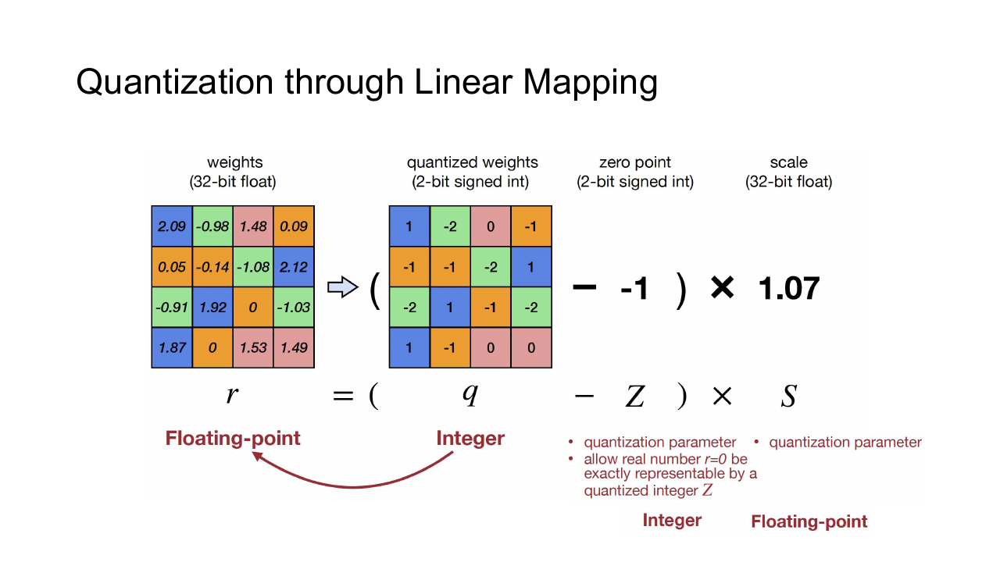
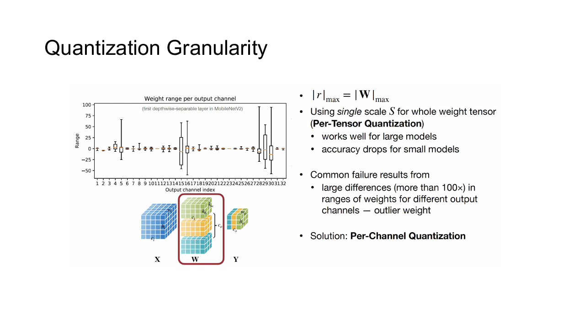
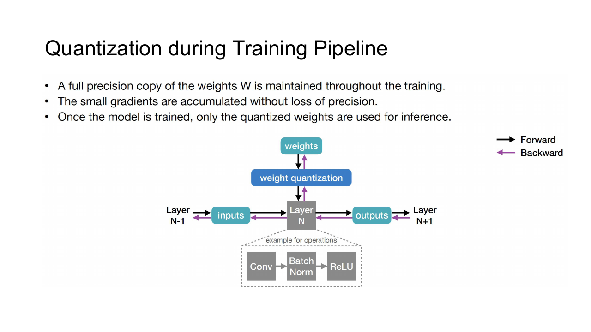
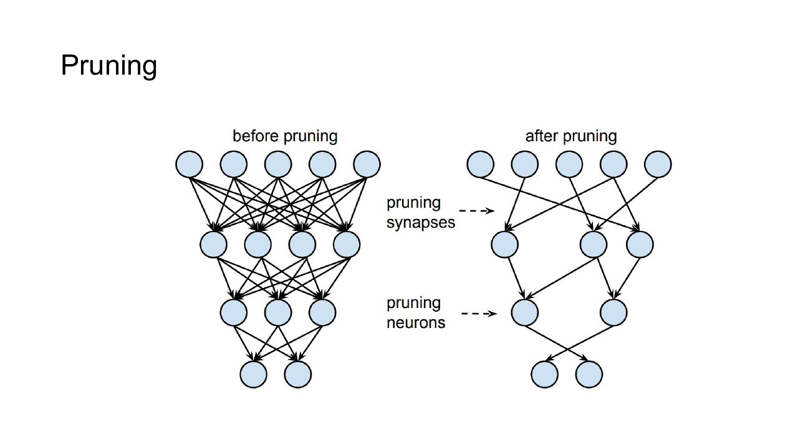

## 数值格式

量化用更小或更规则的数值集合近似原模型。目标可能是缩小模型、降低内存带宽、提高矩阵单元吞吐，或在只支持整数运算的设备上执行。

一个 $b$ bit signed integer 的范围为

$$
[-2^{b-1},2^{b-1}-1]
$$

浮点数把 bit 分给 sign、exponent 和 fraction。Exponent 越多，可表示范围越大；fraction 越多，同一数量级内的间隔越细。

FP16 的 exponent 较少，容易 overflow；bfloat16 保留与 FP32 相同数量的 exponent bit，范围更大但 fraction 更短。模型是否适合某种格式取决于权重、activation、gradient 与 accumulator 的数值分布。

## K-means Quantization

K-means quantization 从权重中学习 $K$ 个中心，模型只保存 codebook 和每个权重的中心 index。

训练过程反复执行 assignment 与 update：每个权重分给最近中心，再把中心更新为所属权重均值。

若 $K=2^b$ ，每个权重 index 只需 $b$ bit。Codebook 很小，存储收益在大矩阵上最明显。计算时可以先解码权重，也可以使用支持查表乘法的 kernel。

非均匀中心比统一间隔更贴合权重分布，但硬件实现和向量化更复杂。中心还可以在训练中继续更新，以减少聚类造成的损失。

## Affine Quantization

Affine quantization 用 scale $s$ 与 zero point $z$ 在线性网格上建立实数和整数的映射。

量化为

$$
q=\operatorname{clamp}\left(\operatorname{round}\left(\frac{r}{s}\right)+z,q_{min},q_{max}\right)
$$

反量化为

$$
\widehat{r}=s(q-z)
$$

给定实数范围 $[r_{min},r_{max}]$ 与整数范围 $[q_{min},q_{max}]$ ，常取

$$
s=\frac{r_{max}-r_{min}}{q_{max}-q_{min}}
\qquad
z=\operatorname{round}\left(q_{min}-\frac{r_{min}}{s}\right)
$$

随后还要把 $z$ clamp 到整数范围。zero point 使实数零能够被整数精确表示，padding 和 ReLU 等算子因此仍可保持自然语义。

可以手算一个 UINT8 例子。把 $[-1,3]$ 这一实数区间映射到 $[0,255]$ 这一整数区间，scale 约为

$$
s
=
\frac{3-(-1)}{255}
\approx
0.015686
$$

Zero point 取接近 $64$ 的整数。实数零映射到整数 $64$ 这一位置，实数 $1$ 则映射到整数 $128$ 附近，反量化后得到

$$
\widehat{r}
=
0.015686
\times
(128-64)
\approx
1.0039
$$

这 $0.0039$ 就是网格取整带来的量化误差。区间越宽，同样 $256$ 个整数格子越稀，误差通常也越大。

### Symmetric Quantization

对称量化令 $z=0$ ，使用正负对称范围。它省去 zero point 修正，kernel 更简单，常用于近似零均值的权重。若 activation 明显只分布在一侧，对称范围会浪费一部分整数码值。

### Asymmetric Quantization

非对称量化允许 $z\neq0$ ，能更好利用偏移分布的整数范围。代价是矩阵乘法中要处理额外的 offset 项。

## 范围校准

直接用绝对最小值和最大值确定 scale，容易被少量 outlier 拉宽范围，让大部分值集中在几个整数 bin 中。Post-Training Quantization 通常用 calibration dataset 统计 activation 分布，再选择 min-max、percentile、KL divergence 或均方误差等准则。

Clipping 会让超出范围的值饱和，却能提高主体区间的分辨率。最佳阈值取决于模型和层，不能只凭固定百分位决定。

Weight 在部署前固定，范围可以离线计算；activation 随输入变化，可能使用静态 calibration scale，也可能在每次运行时动态计算 scale。Dynamic quantization 更灵活，但会增加运行时归约成本。

## 量化粒度

- Per-tensor 为整个 Tensor 使用一组 $s$ 与 $z$ ，metadata 少、kernel 简单。
- Per-channel 为每个输出通道使用独立 scale，常用于卷积与线性层权重。
- Per-group 把若干连续元素共享一组 scale，是精度、metadata 与 kernel 复杂度之间的折中。
- Per-token 或 per-row 常见于 LLM activation quantization。

更细粒度能适应不同通道的范围，却需要保存更多 scale，并在 kernel 内加载和广播。硬件是否支持对应粒度会直接影响实际速度。

## 整数矩阵乘法

设输入与权重近似为

$$
X\approx s_x(Q_x-z_x)
\qquad
W\approx s_w(Q_w-z_w)
$$

则矩阵乘法为

$$
Y\approx s_xs_w(Q_x-z_x)(Q_w-z_w)
$$

内部乘法可以用 INT8，累加通常使用 INT32，最后再乘 scale 并 requantize 到输出格式。展开 zero point 后会出现行和、列和与常数修正项；对称权重量化令 $z_w=0$ 后，计算会简单许多。

Bias 的 scale 通常取 $s_xs_w$ 并存为 INT32。若 weight 使用 per-channel scale，每个输出通道的 bias scale 也不同。

## Post-Training Quantization

PTQ 在训练结束后执行，不需要完整反向传播。基本步骤为：

1. 选择量化算子与目标 dtype。
2. 用 calibration data 收集 activation 范围。
3. 量化 weight，确定 activation scale。
4. 执行量化模型并检查 accuracy 与 latency。
5. 对敏感层保留更高精度或采用更细粒度。

PTQ 成本低，但极低 bit、outlier 明显或分布变化大的模型可能损失较多精度。

## Quantization-Aware Training

QAT 在训练图中插入 fake quantization。前向过程执行 round、clamp 和 dequantization，模拟部署时的误差；参数仍以浮点格式保存和更新。

Round 的导数几乎处处为零，直接求导会让权重无法更新。Straight-Through Estimator 在未饱和区间近似令导数取值为 $1$ 这一常数，在区间外令导数取值为 $0$ 这一常数。这是一条人为选定的替代梯度，用来让量化误差进入训练过程。

Observer 或可学习参数负责更新 scale 与 zero point。训练后期常冻结统计量，避免量化范围继续抖动。BatchNorm 也可以提前 fold 到卷积权重和 bias 中，使训练图与部署图一致。

## 混合精度量化

不同层对量化误差的敏感性不同。输入层、输出层、LayerNorm、Softmax 或少数 outlier-heavy projection 可以保留 FP16，其余矩阵乘使用 INT8 或更低 bit。

精度选择还要考虑转换边界。若相邻算子在 INT8 与 FP16 之间频繁切换，quantize/dequantize kernel 和中间写回可能吃掉算力收益。整段子图保持同一格式通常更高效。

## Pruning

Pruning 删除不重要的参数或结构。

Unstructured pruning 按单个权重置零，压缩率高但形成不规则稀疏，只有专门 sparse kernel 才能提速。Structured pruning 删除 channel、head、filter 或 block，更容易直接缩小稠密矩阵，也更适合通用硬件。

Magnitude pruning 常按绝对值选择权重，训练中逐渐提高稀疏率，再 fine-tune 恢复精度。量化与剪枝可以同时使用，但两种误差会相互影响，需要重新校准或联合训练。
