## Serving 工作负载

### Serving 指标

在线 LLM 服务同时关心用户延迟与系统吞吐。只报告一轮完整生成耗时，很难看出瓶颈位于输入处理还是逐 token 解码。

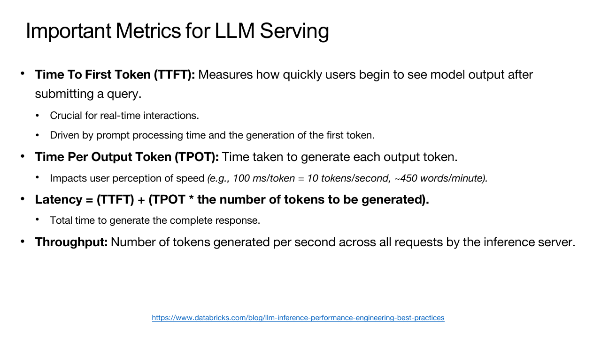

- Time To First Token 从请求到达算到首个输出 token 返回，主要包含排队、prefill 和首轮调度。
- Time Per Output Token 表示首 token 之后相邻输出 token 的平均间隔。
- Inter-Token Latency 更关注每一轮实际间隔及 tail latency。
- End-to-End Latency 是整个请求从进入到生成结束的时间。
- Throughput 可以按 request/s 或 output token/s 统计。

提高 batch size 往往提升 throughput，也会增加排队和单轮执行时间。服务系统通常以 TTFT、TPOT 的 Service Level Objective 为约束，在允许的延迟内尽量装入更多请求。

### 请求处理路径

用户提交 prompt 后，服务端先完成 tokenization，并检查输入长度、生成参数与可用显存。Scheduler 为请求分配 KV cache block，再把它放入等待队列。

请求第一次进入模型时执行 prefill。模型并行处理全部输入 token，建立每一层的 K/V，并计算最后一个位置的 logits。采样器从 logits 选出首个输出 token，服务端可以立刻把它流式返回给用户。

请求随后进入 decode 阶段。每轮只把最新 token 送进模型，读取此前的 KV cache，生成一个新 token，再把新 K/V 追加到 cache。Scheduler 会在每一轮把多个活跃请求重新组成 batch。某个请求遇到 EOS、达到长度上限或被用户取消后，它占用的 KV block 要立即归还。

排队、tokenization 和 prefill 主要影响 TTFT；decode 调度、权重带宽与 KV cache 读取主要影响 TPOT。

### Prefill 与 Decode

Autoregressive generation 分为两个阶段。Prefill 一次处理整个 prompt，计算各层 activation 并建立 KV cache；Decode 每轮只输入最新 token，复用已有 K/V，再生成下一个 token。

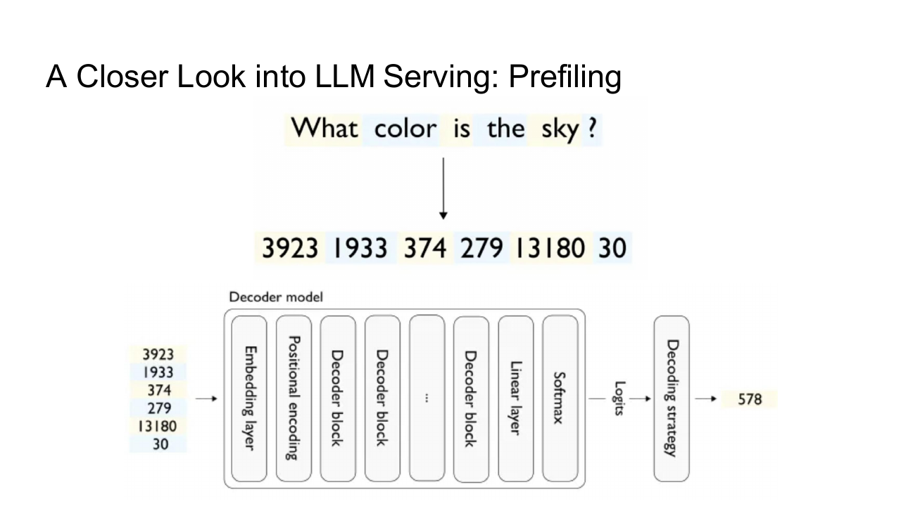

Prefill 中矩阵维度较大，GEMM 复用充分，通常更偏 compute-bound。序列长度增加时，attention 的计算与显存占用也迅速增长。

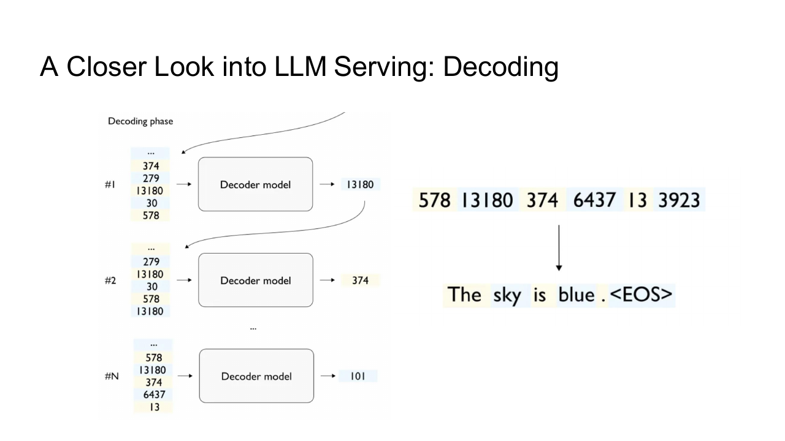

Decode 每轮矩阵的 token 维接近 $1$ ，要读取完整权重和不断增长的 KV cache，Arithmetic Intensity 较低，通常更偏 memory-bound。它还要重复执行许多短 kernel，launch 与调度开销更明显。

两阶段对硬件资源的偏好不同。把长 prefill 与低延迟 decode 无条件塞进同一 batch，前者可能阻塞后者，造成 TPOT 抖动。

## KV Cache 与 Attention

### KV Cache

Self-Attention 中，历史 token 的 K 与 V 在后续 decode 不会改变。把它们缓存后，每轮只计算新 token 的 Q、K、V，再让新 Q 与全部历史 K/V 做 attention。

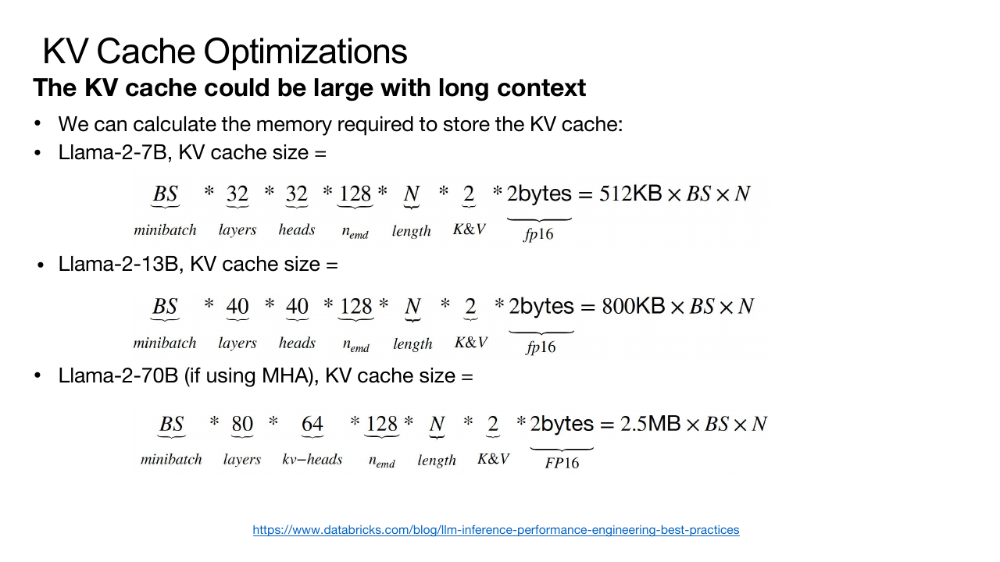

设层数为 $L$ ，batch 为 $B$ ，序列长度为 $S$ ，KV head 数为 $H_{kv}$ ，单 head 维度为 $D$ ，每个元素占 $e$ byte，KV cache 大小约为

$$
2LBSH_{kv}De
$$

前面的 $2$ 来自 K 和 V。长上下文、多并发与大 batch 会让 KV cache 很快超过模型权重，成为 serving 容量的主要限制。

请求长度不同，cache 还会产生空洞和预留浪费。只按最大长度为每个请求分配连续区域，显存利用率很低。

### MHA、MQA 与 GQA

Multi-Head Attention 为每个 Q head 配置独立 K/V head。Multi-Query Attention 让所有 Q head 共享一组 K/V，显著缩小 cache 与 decode 带宽；Grouped Query Attention 则让一组 Q head 共享一个 K/V head，在质量与效率之间折中。

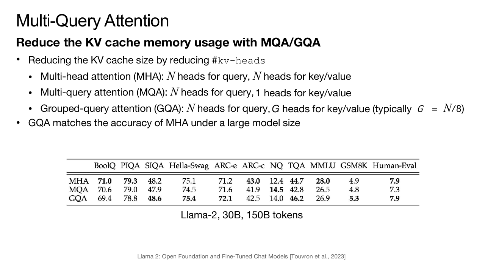

GQA 的 KV cache 大小按 $H_{kv}$ 缩放。当 $H_{kv}$ 远小于 Q head 数时，decode 读取量明显下降。模型结构已经决定 head 共享方式，serving 系统不能在不重新训练或转换权重的情况下任意改动。

## Batching

### Static Batching

Static batching 等待一批请求到齐，对 prompt padding 到共同长度，再一起生成。一个请求提前结束后，它的位置通常仍被保留到整个 batch 完成，造成计算浪费。

### Dynamic Batching

Dynamic batching 在短时间窗口内收集请求，按长度或到达时间组成 batch。它减少等待完整固定 batch 的时间，但 batch 一旦开始，仍可能被最长请求拖住。

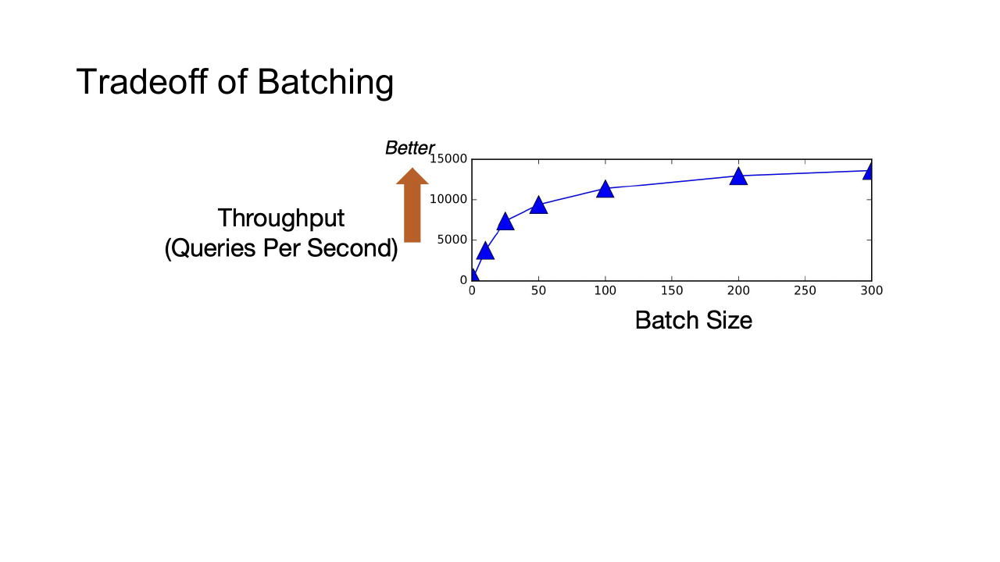

### Continuous Batching

Continuous batching 以 iteration 为单位调度。某个序列生成 EOS 后立即退出，空位可由新请求在下一轮补入。

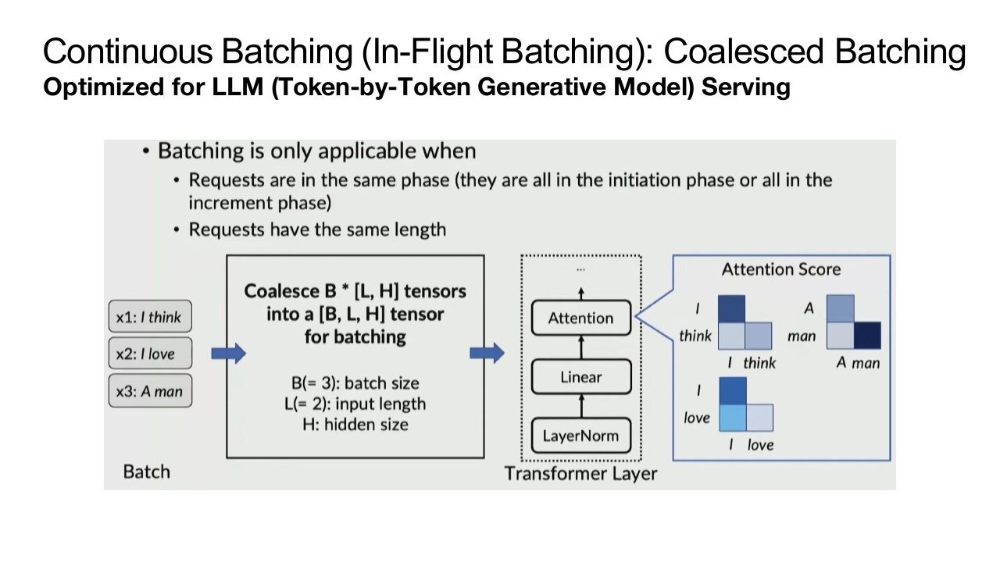

Scheduler 每轮选择 active sequences，准备 token、position 与 KV block table，再启动模型。它需要在吞吐、到达顺序、优先级与 SLO 之间取舍。只追求最大 batch 可能让早到请求长期等待。

### Prefill 与 Decode 的混合调度

若长 prompt 整段 prefill 一次执行，decode 请求会等待很久。Chunked Prefill 把 prompt 切成若干 token chunk，与 decode token 一起进入迭代。

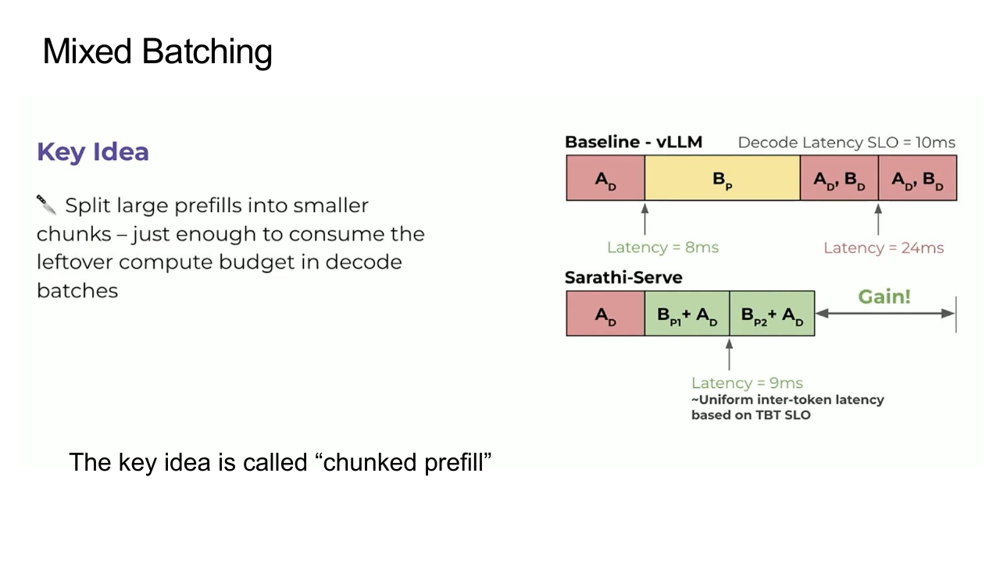

每轮可以设置 token budget：先保证已有 decode 的低延迟，再用剩余预算推进 prefill。Chunk 太小会增加调度和 kernel 开销，太大又会产生 head-of-line blocking。

Prefill 与 decode 的矩阵形状不同，混入同一个 kernel batch 未必最高效。系统可以在一轮中分别形成两个子 batch，再共享调度与 KV memory manager。

## KV Cache 管理

### PagedAttention

PagedAttention 把每个序列的 KV cache 切成固定大小 block，物理 block 不必连续。每个请求维护逻辑 block 到物理 block 的映射，与虚拟内存页表相似。

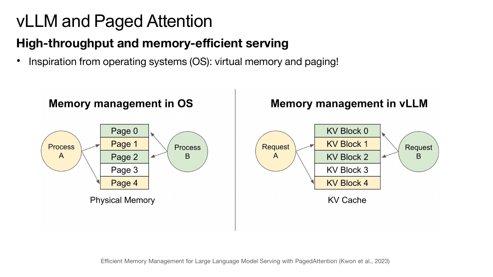

新 token 到来时只需追加一个 slot；请求结束后，物理 block 可以立即归还 free list。不同长度请求不再为最大序列预留完整连续区域，external fragmentation 明显降低。

Attention kernel 根据 block table 找到 K/V。间接寻址增加少量开销，但换来了更高显存利用率、灵活扩容与 copy-on-write。

### Prefix Sharing

多个请求可能共享 system prompt、few-shot 示例或同一 beam prefix。共享逻辑 block 可以让它们引用同一份只读 KV cache。

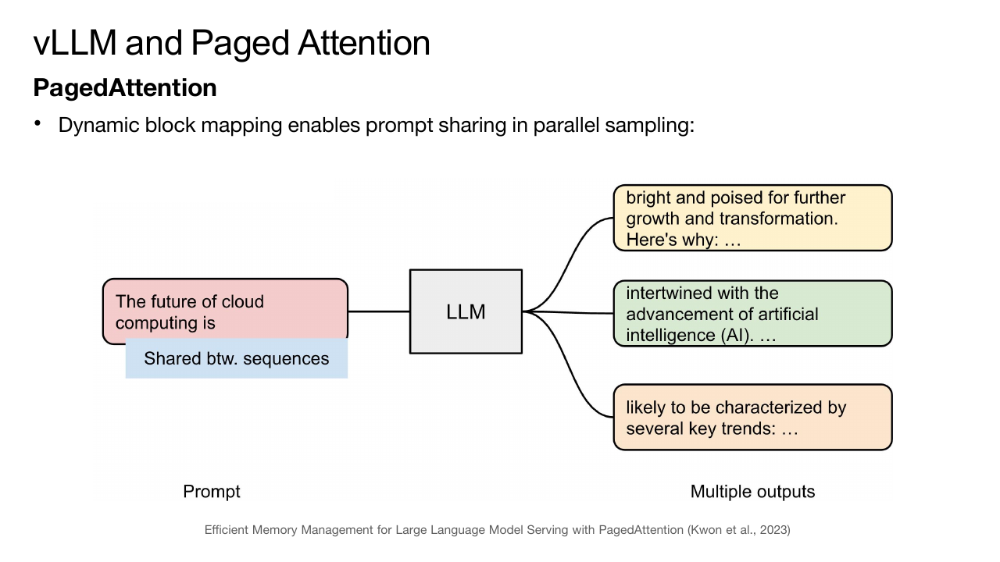

分支真正写入新 token 时分配新 block，必要时对最后一个未满 block 执行 copy-on-write。Prefix cache 还可以跨不同时间到达的请求复用，但要用模型版本、token 序列和位置编码配置构造可靠 cache key。

## Kernel 优化

### FlashAttention

标准 attention 写成

$$
O=\operatorname{softmax}\left(\frac{QK^\mathsf{T}}{\sqrt{d}}+M\right)V
$$

直接实现会把 $S\times S$ score matrix 写入 HBM，再读取完成 Softmax 和与 $V$ 相乘。长序列下，这些中间 Tensor 的 I/O 很昂贵。

FlashAttention 按 block 遍历 Q、K、V，在 SRAM 中计算局部 score，并使用 online softmax 合并块结果，不把完整 score matrix 写回 HBM。

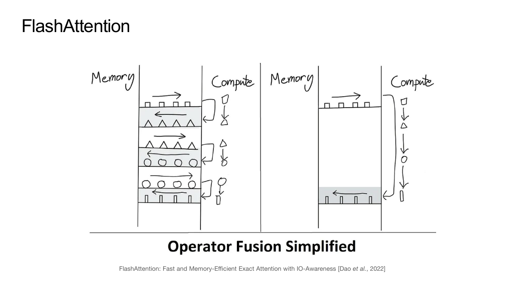

对当前块维护最大值 $m$ 、指数和 $l$ 与未归一化输出 $o$ 。合并新块最大值 $m'$ 时，旧累积需要乘 $e^{m-m'}$ 重新缩放。这样得到的结果与完整 Softmax 等价，只改变计算顺序和舍入误差。

FlashAttention 的关键收益来自减少 HBM I/O，不是近似 attention。Backward 可以重算部分 score，以额外计算换取更少 activation memory。

### Kernel Fusion 与 CUDA Graph

Decode 中单个 kernel 很短，RMSNorm、rotary embedding、bias、activation 和 residual add 等操作可以融合，减少中间读写与 launch 数量。

CUDA Graph 预先捕获一段稳定的 kernel launch 序列，后续整体重放，降低 CPU dispatch overhead。Continuous batching 的 active shape 不断变化，系统通常用若干固定 batch bucket 和 padding 复用已捕获的 graph。

## 解码与容量规划

### Speculative Decoding

Speculative Decoding 使用较小的 draft model 一次提出多个候选 token，再由 target model 并行验证。

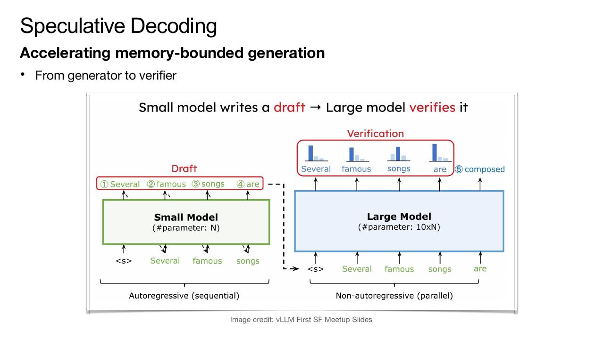

若候选被接受，target model 一次前向就推进多个 token；遇到拒绝位置时，从 target distribution 重新采样并停止本轮候选。正确的 acceptance rule 可以保持与 target model 自回归采样相同的输出分布。

收益取决于 draft model 速度和接受率。Draft 太大时自身成本过高，太弱时大部分候选被拒绝。Greedy decoding 可以采用更简单的匹配规则，sampling 则必须按概率比修正。

### 容量规划

单实例可服务的并发数受权重、KV cache、activation workspace 和 allocator reserve 共同限制。权重相对固定，KV cache 随 active token 数增长，因此 admission control 应按 token budget 而不只按 request count。

实际部署还要处理超时、取消、streaming response、优先级、模型热更新与失败重试。请求取消后要及时释放 KV block；模型版本切换时，旧请求仍需在旧实例完成，不能让 prefix cache 跨版本误复用。

性能测试应同时报告 prompt length、output length、并发、batch policy、dtype 与 latency percentile。单个固定长度请求的 token/s 无法代表在线服务在混合流量下的表现。
