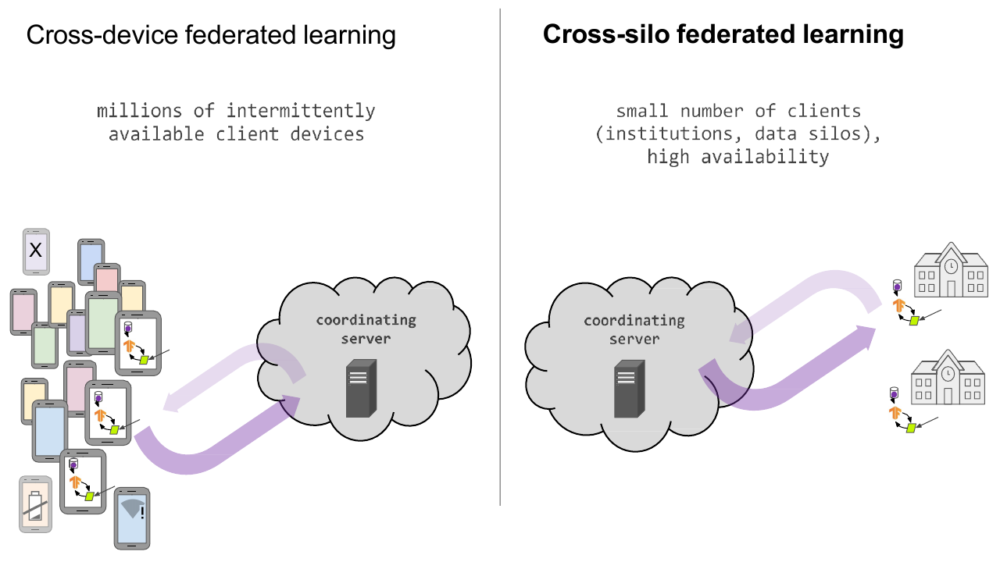
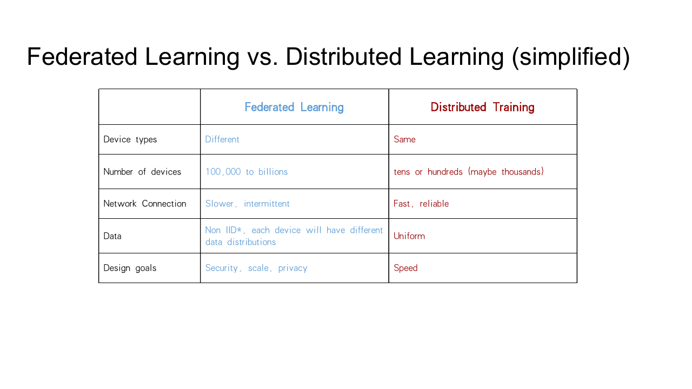
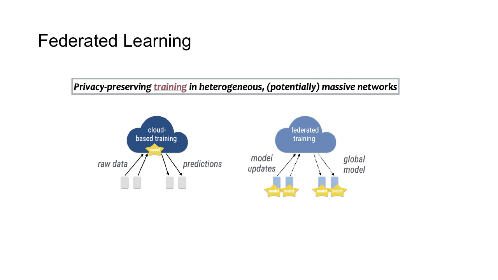
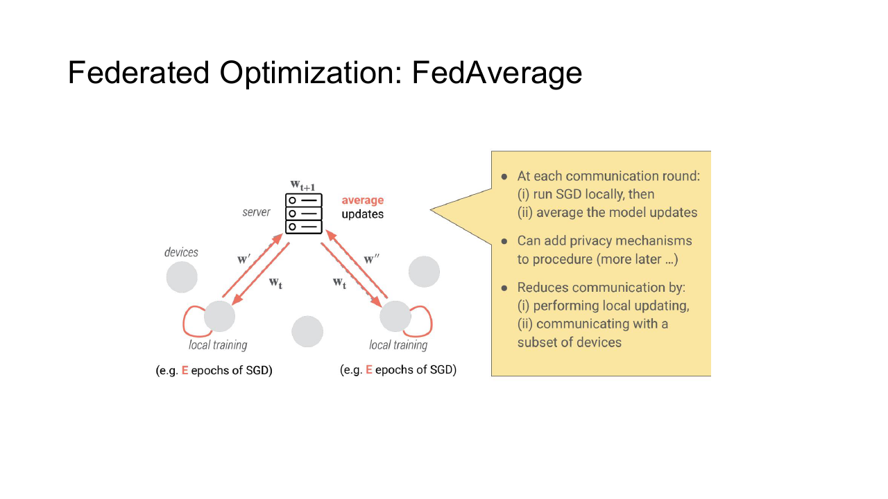
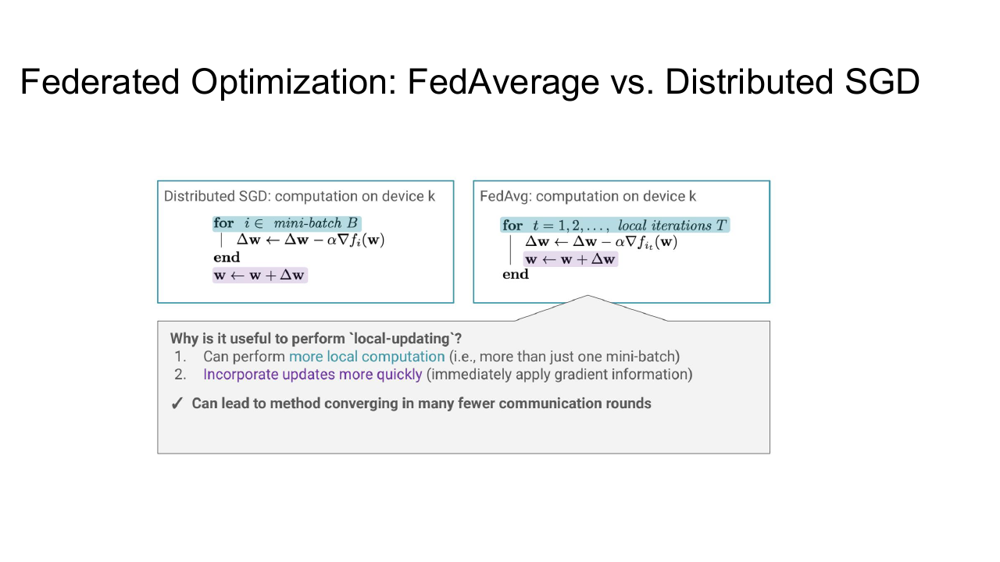
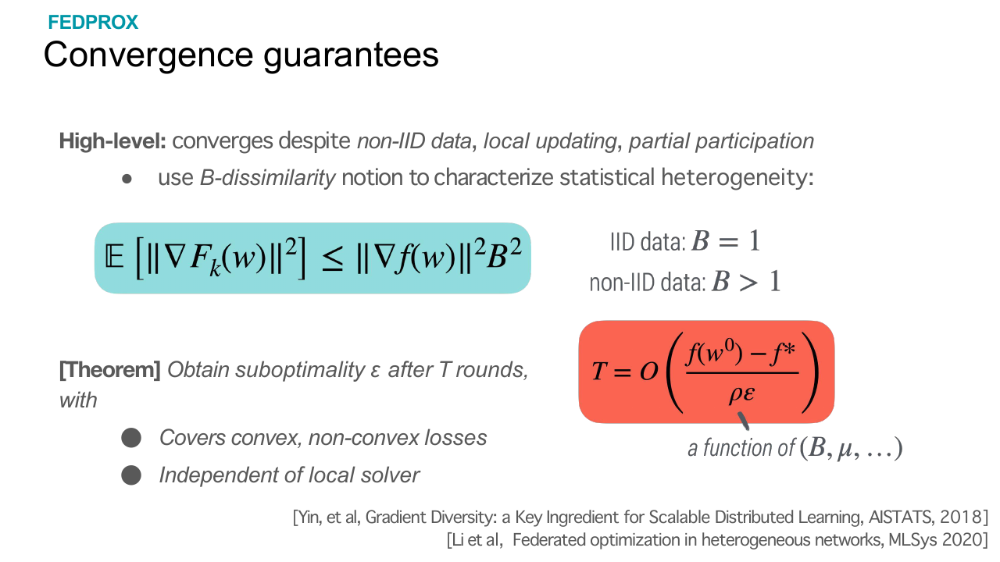
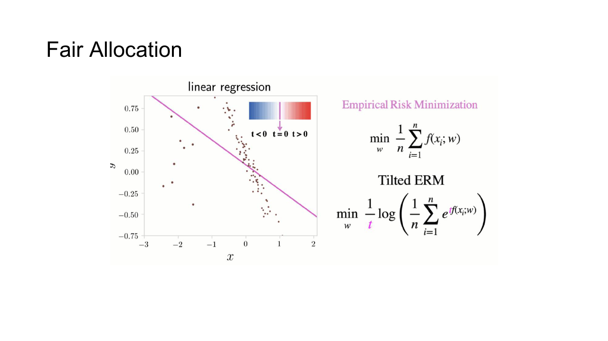
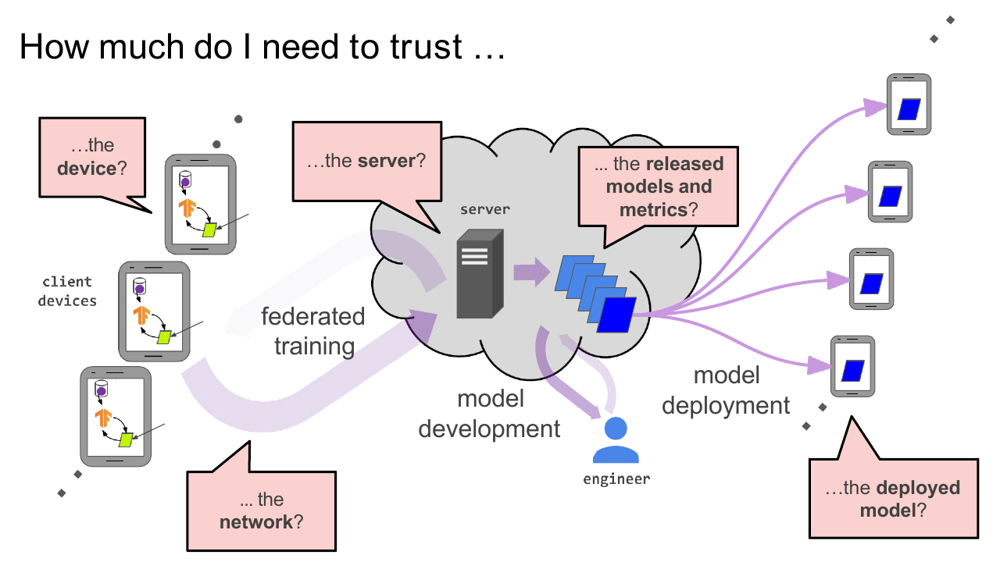
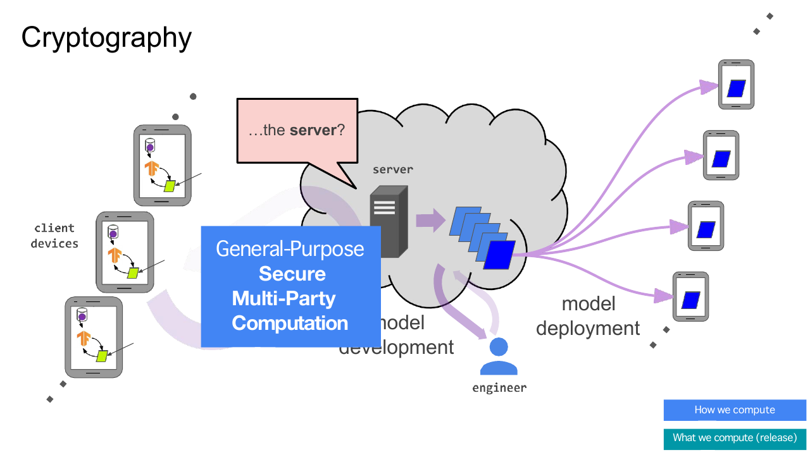
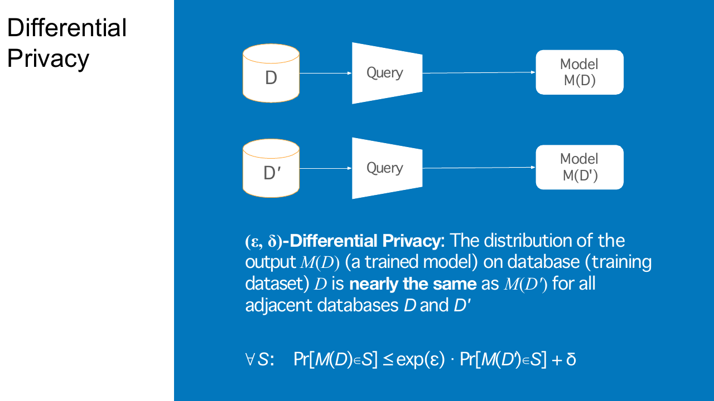

## 数据不能集中时

移动设备、医疗机构与企业各自持有数据，隐私、法规、带宽或所有权限制可能不允许把原始样本汇总到同一数据中心。Federated Learning 把模型发送到数据所在位置，在本地训练后只汇总模型更新。

原始数据留在本地并不能直接保证隐私安全。Gradient 和 parameter update 仍可能泄露样本信息，server、client 与通信链路都需要明确的威胁模型。

## Cross-device 与 Cross-silo

Cross-device FL 面向大量手机或边缘设备。每轮只抽取少量在线 client，设备算力、网络和电量差异很大，也可能随时掉线。

Cross-silo FL 面向少量组织或数据中心。参与方较稳定，单方数据量和算力更大，通常要求更严格的访问控制、审计与组织间协议。

分布式训练默认各 worker 由同一主体管理，数据划分相对可控；联邦学习的 client 属于不同故障域和信任域，数据分布也通常高度 non-IID。

## 训练流程

一轮联邦训练包含几步：

1. Server 从可用 client 中采样一组参与者。
2. Server 下发当前全局模型和训练配置。
3. Client 在本地数据上执行若干 step 或 epoch。
4. Client 上传模型差值、梯度或其他更新。
5. Server 聚合更新并产生下一轮模型。

Client selection 会影响统计偏差。总是选择网络快、充电中或高端设备，模型可能长期忽略另一部分用户分布。系统可用性与数据代表性需要一起考虑。

把一轮过程缩成一个标量例子。全局参数从 $w_t=1$ 这一数值开始。Client 1 拥有 $100$ 个样本，Client 2 拥有 $300$ 个样本，Client 3 拥有 $600$ 个样本。本地训练后，Client 1 提交 $\Delta w_1=-0.2$ 这一变化，Client 2 提交 $\Delta w_2=0.1$ 这一变化，Client 3 提交 $\Delta w_3=0.05$ 这一变化。按样本数加权后

$$
\Delta w
=
0.1\times(-0.2)
+
0.3\times0.1
+
0.6\times0.05
=
0.04
$$

Server 把全局参数更新为 $w_{t+1}=1.04$ 以后，再将它发给下一轮 client。真实模型只不过把这个标量换成了很长的参数向量。

## FedAvg

设第 $k$ 个 client 有 $n_k$ 个样本，本地训练后得到参数 $w_{t+1}^{(k)}$ 。FedAvg 按样本数加权聚合

$$
w_{t+1}=\sum_{k\in S_t}\frac{n_k}{\sum_{j\in S_t}n_j}w_{t+1}^{(k)}
$$

每个 client 从全局参数 $w_t$ 出发执行多步 local SGD。增加 local step 可以减少通信轮数，却会让各 client 沿自身数据分布走得更远。

当所有 client 数据近似 IID、每轮参与充分且 local step 较少时，FedAvg 接近大 batch 的分布式 SGD。non-IID 数据下，不同 client 的局部最优方向可能差异很大，简单平均会出现 client drift。

## 系统与统计异质性

系统异质性来自设备算力、内存、网络、电量和在线时间差异。设置严格 deadline 会丢弃慢 client，等待全部 client 又会让 straggler 主导一轮时间。

统计异质性来自每个 client 的样本量、标签比例、语言、地区和采集方式不同。常见情形包括：

- 一个 client 只含少数类别。
- 不同 client 的特征分布不同。
- 标签规则或噪声水平不同。
- 数据量相差几个数量级。
- 分布随时间发生变化。

本地 loss 下降并不保证全局目标同步下降。除了训练平均模型，还要观察不同 client 群体上的 accuracy、worst-group performance 与收敛速度。

## FedProx

FedProx 在 client 本地目标中增加与全局参数的 proximal term

$$
\min_w F_k(w)+\frac{\mu}{2}\lVert w-w_t\rVert_2^2
$$

它限制本地参数偏离 $w_t$ 过远，缓解 non-IID 数据和不同本地计算量造成的 client drift。 $\mu$ 太大时，本地更新几乎无法利用 client 数据；太小时则退化为普通 FedAvg。

FedProx 不能消除全部异质性。Server momentum、control variate、adaptive aggregation 和不同 client 的动态 local step 还可以从其他方向改善稳定性。

## 个性化

单个全局模型未必同时适合所有 client。Personalized FL 可以共享 backbone，只在本地保存 head；也可以先训练全局模型，再用本地数据 fine-tune。

另一类方法把每个 client 的参数写成全局部分与个性部分的组合，并用正则项约束它们不要相差过远。相似 client 还可以聚类，共享组内模型。

个性化模型更贴近本地分布，却增加模型版本、评估和部署复杂度。只在参与训练的 client 上报告结果，也可能高估对新 client 的泛化。

## 公平性

按样本数加权优化的是总体平均损失，数据多的 client 影响更大。少数 client 即使表现很差，也可能对平均指标影响很小。

公平目标可以提高高损失 client 的权重、优化分位数或最坏组风险，也可以约束不同群体的性能差距。提高最差 client 表现可能降低总体平均精度，目标应由应用要求决定，不能只替换一个聚合公式就宣称公平。

系统公平同样重要。老旧设备若总因 deadline 被排除，对应用户的数据也不会影响模型。

## 威胁模型

参与方可能包括 server、client、聚合服务、模型开发者和网络观察者。需要分别考虑：

- Honest-but-curious server 遵循协议，却尝试从 update 推断本地数据。
- Malicious client 上传构造更新，执行 poisoning 或 backdoor attack。
- 外部攻击者窃听、篡改或重放通信。
- Collusion 让若干参与方合并信息，绕过单方隐私保证。

TLS 保护 in-transit 数据，磁盘加密保护 at-rest 数据，但 server 解密后仍能看到单个更新。要隐藏更新内容，还需要 secure aggregation、trusted execution environment 或更强的密码学协议。

## Secure Aggregation

Secure Aggregation 让 server 只能得到更新之和，不能看到单个 client update。一个基本思路是 client 两两生成相反 mask，所有更新求和后 mask 自动抵消。

实际协议还要处理 client 在提交 mask 后掉线的情况。Secret sharing 可以让剩余参与者恢复需要取消的 mask，同时不暴露仍在线 client 的单独更新。

Secure Aggregation 保护 update 的可见性，不限制聚合结果本身泄露的信息，也不能自动阻止恶意 client 上传异常值。聚合前无法直接查看单个 update 后，robust aggregation 和异常检测还会更难实现。

## Trusted Execution Environment

TEE 在硬件隔离区域中解密并聚合 update，外部系统只能看到 attestation 与输出。它通常比完全密码学方案更高效，也能执行复杂聚合逻辑。

安全性依赖硬件、固件、attestation 和侧信道防护。Enclave 内存受限时，还要分块处理大型模型更新。

## Differential Privacy

Differential Privacy 限制单个样本或单个 client 对输出分布的影响。Client-level DP 通常先裁剪每个 client update 的范数，再对聚合结果加入噪声。

设裁剪阈值为 $C$ ，更新 $u_k$ 变为

$$
\widetilde{u}_k=u_k\min\left(1,\frac{C}{\lVert u_k\rVert_2}\right)
$$

聚合后加入 Gaussian noise

$$
\widetilde{u}=\frac{1}{|S_t|}\left(\sum_{k\in S_t}\widetilde{u}_k+\mathcal{N}(0,\sigma^2C^2I)\right)
$$

训练多轮会累计隐私损耗，需要 privacy accountant 跟踪最终 $(\varepsilon,\delta)$ 。裁剪过强会丢失有用更新，噪声过大则降低模型精度；参与 client 越多，平均后噪声相对影响通常越小。

Secure Aggregation 与 DP 可以组合：前者防止 server 看到单个 update，后者限制最终聚合结果泄露个体信息。两者解决的问题不同。

## Poisoning 与鲁棒聚合

恶意 client 可以放大 update、定向修改某类输入，或协同植入 backdoor。按范数裁剪、median、trimmed mean 和 anomaly detection 可以降低部分攻击影响，但在 non-IID 数据下，正常少数 client 的更新本来就可能看起来异常。

模型更新还应绑定 round、模型版本和 client 身份，防止重放旧 update。部署前需要在正常分布、少数群体和安全测试集上分别评估，不能只观察聚合 loss。

## 通信与恢复

联邦训练的瓶颈常是上行网络。Update compression、量化、稀疏化和减少通信轮数都能降低流量，但可能引入额外误差。Client 本地训练更多 step 能减少轮数，也会加重 client drift。

Server 应记录当前 round、全局模型、optimizer、client sampling seed 与隐私 accountant 状态。Client 可能随时离线，协议不能要求上一轮所有设备在恢复后重新出现。Cross-silo 场景则更适合使用显式事务和参与方确认，避免组织间模型版本不一致。
