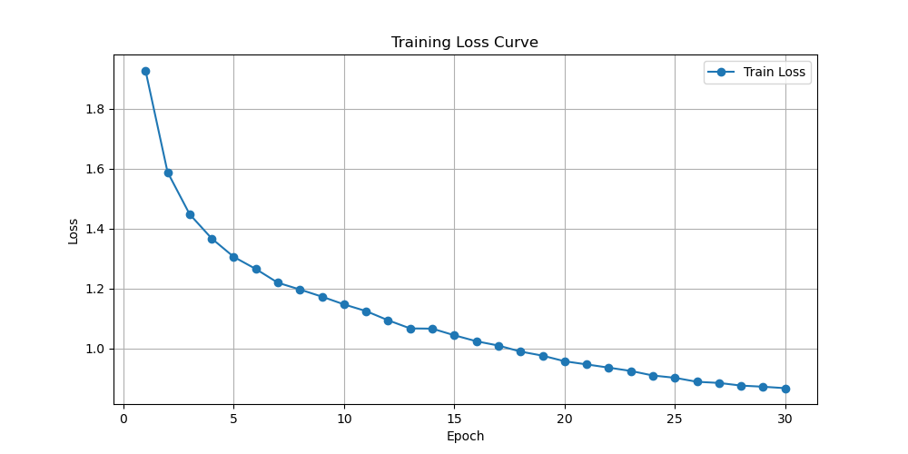
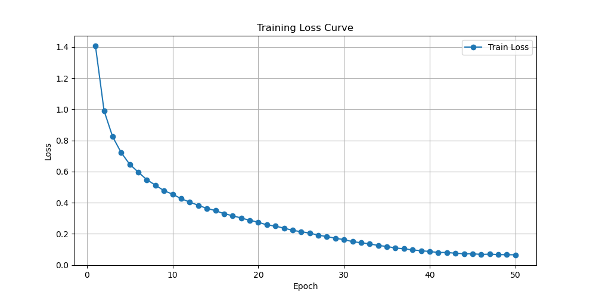
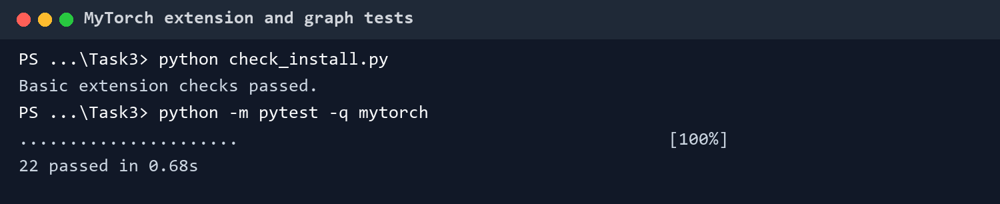
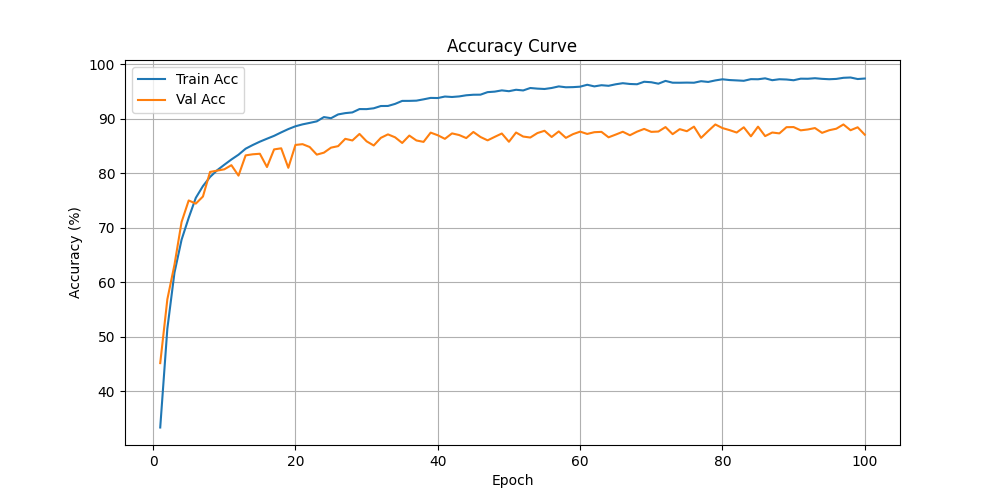
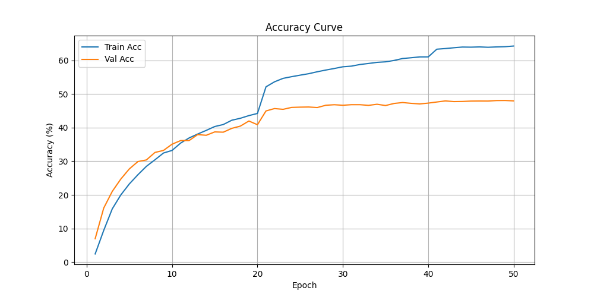

# 从零开始的 AI 编程大作业

> [!CAUTION]
>
> **本笔记仅供参考，请勿抄袭。**

## 任务

大作业用三条路径训练 CIFAR-10：先写 PyTorch 单卡基线，再加入数据并行，最后把训练切换到前几次 Lab 搭出的 CUDA Tensor、Python 扩展和自动微分框架。Bonus 原要求完整 ImageNet，本机当时无法承担对应的数据与训练开销，实际完成的是 Tiny ImageNet。

四个目录都能独立运行。

```text
Final_Project/
├── Task1/    PyTorch 单卡基线
├── Task2/    PyTorch 数据并行
├── Task3/    自定义训练框架
└── Bonus/    Tiny ImageNet 扩展
```

四个目录各有入口、模型与工具文件，没有靠 `if task == ...` 把所有实现塞进同一份脚本。Task 1 与 Task 2 的模型和数据口径保持一致，Task 3 则只借用 torchvision 读取 batch，batch 进入模型前已经转成自定义 Tensor。

## PyTorch 基线

Task 1 分为 `utils.py`、`models.py` 和 `main.py`。

| 模块 | 职责 |
| --- | --- |
| `utils.py` | 随机种子、设备选择、评估和曲线保存 |
| `models.py` | LeNet、MiniVGG 与模型工厂 |
| `main.py` | 数据划分、优化器、调度器、训练和检查点 |

入口参数控制模型、设备、worker 数、AMP、优化器、学习率、batch size 和输出目录。默认训练 30 个 epoch，batch size 为 64；SGD 默认 momentum 为 0.9，weight decay 为 $5\times10^{-4}$ 。命令行解析只发生在 `main()`，模型文件不读取全局参数。

### 数据路径

CIFAR-10 的训练部分按固定随机种子划分为训练集和验证集。代码为同一批训练索引建立两个 Dataset view：带增强的一份用于参数更新，不带增强的一份用于统计训练准确率。

```text
train indices ─┬─ 随机裁剪、翻转 -> trainloader_aug -> 训练
               └─ 固定预处理     -> trainloader_clean -> 评估
val indices ------ 固定预处理     -> valloader
test set --------- 固定预处理     -> testloader
```

若直接在带随机增强的 loader 上报告训练准确率，每个 epoch 看到的图像都不同，数值会额外包含增强噪声。测试集只在恢复最佳验证检查点后使用一次，不参与挑选模型。

数据索引和 transform 应分开保存。只固定 `random_split` 的种子还不够；若训练、验证各自重新划分一次，同一个样本可能落入不同集合。

实际比例是 45000 张训练、5000 张验证。三个评估 loader 的 batch size 取训练 batch 的两倍，因为它们不保存反向图。训练 loader 开启 shuffle，另外三个保持固定顺序。

```python
train_subset_aug = Subset(full_dataset_aug, train_idx)
train_subset_clean = Subset(full_dataset_clean, train_idx)
val_subset = Subset(full_dataset_clean, val_idx)
```

两个训练子集共用相同 `train_idx`，差别只在 transform。若分别随机划分，所谓“干净训练准确率”统计的就不是参与训练的那批图像。

### 模型接口

`get_model(name)` 隔离模型创建，训练循环只依赖 `nn.Module` 接口。LeNet 用来快速检查整条流水线，MiniVGG 用三组卷积块承担正式训练。两者都返回 logits，损失函数、优化器和评估函数可以完全复用。

模型工厂还让命令行参数不必散落在训练代码中。

```python
model = get_model(args.model, num_classes=10).to(device)
criterion = nn.CrossEntropyLoss()
```

MiniVGG 启用混合精度时，autocast 只包住前向与损失；梯度缩放由 `GradScaler` 管理。

MiniVGG 每个卷积块为 `Conv2d -> BatchNorm2d -> ReLU`，通道数依次为 64、128、256，每组有两个卷积并在末尾池化。最后用 `AdaptiveAvgPool2d(1)` 压成 $N\times256\times1\times1$ ，再经过 Dropout 和全连接。分类器输入不需要手算空间尺寸；Task 3 没有这层自适应池化，比较两条路径时要把这里单独列出来。

```python
with torch.autocast(
    device_type=device.type,
    enabled=args.amp and device.type == "cuda",
):
    outputs = model(inputs)
    loss = criterion(outputs, labels)

scaler.scale(loss).backward()
scaler.step(optimizer)
scaler.update()
```

若直接对缩放后的梯度调用普通 `optimizer.step()`，参数会使用错误尺度。AMP 的前向上下文和更新流程必须成套出现。

AMP 关闭时仍然经过同一个 `GradScaler` 对象，只是 `enabled=False`，训练循环无需维护两份 backward 分支。CPU 路径同样会自动关闭，不会误用 CUDA autocast。

### 训练调度

`main.py` 每轮按固定顺序执行训练、学习率调度、训练集评估、验证集评估和检查点更新。只有验证准确率提高时才覆盖 `best_model.pth`，最终测试也加载这份参数，不使用最后一个 epoch 的模型。

```text
trainloader_aug -> 参数更新
scheduler.step()
trainloader_clean -> 训练准确率
valloader -> 决定是否保存
训练结束 -> 加载 best_model.pth -> testloader
```

CosineAnnealingLR 的 `T_max` 等于总 epoch 数，每轮结束后调用一次。若把 `scheduler.step()` 放进 batch 循环，学习率会在一轮内走完整条余弦曲线。

检查点只保存 `state_dict`，模型结构仍由 `models.py` 创建。恢复时模型名和类别数必须与保存时一致。要从中断位置续训，还应一并保存 optimizer、scheduler、scaler 和当前 epoch；仅保存参数只能用于推理或重新开始优化。

两种模型的 loss 曲线在这里充当流水线体检。持续下降说明数据、损失和更新至少能接通，不需要把每次运行的硬件耗时写进实现笔记。





## 数据并行

Task 2 复用 Task 1 的数据、模型、损失和训练循环，只在模型创建后增加一层设备包装。

```python
model = model.to(device)
if torch.cuda.device_count() > 1:
    model = nn.DataParallel(model)
```

每个 step 中，`DataParallel` 沿 batch 维切分输入，在多张 GPU 上复制模型并独立前向、反向，随后把梯度归约到主设备，由同一个 optimizer 更新主副本。训练循环仍只接触普通 `nn.Module` 接口，损失和评估代码不必跟着改。

输入先被送到主设备，再由 `DataParallel` scatter。每张卡获得一个 batch 切片，模型副本只在当次 forward 使用；参数更新仍发生在主副本。batch 小于 GPU 数量时，有些卡几乎拿不到数据，并行开销反而更显眼。

### 包装后的状态

`DataParallel` 会在参数名前增加 `module.`。为了让单卡与多卡检查点互通，保存和加载时都要访问内部模型。

```python
base_model = (
    model.module
    if isinstance(model, nn.DataParallel)
    else model
)
torch.save(base_model.state_dict(), checkpoint_path)
```

这个兼容处理应收进单独的 checkpoint helper，保存和加载共用同一处判断。以后替换成 DistributedDataParallel 时，只需要改 helper。

当前保存处已经解开 `model.module`，加载处也按包装状态选择目标对象，因此产出的 key 不带 `module.` 前缀。这样同一个检查点可以在单卡和多卡之间来回使用。

### 并行实验的坑

- 对比单卡与多卡时，总 batch size 应保持一致。若每卡 batch 不变，总 batch 会随 GPU 数增长，优化轨迹也随之变化。
- 大 batch 减少每个 epoch 的更新次数，学习率和 warmup 往往需要一起调整，不能把速度变化全归因于并行。
- CUDA kernel 是异步的，计时前后要同步设备。数据缓存、存储速度和不同机器也会污染耗时对比。
- `DataParallel` 每轮都在主进程散射与归约，适合完成接口实验；正式多卡训练通常使用一进程一卡的 DistributedDataParallel。

验证时先确认单卡、多卡能读取同一检查点，再比较相同总 batch 下的验证结果。速度对比要预热 DataLoader 和 CUDA，并在计时边界同步；否则第一轮的缓存、编译和异步 kernel 都会混进数字。

## 自定义框架

Task 3 把前几次 Lab 的代码组合成五层。

```text
main.py                 训练调度与数据批次
models.py               Module、LeNet、MiniVGG
mytorch/                Tensor、Op、自动微分、优化器
src/tensornn.cu         pybind11 边界
src/tensor*.{h,cu}      CUDA 存储与算子
```

一次 batch 会沿这条路径往返。

```text
torch DataLoader
 -> NumPy
 -> mytensor.Tensor
 -> mytorch.Tensor
 -> model forward
 -> cross_entropy
 -> compute_gradient_of_variables
 -> optimizer.step
 -> NumPy 统计
```

每一层只认识紧邻的接口。`models.py` 调用 `conv2d()`、`relu()`、`linear()`，不接触 CUDA 指针；自动微分只调用各 Op 的 `gradient()`；Python 绑定负责在 NumPy 与后端 Tensor 间复制；CUDA 层只接收形状和裸数据。

这条路径有三个不同的 Tensor。

| 层 | 对象 | 保存内容 |
| --- | --- | --- |
| C++ | `mytensor.Tensor` | shape、device、底层存储 |
| 自动微分 | `mytorch.Tensor` | Op、inputs、cached_data、grad |
| 数据入口 | `torch.Tensor` | DataLoader 交出的 batch |

训练入口先把 PyTorch batch 转成 NumPy，再由 `mytensor.Tensor.from_numpy()` 搬到 GPU，最后包进 `mytorch.Tensor` 参与构图。打印或统计时则沿相反方向回到 NumPy。对象名相近，调试时必须先确认当前变量属于哪一层。

### Module 与参数

自定义 `Module` 提供 `forward()`、`parameters()`、`train()` 和 `eval()`。LeNet、MiniVGG 手动创建可求导参数，并在 `parameters()` 中按固定顺序返回。

```python
class Module:
    def parameters(self):
        return []

    def __call__(self, *args, **kwargs):
        return self.forward(*args, **kwargs)
```

当前 `Module` 不会自动发现参数，每个模型都要手写 `parameters()`。新增一层却漏改列表时，该层能够参与前向，权重却不会被迁移或更新。自动注册 Tensor 与子 Module 后，优化器、设备迁移和检查点才可以共用同一份参数表。

LeNet 的 `parameters()` 返回十个 Tensor，顺序是两组卷积权重与偏置、三组全连接权重与偏置。MiniVGG 则返回十四个 Tensor。`to_device()`、`zero_grad()` 和 optimizer 都依赖这份列表；新增一层却忘记登记时，前向仍然能跑，参数却永远不会更新。

`to_device()` 只迁移 `model.parameters()`。输入在每个 batch 创建时直接进入目标设备，二者职责分开。Batch Normalization 的 running statistics 等非参数状态无法沿这条路径迁移，框架还缺少独立的 buffer 注册机制。

自定义 MiniVGG 没有复刻 PyTorch 版的 BatchNorm 与 Dropout，最后也用 $4\times4$ max-pool 模拟全局池化，而不是 Adaptive Average Pooling。因此两边不能拿最终准确率直接归因于后端差异；它们共享的是大致网络骨架和训练任务，不是逐层等价模型。

### 前向与反向

模型前向只组合高层算子，输出 Tensor 会记录计算图。损失节点创建后，训练循环显式构造标量梯度种子，再调用图引擎。

```python
logits = model(x)
loss = cross_entropy(logits, y)

optimizer.zero_grad()
compute_gradient_of_variables(loss, Tensor(grad_seed))
optimizer.step()
```

这段流程把 Lab 3 的算子、Lab 4 的绑定、Lab 5 的计算图和 Lab 6 的优化器串在一起。任一算子的 `gradient()` 返回形状不对，错误都会在 optimizer 读取参数梯度前传开；因此框架测试必须先于完整训练。



CPU 与 CUDA 路径目前对标签格式的约定不同：CPU 使用 one-hot，CUDA 后端接收类别下标。训练入口因此要为两条路径分别构造 `y`，后端细节也跟着进入调度层。让 `cross_entropy` 统一接收类别下标，再由各后端自行转换，可以删掉这处分支。

卷积和全连接的 backward 一次返回多个底层 Tensor。自动微分层用 `Conv2dBackprop` 或 `LinearBackprop` 建立一个结果节点，再通过 `TupleGetItem(0..2)` 取出 $\mathrm{d}X$ 、 $\mathrm{d}W$ 与 $\mathrm{d}b$ 。这样后端只跑一次反向，不会为了三个返回值重复启动整套 kernel。

```python
back_node = Conv2dBackprop(stride, padding)(
    input, weight, bias, out_grad
)
return [
    TupleGetItem(0)(back_node),
    TupleGetItem(1)(back_node),
    TupleGetItem(2)(back_node),
]
```

这些 backward Op 没有实现高阶梯度，`TupleGetItem.gradient()` 也留空。对本次一阶训练足够，若对参数梯度再次调用 backward，计算图会在这里断掉。

### 训练过程

训练循环负责 batch 转换、前向、反向、更新和统计。每个 batch 末尾显式删除图中对象并触发垃圾回收，避免 Python 引用让整张图长期留在内存中。

```python
del x, y, logits, loss, grad_seed
gc.collect()
```

这是一种保守处理。若 Value、Op 和输入节点形成引用环，频繁 `gc.collect()` 会掩盖生命周期设计问题，也带来明显开销。应通过内存曲线确认是否真的有泄漏，再决定是断开图引用、实现 `detach()`，还是保留周期性回收。

每次 `.numpy()` 都会同步并复制。训练代码为了统计预测，会把 logits 搬回 Host；若每层都这样查看中间值，GPU 会在每个算子后停下来等 CPU。调试模式可以打印一两个 batch，正式训练只回传 loss 与预测所需的数据。

当前训练会记录 JSON 和曲线，但没有像 Task 1 那样保存最佳参数。若要把自定义框架用于长时间训练，参数序列化和恢复是比继续调准确率更优先的模块。

自定义 SGD 按参数对象保存 momentum velocity，Adam 也按参数对象保存各自的 `t`、`m` 和 `v`。参数更新直接替换或原地修改 `cached_data`，不会把 optimizer step 接入计算图。`zero_grad()` 则把每个 `p.grad` 设为 `None`，下一轮反向重新累计。



### 框架里的坑

- Python Tensor、`mytorch.Tensor` 和 C++ Tensor 是三个对象层次，调试时先确认手里的 `.cached_data` 属于哪一层。
- 设备迁移不能只改标签，必须复制底层存储；参数列表也不能漏掉任何可训练 Tensor。
- 每次 `.numpy()` 都会同步并复制。训练中只在统计确有需要时回传标量或预测结果。
- `train()`、`eval()` 目前只是状态接口。加入 Dropout、Batch Normalization 后，具体层必须真正读取该状态。
- MiniVGG 的自定义版本没有完整复刻 PyTorch 版的所有层，因而只能比较训练链路，不能把差异全部解释成后端性能。
- 计算图与 optimizer state 都跨越模块边界，检查点若只保存参数，无法恢复一次中断的训练。

还有一个实用的排查顺序。先运行 Lab 5 留下的算子与 autodiff 测试，再单独构造一个卷积节点检查三份梯度 shape，最后用 LeNet 跑两个 batch。MiniVGG 的图更大，任何生命周期或显存问题都会被放大，不适合作为第一个检查点。

## Tiny ImageNet

Bonus 沿用 Task 3 的五层结构，只扩展数据和模型边界。实际完成的是 Tiny ImageNet，而非完整 ImageNet。

`prepare_tiny_imagenet.py` 先把验证集按类别重排成 `ImageFolder` 可读取的目录；`utils.py` 提供 Tiny ImageNet loader；`models.py` 增加 200 类输出和适配 64 像素输入的 `MiniVGG64`；`main.py` 根据数据集选择类别数和预处理。

```text
原始验证标注
 -> 按类别整理目录
 -> ImageFolder
 -> 训练/验证 loader
 -> MiniVGG64(num_classes=200)
```

这里最需要守住的是输入契约。把 64 像素图像裁到 32 像素可以复用 CIFAR-10 模型，却损失大量空间信息；保留 64 像素又会改变展平后的特征尺寸。模型不能只把输出类别从 10 改成 200，还要重新核对每次池化后的空间大小和分类器输入维度。

Tiny ImageNet 有 200 类，每类 500 张训练图，原图为 $64\times64$ 。预处理使用该数据集的通道均值与标准差，`MiniVGG64` 保留 64 像素输入，再调整末端池化和分类器。验证集原本把图片统一放在 `val/images`，类别信息位于标注文件中；整理脚本按类别创建目录后，`ImageFolder` 才能正常读取标签。

验证集有标签，可以用于调参与报告；Tiny ImageNet 官方 test 目录没有直接提供可用标签，不能把验证集复制一份后同时称作验证和独立测试。数据模块应明确返回哪些 split，训练入口也不应假装存在未加载的测试标签。



Tiny ImageNet 的曲线记录的是这套替代方案，不应写成完整 ImageNet 结果。类别数从 10 增至 200 后，分类器输出、标签检查与评估统计都要跟着参数化；若某处仍写死 10，通常会在 one-hot 或交叉熵边界最先报错。

## 复验顺序

完整训练之前，先沿模块逐层短跑。

```text
1. Task 1 用少量 batch 跑通数据、模型和检查点
2. Task 2 在相同总 batch 下验证单卡、多卡状态兼容
3. Task 3 先运行算子与自动微分测试
4. Task 3 用 --debug-steps 跑一个短 epoch
5. 再运行完整 CIFAR-10 训练
6. 最后整理 Tiny ImageNet 并检查一个 batch 的形状
```

自定义框架的短跑命令可以先限制 batch 数。

```bash
python main.py --model lenet --cuda --debug-steps 2 \
  --epochs 1 --output-dir debug-run
```

`--debug-steps 2` 会在很少几个 batch 后停下，足够检查输入转换、前向、反向和更新。LeNet 的短路通过后再换 MiniVGG，CIFAR-10 稳定后再整理 Tiny ImageNet；否则一个 shape 错误也可能要等很久才在大模型里暴露。
