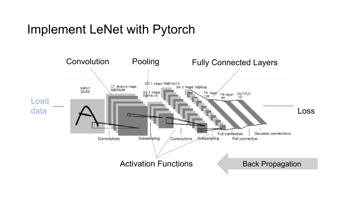
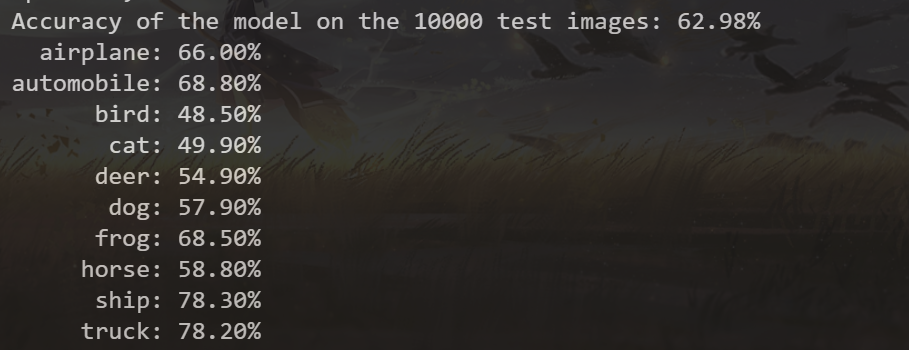
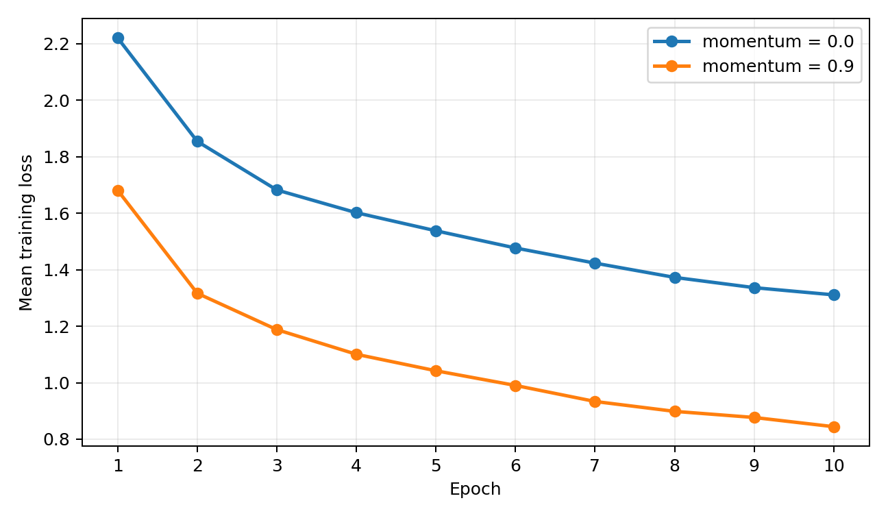

# 从零开始的 CIFAR-10 图像分类

> [!CAUTION]
>
> **本笔记仅供参考，请勿抄袭。**

## 任务

Lab 1 要求用 PyTorch 跑通一条完整的图像分类流程：读取 CIFAR-10，搭建 LeNet，使用交叉熵与 SGD 训练 10 个 epoch，再统计整体准确率、分类别准确率和训练损失。最后还要改变 SGD 的 `momentum`，比较它对收敛过程的影响。

代码集中在一个可直接运行的 Python 文件中，没有使用 Notebook。训练结束后会留下模型参数和 TensorBoard 日志，方便把最终模型与损失曲线对应起来。

## 环境与文件

复验使用的环境为 Windows 11、Python 3.12.7、PyTorch 2.8.0+cu128 和 TorchVision 0.23.0+cu128，显卡为 RTX 4060 Laptop GPU。程序也保留了 CPU 路径，没有 CUDA 时仍可运行，只是训练会慢不少。

```text
Lab1/
├── test.py
├── task1_lenet_cifar10.pth
└── runs/
    └── lenet_cifar10_task1/
```

`test.py` 同时负责数据处理、模型定义、训练、测试和日志记录。第一次运行会把 CIFAR-10 下载到 `data/`，这个目录不需要提交。

## 数据处理

CIFAR-10 包含 10 个类别，共有 50000 张训练图像和 10000 张测试图像，每张图像的形状为 $3\times 32\times 32$ 。

训练集使用随机水平翻转，以及四像素填充后的随机裁剪。测试集不能带随机增强，只做张量转换与归一化。三个通道都采用均值 0.5、标准差 0.5，因此像素会从 $[0,1]$ 映射到 $[-1,1]$ 。

```python
transform_train = transforms.Compose(
    [
        transforms.RandomHorizontalFlip(),
        transforms.RandomCrop(32, padding=4),
        transforms.ToTensor(),
        transforms.Normalize((0.5, 0.5, 0.5), (0.5, 0.5, 0.5)),
    ]
)

transform_test = transforms.Compose(
    [
        transforms.ToTensor(),
        transforms.Normalize((0.5, 0.5, 0.5), (0.5, 0.5, 0.5)),
    ]
)
```

训练 loader 打乱样本，测试 loader 保持固定次序。两边的 batch size 都是 32。

## LeNet

输入先经过两组卷积与池化

$$
3\xrightarrow{5\times5\ \mathrm{Conv}}6
\xrightarrow{2\times2\ \mathrm{MaxPool}}6
\xrightarrow{5\times5\ \mathrm{Conv}}16
\xrightarrow{2\times2\ \mathrm{MaxPool}}16
$$

空间尺寸依次从 $32$ 变为 $28$ 、 $14$ 、 $10$ 和 $5$ ，最后得到 $16\times 5\times 5$ 的特征图。展平后依次经过 $400\to120\to84\to10$ 的全连接层。



图中的前向链路也对应着反向传播需要保存的中间量。卷积和全连接层需要前一层输入来计算参数梯度，ReLU 需要知道哪些位置在前向时大于零，最大池化则需要最大值所在位置。PyTorch 会把这些关系记录在计算图中，所以模型只需返回 logits，`loss.backward()` 便能从损失一路把梯度传回各层参数。

```python
class LeNet(nn.Module):
    def __init__(self):
        super().__init__()
        self.conv1 = nn.Conv2d(3, 6, 5)
        self.pool = nn.MaxPool2d(2, 2)
        self.conv2 = nn.Conv2d(6, 16, 5)
        self.fc1 = nn.Linear(16 * 5 * 5, 120)
        self.fc2 = nn.Linear(120, 84)
        self.fc3 = nn.Linear(84, 10)

    def forward(self, x):
        x = self.pool(F.relu(self.conv1(x)))
        x = self.pool(F.relu(self.conv2(x)))
        x = torch.flatten(x, 1)
        x = F.relu(self.fc1(x))
        x = F.relu(self.fc2(x))
        return self.fc3(x)
```

最后一层输出 logits，不再手动接 Softmax。`CrossEntropyLoss` 已经把 log-softmax 与负对数似然合在一起，再做一次 Softmax 既多余，也会削弱数值稳定性。

## 训练

训练使用交叉熵和 SGD，初始学习率为 0.01，动量系数为 0.9，权重衰减为 $10^{-4}$ 。每个 batch 的顺序固定为清空梯度、前向传播、反向传播和参数更新。

```python
optimizer.zero_grad()
outputs = model(inputs)
loss = criterion(outputs, labels)
loss.backward()
optimizer.step()
```

每轮记录 batch loss 的平均值，而不是只记录最后一个 batch。测试前切换到 `eval()`，并在 `torch.inference_mode()` 中运行，避免继续维护反向传播图。

## 动量

普通 SGD 只使用当前梯度。加入动量后，优化器还维护一个速度缓冲区

$$
v_t = m v_{t-1} + g_t
$$

$$
\theta_t = \theta_{t-1} - \eta v_t
$$

其中 $m$ 是动量系数， $g_t$ 是当前梯度， $\eta$ 是学习率。连续几个 batch 的梯度方向接近时，历史项会加速这一方向的更新；梯度反复摆动时，缓冲区又能减弱单个 batch 带来的突变。

动量也不能一味调大。若历史方向保留得太久，参数可能在损失谷底附近来回越过最优点，因此它需要和学习率一起调整。

## 测试

整体准确率只需要累计预测正确的样本数。分类别准确率则为每个标签维护独立的 `correct` 与 `total`，不必在 CPU 上逐张处理。

```python
for class_index in range(len(classes)):
    mask = labels == class_index
    per_class_correct[class_index] += (
        predicted[mask] == class_index
    ).sum()
    per_class_total[class_index] += mask.sum()
```

动量系数为 0.9 时，10 个 epoch 后的整体测试准确率为 **62.98%**。

| 类别 | 准确率 | 类别 | 准确率 |
| --- | ---: | --- | ---: |
| airplane | 66.00% | automobile | 68.80% |
| bird | 48.50% | cat | 49.90% |
| deer | 54.90% | dog | 57.90% |
| frog | 68.50% | horse | 58.80% |
| ship | 78.30% | truck | 78.20% |



`ship` 与 `truck` 的轮廓比较稳定，准确率最高；`bird`、`cat` 与其他动物类别更容易混淆。只看一个整体数字时，这种类别间的差异很容易被盖住。

## 动量对比

| 动量系数 | 第 1 轮损失 | 第 10 轮损失 | 测试准确率 |
| ---: | ---: | ---: | ---: |
| 0 | 2.2205 | 1.3110 | 55.31% |
| 0.9 | 1.6810 | 0.8443 | 62.98% |



两次运行使用相同的网络、数据处理与训练轮数，但没有锁定完全相同的初始化和随机增强序列。因此，这组结果适合观察收敛趋势，不应被当作严格控制随机变量后的统计结论。

## 运行

```bash
python test.py
tensorboard --logdir runs
```

程序会自动选择 CUDA 或 CPU，训练完成后将参数保存为 `task1_lenet_cifar10.pth`。若要比较不同超参数，最好把日志目录和模型文件名一并改掉，避免后一次运行覆盖前一次结果。
