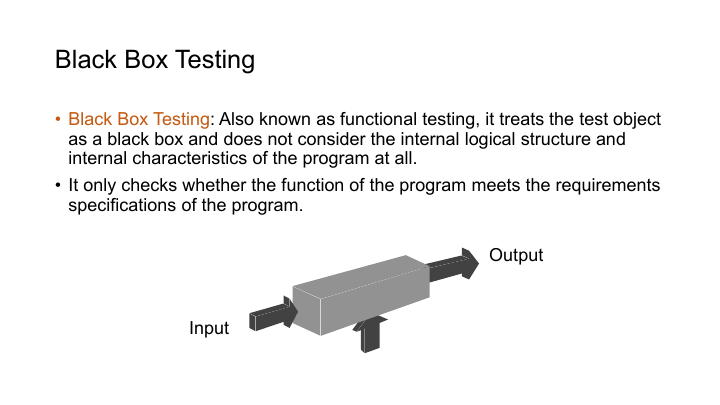
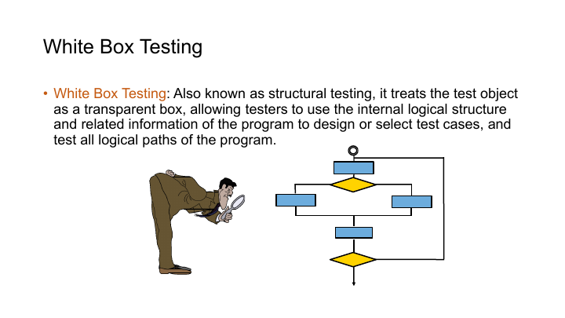
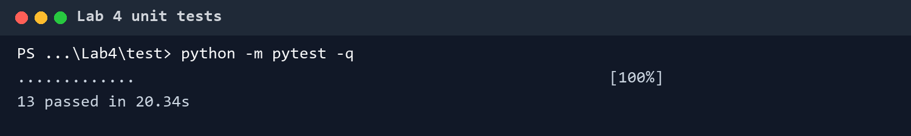

# 从零开始的 Python 扩展

> [!CAUTION]
>
> **本笔记仅供参考，请勿抄袭。**

## 任务

前几次作业中的 Tensor 和 CUDA 算子只能由 C++ 调用。Lab 4 使用 pybind11 把它们封装为 Python 扩展 `mytensor`，让 Python 能创建 Tensor、在 NumPy 与 GPU 数据之间转换，并调用 ReLU、Sigmoid、全连接、卷积、池化、Softmax 和交叉熵。

封装完成后，七类算子都要与 `torch.nn.functional` 的结果做单元测试。MNIST 也需要经过 NumPy 转成自定义 Tensor，为之后拼接网络与训练留好数据入口。

## 文件结构

```text
Lab4/
├── data/
│   └── mnist.py
├── src/
│   ├── CMakeLists.txt
│   ├── tensor.cu
│   ├── tensor.h
│   ├── tensor_kernel.h
│   └── tensornn.cu
└── test/
    ├── test_activation.py
    ├── test_conv.py
    ├── test_cross_entropy.py
    ├── test_full_connect.py
    ├── test_maxpool.py
    ├── test_sigmoid.py
    └── test_softmax.py
```

构建使用 C++20、CUDA、CMake 与 pybind11。复验时，参考结果由 CPU 版 PyTorch 2.9.1 计算，自定义扩展仍在 GPU 上执行。

## Tensor 绑定

模块入口使用 `PYBIND11_MODULE`。设备枚举和 Tensor 位于顶层，神经网络算子放进 `mytensor.nn` 子模块。

```cpp
PYBIND11_MODULE(mytensor, m) {
    py::enum_<TensorDevice>(m, "TensorDevice")
        .value("CPU", TensorDevice::CPU)
        .value("GPU", TensorDevice::GPU);

    py::class_<Tensor>(m, "Tensor")
        .def(py::init<const std::vector<int>&, TensorDevice>())
        .def("shape", &Tensor::getShape)
        .def("cpu", &Tensor::cpu)
        .def("gpu", &Tensor::gpu)
        .def("numpy", &tensor2numpy)
        .def_static("from_numpy", &numpy2tensor);

    auto nn = m.def_submodule("nn");
}
```

Python 端的最小调用链变成了

```python
array = np.random.randn(2, 3).astype(np.float32)
tensor = mytensor.Tensor.from_numpy(array)
output = tensor.relu_forward()
result = output.numpy()
```

## NumPy 互操作

`Tensor.from_numpy()` 接收 C-contiguous 数组，并通过 `forcecast` 转成 `float32`。绑定层读取数组的维度与形状，构造 Tensor 后把连续数据复制到 GPU。

```cpp
Tensor numpy2tensor(
    py::array_t<float,
        py::array::c_style | py::array::forcecast> array);
```

反向转换 `numpy()` 会新建一个 NumPy 数组，再按 Tensor 所在设备选择主机复制或设备到主机复制。两边采用复制语义，不共享存储。

复制会多占一份内存，但所有权很清楚：Python 数组释放后，Tensor 中不会留下悬空指针；Tensor 析构也不会破坏已经返回的 NumPy 数组。要实现零拷贝，需要额外约束生命周期、设备类型和 stride，在这个阶段并不划算。

输入只接受连续数组。若上游传来转置或切片产生的非连续 view，`forcecast` 会先整理成连续布局，CUDA 后端便可以继续按线性地址读取。

## 算子接口

激活函数直接作为 Tensor 方法暴露。需要多个输入或额外参数的模块放在 `mytensor.nn` 中。

| 接口 | 主要输入 | 返回值 |
| --- | --- | --- |
| `relu_forward`、`sigmoid_forward` | 输入 Tensor | 输出 Tensor |
| `relu_backward`、`sigmoid_backward` | 输入、上游梯度 | 输入梯度 |
| `full_connect_forward` | 输入、权重、偏置 | 输出 |
| `full_connect_backward` | 输入、权重、上游梯度 | 三类梯度 |
| `conv_forward` | 输入、权重、偏置、padding、stride | 输出 |
| `conv_backward` | 前向输入与上游梯度 | 输入、权重、偏置梯度 |
| `max_pool_forward` | 输入、核大小、stride | 输出 |
| `max_pool_backward` | 输入、输出、上游梯度 | 输入梯度 |
| `softmax_forward` | logits | 概率 |
| `cross_entropy_forward` | 概率、标签 | 标量损失 |
| `cross_entropy_backward` | 概率、标签 | logits 梯度 |

绑定层不只是把函数名搬到 Python。它还要检查输入维数是否匹配，根据卷积或池化参数计算输出形状，分配目标 Tensor，再把底层指针交给 CUDA 实现。若这些检查留给 kernel，错误通常只会表现为越界访问或毫无提示的错误结果。

## MNIST 数据

`data/mnist.py` 使用 torchvision 读取训练集与测试集，先转成 `float32` NumPy 数组，再调用 `Tensor.from_numpy()`。

```python
images = dataset.data.numpy().astype(np.float32) / 255.0
images = images[:, None, :, :]
tensor = mytensor.Tensor.from_numpy(images)
```

这里验证的是数据入口，没有在 Lab 4 中训练 MNIST。计算图、自动微分与优化器分别留到 Lab 5、Lab 6。

## 单元测试

每个测试都从同一份 NumPy 随机数据出发，一份送入 PyTorch，一份送入自定义 Tensor。反向测试还会给两条路径传入相同的上游梯度。这种对拍只通过公开接口观察输入和输出，属于黑盒测试。



```python
expected = torch.nn.functional.relu(torch_input)
actual = custom_input.relu_forward().numpy()

np.testing.assert_allclose(actual, expected.numpy(), rtol=1e-5, atol=1e-5)
```

测试没有只照着作业示例使用方形输入。卷积会改变 padding 与 stride，池化会检查反向梯度，全连接则同时比较输入、权重和偏置梯度。Softmax 交叉熵还要覆盖较大的 logits，确认减最大值后的数值稳定性。这些用例会主动经过实现中的边界与分支，属于白盒测试。



黑盒对拍负责判断算子整体结果是否正确，白盒用例负责逼出容易漏掉的执行路径。例如非方形卷积可以暴露高宽顺序错误，末尾不足一个完整 block 的输入可以检查越界保护，极大 logits 则会验证 Softmax 是否先减去行最大值。两类测试覆盖的问题不同，不能只保留其中一类。

本次复验共运行 13 项测试，全部通过。



这 13 项测试同时穿过 Python 参数解析、NumPy 复制、GPU kernel 和结果回传。它们不仅在验算公式，也能发现扩展加载、动态库依赖、对象生命周期和形状分配中的问题。

## 构建

```powershell
cmake -S src -B build
cmake --build build --config Release

$env:PYTHONPATH = "$(Resolve-Path build/Release)"
python -m pytest -q test
```

Windows 下最常见的问题是构建扩展与运行测试使用了不同的 Python 解释器。CMake 找到哪个解释器，生成的 `.pyd` 就只适配对应的 Python ABI。若 `import mytensor` 失败，先核对 CMake 输出、Python 版本和 CUDA 运行库路径，再检查算子代码。

当前 NumPy 互转会完整复制数据，算子调用也保留了较多同步，适合先保证接口正确。训练性能优化应放到功能稳定之后，再考虑固定内存、异步复制与减少 Python/CUDA 边界往返。
