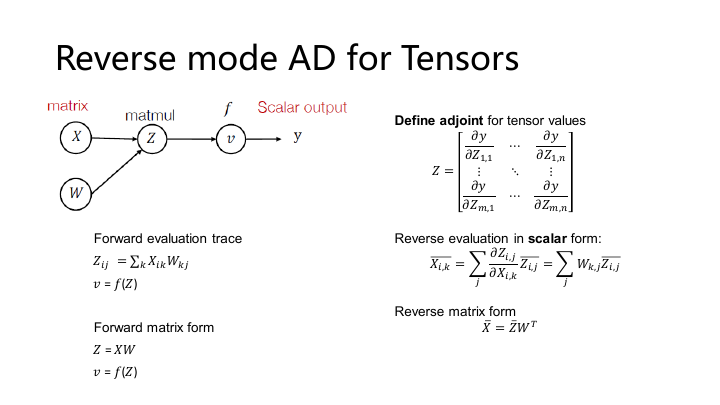
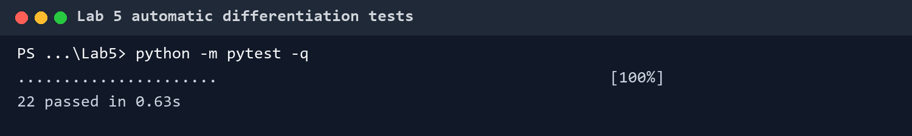

# 从零开始的自动微分

> [!CAUTION]
>
> **本笔记仅供参考，请勿抄袭。**

## 任务

Lab 5 用 NumPy 搭一个小型自动微分框架。它需要把一次计算拆成节点、运算符和图遍历三部分，随后让任意组合出来的表达式都能沿同一套规则反向传播。

```text
Op：一个局部运算的前向与梯度规则
Value / Tensor：数值、来源和梯度
Autodiff：整张计算图的遍历与梯度累计
```

这三层分别回答“怎么算”“这个值从哪里来”和“整张图按什么顺序反传”。添加新运算时，只应修改算子层；图引擎不需要认识加法、矩阵乘或 ReLU 的具体公式。

## 代码结构

```text
Lab5/
├── basic_operator.py
├── device.py
├── task1_operators.py
├── task2_autodiff.py
├── tensor.py
├── utils.py
├── test_task1_forward.py
├── test_task1_backward.py
├── test_task2_topo_sort.py
└── test_task2_auto_diff.py
```

`basic_operator.py` 定义 `Op` 和 `Value` 的抽象关系；`task1_operators.py` 提供 Tensor 与各个局部运算；`task2_autodiff.py` 负责拓扑排序和整图反传；`device.py`、`utils.py` 则隔离数组后端与常用构造函数。测试也按同样边界拆成算子前向、局部梯度、拓扑顺序和整图梯度四组。

## 节点与运算

以 $C=A+B$ 为例，结果节点 $C$ 不只保存相加后的数组，还记录产生自己的 `EWiseAdd`。它记录输入节点 $A$ 和输入节点 $B$ 两个对象。继续计算 $D=C\times A$ 后，节点引用自然连成一张有向无环图。

```python
class Value:
    op: Optional[Op]
    inputs: List["Value"]
    cached_data: NDArray
    grad: Optional["Value"]
```

用户直接创建的 Tensor 没有 `op`，属于叶节点。运算结果由 `Tensor.make_from_op()` 创建，保存输入和算子，并通过 `realize_cached_data()` 获得前向值。



前向值和图关系不能混在一起。`Op.compute()` 只接收底层数组，不应在里面创建新的计算图；`Op.gradient()` 接收 Tensor 与上游梯度，返回各输入对应的 Tensor 梯度。这样数值后端以后可以从 NumPy 换成 CUDA，而图引擎仍然只操作统一的 Value 接口。

## 添加一个算子

每个算子由类和一个薄包装函数组成。

```python
class EWiseMul(TensorOp):
    def compute(self, a, b):
        return a * b

    def gradient(self, out_grad, node):
        lhs, rhs = node.inputs
        return out_grad * rhs, out_grad * lhs


def multiply(a, b):
    return EWiseMul()(a, b)
```

类保存局部规则，包装函数提供自然的用户接口。Tensor 的 `__mul__`、`__add__` 等魔术方法也只调用这些包装函数，不重复实现计算。

扩展一个新算子时，可以按固定顺序做。

1. 写 `compute()`，先让前向对拍通过。
2. 写 `gradient()`，确认返回值数量与输入数量一致。
3. 处理广播和批量维，确保梯度恢复到原输入形状。
4. 增加包装函数与 Tensor 运算符入口。
5. 用中心差分检查局部梯度，再接进复合计算图。

矩阵乘 $Z=XY$ 的局部梯度为

$$
\mathrm{d}X=\mathrm{d}Z Y^\mathsf{T}
$$

$$
\mathrm{d}Y=X^\mathsf{T}\mathrm{d}Z
$$

二维输入可直接套用；批量矩阵乘还会广播前导维，结果梯度需要归约回输入原形状。局部公式正确并不代表实现已经覆盖广播。

## 形状恢复

广播让一个输入元素影响多个输出位置，反向时必须把这些路径的梯度相加。`_sum_to_shape()` 先消去多出的前导维，再沿原形状中长度为 1 的轴求和。

```python
def _sum_to_shape(tensor, shape):
    while len(tensor.shape) > len(shape):
        tensor = summation(tensor, axes=(0,))

    axes = tuple(
        i for i, (src, dst) in enumerate(zip(tensor.shape, shape))
        if dst == 1 and src != 1
    )
    if axes:
        tensor = summation(tensor, axes=axes).reshape(shape)
    return tensor
```

例如形状 $(3,1)$ 广播到 $(2,3,4)$ 后，反向需要沿新增的第 0 维和原来为 1 的末维归约。只比较元素总数无法判断该沿哪些轴求和。

求和算子的梯度走相反方向。前向删除了哪些轴，反向先用 reshape 补回长度为 1 的维度，再广播到输入形状。转置的梯度使用逆置换，reshape 的梯度恢复原 shape。这些操作本身没有复杂公式，真正容易错的是元数据变换。

## 图遍历

反向传播要求一个节点的所有下游贡献先到齐，再计算它对输入的梯度。`topo_sort_dfs()` 使用后序 DFS：先访问全部输入，最后把当前节点加入列表。

```python
def topo_sort_dfs(node, visited, topo_order):
    visited.add(node)
    for input_node in node.inputs:
        if input_node not in visited:
            topo_sort_dfs(input_node, visited, topo_order)
    topo_order.append(node)
```

这个列表从叶节点排到输出，反向传播时倒序遍历。`visited` 不能省略，同一个 Tensor 可能被多条支路引用；重复加入拓扑序会让它的梯度再次向前传播。

递归 DFS 对当前实验足够直观。图很深时会遇到 Python 递归深度限制，完整框架通常改用显式栈或基于入度的遍历。

## 梯度累计

在

$$
y=x^2+x
$$

表达式中的变量 $x$ 同时经过两条路径到达输出。图引擎不能在每条路径上直接覆盖 `x.grad`，而是先为每个节点收集所有上游贡献。

```python
node_to_output_grads_list[output_tensor] = [out_grad]

for node in reversed(find_topo_sort([output_tensor])):
    node.grad = sum(node_to_output_grads_list[node])
    if node.op is None:
        continue

    input_grads = node.op.gradient(node.grad, node)
    for input_node, input_grad in zip(node.inputs, input_grads):
        node_to_output_grads_list.setdefault(input_node, []).append(input_grad)
```

轮到一个节点时，它的所有下游已经处理完，可以先求和，再调用局部 `gradient()`。叶节点不再向前传播，但累计结果仍保存在 `.grad`，供优化器读取。

标量损失的初始梯度是 1。若输出不是标量，调用者必须传入与输出同形状的 `out_grad`，它表示要计算的 vector-Jacobian product。偷偷假设所有输出都是标量，会让中间节点的调试接口非常受限。

## 实现中的坑

- `compute()` 返回底层数组，`gradient()` 返回 Tensor。两层对象混用会绕过计算图，后续高阶组合便断开。
- 一个算子有几个输入，`gradient()` 就必须返回几个对应梯度。单输入算子也要保持返回协议一致。
- `axes=None`、单个整数和 tuple 的行为要统一，否则 Summation 在前向和反向会解释出不同维度。
- 梯度累计不能依赖原地加法。后端 Tensor 还没有可变写接口时，保存列表后统一求和更稳妥。
- 图节点需要按对象身份去重，不能按数值相等去重。两个值相同的独立 Tensor 仍是不同变量。
- 缓存前向值能避免重复计算，也意味着原地修改输入会让缓存失效。框架尚未定义版本计数时，应避免对参与构图的数组做原地写入。

## 复验

测试先比较各算子的 NumPy 前向值，再用中心差分检查局部梯度

$$
\frac{\partial f}{\partial x_i}
\approx
\frac{f(x+\varepsilon e_i)-f(x-\varepsilon e_i)}{2\varepsilon}
$$

随后再检查拓扑顺序、共享节点和整图梯度。当前 22 项测试全部通过。



```bash
python -m pytest -q
```

调试时应按模块缩小范围：前向失败先看 `compute()`，数值梯度失败再看局部规则，只有组合图失败时才检查拓扑排序和梯度累计。这样不会把一个 shape 错误追进整张计算图。
