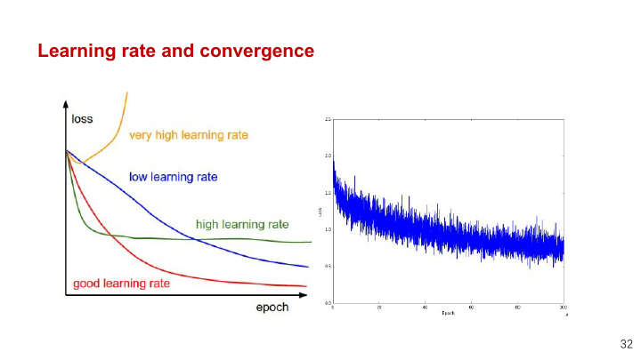

# 从零开始的优化器

> [!CAUTION]
>
> **本笔记仅供参考，请勿抄袭。**

## 优化器简要介绍

Lab 6 在 MNIST 上训练一个双层全连接网络，Softmax 交叉熵、反向传播、mini-batch SGD 和 Adam 都用 NumPy 手写。目录里保留了上一份 Lab 的自动微分代码，不过本次入口 `task1_optimizer.py` 没有调用它，梯度公式直接写在 epoch 函数里。

## 在动手之前

mini-batch 训练每次只用一部分样本估计完整梯度。batch 内的 loss 和梯度按真实样本数取平均，最后一个不足 `batch_size` 的 batch 也要使用自己的长度，不能继续除以固定值。

Softmax 计算指数前先减去每行最大 logits，分类概率不会因此改变，却能避免较大正数让 `exp()` 溢出。交叉熵使用类别下标构造 one-hot 标签，logits 梯度为预测概率减去标签，再除以 batch 大小。

SGD 只使用当前梯度，更新函数可以没有额外状态。Adam 为每个参数保存一阶矩、二阶矩，并用全局步数做偏差修正；这三组状态必须跨 batch 和 epoch 延续。每轮重新创建状态会让 Adam 一直停在第一个时间步。

优化器应只依赖参数列表与同顺序的梯度列表。模型负责前向和反向，优化器负责更新，训练循环负责切 batch 和记录指标。网络结构发生变化时，SGD 与 Adam 不应各自复制一份新的反向传播。

## 开始动手！

```text
Lab6/
├── task1_optimizer.py   本次实现与训练入口
├── std_optimizer.py     对照代码
├── task0_*.py           上一份自动微分框架
└── utils.py             Tensor 构造工具
```

这一版直接使用 NumPy 数组计算梯度，可以逐步检查 Adam 的 $m$ 、 $v$ 和 $t$ 。优化器只接收参数与梯度列表，日后换回自动微分时不用重写更新公式。

训练入口由数据读取、参数创建、前向反向、优化器和评估组成。

```text
parse_mnist()          数据入口
set_structure()       参数创建
forward()             模型计算
softmax_loss()        目标函数
SGD_epoch()/Adam_epoch()  参数更新
train_nn()            调度与评估
```

`SGD_epoch()` 与 `Adam_epoch()` 目前各自包含一份完整的前向和反向，图中的 `forward()` 只用于整轮评估。修改网络结构时，三处前向和两处反向都要同步改动。

### 数据与参数

`parse_mnist()` 把每张 $28\times28$ 图像展平为 784 维 `float32` 向量，缩放后的像素落在 $[0,1]$ 区间内。

```python
X_tr = trainset.data.numpy().reshape(-1, 28 * 28)
X_te = testset.data.numpy().reshape(-1, 28 * 28)
X_tr = X_tr.astype(np.float32) / 255.0
X_te = X_te.astype(np.float32) / 255.0
```

这里虽然给 torchvision Dataset 传入了 `Normalize`，后面却直接读取 `dataset.data`，因此 transform 不会执行。实际训练只做了除以 255。这个坑很隐蔽：代码中“写了标准化”不等于数据真的经过了标准化，必须沿真实的数据路径检查。

MNIST 的四个数组最终 shape 为

| 数组 | shape | dtype |
| --- | --- | --- |
| `X_tr` | $60000\times784$ | `float32` |
| `y_tr` | $60000$ | 整型 |
| `X_te` | $10000\times784$ | `float32` |
| `y_te` | $10000$ | 整型 |

网络没有卷积层，展平不会破坏后续接口。改用 transform 中的标准化时，要删除手工除以 255，避免一份图像被缩放两次。

参数创建集中在 `set_structure()`。第一层权重 $W_1\in\mathbb{R}^{784\times h}$ 负责把图像映射到隐藏层，第二层权重 $W_2\in\mathbb{R}^{h\times10}$ 输出十类 logits。当前网络没有偏置。

```python
W1 = np.random.randn(n, hidden_dim).astype(np.float32) / np.sqrt(hidden_dim)
W2 = np.random.randn(hidden_dim, k).astype(np.float32) / np.sqrt(k)
return [W1, W2]
```

SGD 与 Adam 对比时要在相同随机种子下分别调用一次参数创建，不能让第二个优化器接着第一个已经训练过的权重继续跑。

当前代码分别用 $\sqrt{h}$ 和 $\sqrt{k}$ 缩放两层权重。更常见的 fan-in 缩放会让 $W_1$ 除以 $\sqrt{784}$ ，让 $W_2$ 除以 $\sqrt{h}$ 。两种写法都能产生有限数值，但隐藏维或类别数改变后，当前尺度会明显变化。比较优化器时必须保持初始化完全相同；若研究初始化，再单独改这一处。

### 前向与梯度

`forward()` 只完成两次矩阵乘和一次 ReLU

$$
Z_1=XW_1
$$

$$
A_1=\max(Z_1,0)
$$

$$
Z_2=A_1W_2
$$

损失使用稳定的 log-sum-exp 写法，先减去每行最大值。

```python
z_max = np.max(logits, axis=1, keepdims=True)
z_exp = np.exp(logits - z_max)
log_probs = (logits - z_max) - np.log(
    np.sum(z_exp, axis=1, keepdims=True)
)
loss = -log_probs[np.arange(logits.shape[0]), labels].mean()
```

对 logits 的梯度为

$$
\mathrm{d}Z_2=\frac{P-Y}{N}
$$

其余梯度按模型模块的相反顺序传回

$$
\mathrm{d}W_2=A_1^\mathsf{T}\mathrm{d}Z_2
$$

$$
\mathrm{d}Z_1=(\mathrm{d}Z_2W_2^\mathsf{T})\odot\mathbb{1}[Z_1>0]
$$

$$
\mathrm{d}W_1=X^\mathsf{T}\mathrm{d}Z_1
$$

当前 `SGD_epoch()` 和 `Adam_epoch()` 内部各自写了一遍前向与反向，网络结构一变，两处都要同步修改。可以单独提供 `backward(X, weights, y)`，返回与 `weights` 一一对应的梯度列表，两种优化器只消费这份列表。

```text
forward_batch(X, weights) -> logits, cache
backward_batch(cache, y)  -> [dW1, dW2]
optimizer_step(weights, grads, state)
```

这里的 `cache` 至少要保留 $X$ 、 $Z_1$ 、 $A_1$ 和 $W_2$ 。优化器不应知道 ReLU 在哪里，也不应自己构造 one-hot 标签；它只接收与参数同顺序的梯度。

one-hot 数组要显式沿用 `probs.dtype`。

```python
y_one_hot = np.zeros(
    (batch_size, num_classes),
    dtype=probs.dtype,
)
```

若使用默认的 `float64`，`probs - y_one_hot` 会把整条梯度提升为 `float64`，随后原地写回 `float32` 权重时可能触发 casting 错误，或者让中间数组占用双倍内存。

### SGD 模块

`SGD_epoch()` 顺序切分 mini-batch，计算梯度后原地更新参数

$$
W\leftarrow W-\eta\,\mathrm{d}W
$$

```python
weights[0] -= lr * dW1
weights[1] -= lr * dW2
```

这里必须原地修改数组。若函数内部写成 `weights = new_weights`，只会替换局部列表，外层训练循环仍持有旧参数。使用 `weights[j] -= ...` 则保留对象身份，模型下一次前向能看到更新。

最后一个 batch 不一定等于配置的 `batch`。循环用 `end_idx = min(start_idx + batch, num_examples)` 截断，梯度除数必须取 `X_batch.shape[0]`，不能始终除以 100。MNIST 的 60000 恰好整除 100，这个错误在默认参数下不会出现，换一个 batch size 才会暴露。

当前代码没有在 epoch 开始前打乱样本，batch 顺序会一直相同。若要比较优化器，应使用固定随机种子的 permutation，并让两种优化器读取相同批次；否则差异中还混入了数据顺序。

原地更新前还可以临时保存一个参数切片，确认它真的变化。

```python
before = weights[0][0, :4].copy()
SGD_epoch(X_small, y_small, weights, lr=0.1, batch=16)
after = weights[0][0, :4]
```

若 `before` 与 `after` 完全相同，先检查梯度是否为零，再检查更新是否只改了局部变量。

### Adam 模块

Adam 除参数外还拥有一阶矩、二阶矩和全局步数

$$
m_t=\beta_1m_{t-1}+(1-\beta_1)g_t
$$

$$
v_t=\beta_2v_{t-1}+(1-\beta_2)g_t^2
$$

$$
\widehat m_t=\frac{m_t}{1-\beta_1^t},\qquad
\widehat v_t=\frac{v_t}{1-\beta_2^t}
$$

$$
W_t=W_{t-1}-
\eta\frac{\widehat m_t}{\sqrt{\widehat v_t}+\epsilon}
$$

状态用一个字典保存，与参数列表保持相同结构。

```python
state = {
    "m": [np.zeros_like(w) for w in weights],
    "v": [np.zeros_like(w) for w in weights],
    "t": 0,
}
```

`Adam_epoch()` 接收上一轮状态并返回更新后的状态；`train_nn()` 在整个训练过程中持有它。

```python
adam_state = None

for epoch in range(epochs):
    adam_state = opti_epoch(
        X_tr,
        y_tr,
        weights,
        using_adam=True,
        adam_state=adam_state,
    )
```

如果每个 epoch 都重新创建三个状态，其中 $m$ 保存一阶矩，变量 $v$ 保存二阶矩，变量 $t$ 保存步数，那么 Adam 会不断回到第一步，前面所有 batch 的历史都被清空。无状态 SGD 不必返回额外对象，有状态优化器则必须让状态跨越调用边界。

时间步在每个 mini-batch 开始时加一，不是在每个 epoch 加一。一个 epoch 有 600 次更新，第二轮第一个 batch 的 $t$ 应为 601。偏差修正中的指数依赖这个数，若把它当作 epoch 计数，前几轮的修正会偏得很明显。

状态列表与参数列表一一对应。

```text
weights = [W1, W2]
m       = [m1, m2]
v       = [v1, v2]
grads   = [dW1, dW2]
```

新增偏置或第三层时，四个列表都要同步增加。参数变多后可以让 optimizer 对参数对象建字典，避免顺序错位；当前两层网络用并行列表即可。



自适应分母并不能替代学习率。Adam 和 SGD 适合的基础步长通常不同，用同一数值直接比较并不公平。一次实验里 Adam 波动更大，应先检查学习率、batch 顺序和状态生命周期，再解释准确率差异。

### 训练调度

`train_nn()` 只做三件事：调用优化器跑完一轮、在完整训练集上评估、在测试集上评估。损失和错误率计算封装在 `loss_err()` 中，避免两份评估代码出现不同口径。

入口为 SGD 和 Adam 各调用一次 `np.random.seed(0)`，因此二者拿到相同初始权重；学习率分别是 0.2 与 0.02。每轮打印训练、测试 loss 和错误率，训练结果不会反过来改变优化器选择。

训练集与测试集的评估都只读取参数，不应修改 optimizer state。接回 Lab 5 的自动微分后，评估阶段还要关闭构图或及时释放图，否则每个 epoch 都会留下一整张无用计算图。

参数初始化也不应藏在 `train_nn()` 内部。调用者传入哪组权重，函数就训练哪组权重；否则外部设置的随机种子或预训练参数会被悄悄覆盖。

当前训练每轮都在全部 60000 张训练图和 10000 张测试图上再做一次前向。网络很小，这个开销可以接受；模型扩大后，训练指标可按 batch 顺手累计，测试集则保持单独评估。若要调学习率或决定早停，应从训练集中划出验证集，不能反复根据测试集挑参数。

### 实现中的坑

- torchvision transform 被 `dataset.data` 绕过，实际预处理与代码表面不一致。
- 最后一个 batch 可能小于设定大小，归一化梯度时应使用当前 batch 的真实样本数。
- `weights` 与梯度列表必须保持相同顺序和形状，优化器不应靠变量名猜对应关系。
- Adam 的时间步按参数更新次数递增，不是按 epoch 递增。
- 一阶、二阶矩需要与参数同 dtype。默认创建 `float64` 状态会让内存和运算类型悄悄变化。
- 评估测试集只能用于观察泛化，不能据此反复挑选超参数；需要调参时应再划出验证集。

还有一处容易被重复代码掩盖的问题：`softmax_loss()`、`SGD_epoch()` 和 `Adam_epoch()` 各写了一遍稳定 Softmax。只修其中一份，训练 loss 与评估 loss 就可能使用不同公式。把概率与反向缓存抽成一个 batch 函数后，这三处才会真正统一。

### 成品代码

训练入口与两种优化器集中在 `task1_optimizer.py`，`std_optimizer.py` 保留参考实现，其余 `task0_*` 文件是上一份自动微分框架。完整代码见 [Lab 6 源码](https://github.com/elainafan/Programming-in-AI-2025Fall-PKU/tree/main/Lab6)。

最终入口分别从同一随机初始化训练 SGD 与 Adam。参数创建、batch 前向反向、优化器状态和评估函数彼此独立，`train_nn()` 只负责调度，不在内部重新初始化权重。

### 训练结果

```bash
python task1_optimizer.py
```

20 个 epoch 后的结果为：

| 优化器 | 训练 loss | 训练错误率 | 测试 loss | 测试错误率 |
| --- | ---: | ---: | ---: | ---: |
| SGD | 0.02243 | 0.545% | 0.08322 | 2.440% |
| Adam | 0.12205 | 3.082% | 0.33932 | 5.020% |

当前 Adam 的学习率为 0.02，且 batch 顺序没有打乱，后半程出现明显震荡。这个结果只能比较本次参数配置，不能据此判断 Adam 普遍弱于 SGD。短路测试可以先只取几百个样本和两个 epoch，打印首个 batch 的 loss、梯度范数和 Adam 的 `t`，确认状态连续增长后再运行完整 MNIST。
