# 从零开始的Arch Lab

> [!CAUTION]
> 
> **本笔记仅供参考，请勿抄袭。**

## 声明
本笔记的写作初衷在于，笔者在做Arch Lab的时候受到Arthals学长很大启发，同时25Fall的计算机系统导论课程改制增加了10分的Lab测试（虽然往年的期中期末中也会有一两道Lab相关选择题，但分值不大）。故将心路历程写成此笔记，以便复习，并供后续选课同学参考。

## Arch Lab简要介绍
Arch Lab是《计算机系统导论》课程的第4个Lab，对应教材第四章《处理器体系结构》和第五章《优化程序性能》。该Lab旨在加强同学们撰写Y86代码的能力，加深同学们对流水线结构及其优化过程的理解，以及鼓励同学们通过实现循环展开，深入了解循环展开的原理。

在Arch Lab中，共有三个Part，即Part A、Part B和Part C，分别为15pts、25pts和60pts（由此可见Part C难度之高）。在``Part A``中，需要实现三个Y86程序，分别为``sum.ys``、``rsum.ys``和``bubble.ys``，它们分别用于``迭代求和链表元素``、``递归求和链表元素``、以及``对8字节整数块进行冒泡升序排序``。在``Part B``中，需要为一个``SEQ``处理器拓展``IOPQ``指令，同时通过``占位符填空``，逐步优化一个``二阶段流水线``为``四阶段流水线``，使其具有较完善的转发和冒险处理逻辑。在``Part C``中，需要独立优化一个架构，同时优化``ncopy``函数，其功能为将一个包含``len``个元素的整数数组``src``复制到目标数组``dst``中，以通过数据测试，达到``Arch Cost``和``CPE``的理想值。

值得一提的是，此次Lab又受到了PKU助教团队的大幅~~魔改~~加强，具体体现在，``Part A``中，将原有的``copy_block.ys``改为``bubble.ys``，``Part B``中，增加了原Lab中没有的``优化流水线``环节，并将原有的``HCL``语言转换为``Rust``语言(技术支持来自[HWY学长](https://github.com/sshwy))，以及``Part C``中，修改原有的``单一CPE优化要求``为``Arch Cost+CPE的混合优化要求``，并加强了测试数据，此Lab的难度大致为中高，笔者用时约为 $12 \sim 14$ 小时。

## 在动手之前
### 代码美化
由于``Part A``和``Part C``中需要阅读并撰写``Y86``代码，因此笔者推荐安装``Y86 Syntax Highlighter``拓展，以获得更加的代码体验。

同时，在``writeup``中提到，由于``Part B``和``Part C``均使用基于``Rust``语言的架构，因此推荐安装``rust-analyzer``拓展，以享受语法检查、自动补全等功能。

### 安装Rust工具链
打开终端，在其中运行以下指令：

```bash
curl --proto '=https' --tlsv1.2 -sSf https://sh.rustup.rs | sh
```

安装完成后，可以通过``rustup``指令验证是否安装成功。

接着，需要安装指定版本的工具链(撰写``README``文件时为1.90)，运行以下指令：

```bash
rustup install 1.90
rustup default 1.90
```

笔者需要提醒的是，类似``Data Lab``中的``make``指令，每次修改代码后，需要使用``cargo build``指令进行构建，方可进行测试。

每次运行``cargo build``后，会在项目目录下生成一个``target``文件夹，用于存放编译产物。

主要的可执行文件包括：

- ``target\debug\yas``：Y86-64``汇编器``
- ``target\debug\yis``：Y86-64``ISA 模拟器``
- ``target\debug\ysim``：Y86-64``流水线模拟器``
- ``target\debug\ydb``：Y86-64``调试模拟器``

### 何为循环展开？
根据25Fall的经验，这个Lab发布的时候，如果跟着大班的进度，是一定学不到第五章的。

于是，笔者在此稍作介绍，因为该Lab需要的仅为简单的 $k \times 1$ 路展开，不涉及 $k \times k$ 路展开以及重新结合等知识，仅便于写Lab，要了解具体知识还得见《深入理解计算机系统》第5章第8节。

比较下列两个函数：

```c
void combine_4(vec_ptr v,data_t *dest){
    long i;
    long length=vec_length(v);
    data_t *data=get_vec_start(v);
    data_t acc=IDENT;
    for(i=0;i<length;i++){
        acc=acc OP data[i];
    }
    *data=acc;
    return ;
}

void combine5(vec_ptr v,data_t *dest){
    long i;
    long length=vec_length(v);
    long limit=length-1;
    data_t *data=get_vec_start(v);
    data_t acc=IDENT;
    for(i=0;i<limit;i+=2){
        acc=(acc OP data[i]) OP data[i+1];
    }
    for(;i<length;i++){
        acc=acc OP data[i];
    }
    *dest=acc;
    return ;
}
```

这是一种通过累计变量提高并行度的级数，其中，每次循环体内的``body-statement``重复执行的次数称为循环展开的``路数``，在``combine5``函数中，路数为2。

它的原理主要是在于可以通过累计变量来提高并行度，通过将不同的变量放到多个寄存器中，减少单个变量的关键路径上的依赖（即关键路径上的依赖），从而提高效率。

一个显然的想法是，尽量提高路数，但这样有什么弊端？

一个弊端是，当临时变量过多，编译器会将多出的变量存放到栈帧而非寄存器中，根据常识或者第六章的知识可以得知，访问内存比访问寄存器慢得多，这反而会拖累效率。

另一个弊端是，使用的寄存器越多，就需要额外处理余数部分，这部分实现较为麻烦，不过没关系，在``Part C``中，笔者会实现一个简单的跳转表进行余数处理~~（谁叫写的是Y86而不是X86呢）~~。

### 课本相关知识
- Y86-64代码及其相关含义
- SEQ架构及流水线架构
- 循环展开及其优化

## Part A
运行``tar -xvf archlab-handout.tar``指令，得到该Lab所需的全部文件。

根据``writeup``，需要遵循``x86-64``的函数规定，包括参数传递、寄存器使用和栈操作规则等，包括保存和恢复使用的所有被调用者保存寄存器。

该``Part``需要在``misc``下编写文件。
### sum.ys
参照``asum.ys``或者其他给出的``ys``文件，可以得到代码的其他部分：

```asm
    .pos 0
    irmovq stack, %rsp # Set up stack pointer
    call main # Execute main program
    halt # Terminate program

    .align 8 # 测试用链表
ele1:
    .quad 0x00d
    .quad ele2
ele2:
    .quad 0x0e0
    .quad ele3
ele3:
    .quad 0xf00
    .quad 0

    .pos 0x200 # 定义栈的初地址
stack:
```

再参照给出的``example.c``中的``sum_list``函数，一步步翻译，得出以下代码：

```asm
    .pos 0
    irmovq stack, %rsp # Set up stack pointer
    call main # Execute main program
    halt # Terminate program

    .align 8 # 测试用链表
ele1:
    .quad 0x00d
    .quad ele2
ele2:
    .quad 0x0e0
    .quad ele3
ele3:
    .quad 0xf00
    .quad 0

main:
    irmovq ele1, %rdi # 设置%rdi地址
    call sum_list # 调用sum_list
    ret

sum_list:
    xorq %rax, %rax # 将val置零
    jmp test

Loop:
    mrmovq (%rdi), %rsi # %rsi赋值为ls->val
    addq %rsi, %rax # val+=ls->val
    mrmovq 8(%rdi), %rdi # ls=ls->next
    jmp test 

test:
    andq %rdi, %rdi # if ls!=nullptr,continue
    jne Loop
    jmp done # else jump to return 

done:
    ret 

    .pos 0x200
stack:
```

注意文件末尾``需要空一行``(指的是ret和.pos之间)

运行``cargo build``和``./target/debug/grader part-a``指令，得到以下结果，表示完成了``sum.ys``。

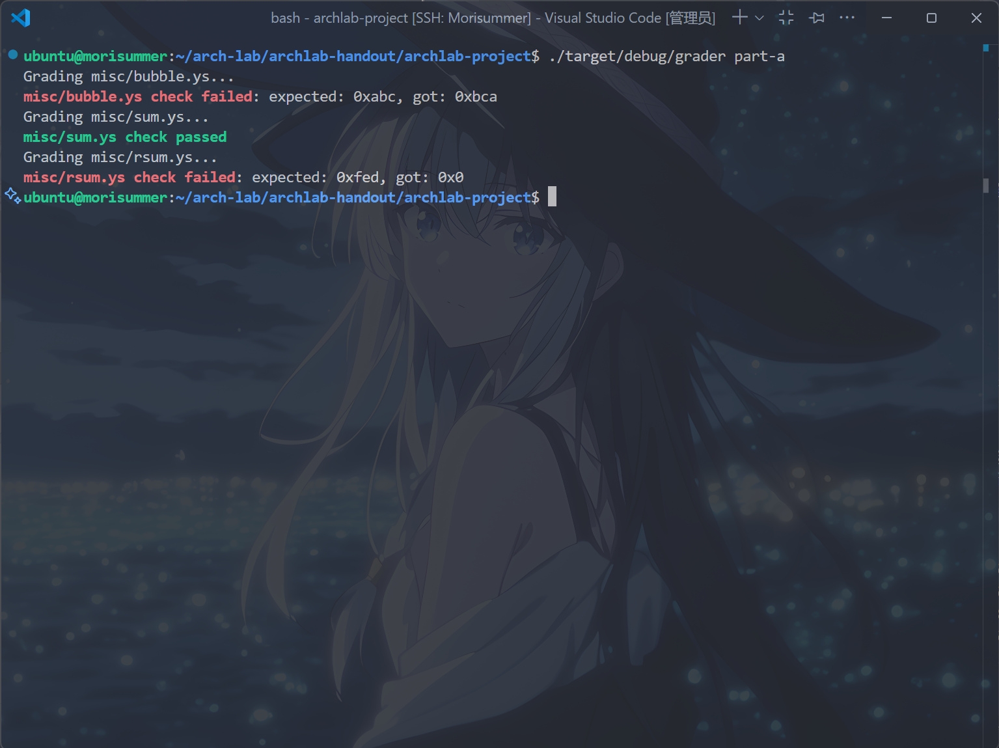

### rsum.ys
代码的其他部分实现同样可以参照给出的其它文件写出。

根据``writeup``，此题需要以递归方式求和。

回忆第三章相关内容，需要将``val``值存在栈帧中，防止其在寄存器中被下层函数替换，其余实现细节翻译即可。

再参照``example.c``中的``rsum_list``函数，一步步翻译，得出以下代码：

```asm
# As you've got familiar with Y86 after writting your first y86 code
# (bubble.ys), this code is left blank for you :)
    .pos 0
    irmovq stack, %rsp # Set up stack pointer
    call main # Execute main program
    halt # Terminate program

    .align 8 # 测试用链表
ele1:
    .quad 0x00d
    .quad ele2
ele2:
    .quad 0x0e0
    .quad ele3
ele3:
    .quad 0xf00
    .quad 0

main:
    irmovq ele1, %rdi 
    call rsum_list # 调用rsum_list函数
    ret

rsum_list:
    andq %rdi, %rdi
    je done
    mrmovq (%rdi), %rsi
    pushq %rsi # 临时变量压栈保存
    mrmovq 8(%rdi), %rdi
    call rsum_list
    popq %rdx
    addq %rdx, %rax
    ret

done:
    ret

    .pos 0x200
stack:
```

运行``cargo build``和``./target/debug/grader part-a``指令，得到以下结果，表示完成了``rsum.ys``。

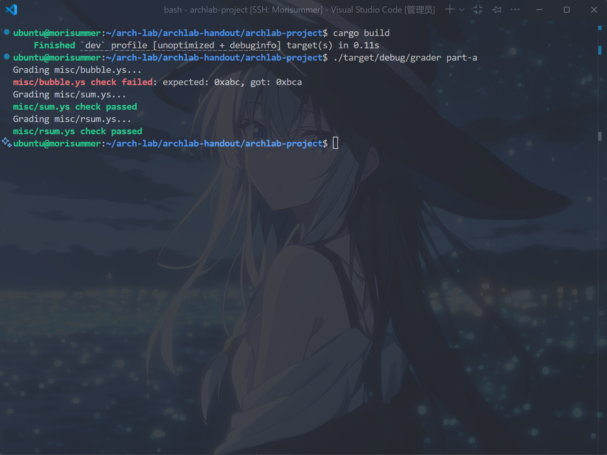

### bubble.ys

根据``writeup``，需要原地对数组进行冒泡排序。

逐步对``example.c``中的``bubble_sort``进行翻译即可，得到以下代码：

```asm
	.pos 0
	irmovq	stack,%rsp
	call main
	halt

	.align 8
array:
	.quad 0xbca
	.quad 0xcba
	.quad 0xacb
	.quad 0xcab
	.quad 0xabc
	.quad 0xbac
	
################################################################################
# You may want to modify this portion
# data:%rdi,count:%rsi,last:%rsi,常数8:%r13,i:%rcx

bubble_a:
	addq %rsi, %rsi
	addq %rsi, %rsi
	addq %rsi, %rsi # %rsi*=8
	addq %rdi, %rsi # %rdi需要保存以判断条件
	irmovq $8, %r13 # 设置常数8.便于遍历
	jmp test1
	

loop1:
	rrmovq %rdi, %rcx # i=data;
	subq %r13, %rsi # last--;
	jmp test2

loop2:
	mrmovq (%rcx), %r10 # %r10=*i
	mrmovq 8(%rcx), %r11 # %r11=*(i+1)
	rrmovq %rcx, %rbx # %rbx=i
	addq %r13, %rcx # i++
	subq %r10, %r11 # if *(i+1)<*i jmp to swap
	jl check
	jmp test2

check:
	mrmovq 8(%rbx), %r12 
	rmmovq %r10, 8(%rbx)
	rmmovq %r12, (%rbx)
	jmp test2 # swap

test1:
	rrmovq %rsi, %rdx 
	subq %rdi, %rdx # if last<=data break;
	jle done
	jmp loop1

test2:
	rrmovq %rcx, %r8 # %r8=i
	rrmovq %rsi, %r9 # %r9=last
	subq %r8, %r9 # if last<=i break;
	jle test1
	jmp loop2

main:
	irmovq array, %rdi
	irmovq $6, %rsi
	call bubble_a
	ret

done:
	ret

	.pos 0x200
stack:
```

运行``cargo build``和``./target/debug/grader part-a``指令，得到以下结果，表示完成了``part A``。

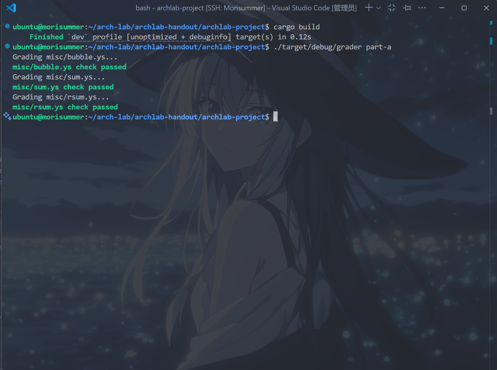

## Part B
根据``writeup``，该部分需要在``/sim/src/architectures/extra``目录下编写文件。
### 增添IOPQ指令
根据``writeup``，需要在``seq_full.rs``文件中编写文件，为``SEQ``架构增加``IOPQ``指令。

``IOPQ``指令：将某个立即数与寄存器中值进行``OP``运算，结果存储于该寄存器中，编码如下图。

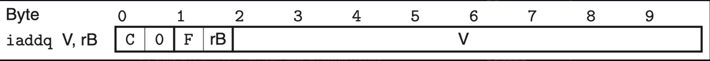

大致可以参考``OPQ``和``IOPQ``的逻辑，解释该指令如下：

- 取指
  - 取出``icode``和``ifun``
  - 取出``rA``和``rB``，其中``rA``默认为``F``
  - 取出``valC``
  - 预测下一条跳转地址``valP``
- 译码
  - 从``rB``中取出``valB``
- 执行
  - 在``ALU``中计算``valC OP VALB``，得到``valE``
  - 设置条件码``CC``
- 访存
  - 无访存阶段
- 写回
  - 将``valE``写回``rB``
  - 用``valP``更新``PC``

得到大致逻辑后，就可以着手增加指令了。

取指阶段，由于``IOPQ``是有效指令、需要使用寄存器和常数，则在``instr_valid、need_regids和need_valC``中添加``IOPQ``指令，如下：

```rust
bool instr_valid = icode in // CMOVX is the same as RRMOVQ
    { NOP, HALT, CMOVX, IRMOVQ, RMMOVQ, MRMOVQ,
    OPQ, JX, CALL, RET, PUSHQ, POPQ };

// Does fetched instruction require a regid byte?
bool need_regids =
    icode in { CMOVX, OPQ, PUSHQ, POPQ, IRMOVQ, RMMOVQ, MRMOVQ };

// Does fetched instruction require a constant word?
bool need_valC = icode in { IRMOVQ, RMMOVQ, MRMOVQ, JX, CALL };
```

译码阶段，由于``IOPQ``需要取出``srcB``，得到``dstE``，因此在``srcB``和``dstE``中添加``IOPQ``指令，如下：

```rust
// What register should be used as the B source?
u8 srcB = [
    icode in { OPQ, RMMOVQ, MRMOVQ, IOPQ } : ialign.rB;
    icode in { PUSHQ, POPQ, CALL, RET } : RSP;
    true : RNONE; // Don't need register
];

// What register should be used as the E destination?
u8 dstE = [
    icode in { CMOVX } && cnd : ialign.rB;
    icode in { IRMOVQ, OPQ, IOPQ} : ialign.rB;
    icode in { PUSHQ, POPQ, CALL, RET } : RSP;
    true : RNONE; // Don't write any register
];
```

执行阶段，由于需要传入``valC和valB``，并且需要改变``alufun(使其不为默认加法器)``，并设置条件码，因此修改``aluA、aluB、alufun和set_cc``如下：

```rust
// Select input A to ALU
u64 aluA = [
    icode in { CMOVX, OPQ } : reg_read.valA;
    icode in { IRMOVQ, RMMOVQ, MRMOVQ, IOPQ } : ialign.valC;
    icode in { CALL, PUSHQ } : NEG_8;
    icode in { RET, POPQ } : 8;
    // Other instructions don't need ALU
];

// Select input B to ALU
u64 aluB = [
    icode in { RMMOVQ, MRMOVQ, OPQ, CALL,
              PUSHQ, RET, POPQ, IOPQ } : reg_read.valB;
    icode in { CMOVX, IRMOVQ } : 0;
    // Other instructions don't need ALU
];

// Set the ALU function
u8 alufun = [
    icode in { OPQ, IOPQ } : ifun;
    true : ADD;
];

// Should the condition codes be updated?
bool set_cc = icode in { OPQ, IOPQ };
```

访存阶段，由于``IOPQ``无访存阶段，因此无需修改。

写回阶段，代码中没有需要填写的空，也无须修改。

运行``cargo build``和``./target/debug/grader part-b``指令，得到以下结果，表示完成了``增加IOPQ``环节：

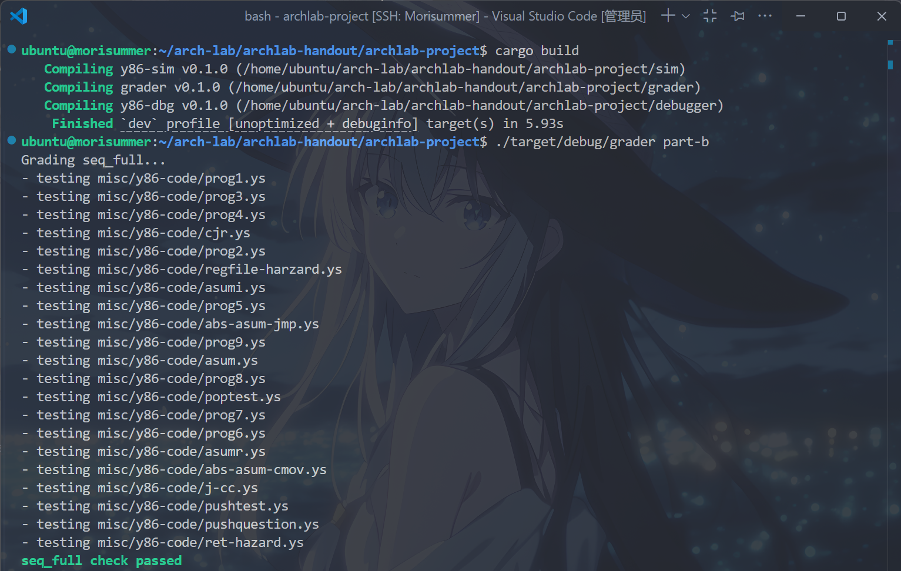

### P3a
根据``writeup``，文件提供了一个由``SEQ+``改进的二级流水线架构``pipe_s2.rs``，需要逐步完善``pipe_s3.rs``的四个三级流水线。

在三级流水线中，``取指和译码``阶段独立，其它阶段合并为``执行``阶段。需要在每个文件中的占位符里填上合适的代码。

好在，学长在注释中，给出了足够提示，可以根据提示来判断结果。

根据注释，在``P3a``中，相比``P2``，将``译码``阶段与后续的阶段分开，但这会引入以下问题：
- ``reg_read``和``reg_write``位于不同的流水线阶段，可能导致``数据冒险``。
- 用于计算``f_pc``的操作数被拆分到不同的流水线阶段，这是不正确的，因为不同流水线阶段的值属于不同的指令。
- 从而，需要对流水线寄存器实现停顿和气泡控制，确保等待一个额外周期。

取指阶段，根据注释和课本知识，容易了解到此处应该填上默认跳转以及``RET``语句的``f_pc``，如下：

注意由于此处因为无访存阶段和写回阶段，因此``RET``前应填``E.icode``和``e_valM``。

```rust
// What address should instruction be fetched at?
// We use D.icode because we use the icode in the last cycle to determine the
// next PC.
u64 f_pc = [
    // Call.  Use instruction constant
    // If the previous instruction is CALL, the constant value should be the next PC
    // valC is from Fetch Stage, thus the last cycle
    D.icode == CALL : D.valC;
    // Taken branch.  Use instruction constant
    E.icode == JX && e_cnd : E.valC;
    // Completion of RET instruction.  Use value from stack
    // valM is from DEMW stage, thus the current cycle
    E.icode == RET : e_valM;
    // Default: Use incremented PC
    1 : F.valP;
];
```

在第三阶段的执行阶段，由于若``CMOVXX``指令不满足，则将``e_dstE``置为空，如下：

```rust
u8 e_dstE = [
    E.icode == CMOVX && !e_cnd : RNONE;
    1 : E.dstE;
];
```

在处理冒险时，由于当译码阶段需要取出的寄存器被第三阶段中的访存/写回使用，可能产生数据冒险。同时，产生数据冒险时，则需要在取指阶段和译码阶段各进行暂停。由以上机制补全代码如下：

```rust
// If a data hazard occurs, we need to wait for the data to be written to the
// registers before proceeding.
bool data_harzard = d_srcA != RNONE && d_srcA in { e_dstE, e_dstM }
    || d_srcB != RNONE && d_srcB in { e_dstE, e_dstM};

bool f_stall = D.icode in { JX, RET } || data_harzard;

@set_stage(f, {
    stall: f_stall,
});


bool d_stall = data_harzard;
```

运行``cargo build``和``./target/debug/grader part-b``指令，出现以下结果，表示完成了``P3a``：

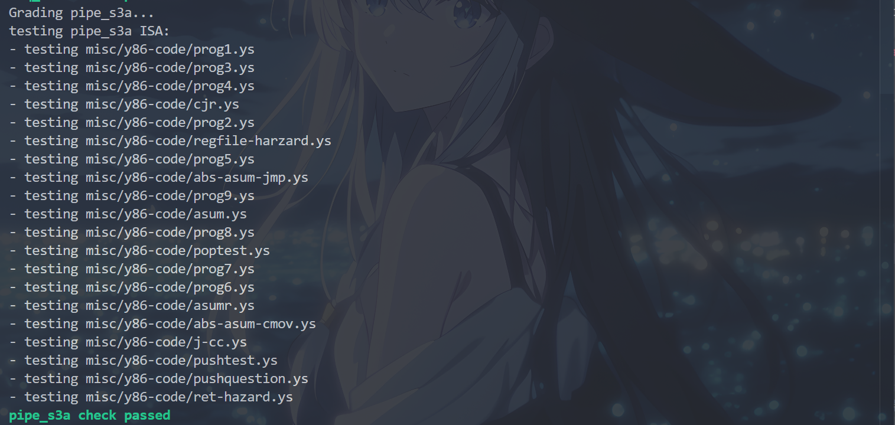

### P3b
根据顶部注释，得知``P3a``的气泡和暂停频率过高，导致效率低下，应该补充转发逻辑解决问题。

由于转发逻辑不影响取指阶段，因此取指阶段补充与``P3a``中相同。

在译码阶段，要求完善``d_valA``和``d_valB``的转发逻辑，根据``d_srcA/d_srcB``是否等于``e_dstE/e_dstM``来填写，如下：

```rust
u64 d_valA = [
    d_srcA == e_dstE : e_valE;
    d_srcA == e_dstM : e_valM;
    1: reg_read.valA;
];
u64 d_valB = [
    d_srcB == e_dstE : e_valE;
    d_srcB == e_dstM : e_valM;
    1: reg_read.valB;
];
```

执行阶段需要填写的``e_dstE``逻辑，由于仍是关于``CMOVX``指令的处理逻辑，与``P3a``中相同。

由于使用转发逻辑处理数据冒险，因此流水线寄存器控制中不再出现数据冒险变量，此时仅处理``JX``指令和``RET``指令的情况，填写代码如下：

```rust
bool f_stall = D.icode in { JX, RET };

@set_stage(f, {
    stall: f_stall,
});


bool d_stall = false;

bool d_bubble = D.icode in { JX, RET };
```

运行``cargo build``和``./target/debug/grader part-b``指令，出现以下结果，表示完成了``P3b``:

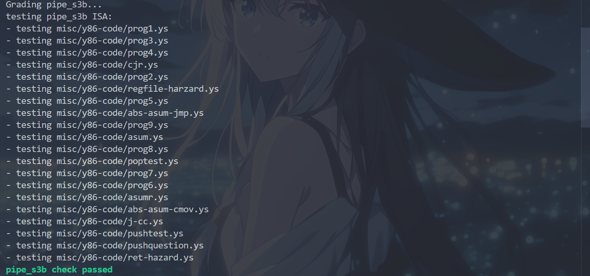

### P3c
根据顶部注释，得知``P3b``的性能提升并不显著，因为在遇到``JX``指令时总是插入暂停或者气泡。实际上，可以通过分支预测来实现优化。

在取指阶段，分支预测逻辑表明，应当执行``总是跳转``策略，当不满足条件码时，才将预测的下一条指令地址记为``E.valP``，填写代码如下：

```rust
// What address should instruction be fetched at?
// We use D.icode because we use the icode in the last cycle to determine the
// next PC.
u64 f_pc = [
    // Call.  Use instruction constant
    // If the previous instruction is CALL, the constant value should be the next PC
    // valC is from Fetch Stage, thus the last cycle
    D.icode == CALL : D.valC;
    // Branch misprediction.  Use incremental PC
    E.icode == JX && !e_cnd : E.valP;
    // Completion of RET instruction.  Use value from stack
    // valM is from DEMW stage, thus the current cycle
    E.icode == RET : e_valM;
    // Default: Use predicted PC
    1 : F.pred_pc;
];
```

在译码阶段，转发逻辑的实现与分支预测逻辑/冒险处理无关，因此译码阶段的填空与``P3B``相同。

在执行阶段，``CMOVXX``指令的处理与分支预测逻辑/冒险处理无关，因此执行阶段的填空与``P3B``相同。

最后，需要多处理分支预测错误的情况，即``JXX``冒险。根据注释，当在执行阶段检测到分支预测错误，则当前处于译码阶段的指令不可用，需要在下一个执行阶段插入一个气泡顶掉它。

同时，如果``RET``冒险和``JXX``冒险同时出现，那么``JXX``冒险会被先执行，而``RET``冒险会被忽略，此时取指阶段无须暂停，且译码阶段无须插入气泡。

根据以上原理，填写代码如下：

```rust
// If a branch misprediction is detected during the Execute stage, it means that
// the instruction currently in the Decode stage is invalid. Therefore, the next
// cycle’s Execute stage needs to insert a bubble.
bool branch_mispred = E.icode == JX && !e_cnd;

// If the current instruction in the Decode stage is a RET, then the instruction
// in the current Fetch stage is invalid. Therefore, the next cycle’s Fetch stage 
// needs to insert a bubble.
bool ret_harzard = D.icode == RET;

// If both a branch misprediction and a RET hazard occur at the same time, since 
// the jump instruction is executed before the RET, the RET should not have been 
// executed, so a stall is not needed.
bool f_stall = ret_harzard && !branch_mispred;

@set_stage(f, {
    stall: f_stall,
});


bool d_stall = false;

// If both a branch misprediction and a ret hazard occur at the same time,
// since the jump instruction is executed before the RET, the RET should not
// have been executed. Therefore, a bubble is not needed.
bool d_bubble = ret_harzard && !branch_mispred;
```

运行``cargo build``和``./target/debug/grader part-b``指令，得到以下结果，表示完成了``P3c``：


### P3d
根据顶部注释，相比``P3c``，为了避免结构冒险，将寄存器的读取和写入合并成同一个设备``reg_file``，操作按照``先写后读``的原则进行。

取指阶段的预测逻辑并不受寄存器合并影响，因此与``P3c``中相同。

译码阶段的转发逻辑并不受寄存器合并影响，因此与``P3c``中相同。

执行阶段的``CMOVX``并不受寄存器合并影响，因此与``P3c``中相同。

分支预测逻辑并不受寄存器合并影响，因此与``P3c``中相同。

P.S：笔者做的时候抄了一遍就过了，非常惊讶，可能是书上并没有出现结构冒险的相关论述，因此在Lab中也不做相关要求，仅作演示。

运行``cargo build``和``./target/debug/grader part-b``指令，得到以下结果，表示完成了``P3d``：

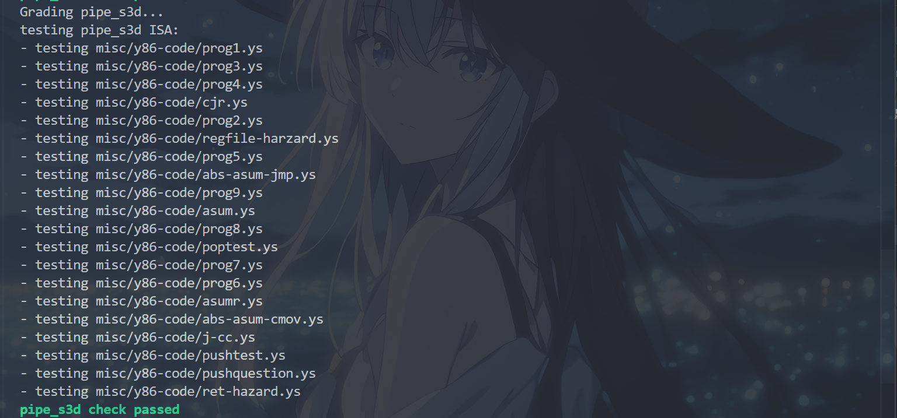

### P4a
根据顶部注释，在``P4``系列中，将执行阶段与其它阶段分开，以减少计算依赖层级。在``P3d``中，优化了硬件逻辑，避免了拆分阶段中可能的结构冒险(原来如此)！

取指阶段，由于增加了访存阶段，而此时取出``RET``指令的跳转地址仍在写回阶段，因此其属于在第四阶段进行传递的变量，应当写成小写：

```rust
// What address should instruction be fetched at?
// We use D.icode because we use the icode in the last cycle to determine the
// next PC.
u64 f_pc = [
    // Call.  Use instruction constant
    // If the previous instruction is CALL, the constant value should be the next PC
    // valC is from Fetch Stage, thus the last cycle
    D.icode == CALL : D.valC;
    // Branch misprediction.  Use incremental PC
    E.icode == JX && !e_cnd : E.valP;
    // Completion of RET instruction.  Use value from stack
    // valM is from DEMW stage, thus the current cycle
    M.icode == RET : m_valM;
    // Default: Use predicted PC
    1 : F.pred_pc;
];
```

在译码阶段，由于增加了访存阶段，因此转发逻辑中的``e_dstM``应改为``m_dstM``，填写代码如下：

```rust
u64 d_valA = [
    d_srcA == e_dstE : e_valE;
    d_srcA == m_dstM : m_valM;
    1: reg_file.valA;
];
u64 d_valB = [
    d_srcB == e_dstE : e_valE;
    d_srcB == m_dstM : m_valM;
    1: reg_file.valB;
];
```

执行阶段，由于``CMOVXX``指令无访存阶段，因此其逻辑与``P3d``相同。

在流水线寄存器控制中，分支错误预测的逻辑由于不受增加的访存阶段影响，与``P3a``相同。而``RET``冒险则因为多出了执行阶段，在五阶段流水线中，只要译码、执行、访存中任一检测到``RET``，即构成``RET``冒险，此处则因为第四阶段包含访存和写回两个阶段，因此需要判断``RET``是否在译码和执行两个阶段中。

同时，在``P4a``中，增加了加载/使用冒险的处理逻辑，即若执行阶段检测到``MRMOVQ``或``POPQ``指令，且构成数据冒险（即执行阶段接下来的访存阶段将要访问的位置的值，会在执行阶段被下一条指令使用），因此需要将其后全部指令，暂停一个周期，并且用一个``bubble``占据执行阶段空位后再进行转发。

根据以上原理，填写出以下代码：

```rust
// If a branch misprediction is detected during the Execute stage, it means that
// the instruction currently in the Decode stage is invalid. Therefore, the next
// cycle’s Execute stage needs to insert a bubble.
bool branch_mispred = E.icode == JX && !e_cnd;

// If a RET instruction is detected in either the Decode or Execute stage, then
// the instruction in the current Fetch stage is invalid. Therefore, a bubble
// needs to be inserted in the Fetch stage for the next cycle.
//
// In fact, when E.icode == RET, the instruction in the current Decode stage is 
// also invalid, but because the D.icode in the previous cycle was RET, at this
// point D.icode == NOP, so there's no need to add a condition for e_bubble.
bool ret_harzard = RET in { D.icode, E.icode };

// This instruction needs to read from a register whose data was loaded from
// memory by the previous instruction, but the previous instruction is still in
// the Execute stage, causing a data hazard.
bool load_use_harzard = E.icode in { MRMOVQ, POPQ } && E.dstM in { d_srcA, d_srcB };
// an equivalent expression:
// bool load_use_harzard = E.dstM != RNONE && E.dstM in { d_srcA, d_srcB };

// If both a branch misprediction and a RET hazard occur at the same time, 
// since the jump instruction is executed before the RET, the RET should not be 
// executed, so no stall is required.
bool f_stall = ret_harzard && !branch_mispred || load_use_harzard;

@set_stage(f, {
    stall: f_stall,
});


bool d_stall = load_use_harzard;

// If both a branch misprediction and a RET hazard occur at the same time,
// since the jump instruction is executed before the RET, the RET should not
// have been executed, so a bubble is not needed.
// 
// Actually, ret_harzard and d_stall cannot be true at the same time.
bool d_bubble = ret_harzard && !branch_mispred && !d_stall;

@set_stage(d, {
    stall: d_stall,
    bubble: d_bubble,
});

bool e_bubble = branch_mispred || load_use_harzard;
```

运行``cargo build``和``./target/debug/grader part-b``指令，得到以下结果，表示完成了``P4a``：


### P4b
根据顶部注释，计算``f_pc``时使用的``e_cnd``依赖路径过长。因此可以将``e_cnd``存储于访存阶段的``M.cnd``存储器中。

首先，取指阶段中，将这一行的``e_cnd``改为``M.cnd``(最先发布的版本没有修改，P4b整整坑了笔者两个小时，这就是抢着做的弊端之一了)。

```rust
    U8_PLACEHOLDER == JX && (!M.cnd) : U64_PLACEHOLDER;
```

取指阶段，由于条件码被存在``M.cnd``，因此计算``f_pc``时，在访存阶段中计算，即；利用刚传入访存阶段的``M.icode``和``M.valP``而非``E.valP/E.icode``，填写代码如下：

```rust
u64 f_pc = [
    // Call.  Use instruction constant
    // If the previous instruction is CALL, the constant value should be the next PC
    // valC is from Fetch Stage, thus the last cycle
    D.icode == CALL : D.valC;
    // Branch misprediction.  Use incremental PC
    M.icode == JX && !M.cnd : M.valP;
    // Completion of RET instruction.  Use value from stack
    // valM is from DEMW stage, thus the current cycle
    M.icode == RET : m_valM;
    // Default: Use predicted PC
    1 : F.pred_pc;
];
```

译码阶段，由于条件码逻辑的改变与转发逻辑无关，因此与``P4a``中相同。

执行阶段，要决定``e_dstE``，因为此时还处于执行阶段，其使用的必定还是``E.icode``与``e_cnd``，因此不受新存储方式影响，与``P4a``中相同。

流水线寄存器控制中，由于``RET``冒险和``加载/使用冒险``不受新存储方式的影响，因此其检测方式不受影响。

在判断分支预测错误是否使用新的存储方式时，根据上文注释以及想到，由于新的存储方式只是为了解决``f_pc``的依赖而产生的，而对当前阶段的检测不应有影响，因此还是跟``P4a``中一致。

根据注释，在判断``f_stall``时，若发生分支预测错误，则下一个周期的``f_pc``一定会选择``M.valP``，因此无须考虑判断分支预测错误。

根据注释，在判断``d_bubble``时，若发生分支预测错误，因为此时位于取指阶段的指令已经不是所需的了，则直接往译码阶段注入一个气泡顶掉它，因此需要考虑有分支预测错误的情况。

根据上述原理，填写代码如下：

```rust
// If a branch misprediction is detected during the Execute stage, it means that
// the instruction currently in the Decode stage is invalid. Therefore, the next
// cycle’s Execute stage needs to insert a bubble.
bool branch_mispred = E.icode == JX && !e_cnd;

// If a RET instruction is detected in either the Decode or Execute stage, then
// the instruction in the current Fetch stage is invalid. Therefore, a bubble
// needs to be inserted in the Fetch stage for the next cycle.
//
// In fact, when E.icode == RET, the instruction in the current Decode stage is 
// also invalid, but because the D.icode in the previous cycle was RET, at this
// point D.icode == NOP, so there's no need to add a condition for e_bubble.
bool ret_harzard = RET in { D.icode, E.icode };

// This instruction needs to read from a register whose data was loaded from
// memory by the previous instruction, but the previous instruction is still in
// the Execute stage, causing a data hazard.
bool load_use_harzard = E.icode in { MRMOVQ, POPQ } && E.dstM in { d_srcA, d_srcB };
// an equivalent expression:
// bool load_use_harzard = E.dstM != RNONE && E.dstM in { d_srcA, d_srcB };

// Unlike in `pipe_s4a`, here we do not need to consider the case of branch 
// misprediction (since in the next cycle, Fetch will always get the `f_pc`
// from `M.valP`).
bool f_stall = load_use_harzard || ret_harzard;

@set_stage(f, {
    stall: f_stall,
});


bool d_stall = load_use_harzard;

// Unlike in `pipe_s4a`, when a branch misprediction occurs, we directly insert
// a bubble, because the instruction in the Fetch stage at that point is invalid.
// Actually, ret_harzard and d_stall cannot be true at the same time.
bool d_bubble = branch_mispred || ret_harzard && !d_stall;

@set_stage(d, {
    stall: d_stall,
    bubble: d_bubble,
});

bool e_bubble = branch_mispred || load_use_harzard;
```

运行``cargo build``和``./target/debug/grader part-b``指令，得到以下结果，表示完成了``P4b``：


### P4c
根据顶部注释，类似于``pipe.std``(注意，这个文件是Part C中的至关重要的一步之一，极大减少工作量)，将``D.valP``输入到解码阶段的``D.valA``中，以消除执行阶段和访存阶段中的``valP``。

与``P4b``中一样，先修改取指阶段中的``e_cnd``为``M.cnd``：

```rust
    U8_PLACEHOLDER == JX && (!M.cnd) : U64_PLACEHOLDER;
```

取指阶段，由于提到将``valP``并入到``valA``中，即此时计算``f_pc``时，应当采用``M.valA``而非``M.valP``，填写代码如下：

```rust
u64 f_pc = [
    // Call.  Use instruction constant
    // If the previous instruction is CALL, the constant value should be the next PC
    // valC is from Fetch Stage, thus the last cycle
    D.icode == CALL : D.valC;
    // Branch misprediction.  Use incremental PC
    M.icode == JX && !M.cnd : M.valA;
    // Completion of RET instruction.  Use value from stack
    // valM is from DEMW stage, thus the current cycle
    M.icode == RET : m_valM;
    // Default: Use predicted PC
    1 : F.pred_pc;
];
```

取指阶段，``d_valA``的更新增加了合并``D.valP``逻辑，但是需要填写的仍为转发逻辑，与其无关，因此与``P4b``中相同。

执行阶段，``CMOVXX``的判断逻辑，不受合并影响，因此与``P4b``中相同。

访存阶段，由于合并了原有的``Call``指令需要的``M.valP``到``M.valA``中，因此``mem_data``，即需要写入内存中的数据，只是``M.valA``，填写代码如下：

```rust
// We've feed D.valP into d_valA. Thus M.valP is not needed.
u64 mem_data = U64_PLACEHOLDER;
```

流水线寄存器控制逻辑上，其不受合并逻辑影响，因此与``P4b``中相同。

运行``cargo build``和``./target/debug/grader part-b``指令，得到以下结果，表示完成了``P4b/Part b``：

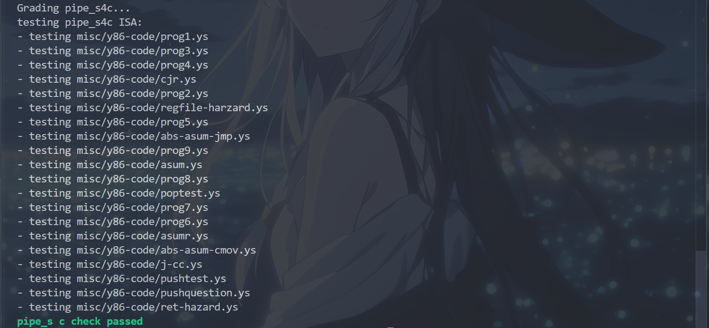

## Part C
根据``writeup``，``Part C``完全基于性能得分，若``ncopy.ys``或``ncopy.rs``未通过正确性测试，将不得分。

首先介绍两个概念，``CPE``和``Arch Cost``。

``CPE``：即每元素周期数，若模拟代码复制 $N$ 个元素需要 $C$ 个周期，则 $CPE=\frac{C}{N}$ 。

``Arch Cost``：``ncopy``架构的关键路径长度。形式上，``CPU``架构的关键路径是时钟元件之间组合逻辑的最长路径。关键路径的长度可以用来衡量CPU的的时钟频率，从而用于估算架构性能。在``Part C``中，关键路径的长度简化为：1加上在架构路径中排列的硬件设备（单元）的最大数量。

定义 $c=cpe+2 \times ac$ ，则得分 $S$ 计算如下：

$$
S=\begin{cases}
0, c>19.0 \\\\
19 \times (19.0-c) 16.0< c \leq 19.0 \\\\
57, 15.0<c \leq 16.0 \\\\
60, c \leq 15.0 \\\\
\end{cases}
$$

### 阅读源码
观察源码``ncopy.c``，得出其功能

```c
word_t ncopy(word_t *src, word_t *dst, word_t len) {
  word_t count = 0;
  word_t val;

  while (len > 0) {
    val = *src++;
    *dst++ = val;
    if (val > 0)
      count++;
    len--;
  }
  return count;
}
```

可以看出，其功能是将``src``处的元素复制到``dst``，并计算其中的正数个数。注意，对于最终测试，将会对所有大小的数组进行测试。

运行``cargo build``和``./target/debug/grader part-c``指令，得到以下输出，这表明了默认``ncopy.rs``和``ncopy.ys``的性能：

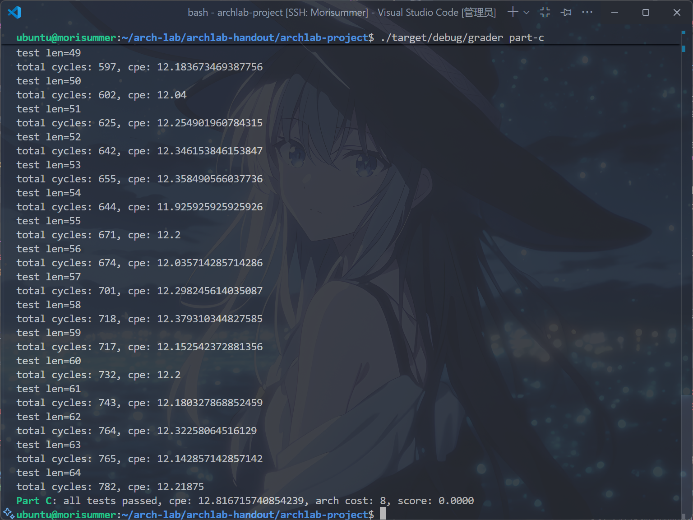

实在是差得离谱，根据上面的分数计算公式，如果将``AC``优化到``3``，那么只需要``CPE``小于等于``9``。而如果``AC``优化到``4``，那么``CPE``需要小于等于``7``，后者是一个很困难的任务！不推荐同学们尝试，真正做到的人数极少，且需要耗费大量时间精力，在期中周之前实在不值。

### 优化Arch Cost
### 更换基础架构
根据``writeup``，有如下描述（已翻译）：

``Part C``中，默认的``HCL``描述文件``ncopy.rs``是``seq_std.rs``的副本。你可将其替换为``其他流水线架构``，再进行针对性修改。

``archlab-project/sim/src/architectures/extra``目录下除``mod.rs``外的所有``Rust``源文件均被视为 ``CPU``架构。

看完这两句，注意到``writeup``中定义``Arch Cost``有如下语句：

例如，``seq_std``的关键路径长度为``8``，``pipe_std``的关键路径长度为``4``。

很容易产生联想，只要照搬``pipe_std``，就能直接把``Arch Cost``优化到``4``，岂不美哉？而且，这个文件名是``std``诶，细看还是五级流水线，信手拈来啊。

将``pipe_std``复制到``ncopy.rs``中，运行``cargo build``和``./target/debug/grader part-c``，得到以下结果：

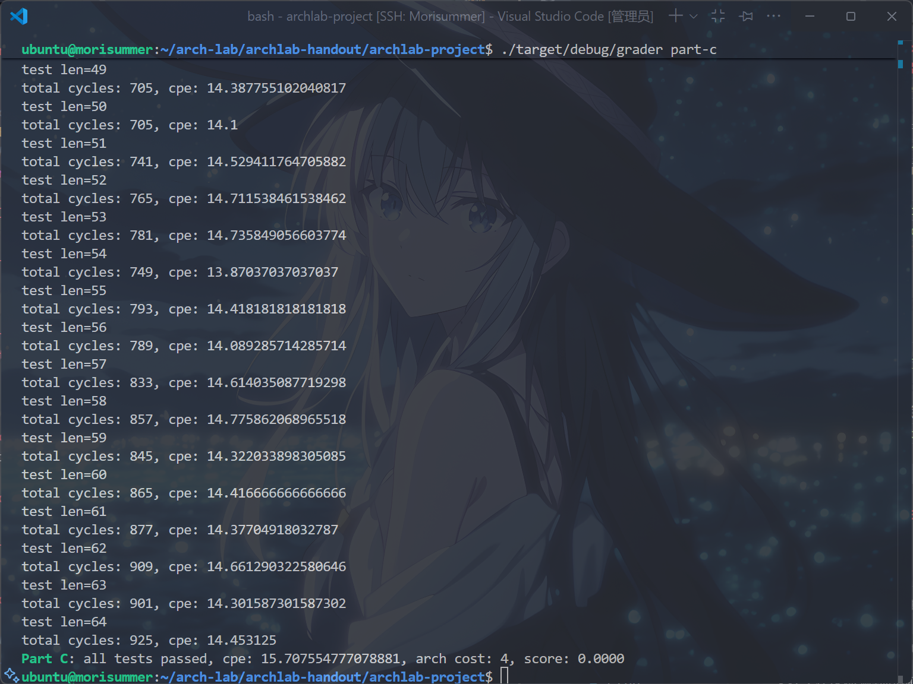

真的把``Arch Cost``优化到4了，哦耶！

但是......还不够，要找出把``Arch Cost``优化到3的方法！

笔者注：亦可使用``Part B``中完成的``pipe_s4c``文件作为初始架构，其``Arch Cost``亦为4，但优化到``3``难度较高，需要手动添加``写回``阶段。

### 增加IOPQ
结合在``Part B``实现的``IOPQ``逻辑，是否可以使用它优化``Y86``代码呢？

答案是肯定的，``irmovq $8, %rdi addq %rdi, %rsi``对比``iaddq $8, %rsi``，既省寄存器又简单，势必能优化程序性能。

仿照``Part B``中的逻辑，在``ncopy.rs``中加上以下逻辑：

```rust
// Is instruction valid?
bool instr_valid = f_icode in { NOP, HALT, CMOVX, IRMOVQ, RMMOVQ,
    MRMOVQ, OPQ, JX, CALL, RET, PUSHQ, POPQ, IOPQ };

// Does fetched instruction require a regid byte?
bool need_regids
    = f_icode in { CMOVX, OPQ, PUSHQ, POPQ, IRMOVQ, RMMOVQ, MRMOVQ, IOPQ };

// Does fetched instruction require a constant word?
bool need_valC = f_icode in { IRMOVQ, RMMOVQ, MRMOVQ, JX, CALL, IOPQ };

// What register should be used as the B source?
u8 d_srcB = [
    D.icode in { OPQ, RMMOVQ, MRMOVQ, IOPQ } : D.rB;
    D.icode in { PUSHQ, POPQ, CALL, RET } : RSP;
    1 : RNONE; // Don't need register
];

// What register should be used as the E destination?
u8 d_dstE = [
    D.icode in { CMOVX, IRMOVQ, OPQ, IOPQ } : D.rB;
    D.icode in { PUSHQ, POPQ, CALL, RET } : RSP;
    1 : RNONE; // Don't write any register
];


// Select input A to ALU
u64 aluA = [
    E.icode in { CMOVX, OPQ } : E.valA;
    E.icode in { IRMOVQ, RMMOVQ, MRMOVQ, IOPQ } : E.valC;
    E.icode in { CALL, PUSHQ } : NEG_8;
    E.icode in { RET, POPQ } : 8;
    1 : 0; // Other instructions don't need ALU
];

// Select input B to ALU
u64 aluB = [
    E.icode in { RMMOVQ, MRMOVQ, OPQ, CALL, PUSHQ, RET, POPQ, IOPQ } : E.valB;
    E.icode in { CMOVX, IRMOVQ } : 0;
    1 : 0; // Other instructions don't need ALU
];

// Set the ALU function
u8 alufun = [
    E.icode in { OPQ, IOPQ } : E.ifun;
    1 : ADD;
];

// Should the condition codes be updated?
bool set_cc = E.icode in { OPQ, IOPQ } &&
    // State changes only during normal operation
    !(m_stat in { Adr, Ins, Hlt }) && !(W.stat in { Adr, Ins, Hlt });
```

加上该逻辑后，无从验证是否提高了``CPE``，因为甚至还没开始编写自己的``ncopy.ys``代码呢！既然没有使用之处就暂时没有办法测试。

### 修改条件码逻辑
首先，运行``cargo build``和``cargo run --bin ysim -- -A ncopy -I``指令，得到以下结果：

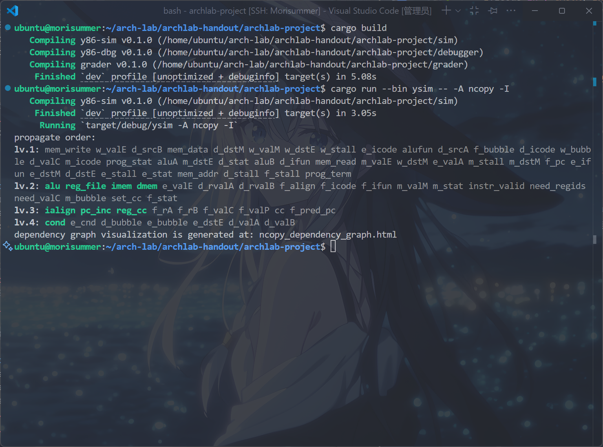

这就是现在``ncopy.rs``的关键路径，观察这条``lv.4``的路径，发现它一共有以上部分组成。

打开程序附带生成的``ncopy_dependency_graph.html``文件，发现以下路径为关键路径：

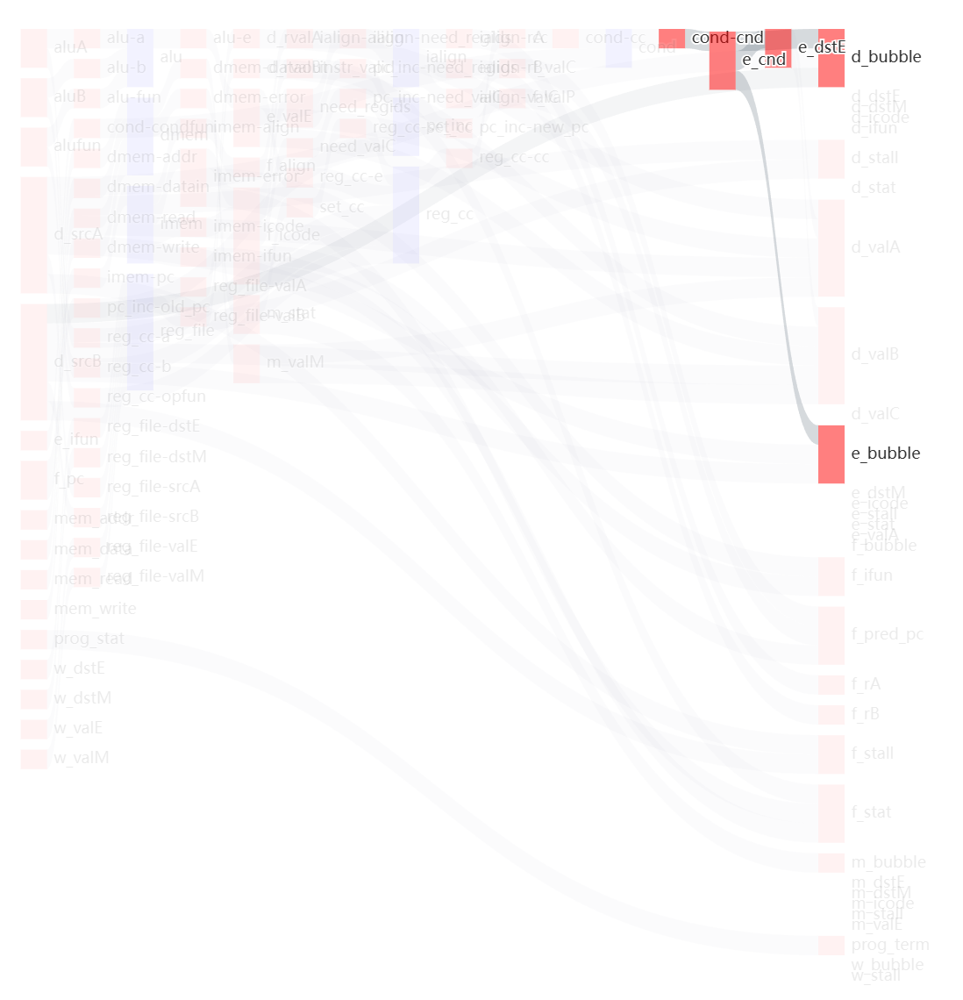

也就是，``cond-cnd、e_cnd、e_dstE、d_bubble``构成了一条导致``Arch Cost``为4的关键路径。

首先考虑，怎么将这条路径断开？

一点小巧思，注意到，修改``cond_cnd``的，只有``OPQ``和``IOPQ``指令，而需要它们计算出``e_cnd``作为判断依据的，只有``JXX``和``CMOVXX``。换句话说，没有一条指令同时修改条件码，又需要条件码进行计算的。

一个显然的思路是，将上一条周期的条件码存在执行阶段的流水线寄存器中，用于通过``cond``单元计算出``e_cnd``。

然后，对于一个``rust``小白来说，这样的事情还是有些困难，此时利用LLM即可以完成以下任务：

在``define_stages``中，为``执行``阶段新声明一个条件码类型的变量``pre_cc``，得到代码如下：

```rust
    ExecuteStage e {
        stat: Stat = Bub, icode: u8 = NOP, ifun: u8 = 0,
        valC: u64 = 0,
        valA: u64 = 0, valB: u64 = 0,
        dstE: u8 = RNONE, dstM: u8 = RNONE,
        srcA: u8 = RNONE, srcB: u8 = RNONE,
        pre_cc: ConditionCode = CC_INIT // name the pre_cc 
    }
```

其次，在译码阶段传递到执行阶段的类定义中，将当前条件码``cc``传给执行阶段的``pre_cc``：

```rust
@set_stage(e, {
    icode: d_icode,
    ifun: d_ifun,
    stat: d_stat,
    valC: d_valC,
    srcA: d_srcA,
    srcB: d_srcB,
    valA: d_valA,
    valB: d_valB,
    dstE: d_dstE,
    dstM: d_dstM,
    pre_cc: cc, // promote the pre_cc in Execute stage
});
```

最后，在执行阶段中，提取出``pre_cc``作为``cond``单元中``e_cnd``的计算依据：

```rust
ConditionCode pre_cc = E.pre_cc; // accept the pre_cc
ConditionCode cc = reg_cc.cc; 

@set_input(cond, {
    cc: pre_cc,
    condfun: e_ifun,
});
```

运行``cargo build``和``./target/debug/grader part-c``指令，得到以下结果：

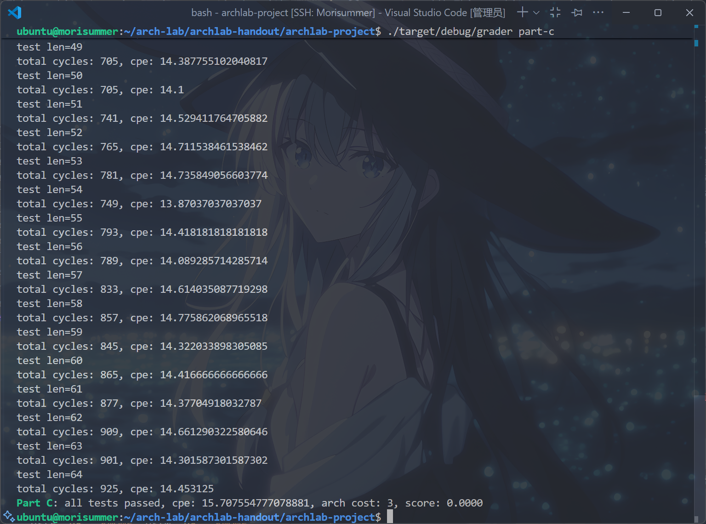

真的成功将``Arch Cost``优化到了``3``！已经度过最难的一关了！

### 优化CPE/循环展开
此处笔者要声明的是，在将``Arch Cost``优化到``3``后，即使是朴素的 $4 \times 1$ 路展开也能通过，在此，笔者介绍自己的``十路展开``做法，以供参考。

为什么是十路展开？其实是~~笔者青睐这个数字~~，因为``Y86``架构共有15个寄存器，而``%rdi,%rsi,%rdx``被用作传入的参数，``%rax``被用作返回值，``%rsp``被用作栈寄存器，因此还剩``10``个空闲寄存器可以用来存储临时变量。

根据``何为循环展开？``中提供的思路，可以写出循环体如下：

```asm
	iaddq $-10, %rdx # compute len minus 10,if less than 10, then jump to stage that deals with remainder.
	jl Less

Loop:
	mrmovq (%rdi), %r8
	mrmovq 8(%rdi), %r9
	mrmovq 16(%rdi), %r10
	mrmovq 24(%rdi), %r11
	mrmovq 32(%rdi), %r12
	mrmovq 40(%rdi), %r13
	mrmovq 48(%rdi), %r14
	mrmovq 56(%rdi), %rcx
	mrmovq 64(%rdi), %rbx
	mrmovq 72(%rdi), %rbp
	rmmovq %r8, (%rsi)
	rmmovq %r9, 8(%rsi)
	rmmovq %r10, 16(%rsi)
	rmmovq %r11, 24(%rsi)
	rmmovq %r12, 32(%rsi)
	rmmovq %r13, 40(%rsi)
	rmmovq %r14, 48(%rsi)
	rmmovq %rcx, 56(%rsi)
	rmmovq %rbx, 64(%rsi)
	rmmovq %rbp, 72(%rsi) # tenfold
	jmp PD8
```

再加上逐个判断是否为正数的部分和跳转到下一个循环的部分，如下：

```asm
PD8:
	andq %r8,%r8
	jle PD9
	iaddq $1, %rax # if the first one is positive.

PD9:
	andq %r9,%r9
	jle PD10
	iaddq $1, %rax # if the second one is positive.

PD10:
	andq %r10,%r10
	jle PD11
	iaddq $1, %rax # if the third one is positive.

PD11:
	andq %r11,%r11
	jle PD12
	iaddq $1, %rax # if the fourth one is positive.

PD12:
	andq %r12,%r12
	jle PD13
	iaddq $1, %rax # if the fifth one is positive.

PD13:
	andq %r13,%r13
	jle PD14
	iaddq $1, %rax # if the sixth one is positive.

PD14:
	andq %r14,%r14
	jle PDCX
	iaddq $1, %rax # if the seventh one is positive.

PDCX:
	andq %rcx,%rcx
	jle PDBX
	iaddq $1, %rax # if the eighth one is positive.

PDBX:
	andq %rbx,%rbx
	jle PDBP
	iaddq $1, %rax # if the ninth one is positive.

PDBP:
	andq %rbp, %rbp
	jle RECOVER
	iaddq $1, %rax # if the tenth one is positive.

RECOVER:
	iaddq $80, %rdi
	iaddq $80, %rsi
	isubq $10, %rdx # forward the stage
	jge Loop # back to loop
```

开头的``jl Less``语句，也就是当剩余长度小于10时，跳转到余数处理部分。

### 余数处理/二分跳转表

众所周知，在``Y86``中，是没有跳转表的，需要手动实现。

那么，联想计概/程设/数算中学的二分方法，在二分答案的时候，总是将一个区间分为两个小区间(或者再加一个值)，而这可以通过``Y86``中的``jl/je/jg``语句实现，从而达到该效果，大幅降低时间复杂度。

在我的代码中，首先判断是否余数为0，若是则跳转到返回部分，然后将``1~9``分为``[1,3]、4、[5,9]``三个区间，由于三个语句的特性，``[1,3]``可以一次分开，而``[5,9]``还需要分为``[5,6]``和``[7,9]``两个区间进一步区分，达到能够让每个元素在最多三次之内跳转到所属位置。

根据以上思路，写出代码如下：

```asm
Less:
	iaddq $10, %rdx
	jle Done # if less than 0, then return.
	isubq $4, %rdx # sort it into 1-3 and 4-9.
	jge Sort4
	iaddq $2, %rdx # sort it to 1,2,and 3.
	jl Back1
	je Back2
	jmp Back3

Sort4:
	je Back4 # if it is equal to 4,then jmp.
	isubq $2, %rdx # sort it to 5-6,and 7-9
	jl Back5
	je Back6

	isubq $2, %rdx # sort it to 7,8, and 9.
	jl Back7
	je Back8
	jmp Back9
```

然后，在``Part A``中，也许会注意到，``Y86``的函数之间也有``Fall Through``的特性，因此考虑倒序处理，让较大的余数被处理后``Fall through``到较小的余数处理部分。

编写这部分代码如下：

```
Back9:
	mrmovq 64(%rdi), %r8
	rmmovq %r8, 64(%rsi)
	andq %r8, %r8 
	jle Back8 # fall through
	iaddq $1, %rax # if the ninth one is positive.

Back8:
	mrmovq 56(%rdi), %r9
	rmmovq %r9, 56(%rsi)
	andq %r9, %r9
	jle Back7 # fall through
	iaddq $1, %rax # if the eighth one is positive.

Back7:
	mrmovq 48(%rdi), %r10
	rmmovq %r10, 48(%rsi)
	andq %r10, %r10
	jle Back6 # fall through
	iaddq $1, %rax # if the seventh one is positive.

Back6:
	mrmovq 40(%rdi), %r11
	rmmovq %r11, 40(%rsi)
	andq %r11, %r11
	jle Back5 # fall through
	iaddq $1, %rax # if the sixth one is positive.

Back5:
	mrmovq 32(%rdi), %r12
	rmmovq %r12, 32(%rsi)
	andq %r12, %r12
	jle Back4 # fall through
	iaddq $1, %rax # if the fifth one is positive.

Back4:
	mrmovq 24(%rdi), %r13
	rmmovq %r13, 24(%rsi)
	andq %r13, %r13
	jle Back3 # fall through
	iaddq $1, %rax # if the fourth one is positive.

Back3:
	mrmovq 16(%rdi),%r14
	rmmovq %r14, 16(%rsi)
	andq %r14, %r14
	jle Back2 # fall through
	iaddq $1, %rax # if the third one is postive.

Back2:
	mrmovq 8(%rdi), %rcx
	rmmovq %rcx, 8(%rsi)
	andq %rcx, %rcx
	jle Back1 # fall through
	iaddq $1, %rax # if the second one is positive.

Back1:
	mrmovq (%rdi), %rbx
	rmmovq %rbx, (%rsi)
	andq %rbx, %rbx
	jle Done # fall through and return 
	iaddq $1, %rax # if the first one is positive.

Done:
	ret
```

汇总以上代码，得出``ncopy.ys``的完整代码如下(注意只需要写循环体内容，无须像``Part A``一样写出栈定义等等)：

```asm
ncopy:
################################################################################
# You can modify this portion
	# Loop header
	iaddq $-10, %rdx # compute len minus 10,if less than 10, then jump to stage that deals with remainder.
	jl Less

Loop:
	mrmovq (%rdi), %r8
	mrmovq 8(%rdi), %r9
	mrmovq 16(%rdi), %r10
	mrmovq 24(%rdi), %r11
	mrmovq 32(%rdi), %r12
	mrmovq 40(%rdi), %r13
	mrmovq 48(%rdi), %r14
	mrmovq 56(%rdi), %rcx
	mrmovq 64(%rdi), %rbx
	mrmovq 72(%rdi), %rbp
	rmmovq %r8, (%rsi)
	rmmovq %r9, 8(%rsi)
	rmmovq %r10, 16(%rsi)
	rmmovq %r11, 24(%rsi)
	rmmovq %r12, 32(%rsi)
	rmmovq %r13, 40(%rsi)
	rmmovq %r14, 48(%rsi)
	rmmovq %rcx, 56(%rsi)
	rmmovq %rbx, 64(%rsi)
	rmmovq %rbp, 72(%rsi) # tenfold
	jmp PD8

PD8:
	andq %r8,%r8
	jle PD9
	iaddq $1, %rax # if the first one is positive.

PD9:
	andq %r9,%r9
	jle PD10
	iaddq $1, %rax # if the second one is positive.

PD10:
	andq %r10,%r10
	jle PD11
	iaddq $1, %rax # if the third one is positive.

PD11:
	andq %r11,%r11
	jle PD12
	iaddq $1, %rax # if the fourth one is positive.

PD12:
	andq %r12,%r12
	jle PD13
	iaddq $1, %rax # if the fifth one is positive.

PD13:
	andq %r13,%r13
	jle PD14
	iaddq $1, %rax # if the sixth one is positive.

PD14:
	andq %r14,%r14
	jle PDCX
	iaddq $1, %rax # if the seventh one is positive.

PDCX:
	andq %rcx,%rcx
	jle PDBX
	iaddq $1, %rax # if the eighth one is positive.

PDBX:
	andq %rbx,%rbx
	jle PDBP
	iaddq $1, %rax # if the ninth one is positive.

PDBP:
	andq %rbp, %rbp
	jle RECOVER
	iaddq $1, %rax # if the tenth one is positive.

RECOVER:
	iaddq $80, %rdi
	iaddq $80, %rsi
	isubq $10, %rdx # forward the stage
	jge Loop # back to loop

Less:
	iaddq $10, %rdx
	jle Done # if less than 0, then return.
	isubq $4, %rdx # sort it into 1-3 and 4-9.
	jge Sort4
	iaddq $2, %rdx # sort it to 1,2,and 3.
	jl Back1
	je Back2
	jmp Back3

Sort4:
	je Back4 # if it is equal to 4,then jmp.
	isubq $2, %rdx # sort it to 5-6,and 7-9
	jl Back5
	je Back6

	isubq $2, %rdx # sort it to 7,8, and 9.
	jl Back7
	je Back8
	jmp Back9

Back9:
	mrmovq 64(%rdi), %r8
	rmmovq %r8, 64(%rsi)
	andq %r8, %r8 
	jle Back8 # fall through
	iaddq $1, %rax # if the ninth one is positive.

Back8:
	mrmovq 56(%rdi), %r9
	rmmovq %r9, 56(%rsi)
	andq %r9, %r9
	jle Back7 # fall through
	iaddq $1, %rax # if the eighth one is positive.

Back7:
	mrmovq 48(%rdi), %r10
	rmmovq %r10, 48(%rsi)
	andq %r10, %r10
	jle Back6 # fall through
	iaddq $1, %rax # if the seventh one is positive.

Back6:
	mrmovq 40(%rdi), %r11
	rmmovq %r11, 40(%rsi)
	andq %r11, %r11
	jle Back5 # fall through
	iaddq $1, %rax # if the sixth one is positive.

Back5:
	mrmovq 32(%rdi), %r12
	rmmovq %r12, 32(%rsi)
	andq %r12, %r12
	jle Back4 # fall through
	iaddq $1, %rax # if the fifth one is positive.

Back4:
	mrmovq 24(%rdi), %r13
	rmmovq %r13, 24(%rsi)
	andq %r13, %r13
	jle Back3 # fall through
	iaddq $1, %rax # if the fourth one is positive.

Back3:
	mrmovq 16(%rdi),%r14
	rmmovq %r14, 16(%rsi)
	andq %r14, %r14
	jle Back2 # fall through
	iaddq $1, %rax # if the third one is postive.

Back2:
	mrmovq 8(%rdi), %rcx
	rmmovq %rcx, 8(%rsi)
	andq %rcx, %rcx
	jle Back1 # fall through
	iaddq $1, %rax # if the second one is positive.

Back1:
	mrmovq (%rdi), %rbx
	rmmovq %rbx, (%rsi)
	andq %rbx, %rbx
	jle Done # fall through and return 
	iaddq $1, %rax # if the first one is positive.

Done:
	ret
```

运行``cargo build``和``./target/debug/grader patr-c``指令，得到以下结果，表示完成了``Part C``：

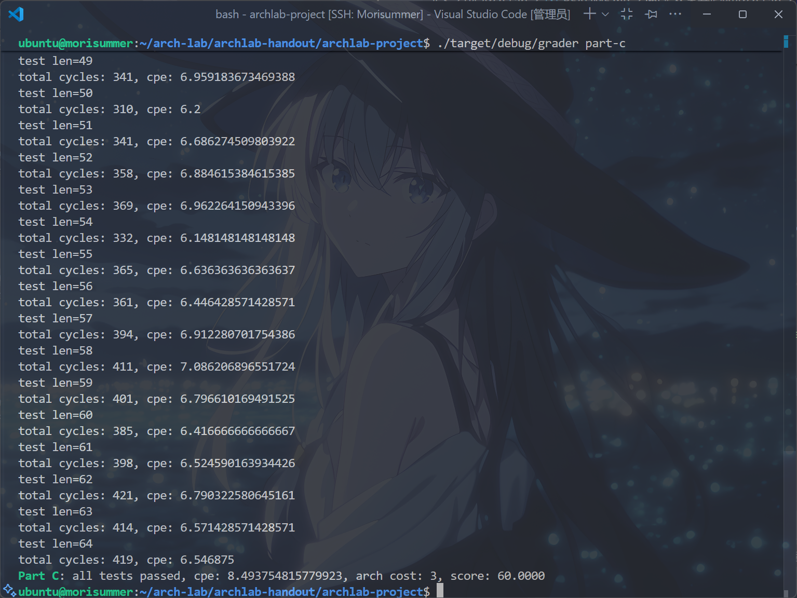

当然，进一步优化，还有``戳气泡``(见下方参考资料)以及``打表``等方法（打表不建议使用），但是已经拿到满分了，就不想卷了。

运行``make handin``指令，生成``archlab-handin.tar``压缩包，上传到``AutoLab``即可，不要忘了在该写的地方写上代码注释~

于是，完成了ICS的第四个Lab，Congratulations!

## 参考资料

[Arthals-更适合北大宝宝体质的Arch Lab踩坑记](https://arthals.ink/blog/arch-lab)