# 从零开始的Bomb Lab

> [!CAUTION]
> 
> **本笔记仅供参考，请勿抄袭。**

## 声明
本笔记的写作初衷在于，笔者在做Bomb Lab的时候受到Arthals学长很大启发，同时25Fall的计算机系统导论课程改制增加了10分的Lab测试（虽然往年的期中期末中也会有一两道Lab相关选择题，但分值不大）。故将心路历程写成此笔记，以便复习，并供后续选课同学参考。

## Bomb Lab简要介绍
Bomb Lab是《计算机系统导论》课程的第2个Lab，对应教材第三章《程序的机器级表示》。该Lab旨在加强同学们阅读汇编代码的能力，以及训练同学们使用GDB调试工具。

在Bomb Lab中，需要拆除6个对应的二进制炸弹(即phase 1 $\sim$ phase 6)，每个炸弹都有一个密码，通过输出正确的密码来拆除炸弹。如果输入了错误的指令，炸弹就会爆炸，并向AutoLab网站发出信号，每次爆炸扣除本Lab的0.5分，扣除分数向下取整，上限为20分。也就是说，~~若只爆炸一次，仍然能得到满分的成绩~~。这个Lab的难度大致为中，笔者的耗时大概为8小时左右，而``Secret Phase``的耗时大概为 $8 \sim 10$ 小时。

值得一提的是，在25秋的Bomb Lab中，存在Secret Phase，完成这个Phase可以得到5分的加分(分数上限仍为100分)。笔者要在此声明，此Phase每位同学分到的类型可能不同(身边统计学证明)，网络辅助资料较少，以及它的难度远超前面的phase，且爆炸仍然扣分，因此只推荐学有余力或者想补救分数的同学尝试。

笔者于``2025.12.14``完成了``Secret Phase``，更新一下思路。

整个Lab的思路是，分析源码和二进制炸弹反汇编得出的汇编代码，并使用``gdb``工具进行调试以防止炸弹爆炸，从而得出正确答案。

## 在动手之前
### GDB常用指令
看着CSAPP上3.10.2小节上一整页的GDB调试命令，可能会感到一头雾水，笔者在这里列出本Lab中常用的GDB命令：

| 指令        | 描述                                             | 使用方法                       |
| ----------- | ------------------------------------------------ | ------------------------------ |
| r           | 开始执行程序，直到下一个断点或程序结束           | r                              |
| c           | 从当前位置继续执行程序，直到下一个断点或程序结束 | c                              |
| b           | 在指定位置设置断点，运行时停止在该位置执行前     | b *(phase_1+0x1d)  / b phase_1 |
| ni          | 执行下一条指令，但不进入函数内部                 | ni                             |
| si          | 执行下一条指令，如果是函数调用则进入函数         | si                             |
| x           | 打印内存中的值                                   | 见下文                         |
| p           | 打印变量的值                                     | 见下文                         |
| layout asm  | 显示汇编代码视图                                 | layout asm                     |
| layout regs | 显示当前寄存器状态和它们的值                     | layout regs                    |
| q           | 退出GDB调试器                                    | q                              |
| info address x | 显示变量x的地址                              |  info address x                |
| command id | 对标号为id的断点变成                              | commands id                    |
| j *(xx+num) | 跳转到函数xx开头偏移num的位置，支持十进制和十六进制，跳转后立即开始执行 | j *(xx+num)                   |
| i b         | 打印所有断点信息                                 | i b/info breakpoints          |

有关``p``和``x``两条指令，几个常用示例如下：

```
p $rax  # 打印寄存器 rax 的值
p $rsp  # 打印栈指针的值
p/x $rsp  # 打印栈指针的值，以十六进制显示
p/d $rsp  # 打印栈指针的值，以十进制显示

x/2x $rsp  # 以十六进制格式查看栈指针 %rsp 指向的内存位置 M[%rsp] 开始的两个单位。
x/2d $rsp # 以十进制格式查看栈指针 %rsp 指向的内存位置 M[%rsp] 开始的两个单位。
x/2c $rsp # 以字符格式查看栈指针 %rsp 指向的内存位置 M[%rsp] 开始的两个单位。
x/s $rsp # 把栈指针指向的内存位置 M[%rsp] 当作 C 风格字符串来查看。

x/b $rsp # 检查栈指针指向的内存位置 M[%rsp] 开始的 1 字节。
x/h $rsp # 检查栈指针指向的内存位置 M[%rsp] 开始的 2 字节（半字）。
x/w $rsp # 检查栈指针指向的内存位置 M[%rsp] 开始的 4 字节（字）。
x/g $rsp # 检查栈指针指向的内存位置 M[%rsp] 开始的 8 字节（双字）。

info registers  # 打印所有寄存器的值
info breakpoints  # 打印所有断点的信息

delete breakpoints 1  # 删除第一个断点，可以简写为 d 1
```

这些命令在``/``后面的后缀(如``2x``、``2d``、``s``、``g``、``20c``)指定了查看内存的方式和数量，其规则如下：
- 第一个数字指定要查看的单位数量。
- 第二个字母指定单位类型和显示格式，其中：
  - ``c``/``d``/``x``分别代表字符/十进制/十六进制格式显示内存内容。
  - ``s``代表以字符串格式显示内存内容。
  - ``b``/``h``/``w``/``g``分别代表以1/2/4/8字节为单位显示内存内容。
  - 当使用``x/b``、``x/h``、``x/w``、``x/g``时，单位会保留对应改变，直到你再次使用这些命令。

在这个Lab和接下来的Attack Lab中，打开终端，操作通常是

```
gdb bomb
b phase_x // 这条如果配置了.gdbinit文件就无须再输入
layout asm
layout regs
```

### 一些美化
由于该Lab以及第三个Lab(即``Attack Lab``)都需要阅读大量汇编代码，因此可以下载VsCode上的``x86 and x86_64 Assembly``拓展进行代码高亮，以获得更好的阅读体验。

### 安全化炸弹
强烈推荐想在Lab上做满分的同学阅读以下段落，而想挑战自己的同学就不推荐了。

事实上，安全化炸弹似乎有很多种方法，笔者在网络资料搜索以及浏览Arthals学长的博文时接触到至少三种，大致如下：
- 通过断网，或者使用``-q``命令，使炸弹在本地运行，而无法向远程服务器传输爆炸信号。
- 找到相关代码，再利用``hexedit``工具修改二进制码，替换条件跳转指令使用``nop``无义指令替换危险指令。
- 找到相关代码，再利用``gdb``工具为危险函数或者危险指令设置断点，并对于断点处进行编程，跳过危险指令或者修改寄存器的值来控制条件跳转，使得炸弹不会爆炸。

关于第一种方法，笔者要在此做几点说明：
- 如果使用断网方法，~~如果是使用CLAB的云服务器的同学，那就别想了~~。使用WSL或者虚拟机/双系统的同学，可能可以实现。
- 根据笔者查询的结果，似乎是能在CMU的原生Lab上实现，但是不保证PKU的魔改Lab不会在重新联网后向AutoLab网站发送爆炸信号。

相对地，第二种方法比第三种难度的操作难度大得多(其实是笔者太菜不会)，所以，何乐而不为呢？

于是，笔者在此仅介绍第三种方法。

第三种方法的原理是，在``gdb``中可以配置``.gdbinit``文件来设置``gdb``进入时的一些默认配置，这些指令每次运行时无需手动输入。

下面开始配置``.gdbinit``文件，前提是已经解压了从AutoLab上下载的Bomb压缩包。

在终端中运行以下代码：

```
cd ~\bomb xx // 注意换成你的bomb所在地址
touch .gdbinit // 创建当前目录下的.gdbinit文件
mkdir -p ~/.config/gdb // 创建 ./config/gdb 文件夹
echo "set auto-load safe-path" > ~/.config/gdb/gdbinit // 允许gdb预加载根目录下所有的文件
```

为了安全化炸弹，知己知彼，得先了解炸弹的爆炸逻辑。
以``phase_1``为例，如下是笔者炸弹中的汇编代码：

```asm
0000000000001784 <phase_1>:
    1784:	f3 0f 1e fa          	endbr64
    1788:	48 83 ec 08          	sub    $0x8,%rsp
    178c:	48 8d 35 25 2a 00 00 	lea    0x2a25(%rip),%rsi        # 41b8 <_IO_stdin_used+0x1b8>
    1793:	e8 6d 05 00 00       	call   1d05 <strings_not_equal>
    1798:	85 c0                	test   %eax,%eax
    179a:	75 05                	jne    17a1 <phase_1+0x1d>
    179c:	48 83 c4 08          	add    $0x8,%rsp
    17a0:	c3                   	ret
    17a1:	e8 74 08 00 00       	call   201a <explode_bomb>
    17a6:	eb f4                	jmp    179c <phase_1+0x18>
```
可以大致发现，它在调用了``strings_not_equal``函数后，测试返回值``%eax``，若其为真则不进行条件跳转，若为假则跳转到``17a1``处调用``explode_bomb``函数。

再查询``explode_bomb``函数的源码：

```asm
000000000000201a <explode_bomb>:
    201a:	f3 0f 1e fa          	endbr64
    201e:	50                   	push   %rax
    201f:	58                   	pop    %rax
    2020:	48 83 ec 18          	sub    $0x18,%rsp
    2024:	64 48 8b 04 25 28 00 	mov    %fs:0x28,%rax
    202b:	00 00 
    202d:	48 89 44 24 08       	mov    %rax,0x8(%rsp)
    2032:	31 c0                	xor    %eax,%eax
    2034:	48 8d 3d b9 25 00 00 	lea    0x25b9(%rip),%rdi        # 45f4 <transition_table+0x314>
    203b:	e8 30 f2 ff ff       	call   1270 <puts@plt>
    2040:	48 8d 3d b6 25 00 00 	lea    0x25b6(%rip),%rdi        # 45fd <transition_table+0x31d>
    2047:	e8 24 f2 ff ff       	call   1270 <puts@plt>
    204c:	c7 44 24 04 00 00 00 	movl   $0x0,0x4(%rsp)
    2053:	00 
    2054:	48 8d 74 24 04       	lea    0x4(%rsp),%rsi
    2059:	bf 00 00 00 00       	mov    $0x0,%edi
    205e:	e8 55 fe ff ff       	call   1eb8 <send_msg>
    2063:	83 7c 24 04 01       	cmpl   $0x1,0x4(%rsp)
    2068:	74 20                	je     208a <explode_bomb+0x70>
    206a:	48 8d 35 3f 23 00 00 	lea    0x233f(%rip),%rsi        # 43b0 <transition_table+0xd0>
    2071:	bf 01 00 00 00       	mov    $0x1,%edi
    2076:	b8 00 00 00 00       	mov    $0x0,%eax
    207b:	e8 e0 f2 ff ff       	call   1360 <__printf_chk@plt>
    2080:	bf 08 00 00 00       	mov    $0x8,%edi
    2085:	e8 06 f3 ff ff       	call   1390 <exit@plt>
    208a:	48 8d 3d 67 23 00 00 	lea    0x2367(%rip),%rdi        # 43f8 <transition_table+0x118>
    2091:	e8 da f1 ff ff       	call   1270 <puts@plt>
    2096:	bf 08 00 00 00       	mov    $0x8,%edi
    209b:	e8 f0 f2 ff ff       	call   1390 <exit@plt>
```

可以观察到，一直值得注意的点是，它会调用``send_msg``函数，而这个函数因为源码较长就不在下面放出了。顾名思义，它是向远程评分系统传输信号的函数。

于是，只需在``explode_bomb``函数中设置断点，直接跳转使它不触发``send_msg``函数，并且能成功调用``puts``函数，这样能在不向远程传输爆炸信号的情况下打印出爆炸信息。

然后，打开``.gdbinit``文件，输入以下内容：

```
# ./gdbinit
# 设置默认文件输入，这样我们不必每次手动输入答案
set args psol.txt

# 可以为 explode_bomb 函数设置断点，这样我们就可以在爆炸之前打断程序的执行
# 但是由于其会打印输出信息，所以后面有更具有针对性的设置，跳过信息发送函数
# 所以这里就不再设置断点了
# b explode_bomb

# 为各个 phase 函数设置断点，用以观察其执行过程
# 如果你做完了某个 phase，可以将其注释掉，这样就不会再进入该 phase 了
b phase_1
b phase_2
b phase_3
b phase_4
b phase_5
b phase_6

# 以下代码务必保留!!!

# 为 explode_bomb 中触发 send_msg 函数的地方设置断点
b *(explode_bomb + 0x??)
# 为此断点编程
command
# 直接跳到 exit 退出函数处，跳过发送信息流程
j *(explode_bomb + 0x??)
end

# 炸弹已经安全化，可以放心地拆弹了，开始运行程序
r
```

由于每位同学的炸弹都不一样，因此知晓如何设置上面代码中的``xx``偏移量，对于每位同学来说都是十分重要的。

下面以笔者的炸弹代码为例：

```asm
000000000000201a <explode_bomb>:
    201a:	f3 0f 1e fa          	endbr64
    201e:	50                   	push   %rax
    201f:	58                   	pop    %rax
    2020:	48 83 ec 18          	sub    $0x18,%rsp
    2024:	64 48 8b 04 25 28 00 	mov    %fs:0x28,%rax
    202b:	00 00 
    202d:	48 89 44 24 08       	mov    %rax,0x8(%rsp)
    2032:	31 c0                	xor    %eax,%eax
    2034:	48 8d 3d b9 25 00 00 	lea    0x25b9(%rip),%rdi        # 45f4 <transition_table+0x314>
    203b:	e8 30 f2 ff ff       	call   1270 <puts@plt>
    2040:	48 8d 3d b6 25 00 00 	lea    0x25b6(%rip),%rdi        # 45fd <transition_table+0x31d>
    2047:	e8 24 f2 ff ff       	call   1270 <puts@plt>
    204c:	c7 44 24 04 00 00 00 	movl   $0x0,0x4(%rsp)
    2053:	00 
    2054:	48 8d 74 24 04       	lea    0x4(%rsp),%rsi
    2059:	bf 00 00 00 00       	mov    $0x0,%edi
    205e:	e8 55 fe ff ff       	call   1eb8 <send_msg>
    2063:	83 7c 24 04 01       	cmpl   $0x1,0x4(%rsp)
    2068:	74 20                	je     208a <explode_bomb+0x70>
    206a:	48 8d 35 3f 23 00 00 	lea    0x233f(%rip),%rsi        # 43b0 <transition_table+0xd0>
    2071:	bf 01 00 00 00       	mov    $0x1,%edi
    2076:	b8 00 00 00 00       	mov    $0x0,%eax
    207b:	e8 e0 f2 ff ff       	call   1360 <__printf_chk@plt>
    2080:	bf 08 00 00 00       	mov    $0x8,%edi
    2085:	e8 06 f3 ff ff       	call   1390 <exit@plt>
    208a:	48 8d 3d 67 23 00 00 	lea    0x2367(%rip),%rdi        # 43f8 <transition_table+0x118>
    2091:	e8 da f1 ff ff       	call   1270 <puts@plt>
    2096:	bf 08 00 00 00       	mov    $0x8,%edi
    209b:	e8 f0 f2 ff ff       	call   1390 <exit@plt>
```

``explode_bomb``函数的起始点是``0x201a``，而``call <send_msg>``指令的位置是``0x205e``，因此它的偏移量是``0x44``，在这里设置断点。

然后，执行跳转操作，使函数强制跳转到``0x209b``处，即``call <exit>``指令，强制退出。它相对于``explode_bomb``的偏移量为``0x81``。

于是，得到了笔者炸弹代码的安全化处理代码，即

```bash
b *(explode_bomb+0x44)
command
j *(explode_bomb+0x81)
end
r
```

之后，就可以在本地安全运行代码了。

值得一提的是，如果需要在DDL后再运行炸弹文件，比如笔者撰写这篇笔记时就在期中后，此时需要在``.gdbinit``中加上以上代码以跳过校验函数，否则会报错。

```
# 为校验函数设置断点
b phase_defused
# 为此断点编程
command
# 直接跳到返回语句处，跳过校验流程
jump *(phase_defused + 0x2A)
end
```

但是，对于已经过DDL的``Secret Phase``，就不能使用这种方法了，具体见下文``Secret Phase/越过判定与信息传送函数``一节。

### 相关课本知识
首先，此Lab对于汇编代码的阅读要求较高(甚至高于Attack Lab)，如果对课本较不熟悉，以下为大概需要了解的点：
- ``%rdi,%rsi,%rdx,%rcx``分别为函数前四个参数,``%rax``为返回值。
- ``%rsp,%rbp``相关，了解栈帧。
- ``mov,lea``以及相关常用计算指令的用法。
- ``cmpq,testq``以及条件跳转、条件传送以及switch语句，循环的用法。

## 开始动手！
首先，阅读``bomb.c``文件，以获取炸弹的基本信息。

这里琴酒先生(原生Lab为邪恶博士，感谢Arthals学长给柯南粉们的修改)认为一个Phase的炸弹很容易被拆除，于是发来了有六个Phase的炸弹。

在其中，有类似以下代码：

```c
/* Hmm...  Six phases must be more secure than one phase! */
    input = read_line();             /* Get input                   */
    phase_1(input);                  /* Run the phase               */
    phase_defused(fp);                 /* Drat!  They figured it out!
```

这说明每次我们输入的字符串``input``会被作为传进的参数，拆弹的关键就在于找到正确的字符串。

于是，得到了拆弹的基本思路。

然后，运行``objdump -d bomb > bomb.s``指令，对二进制炸弹进行反汇编得到汇编代码``bomb.s``。

在介绍每个Phase的思路之前，笔者需要提醒你的是，bomb.s只是反汇编出的静态代码，它的指令地址可能会根据每次二进制炸弹bomb的运行变化，因此不要使用绝对地址。同时，正因为它不是运行主体，在它上面写注释是完全可行的。(笔者的惨痛教训：每次都截图下来在平板上手划，使得耗时大大增加)。

### Phase 1
先阅读``phase_1``的源码：

```asm
0000000000001784 <phase_1>:
    1784:	f3 0f 1e fa          	endbr64 # 此Lab中无关，用于防止ROP攻击(下个Lab的重点)
    1788:	48 83 ec 08          	sub    $0x8,%rsp # %rsp分配8字节栈空间
    178c:	48 8d 35 25 2a 00 00 	lea    0x2a25(%rip),%rsi        # 41b8 <_IO_stdin_used+0x1b8> # 将内存中的某个字符串赋值给%rsi，第二个参数
    1793:	e8 6d 05 00 00       	call   1d05 <strings_not_equal> # 调用函数，判断是否为相等的字符串
    1798:	85 c0                	test   %eax,%eax # 检验返回值
    179a:	75 05                	jne    17a1 <phase_1+0x1d> # 若为假，跳转至爆炸
    179c:	48 83 c4 08          	add    $0x8,%rsp # 释放内存
    17a0:	c3                   	ret # 返回
    17a1:	e8 74 08 00 00       	call   201a <explode_bomb> # 爆炸
    17a6:	eb f4                	jmp    179c <phase_1+0x18>
```

了解了基本逻辑后，得到基本思路：在``call <string_not_equal>``之前设置断点，得到``%rsi``的具体值，即为答案。

首先，打开``psol.txt``文件，随便输入一行:

```
I love elaina.
```

然后运行以下指令：

```
gdb bomb
b *(phase_1+15)
layout asm
layout regs
c
x/s $rsi
```

得到了以下输出：

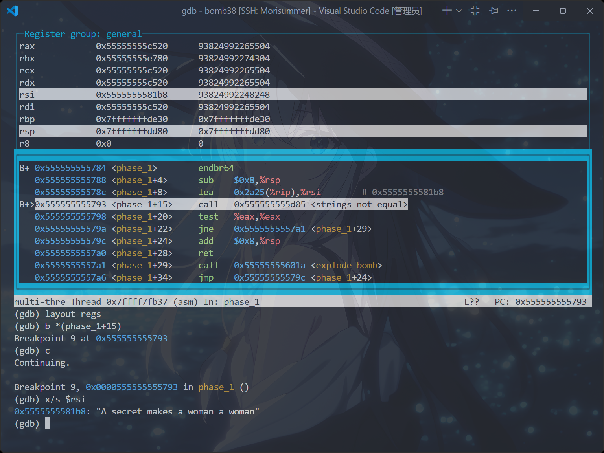

得到答案为``A secret makes a woman a woman``。

~~感谢Arthals学长的修改，原句为酒厂成员贝尔摩德的著名语句~~

把这句话写到``psol.txt``的第一行，再次打开终端，运行以下指令：

```
gdb bomb
layout asm
layout regs
c
```

得到以下输出，表示已经完成了``phase 1``：

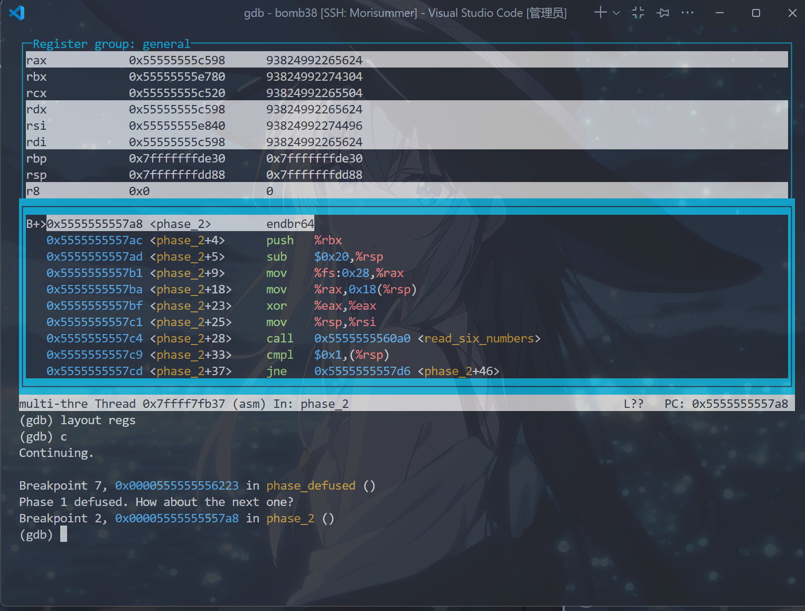

### Phase 2
注释掉``b phase_1``，便于调试。

先阅读``Phase_2``的源码：

```asm
00000000000017a8 <phase_2>:
    17a8:	f3 0f 1e fa          	endbr64 # 防ROP攻击
    17ac:	53                   	push   %rbx # %rbx进栈
    17ad:	48 83 ec 20          	sub    $0x20,%rsp # 分配32个字节空间
    17b1:	64 48 8b 04 25 28 00 	mov    %fs:0x28,%rax # 取出金丝雀值
    17b8:	00 00 
    17ba:	48 89 44 24 18       	mov    %rax,0x18(%rsp) # %rsp+24存放金丝雀值
    17bf:	31 c0                	xor    %eax,%eax # %eax置零
    17c1:	48 89 e6             	mov    %rsp,%rsi # %rsi=%rsp，当做输入地址传参
    17c4:	e8 d7 08 00 00       	call   20a0 <read_six_numbers> # 调用``read_six_numbers``，输入六个数 
    17c9:	83 3c 24 01          	cmpl   $0x1,(%rsp) # 若(%rsp)!=1,跳转至爆炸
    17cd:	75 07                	jne    17d6 <phase_2+0x2e>
    17cf:	bb 01 00 00 00       	mov    $0x1,%ebx # %ebx=1
    17d4:	eb 0a                	jmp    17e0 <phase_2+0x38> # 跳转至(1)
    17d6:	e8 3f 08 00 00       	call   201a <explode_bomb> # 爆炸
    17db:	eb f2                	jmp    17cf <phase_2+0x27> 
    17dd:	83 c3 01             	add    $0x1,%ebx # %ebx加1
    17e0:	83 fb 05             	cmp    $0x5,%ebx (1) # 若%ebx大于5，跳转到0x17fe处
    17e3:	7f 19                	jg     17fe <phase_2+0x56>
    17e5:	48 63 d3             	movslq %ebx,%rdx # %rdx=%ebx
    17e8:	8d 43 ff             	lea    -0x1(%rbx),%eax 
    17eb:	48 98                	cltq # %eax自身拓展
    17ed:	8b 04 84             	mov    (%rsp,%rax,4),%eax # 取出第i个整数
    17f0:	01 c0                	add    %eax,%eax # %eax=2*%eax
    17f2:	39 04 94             	cmp    %eax,(%rsp,%rdx,4) 若%eax!=第(i+1)个整数，跳转到爆炸
    17f5:	74 e6                	je     17dd <phase_2+0x35>
    17f7:	e8 1e 08 00 00       	call   201a <explode_bomb>
    17fc:	eb df                	jmp    17dd <phase_2+0x35> # 循环回跳
    17fe:	48 8b 44 24 18       	mov    0x18(%rsp),%rax # 被跳转出 
    1803:	64 48 2b 04 25 28 00 	sub    %fs:0x28,%rax # 判断是否金丝雀值被破坏
    180a:	00 00 
    180c:	75 06                	jne    1814 <phase_2+0x6c>
    180e:	48 83 c4 20          	add    $0x20,%rsp # 恢复空间
    1812:	5b                   	pop    %rbx # %rbx原值退出
    1813:	c3                   	ret # 返回
    1814:	e8 87 fa ff ff       	call   12a0 <__stack_chk_fail@plt>
```

于是，基本弄懂了这个函数的逻辑，用C代码写来就是：

```c
int a[6];
if(a[0] != 1) bomb!
for(int i = 1;i <= 5;i++){
    if(a[i] != 2 * a[i - 1]) bomb!
}
```

其实``%rsp+24``存放金丝雀值已经很清楚了，输入六个``int``类型变量，然后从栈顶开始往高地址存储，刚好是24个字节。
以防万一，阅读``read_six_numbers``函数，看看这六个数字的存储顺序。

```asm
00000000000020a0 <read_six_numbers>:
    20a0:	f3 0f 1e fa          	endbr64 # 防ROP攻击
    20a4:	48 83 ec 08          	sub    $0x8,%rsp # 栈顶分配8字节空间
    20a8:	48 89 f2             	mov    %rsi,%rdx # %rdx=%rsi(输入地址)
    20ab:	48 8d 4e 04          	lea    0x4(%rsi),%rcx # %rcx=%rsi+4
    20af:	48 8d 46 14          	lea    0x14(%rsi),%rax # %rax=%rsi+20
    20b3:	50                   	push   %rax # %rax进栈
    20b4:	48 8d 46 10          	lea    0x10(%rsi),%rax # %rax=%rsi+16
    20b8:	50                   	push   %rax # %rax进栈
    20b9:	4c 8d 4e 0c          	lea    0xc(%rsi),%r9 # %r9=%rsi+12
    20bd:	4c 8d 46 08          	lea    0x8(%rsi),%r8 # %r8=%rsi+8
    20c1:	48 8d 35 4c 25 00 00 	lea    0x254c(%rip),%rsi        # 4614 <transition_table+0x334> # %rsi=当前指令指针地址
    20c8:	b8 00 00 00 00       	mov    $0x0,%eax # %rax=0
    20cd:	e8 6e f2 ff ff       	call   1340 <__isoc99_sscanf@plt> # 调用sscanf函数
    20d2:	48 83 c4 10          	add    $0x10,%rsp # 栈空间恢复
    20d6:	83 f8 05             	cmp    $0x5,%eax # 若%eax<=5,即输入数字数目小于等于5，跳转到爆炸
    20d9:	7e 05                	jle    20e0 <read_six_numbers+0x40> 
    20db:	48 83 c4 08          	add    $0x8,%rsp # 恢复栈空间
    20df:	c3                   	ret # 返回
    20e0:	e8 35 ff ff ff       	call   201a <explode_bomb>
```

再看一下``sccanf``函数的签名：

```
int sscanf(const char *str, const char *format, ...);
```

- ``str``：要读取的字符串
- ``format``：指定输入格式控制
- ``...``：可变数量的额外参数
- 返回值：读入的参数个数

观察到前六个参数对应的寄存器名字都在``read_six_numbers``中出现了，同时它们在栈中是向上存储的。

结合前面提出的思路，得到答案：

``1 2 4 8 16 32``

把它写到``psol.txt``的第二行，打开终端，运行以下指令：

```
gdb bomb
layout asm
layout regs
c
```

得到以下输出，表示已经完成了``phase 2``：

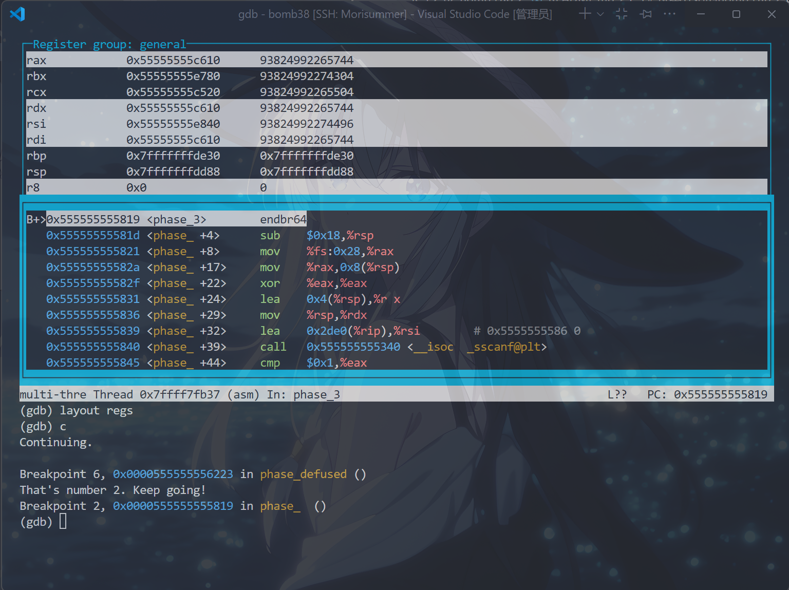

### Phase 3
注释掉``b phase_2``，便于调试。

先阅读``Phase_3``的源码：

```asm
0000000000001819 <phase_3>:
    1819:	f3 0f 1e fa          	endbr64 # 防ROP攻击
    181d:	48 83 ec 18          	sub    $0x18,%rsp # %rsp分配24字节空间
    1821:	64 48 8b 04 25 28 00 	mov    %fs:0x28,%rax # %rax=金丝雀值
    1828:	00 00 
    182a:	48 89 44 24 08       	mov    %rax,0x8(%rsp) # 金丝雀值存放到%rsp+8处
    182f:	31 c0                	xor    %eax,%eax # %eax置零
    1831:	48 8d 4c 24 04       	lea    0x4(%rsp),%rcx # %rcx=%rsp+4
    1836:	48 89 e2             	mov    %rsp,%rdx # %rdx=%rsp
    1839:	48 8d 35 e0 2d 00 00 	lea    0x2de0(%rip),%rsi        # 4620 <transition_table+0x340> # 将内存中的某个值赋给%rsi，第二个参数
    1840:	e8 fb fa ff ff       	call   1340 <__isoc99_sscanf@plt> # 输入
    1845:	83 f8 01             	cmp    $0x1,%eax # 若%eax<=1,跳转爆炸
    1848:	7e 1e                	jle    1868 <phase_3+0x4f>
    184a:	83 3c 24 07          	cmpl   $0x7,(%rsp) # 若(%rsp)大于7，跳转爆炸
    184e:	0f 87 8d 00 00 00    	ja     18e1 <phase_3+0xc8>
    1854:	8b 04 24             	mov    (%rsp),%eax # %eax=(%rsp)
    1857:	48 8d 15 42 2a 00 00 	lea    0x2a42(%rip),%rdx        # 42a0 <_IO_stdin_used+0x2a0> # 相对PC进行引用，存入%rdx
    185e:	48 63 04 82          	movslq (%rdx,%rax,4),%rax %rax=%rdx偏移%rax*4位
    1862:	48 01 d0             	add    %rdx,%rax # %rax+=%rdx
    1865:	3e ff e0             	notrack jmp *%rax # 跳转
    1868:	e8 ad 07 00 00       	call   201a <explode_bomb>
    186d:	eb db                	jmp    184a <phase_3+0x31>
    186f:	8b 44 24 04          	mov    0x4(%rsp),%eax # $eax=(%rsp+4)
    1873:	05 63 01 00 00       	add    $0x163,%eax # %eax+=355
    1878:	3d 46 01 00 00       	cmp    $0x146,%eax # 若%eax!=326
    187d:	75 71                	jne    18f0 <phase_3+0xd7> # 爆炸
    187f:	48 8b 44 24 08       	mov    0x8(%rsp),%rax 
    1884:	64 48 2b 04 25 28 00 	sub    %fs:0x28,%rax # 检验金丝雀值是否变动
    188b:	00 00 
    188d:	75 68                	jne    18f7 <phase_3+0xde>
    188f:	48 83 c4 18          	add    $0x18,%rsp # %rsp释放内存
    1893:	c3                   	ret    # 返回
    1894:	8b 44 24 04          	mov    0x4(%rsp),%eax # %eax=(%rsp+4)
    1898:	05 53 01 00 00       	add    $0x153,%eax # %eax+=339
    189d:	eb d9                	jmp    1878 <phase_3+0x5f> # 跳转
    189f:	8b 44 24 04          	mov    0x4(%rsp),%eax # %eax=(%rsp+4)
    18a3:	05 d1 02 00 00       	add    $0x2d1,%eax # %eax+=721
    18a8:	eb ce                	jmp    1878 <phase_3+0x5f> # 跳转
    18aa:	8b 44 24 04          	mov    0x4(%rsp),%eax # %eax=(%rsp+4)
    18ae:	05 6a 01 00 00       	add    $0x16a,%eax # %eax+=362
    18b3:	eb c3                	jmp    1878 <phase_3+0x5f> # 跳转
    18b5:	8b 44 24 04          	mov    0x4(%rsp),%eax # %eax=(%rsp+4)
    18b9:	05 0e 02 00 00       	add    $0x20e,%eax # %eax+=526
    18be:	eb b8                	jmp    1878 <phase_3+0x5f> # 跳转
    18c0:	8b 44 24 04          	mov    0x4(%rsp),%eax # %eax=(%rsp+4)
    18c4:	05 e9 01 00 00       	add    $0x1e9,%eax # %eax+=489
    18c9:	eb ad                	jmp    1878 <phase_3+0x5f> # 跳转
    18cb:	8b 44 24 04          	mov    0x4(%rsp),%eax # %eax=(%rsp+4)
    18cf:	05 a3 00 00 00       	add    $0xa3,%eax # %eax+=163
    18d4:	eb a2                	jmp    1878 <phase_3+0x5f> # 跳转
    18d6:	8b 44 24 04          	mov    0x4(%rsp),%eax # %eax=(%rsp+4)
    18da:	05 d7 00 00 00       	add    $0xd7,%eax # %eax+=215
    18df:	eb 97                	jmp    1878 <phase_3+0x5f> # 跳转
    18e1:	e8 34 07 00 00       	call   201a <explode_bomb> # 
    18e6:	bf ff ff ff ff       	mov    $0xffffffff,%edi
    18eb:	e8 a0 fa ff ff       	call   1390 <exit@plt>
    18f0:	e8 25 07 00 00       	call   201a <explode_bomb>
    18f5:	eb 88                	jmp    187f <phase_3+0x66>
    18f7:	e8 a4 f9 ff ff       	call   12a0 <__stack_chk_fail@plt>
```

乍一看很吓人，但是注意到这两句：

```asm
185e:	48 63 04 82          	movslq (%rdx,%rax,4),%rax
1865:	3e ff e0             	notrack jmp *%rax
```

间接跳转吗，有点意思，在哪见过它？

好像只在``switch``语句的章节见过，而且这两行的形式确实很像跳转表！

可以观察到，在这个函数中仍然存在``sscanf``函数。

运行以下指令，看看它输入了什么：

```
gdb bomb
layout asm
layout regs 
b *(phase_3+39)
c
x/s $rsi
```

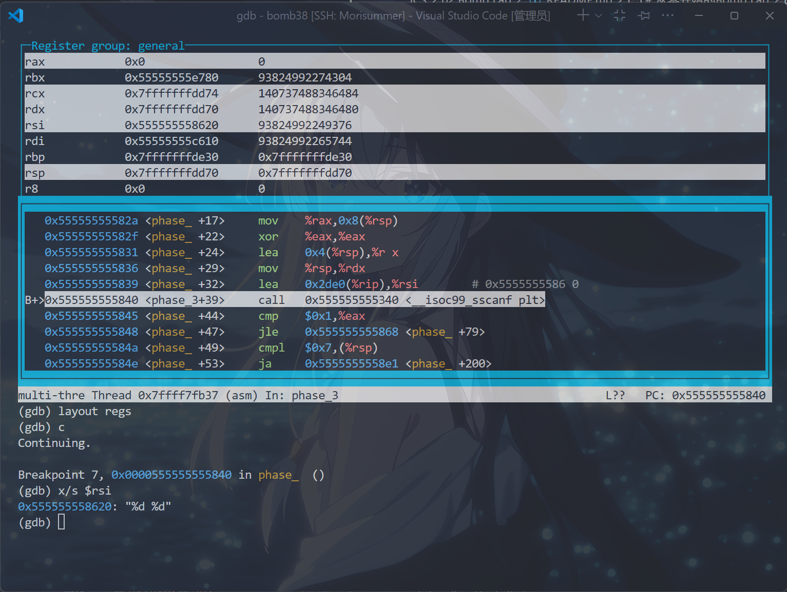

程序显示，正好是两个整数，并且与``%rsp+8``存金丝雀值相符合！

回想``phase_2``中讲过的``sscanf``函数逻辑，则第一个参数存放在``%rsp``，第二个参数存放在``%rsp+4``处。

同时，观察汇编代码，发现把第一个参数与7比较，若大于7则跳转``default``分支，即爆炸。

因此，我们不妨假设第一个参数为6，然后观察代码跳转到何处。

在``psol.txt``的第三行写下以下参数：

``6 142``

然后，在跳转前打下断点，打开终端，运行以下指令：

```
gdb bomb
b *(phase_3+76)
layout asm
layout regs
ni
```

发现它跳转到了``phase_3+178``，即代码中的``18cf``处：

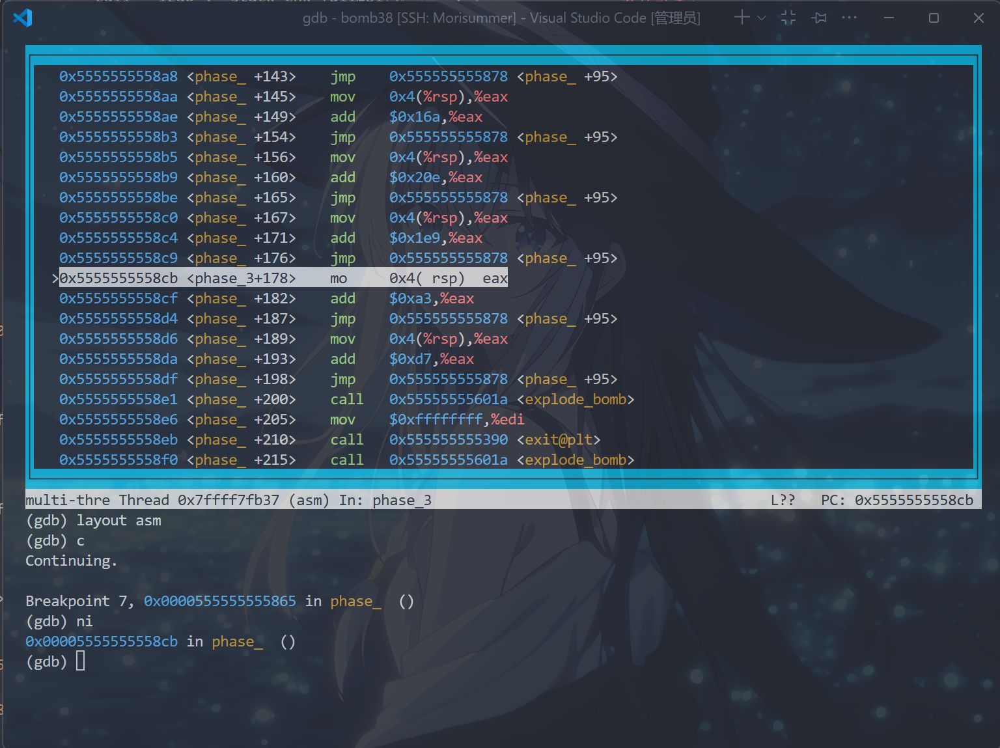

再回到代码，看出它大概的C语言逻辑：

```c
int result = x + 163;
if(x != 326) bomb!
```

于是求得 ``x = 163``。

刚发现笔者第一次做的时候用的第一参数不是``6``，于是有另一组答案``4,-200``。

将新找出的答案写到``psol.txt``的第三行，运行以下指令：

```
gdb bomb
layout asm
layout regs
c
```

得到以下输出，表示已经完成了``phase 3``：

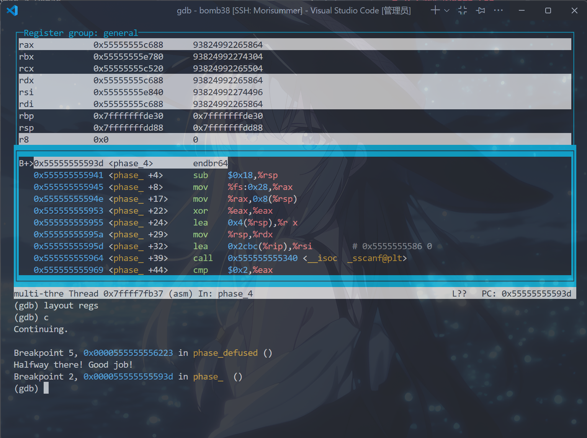

### Phase 4
注释掉``b phase_3``，便于调试。

先阅读``phase_4``的源码：

```asm
000000000000193d <phase_4>:
    193d:	f3 0f 1e fa          	endbr64 # 防ROP攻击
    1941:	48 83 ec 18          	sub    $0x18,%rsp # %rsp分配24个字节空间
    1945:	64 48 8b 04 25 28 00 	mov    %fs:0x28,%rax # %rax=金丝雀值
    194c:	00 00 
    194e:	48 89 44 24 08       	mov    %rax,0x8(%rsp) # 金丝雀值存放在(%rsp+8)处
    1953:	31 c0                	xor    %eax,%eax # %eax置零
    1955:	48 8d 4c 24 04       	lea    0x4(%rsp),%rcx # %rcx=(%rsp+4)
    195a:	48 89 e2             	mov    %rsp,%rdx %rdx=(%rsp+4)
    195d:	48 8d 35 bc 2c 00 00 	lea    0x2cbc(%rip),%rsi        # 4620 <transition_table+0x340> # 将内存中的某个值赋给%rsi，第二个参数
    1964:	e8 d7 f9 ff ff       	call   1340 <__isoc99_sscanf@plt> # 调用输入函数
    1969:	83 f8 02             	cmp    $0x2,%eax # 若%eax!=2，跳转爆炸
    196c:	75 0c                	jne    197a <phase_4+0x3d>
    196e:	8b 04 24             	mov    (%rsp),%eax # %eax=(%rsp)
    1971:	85 c0                	test   %eax,%eax # 若%eax<0，跳转爆炸
    1973:	78 05                	js     197a <phase_4+0x3d>
    1975:	83 f8 0e             	cmp    $0xe,%eax # 若%eax>14，不跳转导致爆炸
    1978:	7e 05                	jle    197f <phase_4+0x42>
    197a:	e8 9b 06 00 00       	call   201a <explode_bomb>
    197f:	ba 0e 00 00 00       	mov    $0xe,%edx # %edx=14
    1984:	be 00 00 00 00       	mov    $0x0,%esi # %esi=0
    1989:	8b 3c 24             	mov    (%rsp),%edi # %edi=(%rsp)
    198c:	e8 6b ff ff ff       	call   18fc <func4> # 调用func4
    1991:	83 f8 06             	cmp    $0x6,%eax # 若%eax!=0，跳转爆炸
    1994:	75 07                	jne    199d <phase_4+0x60> 
    1996:	83 7c 24 04 06       	cmpl   $0x6,0x4(%rsp) # 若(%rsp+4)!=6,不跳转导致爆炸
    199b:	74 05                	je     19a2 <phase_4+0x65>
    199d:	e8 78 06 00 00       	call   201a <explode_bomb>
    19a2:	48 8b 44 24 08       	mov    0x8(%rsp),%rax # 检验金丝雀值
    19a7:	64 48 2b 04 25 28 00 	sub    %fs:0x28,%rax
    19ae:	00 00 
    19b0:	75 05                	jne    19b7 <phase_4+0x7a> 
    19b2:	48 83 c4 18          	add    $0x18,%rsp # 释放空间
    19b6:	c3                   	ret # 返回
    19b7:	e8 e4 f8 ff ff       	call   12a0 <__stack_chk_fail@plt>
```

阅读完上面的源码，结合``sscanf``函数的原理，按照相同的检查方法，发现需要输入两个整数，同时第一个整数必须是 $0 \sim 14$ 之间的整数。

同时，注意到以下语句：

```asm
1991:	83 f8 06             	cmp    $0x6,%eax # 若%eax!=0，跳转爆炸
1994:	75 07                	jne    199d <phase_4+0x60> 
1996:	83 7c 24 04 06       	cmpl   $0x6,0x4(%rsp) # 若(%rsp+4)!=6,不跳转导致爆炸
199b:	74 05                	je     19a2 <phase_4+0x65>
```

确定以下条件，即第二个输入数为6，并且``func4``的返回值要为6。

阅读``func4``的源码：

传入的参数为``%edi=(%rsp),%esi=0,%edx=14``

```asm
00000000000018fc <func4>:
    18fc:	f3 0f 1e fa          	endbr64 # 防ROP攻击
    1900:	48 83 ec 08          	sub    $0x8,%rsp # %rsp分配8个字节空间
    1904:	89 d1                	mov    %edx,%ecx # %ecx=%edx
    1906:	29 f1                	sub    %esi,%ecx # %ecx-=%esi
    1908:	89 c8                	mov    %ecx,%eax # %eax=$ecx
    190a:	c1 e8 1f             	shr    $0x1f,%eax # 
    190d:	01 c8                	add    %ecx,%eax # %eax+=%ecx
    190f:	d1 f8                	sar    $1,%eax # %eax=%eax/2
    1911:	01 f0                	add    %esi,%eax # %eax+=%esi
    1913:	39 f8                	cmp    %edi,%eax # 若%eax>%edi,跳转；若%eax<%edi，跳转
    1915:	7f 0c                	jg     1923 <func4+0x27> 
    1917:	7c 16                	jl     192f <func4+0x33>
    1919:	b8 00 00 00 00       	mov    $0x0,%eax # %eax=0
    191e:	48 83 c4 08          	add    $0x8,%rsp # 恢复栈位
    1922:	c3                   	ret # 返回
    1923:	8d 50 ff             	lea    -0x1(%rax),%edx # %edx=%rax-1
    1926:	e8 d1 ff ff ff       	call   18fc <func4> #递归调用func4
    192b:	01 c0                	add    %eax,%eax # %eax=%eax*2
    192d:	eb ef                	jmp    191e <func4+0x22> # 跳转到返回
    192f:	8d 70 01             	lea    0x1(%rax),%esi # %esi=%rax+1
    1932:	e8 c5 ff ff ff       	call   18fc <func4> # 递归调用func4
    1937:	8d 44 00 01          	lea    0x1(%rax,%rax,1),%eax # %eax=2*%rax+1
    193b:	eb e1                	jmp    191e <func4+0x22> # 跳转到返回
```

阅读这段代码，大致能给出以下递归结构：

```c
int func4(int x, int y, int z){
    int res = z - y;
    res = res >> 31; // 此处为逻辑右移
    res += (z - y);
    res = res >> 1; // 此处为算术右移
    res += y;
    if(x < res){
        return 2 * func4(x, y, res - 1);
    }
    else if(x > res){
        return 2 * func4(x, res + 1, z) + 1;
    }
    return 0;
}
```

于是，只需解出使这个函数返回值为6的第一个参数值即可。

计算得出``x = 6``，于是得出答案：

``6 6``

将答案写到``psol.txt``的第四行，打开终端，运行以下指令：

```
gdb bomb
layout asm
layout regs
c
```

得到以下输出，表示已经完成了``phase 4``：

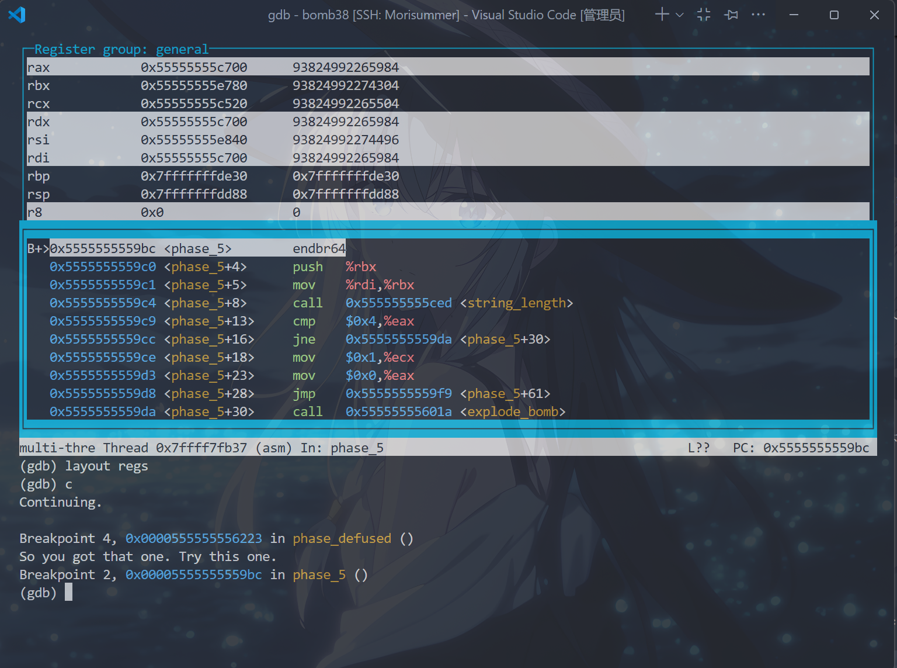

### Phase 5
注释掉``b phase_5``，便于调试。

先阅读``phase_5``的源码：

```asm
00000000000019bc <phase_5>:
    19bc:	f3 0f 1e fa          	endbr64 # 防ROP攻击
    19c0:	53                   	push   %rbx # %rbx进栈
    19c1:	48 89 fb             	mov    %rdi,%rbx # %rbx=%rdi
    19c4:	e8 24 03 00 00       	call   1ced <string_length> # 调用<string_length>函数
    19c9:	83 f8 04             	cmp    $0x4,%eax # 如果%eax不为4则跳转爆炸
    19cc:	75 0c                	jne    19da <phase_5+0x1e>
    19ce:	b9 01 00 00 00       	mov    $0x1,%ecx # %ecx=1
    19d3:	b8 00 00 00 00       	mov    $0x0,%eax # %eax=1
    19d8:	eb 1f                	jmp    19f9 <phase_5+0x3d> # 跳转
    19da:	e8 3b 06 00 00       	call   201a <explode_bomb>
    19df:	eb ed                	jmp    19ce <phase_5+0x12>
    19e1:	48 63 d0             	movslq %eax,%rdx # %rdx=%eax
    19e4:	0f b6 14 13          	movzbl (%rbx,%rdx,1),%edx # %edx=%rbx+%rdx
    19e8:	83 e2 07             	and    $0x7,%edx # %edx=%edx&7
    19eb:	48 8d 35 ce 28 00 00 	lea    0x28ce(%rip),%rsi        # 42c0 <array.0> # 把%rsi设为某个地址
    19f2:	0f af 0c 96          	imul   (%rsi,%rdx,4),%ecx # %ecx*=(%rsi+4*%rdx)
    19f6:	83 c0 01             	add    $0x1,%eax # %eax++
    19f9:	83 f8 03             	cmp    $0x3,%eax # 若%eax<=3则跳转
    19fc:	7e e3                	jle    19e1 <phase_5+0x25>
    19fe:	81 f9 20 01 00 00    	cmp    $0x120,%ecx # %ecx!=120，则跳转爆炸
    1a04:	75 02                	jne    1a08 <phase_5+0x4c>
    1a06:	5b                   	pop    %rbx # %rbx恢复原值
    1a07:	c3                   	ret # 退出
    1a08:	e8 0d 06 00 00       	call   201a <explode_bomb>
    1a0d:	eb f7                	jmp    1a06 <phase_5+0x4a>
```

给代码打上注释后，会发现此题并没有前面所用的``sscanf``函数，但是通过下面这两行判断应该输入一个长度为4的字符串：

```asm
19c4:	e8 24 03 00 00       	call   1ced <string_length> # 调用<string_length>函数
19c9:	83 f8 04             	cmp    $0x4,%eax # 如果%eax不为4则跳转爆炸
19cc:	75 0c                	jne    19da <phase_5+0x1e>
```

同时，由代码可知，这个字符串被保存在``%rdi``中。

当读取了字符串长度并判断成功后，``%eax``被置零，同时后续跳转后有个判断``%eax``是否小于等于3的函数，很容易判断出这是个循环结构。

最终的成功条件为``%ecx == 288``，而与``%ecx``相关的仅有这一句``imul   (%rsi,%rdx,4),%ecx``。

此时要研究的就是，乘上去的到底是什么？

```asm
19e1:	48 63 d0             	movslq %eax,%rdx # %rdx=%eax
19e4:	0f b6 14 13          	movzbl (%rbx,%rdx,1),%edx # %edx=%rbx+%rdx
19e8:	83 e2 07             	and    $0x7,%edx # %edx=%edx&7
```

由于初始时，``%rbx``就用于存放字符串的开头``%rdi``，因此这里就是取出``第i个字符``给``%edx``，然后再令``%edx = %edx & 7``。

通过反汇编得出的注释，知道了``%rsi``这里被赋为一个数组的开头，而这个数组由于使用 $0 \sim 7$ 的偏移量(见``%rdx``的取值范围)，因此它必然是含8个元素的数组。

先在``psol.txt``文件的第五行随便输入四个字符的字符串，如``GGGG``。

使用GDB工具看看这个数组是啥：

```
gdb bomb
b *(phase_5+54)
layout asm
layout regs
c
x/8d $rsi
```

得到以下结果：


也就得到了，这个数组的各个元素的值。

那么，题意也就一目了然了。对于第i次循环 ( $0 \leq i \leq 3$ )，取出第i个字符，取它的低3位作为偏移量，所取出的数组元素之乘积需要为``288``。

找出一张ASCIL码表，笔者选取的答案为：``CCDG``。

将``psol.txt``的第五行替换为答案，打开终端，运行以下命令：

```
gdb bomb
layout asm 
layout regs
c
```

得到以下输出，表示已经完成了``phase 5``:

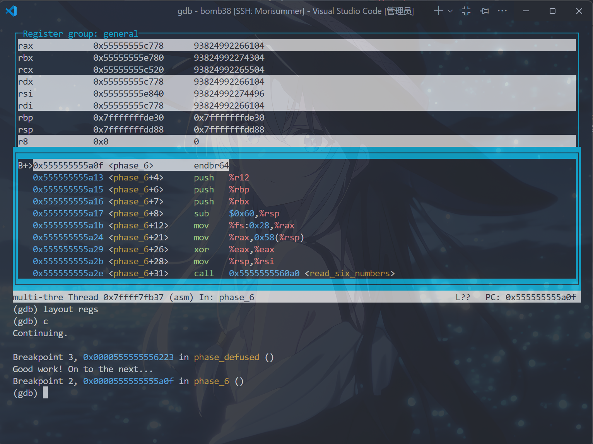

### Phase 6
注释掉``b phase_6``，便于调试。

先阅读``phase_6``的源码：

```asm
0000000000001a0f <phase_6>:
    1a0f:	f3 0f 1e fa          	endbr64 # 防ROP攻击
    1a13:	41 54                	push   %r12 # %r12进栈
    1a15:	55                   	push   %rbp # %rbp进栈
    1a16:	53                   	push   %rbx # %rbx进栈
    1a17:	48 83 ec 60          	sub    $0x60,%rsp # %rsp分配96个字节空间
    1a1b:	64 48 8b 04 25 28 00 	mov    %fs:0x28,%rax # %rax赋值为金丝雀值
    1a22:	00 00 
    1a24:	48 89 44 24 58       	mov    %rax,0x58(%rsp) # 金丝雀值存放于%rsp+88处
    1a29:	31 c0                	xor    %eax,%eax # %eax=0
    1a2b:	48 89 e6             	mov    %rsp,%rsi # %rsi=%rsp
    1a2e:	e8 6d 06 00 00       	call   20a0 <read_six_numbers> # 调用<read_six_numbers>函数
    1a33:	bd 00 00 00 00       	mov    $0x0,%ebp # %ebp=0
    1a38:	eb 27                	jmp    1a61 <phase_6+0x52> # 跳转
    1a3a:	e8 db 05 00 00       	call   201a <explode_bomb>
    1a3f:	eb 33                	jmp    1a74 <phase_6+0x65>
    1a41:	83 c3 01             	add    $0x1,%ebx # %ebx++
    1a44:	83 fb 05             	cmp    $0x5,%ebx # %ebx>5，则跳转
    1a47:	7f 15                	jg     1a5e <phase_6+0x4f> 
    1a49:	48 63 c5             	movslq %ebp,%rax # %rax=%ebp
    1a4c:	48 63 d3             	movslq %ebx,%rdx # %ebx=%rdx
    1a4f:	8b 3c 94             	mov    (%rsp,%rdx,4),%edi # %edi=(%rsp+4*%rdx)
    1a52:	39 3c 84             	cmp    %edi,(%rsp,%rax,4) # 若%edi==(%rsp+%rax*4)，则不跳转导致爆炸
    1a55:	75 ea                	jne    1a41 <phase_6+0x32>
    1a57:	e8 be 05 00 00       	call   201a <explode_bomb>
    1a5c:	eb e3                	jmp    1a41 <phase_6+0x32>
    1a5e:	44 89 e5             	mov    %r12d,%ebp # %r12d=%ebp
    1a61:	83 fd 05             	cmp    $0x5,%ebp # 若%ebp大于5跳转
    1a64:	7f 17                	jg     1a7d <phase_6+0x6e>
    1a66:	48 63 c5             	movslq %ebp,%rax # %rax=%ebp
    1a69:	8b 04 84             	mov    (%rsp,%rax,4),%eax # %eax=(%rsp+%rax*4)
    1a6c:	83 e8 01             	sub    $0x1,%eax # %eax-=1
    1a6f:	83 f8 05             	cmp    $0x5,%eax # 若%eax>5，跳转爆炸
    1a72:	77 c6                	ja     1a3a <phase_6+0x2b>
    1a74:	44 8d 65 01          	lea    0x1(%rbp),%r12d # %r12d=(%rbp+1)
    1a78:	44 89 e3             	mov    %r12d,%ebx # %ebx=%r12d
    1a7b:	eb c7                	jmp    1a44 <phase_6+0x35> 跳转
    1a7d:	be 00 00 00 00       	mov    $0x0,%esi # %esi=0
    1a82:	eb 17                	jmp    1a9b <phase_6+0x8c> # 跳转
    1a84:	48 8b 52 08          	mov    0x8(%rdx),%rdx # %rdx=(%rdx+8)
    1a88:	83 c0 01             	add    $0x1,%eax # %eax++
    1a8b:	48 63 ce             	movslq %esi,%rcx # %rcx=%esi
    1a8e:	39 04 8c             	cmp    %eax,(%rsp,%rcx,4) 若
    1a91:	7f f1                	jg     1a84 <phase_6+0x75>
    1a93:	48 89 54 cc 20       	mov    %rdx,0x20(%rsp,%rcx,8)
    1a98:	83 c6 01             	add    $0x1,%esi # %esi++
    1a9b:	83 fe 05             	cmp    $0x5,%esi # 若%esi>5，出循环
    1a9e:	7f 0e                	jg     1aae <phase_6+0x9f> 
    1aa0:	b8 01 00 00 00       	mov    $0x1,%eax # %eax=1
    1aa5:	48 8d 15 a4 65 00 00 	lea    0x65a4(%rip),%rdx        # 8050 <node1> # %rdx被设为某个地址
    1aac:	eb dd                	jmp    1a8b <phase_6+0x7c> # 跳转
    1aae:	48 8b 5c 24 20       	mov    0x20(%rsp),%rbx # %rbx=(%rsp+32)
    1ab3:	48 89 d9             	mov    %rbx,%rcx # %rcx=%rbx 
    1ab6:	b8 01 00 00 00       	mov    $0x1,%eax # %eax=1
    1abb:	eb 12                	jmp    1acf <phase_6+0xc0> 跳转
    1abd:	48 63 d0             	movslq %eax,%rdx # %rdx=%eax
    1ac0:	48 8b 54 d4 20       	mov    0x20(%rsp,%rdx,8),%rdx # %rdx=(%rsp+%rdx*8)
    1ac5:	48 89 51 08          	mov    %rdx,0x8(%rcx) # (%rcx+8)=%rdx
    1ac9:	83 c0 01             	add    $0x1,%eax # %eax=1
    1acc:	48 89 d1             	mov    %rdx,%rcx # %rcx=%rdx
    1acf:	83 f8 05             	cmp    $0x5,%eax # 若%eax<=5，跳转，否则出循环
    1ad2:	7e e9                	jle    1abd <phase_6+0xae>
    1ad4:	48 c7 41 08 00 00 00 	movq   $0x0,0x8(%rcx) # (%rcx+8)=0
    1adb:	00 
    1adc:	bd 00 00 00 00       	mov    $0x0,%ebp # %ebp=0
    1ae1:	eb 07                	jmp    1aea <phase_6+0xdb> # 跳转
    1ae3:	48 8b 5b 08          	mov    0x8(%rbx),%rbx # %rbx=(%rbx+8)
    1ae7:	83 c5 01             	add    $0x1,%ebp # %ebp++
    1aea:	83 fd 04             	cmp    $0x4,%ebp # 若%ebp大于4，即跳转到退出步骤
    1aed:	7f 11                	jg     1b00 <phase_6+0xf1> 
    1aef:	48 8b 43 08          	mov    0x8(%rbx),%rax # %rax=(%rbx+8)
    1af3:	8b 00                	mov    (%rax),%eax # %eax=(%rax)
    1af5:	39 03                	cmp    %eax,(%rbx) 若(%rbx)>%eax，则不跳转导致爆炸
    1af7:	7e ea                	jle    1ae3 <phase_6+0xd4>
    1af9:	e8 1c 05 00 00       	call   201a <explode_bomb>
    1afe:	eb e3                	jmp    1ae3 <phase_6+0xd4>
    1b00:	48 8b 44 24 58       	mov    0x58(%rsp),%rax # 金丝雀值检验
    1b05:	64 48 2b 04 25 28 00 	sub    %fs:0x28,%rax 
    1b0c:	00 00 
    1b0e:	75 09                	jne    1b19 <phase_6+0x10a>
    1b10:	48 83 c4 60          	add    $0x60,%rsp # %rsp恢复空间
    1b14:	5b                   	pop    %rbx # %rbx恢复原值
    1b15:	5d                   	pop    %rbp # %rbp恢复原值
    1b16:	41 5c                	pop    %r12 # %r12恢复原值
    1b18:	c3                   	ret # 退出
    1b19:	e8 82 f7 ff ff       	call   12a0 <__stack_chk_fail@plt>
```

显然是长得可怕，笔者第二次做还是觉得这样。

加上注释后，显得好一些了。难点就是在于循环多，以及常用的不常用的寄存器名称都来了。

不过，有一些老朋友，比如``<read_six_numbers>``函数，就表示需要读进六个整数，并且将它们存放在``%rsp ~ %rsp+24``中。

去掉保存金丝雀值等等无用部分，得到以下核心代码：

```asm
    1a33:	bd 00 00 00 00       	mov    $0x0,%ebp # %ebp=0
    1a38:	eb 27                	jmp    1a61 <phase_6+0x52> # 跳转
    1a3a:	e8 db 05 00 00       	call   201a <explode_bomb>
    1a3f:	eb 33                	jmp    1a74 <phase_6+0x65>
    1a41:	83 c3 01             	add    $0x1,%ebx # %ebx++
    1a44:	83 fb 05             	cmp    $0x5,%ebx # %ebx>5，则跳转
    1a47:	7f 15                	jg     1a5e <phase_6+0x4f> 
    1a49:	48 63 c5             	movslq %ebp,%rax # %rax=%ebp
    1a4c:	48 63 d3             	movslq %ebx,%rdx # %ebx=%rdx
    1a4f:	8b 3c 94             	mov    (%rsp,%rdx,4),%edi # %edi=(%rsp+4*%rdx)
    1a52:	39 3c 84             	cmp    %edi,(%rsp,%rax,4) # 若%edi==(%rsp+%rax*4)，则不跳转导致爆炸
    1a55:	75 ea                	jne    1a41 <phase_6+0x32>
    1a57:	e8 be 05 00 00       	call   201a <explode_bomb>
    1a5c:	eb e3                	jmp    1a41 <phase_6+0x32>
    1a5e:	44 89 e5             	mov    %r12d,%ebp # %r12d=%ebp
    1a61:	83 fd 05             	cmp    $0x5,%ebp # 若%ebp大于5跳转
    1a64:	7f 17                	jg     1a7d <phase_6+0x6e>
    1a66:	48 63 c5             	movslq %ebp,%rax # %rax=%ebp
    1a69:	8b 04 84             	mov    (%rsp,%rax,4),%eax # %eax=(%rsp+%rax*4)
    1a6c:	83 e8 01             	sub    $0x1,%eax # %eax-=1
    1a6f:	83 f8 05             	cmp    $0x5,%eax # 若%eax>5，跳转爆炸
    1a72:	77 c6                	ja     1a3a <phase_6+0x2b>
    1a74:	44 8d 65 01          	lea    0x1(%rbp),%r12d # %r12d=(%rbp+1)
    1a78:	44 89 e3             	mov    %r12d,%ebx # %ebx=%r12d
    1a7b:	eb c7                	jmp    1a44 <phase_6+0x35> 跳转
    1a7d:	be 00 00 00 00       	mov    $0x0,%esi # %esi=0
    1a82:	eb 17                	jmp    1a9b <phase_6+0x8c> # 跳转
    1a84:	48 8b 52 08          	mov    0x8(%rdx),%rdx # %rdx=(%rdx+8)
    1a88:	83 c0 01             	add    $0x1,%eax # %eax++
    1a8b:	48 63 ce             	movslq %esi,%rcx # %rcx=%esi
    1a8e:	39 04 8c             	cmp    %eax,(%rsp,%rcx,4) # 若eax>(rsp+rcx*4),则跳转
    1a91:	7f f1                	jg     1a84 <phase_6+0x75>
    1a93:	48 89 54 cc 20       	mov    %rdx,0x20(%rsp,%rcx,8)
    1a98:	83 c6 01             	add    $0x1,%esi # %esi++
    1a9b:	83 fe 05             	cmp    $0x5,%esi # 若%esi>5，出循环
    1a9e:	7f 0e                	jg     1aae <phase_6+0x9f> 
    1aa0:	b8 01 00 00 00       	mov    $0x1,%eax # %eax=1
    1aa5:	48 8d 15 a4 65 00 00 	lea    0x65a4(%rip),%rdx        # 8050 <node1> # %rdx被设为某个地址
    1aac:	eb dd                	jmp    1a8b <phase_6+0x7c> # 跳转
    1aae:	48 8b 5c 24 20       	mov    0x20(%rsp),%rbx # %rbx=(%rsp+32)
    1ab3:	48 89 d9             	mov    %rbx,%rcx # %rcx=%rbx 
    1ab6:	b8 01 00 00 00       	mov    $0x1,%eax # %eax=1
    1abb:	eb 12                	jmp    1acf <phase_6+0xc0> 跳转
    1abd:	48 63 d0             	movslq %eax,%rdx # %rdx=%eax
    1ac0:	48 8b 54 d4 20       	mov    0x20(%rsp,%rdx,8),%rdx # %rdx=(%rsp+%rdx*8)
    1ac5:	48 89 51 08          	mov    %rdx,0x8(%rcx) # (%rcx+8)=%rdx
    1ac9:	83 c0 01             	add    $0x1,%eax # %eax=1
    1acc:	48 89 d1             	mov    %rdx,%rcx # %rcx=%rdx
    1acf:	83 f8 05             	cmp    $0x5,%eax # 若%eax<=5，跳转，否则出循环
    1ad2:	7e e9                	jle    1abd <phase_6+0xae>
    1ad4:	48 c7 41 08 00 00 00 	movq   $0x0,0x8(%rcx) # (%rcx+8)=0
    1adb:	00 
    1adc:	bd 00 00 00 00       	mov    $0x0,%ebp # %ebp=0
    1ae1:	eb 07                	jmp    1aea <phase_6+0xdb> # 跳转
    1ae3:	48 8b 5b 08          	mov    0x8(%rbx),%rbx # %rbx=(%rbx+8)
    1ae7:	83 c5 01             	add    $0x1,%ebp # %ebp++
    1aea:	83 fd 04             	cmp    $0x4,%ebp # 若%ebp大于4，即跳转到退出步骤
    1aed:	7f 11                	jg     1b00 <phase_6+0xf1> 
    1aef:	48 8b 43 08          	mov    0x8(%rbx),%rax # %rax=(%rbx+8)
    1af3:	8b 00                	mov    (%rax),%eax # %eax=(%rax)
    1af5:	39 03                	cmp    %eax,(%rbx) 若(%rbx)>%eax，则不跳转导致爆炸
    1af7:	7e ea                	jle    1ae3 <phase_6+0xd4>
    1af9:	e8 1c 05 00 00       	call   201a <explode_bomb>
    1afe:	eb e3                	jmp    1ae3 <phase_6+0xd4>
```

来理一理逻辑吧！做完这个就大功告成啦！

函数首先进入一个循环，写成C代码大概如下

```c
for(int ebp = 0;ebp <= 5;ebp++){
    rax = ebp;
    eax = rsp + rax*4; // 即eax = 第ebp个参数
    eax--;
    if(eax > 5) boom!
    for(int ebx = rbp + 1;ebx <= 5; ebx++){
        rax = ebp;
        rdx = ebx;
        edi = rsp + 4 * rdx; // 也就是将第(ebp+1)个参数加载到edi
        if(edi == rsp + rax * 4) boom! // 若第ebp个参数等于第(ebx)个参数，爆炸
        ebx++;
    }
}
```

它的作用是，首先确保输进去的每个数都是小于等于6的，同时验证输入的参数中没有相等的数。

接着往下看，函数跳出循环到``1a7d``处。写成C代码大概如下：

```c
for(int esi=0;esi<=5;esi++){
    eax=1;
    rdx=?;
    rcx=esi;
    while((rsp+rcx*4)>eax){
        rdx=(rdx+8);
        eax++;
        rcx=esi;
    }
    (rsp+32+rcx*8)=rdx;
}
```

目前还无法弄清楚这个函数的功能，但是注意到一个很扎眼的点，就是``1aa5``这一行，从反汇编的注释得出一个``<node1>``，非常像是链表或者二叉树这样的数据结构，而且前者的可能性极大。

同时，如果确认其是链表，那么``rdx=(rdx+8)``操作无疑就是``node=node->next;``的代码，而此时一个节点所占空间就是``16个字节``，一切就迎刃而解了。

先在``psol.txt``的第六行随便写下符合上述要求的数字，如``1 2 3 4 5 6``。

运行以下指令，看看``<node1>``到底是个啥：

```
gdb bomb
b *(phase_6+157)
layout asm
layout regs
c
x/24x $rdx // 如上文分析，打印96个字节的值。
```

得到以下输出：

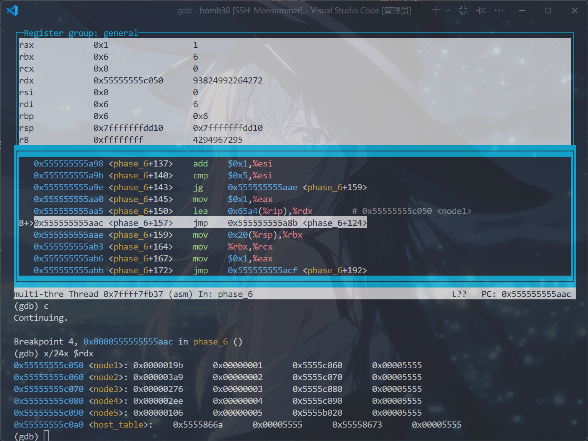

一个令人疑惑的点是，为什么只有五个节点？

分析每个节点的结构，由于``x86-64``的体系结构中，数据按照``小端法``存储，因此每个节点的结构大致为

```c
struct node{
    int val;
    int key;
    node* next;
}
```

而由此推出，``node6``的地址为``0x000055555555b020``。

运行``x/4x 0x000055555555``，得到以下输出：

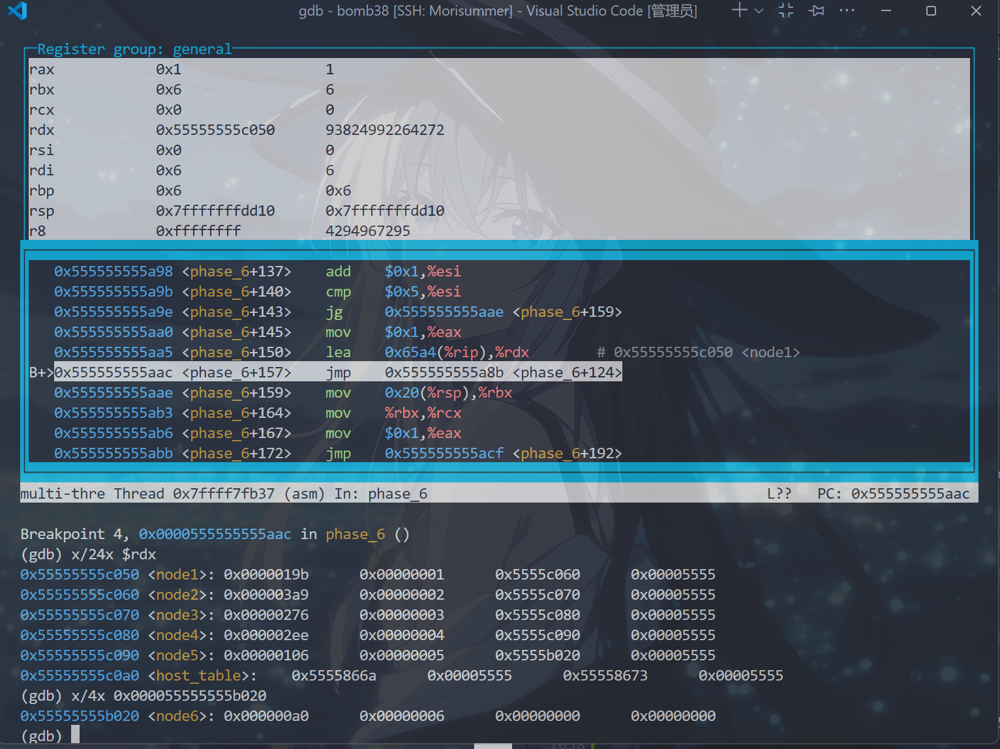

于是就能确认这个数据结构是链表，同时可以补全上述代码：

```c
for(int esi = 0;esi <= 5;esi++){
    eax = 1;
    rdx = node1;
    while((rsp + esi * 4) > eax){ 
        rdx = rdx->next;
        eax++;
    }
    (rsp + 32 + esi*8)=rdx;
}
```

它的作用是，对于第i个输入的参数``nums[i]``，将``node[nums[i]]``的指针存在``rsp + 32 + 8 * i``的位置。

再往下看，写出大概的C代码：

```c
rbx = (rsp + 32);
rcx = rbx;
for(int eax = 1;eax <= 5;eax++){
    rdx = eax;    
    rdx = (rsp + rdx * 8 + 32);
    (rcx + 8) = rdx;
    rcx = rdx;
}
```

它的作用是，对于 $i \in [1,5],$ ，将上个循环中重排后的这些链表连接起来。

最后，看下最后一个循环，写出大概的C代码：

```c
(rcx+8)=0;
for(int ebp=0;ebp<=4;ebp++){
    rax = (rbx + 8);
    eax = rax;
    if((rbx) > eax) boom!
    rbx = (rbx + 8);
}
```

再次由于``x86-64``架构的``小端法``存储特点，得到它的大致含义，如果``node[i].val > node[i+1].val``，就发生爆炸。

结合上述所有条件，得出答案为：

``6 5 1 3 4 2``

将``psol.txt``的第六行替换为答案，注释掉``b phase_6``，打开终端，运行以下命令：

```
gdb bomb
layout asm 
layout regs
c
```

此时的``psol.txt``应该是这样的：

```
A secret makes a woman a woman
1 2 4 8 16 32
6 163
6 6
CCDG
6 5 1 3 4 2
I love elaina.
```

得到以下输出，表示已经完成了``phase 6``:

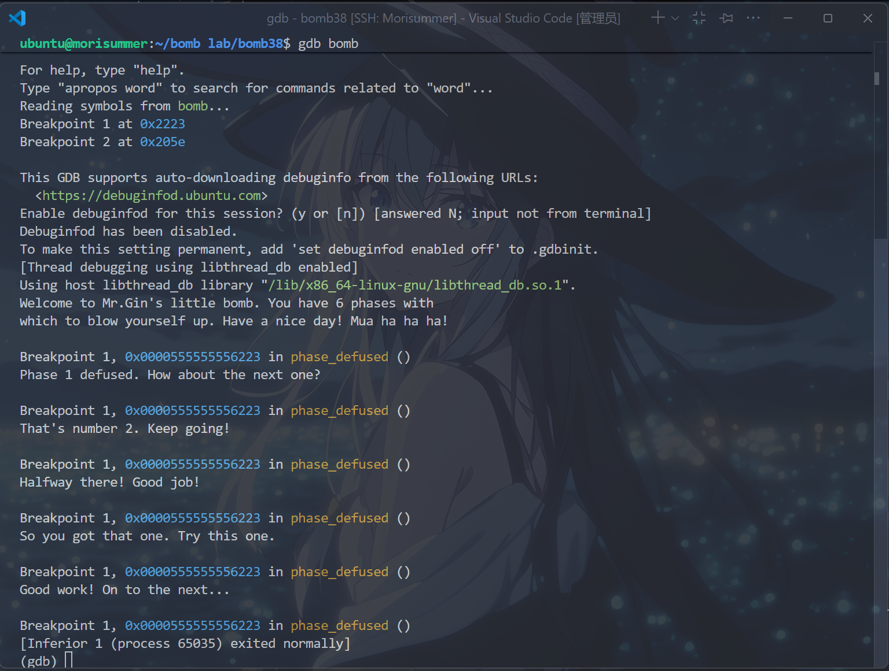

此处因为给``phase_defused``打了断点，因此无法显示最后的成功语句，DDL内是可以的。

于是，完成了ICS的第二个Lab，Congratulations!

## Secret Phase
### 题目背景
根据``writeup``跟``bomb.c``，得到以下几句话：

这句话来自``bomb.c``的注释：

```
Wow, they got it!  But isn't something... missing?  
Perhaps something they overlooked?  
Mua ha ha ha ha!

哇，他们做到了！不过，是不是少了点什么？
也许他们忽视了什么东西？
哇哈哈哈哈！
```

这句话来自``writeup``：

```
Never could a muggle senses the magic. It’s purely beyond their ken. 
Do they really think alohomora could open all the doors in the world?
No way! 
Neither would they have any ideathat I further secured it with some abracadabra. 
Mua ha ha ha! Just bother with these most impregnable spells ever!

一个麻瓜永远无法感受到魔法，这完全超出了他们的理解。
他们真的以为阿拉霍洞开能打开所有的门吗？
不可能！
他们也绝不会想到，我还用阿布拉卡达布拉把它进一步加固了。
哇哈哈哈哈！就让他们去头疼这些史上最牢不可破的咒语吧！
```

### 越过判定与信息传送函数
在``bomb.asm``中搜索``secret_phase``，会发现其被``phase_defused``函数调用，即``main``函数中每次完成一个``phase``后，向服务器传送信息并且输出完成信息的函数。

找出``phase_defused``函数的源码：

```asm
0000000000002223 <phase_defused>:
    2223:	f3 0f 1e fa          	endbr64
    2227:	53                   	push   %rbx # %rbx进栈
    2228:	48 89 fb             	mov    %rdi,%rbx # %rbx=%rdi
    222b:	c7 07 00 00 00 00    	movl   $0x0,(%rdi)  # %rdi=0
    2231:	48 89 fe             	mov    %rdi,%rsi # %rsi=%rdi
    2234:	bf 01 00 00 00       	mov    $0x1,%edi # %edi=1
    2239:	e8 7a fc ff ff       	call   1eb8 <send_msg> # 需要跳过
    223e:	83 3b 01             	cmpl   $0x1,(%rbx) # (%rbx)!=1
    2241:	75 0b                	jne    224e <phase_defused+0x2b> 
    2243:	83 3d ce 62 00 00 06 	cmpl   $0x6,0x62ce(%rip)        # 8518 <num_input_strings>
    224a:	74 22                	je     226e <phase_defused+0x4b>
    224c:	5b                   	pop    %rbx
    224d:	c3                   	ret
    224e:	48 8d 35 5b 21 00 00 	lea    0x215b(%rip),%rsi        # 43b0 <transition_table+0xd0>
    2255:	bf 01 00 00 00       	mov    $0x1,%edi
    225a:	b8 00 00 00 00       	mov    $0x0,%eax
    225f:	e8 fc f0 ff ff       	call   1360 <__printf_chk@plt>
    2264:	bf 08 00 00 00       	mov    $0x8,%edi
    2269:	e8 22 f1 ff ff       	call   1390 <exit@plt>
    226e:	e8 f1 f3 ff ff       	call   1664 <abracadabra>
    2273:	85 c0                	test   %eax,%eax # %eax!=0，则跳转到返回函数
    2275:	75 1a                	jne    2291 <phase_defused+0x6e>
    2277:	48 8d 3d 92 22 00 00 	lea    0x2292(%rip),%rdi        # 4510 <transition_table+0x230>
    227e:	e8 ed ef ff ff       	call   1270 <puts@plt>
    2283:	48 8d 3d ce 22 00 00 	lea    0x22ce(%rip),%rdi        # 4558 <transition_table+0x278>
    228a:	e8 e1 ef ff ff       	call   1270 <puts@plt>
    228f:	eb bb                	jmp    224c <phase_defused+0x29>
    2291:	e8 5b f4 ff ff       	call   16f1 <alohomora>
    2296:	85 c0                	test   %eax,%eax # %eax=0，则跳转到返回函数
    2298:	74 30                	je     22ca <phase_defused+0xa7>
    229a:	48 8d 3d 7f 21 00 00 	lea    0x217f(%rip),%rdi        # 4420 <transition_table+0x140>
    22a1:	e8 ca ef ff ff       	call   1270 <puts@plt>
    22a6:	48 8d 3d 9b 21 00 00 	lea    0x219b(%rip),%rdi        # 4448 <transition_table+0x168>
    22ad:	e8 be ef ff ff       	call   1270 <puts@plt>
    22b2:	48 8d 3d c7 21 00 00 	lea    0x21c7(%rip),%rdi        # 4480 <transition_table+0x1a0>
    22b9:	e8 b2 ef ff ff       	call   1270 <puts@plt>
    22be:	b8 00 00 00 00       	mov    $0x0,%eax
    22c3:	e8 f7 f8 ff ff       	call   1bbf <secret_phase>
    22c8:	eb ad                	jmp    2277 <phase_defused+0x54>
    22ca:	48 8d 3d ff 21 00 00 	lea    0x21ff(%rip),%rdi        # 44d0 <transition_table+0x1f0>
    22d1:	e8 9a ef ff ff       	call   1270 <puts@plt>
    22d6:	48 8d 3d a3 21 00 00 	lea    0x21a3(%rip),%rdi        # 4480 <transition_table+0x1a0>
    22dd:	e8 8e ef ff ff       	call   1270 <puts@plt>
    22e2:	eb 93                	jmp    2277 <phase_defused+0x54>
```

首先，回看``.gdbinit``文件，发现有这几行：

```
b phase_defused
command 
jump *(phase_defused+0x2A)
end
```

也就是，对``phase_defused``处的断点编程，让它立即跳跃到``224d``的``ret``处，因此完全无法执行任何关于``phase_defused``的命令。

那怎么办？就是要，取消对这个断点的编程，但是仍然保留这个断点！

在准备执行``phase_6``之前，在``gdb``调试器内输入``commands 7``(由于笔者此处的断点编号为7，若不一样，可以输入``i b``查询所有断点并找出对应编号)，对其重新编程。

此时，会弹出新命令行，直接输入``end``退出编程界面，这个断点的编程就被新的一个占位程序覆盖了，如下：

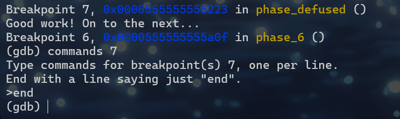

此时再输入``i b``命令，会发现这个断点的编程已经消失了。

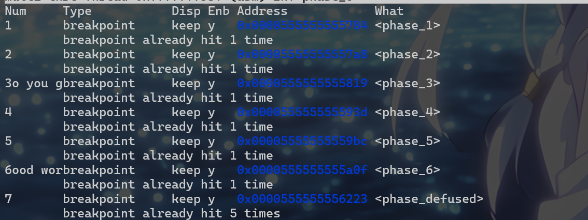

接下来，就可以开始查看``phase_defused``的源码了。

观察到，``226e``行调用了魔法函数``abracadabra``，因此截取其前面的汇编代码进行阅读：

```asm
0000000000002223 <phase_defused>:
    2223:	f3 0f 1e fa          	endbr64
    2227:	53                   	push   %rbx # %rbx进栈
    2228:	48 89 fb             	mov    %rdi,%rbx # %rbx=%rdi
    222b:	c7 07 00 00 00 00    	movl   $0x0,(%rdi)  # %rdi=0
    2231:	48 89 fe             	mov    %rdi,%rsi # %rsi=%rdi
    2234:	bf 01 00 00 00       	mov    $0x1,%edi # %edi=1
    2239:	e8 7a fc ff ff       	call   1eb8 <send_msg> # 需要跳过
    223e:	83 3b 01             	cmpl   $0x1,(%rbx) # (%rbx)!=1
    2241:	75 0b                	jne    224e <phase_defused+0x2b> 
    2243:	83 3d ce 62 00 00 06 	cmpl   $0x6,0x62ce(%rip)        # 8518 <num_input_strings>
    224a:	74 22                	je     226e <phase_defused+0x4b>
    224c:	5b                   	pop    %rbx
    224d:	c3                   	ret
    224e:	48 8d 35 5b 21 00 00 	lea    0x215b(%rip),%rsi        # 43b0 <transition_table+0xd0>
    2255:	bf 01 00 00 00       	mov    $0x1,%edi
    225a:	b8 00 00 00 00       	mov    $0x0,%eax
    225f:	e8 fc f0 ff ff       	call   1360 <__printf_chk@plt>
    2264:	bf 08 00 00 00       	mov    $0x8,%edi
    2269:	e8 22 f1 ff ff       	call   1390 <exit@plt>
```

此处，可以观察到，``2228``这一行将``%rdi``指向的内存赋值为``0``，然后``233e``这一行判断``%rbx``指向的内存是否为``1``。

由于``2228``这一行，将``rbx``跟``rdi``相等，因此若不作特殊操作，则``(%rbx)``必然为``0``，则会直接跳入输出信息以及返回的部分，无法进入``Secret Phase``。

因此，在此采用同样的思想，即对``赋值的语句``跟``判断的语句``都进行编程，使其跳过当前语句，此处考虑只跳过单语句，对寄存器以及栈的影响降到最小。

不过，这里需要提及的是，由于笔者是在DDL之后做的``Secret Phase``，由于``send_msg``语句会向``AutoLab``的服务器发送信息导致报错，因此亦需要跳过这个函数的调用，同样使用对断点编程的思想。

尤其要注意的是，由于``jump``语句是跳转完``立即执行``的，因此需要在被跳转语句同样打上一个断点，使其跳转到这条语句，但是还未执行的时候停止。

在``gdb``调试器中输入以下命令：

```
b *(phase_defused+0x8)
commands 9 # 此处视实际编号而定
j *(phase_defused+0xE) 
end # 跳过赋值语句

b *(phase_defused+0x16)
commands 10 # 此处视实际编号而定
j *(phase_defused+0x1B)
end # 跳过信息传送函数，DDL内做无需这一步

b *(phase_defused+0x1B)
commands 11 # 此处视实际编号而定
j *(phase_defused+0x20)
b *(phase_defused+0x20) # 跳过判断语句
```

于是发现，确实没有执行应该执行的跳转。

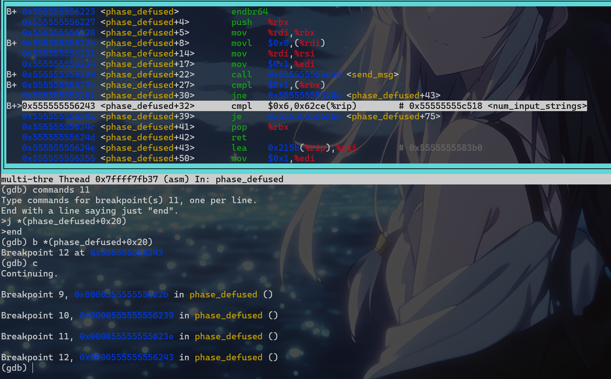

接着看源码，发现``2243``行判断一个内存指向的值，即``num_input_strings``是否为6，如果为6则跳转到``226e``，即魔法函数``abracadabra``的入口处，否则返回。

根据这个变量名，猜测其为输入的字符串数量，因此在这里打一个断点，并使用``info address``指令查看其值：

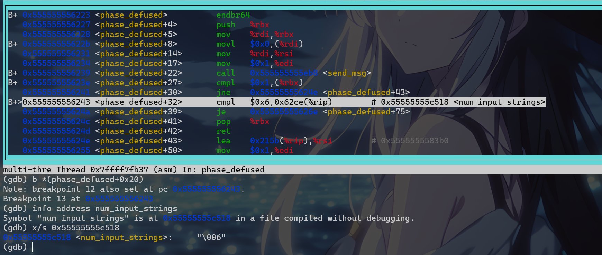

发现确实是6，事实上，在``phase x``执行后的这个函数查看，``num_input_strings``的值都是``x``。

于是，就跳转到魔法函数``abracadabra``处了。

### 魔法函数：阿布拉卡达布拉
回到``phase_defused``函数，关注以下几行：

```asm
    226e:	e8 f1 f3 ff ff       	call   1664 <abracadabra>
    2273:	85 c0                	test   %eax,%eax # %eax!=0，则跳转到返回函数
    2275:	75 1a                	jne    2291 <phase_defused+0x6e>
```

也就是说，只有``abracadabra``函数的返回值``不为0``，才能跳到下个魔法函数``alohomora``的入口，否则就会输出成功信息并且``跳到返回处``。

查看``abracadabra``函数的源码：

```asm
0000000000001664 <abracadabra>:
    1664:	f3 0f 1e fa          	endbr64
    1668:	48 81 ec 98 00 00 00 	sub    $0x98,%rsp # 栈提供空间
    166f:	64 48 8b 04 25 28 00 	mov    %fs:0x28,%rax # 金丝雀值
    1676:	00 00 
    1678:	48 89 84 24 88 00 00 	mov    %rax,0x88(%rsp) # %rax存在 %rsp+136处
    167f:	00 
    1680:	31 c0                	xor    %eax,%eax # %eax=0
    1682:	48 8d 4c 24 0c       	lea    0xc(%rsp),%rcx # %rcx=rsp+12
    1687:	48 8d 54 24 08       	lea    0x8(%rsp),%rdx # %rdx=%rsp+8
    168c:	4c 8d 44 24 10       	lea    0x10(%rsp),%r8 # %r8=%rsp+16
    1691:	48 8d 35 c3 2a 00 00 	lea    0x2ac3(%rip),%rsi        # 415b <_IO_stdin_used+0x15b> 
    1698:	48 8d 3d e9 6f 00 00 	lea    0x6fe9(%rip),%rdi        # 8688 <input_strings+0x168>
    169f:	e8 9c fc ff ff       	call   1340 <__isoc99_sscanf@plt>
    16a4:	83 f8 03             	cmp    $0x3,%eax # %eax=3，跳转16c9
    16a7:	74 20                	je     16c9 <abracadabra+0x65>  
    16a9:	b8 00 00 00 00       	mov    $0x0,%eax # eax=0
    16ae:	48 8b 94 24 88 00 00 	mov    0x88(%rsp),%rdx # %rdx=%rax
    16b5:	00 
    16b6:	64 48 2b 14 25 28 00 	sub    %fs:0x28,%rdx # 检验金丝雀
    16bd:	00 00 
    16bf:	75 2b                	jne    16ec <abracadabra+0x88> 
    16c1:	48 81 c4 98 00 00 00 	add    $0x98,%rsp # 栈空间回传
    16c8:	c3                   	ret
    16c9:	48 8d 7c 24 10       	lea    0x10(%rsp),%rdi
    16ce:	48 8d 35 93 2a 00 00 	lea    0x2a93(%rip),%rsi        # 4168 <_IO_stdin_used+0x168>
    16d5:	e8 2b 06 00 00       	call   1d05 <strings_not_equal>
    16da:	85 c0                	test   %eax,%eax # eax==0则跳转到16e5，但是此处要让它跳，因此需要输入相同的strings
    16dc:	74 07                	je     16e5 <abracadabra+0x81>
    16de:	b8 00 00 00 00       	mov    $0x0,%eax
    16e3:	eb c9                	jmp    16ae <abracadabra+0x4a> # 回跳，这个分支不能让它进
    16e5:	b8 01 00 00 00       	mov    $0x1,%eax # eax=1
    16ea:	eb c2                	jmp    16ae <abracadabra+0x4a> # 回跳
    16ec:	e8 af fb ff ff       	call   12a0 <__stack_chk_fail@plt>
```

可以看到，它通过调用``sscanf``函数读入一个字符串，回顾``Phase 2``中``sscanf``函数的签名：

```
int sscanf(const char *str, const char *format, ...);
```

- ``str``：要读取的字符串
- ``format``：指定输入格式控制
- ``...``：可变数量的额外参数
- 返回值：读入的参数个数

再对照源码，即可以发现此处传入的``rdi``和``rsi``参数可以通过``info address``查看，在``16a4``处打上断点，运行命令查看其内容：

```
b *(abracadabra+0x40)
c
info address _IO_stdin_used
x/s ??+0x15b # 此处??为显示的地址
info address input_strings
x/s ??+0x168 # 此处??为显示的地址
```

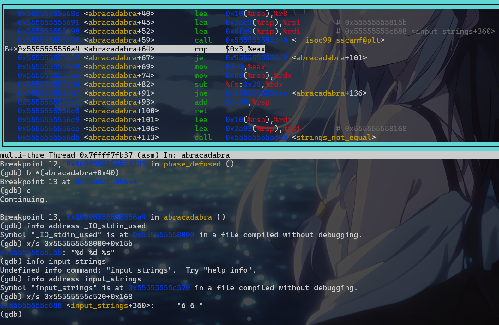

可以观察到，要求输入两个数字和一个字符串，刚好与``16a4``处判断读入参数个数是否为3，若否则将返回值置为0并返回相呼应，因为前面分析过``abracadabra``的``返回值必须不为0``才能进入``alohomora``函数。

同时发现，通过``input_strings``读出的这两个数字恰，是``Phase 4``中得到的答案。

这仿佛在暗示，需要在``Phase 4``的答案后填上一个字符串，但是这个字符串是什么，还需要再看后面的源码。

接着阅读，发现判断是否为3后，跳转到了``16e9``处。

这里调用了``strings_not_equal``函数，若它的返回值为``0``则跳转到``16e5``处，将``abracadabra``函数的返回值赋为1，反之赋为0。

也就是说，这里需要让``strings_not_equal``函数的返回值为``0``，回顾``Phase 1``中这个函数的定义。

得到，``strings_not_equal``传入两个参数，``rdi``为读入的参数(本题中可观察发现其为上面读入的第三个参数，即``读入的字符串``)，``%rsi``为``内存中需要比对的字符串``，若一致则返回``0``，反之返回``1``。

还是按照先前的解法，先在``Phase 4``的答案后面随便加上一个字符串，笔者此处选用的为``elaina``，然后在``调用比对函数前``打个断点，运用``info address``命令读出内存内容。

```
b *(abracadabra+0x76)
c
info address _IO_stdin_used
x/s ??+0x168 # 此处??为显示的地址
```

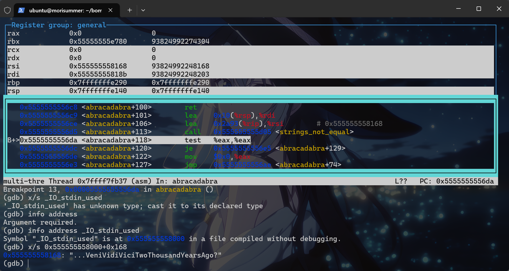

于是，得到了正确的字符串为``...VeniVidiViciTwoThousandYearsAgo?``，将它加入到``Phase 4``的答案后，进入``alohomora``函数。

### 魔法函数：阿拉霍洞开
回到``phase_defused``函数，关注以下几行：

```asm
    2291:	e8 5b f4 ff ff       	call   16f1 <alohomora>
    2296:	85 c0                	test   %eax,%eax # %eax=0，则跳转到返回函数
    2298:	74 30                	je     22ca <phase_defused+0xa7>
    229a:	48 8d 3d 7f 21 00 00 	lea    0x217f(%rip),%rdi        # 4420 <transition_table+0x140>
    22a1:	e8 ca ef ff ff       	call   1270 <puts@plt>
    22a6:	48 8d 3d 9b 21 00 00 	lea    0x219b(%rip),%rdi        # 4448 <transition_table+0x168>
    22ad:	e8 be ef ff ff       	call   1270 <puts@plt>
    22b2:	48 8d 3d c7 21 00 00 	lea    0x21c7(%rip),%rdi        # 4480 <transition_table+0x1a0>
    22b9:	e8 b2 ef ff ff       	call   1270 <puts@plt>
    22be:	b8 00 00 00 00       	mov    $0x0,%eax
    22c3:	e8 f7 f8 ff ff       	call   1bbf <secret_phase>
```

可以看出，``alohomora``函数的返回值，需要``不为0``才能进入``secret phase``，否则会跳转到返回函数。

查看``alohomora``函数的源码：

```asm
00000000000016f1 <alohomora>:
    16f1:	f3 0f 1e fa          	endbr64
    16f5:	48 81 ec 88 00 00 00 	sub    $0x88,%rsp # 分配堆空间
    16fc:	64 48 8b 04 25 28 00 	mov    %fs:0x28,%rax # 金丝雀值
    1703:	00 00 
    1705:	48 89 44 24 78       	mov    %rax,0x78(%rsp) # (rsp+120)=%rax
    170a:	31 c0                	xor    %eax,%eax # %eax=0
    170c:	48 8d 05 85 6e 00 00 	lea    0x6e85(%rip),%rax        # 8598 <input_strings+0x78> # %rax=?
    1713:	eb 04                	jmp    1719 <alohomora+0x28>
    1715:	48 83 c0 01          	add    $0x1,%rax # rax往前移动一个字节
    1719:	80 38 00             	cmpb   $0x0,(%rax) # (%rax)!=0，则跳转回加1处
    171c:	75 f7                	jne    1715 <alohomora+0x24>
    171e:	48 83 e8 01          	sub    $0x1,%rax # rax减去，得到最后一个字符
    1722:	48 89 e2             	mov    %rsp,%rdx # rdx=rsp
    1725:	eb 0a                	jmp    1731 <alohomora+0x40> 
    1727:	88 0a                	mov    %cl,(%rdx) # (%rdx)=%cl，注意此时%rdx是%rsp+?，因此在缓冲区
    1729:	48 83 c2 01          	add    $0x1,%rdx # 相当于存进栈
    172d:	48 83 e8 01          	sub    $0x1,%rax # %rax回退
    1731:	0f b6 08             	movzbl (%rax),%ecx # %ecx=(%rax)
    1734:	80 f9 20             	cmp    $0x20,%cl # %cl==32，若是空格则跳转
    1737:	74 0c                	je     1745 <alohomora+0x54> #
    1739:	48 8d 35 58 6e 00 00 	lea    0x6e58(%rip),%rsi        # 8598 <input_strings+0x78>
    1740:	48 39 f0             	cmp    %rsi,%rax # 若不等于字符串开头，则回跳到1727
    1743:	75 e2                	jne    1727 <alohomora+0x36> 
    1745:	c6 02 00             	movb   $0x0,(%rdx) # (%rdx)=0
    1748:	48 89 e7             	mov    %rsp,%rdi # %rdi=%rsp，即%rdx对应的字符串开头，这里反转了
    174b:	48 8d 35 3e 2a 00 00 	lea    0x2a3e(%rip),%rsi        # 4190 <_IO_stdin_used+0x190> # 传入一个字符串比较
    1752:	e8 ae 05 00 00       	call   1d05 <strings_not_equal> 
    1757:	85 c0                	test   %eax,%eax # eax=0,则跳转到赋值为1部分，需要让它跳，即字符串相等
    1759:	74 1d                	je     1778 <alohomora+0x87>
    175b:	b8 00 00 00 00       	mov    $0x0,%eax # eax=0
    1760:	48 8b 54 24 78       	mov    0x78(%rsp),%rdx # 金丝雀值检测 
    1765:	64 48 2b 14 25 28 00 	sub    %fs:0x28,%rdx 
    176c:	00 00 
    176e:	75 0f                	jne    177f <alohomora+0x8e> 
    1770:	48 81 c4 88 00 00 00 	add    $0x88,%rsp
    1777:	c3                   	ret
    1778:	b8 01 00 00 00       	mov    $0x1,%eax
    177d:	eb e1                	jmp    1760 <alohomora+0x6f>
    177f:	e8 1c fb ff ff       	call   12a0 <__stack_chk_fail@plt>
```

可以发现，它首先将``%rax``赋值成为一个不知道是啥的东西，还是老方法，打上断点使用``info address``命令查找：

```
b *(alohomora+0x1B)
c
info address input_strings
x/s ??+0x78 # 此处??为显示的地址
```

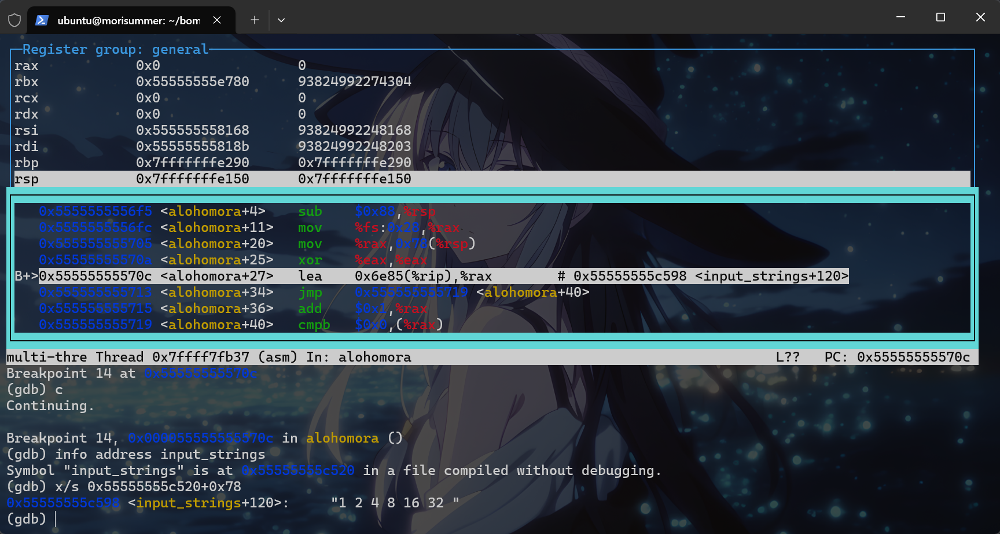

发现，这是``Phase 2``的答案，仿佛又在暗示着，这个魔法函数的答案与之有关。

接着观察``1715``到``1719``的循环，发现它将``rax``遍历到上面提取出的字符串的结尾``NULL``处。

```asm
    1715:	48 83 c0 01          	add    $0x1,%rax # rax往前移动一个字节
    1719:	80 38 00             	cmpb   $0x0,(%rax) # (%rax)!=0，则跳转回加1处
    171c:	75 f7                	jne    1715 <alohomora+0x24>
```

同时，再阅读``171e``到``1743``的循环。

```asm
   171e:	48 83 e8 01          	sub    $0x1,%rax # rax减去，得到最后一个字符
    1722:	48 89 e2             	mov    %rsp,%rdx # rdx=rsp
    1725:	eb 0a                	jmp    1731 <alohomora+0x40> 
    1727:	88 0a                	mov    %cl,(%rdx) # (%rdx)=%cl，注意此时%rdx是%rsp+?，因此在缓冲区
    1729:	48 83 c2 01          	add    $0x1,%rdx # 相当于存进栈
    172d:	48 83 e8 01          	sub    $0x1,%rax # %rax回退
    1731:	0f b6 08             	movzbl (%rax),%ecx # %ecx=(%rax)
    1734:	80 f9 20             	cmp    $0x20,%cl # %cl==32，若是空格则跳转
    1737:	74 0c                	je     1745 <alohomora+0x54> #
    1739:	48 8d 35 58 6e 00 00 	lea    0x6e58(%rip),%rsi        # 8598 <input_strings+0x78>
    1740:	48 39 f0             	cmp    %rsi,%rax # 若不等于字符串开头，则回跳到1727
    1743:	75 e2                	jne    1727 <alohomora+0x36> 
```

发现它的逻辑如下：

随着``%rax``每次``回退``，将当前的字符``存入栈顶``，然后``栈顶增长``，若遇到``当前字符为空格``或者``为原字符串开头``，则跳出循环。

结合前面是``Phase 2``的答案，因此肯定是遇到当前字符为空格时跳出循环。

再阅读最后一部分：

```asm
    1745:	c6 02 00             	movb   $0x0,(%rdx) # (%rdx)=0
    1748:	48 89 e7             	mov    %rsp,%rdi # %rdi=%rsp，即%rdx对应的字符串开头，这里反转了
    174b:	48 8d 35 3e 2a 00 00 	lea    0x2a3e(%rip),%rsi        # 4190 <_IO_stdin_used+0x190> # 传入一个字符串比较
    1752:	e8 ae 05 00 00       	call   1d05 <strings_not_equal> 
    1757:	85 c0                	test   %eax,%eax # eax=0,则跳转到赋值为1部分，需要让它跳，即字符串相等
    1759:	74 1d                	je     1778 <alohomora+0x87>
    175b:	b8 00 00 00 00       	mov    $0x0,%eax # eax=0
    1760:	48 8b 54 24 78       	mov    0x78(%rsp),%rdx # 金丝雀值检测 
    1765:	64 48 2b 14 25 28 00 	sub    %fs:0x28,%rdx 
    176c:	00 00 
    176e:	75 0f                	jne    177f <alohomora+0x8e> 
    1770:	48 81 c4 88 00 00 00 	add    $0x88,%rsp
    1777:	c3                   	ret
    1778:	b8 01 00 00 00       	mov    $0x1,%eax
    177d:	eb e1                	jmp    1760 <alohomora+0x6f>
    177f:	e8 1c fb ff ff       	call   12a0 <__stack_chk_fail@plt>  
```

发现其首先将``%rdx``置为0，随后传入一个内存中的字符串为``%rsi``，将刚刚提取到栈中的字符串作为``%rdi``，再调用``strings_not_equal``函数。

接着，若函数返回值为``0``，则跳转到``1778``处将返回值赋为1，反之将返回值赋为0，由上述条件知，``alohomora``的返回值必须为``1``，因此此处的字符串需与内存中字符串相等。

仍然在``Phase 2``答案后加上随便一个字符串，此处笔者选用的仍为``elaina``，采用打断点并采用``info address``的方法，查找比对字符串的内容：

```
b *(alohomora+0x61)
c
info address _IO_stdin_used
x/s ??+0x190 # 此处??为显示的地址
```

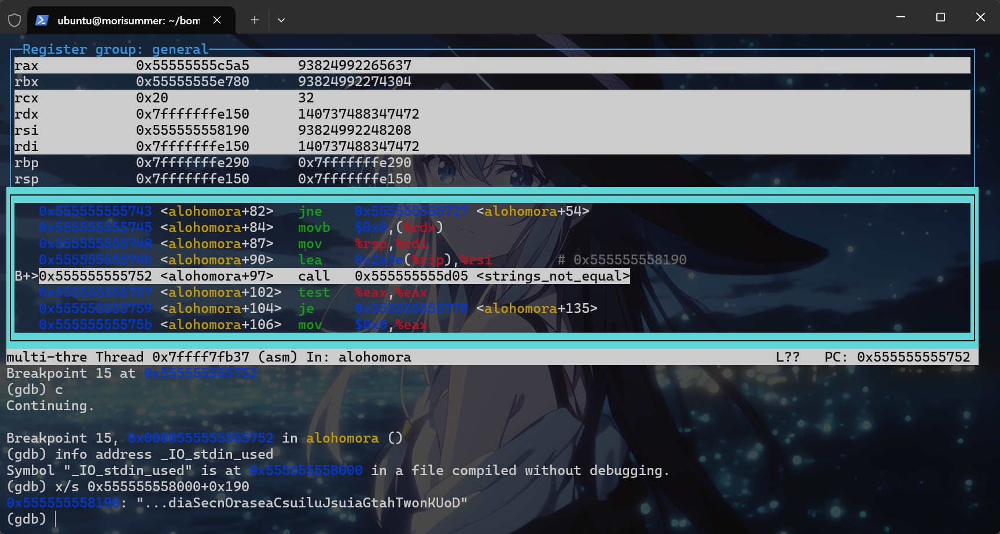

注意得到的字符串，由于上述``%rax``的行为是回退的，因此传入栈中和比对的字符串为``反转后的字符串``，需要将其反转回来，得到答案为``DoUKnowThatGaiusJuliusCaesarOnceSaid...``。

将其加到``Phase 2``答案之后，在``secret phase``调用前加上断点，运行``gdb``调试程序，如下：

```
b *(phase_defused+0xA0)
c
```

得到以下输出，表示进入了``secret phase``，但是真正的难题现在才开始！


笔者注：其实两句魔法函数的答案连起来就是``DoUKnowThatGaiusJuliusCaesarOnceSaid......VeniVidiViciTwoThousandYearsAgo?``，意为"你知道两千年前凯撒曾经说过，'我来了，我看见了，我征服了'吗？"

### Secret Phase与状态同步
查看``secret_phase``函数的源码：

```asm
0000000000001bbf <secret_phase>:
    1bbf:	f3 0f 1e fa          	endbr64
    1bc3:	55                   	push   %rbp # %rbp进栈
    1bc4:	53                   	push   %rbx # %rbx进栈
    1bc5:	48 83 ec 18          	sub    $0x18,%rsp # %rsp分配空间
    1bc9:	64 48 8b 04 25 28 00 	mov    %fs:0x28,%rax # 金丝雀值
    1bd0:	00 00 
    1bd2:	48 89 44 24 08       	mov    %rax,0x8(%rsp) 
    1bd7:	31 c0                	xor    %eax,%eax # eax=0
    1bd9:	e8 07 05 00 00       	call   20e5 <read_line> # 调用real_line，读入一行
    1bde:	48 89 c5             	mov    %rax,%rbp # %rbp=%rax，即读入的字符串
    1be1:	bb 00 00 00 00       	mov    $0x0,%ebx # ebx=0，跳转
    1be6:	eb 03                	jmp    1beb <secret_phase+0x2c> 
    1be8:	83 c3 01             	add    $0x1,%ebx  # ebx+=1
    1beb:	48 63 c3             	movslq %ebx,%rax # rax=ebx
    1bee:	80 7c 05 00 00       	cmpb   $0x0,0x0(%rbp,%rax,1) # 若(rbp+rax)=NULL，则跳转，这里取得是读入的第ebx个字符
    1bf3:	74 0c                	je     1c01 <secret_phase+0x42> 
    1bf5:	83 fb 10             	cmp    $0x10,%ebx # 若ebx<=16，则跳转，否则爆炸，注意此处先判断NULL，因此最多可以输入17个字符
    1bf8:	7e ee                	jle    1be8 <secret_phase+0x29>
    1bfa:	e8 1b 04 00 00       	call   201a <explode_bomb>
    1bff:	eb e7                	jmp    1be8 <secret_phase+0x29> 
    1c01:	48 89 ef             	mov    %rbp,%rdi # rdi=读入字符串
    1c04:	e8 6c ff ff ff       	call   1b75 <check_synchronizing_sequence> # 调用这个函数
    1c09:	85 c0                	test   %eax,%eax # eax!=0，则跳转爆炸，因此需要eax=0
    1c0b:	75 45                	jne    1c52 <secret_phase+0x93>
    1c0d:	48 8d 3d c4 25 00 00 	lea    0x25c4(%rip),%rdi        # 41d8 <_IO_stdin_used+0x1d8>
    1c14:	e8 57 f6 ff ff       	call   1270 <puts@plt>
    1c19:	48 8d 3d e8 25 00 00 	lea    0x25e8(%rip),%rdi        # 4208 <_IO_stdin_used+0x208>
    1c20:	e8 4b f6 ff ff       	call   1270 <puts@plt>
    1c25:	48 8d 3d 34 26 00 00 	lea    0x2634(%rip),%rdi        # 4260 <_IO_stdin_used+0x260>
    1c2c:	e8 3f f6 ff ff       	call   1270 <puts@plt>
    1c31:	48 8d 7c 24 04       	lea    0x4(%rsp),%rdi # 打印三个语句
    1c36:	e8 e8 05 00 00       	call   2223 <phase_defused> # 调用phase_defused
    1c3b:	48 8b 44 24 08       	mov    0x8(%rsp),%rax # 金丝雀值
    1c40:	64 48 2b 04 25 28 00 	sub    %fs:0x28,%rax 
    1c47:	00 00 
    1c49:	75 0e                	jne    1c59 <secret_phase+0x9a>
    1c4b:	48 83 c4 18          	add    $0x18,%rsp # 恢复栈结构
    1c4f:	5b                   	pop    %rbx # 恢复rbx
    1c50:	5d                   	pop    %rbp # 恢复rbp
    1c51:	c3                   	ret # 返回
    1c52:	e8 c3 03 00 00       	call   201a <explode_bomb>
    1c57:	eb b4                	jmp    1c0d <secret_phase+0x4e>
    1c59:	e8 42 f6 ff ff       	call   12a0 <__stack_chk_fail@plt>
```

先看到它调用了``read_line``函数，会发现这个函数在之前的``phase``中都没出现过，怎么办？

搜索发现，``main``函数是调用``read_line``函数的，看看：

```asm
    1543:	e8 9d 0b 00 00       	call   20e5 <read_line>
    1548:	48 89 c7             	mov    %rax,%rdi
    154b:	e8 34 02 00 00       	call   1784 <phase_1>
    1550:	48 89 df             	mov    %rbx,%rdi
    1553:	e8 cb 0c 00 00       	call   2223 <phase_defused>
```

也就是说，这个函数读取一行新的答案，然后存在``%rax``中。

然后，阅读``1c01``到``1bfa``部分：

```asm
    1be8:	83 c3 01             	add    $0x1,%ebx  # ebx+=1
    1beb:	48 63 c3             	movslq %ebx,%rax # rax=ebx
    1bee:	80 7c 05 00 00       	cmpb   $0x0,0x0(%rbp,%rax,1) # 若(rbp+rax)=NULL，则跳转，这里取得是读入的第ebx个字符
    1bf3:	74 0c                	je     1c01 <secret_phase+0x42> 
    1bf5:	83 fb 10             	cmp    $0x10,%ebx # 若ebx<=16，则跳转，否则爆炸，注意此处先判断NULL，因此最多可以输入17个字符
    1bf8:	7e ee                	jle    1be8 <secret_phase+0x29>
    1bfa:	e8 1b 04 00 00       	call   201a <explode_bomb>
```

这个循环计算读入的字符串大小是否小于等于17，否则爆炸。注意是17而不是16，因为对结尾``NULL``的判断跳转在长度判断跳转之前。

接着阅读``1c01``到``1cf9``部分：

```asm
    1c01:	48 89 ef             	mov    %rbp,%rdi # rdi=读入字符串
    1c04:	e8 6c ff ff ff       	call   1b75 <check_synchronizing_sequence> # 调用这个函数
    1c09:	85 c0                	test   %eax,%eax # eax!=0，则跳转爆炸，因此需要eax=0
    1c0b:	75 45                	jne    1c52 <secret_phase+0x93>
    1c0d:	48 8d 3d c4 25 00 00 	lea    0x25c4(%rip),%rdi        # 41d8 <_IO_stdin_used+0x1d8>
    1c14:	e8 57 f6 ff ff       	call   1270 <puts@plt>
    1c19:	48 8d 3d e8 25 00 00 	lea    0x25e8(%rip),%rdi        # 4208 <_IO_stdin_used+0x208>
    1c20:	e8 4b f6 ff ff       	call   1270 <puts@plt>
    1c25:	48 8d 3d 34 26 00 00 	lea    0x2634(%rip),%rdi        # 4260 <_IO_stdin_used+0x260>
    1c2c:	e8 3f f6 ff ff       	call   1270 <puts@plt>
    1c31:	48 8d 7c 24 04       	lea    0x4(%rsp),%rdi # 打印三个语句
    1c36:	e8 e8 05 00 00       	call   2223 <phase_defused> # 调用phase_defused
    1c3b:	48 8b 44 24 08       	mov    0x8(%rsp),%rax # 金丝雀值
    1c40:	64 48 2b 04 25 28 00 	sub    %fs:0x28,%rax 
    1c47:	00 00 
    1c49:	75 0e                	jne    1c59 <secret_phase+0x9a>
    1c4b:	48 83 c4 18          	add    $0x18,%rsp # 恢复栈结构
    1c4f:	5b                   	pop    %rbx # 恢复rbx
    1c50:	5d                   	pop    %rbp # 恢复rbp
    1c51:	c3                   	ret # 返回
    1c52:	e8 c3 03 00 00       	call   201a <explode_bomb>
    1c57:	eb b4                	jmp    1c0d <secret_phase+0x4e>
    1c59:	e8 42 f6 ff ff       	call   12a0 <__stack_chk_fail@plt>
```

可以看到，它首先调用``check_synchronizing_sequence``这个函数，若返回值不为``0``，则跳转到``1c52``处进行爆炸。

否则，打印三个语句，并调用``phase_defused``函数表示已经破解这个``phase``。

查看``check_synchronizing_sequence``函数的源码：

```asm
0000000000001b75 <check_synchronizing_sequence>:
    1b75:	f3 0f 1e fa          	endbr64 
    1b79:	41 54                	push   %r12 # r12进栈
    1b7b:	55                   	push   %rbp # rbp进栈
    1b7c:	53                   	push   %rbx # rbx进栈
    1b7d:	48 89 fd             	mov    %rdi,%rbp # rbp=rdi，即读入字符串
    1b80:	48 89 fe             	mov    %rdi,%rsi # rsi=rdi，即读入字符串
    1b83:	bf 00 00 00 00       	mov    $0x0,%edi # edi=0
    1b88:	e8 91 ff ff ff       	call   1b1e <emulate_fsm> # 调用这个函数
    1b8d:	41 89 c4             	mov    %eax,%r12d # r12d=eax
    1b90:	bb 01 00 00 00       	mov    $0x1,%ebx # ebx=1
    1b95:	83 fb 06             	cmp    $0x6,%ebx # 若ebx>6，则跳转到赋值为0并返回
    1b98:	7f 14                	jg     1bae <check_synchronizing_sequence+0x39>
    1b9a:	48 89 ee             	mov    %rbp,%rsi # rsi=rbp，也就是读入字符串
    1b9d:	89 df                	mov    %ebx,%edi # edi=ebx
    1b9f:	e8 7a ff ff ff       	call   1b1e <emulate_fsm> # 调用这个函数
    1ba4:	44 39 e0             	cmp    %r12d,%eax # 比较第一次的返回结果和当前返回结果，若不等于则跳转到赋值为-1处并返回
    1ba7:	75 0f                	jne    1bb8 <check_synchronizing_sequence+0x43>
    1ba9:	83 c3 01             	add    $0x1,%ebx # ebx+=1
    1bac:	eb e7                	jmp    1b95 <check_synchronizing_sequence+0x20> # 回跳
    1bae:	b8 00 00 00 00       	mov    $0x0,%eax
    1bb3:	5b                   	pop    %rbx
    1bb4:	5d                   	pop    %rbp
    1bb5:	41 5c                	pop    %r12
    1bb7:	c3                   	ret
    1bb8:	b8 ff ff ff ff       	mov    $0xffffffff,%eax
    1bbd:	eb f4                	jmp    1bb3 <check_synchronizing_sequence+0x3e>
```

大致可以发现，这个函数先将读入的字符串传给``emulate_fsm``函数，作为``%rsi``，即第二个参数，再将``0``作为第一个参数，即``%rdi``，传给它，得到一个返回值并保存。

随后，随着循环中``%ebx``不断从 $1$ 增加到 $6$ ，每次还是把它作为第一个参数，读入字符串作为第二个参数，传给``emulate_fsm``。

每次得到的返回值与``%ebx==0``时得到的返回值比较，若不等于则跳转到``1bb8``处，将``%eax``赋值为``-1``返回，这不满足上文中``check_synchronizing_sequence``需要返回``0``的条件。

因此得出，对于每次从0到6的迭代，``emulate_fsm``函数的返回值都相等，那么接下来就是``emulate_fsm``函数的逻辑了。

### 有限状态自动机/FSM

查看``emulate_fsm``函数的源码：

```asm
0000000000001b1e <emulate_fsm>:
    1b1e:	f3 0f 1e fa          	endbr64
    1b22:	55                   	push   %rbp # rbp进栈
    1b23:	53                   	push   %rbx # rbx进栈
    1b24:	48 83 ec 08          	sub    $0x8,%rsp # 分配栈空间
    1b28:	89 fd                	mov    %edi,%ebp # ebp=edi，即迭代次数
    1b2a:	48 89 f3             	mov    %rsi,%rbx # rbx=rsi，即读入字符串
    1b2d:	eb 28                	jmp    1b57 <emulate_fsm+0x39> # 跳转
    1b2f:	0f be 03             	movsbl (%rbx),%eax # eax=(rbx)，即当前字符
    1b32:	83 e8 30             	sub    $0x30,%eax # eax-=48，计算关于0的偏移量
    1b35:	48 63 ed             	movslq %ebp,%rbp # ebp拓展
    1b38:	48 98                	cltq
    1b3a:	48 8d 14 c5 00 00 00 	lea    0x0(,%rax,8),%rdx # rdx=当前字符*8
    1b41:	00 
    1b42:	48 29 c2             	sub    %rax,%rdx # rdx=当前字符*7
    1b45:	48 8d 04 2a          	lea    (%rdx,%rbp,1),%rax # rax=当前状态+当前字符*7
    1b49:	48 8d 15 90 27 00 00 	lea    0x2790(%rip),%rdx        # 42e0 <transition_table> # rdx=转移表
    1b50:	8b 2c 82             	mov    (%rdx,%rax,4),%ebp # ebp=rdx+4*rax，即转移表中的数值
    1b53:	48 83 c3 01          	add    $0x1,%rbx # rbx++
    1b57:	0f b6 03             	movzbl (%rbx),%eax # eax=(rbx)，即当前字符
    1b5a:	84 c0                	test   %al,%al # 若eax==NULL，则跳转到返回处
    1b5c:	74 0e                	je     1b6c <emulate_fsm+0x4e> 
    1b5e:	83 e8 30             	sub    $0x30,%eax # eax-=48，计算关于0的偏移量
    1b61:	3c 01                	cmp    $0x1,%al # 若al<=1，则回跳，否则爆炸，意思是只能是0和1
    1b63:	76 ca                	jbe    1b2f <emulate_fsm+0x11>
    1b65:	e8 b0 04 00 00       	call   201a <explode_bomb>
    1b6a:	eb c3                	jmp    1b2f <emulate_fsm+0x11>
    1b6c:	89 e8                	mov    %ebp,%eax # eax=ebp
    1b6e:	48 83 c4 08          	add    $0x8,%rsp # 恢复栈空间
    1b72:	5b                   	pop    %rbx # 恢复rbx
    1b73:	5d                   	pop    %rbp # 恢复rbp
    1b74:	c3                   	ret
```

阅读``1b2f``到``1b6a``部分：

```asm
    1b2f:	0f be 03             	movsbl (%rbx),%eax # eax=(rbx)，即当前字符
    1b32:	83 e8 30             	sub    $0x30,%eax # eax-=48，计算关于0的偏移量
    1b35:	48 63 ed             	movslq %ebp,%rbp # ebp拓展
    1b38:	48 98                	cltq
    1b3a:	48 8d 14 c5 00 00 00 	lea    0x0(,%rax,8),%rdx # rdx=当前字符*8
    1b41:	00 
    1b42:	48 29 c2             	sub    %rax,%rdx # rdx=当前字符*7
    1b45:	48 8d 04 2a          	lea    (%rdx,%rbp,1),%rax # rax=当前状态+当前字符*7
    1b49:	48 8d 15 90 27 00 00 	lea    0x2790(%rip),%rdx        # 42e0 <transition_table> # rdx=转移表
    1b50:	8b 2c 82             	mov    (%rdx,%rax,4),%ebp # ebp=rdx+4*rax，即转移表中的数值
    1b53:	48 83 c3 01          	add    $0x1,%rbx # rbx++
    1b57:	0f b6 03             	movzbl (%rbx),%eax # eax=(rbx)，即当前字符
    1b5a:	84 c0                	test   %al,%al # 若eax==NULL，则跳转到返回处
    1b5c:	74 0e                	je     1b6c <emulate_fsm+0x4e> 
    1b5e:	83 e8 30             	sub    $0x30,%eax # eax-=48，计算关于0的偏移量
    1b61:	3c 01                	cmp    $0x1,%al # 若al<=1，则回跳，否则爆炸，意思是只能是0和1
    1b63:	76 ca                	jbe    1b2f <emulate_fsm+0x11>
    1b65:	e8 b0 04 00 00       	call   201a <explode_bomb>
    1b6a:	eb c3                	jmp    1b2f <emulate_fsm+0x11>
```

大致可以看出，它首先遍历输入字符串，在``1b5c``处若遍历到结尾``NULL``，则跳转到返回部分。

随后，对于每个字符减去48，查询``ASCII``表发现``48``表示的是数字``0``，因此由``1b61``处的判断得出字符串的结构只能是``0``和``1``，否则会跳转到爆炸。

接着，观察得到``%rax``被更新为``当前字符(0或1)*7+%rbp``，``%rdx``被更新为某个不知道是啥的东西，看着像某个表的开头，随后``%ebp``被更新为``(%rdx+4*%rax)``。

如此循环，直到整个读入字符串被遍历完，于是当前``%ebp``被复制到返回值传回。

现在，还是容易一头雾水，但是从函数标题可以得出一些端倪，``fsm``，即有限状态自动机，可以查询其含义如下：

FSM(Finite State Machine，有限状态自动机)是一种用来描述系统在``有限个状态``之间如何``随输入变化而转移``的数学模型，常用于建模``有明确状态、状态可切换``的过程。

它通常由以下要素组成：

- 状态集合：系统可能处于的有限个状态，如``S0,S1,S2``等。
- 初始状态：系统开始时所处的状态。
- 输入集合：能触发状态变化的输入或事件。
- 状态转移函数：描述了在某个状态下，遇到某个输入，会转移到哪个状态。

于是，可以得到，本题的要素就是分别从初始状态 $0 \sim 6$ 跑一遍FSM，需要找出使其终止状态相等的输入集合，即输入字符串。

结合注释的英文，可以认识到``transition table``就是本题的状态转移表，同时发现它一共有 $7 \times 2=14$ 种情况，同时从``%ebp``的更新函数得出其中每个元素占``4字节``。

因此在``psol.txt``的第七行随便填上一个二进制字符串，笔者选择的是``11111111``，在``1b49``处打断点，读出其值，一共需要读取``56个字节``。

```
b *(emulate_fsm+0x2B)
c
info address transition_table
x/14x ?? # 此处??为显示的地址
```

得到以下输出：

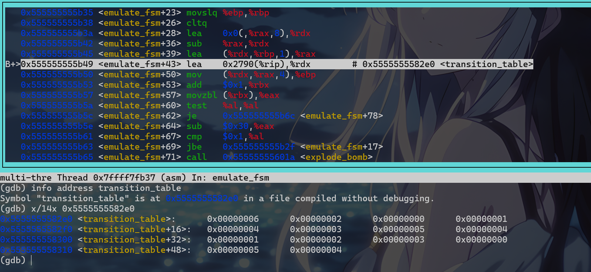

于是，根据上述``%ebp``的更新公式，可以得到``fsm``各状态对应的转移表：

|     |  0  |  1  |  2  |  3  |  4  |  5  |  6  | 
| --- | --- | --- | --- | --- | --- | --- | --- |
|  0  |  6  |  0  |  4  |  5  |  1  |  3  |  5  |
|  1  |  2  |  1  |  3  |  4  |  2  |  0  |  4  |

笔者注：每个炸弹的转移表可能不相同，因此请以实际情况为准。

下面，就是计算答案字符串的部分了，需要使用一些算法知识编写程序进行求解。

### 编程：状压BFS求答案
首先，需要对这个问题进行建模。

也就是，现在有 $ 0 \sim 6 $ 这6个初始状态，每个状态都有对应的``0``和``1``状态转移表，需要在执行某个字符串后，最终得到的状态相等。

这可以看成一个图论问题，也可以看成一个更抽象的状态转移问题，不过相同的一点是，都需要使用``BFS``算法进行求解。

但是，最后一个难题是，这道题与常规课程用``BFS``解决的问题相比，似乎没有比较显著的求解特征。

由于笔者有一点微不足道的算法竞赛背景，因此先写出``cpp``代码，再进行解释：

```cpp
#include <bits/stdc++.h>
#define ll long long
#define ull unsigned long long
#define lowbit(x) (x & (-x))
using namespace std;
void solve() {
    vector<vector<int>> dp(7, vector<int>(2));
    for (int i = 0; i <= 6; i++) {
        cin >> dp[i][0] >> dp[i][1];
    }
    int st = (1 << 7) - 1;
    queue<int> q;
    unordered_map<int, int> vis;
    unordered_map<int, int> pre;
    unordered_map<int, char> pre_c;
    q.push(st);
    vis[st] = 1;
    int target;
    while (!q.empty()) {
        auto node = q.front();
        q.pop();
        if ((node & (node - 1)) == 0) {
            target = node;
            break;
        }
        for (int i = 0; i <= 1; i++) {
            int tem = 0;
            for (int j = 0; j <= 6; j++)
                if (node & (1 << j)) {
                    tem |= (1 << dp[j][i]);
                }
            if (!vis.count(tem)) {
                vis[tem] = 1;
                pre[tem] = node;
                pre_c[tem] = char('0' + i);
                q.push(tem);
            }
        }
    }
    string ans = "";
    for (int cur = target; cur != st; cur = pre[cur]) {
        ans.push_back(pre_c[cur]);
    }
    reverse(ans.begin(), ans.end());
    cout << ans << endl;
    return;
}
int main() {
    cin.tie(nullptr)->sync_with_stdio(false);
    solve();
    return 0;
}
```

在此，笔者为这段代码进行解释，只需要关注``solve``函数的内容。

首先，这段代码并不是以传统的 $0 \sim 6$ 分别跑一遍``BFS``来实现的，否则时间复杂度会爆炸。

可以采用另外一种解决方法，假设 $0 \sim 6$ 同时开始跑，只需要计算在某个阶段，``只剩下一个状态``，那么就可以得到解了。

注意到，在任意步长时， $0 \sim 6$ 中的每个状态，都只可能有两种情况，即``包含于``当前的状态集合，或者``不包含于``当前的状态集合。

于是，可以采用``状态压缩``的思想，即将当前步长的每个状态的情况转化为``0和1``，一共有 $1<<6=128$ 种情况。

从而，可以用一个小于等于 $127$ 的数表示当前步长的状态集合。

然后只需要考虑搜索到``当前队列中的数``的``二进制位``中，``只存在一个1``，就能得到解答了。

注意，由于最终需要求出字符串，因此需要记录``搜索路径的前驱字符串``和``前驱集合``，从而在找到解答后回溯求解。
 
将上文得到的转移表作为输入，运行这段代码，得到答案如下：

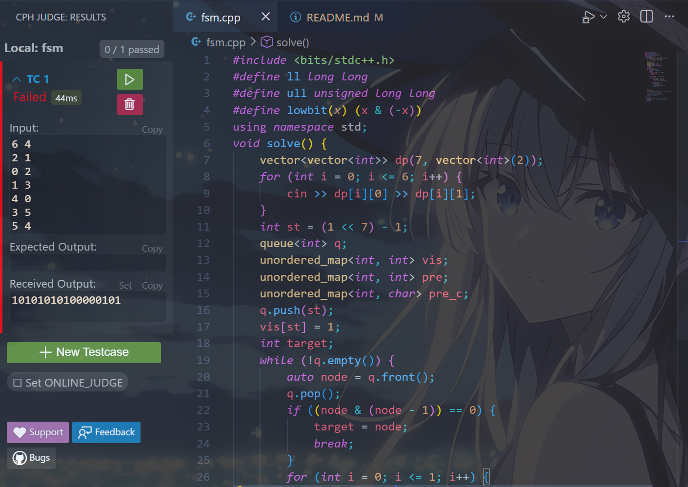

将答案写到``psol.txt``的第七行，重新打开``gdb``调试器，运行代码，注意不要忘了``越过判定与信息传送函数``一节中提到的``断点编程``部分。

在``Secret Phase``中打上一个断点，防止其调用``phase_defused``函数并向服务器发送信息(DDL内完成可以忽略此步)。

得到以下结果，表示完成了``Secret Phase``：

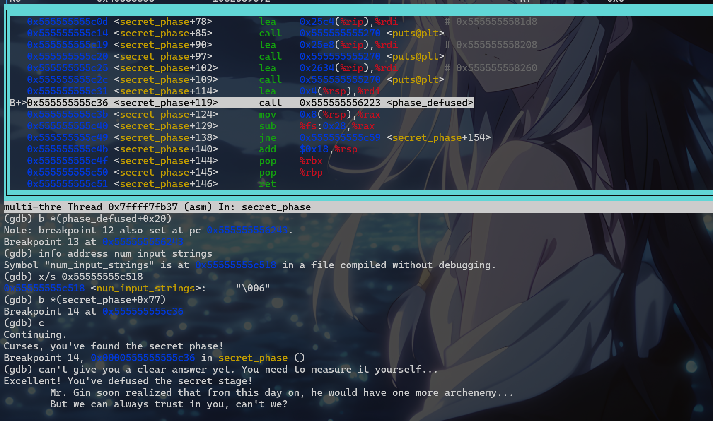

于是，真正意义上攻克了ICS的第二个Lab，Congratulations！

## 参考文献
[Arthals-更适合北大宝宝体质的Bomb Lab踩坑记](https://arthals.ink/blog/bomb-lab#phase-6)