# 从零开始的Cache Lab

> [!CAUTION]
> 
> **本笔记仅供参考，请勿抄袭。**

## 声明
本笔记的写作初衷在于，笔者在做Cache Lab的时候受到Arthals学长很大启发，同时25Fall的计算机系统导论课程改制增加了10分的Lab测试（虽然往年的期中期末中也会有一两道Lab相关选择题，但分值不大）。故将心路历程写成此笔记，以便复习，并供后续选课同学参考。

## Cache Lab简要介绍
Cache Lab是《计算机系统导论》课程的第5个Lab，对应教材第六章《存储器层次结构》。该Lab旨在加强同学们对缓存机制的理解，以及利用分块机制优化缓存的能力。

在``Cache Lab``中，共有两个``Part``，即``part A``和``part B``，分别为``27pts``和``26pts``，此外还有``7pts``的代码风格分，由助教手动评定，最终分数将由``60pts``线性缩放为``100pts``。

在``Part A``中，需要使用C语言``从零开始编写``一个小型缓存模拟器（约``200-300``行），用于模拟硬件缓存存储器的行为。在``Part B``中，需要分别优化 $32 \times 32$ ， $64 \times 64$ ， $60 \times 68$ 的矩阵转置函数，以最大限度减少缓存不命中次数。

值得一提的是，此Lab相比``Arch Lab``，受到PKU助教团队的~~魔改~~加强极少，仅将原版本极水的 $61 \times 67$ 版本优化改为 $60 \times 68$ 版本优化，此Lab的难度为中低，笔者用时约为 $6 \sim 8$ 小时。

## 在动手之前
### 环境配置
在Cache Lab中，需要配置``Python3``和``Valgrind``，在``PKU CLAB``提供的``ICS``课程专用镜像中，已经安装好了``Python3``，因此只需要安装``Valgrind``。

在终端中运行以下命令:

```bash
sudo apt-get install valgrind
```

即完成安装。

### 代码风格要求
风格扣分如下：

- 缺少或不清晰的``程序头部注释``：``2pts``
- 缺少或不清晰的``函数头部注释``：``1pts/函数``，最多``2pts``
- ``缩进不一致``：``2pts``
- 每行严重超过``80字符``：``1pts/row``，最多``2pts``
- ``错误检查``不足（如malloc等）：``1pts``
- 其它任何显著的可读性问题：``5pts``

正确性扣分如下：

- 违反12个局部变量原则：``5pts``
- 内存泄漏：``2pts``

以上风格扣分最多累计为``7pts``，随后根据线性缩放转化为实际分数。

笔者注：对于缩进，可以使用``Vscode``自带的``shift+alt+f``快捷键进行格式化。

同时，也可以复制到[牛客网](https://www.nowcoder.com/)或者使用``LLVM``配置``Clang-format``进行格式化，笔者由于平时进行``CP``活动，因此配置了``LLVM``，配置时参见教程如下：

[Clang-format配置教程](https://www.bilibili.com/video/BV1LoijexEEF/?spm_id_from=333.337.search-card.all.click&vd_source=70970b39cf6d67117999dda04596cc5a)

### 如何测评
在将代码提交到``AutoLab``之前，可以使用压缩包内附带的测评工具进行测评。

``./test-csim``：对``Part A``进行评分。

``./csim -s 1 -E 1 -b 1 -t traces/yi2.trace``

``./csim -s 4 -E 2 -b 4 -t traces/yi.trace``

``./csim -s 2 -E 1 -b 4 -t traces/dave.trace``

``./csim -s 2 -E 1 -b 3 -t traces/trans.trace``

``./csim -s 2 -E 2 -b 3 -t traces/trans.trace``

``./csim -s 2 -E 4 -b 3 -t traces/trans.trace``

``./csim -s 5 -E 1 -b 5 -t traces/trans.trace``

``./csim -s 5 -E 1 -b 5 -t traces/long.trace``

以上为``Part A``中对八个测试点的独立测评，可将指令中``csim``改为``csim-ref``，以获取每个测试用例的正确结果，亦可使用``-v``命令进行跟踪以debug。

``./test-trans -M 32 -N 32``：测试``Part B``中 $32 \times 32$ 的优化结果。

``./test-trans -M 64 -N 64``：测试``Part B``中 $64 \times 64$ 的优化结果。

``./test-trans -M 60 -N 68``：测试``Part B``中 $60 \times 68$ 的优化结果。

``./driver.py``：测试整个``Lab``的得分情况。

笔者要提醒的是，类似``Data Lab``，每次修改文件，在进行测评前，都需要在终端内输入``make``命令进行编译。

### 如何实现文件读写？
此处只有一些简单的文件读写知识，笔者作简要介绍。

``#include <stdio.h>``：用于导入``fscanf``语句。

``FILE* p;``：定义一个文件流指针，用于读写文件。

``p = fopen(optarg, "r");``：以``r``，即``只读``模式打开文件``opt``，返回文件指针，后续操作这个文件都需要通过这个指针。

``fscanf(p, "%s %lx,%d\n", &opt, &address, &size)``：表示从之前用``fopen``打开的文件流指针中，读取一个字符串，存到``opt``变量中，然后读一个空白符（如空格/换行），再读取一个十六进制的长整数，存到``address``变量中，接着读一个空白符和一个十进制整数，将十进制整数存到``size``变量中，最后读一个换行符。

``fscanf``的返回值，即为三个数据中成功读取的参数个数，若遇到文件结束符，则返回``-1``。

### 课本相关知识
- 缓存机制
- 分块优化程序性能，课本未作具体解释，可以借鉴参考资料中``CMU的讲解``，并结合笔者的讲解食用。
- 文件读写的相关知识，可以借鉴参考资料中``CMU的实验讲解``，并结合笔者的讲解食用。

## Part A
从``Data Lab``到``Arch Lab``，这是第一次需要从零开始实现一段代码，因此阅读``writeup``和相关资料极其重要。

新建文件``csim.c``，阅读``writeup``，提取相关信息：

在文件中，提供了一个参考缓存模拟器的二进制可执行文件``csim-ref``，它能模拟任意大小和相联度的缓存在``trace``文件上的行为，采用``LRU``替换策略选择要替换的缓存行。

其命令行如下：

```bash
./csim-ref [-hv] -s <s> -E <E> -b <b> -t <tracefile>
```

其中，各参数的含义如下：

- ``-h``：打印使用说明
- ``-v``：可选详细参数
- ``-s <s>``：组相联位数
- ``-E <E>``：相联度（每组的行数）
- ``-b <b>``：块位数
- ``-t <tracefile>``：需要跟踪的``trace``文件名

相当于，命令行中的参数为初始化缓存提供了信息。

``trace``文件的格式由若干行组成，每行格式为 ``[空格]操作 地址, 大小``。

操作字段表示内存访问类型，``I``表示指令加载，``L``表示数据加载，``S``表示数据存储，``M``表示数据修改，即先加载后存储同一数据。其中，``I``前无空格，而``L、S、M``前均有空格。

地址字段为``64位十六进制``内存地址，大小字段表示该操作访问的字节数。

在``Part A``中，需要模拟缓存对``trace``文件的``命中、不命中、冲突``行为，同时需要忽略所有指令缓存访问，即``I``开头的行，因此，只需实现数据缓存。

文件假设内存访问是对齐的，可以忽略``trace``文件中的大小字段。

事实上，由于测试数据的特殊性，无需实现``-h``和``-v``两个选项，但是由于笔者希望更好地还原原来模拟器的架构，因此实现了。

### 实现缓存结构
回忆课本中关于缓存的相关定义，如下：

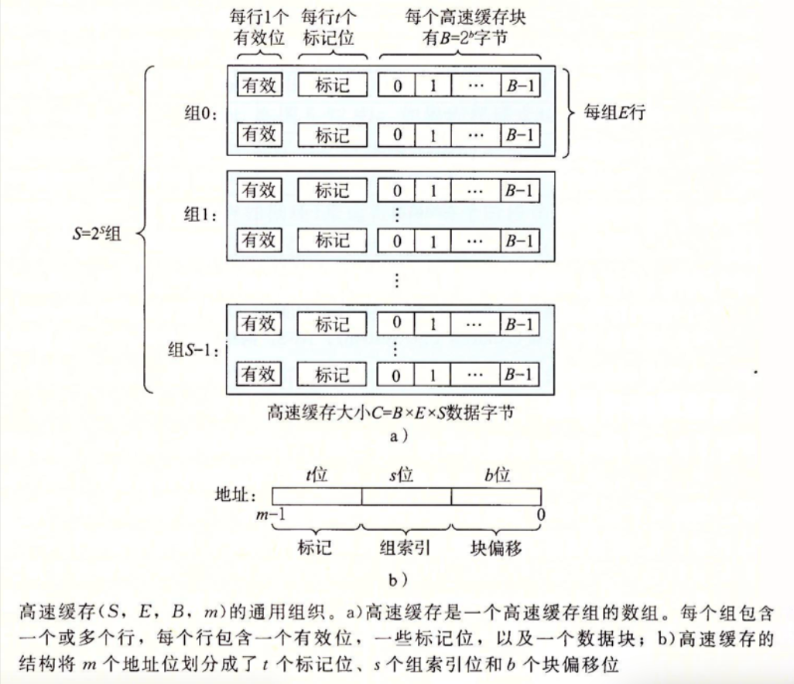

对于整个缓存，其应该被声明为一个三维对象，其中组织起一些二维对象，即缓存组，同时它还应该包含``组数、相联度``以及``块大小``这些数据。

同样，每个缓存组被声明为一个二维对象，其中组织起一些一维对象，即缓存行。

每个一维对象缓存行，应该包含``有效位、标记位``的数据，同时，由于``LRU``策略，还需要包含时间戳。（由于只需要计算命中/不命中/冲突的数据，因此无需实现实际缓冲块）。

此时，会想到用结构体来实现，如下：

```c
struct Line {
    int valid; // 有效位
    int tag; // 标记位
    int time_stamp; // 时间戳
};// 缓冲行

typedef struct Line line;

struct _Cache {
    int S;  // 组数
    int E;  // 相联度
    int B;  // 块大小
    line** l; // 二维指针表明缓存
};

typedef struct _Cache Cache;
```

其中，两个``typedef``用于简化结构体名称，语法上需要加上``struct``。

同时，由于缓存组并不需要存储额外的数据，直接将其作为缓存行数组存储，而缓存组之间又有维度关系，缓存即是缓存行的二维数组（此处用指针表示方便分配、释放内存）。

### 主函数实现/命令行参数读取
首先，与计概/程设/数算中课程不同，此处的``main``函数需要从命令行中接受参数，因此其参数应当如下：

```c
int main(int argc, char** argv) {

}
```

其中，``argc``记录命令行参数总数量（包括程序本身名称），``argv``表示指向字符串的指针数组。

然后，根据``writeup``和``参考讲解``，需要使用``getopt``函数解析命令行参数，这个函数需要调用``#include <getopt.h>``头文件进行使用。

阅读其官方文档，或者使用``man 3 getopt``查看手册页，得到这个函数的大致食用方法：

``getopt(int argc, char * const argv[], const char *optstring)``，用于解析命令行参数。

其中，``argc``表示参数个数，``argv``表示参数列表，``optstring``表示选项字符串，选项字符串中的字母表示选项，冒号表示选项后面需要参数，返回值为当前选项字母，若无选项则返回``-1``。

同时，这个函数会传输一个外部变量``optarg``，保存当前选项对应的参数。

参照前面介绍的模拟器命令行格式，不难得出选项字符串为``hvs:E:b:t``。

然后，就是根据``opt``的不同取值，进行对应操作。注意返回的``optarg``类型为字符串，在设置``S、B、E``大小时，需要使用``atoi``将其转化为正整数，而这个函数需要引入``#include <stdlib.h> ``进行调用。

根据以上思路，可以大致写出以下代码：

```c
char opt;
    while (-1 != (opt = getopt(argc, argv, "hvs:E:b:t:"))) {
        switch (opt) {
            case 'h':// 输出帮助
                print_help();
                exit(0);
            case 'v':// 是否跟踪
                verbose = 1;
                break;
            case 's':// 索引位大小
                s = atoi(optarg);
                break;
            case 'E':// 相联度大小
                E = atoi(optarg);
                break;
            case 'b':// 块大小
                b = atoi(optarg);
                break;
            case 't':// 待跟踪的文件名
                p = fopen(optarg, "r");
                break;
            default:
                print_help();
                exit(0);
        }
    }
```

其中，当输入非法参数或者``-h``时，跳转到``print_help``函数，输出帮助内容并退出。

同时，``verbose``是一个全局变量，它为1时则表示需要输出跟踪值。

根据``writeup``，在``main``函数的结尾，需要调用``cachelab.h``中的``printSummary``函数输出``命中/不命中/冲突``数量，与标准模拟器对比，因此在文件中加上以下两行：

```c
#include "cachelab.h" //printsummary

printSummary(hit_cnt, miss_cnt, eviction_cnt);// 输出三个计数
```

此时``hit_cnt/miss_cnt/eviction_cnt``分别表示``命中/不命中/冲突``数量，在全局变量中定义。

为了后续讨论方便，将全局变量写出：

```c
int verbose = 0, s, E, b, t; // 读入的几个参数
int hit_cnt = 0, miss_cnt = 0, eviction_cnt = 0; // 输出的几个参数
Cache* cache; // 缓存指针
FILE* p; // 文件读写
```

结合以上，得到``main``函数的大致框架：

```c
int main(int argc, char** argv) {
    int opt;
    while (-1 != (opt = getopt(argc, argv, "hvs:E:b:t:"))) {
        switch (opt) {
            case 'h':// 输出版主
                print_help();
                exit(0);
            case 'v':// 是否跟踪
                verbose = 1;
                break;
            case 's':// 索引位大小
                s = atoi(optarg);
                break;
            case 'E':// 相联度大小
                E = atoi(optarg);
                break;
            case 'b':// 块大小
                b = atoi(optarg);
                break;
            case 't':// 待跟踪的文件名
                p = fopen(optarg, "r");
                break;
            default:
                print_help();
                exit(0);
        }
    }
    // 此处为模拟执行函数，还未讨论先放空
    printSummary(hit_cnt, miss_cnt, eviction_cnt);// 输出三个计数
    return 0;
}
```

同时，在命令行中故意输错指令，可以得到帮助内容，写成``print_help``函数如下：

```c
void print_help() {
    printf("Usage: ./csim-ref [-hv] -s <num> -E <num> -b <num> -t <file>\n");
    printf("Options:\n");
    printf("  -h         Print this help message.\n");
    printf("  -v         Optional verbose flag.\n");
    printf("  -s <num>   Number of set index bits.");
    printf("  -E <num>   Number of lines per set.");
    printf("  -b <num>   Number of block offset bits.");
    printf("  -t <file>  Trace file.");
    printf("\n");
    printf("Examples:\n");
    printf("  linux>  ./csim-ref -s 4 -E 1 -b 4 -t traces/yi.trace");
    printf("  linux>  ./csim-ref -v -s 8 -E 2 -b 4 -t traces/yi.trace");
    return;
}// 当遇到-h或者结束的时候输出，模仿行为
```

### 缓存初始化/内存分配
由于缓存指针目前还是空指针，并且只是读入了它的参数，并没有为其赋值，因此需要完成以上任务。

同时，缓冲块的各行在分配空间后，还需要将其时间戳、标记位和有效位初始化，这里笔者采用``-1``作为标记位的初值，表示该位置还未存放变量，用``0``作为有效位和时间戳的初值。

注意，此时声明空间应当先从维度高的数据结构，向维度低的数据结构逐一声明。

同时，使用``malloc``而非``new``进行空间分配，这点笔者在选修《人工智能中的课程》中有所涉及，而《计算概论A》中的指针部分亦有讲解。~~实在不会就去问LLM~~

根据以上思路，得到代码如下：

```c
void init_cache() {
    int S = 1 << s;
    int B = 1 << b;
    cache = malloc(sizeof(Cache));
    cache->S = S;
    cache->B = B;
    cache->E = E;
    cache->l = malloc(sizeof(line*) * S);
    for (int i = 0; i < S; i++) {
        cache->l[i] = malloc(sizeof(line) * E);
        for (int j = 0; j < E; j++) {
            cache->l[i][j].tag = -1; // 标记位记为1，表示没有标记
            cache->l[i][j].time_stamp = 0; // 时间戳初始化为0
            cache->l[i][j].valid = 0; // 有效位初始化为0
        }
    }
    return;
} // 初始化Cache的空间
```

同时，别忘了在主函数中添加``init_cache``函数的调用入口。

### 从trace文件中提取参数
根据``writeup``，每次``L``操作和每次``S``操作最多导致一次不命中，``M``操作视为先加载后存储同一地址，因此可能导致``两次命中``或``一次不命中+一次冲突``。

也就是说，将要实现的缓存策略，大致相当于课本中``写回与写分配结合``的策略，也就是忽略读写差异后（因为只需要考虑是否命中以及冲突），即相当于``S``操作和``L``操作访问一次缓存，而``M``操作访问两次缓存，因此用一个函数``update``就可实现，无须区分。

同时，对于输入的每个地址，需要取出其``索引位``和``标记位``，回想第六章的相关知识，如下：

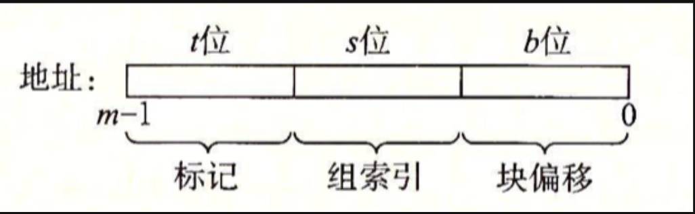

回忆第二章和``Data Lab``中``掩码``的相关知识，以及读入的地址是``64位无符号整数``(因为只需要其位表示，无符号整数方便逻辑右移)，可以这样取出``索引位``和``标记位``：

```c
int opt_s = (address >> b) & ((1ULL << s) - 1); // 掩码取出索引位
int opt_tag = address >> (b + s);// 掩码取出标记位
```

同时，考虑跟踪逻辑，结合以上思路，可以写出以下代码：

```c
void get_trace() {
    char opt;
    unsigned long address;
    int size;
    while (fscanf(p, "%s %lx,%d\n", &opt, &address, &size) > 0) {
        int opt_s = (address >> b) & ((1ULL << s) - 1); // 掩码取出索引位
        int opt_tag = address >> (b + s);// 掩码取出标记位
        if (verbose) printf("%c %lx,%d\n", opt, address, size); // 输出跟踪
        switch (opt) {
            case 'L':
                update(opt_s, opt_tag);// 进行数据加载
                break;
            case 'M':
                update(opt_s, opt_tag);// 进行数据加载
                update(opt_s, opt_tag);// 进行数据存储
                break;
            case 'S':
                update(opt_s, opt_tag);// 进行数据存储
                break;
            default:
                continue;
        }
    }
    return;
}// 处理trace文件中的操作
```

其中，``update``函数用于整合整体的缓存操作逻辑，即对缓存进行访问，它接受当前地址的索引位``opt_s``和标记位``opt_tag``。

同时，别忘了在``main``函数中加上``get_trace``函数的调用入口。

### 缓存操作逻辑
结合课本知识，缓存访问有两种结果，即命中和不命中。

如果命中，则更新当前地址对应的缓存行，并且命中计数器增加。

如果不命中，需要判断是``冷不命中``还是``冲突不命中``。这可以通过检测索引位对应的组是否全为空以实现，若为前者，则更新标记位对应的行即可，若为后者，可以通过``LRU``策略，找到当前组内最早更新的行，再进行更新。

结合以上思路，整合写出以下代码：

```c
void update(int opt_s, int opt_tag) {
    int tem = get_index(opt_s, opt_tag);//是否能够匹配
    if (tem == -1) {// 如果找不到
        miss_cnt++;// 不命中计数器增加
        if (verbose) printf("miss "); // 输出跟踪
        int flag = is_full(opt_s);// 是否是因为冷不命中
        if (flag == -1) {// 如果冲突不命中
            eviction_cnt++; // 冲突不命中计数器增加
            if (verbose) printf("eviction "); // 输出跟踪
            flag = find_LRU(opt_s);// 找到LRU策略对应的行序号
        }
        update_2(flag, opt_s, opt_tag);// 更新时间戳和对应行的标记位/有效位
        return;
    }
    hit_cnt++;// 命中计数器增加
    if (verbose) printf("hit ");// 输出跟踪
    update_2(tem, opt_s, opt_tag);// 更新时间戳和对应行的标记位/有效位
    return;
}// 进行对应的读写访问操作
```

其中，``get_index``用于查找索引位对应的组中是否存在标记位相同并且有效位有效的行，``is_full``用于检测是否是冷不命中，``find_LRU``用于找到当前组中最早更新的行，``update_2``用于更新找到的空行/冲突LRU行。

### 寻找匹配缓冲行
在实际缓存中，可能会采用哈希表等策略，加快匹配速度。

但在便于理解原理的模拟器中，只需要遍历索引位对应的缓存组，逐一判断其标记位是否与地址标记位相同，并且``有效位有效``即可。若找到，则返回该行在组中对应下标，否则返回``-1``。

```c
int get_index(int opt_s, int opt_tag) {
    for (int i = 0; i < cache->E; i++) {
        if (cache->l[opt_s][i].tag == opt_tag && cache->l[opt_s][i].valid == 1)
            return i; // 如果存在有效位有效，并且标记位相同的行，就返回索引
    }
    return -1; // 否则，表示未找到
}// 寻找是否存在能够匹配的行
```

### 判断是否冷不命中
上文提到，不命中可能是因为冷不命中或者冲突不命中造成的。

那么，怎么判断是否是冷不命中？只需要判断当前组内行是否全满即可。

即，对于索引位对应的组中的行，一个个遍历，若发现有效位为``0``的行，即返回下标，作为更新的候选。若没有发现这样的行，则返回``-1``，说明为冲突不命中，接着通过``LRU``策略找更新的行。

根据以上思路，写出代码如下：

```c
int is_full(int opt_s) {
    for (int i = 0; i < cache->E; i++) {
        if (cache->l[opt_s][i].valid == 0) return i;// 如果找到空行就返回
    }
    return -1;// 否则返回-1表示没有空行
}// 判断是冷不命中还是冲突不命中
```

### 冲突不命中/LRU策略
由上文，若为冲突不命中，则在索引位对应的组中找出最早被更新的行，返回该行的下标。

此时，就需要考虑时间戳的含义了。由于无法像实际CPU中记录实际时间，但是只需要判断某个组内时间的相对变化，笔者将时间戳定义为``每次更新时``将对应组的时间戳全部加1，在更新某个行时，将当前行的时间戳设为``0``，这样，在找最早被更新的行时，就是找时间戳最大的行。

根据以上思路，写出代码如下：

```c
int find_LRU(int opt_s) {
    int tem_stamp = 0;
    int idx = 0;
    for (int i = 0; i < cache->E; i++) {
        if (cache->l[opt_s][i].time_stamp > tem_stamp) {
            idx = i;
            tem_stamp = cache->l[opt_s][i].time_stamp;
        }// 比较时间戳，时间戳越大说明越早被使用
    }
    return idx;
}// 根据LRU策略，在填满的组中寻找最远未被使用的行
```

### 更新缓存
更新缓存，在上述``update``函数中，对于命中和不命中都需要更新。

为什么命中缓存也需要更新？是因为时间戳需要被置为0，而标记位和传入的标记位相同，此时这三种情况的更新被合并成以下函数：

```c
void update_2(int flag, int opt_s, int opt_tag) {
    for (int i = 0; i < cache->E; i++) {
        if (i == flag) {
            cache->l[opt_s][i].valid = 1;
            cache->l[opt_s][i].time_stamp = 0;
            cache->l[opt_s][i].tag = opt_tag;
            continue;
        }
        if (cache->l[opt_s][i].valid == 1) cache->l[opt_s][i].time_stamp++;
    }
    return;
}// 更新时间戳，同时更新被驱逐或者填充的行的标记位/有效位
// 时间戳越大，表示越久没被使用；同样地，刚刚被使用的行的时间戳为0。
```

### 内存释放
在程序结束之前，需要对指针分配的空间进行释放，与分配相反，是从低维度到高维度进行释放：

```c
void free_cache() {
    int S = cache->S;
    for (int i = 0; i < S; i++) free(cache->l[i]);
    free(cache->l);
    free(cache);
    return;
}// 释放全部内存
```

同时，不要忘了在``main``函数中加上``free``函数的调用入口。

### 成品代码
综合以上所有思路，得到成品代码：

```c
#include <getopt.h>  // getopt
#include <stdio.h>   // fscanf
#include <stdlib.h> //atoi

#include "cachelab.h" //printsummary
#include "contracts.h"

struct Line {
    int valid; // 有效位
    int tag; // 标记位
    int time_stamp; // 时间戳
};// 缓冲行

typedef struct Line line;

struct _Cache {
    int S;  // 组数
    int E;  // 相联度
    int B;  // 块大小
    line** l; // 二维指针表明缓存
};

typedef struct _Cache Cache;

int verbose = 0, s, E, b, t; // 读入的几个参数
int hit_cnt = 0, miss_cnt = 0, eviction_cnt = 0; // 输出的几个参数
Cache* cache; // 缓存指针
FILE* p; // 文件读写

void init_cache() {
    int S = 1 << s;
    int B = 1 << b;
    cache = malloc(sizeof(Cache));
    cache->S = S;
    cache->B = B;
    cache->E = E;
    cache->l = malloc(sizeof(line*) * S);
    for (int i = 0; i < S; i++) {
        cache->l[i] = malloc(sizeof(line) * E);
        for (int j = 0; j < E; j++) {
            cache->l[i][j].tag = -1; // 标记位记为1，表示没有标记
            cache->l[i][j].time_stamp = 0; // 时间戳初始化为0
            cache->l[i][j].valid = 0; // 有效位初始化为0
        }
    }
    return;
} // 初始化Cache的空间

int get_index(int opt_s, int opt_tag) {
    for (int i = 0; i < cache->E; i++) {
        if (cache->l[opt_s][i].tag == opt_tag && cache->l[opt_s][i].valid == 1)
            return i; // 如果存在有效位有效，并且标记位相同的行，就返回索引
    }
    return -1; // 否则，表示未找到
}// 寻找是否存在能够匹配的行

int find_LRU(int opt_s) {
    int tem_stamp = 0;
    int idx = 0;
    for (int i = 0; i < cache->E; i++) {
        if (cache->l[opt_s][i].time_stamp > tem_stamp) {
            idx = i;
            tem_stamp = cache->l[opt_s][i].time_stamp;
        }// 比较时间戳，时间戳越大说明越早被使用
    }
    return idx;
}// 根据LRU策略，在填满的组中寻找最远未被使用的行

int is_full(int opt_s) {
    for (int i = 0; i < cache->E; i++) {
        if (cache->l[opt_s][i].valid == 0) return i;// 如果找到空行就返回
    }
    return -1;// 否则返回-1表示没有空行
}// 判断是冷不命中还是冲突不命中

void update_2(int flag, int opt_s, int opt_tag) {
    for (int i = 0; i < cache->E; i++) {
        if (i == flag) {
            cache->l[opt_s][i].valid = 1;
            cache->l[opt_s][i].time_stamp = 0;
            cache->l[opt_s][i].tag = opt_tag;
            continue;
        }
        if (cache->l[opt_s][i].valid == 1) cache->l[opt_s][i].time_stamp++;
    }
    return;
}// 更新时间戳，同时更新被驱逐或者填充的行的标记位/有效位
// 时间戳越大，表示越久没被使用；同样地，刚刚被使用的行的时间戳为0。

void update(int opt_s, int opt_tag) {
    int tem = get_index(opt_s, opt_tag);//是否存在空行
    if (tem == -1) {// 如果找不到
        miss_cnt++;// 不命中计数器增加
        if (verbose) printf("miss "); // 输出跟踪
        int flag = is_full(opt_s);// 是否是因为冷不命中
        if (flag == -1) {// 如果冲突不命中
            eviction_cnt++; // 冲突不命中计数器增加
            if (verbose) printf("eviction "); // 输出跟踪
            flag = find_LRU(opt_s);// 找到LRU策略对应的行序号
        }
        update_2(flag, opt_s, opt_tag);// 更新时间戳和对应行的标记位/有效位
        return;
    }
    hit_cnt++;// 命中计数器增加
    if (verbose) printf("hit ");// 输出跟踪
    update_2(tem, opt_s, opt_tag);// 更新时间戳和对应行的标记位/有效位
    return;
}// 进行对应的读写访问操作

void get_trace() {
    char opt;
    unsigned long address;
    int size;
    while (fscanf(p, "%s %lx,%d\n", &opt, &address, &size) > 0) {
        int opt_s = (address >> b) & ((1ULL << s) - 1); // 掩码取出索引位
        int opt_tag = address >> (b + s);// 掩码取出标记位
        if (verbose) printf("%c %lx,%d\n", opt, address, size); // 输出跟踪
        switch (opt) {
            case 'L':
                update(opt_s, opt_tag);// 进行数据加载
                break;
            case 'M':
                update(opt_s, opt_tag);// 进行数据加载
                update(opt_s, opt_tag);// 进行数据存储
                break;
            case 'S':
                update(opt_s, opt_tag);// 进行数据存储
                break;
            default:
                continue;
        }
    }
    return;
}// 处理trace文件中的操作

void free_cache() {
    int S = cache->S;
    for (int i = 0; i < S; i++) free(cache->l[i]);
    free(cache->l);
    free(cache);
    return;
}// 释放全部内存

void print_help() {
    printf("Usage: ./csim-ref [-hv] -s <num> -E <num> -b <num> -t <file>\n");
    printf("Options:\n");
    printf("  -h         Print this help message.\n");
    printf("  -v         Optional verbose flag.\n");
    printf("  -s <num>   Number of set index bits.");
    printf("  -E <num>   Number of lines per set.");
    printf("  -b <num>   Number of block offset bits.");
    printf("  -t <file>  Trace file.");
    printf("\n");
    printf("Examples:\n");
    printf("  linux>  ./csim-ref -s 4 -E 1 -b 4 -t traces/yi.trace");
    printf("  linux>  ./csim-ref -v -s 8 -E 2 -b 4 -t traces/yi.trace");
    return;
}// 当遇到-h或者结束的时候输出，模仿行为

int main(int argc, char** argv) {
    char opt;
    while (-1 != (opt = getopt(argc, argv, "hvs:E:b:t:"))) {
        switch (opt) {
            case 'h':// 输出帮助
                print_help();
                exit(0);
            case 'v':// 是否跟踪
                verbose = 1;
                break;
            case 's':// 索引位大小
                s = atoi(optarg);
                break;
            case 'E':// 相联度大小
                E = atoi(optarg);
                break;
            case 'b':// 块大小
                b = atoi(optarg);
                break;
            case 't':// 待跟踪的文件名
                p = fopen(optarg, "r");
                break;
            default:
                print_help();
                exit(0);
        }
    }
    init_cache();// 初始化缓存
    get_trace();// 对文件处理
    free_cache();// 释放缓存
    printSummary(hit_cnt, miss_cnt, eviction_cnt);// 输出三个计数
    return 0;
}
```

运行``make``和``./test-csim``指令，得到以下结果，表示完成了``Part A``：


## Part B
笔者要提醒各位的是，做``Part B``的时候建议多用纸笔画画，便于思考。

根据``writeup``，``Part B``中需要编写自己的矩阵转置函数，实现将矩阵``A``转置后的数据存入矩阵``B``，使缓存不命中次数尽可能少。

同时，还有以下要求：
- 必须无警告编译通过
- 最多可定义12个``int``类型局部变量
- 不允许使用``long``型变量或位操作将多个值存储到单个变量中，以规避上述规则
- 不允许使用递归
- 若使用辅助函数，辅助函数与顶层函数的栈上局部变量不超过12个
- 不允许修改数组``A``，但允许操作数组``B``。
- 不允许重新声明数组或者使用``malloc``及其变体。

评测使用参考模拟器在``s=5,E=1,b=5``的缓存上重放该轨迹进行评分。

进入``trans.c``文件，先运行``make``和``./test-trans -M 32 -N 32``指令，测试默认转置函数的性能：

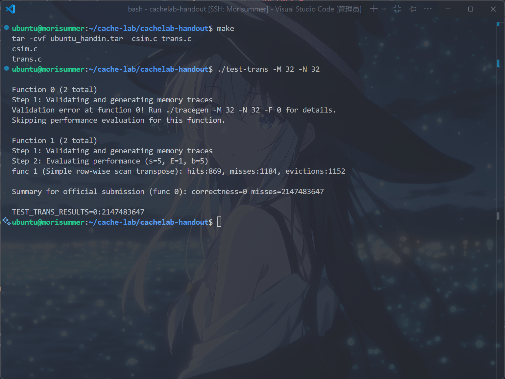

非常差的性能，笔者在此分析其性能差的原因。

由顶部注释得知，转置函数的评估是通过统计在一个``1KB``直接映射缓存上的不命中次数来进行的，缓存块大小为``32字节``。

也就是，一个缓存行可以存储``8``个``int型变量``，共有``32``行。

可以认为，每次读入 $A[i][j]$ 或是写入 $B[j][i]$ 时，若它在缓存中则命中，反之则不命中。

可以认为，若当前元素不命中，则一次性读入连同当前元素的一共8个元素进入缓存。

对于 $32 \times 32$ 的矩阵，回想第三章的知识，可以确定 $A[i][j]$ 的地址为 $i \times 32 + j$ ， $B[j][i]$ 的地址为 $j \times 32 + i$ 。

也就是， $A[i][j]$ 对应的块标号为 $\lfloor (i \times 4 + \lfloor \frac{j}{8} \rfloor)/32 \rfloor$ ， $B[j][i]$ 对应的块标号为 $\lfloor(j \times 4 + \lfloor \frac{i}{8} \rfloor)/32 \rfloor$ 。

分析一下，由于读 $A$ 时是列连续的，它有良好的空间局部性，只在每行发生冷不命中，一共 $4 \times 32=128$ 次。而对于 $B$ ，可以推出在读每个元素的时候，都会发生不命中，因此一共 $32 \times 32=1024$ 次，加起来共``1152``次。

但是，在上图中，显示一共 ``1184``次不命中，这是为什么？

考虑 $i=j$ 的情况，此时写 $B$ 操作会造成当前读入的 $A$ 被驱逐，因此 $A$ 在遍历下一个元素时仍需重新读入，造成 $32$ 次不命中，恰好为 $1152+32=1184$ 次。

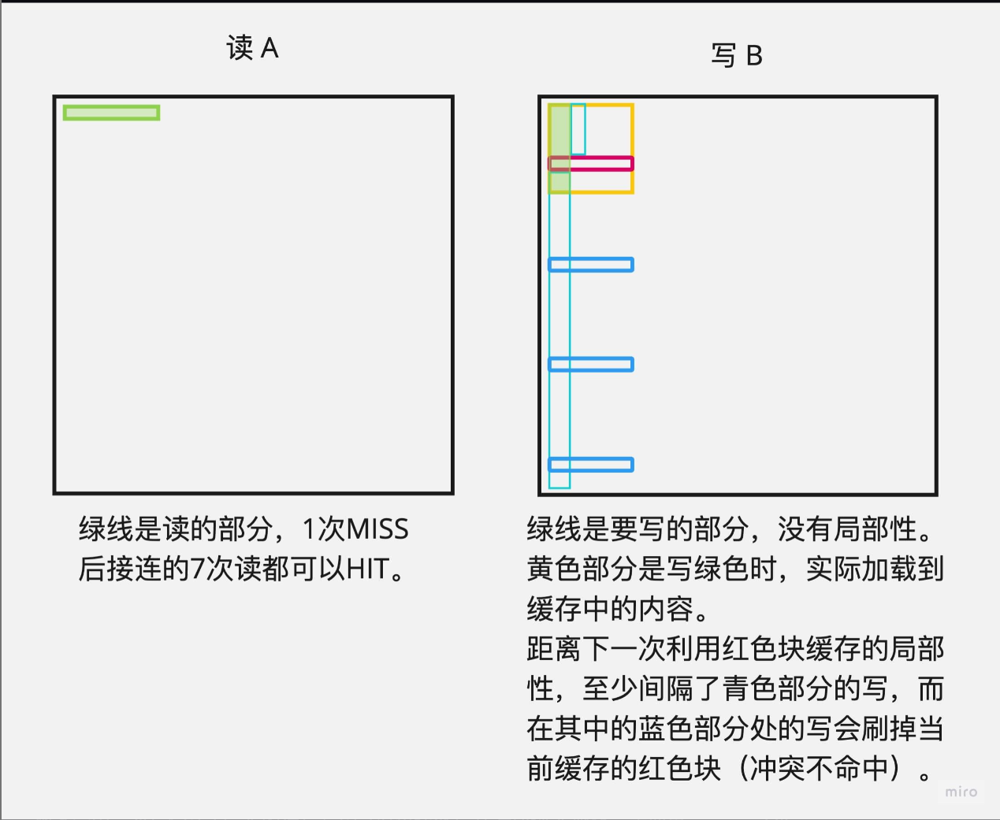

### 32 $\times$ 32
对 $32 \times 32$ 的矩阵，满分线为 $m \leq 300$ 。

考虑书上的分块策略，即将大矩阵分成小块，从而避免 $B$ 频繁的写不命中。

如果将 $32 \times 32$ 分成 $8 \times 8$ 的小块，则读 $A$ 一次性连续读入 $8$ 个元素，转置后写入 $B$ ，此时避免了每次读到 $B[j][i+1]$ 时， $B[j][i]$ 所读入的缓存块都被刷掉了，于是只剩下对角线冲突了。

此时，使用八个局部变量记录从 $A$ 中取出的变量，再存入 $B$ 中，已经可以获得满分了，经验证 $miss=288$ ，不错的成绩。

但是，是否可以进一步优化？要知道， $32 \times 32$ 的矩阵转置，是后面两道题的基础，笔者也是在 $60 \times 68$ 反复在满分线差十几个miss挣扎过后，回过来想 $32 \times 32$ 的优化，并最终优化成功。

按理来说，理论最优值应该是 $16 \times (8+8)=256$ ，其中``16``是块数，``8``是每个块内读 $A$ 的不命中次数，另一个是每个块内读 $B$ 的不命中次数，也就是优化掉全部的对角线冲突，这里对角线冲突，指的还是对角线上的块的对角线冲突。

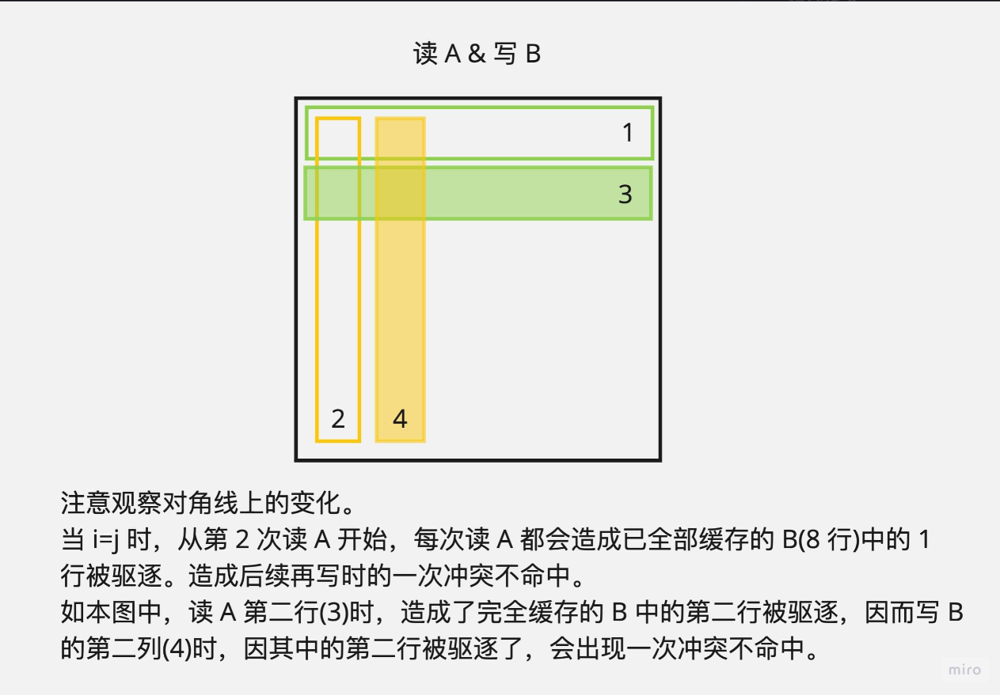

经过笔者的思考，可以尝试将 $A$ 的整个块先复制到对应 $B$ 的块，并且不转置，随后由于这个 $8 \times 8$ 的块已经被全部读进缓存了，因此对 $B$ 转置不需要消耗额外的不命中次数。

根据以上思路，编写代码如下：

```c
void trans_32_32(int M, int N, int A[N][M], int B[M][N]);// 先声明函数

if (M == 32 && N == 32) trans_32_32(M, N, A, B);//增加在transpose_submit中

char trans_desc_32_32[] = "8*8 elements per block transpose";
void trans_32_32(int M, int N, int A[N][M], int B[M][N]) {
    REQUIRES(M > 0);
    REQUIRES(N > 0);
    int a_0, a_1, a_2, a_3, a_4, a_5, a_6, a_7;
    for (int i = 0; i < 32; i += 8) {
        for (int j = 0; j < 32; j += 8) {
            for (int k = i; k < i + 8; k++) {
                a_0 = A[k][j];
                a_1 = A[k][j + 1];
                a_2 = A[k][j + 2];
                a_3 = A[k][j + 3];
                a_4 = A[k][j + 4];
                a_5 = A[k][j + 5];
                a_6 = A[k][j + 6];
                a_7 = A[k][j + 7];//用临时变量取出，增加时间局部性
                B[j + (k - i)][i] = a_0;
                B[j + (k - i)][i + 1] = a_1;
                B[j + (k - i)][i + 2] = a_2;
                B[j + (k - i)][i + 3] = a_3;
                B[j + (k - i)][i + 4] = a_4;
                B[j + (k - i)][i + 5] = a_5;
                B[j + (k - i)][i + 6] = a_6;
                B[j + (k - i)][i + 7] = a_7;// 先按顺序存在B的相应位置
            }
            for (int k = j; k < j + 8; k++) {
                for (int v = i; v - i < k - j; v++) {
                    a_0 = B[k][v];
                    B[k][v] = B[j + (v - i)][i + (k - j)];
                    B[j + (v - i)][i + (k - j)] = a_0;
                }// 对B进行转置，注意类似于冒泡排序的交换只需要一半次数
            }
        }
    }
    ENSURES(is_transpose(M, N, A, B));
}// 8*8分块

registerTransFunction(trans_32_32, trans_desc_32_32);// 注册函数，写在registerFunctions中
```

运行``make``和``./test-trans -M 32 -N 32``指令，得到以下结果：

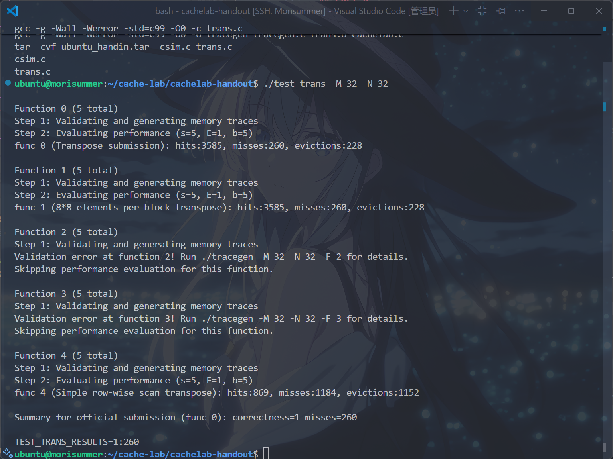

这个值是 $32 \times 32$ 的理想值，因为存在函数调用需要多出 $4$ 个不命中次数。

### 64 $\times$ 64
对 $64 \times 64$ 的矩阵，满分线是 $m<1300$ 。

首先，需要注意的一个点是，此时 $A[i][j]$ 对应缓存的计算公式应该变为 $\lfloor (\lfloor i \times 8 + \lfloor \frac{j}{8} \rfloor)/32 \rfloor$ ， $B[j][i]$ 对应缓存的计算公式应该变为 $\lfloor (\lfloor j \times 8 + \lfloor \frac{i}{8} \rfloor)/32 \rfloor$ 。

也就是说， $A[i][0]$ 与 $A[i+4][0]$ 就会发生缓存冲突了，因此直接采用 $8 \times 8$ 分块是不可取的。

然而，若采用 $4 \times 4$ 分块，只能得到``1604``的不命中数，思考一下这是为什么？

是因为， $4 \times 4$ 分块本质上无法避免对 $B[0][i]$ 和 $B[4][i]$ 的写不命中问题，因此有必要采用新的方式进行转移。

可能会考虑，如果结合 $8 \times 8$ 分块的每次将一行全部读入缓存，以及 $4 \times 4$ 分块的读命中这两个优势，可能会产生更优秀的解法？

对于 $A[i][0]$ ，每次将 $A[i][0] \sim A[i][7]$ 都存入缓存中，按照之前的逻辑，由于 $B$ 中读入了 $B[0][i] \sim B[7][i]$ 而发生冲突不命中，此时，希望能够只使用 $B[0][i] \sim B[3][i]$ 这三行。

一种显然的想法是，将 $A$ 进行 $8 \times 8$ 分块后，首先将 $A$ 的左上和右上部分不转置地读到 $B$ 对应分块的左上和右上，此时 $A$ 上部的所有工作都完成了，可以开始使用 $A$ 的下部了，而这样只会导致 $4$ 次冲突不命中。

然后，考虑将 $B$ 的上部全部利用完，即 $A$ 中的左下复制到 $B$ 的右上，然而此时 $B$ 右上存了未转置的 $A$ 左下部分，因此先将 $B$ 的右上部分用临时变量存下来，受限于临时变量个数，无法将右上部分完整存下来，因此还是边存边转置到左下，此时仍会造成抖动，但相对单纯 $4 \times 4$ 分块或者 $8 \times 8$ 分块已经好多了。

最后，将 $A$ 的右下转置复制到 $B$ 的右下完成，整个流程大致如下：

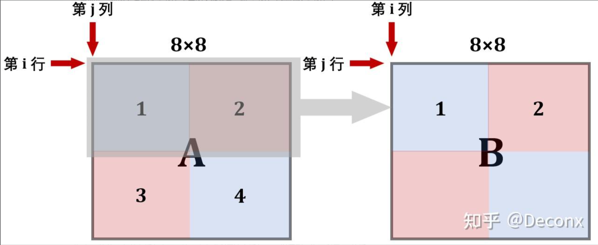

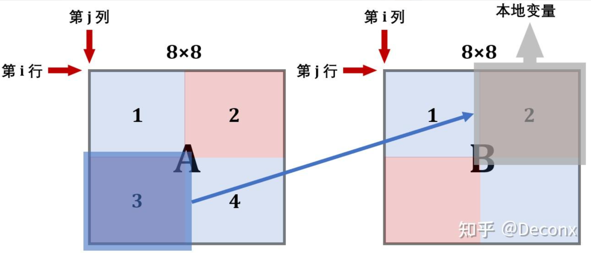

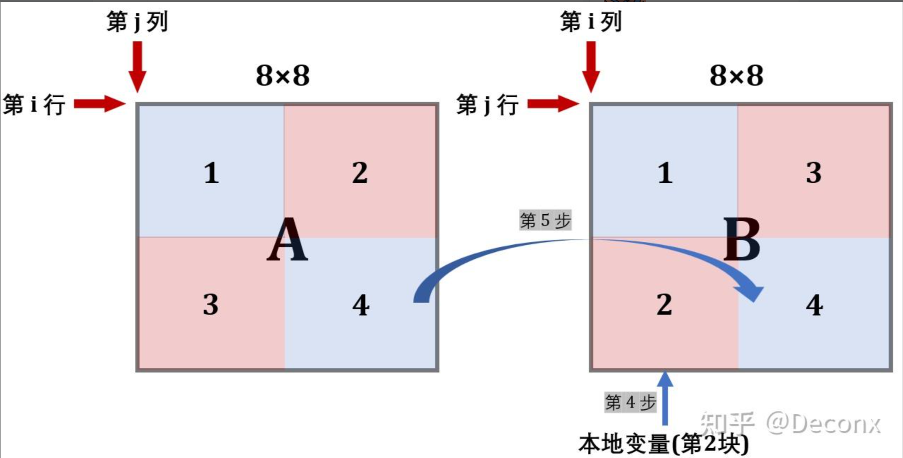

根据以上思路，编写代码：

```c
void trans_64_64(int M, int N, int A[N][M], int B[M][N]);// 先声明函数

char trans_desc_64_64[] = "8*8 elements per block transpose";
void trans_64_64(int M, int N, int A[N][M], int B[M][N]) {
    REQUIRES(M > 0);
    REQUIRES(N > 0);
    int a_0, a_1, a_2, a_3, a_4, a_5, a_6, a_7;
    for (int i = 0; i < 64; i += 8) {
        for (int j = 0; j < 64; j += 8) {
            for (int k = i; k < i + 4; k++) {
                a_0 = A[k][j];
                a_1 = A[k][j + 1];
                a_2 = A[k][j + 2];
                a_3 = A[k][j + 3];// 取出A的左上部分
                a_4 = A[k][j + 4];
                a_5 = A[k][j + 5];
                a_6 = A[k][j + 6];
                a_7 = A[k][j + 7];// 取出A的右上部分
                B[j][k] = a_0;
                B[j + 1][k] = a_1;
                B[j + 2][k] = a_2;
                B[j + 3][k] = a_3;// 左上直接转置存入
                B[j][k + 4] = a_4;
                B[j + 1][k + 4] = a_5;
                B[j + 2][k + 4] = a_6;
                B[j + 3][k + 4] = a_7;// 右上作为暂存区，先存转置后的
            }
            for (int k = j; k < j + 4; k++) {
                a_0 = B[k][i + 4];
                a_1 = B[k][i + 5];
                a_2 = B[k][i + 6];
                a_3 = B[k][i + 7];// 取出B的右上部分
                a_4 = A[i + 4][k];
                a_5 = A[i + 5][k];
                a_6 = A[i + 6][k];
                a_7 = A[i + 7][k];// 取出A的左下部分
                B[k][i + 4] = a_4;
                B[k][i + 5] = a_5;
                B[k][i + 6] = a_6;
                B[k][i + 7] = a_7;// B的右上部分，存上A的左下的转置
                B[k + 4][i] = a_0;
                B[k + 4][i + 1] = a_1;
                B[k + 4][i + 2] = a_2;
                B[k + 4][i + 3] = a_3;// B的左下部分，直接由存好的右上部分提供
            }
            for (int k = i + 4; k < i + 8; k++) {
                a_4 = A[k][j + 4];
                a_5 = A[k][j + 5];
                a_6 = A[k][j + 6];
                a_7 = A[k][j + 7];
                B[j + (k - i)][i + 4] = a_4;
                B[j + (k - i)][i + 5] = a_5;
                B[j + (k - i)][i + 6] = a_6;
                B[j + (k - i)][i + 7] = a_7;
            }
            for (int k = j + 4; k < j + 8; k++) {
                for (int v = i + 4; v - i < k - j; v++) {
                    a_0 = B[k][v];
                    B[k][v] = B[j + (v - i)][i + (k - j)];
                    B[j + (v - i)][i + (k - j)] = a_0;
                }
            }// 跟32*32的思路一样，对右下进行转置
        }
    }
    ENSURES(is_transpose(M, N, A, B));
}// 采用8*8后细分的策略，进行分块后暂存，再转置，减小不命中次数。

registerTransFunction(trans_64_64, trans_desc_64_64);// 注册函数，写在registerFunctions中
```

运行``make``和``./test-trans -M 64 -N 64``指令，得到以下结果，表示完成了 $64 \times 64$ ``的矩阵优化``：

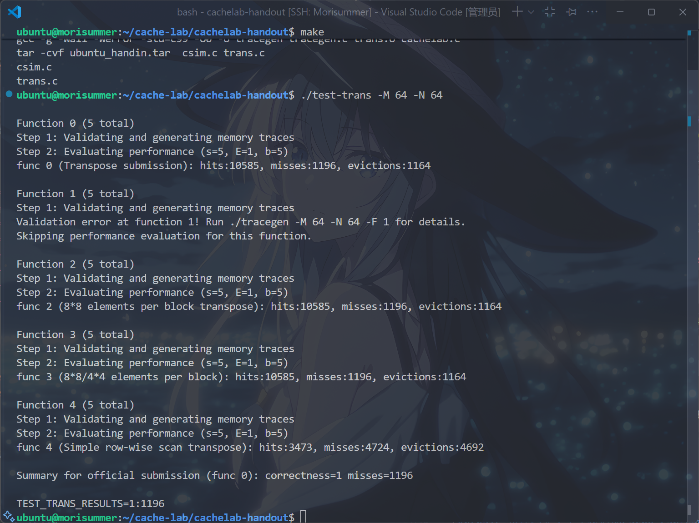

### 60 $\times$ 68
对 $60 \times 68$ 的矩阵，满分线是 $m<1600$ 。

首先，笔者需要提醒的是，这题的 $A$ 矩阵是 $A[68][60]$ 而非 $A[60][68]$ ，做的时候被坑惨了。

由于注意到 $68 \times 60$ 都是 $4$ 的倍数，并且上面计算 $64 \times 64$ 矩阵时，使用 $4 \times 4$ 分块的不命中数为 ``1604``，因此 $4 \times 4$ 分块大概是无法获得满分了。

反之，可以考虑先 $8 \times 8$ 分块转置原有的 $64 \times 56$ 矩阵，再将多出来的部分用 $4 \times 4$ 分块处理。

经过笔者的反复尝试，将 $64 \times 64$ 中的 $8 \times 8$ 分块策略移植到这道题中，反而会使不命中数增加。

采用前面的想法，进行推断， $A[i][j]$ 对应的缓存行应该为 $\lfloor(\lfloor i \times 7 + \lfloor \frac{j}{8} \rfloor)/32 \rfloor$ ， $B[j][i]$ 对应的缓存行应该为 $\lfloor j \times 7 + \lfloor \frac{i}{8} \rfloor)/32 \rfloor$ 。

若采用 $64 \times 64$ 中的映射策略，由于 $i$ 的系数不再是 $8$ ，由同余关系，反而会发生不必要的冲突，因此仍然采用 $32 \times 32$ 中使用的 $8 \times 8$ 的转置方法。

剩余的 $4 \times 4$ 块也是根据这个思路，没什么花活......吗？

如果只是这样做，那这题甚至比 $64 \times 64$ 还无趣，PKU助教团队又为什么要~~魔改~~加强呢？

~~手玩一下样例~~，注意到前两道题使用的矩阵长宽都相等，而本题中是不相等的，一个大胆的想法，也许将 $64 \times 56$ 改变遍历顺序，首先满足 $B$ 中较为苛刻的 $7$ 这一条件，可以降低不命中数？

根据以上猜测，写出以下代码：

```c
void trans_60_68(int M, int N, int A[N][M], int B[M][N]);// 先声明函数

char trans_desc_60_68[] = "8*8/4*4 elements per block";
void trans_60_68(int M, int N, int A[N][M], int B[M][N]) {
    REQUIRES(M > 0);
    REQUIRES(N > 0);
    int a_0, a_1, a_2, a_3, a_4, a_5, a_6, a_7;
    for (int j = 0; j < 56; j += 8) {      // 这是列
        for (int i = 0; i < 64; i += 8) {  // 这是行
            for (int k = i; k < i + 8; k++) {
                a_0 = A[k][j];
                a_1 = A[k][j + 1];
                a_2 = A[k][j + 2];
                a_3 = A[k][j + 3];
                a_4 = A[k][j + 4];
                a_5 = A[k][j + 5];
                a_6 = A[k][j + 6];
                a_7 = A[k][j + 7];
                B[j + (k - i)][i] = a_0;
                B[j + (k - i)][i + 1] = a_1;
                B[j + (k - i)][i + 2] = a_2;
                B[j + (k - i)][i + 3] = a_3;
                B[j + (k - i)][i + 4] = a_4;
                B[j + (k - i)][i + 5] = a_5;
                B[j + (k - i)][i + 6] = a_6;
                B[j + (k - i)][i + 7] = a_7;
            }
            for (int k = j; k < j + 8; k++) {
                for (int v = i; v - i < k - j; v++) {
                    a_0 = B[k][v];
                    B[k][v] = B[j + (v - i)][i + (k - j)];
                    B[j + (v - i)][i + (k - j)] = a_0;
                }
            }
        }
    }// 类似于32*32的思路，实现8*8分块转置
    for (int j = 56; j < 60; j += 4) {     // 这是列
        for (int i = 0; i < 68; i += 4) {  // 这是行
            for (int k = i; k < i + 4; k++) {
                a_0 = A[k][j];
                a_1 = A[k][j + 1];
                a_2 = A[k][j + 2];
                a_3 = A[k][j + 3];
                B[j + (k - i)][i] = a_0;
                B[j + (k - i)][i + 1] = a_1;
                B[j + (k - i)][i + 2] = a_2;
                B[j + (k - i)][i + 3] = a_3;
            }
            for (int k = j; k < j + 4; k++) {
                for (int v = i; v - i < k - j; v++) {
                    a_0 = B[k][v];
                    B[k][v] = B[j + (v - i)][i + (k - j)];
                    B[j + (v - i)][i + (k - j)] = a_0;
                }
            }
        }
    }// 将剩余部分进行4*4分块转置
    for (int j = 0; j < 56; j += 4) {
        for (int i = 64; i < 68; i += 4) {
            for (int k = i; k < i + 4; k++) {
                a_0 = A[k][j];
                a_1 = A[k][j + 1];
                a_2 = A[k][j + 2];
                a_3 = A[k][j + 3];
                B[j + (k - i)][i] = a_0;
                B[j + (k - i)][i + 1] = a_1;
                B[j + (k - i)][i + 2] = a_2;
                B[j + (k - i)][i + 3] = a_3;
            }
            for (int k = j; k < j + 4; k++) {
                for (int v = i; v - i < k - j; v++) {
                    a_0 = B[k][v];
                    B[k][v] = B[j + (v - i)][i + (k - j)];
                    B[j + (v - i)][i + (k - j)] = a_0;
                }
            }
        }
    }// 将剩余部分进行4*4分块转置
    ENSURES(is_transpose(M, N, A, B));
}// 先进行8*8分块转置，再进行4*4分块转置

registerTransFunction(trans_64_64, trans_desc_60_68);// 注册函数，写在registerFunctions中
```

运行``make``和``./test-trans -M 60 -N 68``指令，得到以下结果：

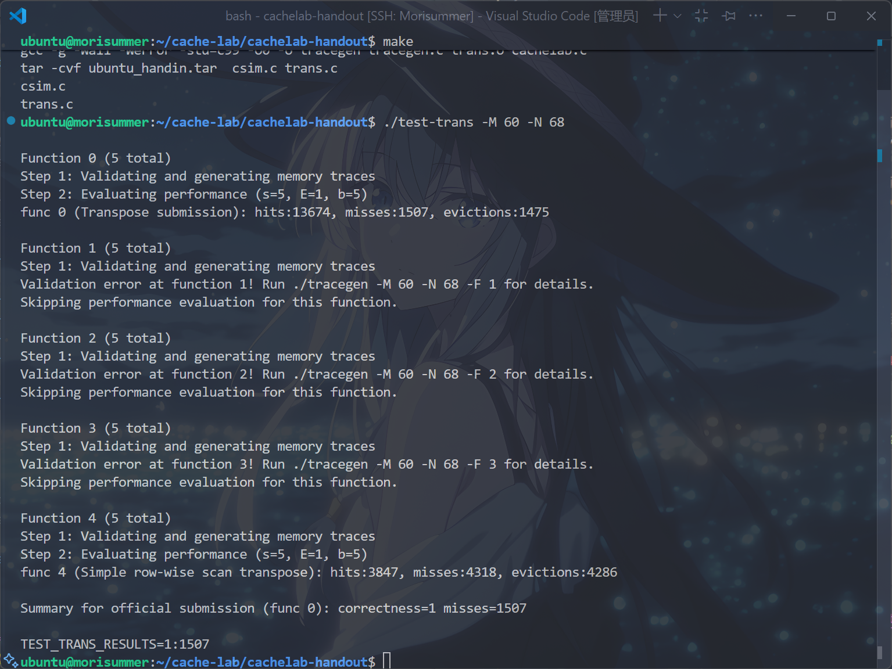

相比改变遍历顺序之前，真的被优化了！成功完成了 $60 \times 68$ ``的矩阵优化``！

运行``make``和``python3 ./driver.py``指令，得到以下结果：


于是，完成了ICS的第五个Lab，Congratulations！

笔者注：不要忘了往``csim.c``和``trans.c``中加上注释，并将``ubuntu_handin.tar``文件上传至``AutoLab``喔~

## 参考资料

[Arthals-更适合北大宝宝体质的Cache Lab踩坑记](https://arthals.ink/blog/cache-lab)

[CSAPP|Lab5-Cache Lab深入解析](https://zhuanlan.zhihu.com/p/484657229)

[CMU的实验讲解PPT](https://www.cs.cmu.edu/afs/cs/academic/class/15213-f15/www/recitations/rec07.pdf)

[CMU关于分块优化的讲解](http://csapp.cs.cmu.edu/2e/waside/waside-blocking.pdf)