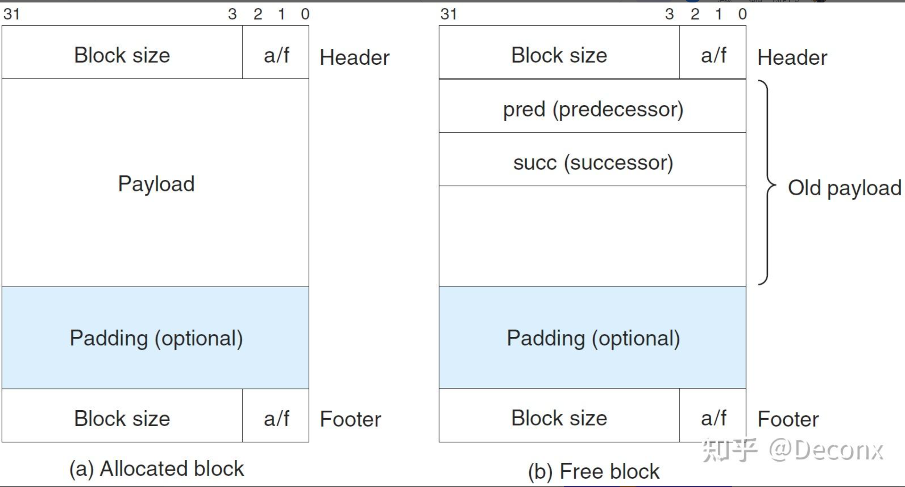
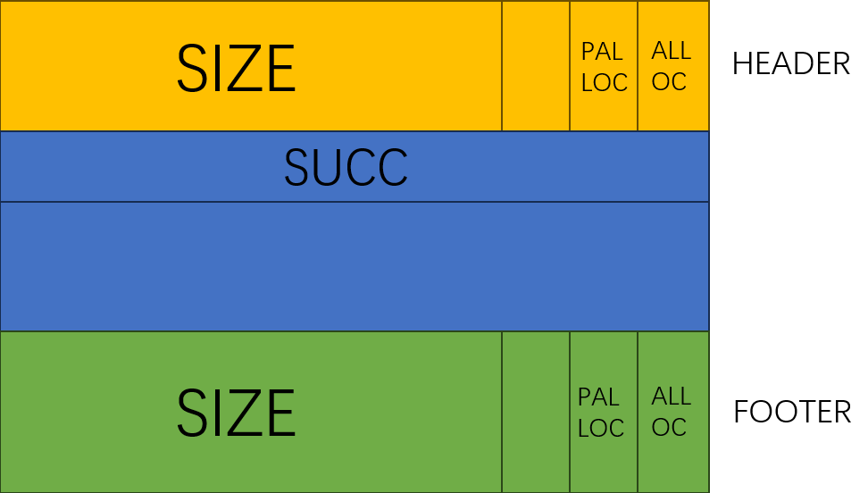
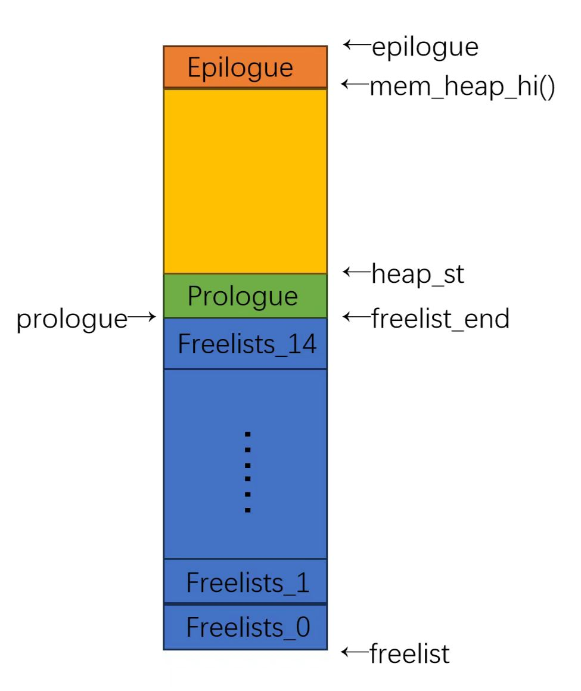
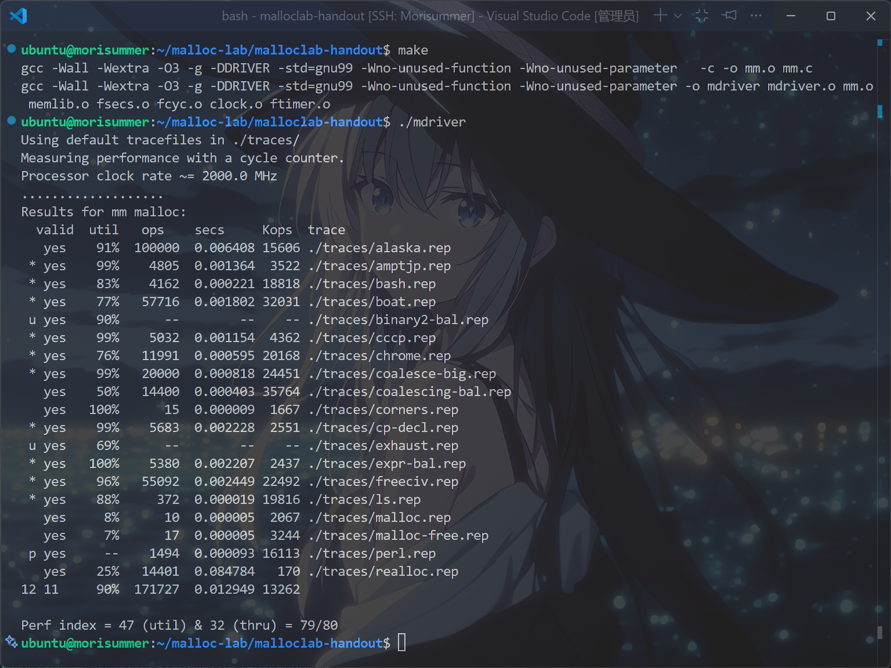

# 从零开始的Malloc Lab

> [!CAUTION]
> 
> **本笔记仅供参考，请勿抄袭。**

## 声明
本笔记的写作初衷在于，笔者在做Malloc Lab的时候受到Arthals学长很大启发，同时25Fall的计算机系统导论课程改制增加了10分的Lab测试（虽然往年的期中期末中也会有一两道Lab相关选择题，但分值不大）。故将心路历程写成此笔记，以便复习，并供后续选课同学参考。

这个Lab中，笔者只得到了``79/80``的分数，因此思路只作为参考，具体实现以及特判，需要读者自己根据当年助教改动的测试点进行修改。

## Malloc Lab简要介绍
Malloc Lab是《计算机系统导论》课程的第7个Lab，对应教材第九章《虚拟内存》。该Lab旨在加强同学们对动态内存的理解，以及管理动态内存的能力。

在``Malloc Lab``中，需要实现一个简单的动态内存分配器，逐步完善不同功能，最终优化其在``trace``文件上的运行效率以及吞吐量。得分分为三部分，性能部分为``80pts``，堆一致性检查器部分为``10pts``，代码风格为``10pts``。后两部分得分由助教手动评分，性能得分由以下公式得出，本地运行得分可能与``AutoLab``上得分有偏差：

$$P(U,T)=80(0.6 \ \mathrm{min} (1,\frac{U-0.7}{0.2}) + 0.4 \ \mathrm{min}(1,\frac{T-3000}{9000}))$$

其中，各参数的含义如下：
- $U$ ：内存利用率，即驱动程序使用的内存总量（即通过malloc分配但尚未通过free释放的内存，也即任一时刻有效负载的总和）与分配器使用的堆大小之间的峰值比率，最佳比率等于1。
- $T$ ：吞吐量，即每秒完成的平均操作次数。

从上述公式看出，内存利用率需要达到 ``90%``，而吞吐量需要达到``12000``即可满分。同时，还有以下规定，即性能得分低于``48``分的提交，自动评分为``0``，意为若有一项低于最低限度导致负数，则不被课程团队接受。

不幸的是，笔者的代码无论怎么特判优化，始终被内存利用率卡在``47分``，因此只拿到``79分``的性能分数，鉴于得分可能是根据恶意设计的测试点被卡，也有可能是笔者在写这个Lab时多天发烧码力下降(疑似那几天码力全用来cf上rating了，因为确实上了大分)的原因，笔者斗胆写下这篇笔记，望读者谅解。

在``Malloc Lab``中，在``mm.c``文件内，分别需要编写``mm_init``、``malloc``、``free``、``realloc``、``calloc``和``mm_checkheap``六个函数，它们分别用于``执行必要的初始化操作``、``分配一个大小至少为size的块并返回指向有效载荷的指针``、``释放对应指针指向的块``、``重新分配对应指针的块``、``为包含一定元素的数组分配内存``、``检查堆一致性``。此外，可以定义自己的辅助函数，以更好地符合工程规范。同时，与``Cache Lab``的``Part A``和``Tsh Lab``类似，``Malloc Lab``给出了一个内存分配器的简单实现``mm_naive.c``，以及课本上隐式空闲链表的内存分配器实现``mm_textbook.c``。

值得一提的是，此``Lab``相比CMU的原版``Malloc Lab``，受到PKU助教团队的大幅加强，引入了助教的恶意``trace``文件，对性能的要求更加严苛，同时修改了性能测试分数公式，与最大最小吞吐量/内存利用率进行比较，接着增加了实现``calloc``和``mm_checkheap``函数的功能。这个``Lab``的难度为高，笔者用时约为 $13 \sim 15$ 小时。

笔者注：在搜寻相关资料时，笔者发现原版CMU的Handout文件甚至只能在32位机器上运行，不禁感慨PKU的与时俱进，感谢教学团队的多年付出。

## 在动手之前
### 代码风格要求
- 代码应该分解为函数，尽量减少全局变量的使用。应使用宏、内联函数或紧凑结构体，将指针运算集中在少数位置。
- ``mm.c``文件必须以头部注释，概述空闲块和已分配块的结构、空闲链表的组织方式以及分配器操作空闲链表的方法。
- 除概述性头部注释外，每个函数前必须有头部注释，描述该函数的功能。
- 应使用行内注释解释代码流程或复杂代码段。
- 每行代码长度不能超过``80``个字符。

有关代码风格及格式化的解决方法，笔者已在[elainafan-从零开始的Cache Lab](https://www.elainafan.one/p/%E4%BB%8E%E9%9B%B6%E5%BC%80%E5%A7%8B%E7%9A%84cache-lab/)中``代码风格要求``这一节提及，供参考。

### 编程规则
- 不得针对任何``trace``文件进行优化，助教团队会对此进行检查，并扣除``16``分。事实上这点完全不用担心，因为根据笔者的经验，这个``Lab``不对恶意测试点作特判的话，是无法得到满分的。笔者的代码作特判前后都是``79``分，根据身边统计学，大部分同学没有特判前的代码大多在``76``分左右，而助教团队也是对此睁一只眼闭一只眼。
- 不得修改``mm.h``中的任何接口，但强烈建议在``mm.c``中使用``静态辅助函数``，将代码分解为小型、易于理解的模型。
- 不得调用任何外部与内存管理相关的库函数或系统调用，严禁使用标准库的``malloc``等函数或其它内存管理库。
- 不得在``mm.c``程序中定义任何全局数据结构(如数组、树或链表)，但允许在``mm.c``中声明全局结构体和标量变量，如整数、浮点数和指针。这是因为驱动程序无法计算此类全局变量的内存利用率，换句话说，可以用指针实现所需的数据结构，即实现的数据结构均为链式存储。
- 如果需要为大型数据结构分配空间，可将其放置在``堆的起始位置``。
- 不得直接提交教材代码，不得复制其他来源中``malloc``代码。
- 你的分配器必须始终返回``8``字节对齐的指针，这点在设计块结构时，有很大的帮助。
- 代码必须无警告编译。

### 其他Writeup的Tips
- 堆的大小永远不会大于或等于 $2^{32}$ 字节，可以使用这个细节进行一种巧妙的优化。
- 由于笔者未采用这种优化，在此仅讲解其思路。
- 首先，由于 $2^{32}$ 字节刚好对应 $32$ 个二进制位，因此如果不使用链式结构，而是仅用``4个字节``表示其相对于堆底的偏移，而不是存储完整指针，是完全可行的。
- 同时，在任意块的头部/脚部中存储``size``信息，也只需要四字节即可，这个倒是不难理解。
- 不过，表示偏移很可能存在隐患，如果错误地开出了大于 $4GB$ 的空间，那么可能产生溢出，因此需要格外谨慎，助教会人工审阅代码以排查此类违规情况。
- 实验环境为``64``位机器，因此 ``sizeof(size_t)=8``，可作为``unsigned long long``的替代使用。

### 如何测试
在提交到``AutoLab``之前，可以使用``handout``中提供的``mdriver``文件进行测评。

首先，每次修改文件，在进行测评前，需要在终端内输入``make``命令进行编译。

接着，按照需求运行以下命令：

``./mdriver``：测试所有``trace``文件得分。

``./mdriver -p``：对每个``trace``文件执行12次，1次用于验证实现正确性，1次用于测定空间利用率，10次用于测试性能，这与``./mdriver``的测试方式是一样的。

``./mdriver -t <tracedir>``：在指定目录``tracedir``中查找默认测试``trace``文件，而非默认目录。

``./mdriver -f traces/xxx.rep``：测试单个``trace``的得分，同样运行12次。

``./mdriver -c traces/xxx.rep``：测试单个``trace``的正确性，即只运行一次。

``./mdriver -h``：打印命令行参数摘要。

``./mdriver -l``：除测试``mm.c``外，还运行并测定标准库``malloc``的性能。

``./mdriver -V``：详细输出模式，处理每个``trace``文件时打印额外的诊断信息。

``./mdriver -v <verbose level>``：允许手动将详细级别设置为特定整数。

``./mdriver -d <i>``：调试级别0时，仅进行极少的有效性检查。调试级别1(默认调试级别)时，仅驱动程序分配的每个数组都会填充随机位，当数组被释放或重新分配时，会检查这些位是否被修改。调试级别2，每次执行任何操作都会检查所有数组，速度极慢。

``./mdriver -D``：相当于``./mdriver -d2``

``./mdriver -s <s>``：``s``秒后超时，默认不超时。

同时，根据``writeup``，测试后标有``p``的``trace``文件``仅计入吞吐量评分``，标有``u``的``trace``文件``仅计入内存利用率评分``，标有``*``的``trace``文件``同时计入吞吐量评分和内存利用率评分``，没有标记的``trace``文件两者都不计入。

最后，如果觉得测试很慢，可以注释或移除掉``mm.c``顶部的``#define DEBUG``语句。

### 可调用的系统函数
- ``void* mem_sbrk(int incr)``：将堆拓展``incr``字节，``incr``为正整数。其返回指向新分配堆区域首字节的通用指针。
- ``void* mem_heap_lo(void)``：返回指向堆首字节的通用指针。
- ``size_t mem_heapsize(void)``：返回当前堆的大小，以字节为单位。
- ``size_t mem_pagesize(void)``：返回系统页面大小，Linux系统上为``4KB``。

### 回顾空闲块数据结构和扫描空闲块算法
无论是根据``writeup``还是根据课本，组织空闲块的数据结构都分别为以下三种，即``隐式空闲链表``、``显式空闲链表``和``分离空闲链表``。

鉴于课本讲得不是很清楚，笔者在此稍微阐释一下它们的概念，以便读者参考。

隐式空闲链表，没有显式的指向下一个空闲块的指针，而是只在头部标出自己的大小，从而可以从链表头开始，不断遍历``下一个块``，注意这里的链表是空闲块和分配块交替的。

显式空闲链表，有显式的指向下一个空闲块的指针，即``所有的空闲块``头尾相接地被组织成``一个链表``，每次从头部开始查找。

分离空闲链表，按照某个标准将所有的空闲块划分为多个等价类，每个等价类对应一条链表，每次先根据这个空闲块找出对应的链表头，只在这条链表上查找，相比显式空闲链表能有效地减少无效查找的数量。

显然，使用``分离空闲链表``是最优的。

同样，扫描空闲块的算法也有三种，即``首次适配/下次适配``，``按地址排序的首次适配``，以及``最佳适配``。

首次适配，即从``链表开头``开始查找，找到``第一个大小大于等于请求内存``的空闲块并取出，实现简单但是内存开头容易产生``大量小碎片``。

下次适配，则是在``首次适配``的基础上，从``上一次分配的位置开始查找``，碎片分散但是查找时可能遍历更多块，导致碎片变多。

按地址排序的首次适配，此处不提，基本不会使用，也就是链表按照``地址从小到大``组织，查找思路仍为``首次适配``。

最佳适配，即遍历``所有空闲块``，选择``最小的、能容纳请求内存的空闲块``分配，能尽量保留大空闲块，但是查找速度慢且易产生大量小碎片。

在这个Lab中，可以随意搭配它们，组成自己的查找算法。

### 笔者的提醒
这个Lab与``Data Lab``、``Cache Lab``和``Tsh Lab``一样，每次修改文件，在进行测评前，都需要在终端内输入``make``命令进行编译。

除非是科研大神或者ICPC相关竞赛选手，否则不要过于信任你和LLM的Debug能力，一定要先写好``checkheap函数``再进行调试。很多时候一个小语句，你和LLM都以为是相同意思，但是就可能报错，一个典型案例就是``GET_PREV_ALLOC(bp)``和``GET_ALLOC(pre)``，后者当``pre不存在``时可能导致段错误。


可以将指针运算封装在宏或者内联函数中，可以显著降低复杂度。

可以使用``gdb``的``watch``指令，追踪意外修改的值，注意要对``mdriver``使用``gdb``命令而不是``mm``文件，感谢善良的卷心菜同学。

做好备份和版本管理，由于这个Lab的易报错性，建议对每个能跑的版本都进行备份，以免意外修改又忘了原来是如何写的。

最后，这个Lab可能是整门课程中最难的一个Lab，因此尽早开始，因为调试和优化会很花时间。

### 课本相关知识
- 9.9 动态内存分配

## 开始动手！
### 阅读源码
源码似乎并没有给太多有用的信息，大致如下：

``ALIGNMENT``：宏，对齐长度，设置为8。

``ALIGN(p)``：宏，求出``p``按照``8``字节对齐后的长度，可以用于``mm_checkheap``函数。

``in_heap(p)``：判断某个指针``p``是否位于实际堆中，可以用于``mm_checkheap``函数。

``aligned(p)``：判断某个指针是否向``8字节``对齐，可以用于``mm_checkheap``函数。

### 设计块结构
找出课本上的``显式空闲链表块``结构示意图：



可以看到，一个块由``元数据(头部/尾部)``、``有效载荷``两部分组成。

同时，空闲块的有效载荷开头，是指向前一个空闲块的指针``pred``和指向后一个空闲块的指针``succ``，然后才是存储的数据。

但是，要实现更优化的块结构，就需要尽量降低它的块大小。

首先，由``其他writeup的Tips``一节，可以将块的``size``设置为``4字节``。同时，由于每个块的大小向``8字节``对齐，因此``头部``的低3位是0。

这低3位放着未必太可惜了，因此，用``最低位``表示``当前块是否被分配``，用次低位表示``前一个块是否被分配``。

当然，也可以用``倒数第三位``表示``后一个块是否被分配``，不过在笔者的代码中不使用这个，原因后面讲。

回到原题，需要尽量降低块大小，完全可以把``双链表``结构改换为``单链表``结构，也就是只保留有效载荷中的``succ``后继指针，因此设置后一个块的是否分配位也没有意义，因为操作多了会减少吞吐量嘛~

同时，对于一个分配块，不存在下一个块需要使用其``size``的情况，从而可以删去它的脚部，为什么？

具体见``自定义宏``一节，若一个块要获取其前一个块的情况，则``PREV(bp)``通过``向前移动两个字``得到前一个块的脚部，获取它的大小``size``，再以当前``bp``为基准，往前平移``size``(因为两个块有相等的头部)，得到指向前一个块有效载荷的指针。

但问题是，对于一个分配块，它不需要与周围的空闲块合并，也就是不需要从脚部获取它的大小信息，因此可以去除它的脚部，使得其最小大小变为``单字头部+有效负载``。

对于一个空闲块，仍然需要保留其脚部，因为合并时需要获取前一个块的大小(如果它是空闲块的话)，因此其最小大小变为``单字头部+双字有效负载+单字脚部``。

在这里产生的不同，在后续会产生一个很难发现的bug，笔者就在这里被坑了，也是写到此处才真正搞清楚其中原理，详情见``合并空闲块/coalesce``一节。

于是可以得到块的结构如下：




### 如何组织块
如上文所说，将采用``分离空闲链表``的形式组织形式。

分离空闲链表需要分段，按照什么来分段呢？一种显然的想法是按照大小分段，笔者尝试过按``2``的幂次分为``9``条链表，由于最小块的大小为``16字节``，因此当块大小小于 $2^{14}$ 时按照2次的幂次分为``8条链表``，大于等于 $2^{14}$ 字节的进入同一条链表。

下面给出的是``Arthals``学长根据``trace``文件得出的分段形式，笔者最终采用的也是这种形式，不幸的是性能得分仍然为``79``分，没有改观。

```c
static inline void* head_freelist(size_t size) {
    if (size <= 24)
        return freelists;
    else if (size <= 32)
        return freelists + DSIZE;
    else if (size <= 64)
        return freelists + 2 * DSIZE;
    else if (size <= 80)
        return freelists + 3 * DSIZE;
    else if (size <= 120)
        return freelists + 4 * DSIZE;
    else if (size <= 240)
        return freelists + 5 * DSIZE;
    else if (size <= 480)
        return freelists + 6 * DSIZE;
    else if (size <= 960)
        return freelists + 7 * DSIZE;
    else if (size <= 1920)
        return freelists + 8 * DSIZE;
    else if (size <= 3840)
        return freelists + 9 * DSIZE;
    else if (size <= 7680)
        return freelists + 10 * DSIZE;
    else if (size <= 15360)
        return freelists + 11 * DSIZE;
    else if (size <= 30720)
        return freelists + 12 * DSIZE;
    else if (size <= 61440)
        return freelists + 13 * DSIZE;
    return freelists + 14 * DSIZE;
}  // 取链表头，神秘小优化
```

根据笔者查阅的资料，除了``链表``组织形式，还可以使用``平衡树/Splay``来组织，由于笔者还没有学到这种科技，读者根据自身算法水平可自行决定是否使用。

有关查询算法的使用，请见下文``查找空闲块/find_freelist``一节。

### 设计堆结构
根据``writeup``，如果需要为大型数据结构分配空间，那么需要将其放置在堆的起始位置。由于采用的是链表，因此在堆头设置一个个指针作为哨兵节点，使其指向实际的第一个节点。

再从``课本9.9.12``节得出，数据结构之后为一个``8字节已分配块``，由一个头部和一个脚部组成，称为``序言块``，在初始化时创建，且永不释放。

但是，如上文``设计块结构``所述，对于已分配块，完全没有必要设计其脚部，也就是说，此处的序言块可以缩小为``4字节``。

然后再看课本，得到堆由一个特殊的``结尾块``来结束，这个块是一个大小为0的``已分配块``，只由一个头部组成。同时，分配块使用单独的私有全局变量，总是指向序言块，并且可以让它指向下一个块进行优化。同样的，也可以对结尾块进行相同的操作。

于是可以得到堆的结构如下：



### 自定义宏
参照课本``9.9.12``节，需要定义一些宏以简便操作，同时提高吞吐量。

先看课本给出的宏：

```c
/* Basic constants and macros */
#define WSIZE       4       /* Word and header/footer size (bytes) */
#define DSIZE       8       /* Double word size (bytes) */
#define CHUNKSIZE   (1<<12) /* Extend heap by this amount (bytes) */

#define MAX(x, y) ((x) > (y)? (x) : (y))

/* Pack a size and allocated bit into a word */
#define PACK(size, alloc)  ((size) | (alloc))

/* Read and write a word at address p */
#define GET(p)       (*(unsigned int *)(p))
#define PUT(p, val)  (*(unsigned int *)(p) = (val))

/* Read the size and allocated fields from address p */
#define GET_SIZE(p)  (GET(p) & ~0x7)
#define GET_ALLOC(p) (GET(p) & 0x1)

/* Given block ptr bp, compute address of its header and footer */
#define HDRP(bp)       ((char *)(bp) - WSIZE)
#define FTRP(bp)       ((char *)(bp) + GET_SIZE(HDRP(bp)) - DSIZE)

/* Given block ptr bp, compute address of next and previous blocks */
#define NEXT_BLP(bp)  ((char *)(bp) + GET_SIZE(((char *)(bp) - WSIZE)))
#define PREV_BLP(bp)  ((char *)(bp) - GET_SIZE(((char *)(bp) - DSIZE)))
```

笔者在这大致解释一下各个宏含义：

``WSIZE``：单个字大小

``DSIZE``：双字大小

``CHUNKSIZE``：每次拓展的堆大小

``MAX(x,y)``：取较大值

``PACK(size,alloc)``：给定``size``和``alloc``，即大小与是否分配，组装成头部/脚部。

``GET(p)``：取出指针``p``对应的内容。

``PUT(p,val)``：把指针``p``对应的内容修改为``val``。

``GET_SIZE(p)``：给定头部/脚部，获取其大小信息。

``GET_ALLOC``；给定头部/脚部，获取其分配信息。

``HDRP(bp)``：给定有效载荷，获取其头部。

``FTRP(bp)``：给定有效载荷，获取其尾部。

``NEXT_BLP(bp)``：给定有效载荷，获取其下一个块的有效载荷。

``PREV_BLP(bp)``：给定有效载荷，获取其上一个块的有效载荷。

注意，传入的参数为``bp``时，代表对一个有效载荷进行操作，传入的参数为``p``时，代表对一个头部/脚部进行操作。

由于课本上的宏仅是对隐式空闲链表的实现，因此需要拓展一些宏，并修改一些参数。

每次拓展堆的大小，经过尝试，``(1<<12)+(1<<1)``字节比``(1<<12)``字节的效率更高。

设置最小块大小为``16``字节，便于后续函数调用。

根据``如何组织块``一节，设置链表数目为``15``。

既然有了最大判断，先补上最小判断，以免后续需要使用。

根据``设计块结构``，``PUT``函数需要多接收前一个块是否分配的参数，进行修改。

笔者的建议是，将``GET``开头的宏，全部传入``bp``，即有效载荷为参数，而``SET``开头的宏，全部传入``p``，便于后续使用。

对于一个块的``SET``操作，需要设置其``头部/脚部``为``分配/未分配``、前一个块为``分配/未分配``、设置其``块大小``以及设置空闲块的后继指针几种操作。

同时，对于一个块的``GET``操作，需要获取其``头部/脚部``的大小、是否分配、前一个块是否分配以及后继指针四个参数，而通常传入的参数为有效载荷，因此封装为``bp``。

这里的``PREV``与课本中给的不同，但是实际含义是一样的，就是通过``HDRP``宏减去一个双字。

但是，要注意的是，这个``PREV``只能对上一个块为空闲块的情况使用，为什么？

因为，由上文``设计块结构``一节，分配块是没有脚部的，因此``PREV(bp)``中``GET_SIZE(HDRP(bp))``，完全没有意义。

这一点是一个重要的隐性bug，下文``合并/Coalesce``一节会介绍。

结合以上思路，得出自定义宏如下：

```c
// 单双字
#define WSIZE 4
#define DSIZE 8

// 拓展堆大小
#define CHUNKSIZE ((1 << 12) + (1 << 11))

// 块的最小大小
#define MINSIZE 16

// 空闲块列表数量
#define FREELISTNUM 15

// 最大最小
#define MAX(x, y) ((x) > (y) ? (x) : (y))
#define MIN(x, y) ((x) < (y) ? (x) : (y))

// 打包
#define PACK(size, palloc, alloc) ((size) | ((palloc) << 1) | (alloc))

// 读写一个字的信息
#define GET(p) (*(unsigned int*)(p))
#define PUT(p, val) (*(unsigned int*)(p) = (val))

// 宏

#define SET_SIZE(p, val) (*(unsigned int*)(p) = ((*(unsigned int*)(p)) & 0x7) | val)  // 给定头部设置某个块的大小
#define SET_ALLOC(p) (GET(p) |= 0x1)                                                  // 给定头部设置某个块为分配
#define SET_FREE(p) (GET(p) &= ~0x1)                                                  // 给定头部设置某个块为空闲
#define SET_PREV_ALLOC(p) (GET(p) |= 0x2)                                             // 给定头部设置其前一个块为分配
#define SET_PREV_FREE(p) (GET(p) &= ~0x2)                                             // 给定头部设置其前一个块为空闲

// 获得块的头部和尾部
#define HDRP(bp) ((char*)(bp) - WSIZE)                   // 给定有效负载获取头部
#define FTRP(bp) ((char*)(bp) + GET_SIZE(bp) - DSIZE)    // 给定有效负载获取空闲块的脚部
#define GET_SIZE(bp) (GET(HDRP(bp)) & ~0x7)              // 得到某个块的大小
#define GET_ALLOC(bp) (GET(HDRP(bp)) & 0x1)              // 获得某个块是否分配
#define GET_PREV_ALLOC(bp) ((GET(HDRP(bp)) >> 1) & 0x1)  // 获得某个块的前一个块是否分配

#define NEXT(bp) ((char*)(bp) + GET_SIZE(bp))        // 获取下一个块的有效负载
#define PREV(bp) ((char*)(bp) - GET_SIZE(HDRP(bp)))  // 获取前一个块的有效负载，前一个块为空闲块才有效（有脚部）

#define GET_SUCC(bp) ((void*)(*(size_t*)(bp)))                    // 获取当前块的后继指针
#define SET_SUCC(bp, nextbp) (*(size_t*)(bp) = (size_t)(nextbp))  // 设置当前块的后继指针
```

### 堆初始化/mm_init
根据``writeup``，``mm_init``函数需要执行所有必要的初始化操作，例如分配初始堆区域，若初始化过程中出现问题，返回值应为``-1``，否则返回``0``。

同时，需要在其中初始化所有全局指针，且不能调用``mem_init``函数。

主要的思路是，先向堆取内存，初始化所有的链表指针，然后初始化序言块和结尾块，最后向堆取一些初始内存，即拓展堆，具体实现思路可以见课本``9.9.12.3``一节。

根据以上思路，写出以下代码：

```c
int mm_init(void) {
    if ((freelists = mem_sbrk(FREELISTNUM * DSIZE + 2 * WSIZE)) == (void*)-1)  // 向堆取内存
        return -1;
    freelists_end = freelists + FREELISTNUM * DSIZE;  // 设置空闲链表的尾部
    heap_st = freelists + FREELISTNUM * DSIZE;        // 设置堆头
    prologue = heap_st;                               // 序言块
    epilogue = prologue + WSIZE;                      // 尾言块
    memset(freelists, 0, FREELISTNUM * DSIZE);        // 初始化空闲链表
    PUT(prologue, PACK(WSIZE, 1, 1));                 // 初始化序言块
    PUT(epilogue, PACK(0, 1, 1));                     // 初始化尾言块
    heap_st += WSIZE;
    epilogue = heap_st + WSIZE;  // epilogue设置为尾言块的末尾
    // mm_checkheap(__LINE__);
    if (extend_heap(1 << 14) == (void*)-1)  // 向堆取初始内存
        return -1;
    // mm_checkheap(__LINE__);
    return 0;
}  // 初始化内存
```

### 拓展堆/extend_heap
接着，需要实现拓展堆函数，实现思路可以见课本``9.9.12.3``一节。

考虑原来的堆结构，堆末尾是``末尾块``，现在需要在``末尾块前``插入一段内存，即向堆中取一块内存，此时会``覆盖原来的末尾块``，因此末尾块需要后移并重置。

同时，将取出的这段内存视为新的一个空闲块，那么就需要设置其头部和脚部，并将其与周围可能存在的空闲块进行合并。注意此时其前一个块的分配情况，由原来的结尾块保存，因此需要注意处理顺序。

根据以上思路，写出代码如下：

```c
static inline void* extend_heap(size_t words) {
    // mm_checkheap(__LINE__);
    // size_t size = (words % 2) ? (words + 1) * WSIZE : words * WSIZE;
    void* bp = mem_sbrk(words);  // 向堆取内存
    if (bp == (void*)-1) return (void*)-1;
    int palloc = GET_PREV_ALLOC(epilogue);
    epilogue += words;  // 尾言块后移
    PUT(HDRP(bp), PACK(words, palloc, 0));
    PUT(FTRP(bp), PACK(words, palloc, 0));  // 处理新的块和原先的尾言块
    PUT(HDRP(epilogue), PACK(0, 0, 1));
    return coalesce(bp);  // 合并空闲块
}  // 拓展堆
```

### 合并空闲块/coalesce
对于某个空闲块，需要将其与周围可能存在的空闲块进行合并，具体实现思路可见课本``9.9.12.4``一节。

即，需要取出这个空闲块的前一个块和后一个块，根据其是否分配，来决定新的块头部，而原来的头部/脚部无须管理，在输入数据时其已经被视为空闲位置的，没有别的意义，只需要修改新的空闲块的头部与脚部即可。

同时，还需要从原链表中删除被合并的空闲块，并将合并后的空闲块插入到链表中。

如上文``自定义宏``一节所述，此处有个很严重的隐性Bug，甚至会直接导致``段错误``。

也就是，当使用``GET_ALLOC(pre)``时，由于``PREV(bp)``在前一个块为分配块时，会无法获取准确信息，因此此处得到的``pre``也是错误的，如果使用``GET_ALLOC(pre)``获取前一个块的分配信息，当然也是错的。因此，应该使用``GET_PREV_ALLOC(bp)``来获取前一个块的分配信息。

综合以上思路，得到代码如下：

```c
static inline void* coalesce(void* bp) {
    void *pre = PREV(bp), *suf = NEXT(bp);
    int pre_alloc = GET_PREV_ALLOC(bp);  // 获取前一个块的分配情况，注意用GET_ALLOC(pre)会有bug
    int suf_alloc = GET_ALLOC(suf);      // 获取后一个块的分配情况
    size_t size = GET_SIZE(bp);
    if (pre_alloc && suf_alloc) {
        return insert_freelist(bp, size);  // 直接插入
    } else if (!pre_alloc && suf_alloc) {
        size_t pre_size = GET_SIZE(pre);
        remove_freelist(pre, pre_size);  // 去除前缀块
        bp = pre;                        // 合并为一个大块
        size += pre_size;
    } else if (pre_alloc && !suf_alloc) {
        size_t suf_size = GET_SIZE(suf);
        remove_freelist(suf, suf_size);  // 去除后缀块
        size += suf_size;                // 合并为一个大块
    } else if (!pre_alloc && !suf_alloc) {
        size_t pre_size = GET_SIZE(pre);
        remove_freelist(pre, pre_size);
        size_t suf_size = GET_SIZE(suf);
        remove_freelist(suf, suf_size);
        bp = pre;
        size += pre_size + suf_size;  // 去除前缀块和后缀块，合并为一个大块
    }
    SET_SIZE(HDRP(bp), size);
    SET_SIZE(FTRP(bp), size);
    return insert_freelist(bp, GET_SIZE(bp));
}  // 合并一个块和相邻的块
```

### 删除空闲块/remove_freelist
从链表中删除空闲块的思路比较显然，就是先``获取当前空闲块对应``的链表，然后``逐步遍历``这条链表找到对应的空闲块，根据《数据结构与算法》课程中所学知识将其删除即可。

根据以上思路，写出以下代码：

```c
static inline void remove_freelist(void* bp, size_t size) {
    void* head = head_freelist(size);
    void* cur;
    cur = head;
    while (GET_SUCC(cur)) {
        if (GET_SUCC(cur) == bp) break;
        cur = GET_SUCC(cur);
    }
    SET_SUCC(cur, GET_SUCC(bp));
    return;
}  // 从空闲链表中除去当前块
```

### 插入空闲块/insert_freelist
插入空闲块相比删除空闲块来说，思路稍微复杂一点。

首先第一步肯定是确定要插入的空闲块是``在哪条链表上``。

然后，因为要与查找空闲块对应，需要决定相应的``插入策略``。

通常情况下，会想到整条链表按照块大小排序，此时首次适配即相当于最佳适配。

但是，这样做的时间复杂度较高，也就是最坏可能达到 $O(n)$ 的复杂度，这是不能接受的。

于是，笔者在此处采用一种``贪心``的方法，保证链表的``前一部分有序``，后一部分无序，具体的值视实际情况而定。

根据以上思路，写出以下代码：

```c
static inline void* insert_freelist(void* bp, size_t size) {
    void* head = head_freelist(size);
    void* cur = head;
    int cnt = 0;
    while (GET_SUCC(cur)) {
        cnt++;
        if (cnt >= 3 || GET_SIZE(GET_SUCC(cur)) >= size) break;
        cur = GET_SUCC(cur);
    }
    SET_SUCC(bp, GET_SUCC(cur));
    SET_SUCC(cur, bp);
    return bp;
}  // 往空闲链表中插入当前块
```

### 分配内存/malloc
根据``writeup``，``malloc``函数返回一个指向已分配块有效载荷的指针，该有效载荷至少为``size``字节，整个已分配块必须位于堆区域内，且不得与其他已分配块重叠，需要返回``8字节对齐``的指针，此部分思路可参考课本``9.9.12.5``节。

首先，根据``Arthals``学长测出的数据，对``size``进行神秘优化，接着对分配的``size``进行对齐操作。

随后，在空闲块链表中查找可以插入``size``字节的空闲块，并将其中的``size``字节转化为分配块。若找不到可插入的空闲块，就向堆请求空间，拓展堆得到一个新块。

根据以上思路，写出以下代码：

```c
void* malloc(size_t size) {
    if (size == 0) return NULL;
    if (size >= 120 && size < 128)
        size = 128;
    else if (size >= 448 && size < 512)
        size = 512;
    else if (size >= 1000 && size < 1024)
        size = 1024;
    else if (size >= 2000 && size < 2048)
        size = 2048;  // 神秘小优化
    // mm_checkheap(__LINE__);
    size = size + WSIZE <= MINSIZE ? MINSIZE : ALIGN(size + WSIZE);  // 对齐
    void* bp = find_freelist(size);                                  // 找到适配空闲块
    if (!bp) {
        bp = extend_heap(MAX(size, CHUNKSIZE));
        if (bp == (void*)-1) return NULL;
    }  // 找不到就拓展堆
    remove_freelist(bp, GET_SIZE(bp));
    return place(bp, size);  // 否则删除这个空闲块并分配
}  // 分配size大小的内存
```

### 查找空闲块/find_freelist
如``插入空闲块/insert_freelist``一节中所述，先维持每条链表为部分有序的，然后采用首次适配策略，查找第一个大于等于给定``size``的空闲块。

首先，获取``size``字节所属的链表，在该条链表中查找。需要注意的是，如果当前链表为空，则直接往后续链表头查找，亦为首次适配（因为剩下链表中空闲块的大小必然大于当前所请求的``size``，而若某条链表不为空必然返回其第一个空闲块，并且这条链表之前的所有链表都为空）。

根据以上思路，写出以下代码：

```c
static inline void* find_freelist(size_t size) {
    // mm_checkheap(__LINE__);
    void* head = head_freelist(size);
    void* cur = GET_SUCC(head);
    while (cur) {
        if (GET_SIZE(cur) >= size) return cur;
        cur = GET_SUCC(cur);
    }  // 在当前链表中找是否有符合的空闲块
    char* cur2 = head + DSIZE;
    while (cur2 != freelists_end) {
        if (GET_SUCC(cur2)) return GET_SUCC(cur2);
        cur2 += DSIZE;
    }  // 直接找后续链表中是否存在空闲块，优化时间复杂度
    return NULL;
}  // 找到适配的空闲块
```

### 分配空闲块/place
通过``find_freelist``，找到了合适的空闲块，现在需要放置这个请求块，并可选地分割出多余的部分，然后返回新分割块的地址。

这里需要采取一些策略，即尽可能保留剩余空间为空闲块，除非剩下的空间实在小得无法构成一个空闲块（即小于最小块大小）。

然后，若剩下空间过小，则只需要将当前块改为``分配块``，并且设置其头部/脚部，以及``下一个块的头部/脚部``。

若剩下空间足够，则修改``当前块的头部``，并且设置``剩下的空间``为``下一个块``，设置其``头部/脚部``，但是无需修改原来后继块的头部/脚部，因为新分割块仍然为未分配。最后，将新空闲块插入空闲链表中。

也许会有读者问，这里没有将原来的空闲块从空闲链表中删除啊？注意``malloc``函数是调用``place``函数的唯一途径，而在``malloc``函数中就已经把这个空闲块从空闲链表中删除了。

根据以上思路，写出以下代码：

```c
static inline void* place(void* bp, size_t size) {
    size_t totsize = GET_SIZE(bp);
    size_t spare = totsize - size;
    if (spare <= MINSIZE) {
        SET_ALLOC(HDRP(bp));
        SET_PREV_ALLOC(HDRP(NEXT(bp)));
        if (!GET_ALLOC(NEXT(bp))) PUT(FTRP(NEXT(bp)), GET(HDRP(NEXT(bp))));
        // mm_checkheap(__LINE__);
        return bp;
    }  // 如果剩余空间小于最小，直接分配不拆分
    void* newbp;
    PUT(HDRP(bp), PACK(size, GET_PREV_ALLOC(bp), 1));
    newbp = NEXT(bp);
    PUT(HDRP(newbp), PACK(spare, 1, 0));
    PUT(FTRP(newbp), PACK(spare, 1, 0));
    insert_freelist(newbp, spare);  // 否则将其拆分为一个分配块和一个新空闲块
    // mm_checkheap(__LINE__);
    return bp;
}  // 将一个size大小的块设置为已分配
```

### 释放内存/free
根据``free``函数，它释放``ptr``指向的块，无返回值。仅当传入的指针是之前调用``malloc``、``calloc``或者``realloc``返回且尚未被释放的指针时，该函数才能保证正常工作，``free(NULL)``无任何效果，该部分思路可参考课本``9.9.12.4``一节。

主要的思路是，将给定的当前块设置为空闲块，同时处理下一个块的``头部/脚部``，接着尝试合并该空闲块与前后的空闲块。

根据以上思路，写出以下代码：

```c
void free(void* ptr) {
    if (!ptr) return;
    // mm_checkheap(__LINE__);
    SET_FREE(HDRP(ptr));
    PUT(FTRP(ptr), GET(HDRP(ptr)));
    void* suf = NEXT(ptr);
    SET_PREV_FREE(HDRP(suf));
    if (!GET_ALLOC(suf)) PUT(FTRP(suf), GET(HDRP(suf)));  // 更新空闲块前后的分配情况
    coalesce(ptr);                                        // 合并空闲块
    // mm_checkheap(__LINE__);
    return;
}
```

### 重新分配块/realloc
根据``writeup``，``realloc``返回一个至少``size``字节已分配区域的指针，需要满足以下约束：

- 若``ptr``为``NULL``，等同于调用``malloc(size)``
- 若``size==0``，等同于调用``free(ptr)``，并且返回``NULL``。
- 若``ptr``不为``NULL``，则其是之前调用``malloc``或者``realloc``返回且尚未被释放的指针，需要分配一个足够容纳``size``字节的内存区域，并返回该新块的地址。
- 新块的内容与旧块的内容相同，直至旧块与新块大小中的较小值对应的字节数，其余部分未初始化。

阅读了这段文字，感觉像在做阅读理解，跟某些Leetcode神人题目或者Codeforces Round 1021一样，笔者也是看了好久，这里解释一下主要思路。

首先，排除``size==0``跟``oldptr==NULL``的情况，这部分就按照``writeup``说的来。

接着，将输入的``size``对齐，并获取原来的``oldsize``。

如果原来指针的大小就比``size``大了，那么直接返回原来指针。若比``size``小，则需要先分配一个大小为``size``的新块，并且将原来块的数据复制到新块内，再释放原来块的内存。

这里还需要额外考虑新块分配失败的情况，此时直接返回``NULL``即可。

根据以上思路，写出以下代码：

```c
/*
 * realloc - you may want to look at mm-naive.c
 */
void* realloc(void* oldptr, size_t size) {
    size_t oldsize;
    void* newptr;
    if (size == 0) {
        free(oldptr);
        return 0;
    }
    if (oldptr == NULL) return malloc(size);                         // 如果为空直接分配,malloc中也有对齐
    size = size + WSIZE <= MINSIZE ? MINSIZE : ALIGN(size + WSIZE);  // 对齐
    oldsize = GET_SIZE(oldptr);
    if (oldsize >= size) return oldptr;  // 如果比size大就直接返回
    newptr = malloc(size);
    if (!newptr) return NULL;
    memmove(newptr, oldptr, MIN(size, GET_SIZE(oldptr)));  // 利用一下函数
    free(oldptr);                                          // 释放原有指针
    // mm_checkheap(__LINE__);
    return newptr;
}  // 重新分配
```

### 分配并初始化块/calloc
根据``writeup``，需要为包含``nmemb``个元素，每个元素为``size``字节的数组分配内存，并返回已分配内存的指针，返回前会将该内存初始化为0，这个函数不会根据吞吐量或性能进行评分。

这个思路倒是比较好理解，直接用``malloc``分配``nmemb*size``字节的空间，再将其初始化为0，最后返回指针就行了，同样需要考虑分配失败的情况。

根据以上思路，写出以下代码：

```c
/*
 * calloc - you may want to look at mm-naive.c
 * This function is not tested by mdriver, but it is
 * needed to run the traces.
 */
void* calloc(size_t nmemb, size_t size) {
    size_t bytes = nmemb * size;
    void* newptr;
    newptr = malloc(bytes);
    if (!newptr) return NULL;
    memset(newptr, 0, bytes);
    // mm_checkheap(__LINE__);
    return newptr;
}  // 分配并初始化块
```

### 检查堆和空闲链表正确性/mm_checkheap
根据``writeup``，需要实现以下两种功能，即检查``堆一致性``以及``空闲链表检查``。其中，若实现``隐式空闲链表``，则无需实现``空闲链表检查``。

一共要检查以下几点：

- 检查``结尾块``和``开头块``
- 检查``每个块``的``地址对齐情况``
- 检查``堆边界``
- 检查每个块的``块头和块尾``：``大小``、``前后分配/空闲位一致性``、``块头和块尾匹配``
- 检查堆中无两个``连续的空闲块``
- 检查``所有前后指针``一致
- 所有空闲链表指针均位于``mem_heap_lo()``和``mem_heap_hi()``之间
- 每个链表桶中的所有块均落在该桶的大小范围内，该项仅对``分离空闲链表``检查。

看着感觉挺迷糊的，笔者逐步一点一点解释实现思路。

第一点，就如上设计，需要检查结尾块和序言块``是否在堆中``、``是否对齐``、结尾块``是否存在大小或者未分配``、结尾块``距离堆顶是否为一字节``、序言块``是否未分配``。

后面的点就比较杂了，而且基本都是检查块相关，要检查块相关，就必须考虑两种情况，即通过``链表遍历块``，以及通过``构建的堆（不是实际堆）遍历块``。

其中，``空闲块``在``两种情况``中都会被遍历到，而``分配块``只会在``构建的堆``中被遍历到。

但毫无疑问的是，都必须检查它们``是否对齐``、``是否在堆中``、``是否比最小块小``。

另外，对于空闲块，还需要检查其``是否被分配``、``头部/脚部是否相等``，以及``是否进入了错误的桶``，这显然是在链表遍历块环节中进行的。

同时，在遍历堆时，还可以检查``是否有两个连续空闲块``、以及``前后分配/空闲位一致性``。

至于检查所有前后指针一致，由于此处用``单链表``组织空闲块，因此无需检查。

检查堆边界，只需要检查通过堆遍历块的结果是否为结尾块即可，若超出或者未遍历到均报错。

还有一点可能遗漏的，就是由于空闲块在两种情况下都被遍历，因此需要分别统计其出现次数并对比，若不一致则需要报错。

类似``Tsh Lab``，笔者对报错函数进行了封装，即``heap_error``，并且输出堆中以及空闲链表中信息，便于Debug。

最后要注意的是，在调用``mm_checkheap``时，通常是如下调用的：``mm_checkheap(__LINE__);``，这个语句会在报错的时候输出，并且在终端中打印当前行号。

不过，有时候由于空闲链表/堆还没更新，此时可能``mm_checkheap``报错，但是实际程序运行无问题，需要自己思考。

根据以上思路，写出以下代码：

```c
/ 下面是Debug部分
static int in_heap(const void* p) { return p <= mem_heap_hi() && p >= mem_heap_lo(); }  // 一个指针是否在堆中

static int aligned(const void* p) { return (size_t)ALIGN(p) == (size_t)p; }  // 是否对八字节对齐

static void freeList_debug(void) {
    printf("--------------------FREELIST DEBUG--------------------\n");
    for (size_t i = 0; i < FREELISTNUM; ++i) {
        printf("Entry %lu", i);
        int cnt = 0;
        for (void* entry = freelists + i * DSIZE; entry; entry = GET_SUCC(entry)) {
            printf(" --> %p", GET_SUCC(entry));
            if (++cnt % 5 == 0) printf("\n          ");
        }
        printf("\n");
    }
    printf("--------------------END FREELIST DEBUG--------------------\n");
}  // 输出空闲链表中块的大小

static void heap_debug(void) {
    printf("--------------------HEAP DEBUG--------------------\n");
    printf("mem_heap_lo: %p mem_heap_hi: %p\n", mem_heap_lo(), mem_heap_hi());
    int cnt = 0;
    void* p;
    for (p = heap_st; GET_SIZE(p) > 0; p = NEXT(p)) {
        printf("Block %5d   adr %p   size %5x   alloc %d   palloc %d   hd %5x", ++cnt, p, GET_SIZE(p), GET_ALLOC(p), GET_PREV_ALLOC(p),
               GET(HDRP(p)));
        if (!GET_ALLOC(p)) printf(" ft %5x", GET(FTRP(p)));
        printf("\n");
        fflush(stdout);
    }
    printf("Block %5d   adr %p   size %5x   alloc %d   hd %7x\n", ++cnt, p, GET_SIZE(p), GET_ALLOC(p), GET(HDRP(p)));
    printf("--------------------END HEAP DEBUG--------------------\n");
}  // 输出堆中块的大小

static void heap_error(int lineno, void* bp) {
    printf("Error detected in line %d\n", lineno);
    freeList_debug();
    heap_debug();
    exit(1);
}  // 检测到堆错误后的措施

/*
 * mm_checkheap
 */
void mm_checkheap(int lineno) {
    void* pro = heap_st - WSIZE;
    if (!in_heap(pro)) {
        printf("Prologue not in heap\n");
        heap_error(lineno, pro);
    }  // 序言块是否在堆中
    if (!GET_ALLOC(pro) || GET_SIZE(pro) != DSIZE) {
        printf("Prologue corrupted.\n");
        printf("Expected 0x%x,but got 0x%x.\n", PACK(DSIZE, 1, 1), GET(HDRP(pro)));
        heap_error(lineno, pro);
    }  // 序言块未分配，或者没有对齐
    if (mem_heap_hi() + 1 != epilogue) {
        printf("Incorrect epilogue location.\n");
        heap_error(lineno, epilogue);
    }  // 尾言块位置不对
    if (!aligned(epilogue)) {
        printf("Epilogue not aligned.\n");
        heap_error(lineno, pro);
    }  // 尾言块没对齐
    if (!GET_ALLOC(epilogue) || GET_SIZE(epilogue)) {
        printf("Epilogue corrupted.\n");
        heap_error(lineno, epilogue);
    }  // 尾言块神秘错误，因为定义是epilogue在尾言块之后
    if (heap_st - freelists != FREELISTNUM * DSIZE + 2 * WSIZE) {
        printf("Incorrect free list header array size.\n");
        heap_error(lineno, (void*)-1);
    }  // 空闲链表数量神秘错误
    int free_cnt = 0;
    for (int i = 0; i < FREELISTNUM; i++) {
        void* entry = freelists + i * DSIZE;
        for (void* bp = GET_SUCC(entry); bp; bp = GET_SUCC(bp)) {
            free_cnt++;
            if (!in_heap(bp)) {
                printf("Free block not in heap.\n");
                printf("Block address: %p\n", bp);
                printf("mem_heap_lo: %p\nmem_heap_hi: %p\n", mem_heap_lo(), mem_heap_hi());
                heap_error(lineno, bp);
            }  // 空闲块不在堆中
            if (!aligned(bp)) {
                printf("Free block not aligned.\n");
                heap_error(lineno, bp);
            }  // 未对齐
            if (GET_ALLOC(bp)) {
                printf("Allocated block in free list.\n");
                heap_error(lineno, bp);
            }  // 空闲块被分配
            if (GET_SIZE(bp) < MINSIZE) {
                printf("Free block too small.\n");
                printf("Block size: %d\n", GET_SIZE(bp));
                heap_error(lineno, bp);
            }  // 空闲块小于最小大小
            if (GET(HDRP(bp)) != GET(FTRP(bp))) {
                printf("Inconsistent free block header and footer.\n");
                heap_error(lineno, bp);
            }  // 空闲块头脚不相等
            if (head_freelist(GET_SIZE(bp)) != entry) {
                printf("Free block falls into the wrong bucket.\n");
                heap_error(lineno, bp);
            }  // 空闲块大小不对
        }
    }

    void* bp;
    int cnt = 1;
    for (bp = heap_st; GET_SIZE(bp) > 0; bp = NEXT(bp), cnt++) {
        if (!in_heap(bp)) {
            printf("Block not in heap\n");
            printf("Block address: %p\n", bp);
            printf("mem_heap_lo: %p\nmem_heap_hi: %p\n", mem_heap_lo(), mem_heap_hi());
            heap_error(lineno, bp);
        }  // 某个块不在堆中
        if (!aligned(bp)) {
            printf("Block not aligned.\n");
            heap_error(lineno, bp);
        }  // 某个块未对齐
        if (GET_SIZE(bp) < MINSIZE) {
            printf("Block too small.\n");
            printf("Block size: %d\n", GET_SIZE(bp));
            heap_error(lineno, bp);
        }  // 某个块比最小块小
        if (!GET_ALLOC(bp)) {
            --free_cnt;
            if (!GET_ALLOC(NEXT(bp))) {
                printf("Consective free blocks not coalesced.\n");
                heap_error(lineno, bp);
            }
        }  // 两个相邻空闲块未分配
        if (GET_ALLOC(bp) != GET_PREV_ALLOC(NEXT(bp))) {
            printf("Prev_alloc bit inconsistent.\n");
            printf("Block in address %p is %sallocated, but the following block marked it otherwise.\n", bp, GET_ALLOC(bp) ? "" : "un");
            heap_error(lineno, bp);
        }  // 前后信息不对
    }
    if (free_cnt) {
        printf("Free list total size and free block number don't match.\n");
        heap_error(lineno, bp);
    }  // 链表中与堆中空闲块数量不一样
    if (bp != epilogue) {
        printf("Incorrect epilogue location.\n");
        heap_error(lineno, bp);
    }  // epilogue遍历不对
}
```

笔者注：实在不会写可以让LLM帮你跑一个的。

### 成品代码
综合以上思路及代码，得到以下成品代码：

```c
/*
 * mm.c
 *
 * NOTE TO STUDENTS: Replace this header comment with your own header
 * comment that gives a high level description of your solution.
 * 我的结构大致如下：
 * 空闲块：4字节头部（前29位记大小，31位记前一个块分配情况，32位记这个块分配情况），8字节指向链表中下一个空闲块的指针，有效载荷，4字节尾部（与头部相同）
 * 分配块：4字节头部，有效载荷
 * 因此，块的大小最小为16字节。
 * 空闲链表组织方式，按照size组织，共15个链表，具体size的划分方式见head_freelists函数。
 * 操作空闲链表方法：寻找类似首次适配，插入保持一定有序性但是考虑时空复杂度只确保一定范围内有序性，即限制比较次数。
 * 堆的组织方式，最前面为8*15字节的链表首位哨兵节点，分别指向链表第一个节点的地址，然后是4字节序言块，接着中间的堆部分，最后是4字节尾言块，epilogue指向尾言块末尾。
 */
#include <assert.h>
#include <stdio.h>
#include <stdlib.h>
#include <string.h>
#include <unistd.h>

#include "mm.h"
#include "memlib.h"

/* If you want debugging output, use the following macro.  When you hand
 * in, remove the #define DEBUG line. */
// #define DEBUG
#ifdef DEBUG
#define dbg_printf(...) printf(__VA_ARGS__)
#else
#define dbg_printf(...)
#endif

/* do not change the following! */
#ifdef DRIVER
/* create aliases for driver tests */
#define malloc mm_malloc
#define free mm_free
#define realloc mm_realloc
#define calloc mm_calloc
#endif /* def DRIVER */

/* single word (4) or double word (8) alignment */
#define ALIGNMENT 8

/* rounds up to the nearest multiple of ALIGNMENT */
#define ALIGN(p) (((size_t)(p) + (ALIGNMENT - 1)) & ~0x7)

// 单双字
#define WSIZE 4
#define DSIZE 8

// 拓展堆大小
#define CHUNKSIZE ((1 << 12) + (1 << 11))

// 块的最小大小
#define MINSIZE 16

// 空闲块列表数量
#define FREELISTNUM 15

// 最大最小
#define MAX(x, y) ((x) > (y) ? (x) : (y))
#define MIN(x, y) ((x) < (y) ? (x) : (y))

// 打包
#define PACK(size, palloc, alloc) ((size) | ((palloc) << 1) | (alloc))

// 读写一个字的信息
#define GET(p) (*(unsigned int *)(p))
#define PUT(p, val) (*(unsigned int *)(p) = (val))

// 宏

#define SET_SIZE(p, val) (*(unsigned int *)(p) = ((*(unsigned int *)(p)) & 0x7) | val) // 给定头部设置某个块的大小
#define SET_ALLOC(p) (GET(p) |= 0x1)                                                   // 给定头部设置某个块为分配
#define SET_FREE(p) (GET(p) &= ~0x1)                                                   // 给定头部设置某个块为空闲
#define SET_PREV_ALLOC(p) (GET(p) |= 0x2)                                              // 给定头部设置其前一个块为分配
#define SET_PREV_FREE(p) (GET(p) &= ~0x2)                                              // 给定头部设置其前一个块为空闲

// 获得块的头部和尾部
#define HDRP(bp) ((char *)(bp) - WSIZE)                 // 给定有效负载获取头部
#define FTRP(bp) ((char *)(bp) + GET_SIZE(bp) - DSIZE)  // 给定有效负载获取空闲块的脚部
#define GET_SIZE(bp) (GET(HDRP(bp)) & ~0x7)             // 得到某个块的大小
#define GET_ALLOC(bp) (GET(HDRP(bp)) & 0x1)             // 获得某个块是否分配
#define GET_PREV_ALLOC(bp) ((GET(HDRP(bp)) >> 1) & 0x1) // 获得某个块的前一个块是否分配

#define NEXT(bp) ((char *)(bp) + GET_SIZE(bp))       // 获取下一个块的有效负载
#define PREV(bp) ((char *)(bp) - GET_SIZE(HDRP(bp))) // 获取前一个块的有效负载，前一个块为空闲块才有效（有脚部）

#define GET_SUCC(bp) ((void *)(*(size_t *)(bp)))                  // 获取当前块的后继指针
#define SET_SUCC(bp, nextbp) (*(size_t *)(bp) = (size_t)(nextbp)) // 设置当前块的后继指针

static char *freelists;     // Freelist的开头
static char *freelists_end; // Freelist的结尾
static char *heap_st;       // 块的开头
static char *prologue;      // 序言块的位置
static char *epilogue;      // 结尾块的结尾

static inline void *coalesce(void *bp);
static inline void *extend_heap(size_t words);
static inline void *head_freelist(size_t size);
static inline void *insert_freelist(void *bp, size_t size);
static inline void remove_freelist(void *bp, size_t size);
static inline void *find_freelist(size_t size);
static inline void *place(void *bp, size_t size);
static int in_heap(const void *p);
static int aligned(const void *p);
static void freeList_debug(void);
static void heap_debug(void);
static void heap_error(int lineno, void *bp);
void mm_checkheap(int lineno);

static inline void *coalesce(void *bp)
{
    void *pre = PREV(bp), *suf = NEXT(bp);
    int pre_alloc = GET_PREV_ALLOC(bp); // 获取前一个块的分配情况，注意用GET_ALLOC(pre)会有bug
    int suf_alloc = GET_ALLOC(suf);     // 获取后一个块的分配情况
    size_t size = GET_SIZE(bp);
    if (pre_alloc && suf_alloc)
    {
        return insert_freelist(bp, size); // 直接插入
    }
    else if (!pre_alloc && suf_alloc)
    {
        size_t pre_size = GET_SIZE(pre);
        remove_freelist(pre, pre_size); // 去除前缀块
        bp = pre;                       // 合并为一个大块
        size += pre_size;
    }
    else if (pre_alloc && !suf_alloc)
    {
        size_t suf_size = GET_SIZE(suf);
        remove_freelist(suf, suf_size); // 去除后缀块
        size += suf_size;               // 合并为一个大块
    }
    else if (!pre_alloc && !suf_alloc)
    {
        size_t pre_size = GET_SIZE(pre);
        remove_freelist(pre, pre_size);
        size_t suf_size = GET_SIZE(suf);
        remove_freelist(suf, suf_size);
        bp = pre;
        size += pre_size + suf_size; // 去除前缀块和后缀块，合并为一个大块
    }
    SET_SIZE(HDRP(bp), size);
    SET_SIZE(FTRP(bp), size);
    return insert_freelist(bp, GET_SIZE(bp));
} // 合并一个块和相邻的块

static inline void *extend_heap(size_t words)
{
    // mm_checkheap(__LINE__);
    // size_t size = (words % 2) ? (words + 1) * WSIZE : words * WSIZE;
    void *bp = mem_sbrk(words); // 向堆取内存
    if (bp == (void *)-1)
        return (void *)-1;
    int palloc = GET_PREV_ALLOC(epilogue);
    epilogue += words; // 尾言块后移
    PUT(HDRP(bp), PACK(words, palloc, 0));
    PUT(FTRP(bp), PACK(words, palloc, 0)); // 处理新的块和原先的尾言块
    PUT(HDRP(epilogue), PACK(0, 0, 1));
    return coalesce(bp); // 合并空闲块
} // 拓展堆

static inline void *head_freelist(size_t size)
{
    if (size <= 24)
        return freelists;
    else if (size <= 32)
        return freelists + DSIZE;
    else if (size <= 64)
        return freelists + 2 * DSIZE;
    else if (size <= 80)
        return freelists + 3 * DSIZE;
    else if (size <= 120)
        return freelists + 4 * DSIZE;
    else if (size <= 240)
        return freelists + 5 * DSIZE;
    else if (size <= 480)
        return freelists + 6 * DSIZE;
    else if (size <= 960)
        return freelists + 7 * DSIZE;
    else if (size <= 1920)
        return freelists + 8 * DSIZE;
    else if (size <= 3840)
        return freelists + 9 * DSIZE;
    else if (size <= 7680)
        return freelists + 10 * DSIZE;
    else if (size <= 15360)
        return freelists + 11 * DSIZE;
    else if (size <= 30720)
        return freelists + 12 * DSIZE;
    else if (size <= 61440)
        return freelists + 13 * DSIZE;
    return freelists + 14 * DSIZE;
} // 取链表头，神秘小优化
static inline void *insert_freelist(void *bp, size_t size)
{
    void *head = head_freelist(size);
    void *cur = head;
    int cnt = 0;
    while (GET_SUCC(cur))
    {
        cnt++;
        if (cnt >= 3 || GET_SIZE(GET_SUCC(cur)) >= size)
            break;
        cur = GET_SUCC(cur);
    }
    SET_SUCC(bp, GET_SUCC(cur));
    SET_SUCC(cur, bp);
    return bp;
} // 往空闲链表中插入当前块

static inline void remove_freelist(void *bp, size_t size)
{
    void *head = head_freelist(size);
    void *cur;
    cur = head;
    while (GET_SUCC(cur))
    {
        if (GET_SUCC(cur) == bp)
            break;
        cur = GET_SUCC(cur);
    }
    SET_SUCC(cur, GET_SUCC(bp));
    return;
} // 从空闲链表中除去当前块

static inline void *find_freelist(size_t size)
{
    // mm_checkheap(__LINE__);
    void *head = head_freelist(size);
    void *cur = GET_SUCC(head);
    while (cur)
    {
        if (GET_SIZE(cur) >= size)
            return cur;
        cur = GET_SUCC(cur);
    } // 在当前链表中找是否有符合的空闲块
    char *cur2 = head + DSIZE;
    while (cur2 != freelists_end)
    {
        if (GET_SUCC(cur2))
            return GET_SUCC(cur2);
        cur2 += DSIZE;
    } // 直接找后续链表中是否存在空闲块，优化时间复杂度
    return NULL;
} // 找到适配的空闲块

static inline void *place(void *bp, size_t size)
{
    size_t totsize = GET_SIZE(bp);
    size_t spare = totsize - size;
    if (spare <= MINSIZE)
    {
        SET_ALLOC(HDRP(bp));
        SET_PREV_ALLOC(HDRP(NEXT(bp)));
        if (!GET_ALLOC(NEXT(bp)))
            PUT(FTRP(NEXT(bp)), GET(HDRP(NEXT(bp))));
        // mm_checkheap(__LINE__);
        return bp;
    } // 如果剩余空间小于最小，直接分配不拆分
    void *newbp;
    PUT(HDRP(bp), PACK(size, GET_PREV_ALLOC(bp), 1));
    newbp = NEXT(bp);
    PUT(HDRP(newbp), PACK(spare, 1, 0));
    PUT(FTRP(newbp), PACK(spare, 1, 0));
    insert_freelist(newbp, spare); // 否则将其拆分为一个分配块和一个新空闲块
    // mm_checkheap(__LINE__);
    return bp;
} // 将一个size大小的块设置为已分配

/*
 * Initialize: return -1 on error, 0 on success.
 */
int mm_init(void)
{
    if ((freelists = mem_sbrk(FREELISTNUM * DSIZE + 2 * WSIZE)) == (void *)-1) // 向堆取内存
        return -1;
    freelists_end = freelists + FREELISTNUM * DSIZE; // 设置空闲链表的尾部
    heap_st = freelists + FREELISTNUM * DSIZE;       // 设置堆头
    prologue = heap_st;                              // 序言块
    epilogue = prologue + WSIZE;                     // 尾言块
    memset(freelists, 0, FREELISTNUM * DSIZE);       // 初始化空闲链表
    PUT(prologue, PACK(WSIZE, 1, 1));                // 初始化序言块
    PUT(epilogue, PACK(0, 1, 1));                    // 初始化尾言块
    heap_st += WSIZE;
    epilogue = heap_st + WSIZE;  // epilogue设置为尾言块的末尾
    // mm_checkheap(__LINE__);
    if (extend_heap(1 << 14) == (void *)-1) // 向堆取初始内存
        return -1;
    // mm_checkheap(__LINE__);
    return 0;
} // 初始化内存

/*
 * malloc
 */
void *malloc(size_t size)
{
    if (size == 0)
        return NULL;
    if (size >= 120 && size < 128)
        size = 128;
    else if (size >= 448 && size < 512)
        size = 512;
    else if (size >= 1000 && size < 1024)
        size = 1024;
    else if (size >= 2000 && size < 2048)
        size = 2048; // 神秘小优化
    // mm_checkheap(__LINE__);
    size = size + WSIZE <= MINSIZE ? MINSIZE : ALIGN(size + WSIZE); // 对齐
    void *bp = find_freelist(size);                                 // 找到适配空闲块
    if (!bp)
    {
        bp = extend_heap(MAX(size, CHUNKSIZE));
        if (bp == (void *)-1)
            return NULL;
    } // 找不到就拓展堆
    remove_freelist(bp, GET_SIZE(bp));
    return place(bp, size); // 否则删除这个空闲块并分配
} // 分配size大小的内存

/*
 * free
 */
void free(void *ptr)
{
    if (!ptr)
        return;
    // mm_checkheap(__LINE__);
    SET_FREE(HDRP(ptr));
    PUT(FTRP(ptr), GET(HDRP(ptr)));
    void *suf = NEXT(ptr);
    SET_PREV_FREE(HDRP(suf));
    if (!GET_ALLOC(suf))
        PUT(FTRP(suf), GET(HDRP(suf))); // 更新空闲块前后的分配情况
    coalesce(ptr);                      // 合并空闲块
    // mm_checkheap(__LINE__);
    return;
}

/*
 * realloc - you may want to look at mm-naive.c
 */
void *realloc(void *oldptr, size_t size)
{
    size_t oldsize;
    void *newptr;
    if (size == 0)
    {
        free(oldptr);
        return 0;
    }
    if (oldptr == NULL)
        return malloc(size);                                        // 如果为空直接分配,malloc中也有对齐
    size = size + WSIZE <= MINSIZE ? MINSIZE : ALIGN(size + WSIZE); // 对齐
    oldsize = GET_SIZE(oldptr);
    if (oldsize >= size)
        return oldptr; // 如果比size大就直接返回
    newptr = malloc(size);
    if (!newptr)
        return NULL;
    memmove(newptr, oldptr, MIN(size, GET_SIZE(oldptr))); // 利用一下函数
    free(oldptr);                                         // 释放原有指针
    // mm_checkheap(__LINE__);
    return newptr;
} // 重新分配

/*
 * calloc - you may want to look at mm-naive.c
 * This function is not tested by mdriver, but it is
 * needed to run the traces.
 */
void *calloc(size_t nmemb, size_t size)
{
    size_t bytes = nmemb * size;
    void *newptr;
    newptr = malloc(bytes);
    if (!newptr)
        return NULL;
    memset(newptr, 0, bytes);
    // mm_checkheap(__LINE__);
    return newptr;
} // 分配并初始化块

// 下面是Debug部分
static int in_heap(const void *p)
{
    return p <= mem_heap_hi() && p >= mem_heap_lo();
} // 一个指针是否在堆中

static int aligned(const void *p)
{
    return (size_t)ALIGN(p) == (size_t)p;
} // 是否对八字节对齐

static void freeList_debug(void)
{
    printf("--------------------FREELIST DEBUG--------------------\n");
    for (size_t i = 0; i < FREELISTNUM; ++i)
    {
        printf("Entry %lu", i);
        int cnt = 0;
        for (void *entry = freelists + i * DSIZE; entry; entry = GET_SUCC(entry))
        {
            printf(" --> %p", GET_SUCC(entry));
            if (++cnt % 5 == 0)
                printf("\n          ");
        }
        printf("\n");
    }
    printf("--------------------END FREELIST DEBUG--------------------\n");
} // 输出空闲链表中块的大小

static void heap_debug(void)
{
    printf("--------------------HEAP DEBUG--------------------\n");
    printf("mem_heap_lo: %p mem_heap_hi: %p\n", mem_heap_lo(), mem_heap_hi());
    int cnt = 0;
    void *p;
    for (p = heap_st; GET_SIZE(p) > 0; p = NEXT(p))
    {
        printf("Block %5d   adr %p   size %5x   alloc %d   palloc %d   hd %5x", ++cnt, p, GET_SIZE(p), GET_ALLOC(p), GET_PREV_ALLOC(p), GET(HDRP(p)));
        if (!GET_ALLOC(p))
            printf(" ft %5x", GET(FTRP(p)));
        printf("\n");
        fflush(stdout);
    }
    printf("Block %5d   adr %p   size %5x   alloc %d   hd %7x\n", ++cnt, p, GET_SIZE(p), GET_ALLOC(p), GET(HDRP(p)));
    printf("--------------------END HEAP DEBUG--------------------\n");
} // 输出堆中块的大小

static void heap_error(int lineno, void *bp)
{
    printf("Error detected in line %d\n", lineno);
    freeList_debug();
    heap_debug();
    exit(1);
} // 检测到堆错误后的措施

/*
 * mm_checkheap
 */
void mm_checkheap(int lineno)
{
    void *pro = heap_st - WSIZE;
    if (!in_heap(pro))
    {
        printf("Prologue not in heap\n");
        heap_error(lineno, pro);
    } // 序言块是否在堆中
    if (!GET_ALLOC(pro) || GET_SIZE(pro) != DSIZE)
    {
        printf("Prologue corrupted.\n");
        printf("Expected 0x%x,but got 0x%x.\n", PACK(DSIZE, 1, 1), GET(HDRP(pro)));
        heap_error(lineno, pro);
    } // 序言块未分配，或者没有对齐
    if (mem_heap_hi() + 1 != epilogue)
    {
        printf("Incorrect epilogue location.\n");
        heap_error(lineno, epilogue);
    } // 尾言块位置不对
    if (!aligned(epilogue))
    {
        printf("Epilogue not aligned.\n");
        heap_error(lineno, pro);
    } // 尾言块没对齐
    if (!GET_ALLOC(epilogue) || GET_SIZE(epilogue))
    {
        printf("Epilogue corrupted.\n");
        heap_error(lineno, epilogue);
    } // 尾言块神秘错误，因为定义是epilogue在尾言块之后
    if (heap_st - freelists != FREELISTNUM * DSIZE + 2 * WSIZE)
    {
        printf("Incorrect free list header array size.\n");
        heap_error(lineno, (void *)-1);
    } // 空闲链表数量神秘错误
    int free_cnt = 0;
    for (int i = 0; i < FREELISTNUM; i++)
    {
        void *entry = freelists + i * DSIZE;
        for (void *bp = GET_SUCC(entry); bp; bp = GET_SUCC(bp))
        {
            free_cnt++;
            if (!in_heap(bp))
            {
                printf("Free block not in heap.\n");
                printf("Block address: %p\n", bp);
                printf("mem_heap_lo: %p\nmem_heap_hi: %p\n", mem_heap_lo(), mem_heap_hi());
                heap_error(lineno, bp);
            } // 空闲块不在堆中
            if (!aligned(bp))
            {
                printf("Free block not aligned.\n");
                heap_error(lineno, bp);
            } // 未对齐
            if (GET_ALLOC(bp))
            {
                printf("Allocated block in free list.\n");
                heap_error(lineno, bp);
            } // 空闲块被分配
            if (GET_SIZE(bp) < MINSIZE)
            {
                printf("Free block too small.\n");
                printf("Block size: %d\n", GET_SIZE(bp));
                heap_error(lineno, bp);
            } // 空闲块小于最小大小
            if (GET(HDRP(bp)) != GET(FTRP(bp)))
            {
                printf("Inconsistent free block header and footer.\n");
                heap_error(lineno, bp);
            } // 空闲块头脚不相等
            if (head_freelist(GET_SIZE(bp)) != entry)
            {
                printf("Free block falls into the wrong bucket.\n");
                heap_error(lineno, bp);
            } // 空闲块大小不对
        }
    }

    void *bp;
    int cnt = 1;
    for (bp = heap_st; GET_SIZE(bp) > 0; bp = NEXT(bp), cnt++)
    {
        if (!in_heap(bp))
        {
            printf("Block not in heap\n");
            printf("Block address: %p\n", bp);
            printf("mem_heap_lo: %p\nmem_heap_hi: %p\n", mem_heap_lo(), mem_heap_hi());
            heap_error(lineno, bp);
        } // 某个块不在堆中
        if (!aligned(bp))
        {
            printf("Block not aligned.\n");
            heap_error(lineno, bp);
        } // 某个块未对齐
        if (GET_SIZE(bp) < MINSIZE)
        {
            printf("Block too small.\n");
            printf("Block size: %d\n", GET_SIZE(bp));
            heap_error(lineno, bp);
        } // 某个块比最小块小
        if (!GET_ALLOC(bp))
        {
            --free_cnt;
            if (!GET_ALLOC(NEXT(bp)))
            {
                printf("Consective free blocks not coalesced.\n");
                heap_error(lineno, bp);
            }
        } // 两个相邻空闲块未分配
        if (GET_ALLOC(bp) != GET_PREV_ALLOC(NEXT(bp)))
        {
            printf("Prev_alloc bit inconsistent.\n");
            printf("Block in address %p is %sallocated, but the following block marked it otherwise.\n", bp, GET_ALLOC(bp) ? "" : "un");
            heap_error(lineno, bp);
        } // 前后信息不对
    }
    if (free_cnt)
    {
        printf("Free list total size and free block number don't match.\n");
        heap_error(lineno, bp);
    } // 链表中与堆中空闲块数量不一样
    if (bp != epilogue)
    {
        printf("Incorrect epilogue location.\n");
        heap_error(lineno, bp);
    } // epilogue遍历不对
}
```

运行``make``和``./mdriver``指令，得到以下结果：



提交至``AutoLab``，最终验证为``79``分。

于是，完成了ICS的第七个Lab，Congratulations！

笔者注：不要忘了往``mm.c``中加上注释，并上传至``AutoLab``喔~

## 参考资料
[Arthals-更适合北大宝宝体质的Malloc Lab踩坑记](https://arthals.ink/blog/malloc-lab)