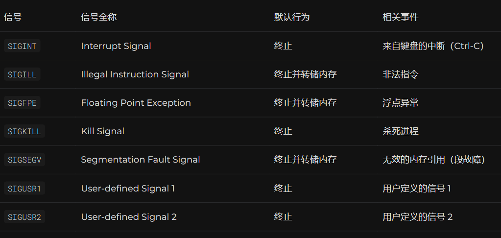
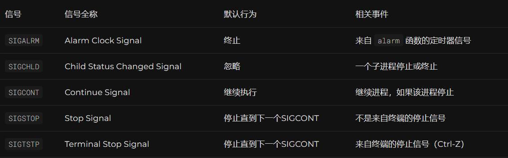
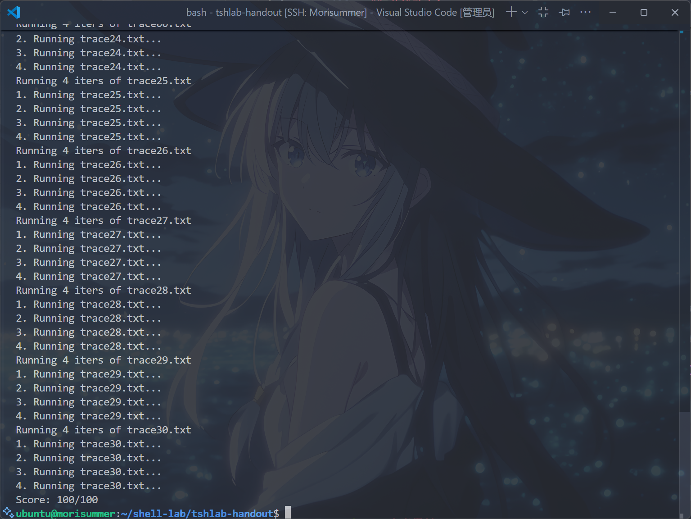

# 从零开始的Tsh Lab

> [!CAUTION]
> 
> **本笔记仅供参考，请勿抄袭。**

## 声明
本笔记的写作初衷在于，笔者在做Tsh Lab的时候受到Arthals学长很大启发，同时25Fall的计算机系统导论课程改制增加了10分的Lab测试（虽然往年的期中期末中也会有一两道Lab相关选择题，但分值不大）。故将心路历程写成此笔记，以便复习，并供后续选课同学参考。

## Tsh Lab简要介绍
此Lab亦称``Shell Lab``，但笔者取其原称``Tsh(Tiny Shell) Lab``，以更好阐明语义，下均称``Tsh Lab``。

``Tsh Lab``是《计算机系统导论》课程的第6个Lab，对应教材第八章《异常控制流》和第十章《系统级I/O》。该Lab旨在加强同学们对``信号与进程``的理解，使同学们深入探索``Shell``的相关知识，并认识到日常使用的``Shell``之奇妙。

在``Tsh Lab``中，需要实现一个简单的``Shell``，逐步完善不同功能，最终使它通过``31``个``trace``文件的测试，前``7``个``trace``文件为``4pts``，后``24``个``trace``文件为``3pts``，总分为``100pts``，以``AutoLab``上的得分为准（后文有提及为什么说这句话），虽然没有代码风格分要求，遵守相关工程规范，还是不可或缺的。与``Cache Lab``的``Part A``相似，``Tsh Lab``也有一个对照的标准模拟器``tshref``，可以使用它进行``Debug``。

在``Tsh Lab``中，在``Tsh.c``文件内，分别需要编写``eval``、``sigchld_handler``、``sigint_handler``和``sigtstp_handler``四个函数，它们分别用于``解析并解释命令行的主程序``、``捕获SIGCHLD``信号、``捕获SIGINT(ctrl+C)信号``以及``捕获SIGTSTP(ctrl+Z)信号``。此外，可以定义自己的辅助函数，以更好地符合工程规范。

值得一提的是，此``Lab``相比``Cache Lab``，又受到了PKU助教团队的大幅~~魔改~~加强。相比CMU的原版``Tsh Lab``，将测试样例从``16``个提升到``31``个，同时引入第十章的``I/O重定向``相关知识，并增加了``Kill``和``nohup``功能的实现任务。此Lab的难度为中高，笔者用时约为 $8 \sim 10$ 小时。

## 在动手之前
### 代码风格要求
- 代码需要有良好的注释，于程序文件开头描述块注释，说明``Shell``功能。
- 每个函数需要有注释，说明该函数的功能。
- 相关代码行前需要添加注释。
- 每行代码长度不能超过``80``个字符。
- 不要为每个行单独添加注释。

有关代码风格及格式化的解决方法，笔者已在[elainafan-从零开始的Cache Lab](https://www.elainafan.one/p/%E4%BB%8E%E9%9B%B6%E5%BC%80%E5%A7%8B%E7%9A%84cache-lab/)中``代码风格要求``这一节提及，供参考。

### 如何测评
在提交到``AutoLab``之前，可以使用``writeup``中提供的几种本地测评方式进行测评。

显而易见的是，可以在终端中使用``./tsh``命令，运行``tsh``并尝试不同指令，尝试找出报错，但是这种方法并不高效。

于是，可以使用``trace``文件进行输出比对，在终端中运行以下指令：

```bash
./runtrace -f tracexx.txt -s ./tsh # 测试你的tsh输出
./runtrace -f tracexx.txt -s ./tshref # 使用标准测试器测试输出
```

亦可使用提供的``sdriver.py``进行单个``trace``文件或全部``trace``文件的测试，如下：

```bash
./sdriver # 测试全部trace文件
./sdriver -t 03 # 测试trace03.txt文件
```

然而，笔者发现，本地满分的代码，在提交到``AutoLab``上时，竟然不一定是满分，可能是本地测试数据过弱（最近很频繁遇上这种事，笔者是倒霉蛋）导致的。

同时，如果出现上述情况，也请考虑是否合理避免了进程竞争（见下``回顾信号相关函数``一节），以及是否有哪处信号阻塞不合理。

### 除掉VSCODE的报错
若使用``Vscode``进行远程连接编写相关代码，可能会出现以下错误，即``未定义标识符sigset_t``。

如果像笔者一样患有每次存在报错就不改掉不开始写项目的强迫症的话，可以按``ctrl+shift+P(windows)/cmd+shift+P``，搜索``C/C++ 编辑配置(json)``，将其中``cStandard``改为``gnu11``，如下：

```json
{
    "configurations": [
        {
            "name": "Linux",
            "includePath": [
                "${workspaceFolder}/**"
            ],
            "defines": [],
            "compilerPath": "/usr/bin/gcc",
            "cStandard": "gnu11",
            "cppStandard": "gnu++17",
            "intelliSenseMode": "linux-gcc-x64"
        }
    ],
    "version": 4
}
```

### 何为Shell？
可能某些同学认为写这节很好笑，但是笔者在写``Tsh Lab``之前确实对``Shell``背后的工作原理不甚了解，此部分可参考《深入理解计算机系统》8.4.6节阅读。

``Shell``是一种交互式命令行解释器，代表用户运行程序，它以循环的形式重复执行以下操作：``显示提示符``、``等待标准输入上的命令行``、``根据命令行内容进行相关操作``。

``命令行``是以空格分隔的一系列``ASCII``文本单词，命令行中的第一个单词是``内建命令``的名称（立即执行该命令，若``quit``等），或者可执行文件的路径名（创建一个子进程，在子进程的上下文中加载并运行该程序），其余单词为命令行参数。

``Shell``为命令行的每条命令创建一个进程组，这是它从``内核``角度的名称，从``Shell``本身角度看，这个进程组就是这条命令对应的``作业/Job``。

若命令行以``&``结尾，说明创建的作业为``后台作业``，``Shell``不会等待作业终止，而是直接显示提示符并等待下一个命令行输入；反之，则为``前台作业``，``Shell``需要等待作业终止后才会接受下一条命令。换言之，同一时间最多只能有一个前台作业和若干后台作业运行。

以下，为``Shell``编写的大致逻辑（伪代码）：

```c
while (true) {
    读取命令行输入;
    if (命令为空) {
        continue;
    }
    if (命令为内建命令) {
        执行内建命令;
    } else {
        pid_t pid = fork();
        if (pid == 0) { // 子进程
            execve(程序路径, 参数, 环境变量);
        } else if (pid > 0) { // 父进程
            if (前台执行) {
                waitpid(pid, &status, 0);
            } else { // 后台执行
                printf("后台进程 PID: %d\\n", pid);
            }
        } else { // fork 失败
            perror("fork");
        }
    }
}
```

``Shell``支持多个通过``Linux``管道连接的子进程，例如以下命令：

```bash
ls -l | grep txt
```

即执行了``ls -l``和``grep txt``两个子进程，管道``|``右侧命令的输入当成左侧命令的输出（联想到Communication problems），意为列出当前目录下所有文件，然后筛选出名称中包含``txt``的那些。

``Shell``通常还包括``I/O重定向``功能，见下``何为I/O重定向？``一节。

### 认识Tsh.c中的相关结构
阅读``tsh.c``文件源码，找到``job``相关结构体：

```c
struct job_t
{                                         /* The job struct */
    pid_t pid;                            /* job PID */
    int jid;                              /* job ID [1, 2, ...] */
    int state; /* UNDEF, BG, FG, or ST */ // 即未定义，后台，前台，挂起
    char cmdline[MAXLINE];                /* command line */
};
struct job_t job_list[MAXJOBS]; /* The job list */
```

这意味着，每个作业是一个``job_t``对象，它的成员对象有``pid(对应的进程ID)``、``jid(对应的作业ID)``、``state(当前作业的状态)``以及``cmdline(当前作业对应的进程)``，所有作业被组织为一个数组``job_list``。

根据``writeup``，实现的``tsh``无需实现管道功能，即一条命令行只对应一个进程，这也意味着此处的作业不存在``pgid``和``子进程组``是合理的，更加简化地说，完全可以把``pid``看成进程意义下的唯一表示符，``jid``看成作业意义下的唯一表示符。

同时，有以下宏定义：

```c
/* Job states */
#define UNDEF 0 /* undefined */
#define FG 1    /* running in foreground */
#define BG 2    /* running in background */
#define ST 3    /* stopped */
```

这表示了每个``Job``对象的当前状态，即``未定义、前台、后台或停止``。

再阅读``tsh.c``源码，有以下结构：

```c
struct cmdline_tokens
{
    int argc;                            /* Number of arguments */
    char *argv[MAXARGS];                 /* The arguments list */
    char *infile; /* The input file */   // 输入重定向
    char *outfile; /* The output file */ // 输出重定向
    enum builtins_t
    {               /* Indicates if argv[0] is a builtin command */
      BUILTIN_NONE, // 啥都没有
      BUILTIN_QUIT, // 退出
      BUILTIN_JOBS, // 展示全部job
      BUILTIN_BG,   // 转为后台
      BUILTIN_FG,   // 转为前台
      BUILTIN_KILL, // 杀死job
      BUILTIN_NOHUP
    } builtins; // 忽视SIGNUP，启动新进程
};
```

这意味着，命令行参数被组织为一个``cmdline_tokens``类，其中``argc``表示``参数个数``，``argv``表示``参数列表``（由课本知识，``argv[0]``表示命令名称），``infile``跟``outfile``是读写重定向文件名（见后文），``builtins``是内建命令。

根据``writeup``，需要实现以下内建命令：

``quit``：对应``BUILTIN_QUIT``，即退出``Shell``。

``jobs``：对应``BUILTIN_JOBS``，列出全部``Jobs``。

``bg``：对应``BUILTIN_BG``，将某个``Job``转为``后台作业``。

``fg``：对应``BUILTIN_FG``，将某个``Job``转为``前台作业``。

``kill``：对应``BUILTIN_KILL``，给某个``Job``发去某个信号，通常会``终止``这个作业。

``nohup``：对应``BUILTIN_NOHUP``，忽略``SIGHUP``信号，启动一个新进程。

``None``：即为外部命令，对应``BUILTIN_NONE``。

有关这些命令的细致实现及其思路，见``开始动手``一节。

### 认识Tsh.c中的辅助函数
在``Tsh.c``中，可以观察到，提供了许多辅助函数，认识它们可以极大地提高编写效率。

``clearjob``：将某个``Job``清空为初始状态。

``initjobs``：对``job_list``的每个``job``执行``clearjob``。

``maxjid``：从``job_list``中找出最大的``job``。

``addjob``：将给出``pid,state,cmdline``三项参数的``job``添加到``job_list``中。

``deletejob``：将``PID=pid``的``job``从``job_list``中删除。

``fgpid``：返回当前前台``JOB``的``pid``。

``getjobpid``：返回``job_list``中``PID=pid``的``JOB``，若找不到则返回空指针。

``getjobjid``：返回``job_list``中``JID=jid``的``JOB``，若找不到则返回空指针。

``pid2jid``：给定``pid``，转换为对应``JOB``的``jid``。

``listjobs``：列出``job_list``中的所有``JOB``及其对应信息。

``unix_error``：用于封装相关函数，便于``Debug``。

``sig_put``：异步安全函数，接受类似``printf``的函数输出，支持``%d(打印整数)``跟``%%(打印%)``。

### 何为I/O重定向？
按照正常进度，发布``Tsh Lab``时，临近阶段测试二（即``4-8 chapter``），换言之，此时并未教学第十章，因此笔者在此作简要介绍。

一个``Linux``系统文件，就是一个``字节序列``，所有的I/O设备都被模型化为文件，所有的``输入输出``都被当做对相应文件的读和写来执行。

当一个应用程序要求``内核``打开相应的文件，来宣告它想要访问一个I/O设备时，内核返回一个小非负整数，称为该文件的``描述符``，其后对该文件的任何操作都通过此描述符进行，这个过程又称``打开文件``。

``Shell``创建的每个进程开始时都有三个打开的文件，即``标准输入/STDIN_FILENO/描述符为0``，``标准输出/STDOUT_FILENO/描述符为1``和``标准错误/STDERR_FILENO/描述符为2``。

``读写文件``，``读操作``即为从文件``复制``若干字节到内存，若剩余字节不够复制，则返回剩余字节数，下一次调用则返回``EOF信号``。``写操作``即为从内存中复制若干字节到文件，并更新当前文件对应的位置。

``关闭文件``，即当应用完成对文件访问后，它通知内核关闭这个文件。内核``释放``文件打开时创建的``数据结构``，并把``描述符``恢复到``可用描述符池``中。当一个进程终止时，需要内核关闭所有打开的文件。

在``Linux Shell``中，提供了``I/O重定向操作符``，允许用户将磁盘文件与标准输入联系起来，例如以下指令：

```bash
Linux> ls > foo.txt
```

即代表了让``Shell``执行``ls``程序，并将标准输出重定向到``foo.txt``中。

实际上，I/O重定向简要来说，就是将``输入/输出从标准输入/输出改换为给定的文件``的过程，一般在程序结束前再恢复标准输入/输出。

为了实现I/O重定向，通常需要使用以下函数：

```c
int open(char *filename, int flags,mode_t mode);
```

这个函数意为将``filename``转换为一个``文件描述符``，从而可以对其进行读写，若成功则返回这个文件描述符，不成功则返回``-1``。简要来说，就是打开``filename``文件。

而``flags``参数指明了进程如何访问这个文件：

- ``O_RDONLY``：只读
- ``O_WRONLY``：只写
- ``O_RDWR``：可读可写

有关``flags``与``mode``的其他用法，请自行查阅课本，此处为方便不再赘述。

```c
int close(int fd);
```

这个函数即关闭``文件描述符``为``fd``的文件，若成功则返回0，若不成功（如关闭了不存在的文件）则返回-1。

```c
int dup(int oldfd);
```

这个函数，复制一份``oldfd``的文件描述符给返回值。若成功则返回新的文件描述符，若失败则返回``-1``，并设置``errno``以指示错误（存储并恢复``error``原则的又一例证）。

```c
int dup2(int oldfd, int newfd);
```

这个函数，复制文件描述符``oldfd``给``newfd``，若成功则返回``newfd``，若失败则返回``-1``，并设置``errno``以指示错误。

有关这些函数应该如何组合形成文件重定向，详见``开始动手/I/O重定向``一节。

### 回顾信号及其相关函数
```c
pid_t fork();
```

老熟人了，调用一次返回两次，子进程返回0，父进程返回子进程的``pid``。

```c
int execve(const char *filename, const char *argv[], const char *envp[]);
```

加载并运行``filename``，将``argv``和``envp``分别作为``参数``跟``环境变量``传入，全局变量``environ``指向``envp[0]``。

```c
pid_t waitpid(pid_t pid,int* statusp,int options);
```

表示父进程等待子进程终止或者停止，下面是其参数含义：

- ``pid``：若大于0，则等待集合是``PID=pid``的子进程；若等于``-1``，则等待集合是该父进程的全部子进程，若等于``-x``，则等待集合是``pid=x``的进程组，若等于``0``，则等待集合是与调用进程在一个进程组的任意子进程。
- ``options``：表示为下面常量的并集组合
  - ``WNOHANG``：如果所有子进程都没有终止，则立即返回；默认行为为挂起调用进程直到子进程终止。
  - ``WUNTRACED``：挂起调用进程执行，直到等待集合中一个进程变为已终止或者被停止。
  - ``WCONTINUED``：挂起调用进程的执行，直到等待集合中一个正在运行的进程终止或等待集合中一个被停止的进程收到``SIGCONT``信号重新开始执行。
  - 若``options``为0，则挂起调用进程，等待子进程退出。
- ``statusp``：若放入一个指针，则``waitpid``返回后会将子进程相关状态存储于该指针指向的位置，即将``status``放入其指向的值。
- ``status``的几个宏：
  - ``WIFEXITED(status)``：若子进程通过``exit``或者一个返回正常终止，则返回真。
  - ``WEXITSTATUS(status)``：在``WIFEXITED(status)``返回真时，返回子进程的退出状态。
  - ``WIFSIGNALED(status)``：若子进程因为一个未被捕获的信号终止，则返回真。
  - ``WTERMSIG``：在``WIFSGINALED(status)``返回真时，返回导致子进程终止的信号的编号。
  - ``WIFSTOPPED(status)``：若引起返回的子进程当前是停止的，返回真。
  - ``WSTOPSIG(status)``：在``WIFSTOPPED(status)``返回真时，返回导致子进程停止的进程的编号。
  - ``WIFCONTINUED``：如果子进程收到``SIGCONT``信号重新启动，返回真。
- 若调用进程没有子进程，则``waitpid``返回``-1``，设置``errno``为``ECHILD``。
- 若``waitpid``被一个函数终止，则返回``-1``，设置``errno``为``EINTR``。

```c
int setpgid(pid_t pid, pid_t pgid);
```

表示将进程``pid``的进程组改为``pgid``，若``pid``为0，则使用当前进程的``PID``，如果``pgid``为0，则用``pid``指定的进程的``PID``作为``pgid``。当``pid``和``pgid``同时为0，则创建一个``pgid``为当前进程``pid``的进程组。

```c
int kill(pid_t pid,int sig)
```

- 若``pid>0``，将信号``sig``发送给``PID``为``pid``的进程。
- 若``pid=0``，将信号``sig``发送给调用进程所述进程组的所有进程。
- 若``pid<0``，将信号``sig``发送给``pgid=|pid|``的所有进程。
- 若成功则返回``0``，若不成功则返回``-1``。

```c
int sigprocmask(int how, const sigset_t *set, sigset_t *oldset);
```

- ``sigprocmask``：改变当前阻塞的信号集合，取决于``how``的值：
  - ``SIG_BLOCK``：将``set``中的信号添加到``blocked``中。
  - ``SIG_UNBLOCK``：从``blocked``中删除``set``中的信号。
  - ``SIG_SETMASK``：``block=set``
- 如果``oldset``非空，那么``blocked``的旧值保存在``oldset``中。

```c
int sigemptyset(sigset_t *set); // 初始化信号集合为空
int sigfillset(sigset_t *set); // 将所有信号添加到信号集合中
int sigaddset(sigset_t *set, int signum); // 将指定信号添加到信号集合中
int sigdelset(sigset_t *set, int signum); // 从信号集合中删除指定信号
```

函数功能如上文注释所示，通常用于辅助``sigprocmask``使用。

```c
int sigsuspend(const sigset_t *mask)
``` 

相当于以下版本的原子化（不可中断版本），显式等待信号，避免父子进程竞争。

```c
sigprocmask(SIG_SETMASK,&mask,&prev);
pause();
sigprocmask(SIG_SETMASK,&prev,NULL);
```

既然讲到``sigsuspend``函数，那势必需要回顾一下竞争机制了：

竞争机制，即分出子进程后，父子进程``并发``，顺序不一定与代码顺序一致，只需要满足``拓扑排序``。

可以参照以下两段代码深入理解：

```c
// 错误代码
while (1) {
    if ((pid = Fork()) == 0) {
        Execve("/bin/date", argv, NULL);
    }
    // 关注下一行
    Sigprocmask(SIG_BLOCK, &mask_all, &prev_all);
    addjob(pid);
    Sigprocmask(SIG_SETMASK, &prev_all, NULL);
}
exit(0);

// 正确代码
while (1) {
    // 先阻塞 SIGCHLD
    Sigprocmask(SIG_BLOCK, &mask_one, &prev_one);
    if ((pid = Fork()) == 0) {
        // 分出子进程后解除阻塞
        Sigprocmask(SIG_SETMASK, &prev_one, NULL);
        Execve("/bin/date", argv, NULL);
    }
    Sigprocmask(SIG_BLOCK, &mask_all, NULL);
    addjob(pid);
    Sigprocmask(SIG_SETMASK, &prev_one, NULL);
}
exit(0);
```

由于需要保证``addjob``操作的原子性（即读写不可中断），错误代码先``fork``创建子进程，再阻塞信号。

然而，在``Sigprocmask``之前，子进程可能已经终止，向父进程发送``SIGCHLD``信号。

此时父进程还没阻塞``SIGCHLD``，信号会立即触发处理函数，但是``addjob``还没执行，导致处理了不存在的``job``。

此外，还有以下常见信号需要使用：





### 笔者的提醒
笔者仍要提醒的是，这个Lab与``Data Lab``、``Cache Lab``一样，每次修改文件，在进行测评前，都需要在终端内输入``make``命令进行编译。

在``Tsh Lab``中，每个``JOB``要求可通过``PID``或者``JID``表示。``JID``是由``tsh``分配的正整数，在命令行中需以前缀``%``表示，例如``%5``表示``JID``为5的``JOB``，而``5``表示``PID``为``5``的作业，这要求实现时需要对某些命令进行``JID``和``PID``的实现。

``tsh``需要回收所有僵尸子进程，若某个作业因收到未捕获的信号而终止，则``tsh``需要识别该事件，并输出包含该作业``PID``及相关信号描述的信息。

由于父进程与子进程之间可能存在``竞争关系``，而由于拓扑排序的``不确定性``，可能运行多次都通过相关测试点，但是助教团队在阅读源码后若发现可能导致竞争条件的代码，会``扣除相应分数``。

其次，牢记课本中编写信号处理程序的相关要求，大致有以下几点：

- 尽可能调用``异步信号安全``函数
- 保存并恢复``errno``
- 访问共享全局数据结构时，``阻塞所有信号``

### 课本相关知识
- 8.4.6 一个eval函数的朴素实现
- 各种信号及其相关函数
- 竞争相关概念及其解决方式
- I/O重定向

## 开始动手！
### 阅读源码
首先阅读``main``函数，看看它都干了什么：

```c
/*
 * main - The shell's main routine
 */
int main(int argc, char **argv)
{
    char c;
    char cmdline[MAXLINE]; /* cmdline for fgets */
    int emit_prompt = 1;   /* emit prompt (default) */

    /* Redirect stderr to stdout (so that driver will get all output
     * on the pipe connected to stdout) */
    dup2(1, 2);

    /* Parse the command line */
    while ((c = getopt(argc, argv, "hvp")) != EOF)
    {
        switch (c)
        {
        case 'h': /* print help message */
            usage();
            break;
        case 'v': /* emit additional diagnostic info */
            verbose = 1;
            break;
        case 'p':            /* don't print a prompt */
            emit_prompt = 0; /* handy for automatic testing */
            break;
        default:
            usage();
        }
    }

    /* Install the signal handlers */

    /* These are the ones you will need to implement */
    Signal(SIGINT, sigint_handler);   /* ctrl-c */
    Signal(SIGTSTP, sigtstp_handler); /* ctrl-z */
    Signal(SIGCHLD, sigchld_handler); /* Terminated or stopped child */
    Signal(SIGTTIN, SIG_IGN);
    Signal(SIGTTOU, SIG_IGN);

    /* This one provides a clean way to kill the shell */
    Signal(SIGQUIT, sigquit_handler);

    /* Initialize the job list */
    initjobs(job_list);

    /* Execute the shell's read/eval loop */
    while (1)
    {

        if (emit_prompt)
        {
            printf("%s", prompt);
            fflush(stdout);
        }
        if ((fgets(cmdline, MAXLINE, stdin) == NULL) && ferror(stdin))
            app_error("fgets error");
        if (feof(stdin))
        {
            /* End of file (ctrl-d) */
            printf("\n");
            fflush(stdout);
            fflush(stderr);
            exit(0);
        }

        /* Remove the trailing newline */
        cmdline[strlen(cmdline) - 1] = '\0';

        /* Evaluate the command line */
        eval(cmdline);

        fflush(stdout);
        fflush(stdout);
    }

    exit(0); /* control never reaches here */
}
```

可以看到，它先解析了例如``-h``、``-v``等的命令行参数，然后使用封装后的``signal``函数为几个信号安装了信号处理函数（部分需要后续手动编写），初始化``JOB``列表，接着进入``打印提示符->读取输入->调用eval执行命令->刷新输出``的循环。

也就是说，其实``shell``的主要逻辑都已经实现了，此处只需要实现``eval``函数执行命令。

### 封装函数
在开始编写``eval``函数之前，回顾课本，为了便于Debug以及输出错误信息，需要将给定函数封装为大写开头函数（便于区分）。

因此，直接先将``回顾信号及其相关函数``这节中函数共同封装进代码中，以备不时之需。

根据``writeup``，``Execve``需要在加载外部指令失败时，输出``Command not found``指令，因此一并封装：

```c
// 一堆封装函数

pid_t Fork(void)
{
    pid_t pid;
    if ((pid = fork()) < 0)
        unix_error("Fork error");
    return pid;
}

int Open(char *pathname, int flags, mode_t mode)
{
    int fd = open(pathname, flags, mode);
    if (fd < 0)
    {
        unix_error("open error");
        exit(1);
    }
    return fd;
}

int Dup(int oldfd)
{
    int fd = dup(oldfd);
    if (fd < 0)
    {
        unix_error("dup error");
        exit(1);
    }
    return fd;
}

void Dup2(int oldfd, int newfd)
{
    if (dup2(oldfd, newfd) < 0)
    {
        unix_error("dup2 error");
        exit(1);
    }
    return;
}

void Close(int fd)
{
    if (close(fd) < 0)
    {
        unix_error("close error");
        exit(1);
    }
    return;
}

void Kill(pid_t pid, int sig)
{
    if (kill(pid, sig) < 0)
    {
        unix_error("kill error");
        exit(1);
    }
    return;
}

int Execve(char *filepath, char *const argv[], char *const envp[])
{
    int exe = execve(filepath, argv, envp);
    if (exe < 0)
    {
        printf("%s: Command not found\n", argv[0]);
        exit(1);
    }
    return exe;
}

void Sigprocmask(int how, const sigset_t *set, sigset_t *oldset)
{
    if (sigprocmask(how, set, oldset) < 0)
    {
        unix_error("sigprocmask error");
        exit(1);
    }
    return;
}

void Sigfillset(sigset_t *set)
{
    if (sigfillset(set) < 0)
    {
        unix_error("sigfillset error");
        exit(1);
    }
    return;
}

void Sigaddset(sigset_t *set, int sig)
{
    if (sigaddset(set, sig) < 0)
    {
        unix_error("sigaddset error");
        exit(1);
    }
    return;
}

void Sigemptyset(sigset_t *set)
{
    if (sigemptyset(set) < 0)
    {
        unix_error("sigemptyset error");
        exit(1);
    }
    return;
}
```

### 实现eval框架
好，基本准备工作都完成了，现在看看``eval``函数已给出的框架。

```c
void eval(char *cmdline)
{
    int bg; /* should the job run in bg or fg? */
    struct cmdline_tokens tok;

    /* Parse command line */
    bg = parseline(cmdline, &tok);

    if (bg == -1) /* parsing error */
        return;
    if (tok.argv[0] == NULL) /* ignore empty lines */
        return;

    return;
}
```

可以看到，它引入参数``bg``用于表示当前``JOB``属于前台或者后台，接着调用``parseline``函数将``bg``解析出来，再阅读``parseline``函数：

```c
int parseline(const char *cmdline, struct cmdline_tokens *tok)
{

    static char array[MAXLINE];        /* holds local copy of command line */
    const char delims[10] = " \t\r\n"; /* argument delimiters (white-space) */
    char *buf = array;                 /* ptr that traverses command line */
    char *next;                        /* ptr to the end of the current arg */
    char *endbuf;                      /* ptr to end of cmdline string */
    int is_bg;                         /* background job? */

    int parsing_state; /* indicates if the next token is the
                          input or output file */

    if (cmdline == NULL)
    {
        (void)fprintf(stderr, "Error: command line is NULL\n");
        return -1;
    }

    (void)strncpy(buf, cmdline, MAXLINE);
    endbuf = buf + strlen(buf);

    tok->infile = NULL;
    tok->outfile = NULL;

    /* Build the argv list */
    parsing_state = ST_NORMAL;
    tok->argc = 0;

    while (buf < endbuf)
    {
        /* Skip the white-spaces */
        buf += strspn(buf, delims);
        if (buf >= endbuf)
            break;

        /* Check for I/O redirection specifiers */
        if (*buf == '<')
        {
            if (tok->infile)
            {
                (void)fprintf(stderr, "Error: Ambiguous I/O redirection\n");
                return -1;
            }
            parsing_state |= ST_INFILE;
            buf++;
            continue;
        }
        if (*buf == '>')
        {
            if (tok->outfile)
            {
                (void)fprintf(stderr, "Error: Ambiguous I/O redirection\n");
                return -1;
            }
            parsing_state |= ST_OUTFILE;
            buf++;
            continue;
        }

        if (*buf == '\'' || *buf == '\"')
        {
            /* Detect quoted tokens */
            buf++;
            next = strchr(buf, *(buf - 1));
        }
        else
        {
            /* Find next delimiter */
            next = buf + strcspn(buf, delims);
        }

        if (next == NULL)
        {
            /* Returned by strchr(); this means that the closing
               quote was not found. */
            (void)fprintf(stderr, "Error: unmatched %c.\n", *(buf - 1));
            return -1;
        }

        /* Terminate the token */
        *next = '\0';

        /* Record the token as either the next argument or the i/o file */
        switch (parsing_state)
        {
        case ST_NORMAL:
            tok->argv[tok->argc++] = buf;
            break;
        case ST_INFILE:
            tok->infile = buf;
            break;
        case ST_OUTFILE:
            tok->outfile = buf;
            break;
        default:
            (void)fprintf(stderr, "Error: Ambiguous I/O redirection\n");
            return -1;
        }
        parsing_state = ST_NORMAL;

        /* Check if argv is full */
        if (tok->argc >= MAXARGS - 1)
            break;

        buf = next + 1;
    }

    if (parsing_state != ST_NORMAL)
    {
        (void)fprintf(stderr,
                      "Error: must provide file name for redirection\n");
        return -1;
    }

    /* The argument list must end with a NULL pointer */
    tok->argv[tok->argc] = NULL;

    if (tok->argc == 0) /* ignore blank line */
        return 1;

    if (!strcmp(tok->argv[0], "quit"))
    { /* quit command */
        tok->builtins = BUILTIN_QUIT;
    }
    else if (!strcmp(tok->argv[0], "jobs"))
    { /* jobs command */
        tok->builtins = BUILTIN_JOBS;
    }
    else if (!strcmp(tok->argv[0], "bg"))
    { /* bg command */
        tok->builtins = BUILTIN_BG;
    }
    else if (!strcmp(tok->argv[0], "fg"))
    { /* fg command */
        tok->builtins = BUILTIN_FG;
    }
    else if (!strcmp(tok->argv[0], "kill"))
    { /* kill command */
        tok->builtins = BUILTIN_KILL;
    }
    else if (!strcmp(tok->argv[0], "nohup"))
    { /* kill command */
        tok->builtins = BUILTIN_NOHUP;
    }
    else
    {
        tok->builtins = BUILTIN_NONE;
    }

    /* Should the job run in the background? */
    if ((is_bg = (*tok->argv[tok->argc - 1] == '&')) != 0)
        tok->argv[--tok->argc] = NULL;

    return is_bg;
}
```

大致可以认为，它将一行命令解释为``argv``、``重定向输入文件``、``重定向输出文件``、``前台/后台运行``、``是否为内建命令``，然后返回一个数表示前台/后台作业/错误。

回到``eval``函数，此时需要实现的任务大致明朗：

即，首先根据``infile``跟``outfile``实现I/O重定向，然后根据``cmdline_tokens``的``buitlins``判断执行哪条命令，最后关闭文件并恢复标准I/O。其结构大致如下：

```c
void eval(char *cmdline)
{
    int bg; /* should the job run in bg or fg? */
    struct cmdline_tokens tok;

    /* Parse command line */
    bg = parseline(cmdline, &tok);

    if (bg == -1) /* parsing error */
        return;
    if (tok.argv[0] == NULL) /* ignore empty lines */
        return;

    /*
    文件重定向
    */

    switch (tok.builtins)
    {
    case BUILTIN_NONE:
        // 处理外部命令
        break;
    case BUILTIN_QUIT:
        //处理quit命令
        break; 
    case BUILTIN_JOBS:
        // 处理jobs命令
        break;
    case BUILTIN_BG:
        // 处理bg命令
        break;
    case BUILTIN_FG:
        // 处理fg命令
        break;
    case BUILTIN_KILL:
        // 处理kill命令
        break;
    case BUILTIN_NOHUP:
        // 处理nohup命令
        break;
    default:
        break;
    }

   /*
   关闭文佳，恢复标准输入输出
   */

    return;
}
```

### I/O重定向
根据``何为I/O重定向``一节，其定义将输入/输出从标准输入/输出改换为给定的文件的过程，一般在程序结束前再恢复标准输入/输出。

于是，需要在``switch``处理相关参数之前，进行改换输出。

通常的思路是，先利用``dup``函数复制一份当前标准输入/输出的``文件描述符``，随后使用``open``函数打开输入的重定项文件，并调整好相关参数为只读/只写，接着利用``dup2``函数覆盖原有标准输入/输出。

在``switch``函数执行完主要命令后，利用``Close``关闭已打开的文件描述符，同时利用``Dup2``恢复原有标准输入/输出。

再根据上文封装的``Open``、``Close``、``Dup``、``Dup2``函数，完善``eval``函数如下：

```c
void eval(char *cmdline)
{
    int bg; /* should the job run in bg or fg? */
    struct cmdline_tokens tok;

    /* Parse command line */
    bg = parseline(cmdline, &tok);

    if (bg == -1) /* parsing error */
        return;
    if (tok.argv[0] == NULL) /* ignore empty lines */
        return;

    // 文件重定向，如果存在输入输出文件，将标准输入输出重定向
    int input = STDIN_FILENO;
    int output = STDOUT_FILENO;

    // 复制一份标准输入输出，便于恢复
    int std_in = Dup(STDIN_FILENO);
    int std_out = Dup(STDOUT_FILENO);

    if (tok.infile)
    {
        input = Open(tok.infile, O_RDONLY, 0);
        Dup2(input, STDIN_FILENO); // 将标准输入赋值为打开的只读文件
    }

    if (tok.outfile)
    {
        output = Open(tok.outfile, O_WRONLY, 0);
        Dup2(output, STDOUT_FILENO); // 将标准输出赋值为打开的只写文件
    }

    switch (tok.builtins)
    {
    case BUILTIN_NONE:
        // 处理外部命令
        break;
    case BUILTIN_QUIT:
        //处理quit命令
        break; 
    case BUILTIN_JOBS:
        // 处理jobs命令
        break;
    case BUILTIN_BG:
        // 处理bg命令
        break;
    case BUILTIN_FG:
        // 处理fg命令
        break;
    case BUILTIN_KILL:
        // 处理kill命令
        break;
    case BUILTIN_NOHUP:
        // 处理nohup命令
        break;
    default:
        break;
    }

    if (tok.infile)
    {
        Close(input);
        Dup2(std_in, STDIN_FILENO); // 关闭输入文件并恢复标准输入
    }

    if (tok.outfile)
    {
        Close(output);
        Dup2(std_out, STDOUT_FILENO); // 关闭输出文件并恢复标准输出
    }

    return;
}
```

### 解析外部指令
首先，根据``writeup``，父进程必须在创建子进程前，使用``sigprocmask``阻塞``SIGCHLD、SIGINT``和``SIGTSTP``信号。在调用``addjob``函数将子进程添加到``job_list``后，再使用``sigprocmask``解除这些信号的阻塞。由于子进程会继承父进程的信号阻塞集，因此子进程在加载新程序前，必须接触这些信号的阻塞。

笔者注：事实上，阻塞所有信号也是可行的。

先参照书上8.4.6的代码，得到一个简单实现：

```c
/* tsh.c/eval_none */
void eval_none(struct cmdline_tokens tok, int bg, char* cmdline) {
    pid_t pid;

    // 子进程
    if ((pid = fork()) == 0) {
        // 执行命令
        setpgid(0, 0);
        if (execve(tok.argv[0], tok.argv, environ) < 0) {
            printf("%s: Command not found.\n", tok.argv[0]);
            exit(0);
        }
    }

    // 父进程
    else {
        addjob(job_list, pid, bg ? BG : FG, cmdline);
        // 前台运行
        if (!bg) {
            int status;
            waitpid(pid, &status, 0);
        }
        // 后台运行
        else {
            printf("[%d] (%d) %s\n", pid2jid(pid), pid, cmdline);
        }
    }

    return;
}
```

可以看到，除了上述思路提到的问题，此处还存在一个问题。

即前台``JOB``与后台不同的点在于，前台``JOB``可以在终端内进行显式输出，而后台``JOB``则需要显式地加一行表示已经转为后台。

通常，使用终端时，运行一个前台``JOB``，``Shell``会运行这个``JOB``，直到其结束，用户才可输入下一行命令。

此处同理，在父进程创建一个前台子进程后，应该将显式等待前台``JOB``全部结束，再返回运行父进程。

但是，此处的``waitpid``貌似起到了等待的效果，但是由于其是一个阻塞函数，父进程会一直等待，直到子进程结束。若父进程此时接受到如``SIGINT``的其他信号，则可能造成永久阻塞，这则需要原子化的等待函数，即``sigsuspend``。

注意到，辅助函数提供了``fgpid``函数，该函数可以找到``job_list``中的前台``JOB``的``PID``，因此可以使用其与``while``循环遍历所有前台``JOB``，并使用``suspend``显式等待其结束。

而若为后台进程，则需要按照``writeup``中相关实例进行相应输出。

根据以上思路，编写代码，并在``eval``中添加相关调用如下：

```c
// 处理外部命令
void external_command(struct cmdline_tokens tok, int bg, char *cmdline)
{
    pid_t pid = 0;
    sigset_t mask, prev_mask;
    Sigemptyset(&mask); // 阻塞以下三个信号，防止竞争
    Sigaddset(&mask, SIGCHLD);
    Sigaddset(&mask, SIGINT);
    Sigaddset(&mask, SIGTSTP);
    Sigprocmask(SIG_BLOCK, &mask, &prev_mask);

    if ((pid = Fork()) == 0)
    {
        setpgid(0, 0);                              // 创建新子进程
        Sigprocmask(SIG_SETMASK, &prev_mask, NULL); // 恢复原来信号
        if (Execve(tok.argv[0], tok.argv, environ) < 0)
            exit(0);
    }
    else
    {
        Sigfillset(&mask); // 屏蔽全部信号
        Sigprocmask(SIG_SETMASK, &mask, NULL);
        addjob(job_list, pid, bg ? BG : FG, cmdline); // 添加新job
        Sigprocmask(SIG_SETMASK, &prev_mask, NULL);   // 恢复原来信号
        if (!bg)
        {
            while (fgpid(job_list)) // 前台进程，挂起父进程直到子进程结束
                sigsuspend(&prev_mask);
        }
        else
        {
            printf("[%d] (%d) %s\n", pid2jid(pid), pid, cmdline); // 直接输出
        }
    }
    return;
}

case BUILTIN_NONE:
    external_command(tok, bg, cmdline); // 处理外部命令
    break;
```

### 实现退出/quit
实现退出是非常简单的，只需要在``switch``的``BUILTIN_QUIT``中加入``exit(0)``即可：

```c
case BUILTIN_QUIT:
    exit(0); // 直接退出
```

### 列出全部JOB/jobs
仔细阅读``认识tsh.c的辅助函数``一节，发现``listjobs``能完美完成这个任务，只需要调用它即可：

```c
case BUILTIN_JOBS:
    listjobs(job_list, output); // 调用辅助函数列出全部job
    break;
```

### 作业重启转后台/bg
根据``writeup``，``bg job``命令通过发送``SIGCONT``信号重启``JOB``，并使其在后台运行，``job``的参数可以是``PID(即数字)``或``JID(即%数字)``。

由于需要找出具体哪个``JOB``，因此编写的辅助函数需要导入``tok``作为参数，从``tok.argv[1][0]``是否为``%``判断参数为``PID``或``JID``。

随后，使用``atoi``函数将字符参数转化为对应整数，通过``getjobpid``或者``getjobjid``取出该参数对应的``JOB``，改变其状态，并使用封装后的``Kill``函数对该``JOB``发去一个``SIGCONT``信号。

根据``writeup``给出的实例，此时还需要输出相关语句表明成功转为后台。

根据以上思路，编写函数，并在``eval``中添加相关调用如下：

```c
// 将前台进程转化为后台进程
void turn_bg(struct cmdline_tokens tok)
{
    int jid;
    pid_t pid;
    struct job_t *job;
    if (tok.argv[1][0] == '%')
    {
        jid = atoi(tok.argv[1] + 1);
        job = getjobjid(job_list, jid);
        pid = job->pid;
    }
    else
    {
        pid = atoi(tok.argv[1]);
        job = getjobpid(job_list, pid);
    } // 找到对应的job
    job->state = BG; // 改变状态
    printf("[%d] (%d) %s\n", pid2jid(pid), pid, job->cmdline);
    Kill(pid, SIGCONT); // 唤醒进程
    return;
}

case BUILTIN_BG:
    turn_bg(tok); // 进程转后台
    break;
```
### 作业重启转前台/fg
根据``writeup``，``fg job``命令通过发送``SIGCONT``信号重启``JOB``，并使其在前台运行，``job``的参数可以是``PID(即数字)``或``JID(即%数字)``。

其思路与``bg``指令相似，根据``argv``取出对应``PID``或``JID``相同，以及发送``SIGCONT``信号也相同，这里不再赘述。

但是，如``解析外部命令``中所述，前台``JOB``与后台``JOB``不同的是，需要显式等待前台``JOB``结束，实现方式与其相同。

根据以上思路，编写函数，并在``eval``中添加相关调用如下：

```c
// 后台进程转前台进程
void turn_fg(struct cmdline_tokens tok)
{
    int jid;
    pid_t pid;
    struct job_t *job;
    sigset_t mask;
    Sigemptyset(&mask);
    if (tok.argv[1][0] == '%')
    {
        jid = atoi(tok.argv[1] + 1);
        job = getjobjid(job_list, jid);
        pid = job->pid;
    }
    else
    {
        pid = atoi(tok.argv[1]);
        job = getjobpid(job_list, pid);
    } // 找到对应进程
    job->state = FG;        // 改变状态
    Kill(pid, SIGCONT);     // 唤醒进程
    while (fgpid(job_list)) // 挂起进程直到其结束
        sigsuspend(&mask);
    return;
}

case BUILTIN_FG:
    turn_fg(tok); // 进程转前台
    break;
```

### 发送信号终止/kill
根据``writeup``，``kill job``命令，对相关每个进程发送``SIGTERM``信号，终止作业列表的某个``JOB``或某个进程组，参数可以是``PID``或者``JID``。若输入的的``JID/PID``为负数，则需要终止``-JID``的``JOB``以及``-PID``对应的``JOB``对应的进程组，若为正数则直接终止对应``JOB``。若需要终止的``JOB``或进程组不存在，则按照对应格式输出。

根据上文分析，在``Tsh Lab``中，每个进程组中只存在一个进程，因此可以看成某个``JOB``在两种意义上的表示。

还是与``bg``中相似的思路，先取出对应的``JID/PID``，再找到相应``JOB``，如果通过``getjobpid/getjobjid``取出的指针为空，则按照``pid/jid``是否为负数输出相应结果。若不为空则通过封装后的``Kill``函数发去对应信号。

根据以上代码，编写函数，并在``eval``中添加相关调用如下：

```c
// 杀死某个进程或进程组
void job_kill(struct cmdline_tokens tok, int sig)
{
    pid_t pid;
    int jid;
    struct job_t *job;
    if (tok.argv[1][0] == '%')
    {
        jid = atoi(tok.argv[1] + 1);
        int new_jid = abs(jid);
        job = getjobjid(job_list, new_jid);
        if (!job)
        {
            if (jid < 0)
                printf("%%%d: No such process group\n", jid);
            else
                printf("%%%d: No such job\n", jid);
            return;
        }
        pid = job->pid;
    } // 根据jid找到对应进程/组，并输出
    else
    {
        pid = atoi(tok.argv[1]);
        int new_pid = abs(pid);
        job = getjobpid(job_list, new_pid);
        if (!job)
        {
            if (pid < 0)
                printf("(%d): No such process group\n", pid);
            else
                printf("(%d):No such job\n", pid);
            return;
        }
    } // 根据pid找到对应进程/组，并输出
    Kill(pid, sig); // 杀掉对应进程
    return;
}

case BUILTIN_KILL:
    job_kill(tok, SIGTERM); // 进行默认信号的杀死进程
    break;
```
### 忽略信号/nohup
根据``writeup``，需要忽略``SIGHUP``信号，启动一个新进程。

一个显然的思路是，通过信号掩码除掉``SIGHUP``信号，然后调用``eval``新建一个命令行解析函数，注意传进的命令行串此时需要加上``nohup ``这六个字符的偏移量，最后为当前``eval``恢复信号掩码。

根据以上思路，编写函数，并在``eval``中添加相关调用如下：

```c
// 使后续指令忽略所有该信号
void job_nohup(char *cmdline)
{
    sigset_t mask, prev_mask;
    Sigemptyset(&mask);
    Sigaddset(&mask, SIGHUP);
    Sigprocmask(SIG_BLOCK, &mask, &prev_mask);
    eval(cmdline + 6);                          // 启动一个新子进程，忽略"nohup "字样
    Sigprocmask(SIG_SETMASK, &prev_mask, NULL); // 恢复信号屏蔽
    return;
}

case BUILTIN_NOHUP:
    job_nohup(cmdline); // 忽略所有该信号，并启动新进程
    break;
```
### SIGCHLD信号处理/回收子进程
在``main.c``中，存在着几条``signal(sig,handler)``代码。

即需要手动编写它的信号处理程序。

参照``回顾信号``及其相关函数一节，``SIGCHLD``在一个子进程发生变化时被发出，它的默认行为是忽略。

而此处根据``writeup``，需要将信号处理程序改为``回收对应子进程``。根据课本，只需要不断使用``waitpid``等待子进程正常终止/被信号终止/被信号停止/由信号继续，而这几个功能都可以由``waitpid``中的``status``的几个宏实现。

笔者猜想读者到这里都忘了是哪些宏了，请参照上文``回顾信号及其函数``一节查阅。

细致讲来，即子进程正常终止，则调用``deletejob``辅助函数删除该``JOB``。若子进程被信号终止，则输出相应输出，并同上删除该``JOB``。若子进程被信号停止，则输出相应输出，并修改该子进程状态为停止。若停止的子进程收到``SIGCONT``信号，则修改其状态为后台。

根据身边统计学，许多同学漏掉``收到SIGCONT信号``这一判断分支，需要注意。

然后，由于此处为内核的信号处理程序，需要非常小心地遵循前文提到的几条规则：

尽可能调用``异步信号安全``函数，因此此处需要使用提供的``sio_out``函数。

保存并恢复``errno``，即在函数开头存储旧``errno``，在函数结尾恢复``errno``。

访问共享全局数据结构时，``阻塞所有信号``。此处``job_list``为全局数据结构，因此每次访问它都需要使用``sigprocmask``阻塞全部信号。

最后，由于避免可能的没有需要回收的子进程却接到``SIGCHLD``信号的错误情况，考虑使用``unix_error``抛出一个错误。

根据以上思路，编写代码如下：

```c
// 回收所有变化子进程
void sigchld_handler(int sig)
{
    int old_errno = errno; // 存储旧errno，规则限制
    sigset_t mask, mask_prev;
    pid_t pid;
    struct job_t *job;
    int status;
    int jid;
    while ((pid = waitpid(-1, &status, WNOHANG | WUNTRACED | WCONTINUED)) > 0) // 遍历所有变化的子进程
    {
        job = getjobpid(job_list, pid); // 找到对应的job
        if (!job)
            continue; // 防止NULL解引用，好习惯
        jid = job->jid;
        if (WIFEXITED(status)) // 正常终止的子进程
        {
            Sigfillset(&mask);
            Sigprocmask(SIG_BLOCK, &mask, &mask_prev);  // 屏蔽全部信号，保护全局数据结构
            deletejob(job_list, pid);                   // 删除对应进程
            Sigprocmask(SIG_SETMASK, &mask_prev, NULL); // 恢复屏蔽的信号
        }
        if (WIFSIGNALED(status)) // 被信号终止的子进程
        {
            sio_put("Job [%d] (%d) terminated by signal %d\n", jid, pid, WTERMSIG(status)); // 输出相关信息
            Sigfillset(&mask);
            Sigprocmask(SIG_BLOCK, &mask, &mask_prev);  // 屏蔽全部信号，保护全局数据结构
            deletejob(job_list, pid);                   // 删除对应进程
            Sigprocmask(SIG_SETMASK, &mask_prev, NULL); // 恢复屏蔽的信号
        }
        if (WIFSTOPPED(status)) // 被信号停止的子进程
        {
            sio_put("Job [%d] (%d) stopped by signal %d\n", jid, pid, WSTOPSIG(status)); // 输出相关信息
            Sigfillset(&mask);
            Sigprocmask(SIG_BLOCK, &mask, &mask_prev);  // 屏蔽全部信号，保护全局数据结构
            job->state = ST;                            // 停止对应进程
            Sigprocmask(SIG_SETMASK, &mask_prev, NULL); // 恢复屏蔽的信号
        }
        if (WIFCONTINUED(status) && job->state == ST) // 收到SIGCONT被重启的进程
        {
            Sigfillset(&mask);
            Sigprocmask(SIG_BLOCK, &mask, &mask_prev);  // 屏蔽全部信号，保护全局数据结构
            job->state = BG;                            // 改变进程状态
            Sigprocmask(SIG_SETMASK, &mask_prev, NULL); // 恢复屏蔽的信号
        }
    }
    if (pid < 0 && errno != ECHILD) // 如果没有需要回收的子进程，报错
    {
        unix_error("waitpid error");
    }
    errno = old_errno; // 恢复errno
    return;
}
```

### SIGINT信号处理/Ctrl+C
根据``writeup``，当接到``SIGINT``信号时，需要向前台``JOB``发去一个``SIGINT``信号。

如上文所述，可使用``fgpid``函数获取当前前台``JOB``的``PID``，然后调用封装后的``Kill``函数发去``SIGINT``信号。

与``SIGCHLD``的信号处理程序类似，此处仍需遵循编写信号处理程序的三条规则。

根据以上思路，编写代码如下：

```c
void sigint_handler(int sig)
{
    int old_errno = errno; // 存储旧errno，规则限制
    sigset_t mask, mask_prev;
    pid_t pid;
    pid = fgpid(job_list); // 找到当前前台进程
    if (pid)
    {
        Sigfillset(&mask);
        Sigprocmask(SIG_BLOCK, &mask, &mask_prev);  // 屏蔽全部信号，保护全局数据结构
        Kill(pid, SIGINT);                          // 给它发SIGINT信号
        Sigprocmask(SIG_SETMASK, &mask_prev, NULL); // 恢复屏蔽的信号
    }
    errno = old_errno; // 恢复errno
    return;
}
```

### SIGTSTP信号处理/Ctrl+Z
根据``writeup``，当接到``SIGINT``信号时，需要向前台``JOB``发去一个``SIGTSTP``信号。

如上文所述，可使用``fgpid``函数获取当前前台``JOB``的``PID``，然后调用封装后的``Kill``函数发去``SIGTSTP``信号。

与``SIGCHLD``的信号处理程序类似，此处仍需遵循编写信号处理程序的三条规则。

根据以上思路，编写代码如下：

```c
void sigtstp_handler(int sig) {
    int old_errno = errno;  // 存储旧errno，规则限制
    sigset_t mask, mask_prev;
    pid_t pid;
    pid = fgpid(job_list);  // 找到前台进程
    if (pid) {
        Sigfillset(&mask);
        Sigprocmask(SIG_BLOCK, &mask, &mask_prev);   // 屏蔽全部信号，保护全局数据结构
        Kill(pid, SIGTSTP);                          // 给它发SIGTSTP信号
        Sigprocmask(SIG_SETMASK, &mask_prev, NULL);  // 恢复屏蔽的信号
    }
    errno = old_errno;  // 恢复errno
    return;
}
```

### 成品代码
将上述全部代码拼在一起，得到成品代码：

```c
/*
 * tsh - A tiny shell program with job control
 *
 * <Put your name and login ID here>
 */
#include <assert.h>
#include <stdio.h>
#include <stdlib.h>
#include <unistd.h>
#include <string.h>
#include <ctype.h>
#include <signal.h>
#include <sys/types.h>
#include <fcntl.h>
#include <sys/wait.h>
#include <errno.h>
#include <stdarg.h>

#define abs(x) (x >= 0 ? x : -x)

/* Misc manifest constants */
#define MAXLINE 1024   /* max line size */
#define MAXARGS 128    /* max args on a command line */
#define MAXJOBS 16     /* max jobs at any point in time */
#define MAXJID 1 << 16 /* max job ID */

/* Job states */
#define UNDEF 0 /* undefined */
#define FG 1    /* running in foreground */
#define BG 2    /* running in background */
#define ST 3    /* stopped */

/*
 * Jobs states: FG (foreground), BG (background), ST (stopped)
 * Job state transitions and enabling actions:
 *     FG -> ST  : ctrl-z
 *     ST -> FG  : fg command
 *     ST -> BG  : bg command
 *     BG -> FG  : fg command
 * At most 1 job can be in the FG state.
 */

/* Parsing states */
#define ST_NORMAL 0x0  /* next token is an argument */
#define ST_INFILE 0x1  /* next token is the input file */
#define ST_OUTFILE 0x2 /* next token is the output file */

/* Global variables */
extern char **environ;   /* defined in libc */
char prompt[] = "tsh> "; /* command line prompt (DO NOT CHANGE) */
int verbose = 0;         /* if true, print additional output */
int nextjid = 1;         /* next job ID to allocate */
char sbuf[MAXLINE];      /* for composing sprintf messages */

struct job_t
{                                         /* The job struct */
    pid_t pid;                            /* job PID */
    int jid;                              /* job ID [1, 2, ...] */
    int state; /* UNDEF, BG, FG, or ST */ // 即未定义，后台，前台，挂起
    char cmdline[MAXLINE];                /* command line */
};
struct job_t job_list[MAXJOBS]; /* The job list */

struct cmdline_tokens
{
    int argc;                            /* Number of arguments */
    char *argv[MAXARGS];                 /* The arguments list */
    char *infile; /* The input file */   // 输入重定向
    char *outfile; /* The output file */ // 输出重定向
    enum builtins_t
    {               /* Indicates if argv[0] is a builtin command */
      BUILTIN_NONE, // 啥都没有
      BUILTIN_QUIT, // 退出
      BUILTIN_JOBS, // 展示全部job
      BUILTIN_BG,   // 转为后台
      BUILTIN_FG,   // 转为前台
      BUILTIN_KILL, // 杀死job
      BUILTIN_NOHUP
    } builtins; // 忽视SIGHUP，启动新进程
};

/* End global variables */

/* Function prototypes */

pid_t Fork(void);
void eval(char *cmdline);

void sigchld_handler(int sig);
void sigtstp_handler(int sig);
void sigint_handler(int sig);

/* Here are helper routines that we've provided for you */
int parseline(const char *cmdline, struct cmdline_tokens *tok);
void sigquit_handler(int sig);

void clearjob(struct job_t *job);
void initjobs(struct job_t *job_list);
int maxjid(struct job_t *job_list);
int addjob(struct job_t *job_list, pid_t pid, int state, char *cmdline);
int deletejob(struct job_t *job_list, pid_t pid);
pid_t fgpid(struct job_t *job_list);
struct job_t *getjobpid(struct job_t *job_list, pid_t pid);
struct job_t *getjobjid(struct job_t *job_list, int jid);
int pid2jid(pid_t pid);
void listjobs(struct job_t *job_list, int output_fd);

void usage(void);
void unix_error(char *msg);
void app_error(char *msg);
ssize_t sio_puts(char s[]);
ssize_t sio_putl(long v);
ssize_t sio_put(const char *fmt, ...);
void sio_error(char s[]);

typedef void handler_t(int);
handler_t *Signal(int signum, handler_t *handler);

/*
 * main - The shell's main routine
 */
int main(int argc, char **argv)
{
    char c;
    char cmdline[MAXLINE]; /* cmdline for fgets */
    int emit_prompt = 1;   /* emit prompt (default) */

    /* Redirect stderr to stdout (so that driver will get all output
     * on the pipe connected to stdout) */
    dup2(1, 2);

    /* Parse the command line */
    while ((c = getopt(argc, argv, "hvp")) != EOF)
    {
        switch (c)
        {
        case 'h': /* print help message */
            usage();
            break;
        case 'v': /* emit additional diagnostic info */
            verbose = 1;
            break;
        case 'p':            /* don't print a prompt */
            emit_prompt = 0; /* handy for automatic testing */
            break;
        default:
            usage();
        }
    }

    /* Install the signal handlers */

    /* These are the ones you will need to implement */
    Signal(SIGINT, sigint_handler);   /* ctrl-c */
    Signal(SIGTSTP, sigtstp_handler); /* ctrl-z */
    Signal(SIGCHLD, sigchld_handler); /* Terminated or stopped child */
    Signal(SIGTTIN, SIG_IGN);
    Signal(SIGTTOU, SIG_IGN);

    /* This one provides a clean way to kill the shell */
    Signal(SIGQUIT, sigquit_handler);

    /* Initialize the job list */
    initjobs(job_list);

    /* Execute the shell's read/eval loop */
    while (1)
    {

        if (emit_prompt)
        {
            printf("%s", prompt);
            fflush(stdout);
        }
        if ((fgets(cmdline, MAXLINE, stdin) == NULL) && ferror(stdin))
            app_error("fgets error");
        if (feof(stdin))
        {
            /* End of file (ctrl-d) */
            printf("\n");
            fflush(stdout);
            fflush(stderr);
            exit(0);
        }

        /* Remove the trailing newline */
        cmdline[strlen(cmdline) - 1] = '\0';

        /* Evaluate the command line */
        eval(cmdline);

        fflush(stdout);
        fflush(stdout);
    }

    exit(0); /* control never reaches here */
}

// 一堆封装函数

pid_t Fork(void)
{
    pid_t pid;
    if ((pid = fork()) < 0)
        unix_error("Fork error");
    return pid;
}

int Open(char *pathname, int flags, mode_t mode)
{
    int fd = open(pathname, flags, mode);
    if (fd < 0)
    {
        unix_error("open error");
        exit(1);
    }
    return fd;
}

int Dup(int oldfd)
{
    int fd = dup(oldfd);
    if (fd < 0)
    {
        unix_error("dup error");
        exit(1);
    }
    return fd;
}

void Dup2(int oldfd, int newfd)
{
    if (dup2(oldfd, newfd) < 0)
    {
        unix_error("dup2 error");
        exit(1);
    }
    return;
}

void Close(int fd)
{
    if (close(fd) < 0)
    {
        unix_error("close error");
        exit(1);
    }
    return;
}

void Kill(pid_t pid, int sig)
{
    if (kill(pid, sig) < 0)
    {
        unix_error("kill error");
        exit(1);
    }
    return;
}

int Execve(char *filepath, char *const argv[], char *const envp[])
{
    int exe = execve(filepath, argv, envp);
    if (exe < 0)
    {
        printf("%s: Command not found\n", argv[0]);
        exit(1);
    }
    return exe;
}

void Sigprocmask(int how, const sigset_t *set, sigset_t *oldset)
{
    if (sigprocmask(how, set, oldset) < 0)
    {
        unix_error("sigprocmask error");
        exit(1);
    }
    return;
}

void Sigfillset(sigset_t *set)
{
    if (sigfillset(set) < 0)
    {
        unix_error("sigfillset error");
        exit(1);
    }
    return;
}

void Sigaddset(sigset_t *set, int sig)
{
    if (sigaddset(set, sig) < 0)
    {
        unix_error("sigaddset error");
        exit(1);
    }
    return;
}

void Sigemptyset(sigset_t *set)
{
    if (sigemptyset(set) < 0)
    {
        unix_error("sigemptyset error");
        exit(1);
    }
    return;
}

/*
 * eval - Evaluate the command line that the user has just typed in
 *
 * If the user has requested a built-in command (quit, jobs, bg or fg)
 * then execute it immediately. Otherwise, fork a child process and
 * run the job in the context of the child. If the job is running in
 * the foreground, wait for it to terminate and then return.  Note:
 * each child process must have a unique process group ID so that our
 * background children don't receive SIGINT (SIGTSTP) from the kernel
 * when we type ctrl-c (ctrl-z) at the keyboard.
 */
// 处理外部命令
void external_command(struct cmdline_tokens tok, int bg, char *cmdline)
{
    pid_t pid = 0;
    sigset_t mask, prev_mask;
    Sigemptyset(&mask); // 阻塞以下三个信号，防止竞争
    Sigaddset(&mask, SIGCHLD);
    Sigaddset(&mask, SIGINT);
    Sigaddset(&mask, SIGTSTP);
    Sigprocmask(SIG_BLOCK, &mask, &prev_mask);

    if ((pid = Fork()) == 0)
    {
        setpgid(0, 0);                              // 创建新子进程
        Sigprocmask(SIG_SETMASK, &prev_mask, NULL); // 恢复原来信号
        if (Execve(tok.argv[0], tok.argv, environ) < 0)
            exit(0);
    }
    else
    {
        Sigfillset(&mask); // 屏蔽全部信号
        Sigprocmask(SIG_SETMASK, &mask, NULL);
        addjob(job_list, pid, bg ? BG : FG, cmdline); // 添加新job
        Sigprocmask(SIG_SETMASK, &prev_mask, NULL);   // 恢复原来信号
        if (!bg)
        {
            while (fgpid(job_list)) // 前台进程，挂起父进程直到子进程结束
                sigsuspend(&prev_mask);
        }
        else
        {
            printf("[%d] (%d) %s\n", pid2jid(pid), pid, cmdline); // 直接输出
        }
    }
    return;
}

// 将前台进程转化为后台进程
void turn_bg(struct cmdline_tokens tok)
{
    int jid;
    pid_t pid;
    struct job_t *job;
    if (tok.argv[1][0] == '%')
    {
        jid = atoi(tok.argv[1] + 1);
        job = getjobjid(job_list, jid);
        pid = job->pid;
    }
    else
    {
        pid = atoi(tok.argv[1]);
        job = getjobpid(job_list, pid);
    } // 找到对应的job
    job->state = BG; // 改变状态
    printf("[%d] (%d) %s\n", pid2jid(pid), pid, job->cmdline);
    Kill(pid, SIGCONT); // 唤醒进程
    return;
}

// 后台进程转前台进程
void turn_fg(struct cmdline_tokens tok)
{
    int jid;
    pid_t pid;
    struct job_t *job;
    sigset_t mask;
    Sigemptyset(&mask);
    if (tok.argv[1][0] == '%')
    {
        jid = atoi(tok.argv[1] + 1);
        job = getjobjid(job_list, jid);
        pid = job->pid;
    }
    else
    {
        pid = atoi(tok.argv[1]);
        job = getjobpid(job_list, pid);
    } // 找到对应进程
    job->state = FG;        // 改变状态
    Kill(pid, SIGCONT);     // 唤醒进程
    while (fgpid(job_list)) // 挂起进程直到其结束
        sigsuspend(&mask);
    return;
}

// 杀死某个进程或进程组
void job_kill(struct cmdline_tokens tok, int sig)
{
    pid_t pid;
    int jid;
    struct job_t *job;
    if (tok.argv[1][0] == '%')
    {
        jid = atoi(tok.argv[1] + 1);
        int new_jid = abs(jid);
        job = getjobjid(job_list, new_jid);
        if (!job)
        {
            if (jid < 0)
                printf("%%%d: No such process group\n", jid);
            else
                printf("%%%d: No such job\n", jid);
            return;
        }
        pid = job->pid;
    } // 根据jid找到对应进程/组，并输出
    else
    {
        pid = atoi(tok.argv[1]);
        int new_pid = abs(pid);
        job = getjobpid(job_list, new_pid);
        if (!job)
        {
            if (pid < 0)
                printf("(%d): No such process group\n", pid);
            else
                printf("(%d):No such job\n", pid);
            return;
        }
    } // 根据pid找到对应进程/组，并输出
    Kill(pid, sig); // 杀掉对应进程
    return;
}

// 使后续指令忽略所有该信号
void job_nohup(char *cmdline)
{
    sigset_t mask, prev_mask;
    Sigemptyset(&mask);
    Sigaddset(&mask, SIGHUP);
    Sigprocmask(SIG_BLOCK, &mask, &prev_mask);
    eval(cmdline + 6);                          // 启动一个新子进程，忽略"nohup "字样
    Sigprocmask(SIG_SETMASK, &prev_mask, NULL); // 恢复信号屏蔽
    return;
}

void eval(char *cmdline)
{
    int bg; /* should the job run in bg or fg? */
    struct cmdline_tokens tok;

    /* Parse command line */
    bg = parseline(cmdline, &tok);

    if (bg == -1) /* parsing error */
        return;
    if (tok.argv[0] == NULL) /* ignore empty lines */
        return;

    // 文件重定向，如果存在输入输出文件，将标准输入输出重定向
    int input = STDIN_FILENO;
    int output = STDOUT_FILENO;

    // 复制一份标准输入输出，便于恢复
    int std_in = Dup(STDIN_FILENO);
    int std_out = Dup(STDOUT_FILENO);

    if (tok.infile)
    {
        input = Open(tok.infile, O_RDONLY, 0);
        Dup2(input, STDIN_FILENO); // 将标准输入赋值为打开的只读文件
    }

    if (tok.outfile)
    {
        output = Open(tok.outfile, O_WRONLY, 0);
        Dup2(output, STDOUT_FILENO); // 将标准输出赋值为打开的只写文件
    }

    switch (tok.builtins)
    {
    case BUILTIN_NONE:
        external_command(tok, bg, cmdline); // 处理外部命令
        break;
    case BUILTIN_QUIT:
        exit(0); // 直接退出
    case BUILTIN_JOBS:
        listjobs(job_list, output); // 调用辅助函数列出全部job
        break;
    case BUILTIN_BG:
        turn_bg(tok); // 进程转后台
        break;
    case BUILTIN_FG:
        turn_fg(tok); // 进程转前台
        break;
    case BUILTIN_KILL:
        job_kill(tok, SIGTERM); // 进行默认信号的杀死进程
        break;
    case BUILTIN_NOHUP:
        job_nohup(cmdline); // 忽略所有该信号，并启动新进程
        break;
    default:
        break;
    }

    if (tok.infile)
    {
        Close(input);
        Dup2(std_in, STDIN_FILENO); // 关闭输入文件并恢复标准输入
    }

    if (tok.outfile)
    {
        Close(output);
        Dup2(std_out, STDOUT_FILENO); // 关闭输出文件并恢复标准输出
    }

    return;
}

/*
 * parseline - Parse the command line and build the argv array.
 *
 * Parameters:
 *   cmdline:  The command line, in the form:
 *
 *                command [arguments...] [< infile] [> oufile] [&]
 *
 *   tok:      Pointer to a cmdline_tokens structure. The elements of this
 *             structure will be populated with the parsed tokens. Characters
 *             enclosed in single or double quotes are treated as a single
 *             argument.
 * Returns:
 *   1:        if the user has requested a BG job
 *   0:        if the user has requested a FG job
 *  -1:        if cmdline is incorrectly formatted
 *
 * Note:       The string elements of tok (e.g., argv[], infile, outfile)
 *             are statically allocated inside parseline() and will be
 *             overwritten the next time this function is invoked.
 */
int parseline(const char *cmdline, struct cmdline_tokens *tok)
{

    static char array[MAXLINE];        /* holds local copy of command line */
    const char delims[10] = " \t\r\n"; /* argument delimiters (white-space) */
    char *buf = array;                 /* ptr that traverses command line */
    char *next;                        /* ptr to the end of the current arg */
    char *endbuf;                      /* ptr to end of cmdline string */
    int is_bg;                         /* background job? */

    int parsing_state; /* indicates if the next token is the
                          input or output file */

    if (cmdline == NULL)
    {
        (void)fprintf(stderr, "Error: command line is NULL\n");
        return -1;
    }

    (void)strncpy(buf, cmdline, MAXLINE);
    endbuf = buf + strlen(buf);

    tok->infile = NULL;
    tok->outfile = NULL;

    /* Build the argv list */
    parsing_state = ST_NORMAL;
    tok->argc = 0;

    while (buf < endbuf)
    {
        /* Skip the white-spaces */
        buf += strspn(buf, delims);
        if (buf >= endbuf)
            break;

        /* Check for I/O redirection specifiers */
        if (*buf == '<')
        {
            if (tok->infile)
            {
                (void)fprintf(stderr, "Error: Ambiguous I/O redirection\n");
                return -1;
            }
            parsing_state |= ST_INFILE;
            buf++;
            continue;
        }
        if (*buf == '>')
        {
            if (tok->outfile)
            {
                (void)fprintf(stderr, "Error: Ambiguous I/O redirection\n");
                return -1;
            }
            parsing_state |= ST_OUTFILE;
            buf++;
            continue;
        }

        if (*buf == '\'' || *buf == '\"')
        {
            /* Detect quoted tokens */
            buf++;
            next = strchr(buf, *(buf - 1));
        }
        else
        {
            /* Find next delimiter */
            next = buf + strcspn(buf, delims);
        }

        if (next == NULL)
        {
            /* Returned by strchr(); this means that the closing
               quote was not found. */
            (void)fprintf(stderr, "Error: unmatched %c.\n", *(buf - 1));
            return -1;
        }

        /* Terminate the token */
        *next = '\0';

        /* Record the token as either the next argument or the i/o file */
        switch (parsing_state)
        {
        case ST_NORMAL:
            tok->argv[tok->argc++] = buf;
            break;
        case ST_INFILE:
            tok->infile = buf;
            break;
        case ST_OUTFILE:
            tok->outfile = buf;
            break;
        default:
            (void)fprintf(stderr, "Error: Ambiguous I/O redirection\n");
            return -1;
        }
        parsing_state = ST_NORMAL;

        /* Check if argv is full */
        if (tok->argc >= MAXARGS - 1)
            break;

        buf = next + 1;
    }

    if (parsing_state != ST_NORMAL)
    {
        (void)fprintf(stderr,
                      "Error: must provide file name for redirection\n");
        return -1;
    }

    /* The argument list must end with a NULL pointer */
    tok->argv[tok->argc] = NULL;

    if (tok->argc == 0) /* ignore blank line */
        return 1;

    if (!strcmp(tok->argv[0], "quit"))
    { /* quit command */
        tok->builtins = BUILTIN_QUIT;
    }
    else if (!strcmp(tok->argv[0], "jobs"))
    { /* jobs command */
        tok->builtins = BUILTIN_JOBS;
    }
    else if (!strcmp(tok->argv[0], "bg"))
    { /* bg command */
        tok->builtins = BUILTIN_BG;
    }
    else if (!strcmp(tok->argv[0], "fg"))
    { /* fg command */
        tok->builtins = BUILTIN_FG;
    }
    else if (!strcmp(tok->argv[0], "kill"))
    { /* kill command */
        tok->builtins = BUILTIN_KILL;
    }
    else if (!strcmp(tok->argv[0], "nohup"))
    { /* kill command */
        tok->builtins = BUILTIN_NOHUP;
    }
    else
    {
        tok->builtins = BUILTIN_NONE;
    }

    /* Should the job run in the background? */
    if ((is_bg = (*tok->argv[tok->argc - 1] == '&')) != 0)
        tok->argv[--tok->argc] = NULL;

    return is_bg;
}

/*****************
 * Signal handlers
 *****************/

/*
 * sigchld_handler - The kernel sends a SIGCHLD to the shell whenever
 *     a child job terminates (becomes a zombie), or stops because it
 *     received a SIGSTOP, SIGTSTP, SIGTTIN or SIGTTOU signal. The
 *     handler reaps all available zombie children, but doesn't wait
 *     for any other currently running children to terminate.
 */
// 回收所有变化子进程
void sigchld_handler(int sig)
{
    int old_errno = errno; // 存储旧errno，规则限制
    sigset_t mask, mask_prev;
    pid_t pid;
    struct job_t *job;
    int status;
    int jid;
    while ((pid = waitpid(-1, &status, WNOHANG | WUNTRACED | WCONTINUED)) > 0) // 遍历所有变化的子进程
    {
        job = getjobpid(job_list, pid); // 找到对应的job
        if (!job)
            continue; // 防止NULL解引用，好习惯
        jid = job->jid;
        if (WIFEXITED(status)) // 正常终止的子进程
        {
            Sigfillset(&mask);
            Sigprocmask(SIG_BLOCK, &mask, &mask_prev);  // 屏蔽全部信号，保护全局数据结构
            deletejob(job_list, pid);                   // 删除对应进程
            Sigprocmask(SIG_SETMASK, &mask_prev, NULL); // 恢复屏蔽的信号
        }
        if (WIFSIGNALED(status)) // 被信号终止的子进程
        {
            sio_put("Job [%d] (%d) terminated by signal %d\n", jid, pid, WTERMSIG(status)); // 输出相关信息
            Sigfillset(&mask);
            Sigprocmask(SIG_BLOCK, &mask, &mask_prev);  // 屏蔽全部信号，保护全局数据结构
            deletejob(job_list, pid);                   // 删除对应进程
            Sigprocmask(SIG_SETMASK, &mask_prev, NULL); // 恢复屏蔽的信号
        }
        if (WIFSTOPPED(status)) // 被信号停止的子进程
        {
            sio_put("Job [%d] (%d) stopped by signal %d\n", jid, pid, WSTOPSIG(status)); // 输出相关信息
            Sigfillset(&mask);
            Sigprocmask(SIG_BLOCK, &mask, &mask_prev);  // 屏蔽全部信号，保护全局数据结构
            job->state = ST;                            // 停止对应进程
            Sigprocmask(SIG_SETMASK, &mask_prev, NULL); // 恢复屏蔽的信号
        }
        if (WIFCONTINUED(status) && job->state == ST) // 收到SIGCONT被重启的进程
        {
            Sigfillset(&mask);
            Sigprocmask(SIG_BLOCK, &mask, &mask_prev);  // 屏蔽全部信号，保护全局数据结构
            job->state = BG;                            // 改变进程状态
            Sigprocmask(SIG_SETMASK, &mask_prev, NULL); // 恢复屏蔽的信号
        }
    }
    if (pid < 0 && errno != ECHILD) // 如果没有需要回收的子进程，报错
    {
        unix_error("waitpid error");
    }
    errno = old_errno; // 恢复errno
    return;
}

/*
 * sigint_handler - The kernel sends a SIGINT to the shell whenver the
 *    user types ctrl-c at the keyboard.  Catch it and send it along
 *    to the foreground job.
 */
void sigint_handler(int sig)
{
    int old_errno = errno; // 存储旧errno，规则限制
    sigset_t mask, mask_prev;
    pid_t pid;
    pid = fgpid(job_list); // 找到当前前台进程
    if (pid)
    {
        Sigfillset(&mask);
        Sigprocmask(SIG_BLOCK, &mask, &mask_prev);  // 屏蔽全部信号，保护全局数据结构
        Kill(pid, SIGINT);                          // 给它发SIGINT信号
        Sigprocmask(SIG_SETMASK, &mask_prev, NULL); // 恢复屏蔽的信号
    }
    errno = old_errno; // 恢复errno
    return;
}

/*
 * sigtstp_handler - The kernel sends a SIGTSTP to the shell whenever
 *     the user types ctrl-z at the keyboard. Catch it and suspend the
 *     foreground job by sending it a SIGTSTP.
 */
void sigtstp_handler(int sig)
{
    int old_errno = errno; // 存储旧errno，规则限制
    sigset_t mask, mask_prev;
    pid_t pid;
    pid = fgpid(job_list); // 找到前台进程
    if (pid)
    {
        Sigfillset(&mask);
        Sigprocmask(SIG_BLOCK, &mask, &mask_prev);  // 屏蔽全部信号，保护全局数据结构
        Kill(pid, SIGTSTP);                         // 给它发SIGTSTP信号
        Sigprocmask(SIG_SETMASK, &mask_prev, NULL); // 恢复屏蔽的信号
    }
    errno = old_errno; // 恢复errno
    return;
}

/*
 * sigquit_handler - The driver program can gracefully terminate the
 *    child shell by sending it a SIGQUIT signal.
 */
void sigquit_handler(int sig)
{
    sio_error("Terminating after receipt of SIGQUIT signal\n");
}

/*********************
 * End signal handlers
 *********************/

/***********************************************
 * Helper routines that manipulate the job list
 **********************************************/

/* clearjob - Clear the entries in a job struct */
void clearjob(struct job_t *job)
{
    job->pid = 0;
    job->jid = 0;
    job->state = UNDEF;
    job->cmdline[0] = '\0';
}

/* initjobs - Initialize the job list */
void initjobs(struct job_t *job_list)
{
    int i;

    for (i = 0; i < MAXJOBS; i++)
        clearjob(&job_list[i]);
}

/* maxjid - Returns largest allocated job ID */
int maxjid(struct job_t *job_list)
{
    int i, max = 0;

    for (i = 0; i < MAXJOBS; i++)
        if (job_list[i].jid > max)
            max = job_list[i].jid;
    return max;
}

/* addjob - Add a job to the job list */
int addjob(struct job_t *job_list, pid_t pid, int state, char *cmdline)
{
    int i;

    if (pid < 1)
        return 0;

    for (i = 0; i < MAXJOBS; i++)
    {
        if (job_list[i].pid == 0)
        {
            job_list[i].pid = pid;
            job_list[i].state = state;
            job_list[i].jid = nextjid++;
            if (nextjid > MAXJOBS)
                nextjid = 1;
            strcpy(job_list[i].cmdline, cmdline);
            if (verbose)
            {
                printf("Added job [%d] %d %s\n",
                       job_list[i].jid,
                       job_list[i].pid,
                       job_list[i].cmdline);
            }
            return 1;
        }
    }
    printf("Tried to create too many jobs\n");
    return 0;
}

/* deletejob - Delete a job whose PID=pid from the job list */
int deletejob(struct job_t *job_list, pid_t pid)
{
    int i;

    if (pid < 1)
        return 0;

    for (i = 0; i < MAXJOBS; i++)
    {
        if (job_list[i].pid == pid)
        {
            clearjob(&job_list[i]);
            nextjid = maxjid(job_list) + 1;
            return 1;
        }
    }
    return 0;
}

/* fgpid - Return PID of current foreground job, 0 if no such job */
pid_t fgpid(struct job_t *job_list)
{
    int i;

    for (i = 0; i < MAXJOBS; i++)
        if (job_list[i].state == FG)
            return job_list[i].pid;
    return 0;
}

/* getjobpid  - Find a job (by PID) on the job list */
struct job_t *getjobpid(struct job_t *job_list, pid_t pid)
{
    int i;

    if (pid < 1)
        return NULL;
    for (i = 0; i < MAXJOBS; i++)
        if (job_list[i].pid == pid)
            return &job_list[i];
    return NULL;
}

/* getjobjid  - Find a job (by JID) on the job list */
struct job_t *getjobjid(struct job_t *job_list, int jid)
{
    int i;

    if (jid < 1)
        return NULL;
    for (i = 0; i < MAXJOBS; i++)
        if (job_list[i].jid == jid)
            return &job_list[i];
    return NULL;
}

/* pid2jid - Map process ID to job ID */
int pid2jid(pid_t pid)
{
    int i;

    if (pid < 1)
        return 0;
    for (i = 0; i < MAXJOBS; i++)
        if (job_list[i].pid == pid)
        {
            return job_list[i].jid;
        }
    return 0;
}

/* listjobs - Print the job list */
void listjobs(struct job_t *job_list, int output_fd)
{
    int i;
    char buf[MAXLINE << 2];

    for (i = 0; i < MAXJOBS; i++)
    {
        memset(buf, '\0', MAXLINE);
        if (job_list[i].pid != 0)
        {
            sprintf(buf, "[%d] (%d) ", job_list[i].jid, job_list[i].pid);
            if (write(output_fd, buf, strlen(buf)) < 0)
            {
                fprintf(stderr, "Error writing to output file\n");
                exit(1);
            }
            memset(buf, '\0', MAXLINE);
            switch (job_list[i].state)
            {
            case BG:
                sprintf(buf, "Running    ");
                break;
            case FG:
                sprintf(buf, "Foreground ");
                break;
            case ST:
                sprintf(buf, "Stopped    ");
                break;
            default:
                sprintf(buf, "listjobs: Internal error: job[%d].state=%d ",
                        i, job_list[i].state);
            }
            if (write(output_fd, buf, strlen(buf)) < 0)
            {
                fprintf(stderr, "Error writing to output file\n");
                exit(1);
            }
            memset(buf, '\0', MAXLINE);
            sprintf(buf, "%s\n", job_list[i].cmdline);
            if (write(output_fd, buf, strlen(buf)) < 0)
            {
                fprintf(stderr, "Error writing to output file\n");
                exit(1);
            }
        }
    }
}
/******************************
 * end job list helper routines
 ******************************/

/***********************
 * Other helper routines
 ***********************/

/*
 * usage - print a help message
 */
void usage(void)
{
    printf("Usage: shell [-hvp]\n");
    printf("   -h   print this message\n");
    printf("   -v   print additional diagnostic information\n");
    printf("   -p   do not emit a command prompt\n");
    exit(1);
}

/*
 * unix_error - unix-style error routine
 */
void unix_error(char *msg)
{
    fprintf(stdout, "%s: %s\n", msg, strerror(errno));
    exit(1);
}

/*
 * app_error - application-style error routine
 */
void app_error(char *msg)
{
    fprintf(stdout, "%s\n", msg);
    exit(1);
}

/* Private sio_functions */
/* sio_reverse - Reverse a string (from K&R) */
static void sio_reverse(char s[])
{
    int c, i, j;

    for (i = 0, j = strlen(s) - 1; i < j; i++, j--)
    {
        c = s[i];
        s[i] = s[j];
        s[j] = c;
    }
}

/* sio_ltoa - Convert long to base b string (from K&R) */
static void sio_ltoa(long v, char s[], int b)
{
    int c, i = 0;

    do
    {
        s[i++] = ((c = (v % b)) < 10) ? c + '0' : c - 10 + 'a';
    } while ((v /= b) > 0);
    s[i] = '\0';
    sio_reverse(s);
}

/* sio_strlen - Return length of string (from K&R) */
static size_t sio_strlen(const char s[])
{
    int i = 0;

    while (s[i] != '\0')
        ++i;
    return i;
}

/* sio_copy - Copy len chars from fmt to s (by Ding Rui) */
void sio_copy(char *s, const char *fmt, size_t len)
{
    if (!len)
        return;

    for (size_t i = 0; i < len; i++)
        s[i] = fmt[i];
}

/* Public Sio functions */
ssize_t sio_puts(char s[]) /* Put string */
{
    return write(STDOUT_FILENO, s, sio_strlen(s));
}

ssize_t sio_putl(long v) /* Put long */
{
    char s[128];

    sio_ltoa(v, s, 10); /* Based on K&R itoa() */
    return sio_puts(s);
}

ssize_t sio_put(const char *fmt, ...) // Put to the console. only understands %d
{
    va_list ap;
    char str[MAXLINE]; // formatted string
    char arg[128];
    const char *mess = "sio_put: Line too long!\n";
    int i = 0, j = 0;
    int sp = 0;
    int v;

    if (fmt == 0)
        return -1;

    va_start(ap, fmt);
    while (fmt[j])
    {
        if (fmt[j] != '%')
        {
            j++;
            continue;
        }

        sio_copy(str + sp, fmt + i, j - i);
        sp += j - i;

        switch (fmt[j + 1])
        {
        case 0:
            va_end(ap);
            if (sp >= MAXLINE)
            {
                write(STDOUT_FILENO, mess, sio_strlen(mess));
                return -1;
            }

            str[sp] = 0;
            return write(STDOUT_FILENO, str, sp);

        case 'd':
            v = va_arg(ap, int);
            sio_ltoa(v, arg, 10);
            sio_copy(str + sp, arg, sio_strlen(arg));
            sp += sio_strlen(arg);
            i = j + 2;
            j = i;
            break;

        case '%':
            sio_copy(str + sp, "%", 1);
            sp += 1;
            i = j + 2;
            j = i;
            break;

        default:
            sio_copy(str + sp, fmt + j, 2);
            sp += 2;
            i = j + 2;
            j = i;
            break;
        }
    } // end while

    sio_copy(str + sp, fmt + i, j - i);
    sp += j - i;

    va_end(ap);
    if (sp >= MAXLINE)
    {
        write(STDOUT_FILENO, mess, sio_strlen(mess));
        return -1;
    }

    str[sp] = 0;
    return write(STDOUT_FILENO, str, sp);
}

void sio_error(char s[]) /* Put error message and exit */
{
    sio_puts(s);
    _exit(1);
}

/*
 * Signal - wrapper for the sigaction function
 */
handler_t *Signal(int signum, handler_t *handler)
{
    struct sigaction action, old_action;

    action.sa_handler = handler;
    sigemptyset(&action.sa_mask); /* block sigs of type being handled */
    action.sa_flags = SA_RESTART; /* restart syscalls if possible */

    if (sigaction(signum, &action, &old_action) < 0)
        unix_error("Signal error");
    return (old_action.sa_handler);
}
```

运行``make``和``./sdiver``命令，得到以下结果：



提交至``AutoLab``，最终验证获得满分。

于是，完成了ICS的第六个Lab，Congratulations！

笔者注：不要忘了往``tsh.c``中加上注释，并上传至``AutoLab``喔~

## 参考资料
[Arthals-更适合北大宝宝体质的Tsh Lab踩坑记](https://arthals.ink/blog/tsh-lab)