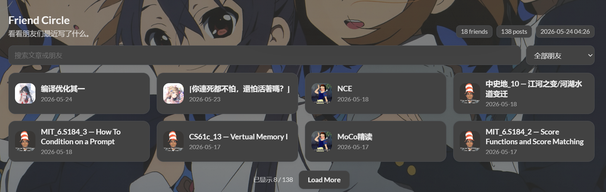
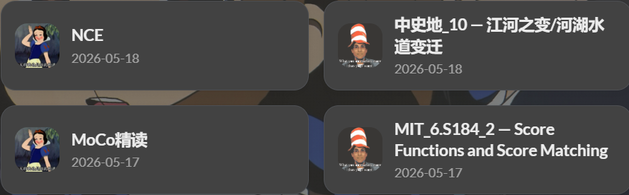

## 数据抓取

### 配置

项目文件放在 [hugo-friend-circle](https://github.com/elainafan/hugo-friend-circle)。接入 Hugo 时复制：

- `scripts/fetch_feeds.py`
- `data/friends.yaml`
- `data/friend_posts.json`
- `layouts/page/friends-circle.html`
- `.github/workflows/update.yml`

朋友列表写在 `data/friends.yaml`。最小配置如下：

```yaml
settings:
  max_posts: 240
  max_posts_per_friend: 24
  max_days: 180
  since: 2024-01-01
  timeout: 8
  retries: 2

friends:
  - name: Example Friend
    site: https://example.com/
    feed: https://example.com/index.xml
    avatar: https://example.com/avatar.png
    description: A friend with RSS.

  - name: HTML Only Friend
    site: https://example.org/
    avatar: https://example.org/avatar.png
    description: No RSS exposed; fallback will try dated links on homepage and archives.
```

省略 `feed` 时，脚本先在站点首页寻找 RSS / Atom 的 `<link rel="alternate">`；未找到时，再解析首页、`/archives/`、`/posts/` 与 `/post/` 中的文章链接。

HTML 兜底适合归档页中带有明确日期和文章标题的站点，无法覆盖所有博客主题。结构特殊的站点仍应显式填写 RSS 或 Atom feed。

### 慢站点与失效站点

网络较慢的站点单独调大 `timeout` 与 `retries`：

```yaml
  - name: Slow Friend
    site: https://slow.example/
    feed: https://slow.example/rss.xml
    avatar: https://slow.example/avatar.png
    timeout: 25
    retries: 3
```

域名过期、站点关闭或没有可解析 feed 时，保留友链卡片并关闭朋友圈抓取：

```yaml
  - name: Offline Friend
    site: https://old-domain.example/
    avatar: https://old-domain.example/avatar.png
    description: Keep the link card, but skip friend-circle crawling.
    circle: false
    circle_reason: domain unavailable
```

设置 `circle: false` 后，该站点不参与抓取，也不会拖慢整轮更新。

### 本地生成

独立项目中配置好 `data/friends.yaml` 后，在 Hugo 站点根目录运行：

```powershell
python scripts\fetch_feeds.py
```

脚本会生成或更新 `data/friend_posts.json`。这个文件里包含朋友名称、头像、文章标题、文章链接、发布时间、来源站点，以及抓取失败时的 warning。

抓取起始日期由 `since` 控制：

```yaml
settings:
  since: 2024-01-01
```

`since: 2024-01-01` 会保留 2024 年以来的文章，再由 `max_posts` 与 `max_posts_per_friend` 控制最终数量。

## 页面接入

### 独立页面

独立页面放在 `content/friends-circle/index.md`：

```yaml
---
title: "Friend Circle"
description: "Recent posts from friends."
layout: "friends-circle"
slug: "friends-circle"
comments: false
---
```

`layouts/page/friends-circle.html` 读取 `site.Data.friend_posts` 并渲染文章列表。

### Stack 友链页

本站把 `Friend Circle` 放在普通友链卡片下方。

<https://www.elainafan.one/friends/>



友链卡片由 `layouts/partials/article/components/links.html` 渲染。partial 末尾调用 Friend Circle：

```html
{{ if or .Params.friendCircle (eq .Params.slug "friends") }}
    {{ partial "article/components/friend-circle" . }}
{{ end }}
```

朋友圈主体位于 `layouts/partials/article/components/friend-circle.html`，从 `data/friend_posts.json` 读取数据：

```html
{{ $data := site.Data.friend_posts | default dict }}
{{ $posts := $data.posts | default slice }}
{{ $friends := $data.friends | default slice }}
{{ $warnings := $data.warnings | default slice }}
```

文章卡片只显示头像、标题与日期，不渲染摘要。



- 搜索文章或朋友。
- 按朋友筛选。
- 默认只展示前几条，点击 `Load More` 后继续展开。

这些交互使用原生 JavaScript。数据在 Hugo 构建时已经写入页面，筛选与展开只切换现有 DOM 的显示状态。

## 定时更新

GitHub Actions 定时运行脚本，并把生成的 `data/friend_posts.json` 提交回仓库。

博客仓库中的 workflow 如下：

```yaml
name: update friend circle

on:
  schedule:
    - cron: "0 */3 * * *"
  workflow_dispatch:
  push:
    paths:
      - "data/friends.yaml"
      - "scripts/fetch_feeds.py"

permissions:
  contents: write

jobs:
  update:
    runs-on: ubuntu-latest
    steps:
      - uses: actions/checkout@v4
      - uses: actions/setup-python@v5
        with:
          python-version: "3.x"
      - name: Fetch feeds
        run: python scripts/fetch_feeds.py
      - name: Commit generated data
        uses: stefanzweifel/git-auto-commit-action@v5
        with:
          commit_message: "chore: update friend circle data"
          file_pattern: data/friend_posts.json
```

本站由 Vercel 部署。GitHub Actions 提交新 JSON 后，Vercel 会根据仓库更新重新部署站点。

## 抓取边界

- 模板仓库只保存示例 `friends.yaml` 与空的 `friend_posts.json`，个人友链数据留在自己的博客仓库。

- 没有 RSS、feed 地址特殊或归档结构不规则的站点可能无法抓取。HTML 解析保持通用规则，不为单个站点写死选择器。

- 失效站点显式设置 `circle: false`，友链卡片与朋友圈抓取互不影响。

- 页面只显示头像、标题和日期。摘要、标签与封面不进入卡片，友链页保持轻量。
