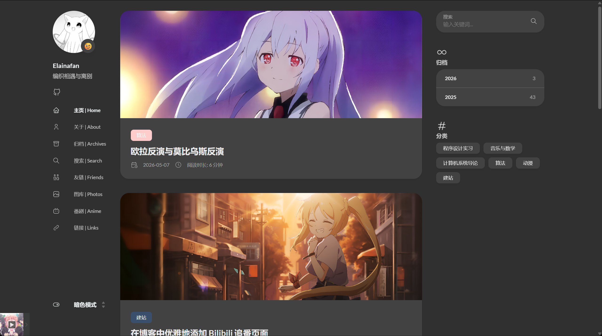
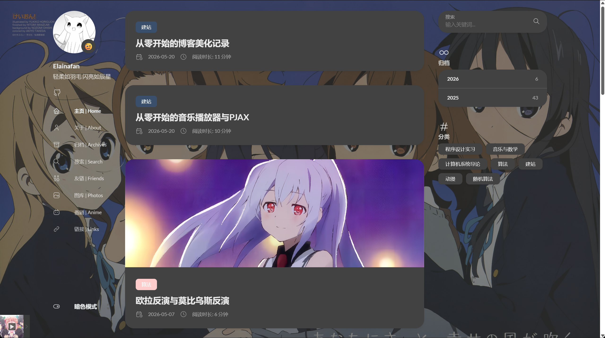
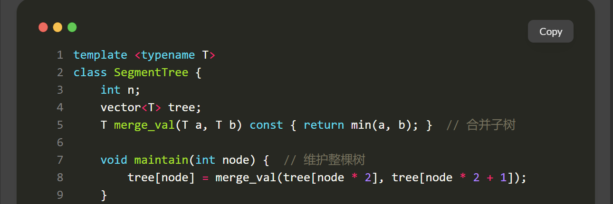
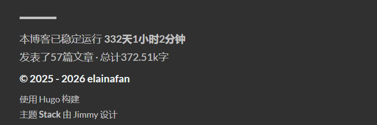
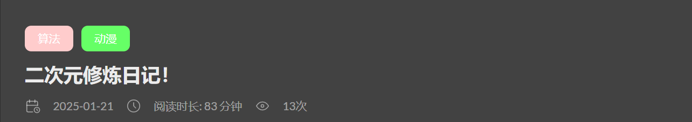

本站使用 Hugo `v0.131.0` 和 Stack `v3.26.0`。所有改动都放在站点根目录，依靠 Hugo 的模板覆盖顺序生效；升级主题时，只需要检查站点自己的 `layouts` 和 `assets`，不用重新翻一遍被改过的主题源码。

## 覆盖主题

Stack 位于 `themes/hugo-theme-stack`。站点根目录下存在同路径文件时，Hugo 会优先使用站点版本。例如：

```text
themes/hugo-theme-stack/layouts/partials/footer/footer.html
layouts/partials/footer/footer.html
```

后者会覆盖前者。模板结构、文章详情、搜索数据和 footer 都沿用这套方式修改。

样式仍从 `assets/scss/custom.scss` 进入，不过现在已经按职责拆开：

```scss
@import "music-player.scss";

@import "custom/base";
@import "custom/layout";
@import "custom/archives-home";
@import "custom/code";
@import "custom/article-extras";
@import "custom/friend-circle";
@import "custom/timeline-contests";
```

`_base.scss` 放全局变量、正文图片和引用块；`_layout.scss` 负责三栏宽度、菜单与封面；`_archives-home.scss` 管首页和归档；`_code.scss` 管代码折叠与阅读进度；文章系列、加密入口等放在 `_article-extras.scss`。功能增多后继续把规则堆在一个 `custom.scss` 里，很快就会找不到样式来自哪里。

## 页面布局

Stack 的圆角、间距和正文大小大量依赖 CSS 变量。本站在 `_base.scss` 中直接重写这些变量：

```scss
:root {
  --main-top-padding: 30px;
  --card-border-radius: 25px;
  --tag-border-radius: 8px;
  --section-separation: 40px;
  --article-font-size: 1.8rem;
  --code-background-color: #f8f8f8;
  --code-text-color: #e96900;

  &[data-scheme="dark"] {
    --code-background-color: #ff6d1b17;
    --code-text-color: #e96900;
  }
}
```

归档和友链使用 `.article-list--compact`。桌面端改为两列，外层不再保留整块背景，每个条目自己承担卡片背景和阴影：

```scss
@media (min-width: 1024px) {
  .article-list--compact {
    display: grid;
    grid-template-columns: 1fr 1fr;
    gap: 1rem;
    background: none;
    box-shadow: none;

    article {
      margin: 0 8px 8px 0;
      border-radius: 16px;
      background: var(--card-background);
      box-shadow: var(--shadow-l2);
    }
  }
}
```


正文宽度由 `.container.extended` 控制。宽屏下放宽容器，再给左右栏分配固定比例，代码块、公式和表格不会被挤成一条窄列：

```scss
.container.extended {
  @include respond(lg) {
    max-width: 1280px;
    --left-sidebar-max-width: 20%;
    --right-sidebar-max-width: 30%;
  }

  @include respond(xl) {
    max-width: 1453px;
    --left-sidebar-max-width: 15%;
    --right-sidebar-max-width: 25%;
  }
}
```

分类页头图和子分类卡片另放在 `_archives-home.scss`。手机端的分类头图采用上下结构和 `16:9` 比例；桌面端恢复左右结构。子分类从一列逐步变成两列、三列，图片统一用 `object-fit: cover`，标题叠在图片上时增加暗色遮罩和文字阴影，浅色封面也能看清。

首页卡片、归档 tile 和右栏组件都加了轻微 hover 反馈。缩放幅度保持在 `1.05` 左右，动画时间放慢到 `0.6s`，避免鼠标扫过页面时每张卡片都突然跳动。



背景图由 `layouts/partials/footer/custom.html` 从 `assets/background` 读取。亮色和暗色模式分别覆盖一层半透明底色，正文卡片仍保持足够的对比度：

```go-html-template
{{ $backgroundImages := resources.Match "background/*.{jpg,jpeg,png,webp,avif}" }}
{{ with index $backgroundImages 0 }}
<style>
  body {
    background:
      linear-gradient(rgba(245, 245, 250, .72), rgba(245, 245, 250, .72)),
      url({{ .Permalink }}) no-repeat center top;
    background-size: cover;
    background-attachment: fixed;
  }
</style>
{{ end }}
```



左侧菜单只保留频繁访问的页面。时间线与随机漫游的脚本能力仍在，但不再占据固定菜单项；需要入口时，在模板上放回对应的 `data-*` 标记即可。隐藏页面和加密文章也不会进入随机文章池。

## 正文体验

正文图片由 `layouts/_default/_markup/render-image.html` 处理。Page Bundle 中的本地图片能直接取得宽高，并带上 `gallery-image`；`static` 下的绝对路径也会补齐图库所需属性。PhotoSwipe 的根节点放在全站 footer，而不是每个 single layout 中重复生成，因此 PJAX 切入文章后仍能点击预览。

```go-html-template
{{ partialCached "footer/components/script.html" . }}
{{ partialCached "footer/components/custom-font.html" . }}
{{ partialCached "article/components/photoswipe" . }}
{{ partial "footer/custom.html" . }}
```

关闭图片预览时，地址中的 `gid`、`pid` 等状态不会把页面送回顶部。静态图片和 Page Bundle 图片使用同一套回退逻辑，课程笔记里从 `static/images` 引用的图也能正常放大。


代码块的基础外观在 `_base.scss`，长代码折叠和顶部三色圆点在 `_code.scss`。`assets/ts/main.ts` 会统计 Chroma 行号；没有行号时再按换行符计算。超过 80 行的代码块默认折叠：

```ts
const lineCount = highlight.querySelectorAll('.lnt').length
    || (codeBlock.textContent || '').split('\n').length;

if (lineCount > 80) {
    highlight.classList.add('is-collapsible', 'is-collapsed');
}
```

展开按钮放在代码块底部，折叠状态用渐变遮住末尾。短代码不受影响，Lab 文章中的完整实现也不会一打开就占满几屏。

同一个脚本还会在文章页创建 `.reading-progress`。进度以 `.article-content` 的实际位置和高度计算；PJAX 离开文章页时，进度条和滚动监听会一起移除。



长期笔记采用 `main.md + hidden 子页`。主页承担公开入口，子页用 `seriesOrder` 排序。`layouts/partials/article/components/series-navigation.html` 只查找当前目录中的隐藏页面，并在正文后生成上一篇、系列主页和下一篇：

```yaml
hidden: true
seriesOrder: 3
```

分类、首页、归档、搜索和 RSS 都排除了 `hidden: true`，所以子页可以正常访问，却不会把公开列表刷满。这篇《从零开始的博客》本身也使用同一套结构。

文章维护记录仍写在 frontmatter 的 `updates` 中，但正文末尾不再显示完整明细。首页卡片只读取第一条记录的日期：

```go-html-template
{{ with .Params.updates }}
  {{ with index . 0 }}
    <time datetime="{{ time.Format "2006-01-02" (time .date) }}">
      更新 {{ time.Format "2006-01-02" (time .date) }}
    </time>
  {{ end }}
{{ end }}
```

完整动态保留在隐藏的 `/timeline/` 中，不再单独维护 Updates 页面。

## 统计与加密

页脚文章数只统计 `post` 分区中的公开页面。番剧、关于等独立功能页不属于 `post`，系列子页又带有 `hidden: true`，两者都不会算作发表文章：

```go-html-template
{{ $publishedArticles := where .Site.RegularPages "Section" "post" }}
{{ $publishedArticles = where $publishedArticles "Params.hidden" "!=" true }}
```

运行时间由 footer 脚本按建站日期实时计算。总字数和文章数分开处理：文章数采用上面的公开口径，总字数仍统计站内内容，避免已有统计突然大幅缩水。



加密文章在 `layouts/partials/article/components/content.html` 中分流。带有 `encrypt: true` 的页面先显示密码卡片，校验通过后再展开正文。密码不再明文比较，而是通过 Web Crypto 的 PBKDF2 派生摘要；搜索、RSS、时间线和随机文章池也会过滤加密内容。

```js
const buffer = await crypto.subtle.deriveBits({
    name: 'PBKDF2',
    salt: encoder.encode('站点自定义 salt'),
    iterations: 180000,
    hash: 'SHA-256'
}, key, 256);
```

这仍是静态站点里的阅读门禁。若构建后的 HTML 直接包含正文，它不能替代真正的服务端权限控制；至少可以避免密码明文、搜索摘要和 RSS 意外泄露。



表格由正文模板自动包进 `.table-wrapper`，窄屏可以横向滚动。外链通过 `layouts/_default/_markup/render-link.html` 自动加上 `target="_blank"` 与 `rel="noopener"`。搜索索引则在 `layouts/page/search.json` 中过滤隐藏页，系列目录不会在搜索结果中散成几十条。

## 图库

图库页面使用 `layouts/photo/single.html`。原图放在 `assets/waifus`，构建时由 Hugo 生成缩略图；页面先加载缩略图，PhotoSwipe 打开时再使用原图地址：

```go-html-template
{{- $imgs := resources.Match "waifus/*.{jpg,jpeg,png,webp}" -}}
{{- range $img := $imgs -}}
  {{- $thumb := $img.Fit "640x900 q82" -}}
  <figure class="gallery-image photo-tile">
    <a href="{{ $img.RelPermalink }}">
      
    </a>
  </figure>
{{- end -}}
```

桌面端使用三列瀑布流，中等屏幕两列，手机一列。滚动接近底部时只克隆一小批已有节点，不重新请求图片，也不让 PhotoSwipe 重建整条数据。图片导入由 `scripts/import_photos.py` 完成，页面运行时不依赖外部图片 API。


