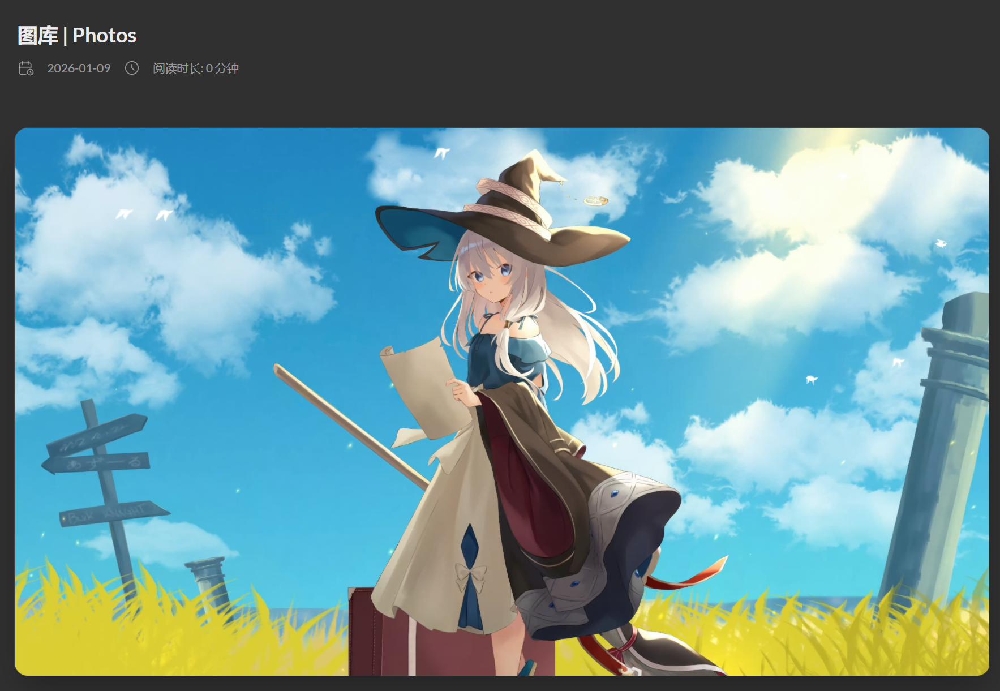

## 前言
之前写过一篇在博客中添加 Bilibili 追番页面的文章，那篇文章主要讲的是一个独立功能：如何通过 `layouts/page/bilibili.html` 和 `layouts/shortcodes/bangumi.html` 做出一面追番墙。

这一篇则整理博客里更零散、更基础的美化工作。笔者现在用的是 Hugo `v0.131.0` 和 Stack 主题 `v3.26.0`，为了弄清楚每个地方到底改了什么，这次把原版 Hugo 和 Stack 主题源码也放到了本地，再对比 `Blog/elainafan` 里的覆盖文件来看。

Hugo 的主题覆盖机制其实很适合个人博客装修：主题文件放在 `themes/hugo-theme-stack`，而站点根目录下的 `layouts`、`assets`、`static` 会优先于主题生效。也就是说，如果在博客根目录里放一个 `layouts/partials/footer/footer.html`，它就会覆盖 Stack 主题里同名的 footer partial。

因此，本文的核心思路就是：不直接修改主题源码，而是在博客目录里按需覆盖。这样以后升级主题时，只需要重点检查这些覆盖文件，维护范围会更清楚一些。

## 全局卡片圆角
先看 `assets/scss/custom.scss` 里的全局变量。Stack 主题大量使用 CSS 变量控制卡片圆角、间距、字号和颜色，因此很多效果不需要到处改类名，只要重写变量即可。这段加在 `assets/scss/custom.scss` 中：

```scss
:root {
  --main-top-padding: 30px;
  --card-border-radius: 25px;
  --tag-border-radius: 8px;
  --section-separation: 40px;
  --article-font-size: 1.8rem;
  --code-background-color: #f8f8f8;
  --code-text-color: #e96900;

  &[data-scheme="dark"] {
    --code-background-color: #ff6d1b17;
    --code-text-color: #e96900;
  }
}
```

这里最明显的是 `--card-border-radius` 和 `--section-separation`。前者决定卡片圆角，后者决定页面块之间的距离。Stack 主题本身是卡片式布局，所以这两个变量一改，全站气质就会跟着变。

同一组变量里还调整了行内代码的背景色和前景色。写 CS、算法和建站笔记时，行内代码会非常多，如果默认样式太淡，阅读起来会有点糊；如果太亮，又会抢正文。所以这里给亮色和暗色分别配置了更稳定的行内代码颜色。

## 友链归档双栏
首页、友链和归档页的卡片是 Stack 主题最显眼的部分。笔者的主要改动仍然集中在 `assets/scss/custom.scss`。

在桌面端把紧凑文章列表改成两列，这段加在 `assets/scss/custom.scss` 中：

```scss
@media (min-width: 1024px) {
  .article-list--compact {
    display: grid;
    grid-template-columns: 1fr 1fr;
    background: none;
    box-shadow: none;
    gap: 1rem;

    article {
      background: var(--card-background);
      border: none;
      box-shadow: var(--shadow-l2);
      margin-bottom: 8px;
      margin-right: 8px;
      border-radius: 16px;
    }
  }
}
```

原来的紧凑列表是一列到底，比较稳，但是内容多了以后会显得很长。改成两列后，归档页的信息密度会高一些。友链和链接页面使用的也是这一类 compact 列表结构，因此这个样式同样会让友链卡片变成多列显示。需要注意的是，`.article-list--compact` 原本自己带背景和阴影，如果直接改成 grid，会出现一个大背景包着小卡片的感觉，所以这里把外层背景去掉，再给每个 `article` 单独加回卡片样式。

## 封面图高度
然后是封面图高度。相关代码同样加在 `assets/scss/custom.scss` 中：

```scss
.article-list article .article-image img {
  width: 100%;
  height: 150px;
  object-fit: cover;

  @include respond(md) {
    height: 200px;
  }

  @include respond(xl) {
    height: 305px;
  }
}
```

这里用 `object-fit: cover` 保证封面图不会被压扁。高度则根据屏幕尺寸逐步增加，使宽屏下的文章卡片更舒展。

## 卡片悬浮动画
接下来是卡片悬浮动画，这段加在 `assets/scss/custom.scss` 中：

```scss
.article-list article {
  transition: transform 0.6s ease;
}

.article-list article:hover {
  transform: scale(1.05);
}
```

归档页的 tile 卡片和 compact 卡片也分别加了缩放和右移动画。这个改动本质上只是给卡片一点反馈，不涉及 Hugo 模板。动画幅度不宜过大，不然鼠标扫过页面时会显得很晃。


## 首页三栏布局
三栏布局的宽度调整也在 `custom.scss` 中。Stack 的主体容器是 `.container.main-container`，它里面有左侧栏、右侧栏和正文区域。

相关代码加在 `assets/scss/custom.scss` 中：

```scss
.container {
  &.extended {
    @include respond(md) {
      max-width: 1024px;
      --left-sidebar-max-width: 25%;
      --right-sidebar-max-width: 22% !important;
    }

    @include respond(lg) {
      max-width: 1280px;
      --left-sidebar-max-width: 20%;
      --right-sidebar-max-width: 30%;
    }

    @include respond(xl) {
      max-width: 1453px;
      --left-sidebar-max-width: 15%;
      --right-sidebar-max-width: 25%;
    }
  }
}
```

这部分主要解决的是宽屏下正文和侧边栏的比例。默认 Stack 的布局已经够用，但如果文章里有比较多代码块、公式或表格，正文区域太窄就会很痛苦。因此这里稍微放宽了整体容器，并重新分配左右侧栏宽度。

## 菜单卡片化
菜单栏也做了圆角和阴影处理，这段加在 `assets/scss/custom.scss` 中：

```scss
.menu {
  background-color: var(--card-background);
  box-shadow: var(--shadow-l2);
  border-radius: 10px;
  padding: 30px 30px;
}
```

移动端展开菜单时，这个样式会让菜单更像一个独立卡片，而不是一块硬邦邦的列表。到了桌面端，主题会恢复透明背景和正常布局。


## 自定义背景图
背景图参考的是 [Hugo Stack 主题装修笔记](https://letere-gzj.github.io/hugo-stack/p/hugo/custom-background/) 里的做法：把图片作为 Hugo 的资源读取出来，再给 `body` 设置背景。笔者这里稍微改了一下，没有在模板里写死具体文件名，而是读取 `assets/background/` 下的第一张图片。这样之后想换背景时，只需要替换这个目录里的图片，不需要再改模板。

这段加在 `layouts/partials/footer/custom.html` 中：

```go-html-template
{{ $backgroundImages := resources.Match "background/*.{jpg,jpeg,png,webp,avif}" }}
{{ with $backgroundImages }}
{{ with index . 0 }}
<style>
    body {
        background:
            linear-gradient(rgba(245, 245, 250, 0.72), rgba(245, 245, 250, 0.72)),
            url({{ .Permalink }}) no-repeat center top;
        background-size: cover;
        background-attachment: fixed;
    }

    [data-scheme="dark"] body {
        background:
            linear-gradient(rgba(48, 48, 48, 0.62), rgba(48, 48, 48, 0.62)),
            url({{ .Permalink }}) no-repeat center top;
        background-size: cover;
        background-attachment: fixed;
    }
</style>
{{ end }}
{{ end }}
```

这里的 `background-size: cover` 用来让背景铺满屏幕，`background-attachment: fixed` 则让背景在页面滚动时保持固定。前面的 `linear-gradient` 是一层遮罩：亮色模式下用偏白的遮罩压低背景存在感，暗色模式下用偏黑的遮罩降低亮部干扰。因为博客主体区域本身还有卡片背景，所以背景图主要出现在页面两侧和卡片之间的空隙里，不会直接压到正文阅读。


## 头像旋转
头像旋转是一个很简单的小动画，这段加在 `assets/scss/custom.scss` 中：

```scss
.sidebar header .site-avatar .site-logo {
  transition: transform 1.65s ease-in-out;
}

.sidebar header .site-avatar .site-logo:hover {
  transform: rotate(360deg);
}
```

它没有什么技术难度，但非常适合个人博客。鼠标挪上去时头像转一圈，属于那种“平时没用，但是看到了会有点开心”的小装饰。

## 正文图片圆角
文章图片则统一加了圆角，这段加在 `assets/scss/custom.scss` 中：

```scss
.article-page .main-article .article-content {
  img {
    max-width: 96% !important;
    height: auto !important;
    border-radius: 8px;
  }
}
```

这里的 `max-width: 96%` 是为了让图片不要完全贴满正文宽度，尤其是带阴影或圆角时，留一点余地会舒服很多。

## 引用块和长链接换行
引用块也改了样式，这段加在 `assets/scss/custom.scss` 中：

```scss
.article-content {
  blockquote {
    border-left: 6px solid #358b9a1f !important;
    background: #3a97431f;
  }
}
```

原主题的引用块比较克制，这里稍微加了一点背景色，让引用和正文更容易区分。因为博客里有不少“注意”“声明”“提示”一类内容，这个改动还是比较常用的。

同一类正文阅读体验里还处理了长链接和行内代码换行。它们容易撑破移动端，所以在 `assets/scss/custom.scss` 中加了：

```scss
a {
  word-break: break-all;
}

code {
  word-break: break-all;
}
```

这个属于不显眼但很救命的改动。写建站教程和 Lab 笔记时，经常会出现很长的 URL、路径或命令，如果不处理，手机端会直接横向溢出。


## 代码块容器样式
代码块的基础样式仍然在 `assets/scss/custom.scss` 中完成。先改 `.highlight`，这段加在 `assets/scss/custom.scss` 中：

```scss
.highlight {
  max-width: 102% !important;
  background-color: var(--pre-background-color);
  padding: var(--card-padding);
  position: relative;
  border-radius: 20px;
  margin-left: -7px !important;
  margin-right: -12px;
  box-shadow: var(--shadow-l1) !important;
}
```

这里调整了宽度、圆角、阴影和左右边距。因为代码块经常比普通段落更需要横向空间，所以稍微让它往两边伸一点。

然后是亮色模式下的配色，这段同样加在 `assets/scss/custom.scss` 中：

```scss
[data-scheme="light"] .article-content .highlight {
  background-color: #fff9f3;
}

[data-scheme="light"] .chroma {
  color: #ff6f00;
  background-color: #fff9f3cc;
}
```

这会让亮色模式下的代码块偏暖一点，不至于和正文卡片完全糊在一起。

## macOS 风格代码块
拟 macOS 顶栏也是在 `assets/scss/custom.scss` 里加的：

```scss
.article-content {
  .highlight:before {
    content: '';
    display: block;
    background: url(/code-header.svg);
    height: 32px;
    width: 100%;
    background-size: 57px;
    background-repeat: no-repeat;
    margin-bottom: 5px;
    background-position: -1px 2px;
  }
}
```

这里用到的图标文件是 `static/code-header.svg`。Hugo 会把 `static` 下的文件原样复制到站点根目录，所以 CSS 里可以直接写 `url(/code-header.svg)`。

## 代码块复制按钮
复制按钮则不是 SCSS 完成的，而是在 `assets/ts/main.ts` 中给每个代码块动态追加按钮。这段加在 `assets/ts/main.ts` 中：

```ts
const highlights = document.querySelectorAll('.article-content div.highlight');
const copyText = `Copy`,
    copiedText = `Copied!`;

highlights.forEach(highlight => {
    const copyButton = document.createElement('button');
    copyButton.innerHTML = copyText;
    copyButton.classList.add('copyCodeButton');
    highlight.appendChild(copyButton);

    const codeBlock = highlight.querySelector('code[data-lang]');
    if (!codeBlock) return;

    copyButton.addEventListener('click', () => {
        navigator.clipboard.writeText(codeBlock.textContent)
            .then(() => {
                copyButton.textContent = copiedText;
                setTimeout(() => {
                    copyButton.textContent = copyText;
                }, 1000);
            });
    });
});
```

它的思路很直接：页面加载后找到代码块，插入按钮，点击后把代码内容写入剪贴板。按钮的显示隐藏则由 `.highlight:hover .copyCodeButton` 控制。


## 记录博客运行时间
页脚覆盖文件是 `layouts/partials/footer/footer.html`。这里主要加了两类信息：博客运行时间，以及文章数量和总字数。

运行时间的 HTML 结构加在 `layouts/partials/footer/footer.html` 中：

```html
<section class="running-time">
本博客已稳定运行
<span id="runningdays" class="running-days"></span>
</section>
```

真正计算时间的脚本不在 footer 模板里，而是在 `layouts/partials/footer/custom.html` 中。脚本设置起始日期为 `2025-6-23`，然后用当前时间减去起始时间，算出天、小时和分钟。这段加在 `layouts/partials/footer/custom.html` 中：

```js
function updateRunningDays() {
    let s1 = '2025-6-23';
    s1 = new Date(s1.replace(/-/g, "/"));
    let s2 = new Date();
    let timeDifference = s2.getTime() - s1.getTime();

    let days = Math.floor(timeDifference / (1000 * 60 * 60 * 24));
    let hours = Math.floor((timeDifference % (1000 * 60 * 60 * 24)) / (1000 * 60 * 60));
    let minutes = Math.floor((timeDifference % (1000 * 60 * 60)) / (1000 * 60));

    let result = days + "天" + hours + "小时" + minutes + "分钟";
    const elem = document.getElementById('runningdays');
    if (elem) elem.innerHTML = result;
}
```

## 记录文章数量和总字数
总字数统计则完全由 Hugo 模板完成，这段加在 `layouts/partials/footer/footer.html` 中：

```go-html-template
{{$scratch := newScratch}}
{{ range (where .Site.Pages "Kind" "page" )}}
    {{$scratch.Add "total" .WordCount}}
{{ end }}
发表了{{ len (where .Site.RegularPages "Section" "post") }}篇文章 · 
总计{{ div ($scratch.Get "total") 1000.0 | lang.FormatNumber 2 }}k字
```

这里用 `newScratch` 临时累加所有页面的 `.WordCount`，再统计 `post` 分区下的文章数量。Hugo 模板语法看起来比较奇怪，但做这种静态统计非常方便。

对应样式在 `assets/scss/partials/footer.scss` 中，额外给 `.totalcount` 和 `.running-time` 做了颜色、字号和间距调整。


## 记录文章访问量
访问量显示改在 `layouts/partials/article/components/details.html`。文章日期和阅读时间后面，额外插入这段：

```html
<div id="viewCount">
    {{ partial "helper/icon" "eye" }}
    <time class="article-time--reading">
        <span id="vercount_value_page_pv">loading... </span>次
    </time>
</div>
```

这里用到了 `assets/icons/eye.svg`，统计脚本则在 `layouts/partials/footer/custom.html` 中引入：

```html
<script defer src="https://cn.vercount.one/js"></script>
```

因为首页和列表页也会复用文章卡片结构，所以脚本里还写了一个 `showHideView`，当当前页面不是文章页时，就把浏览量隐藏。

## 文章加密功能
文章加密改在 `layouts/partials/article/components/content.html`。如果 frontmatter 中设置 `encrypt: true`，就先显示密码输入框，并把正文放在隐藏的 `#post-content` 中。这段加在 `layouts/partials/article/components/content.html` 中：

```html
{{ if .Params.encrypt }}
<div id="encrypt-box" class="encrypt-box">
    🔒 本文已加密，请输入密码<br>
    <input type="password" id="pwd" placeholder="请输入密码">
    <button onclick="decrypt()">解密</button>
</div>

<div id="post-content" style="display:none;">
    {{ .Content | safeHTML }}
</div>
{{ else }}
{{ .Content | safeHTML }}
{{ end }}
```

对应的 `decrypt` 函数在 `layouts/partials/footer/custom.html`。它会读取输入框里的密码，匹配成功后隐藏输入框并显示正文；另外还监听了回车键，这样输入密码后不需要再手动点按钮。这段加在 `layouts/partials/footer/custom.html` 中：

```js
function decrypt() {
    const pwd = document.getElementById("pwd").value;
    const box = document.getElementById("encrypt-box");
    const content = document.getElementById("post-content");

    if (pwd === "密码") {
        box.style.display = "none";
        content.style.display = "block";
    } else {
        alert("密码错误");
    }
}

document.addEventListener("keydown", e => {
    if (e.key === "Enter" && document.getElementById("pwd")) decrypt();
});
```

## 表格横向滚动
表格滚动也是在 `layouts/partials/article/components/content.html` 中处理的，这段加在同一个文件里：

```go-html-template
{{ .Content | replaceRE "(<table>(?:.|\n)+?</table>)" (printf "<div class=\"table-wrapper\">${1}</div>") | safeHTML }}
```

这段会把文章里的 `<table>` 自动包进 `.table-wrapper`，方便在窄屏幕上横向滚动。对于 Codeforces 日志、课程表格、评分记录这类内容来说，这个改动非常实用。


## 搜索隐藏页过滤
搜索页面的模板是 `layouts/page/search.html`，搜索数据由 `layouts/page/search.json` 生成。

`layouts/page/search.json` 里有一个很关键的过滤，这段加在 `layouts/page/search.json` 中：

```go-html-template
{{- $pages := where .Site.RegularPages "Type" "in" .Site.Params.mainSections -}}
{{- $notHidden := where .Site.RegularPages "Params.hidden" "!=" true -}}
{{- $filtered := ($pages | intersect $notHidden) -}}
```

也就是说，只有 `post` 主分区里的文章会进入搜索，而且 `hidden: true` 的页面会被过滤掉。这样像 `1400.md`、`1600.md` 这类长期记录的隐藏子页面，就不会在搜索结果里单独刷屏。

前端搜索逻辑在 `assets/ts/search.tsx`。它会读取搜索 JSON，把标题和正文转成纯文本，然后根据关键词生成带 `<mark>` 的预览片段。这个功能原本就是 Stack 主题的一部分，笔者这里主要是为了配合 PJAX，把初始化函数改成可被 `Stack.init()` 调用的形式。详细部分会放到播放器与 PJAX 那篇里讲。

## 外链新窗口打开
外链新窗口打开则在 `layouts/_default/_markup/render-link.html` 中完成，这段加在这个文件里：

```go-html-template
<a class="link" href="{{ .Destination | safeURL }}" {{ with .Title}} title="{{ . }}"
    {{ end }}{{ if strings.HasPrefix .Destination "http" }} target="_blank" rel="noopener"
    {{ end }}>{{ .Text | safeHTML }}</a>
```

核心是判断 `.Destination` 是否以 `http` 开头。如果是外链，就加上 `target="_blank"` 和 `rel="noopener"`。这样读文章时点外部资料，不会直接离开当前博客页面。

## 自定义图标
自定义图标放在 `assets/icons` 下，例如 `assets/icons/bilibili.svg`、`assets/icons/photo.svg`、`assets/icons/eye.svg`、`assets/icons/left.svg`、`assets/icons/right.svg`。Stack 主题本身通过 `partial "helper/icon"` 读取图标，因此只要放进这个目录，就能在菜单或模板里使用。

例如图库页 `content/page/photo/index.md` 中写了这段 frontmatter，这段写在 `content/page/photo/index.md` 中：

```yaml
menu:
    main:
        weight: -50
        params:
            icon: photo
```

Hugo 渲染菜单时就会去找 `assets/icons/photo.svg`。

## 图库入口和轮播
图库页使用的是 `layouts/photo/single.html`。图片资源放在 `assets/waifus`，模板里通过这段收集图片，这段加在 `layouts/photo/single.html` 中：

```go-html-template
{{- $imgs := resources.Match "waifus/*.{jpg,jpeg,png,webp}" -}}
```

把图片全部收集起来，再写入轮播容器的 `data-images` 属性。前端脚本会预加载图片、随机打乱顺序，并支持左右切换、点击中间全屏、方向键切换和 `Escape` 退出。

这部分其实已经有点接近单独功能页了。它和追番页一样，都是通过“自定义 layout + 页面 frontmatter”实现的，只不过追番页的数据来自 Bilibili API，图库页的数据来自本地 `assets/waifus`。



## 小结
这样整理下来，博客美化大致可以分成三层。

第一层是 `assets/scss/custom.scss` 里的纯样式补丁，比如卡片圆角、页面宽度、头像旋转、图片圆角、引用块颜色、代码块样式和 hover 动画。

第二层是 `layouts` 下的模板覆盖，比如自定义背景、页脚统计、访问量、文章加密、表格滚动、搜索过滤、外链新窗口和图库页面。

第三层是少量前端脚本增强，比如代码复制按钮、图库轮播等。

至于 APlayer、PJAX、顶部进度条、Giscus 重载、KaTeX 重渲染这些功能，表面上也是“美化”，但它们实际上都围绕“页面切换时不要刷新播放器”这个目标展开，牵一发而动全身。因此笔者会把它们单独整理成下一篇文章，不然混在这里就又会变成标题满天飞的小缝合怪了。
