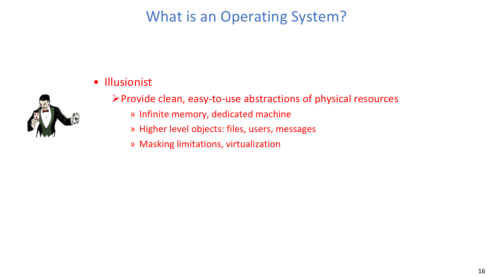
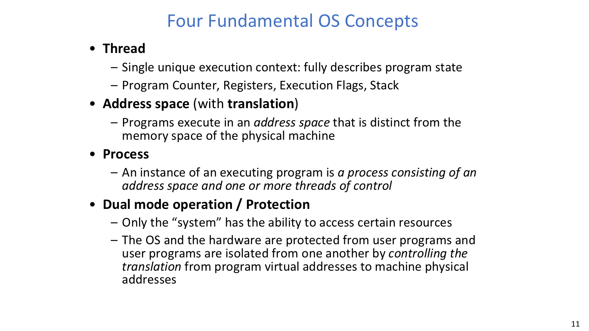
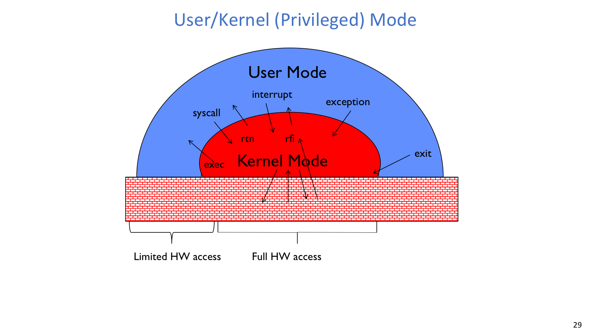
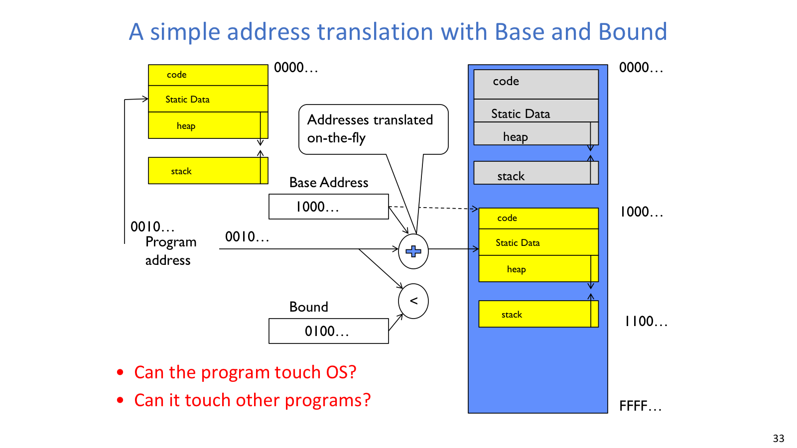

## 操作系统的角色

操作系统位于应用与硬件之间，负责保护共享资源、提供硬件抽象和公共服务。

如果每个应用都直接控制 CPU、内存、磁盘、网卡和显示设备，系统很快会变成不可组合的混乱现场：一个程序可以读写别人的内存，可以独占 CPU，也可以把设备状态改坏。操作系统的基本任务，就是让应用感觉硬件“好用”，同时又不能让应用随便破坏硬件和其他程序。

OS 的职责通常分为三类：

- Referee：分配 CPU、内存、I/O 等资源，处理隔离、保护和共享。
- Illusionist：把复杂硬件包装成更好用的抽象，例如进程、虚拟内存、文件、socket。
- Glue：提供公共服务和统一接口，让应用不必为每块硬件重新写一套逻辑。

Computer system 是更大的整体，包含硬件、OS、应用和用户；system software 的范围也比 OS 更大，包括编译器、链接器、shell、运行库等。Kernel 则是 OS 中运行在特权态、直接管理硬件和保护边界的核心部分。完整 OS 往往还包含用户态系统服务、守护进程、库、工具和 UI。

进程、文件、网络和同步机制又是分布式系统、数据库与存储系统的基础。后者处理命名、隔离、调度、容错和资源管理时，也会遇到与 OS 相似的问题。

## 四个基本概念

Thread、address space、process、dual mode 分别描述执行位置、可见地址、资源集合和权限边界。

| 概念 | 关注的问题 | 关键状态 |
| --- | --- | --- |
| Thread | 现在执行到哪里、如何继续 | PC、registers、execution flags、stack |
| Address space | 程序能访问哪些地址 | code、static data、heap、stack、translation state |
| Process | 一个运行实例拥有哪些资源 | address space、threads、files、sockets、OS state |
| Dual mode | 谁有权做危险操作 | mode bit、privileged registers、trap/interrupt handlers |

Thread 是执行抽象。只有当线程上下文被装入处理器寄存器时，它才真正“在 CPU 上跑”。Address space 是保护与命名抽象：程序使用的地址不等于物理地址，读写地址时可能正常访问，也可能触发 I/O、exception 或 fault。Process 则把一个地址空间、一个或多个线程，以及打开文件、网络连接、文件系统上下文等资源捆在一起。

程序启动时，OS 把可执行文件的代码和数据装入内存，创建堆和栈，初始化线程上下文，再把控制权转移到入口地址。之后，硬件循环执行取指、译码、执行、写回并更新 PC。上下文切换需要保存旧线程的 PC、寄存器和栈相关状态，再恢复新线程的状态。

多线程进程里，多个线程共享同一个地址空间、堆、全局变量和打开文件；每个线程有自己的 PC、寄存器和栈。这样通信便宜、创建销毁开销低，但共享可写状态也会带来同步问题。多进程隔离更强，但通信通常需要 IPC，切换和创建成本也更高。

## 并发与虚拟化

真实硬件常常只有有限的 CPU、DRAM 和 I/O 设备，但系统要同时运行多个程序。早期多道程序设计关注提高硬件利用率，现代系统还要同时照顾吞吐、延迟、公平和隔离。

OS 用时间复用制造多个 virtual CPU 的错觉：单核上一次只能执行一个线程，但调度器可以在多个线程之间切换，让它们都向前推进。每个虚拟 CPU 需要保存自己的 PC、栈指针和寄存器；这些状态没有驻留在 CPU 上时，就必须放在线程或进程的控制结构里。

虚拟化不仅用于 CPU，也用于内存和设备。进程看到的是自己的虚拟地址空间，文件接口把设备和磁盘抽象成字节序列，socket 把网络通信抽象成读写端点。这些抽象背后都需要 OS 做仲裁和保护。

虚拟化带来可组合性，但共享硬件意味着冲突不可避免。调度策略决定谁先运行，地址翻译决定谁能访问哪些内存，系统调用决定用户程序能以什么方式请求内核服务。

## 受控入口

硬件通过 user mode、kernel mode 和受控切换路径建立保护边界。普通程序若能直接执行危险 I/O、修改特权寄存器或访问其他进程的内存，单个 bug 就足以破坏整个系统。

硬件至少提供两种模式：user mode 和 kernel mode。用户态执行普通程序，只能访问受限硬件资源；内核态拥有完整硬件访问权。特权指令、I/O 指令、特殊寄存器修改等操作只能在内核态执行，否则会 fail 或 trap。

用户态进入内核态通常有三类路径：

| 入口 | 发起者 | 同步性 | 典型原因 |
| --- | --- | --- | --- |
| `syscall` / system call | 当前用户程序主动发起 | 同步 | 请求 OS 服务，如文件 I/O、创建线程 |
| interrupt | 外部设备或 timer | 异步 | I/O 完成、时钟中断、抢占调度 |
| trap / exception / fault | 当前指令触发 | 同步 | page fault、除零、非法指令 |

三者都会把控制流带到内核 handler。是否发生调度意义上的 context switch 由内核决定；“进入内核”不等于“一定切换到另一个线程”。

系统调用像一次受控函数调用，但用户程序不知道内核函数的真实地址，也不能直接跳过去。它把参数按 ABI 放进寄存器，执行特殊指令，硬件保存必要状态并切到内核态。interrupt vector table 则把事件编号映射到对应 handler 的地址和属性，内核根据编号分发处理。

返回用户态也必须走受控路径，例如 `return-from-interrupt` 一类指令会恢复 PC 和处理器状态，并重新设置 mode bit。

## Base & Bound

Base & Bound 用最简单的硬件状态说明地址翻译如何同时提供重定位与保护。

Base & Bound 给每个进程一段连续物理内存。程序发出逻辑地址 `a` 时，硬件先检查 `0 <= a < bound`；若合法，物理地址是 `base + a`；若不合法，触发 trap。`base` 和 `bound` 寄存器只能由内核通过特权指令设置。

这个机制的优点是简单、快、保护直观，上下文切换时只要切换 base/bound 寄存器即可。缺点也同样明显：进程必须占用连续物理内存，外部碎片严重，进程增长不灵活，也不方便支持共享内存、稀疏地址空间和按页换入换出。

实现上可以在装载时重定位，也可以在每次访存时动态重定位。前者运行时路径短，但移动进程困难、保护能力弱；后者需要硬件参与，每次访存多做检查和转换，却更适合后续的虚拟内存设计。
