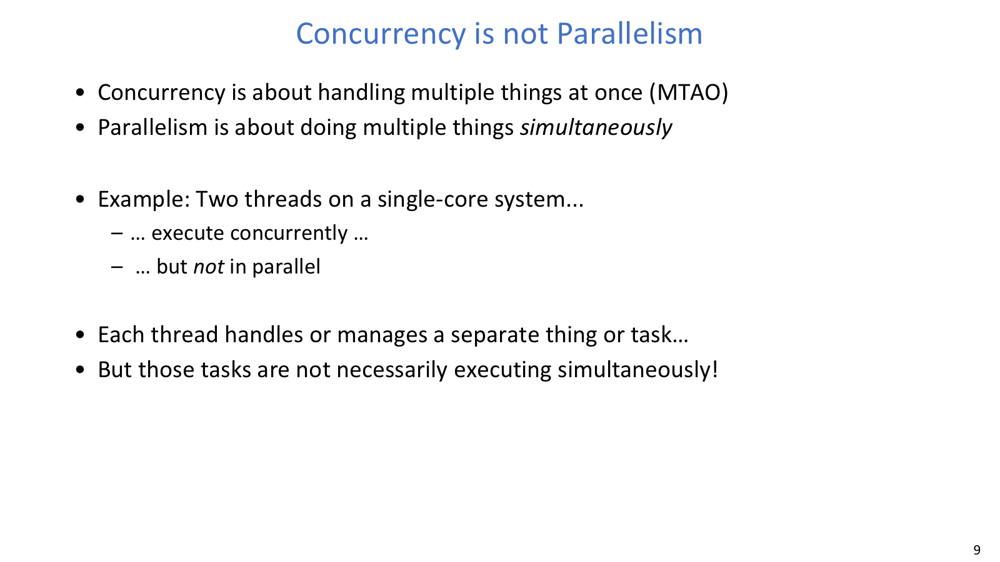
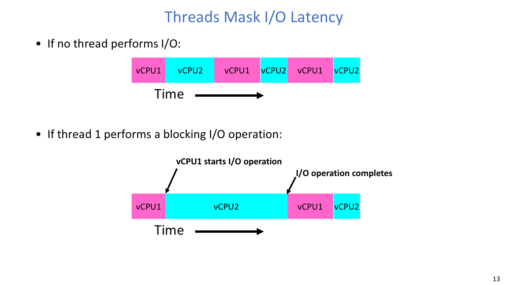
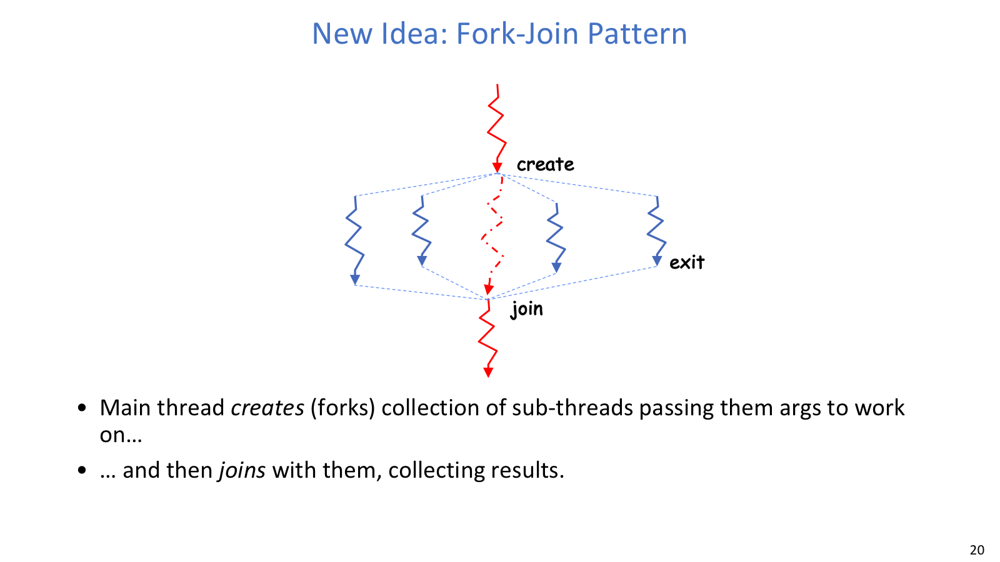
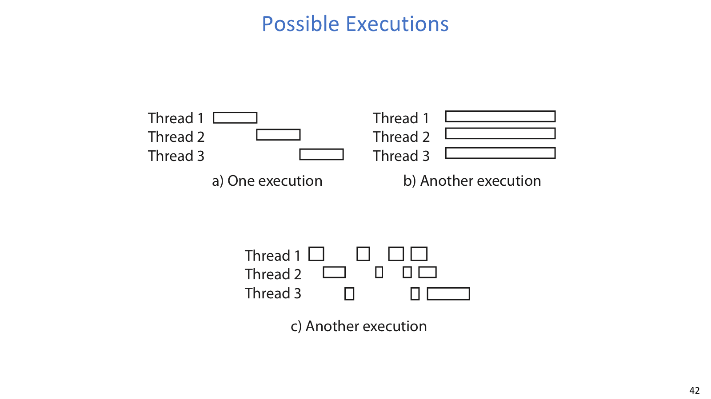
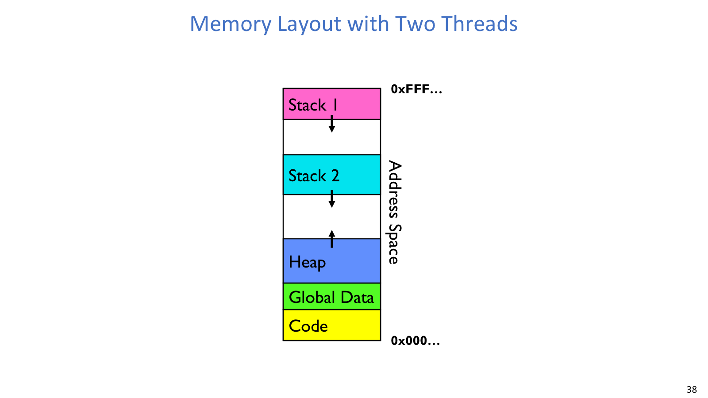

## 线程

### 并发与并行



操作系统和应用经常要同时处理多项工作。OS 要处理进程、I/O、中断和后台维护；网络服务器要服务多个连接；图形界面在后台任务运行时仍要响应用户；磁盘和网络程序则要隐藏慢设备的等待时间。

如果没有线程，程序常常被迫写成事件驱动状态机：每个请求推进一点，记录中间状态，等下一次事件再继续。这种写法可以高效，但控制流被切碎，普通业务逻辑会变难读。

线程是 OS 提供的并发单位。每个线程可以代表一个任务流，由调度器决定什么时候运行、运行多久、何时被换下。单核上多个线程不是同时执行，但它们可以交替推进；多核上多个线程才可能物理同时运行。

几个术语要分开：

| 术语 | 关注点 | 判别方式 |
| --- | --- | --- |
| Concurrency | 多个任务都在推进 | 单核时间片切换也可以并发 |
| Parallelism | 多个任务物理上同时执行 | 需要多个 core/CPU 或其他并行执行单元 |
| Multiprocessing | 系统有多个处理器或核心 | 支撑真正同时运行 |
| Multiprogramming | 系统中有多个 job/process | 目标是提高利用率和吞吐 |
| Multithreading | 一个或多个进程中有多个 thread | 程序员看到多个执行流 |

### 运行状态



线程最基本的运行状态有三种，它们描述的是线程和 CPU、等待事件之间的关系：

- RUNNING：正在 CPU 上执行。
- READY：可以运行，但当前没有被调度到 CPU。
- BLOCKED：因为 I/O、锁、条件变量、join 等原因暂时不能运行。

当一个线程发起阻塞 I/O 时，它会从 RUNNING 变成 BLOCKED；I/O 完成后，通过中断或内核事件唤醒，线程再回到 READY。调度器可以在它阻塞期间运行其他 READY 线程，于是单核也能重叠等待与计算。

一个 UI 程序如果只有一个线程，读取大文件时界面可能完全不响应。把读取文件和渲染界面拆成两个线程后，读文件线程阻塞等待磁盘时，界面线程仍能继续处理输入。这里并没有增加硬件并行度，但改善了响应性。

### pthread

`pthread_create` 创建同一进程内的新线程：

```c
pthread_t tid;
pthread_create(&tid, NULL, worker, arg_ptr);

void *ret = NULL;
pthread_join(tid, &ret);
```

新线程从 `worker(arg_ptr)` 开始运行；调用者成功时返回一次，不像 `fork()` 那样在同一行产生 parent 和 child 两条返回路径。`pthread_join` 会阻塞调用线程，直到目标线程结束，并取回退出值。

线程库通常在用户态做参数整理和运行库 bookkeeping，最终通过系统调用请求内核创建或管理线程。语言运行时也常把高级线程接口包装到类似机制上。

线程共享 code、static/global data、heap、open files、进程权限和地址空间；私有状态包括 PC、registers、execution flags、stack，以及 TCB 中的线程调度状态。共享让通信便宜，也让数据竞争成为核心风险。

| 类别 | 内容 | 影响 |
| --- | --- | --- |
| 共享 | code、global data、heap、open files、地址空间 | 共享可写对象需要同步 |
| 私有 | PC、registers、stack、TCB 状态 | 上下文切换主要保存/恢复这些状态 |
| 容易混淆 | stack 私有，但 stack 上的指针可指向 heap/global object | 判断 race 要看实际对象是否共享 |

### 线程栈与 fork-join



栈保存函数调用链、返回地址、局部变量和临时结果。多线程进程里，代码段、全局数据和堆通常共享，但每个线程必须有自己的栈；否则两个线程的函数调用就会互相覆盖。

线程切换时，OS 保存旧线程的寄存器、PC 和栈指针，再恢复新线程的对应状态。线程“下一步从哪继续”取决于这些私有执行状态，而不是进程级资源。

在 fork-join 模式中，main thread 创建多个 worker thread，把参数传给它们；worker 分别执行任务，结束时返回结果；main 再依次 join。main 的 join 顺序只说明 main 等待的顺序，不代表 worker 的实际完成顺序。除非有 lock、condition variable、semaphore、join 等同步关系，否则打印顺序和完成顺序都不稳定。

### 交错执行



调度器可以按任意顺序运行线程，也可以在许多看似普通的指令之间切换线程。程序必须在所有可能 interleaving 下都正确，而不是只在某次运行的顺序下正确。

独立线程不共享状态，结果通常确定且可复现。协作线程共享状态，必须通过同步保证无论调度如何交错，都能得到期望结果。共享可变状态上的非原子 read-modify-write 是 race condition 的常见来源。

锁负责 mutual exclusion：同一时间最多一个线程进入受保护的 critical section。Semaphore 是更泛化的同步对象，初值为 1 时可当 mutex，初值为 0 时常用于事件通知，例如 worker 完成后 signal，main 再继续。

## 进程



进程是具有受限权限的执行环境：一个地址空间、一个或多个线程、打开文件、网络连接和其他内核状态。现代 OS 中，运行在内核外的程序通常都运行在某个进程中。进程隔离保证一个程序崩溃时不会直接破坏其他进程或 OS。

`pthread_create`、`fork`、`exec` 的边界很清楚：

| API | 创建或改变什么 | 地址空间 | 控制流 |
| --- | --- | --- | --- |
| `pthread_create` | 同一进程内的新线程 | 共享原进程地址空间 | 调用者返回一次，新线程从入口函数开始 |
| `fork` | 新 child process | 复制父进程地址空间和资源视图，常配合 copy-on-write | parent 得到 child pid，child 得到 0 |
| `exec` | 替换当前进程的程序映像 | 当前地址空间被新程序覆盖 | 成功后不返回原代码 |

`fork + exec` 把“复制当前进程状态”和“装载新程序”拆开，所以 shell 可以先 `fork`，在 child 中设置 fd 重定向、pipe、环境变量，再 `exec` 目标程序。Windows 的 `CreateProcess` 则把这些动作更多合并进一个接口。

线程适合频繁共享内存、属于同一应用协作逻辑的任务；进程适合需要强隔离、独立故障恢复或本来就是不同程序的任务。线程更轻，但同步更难；进程更重，但保护边界更清楚。

判断这三组 API 的语义时，需要分别检查地址空间和控制流发生了什么变化。
