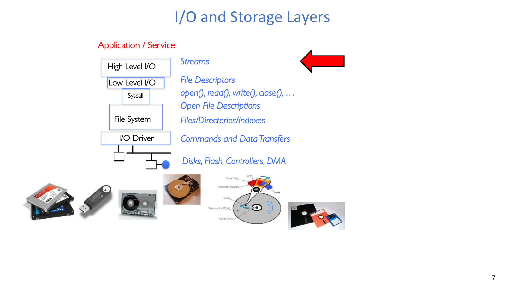
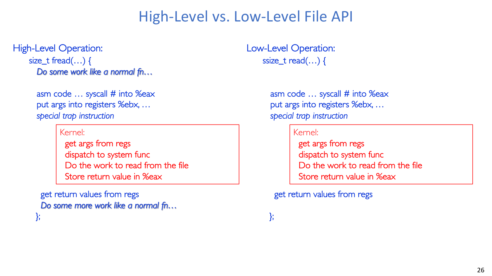
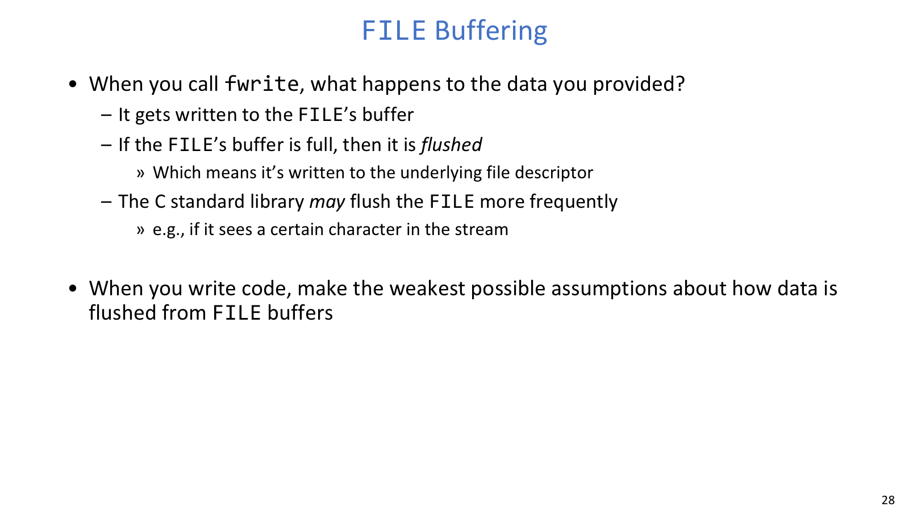
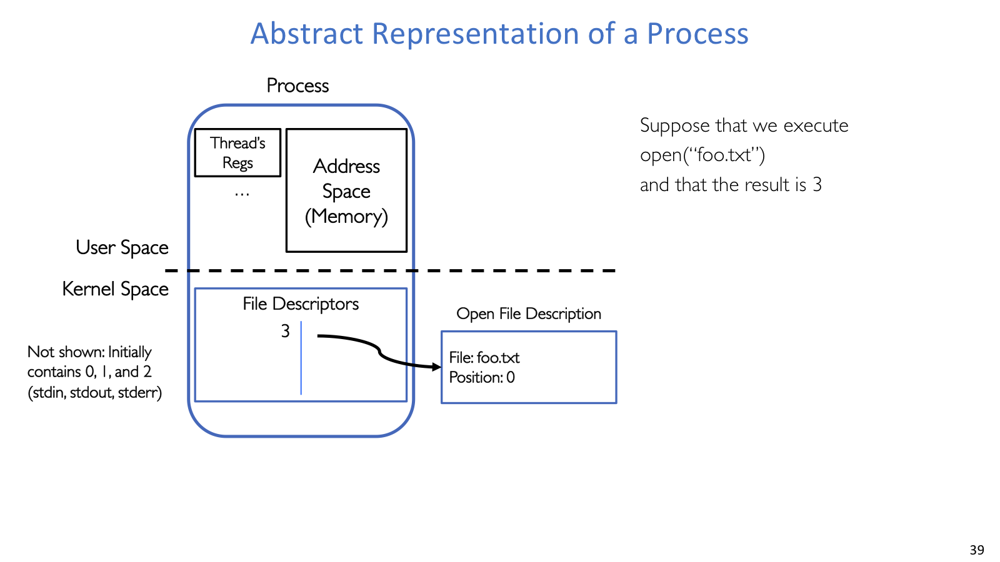
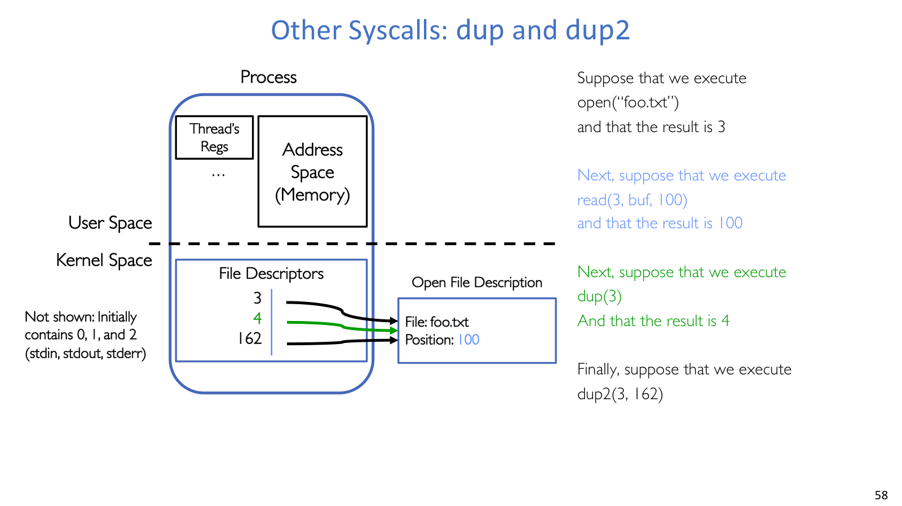

## 文件抽象

程序需要用统一方式处理磁盘文件、终端、设备、pipe、socket 等 I/O 对象。Unix/POSIX 的选择是把它们尽量放进同一套 open/read/write/close 风格里，也就是常说的 “everything is a file”。

POSIX 文件可以先理解为“文件系统中用名字引用的一组字节序列”。字节本身没有结构，文本、二进制、序列化对象的含义由应用解释。文件元数据记录大小、修改时间、权限等描述信息。目录则组织名字空间，把名字映射到文件或子目录。

每个进程有 current working directory。绝对路径从根开始，不依赖 CWD；相对路径依赖当前工作目录。`chdir` 改变的是进程后续解析相对路径的上下文。

“万物皆文件”强调统一接口，不代表所有对象语义完全相同。普通文件通常支持 seek，socket 和 pipe 是顺序流；终端、设备、网络连接的阻塞、flush、错误和控制语义也不同。`ioctl` 这类接口的存在，正说明有些设备专用控制不适合塞进标准 read/write。

## I/O 分层





从应用到硬件，I/O 大致分为五层：

| 层次 | 代表对象 | 作用 |
| --- | --- | --- |
| 高层 I/O | `FILE *` stream | 用户态缓冲、格式化、按行读写 |
| 低层 I/O | file descriptor | 系统调用使用的整数句柄 |
| Syscall | `open/read/write/close/lseek` | 受控进入内核 |
| File system / driver | inode、page cache、设备驱动 | 管理对象、缓存和设备协议 |
| Device | 磁盘、终端、网卡等 | 实际数据来源或目的地 |

系统调用比普通函数调用贵，因为它要跨越用户态和内核态。因此标准库会在用户态做缓冲，把许多小读写合并成较少的大系统调用，也提供内核不愿内建的高级功能，例如按行读取和格式化文本。

内核低层接口小而稳定，便于统一各种对象；标准库高层接口好用，但隐藏了 buffer 与 flush 时机。系统程序员要知道两层各自维护什么状态，尤其不能把 `FILE *` 当作“文件本身”。

## I/O 接口

### High-level API



`fopen` 返回的 `FILE *` 是 C 标准库维护的 stream 对象。它通常至少包含底层 fd、用户态 buffer、以及多线程访问时需要的 lock。常见接口包括：

```c
FILE *fp = fopen(filename, "r");
size_t n = fread(buf, sizeof(char), BUFFER_SIZE, fp);
fwrite(buf, sizeof(char), n, out);
fclose(fp);
```

`fread` 和 `fwrite` 的返回值是元素个数，不是总字节数。`fgetc` 的返回值应接到 `int`，因为它要同时表达字符和 `EOF`。`fgets(buf, n, fp)` 最多读 `n - 1` 个字符，并自动补 `\0`。

下面的程序里，`x` 不一定变成 `'b'`：

```c
char x = 'c';
FILE *f1 = fopen("file.txt", "w");
fwrite("b", sizeof(char), 1, f1);

FILE *f2 = fopen("file.txt", "r");
fread(&x, sizeof(char), 1, f2);
```

原因是 `fwrite` 可能只写进了 `f1` 的用户态 buffer，还没有 flush 到底层 fd。若在读取前加 `fflush(f1)` 或关闭 `f1`，后续读者才更明确地看到写入结果。

高层 API 适合普通文件处理、格式化文本、按行读取和可移植代码。代价是精确控制弱，必须理解 flush、预读和 stream position。`w/w+` 会截断文件，`a/a+` 的写入总追加到末尾，这类模式语义在阅读代码时很容易影响结果。

`FILE *` 和 fd 的差别不只是接口名字：前者是用户态库对象，会带 buffer；后者是内核对象表的下标，更靠近 system call。混用两层 API 时，要先想清楚数据可能停在哪一层 buffer 里。

### Low-level API

低层接口以 fd 为中心：

```c
int fd = open("input.txt", O_RDONLY);
if (fd < 0) {
    perror("open");
}

char buf[1000];
ssize_t rd = read(fd, buf, sizeof(buf));
if (rd > 0) {
    write(STDOUT_FILENO, buf, rd);
}
close(fd);
```

进程启动时通常已有 fd 0、1、2，分别对应 standard input、standard output、standard error。`open` 成功时返回当前进程最小的未使用 fd。`read` 返回实际读到的字节数，`0` 表示 EOF，`-1` 表示错误；`write` 也可能短写，健壮代码要循环处理。

低层 fd 适合需要精确控制 offset、阻塞、pipe/socket、non-blocking I/O、`fork/exec/dup`、重定向等场景。它更繁琐，但更接近 OS 真正维护的状态。

常见 flags 包括 `O_RDONLY`、`O_WRONLY`、`O_RDWR`、`O_CREAT`、`O_TRUNC`、`O_APPEND`、`O_EXCL`。`O_CREAT` 创建文件时需要第三个 `mode` 参数；`creat(filename, mode)` 可理解为 `open(filename, O_CREAT | O_WRONLY | O_TRUNC, mode)` 的简化形式。

## 内核文件状态

### fd 表





`open(path, flags)` 不只是返回一个整数。内核还会创建 open file description，里面记录当前打开实例的状态，其中最重要的是两个字段：

- 文件数据在哪里：例如 inode 或设备对象。
- 当前读写位置：也就是 file offset。

进程 fd 表把 fd 整数映射到 open file description。`read`、`write` 会按成功传输的字节数推进 offset；`lseek` 直接修改 offset；`close` 删除当前进程 fd 表项，并减少底层对象引用计数。

`dup` 和 `dup2` 复制的是 fd 表引用，而不是新建打开实例：

```c
int fd = open("foo.txt", O_RDONLY);  // 假设返回 3
read(fd, buf, 100);                  // offset = 100

int fd2 = dup(fd);                   // 假设返回 4
read(fd2, buf, 100);                 // offset 从 100 到 200
read(fd, buf, 100);                  // offset 从 200 到 300
```

`fd` 和 `fd2` 指向同一个 open file description，所以共享 offset。`dup2(oldfd, newfd)` 则把 `newfd` 改成指向 `oldfd` 的同一 open file description；若 `newfd` 已打开，会先关闭它。

这种别名机制正是 shell 重定向的基础：

```c
int fd = open("out.txt", O_WRONLY | O_CREAT | O_TRUNC, S_IRUSR | S_IWUSR);
dup2(fd, STDOUT_FILENO);
close(fd);
printf("hello\n");
```

`printf` 仍写 stdout，但 stdout 底层 fd 1 已经指向 `out.txt`。

### fork 与 offset

`fork()` 后 child 得到父进程 fd 表的副本，但表项通常指向同一批 open file description。因此父子进程可能共享 offset。若 fork 前 `fd` 的 offset 是 100，父子各读 100 字节，谁先读由调度决定；但它们不会都从 100 开始读，第二个读者会看到已经推进后的 offset。

`close(fd)` 只删除当前进程的 fd 表项，不会关闭另一个进程里的 fd。底层 open file description 要等最后一个引用关闭后才释放。

共享 open file description 很有用：父子进程可以共享 terminal、pipe、socket 或同一个文件打开实例。但在多线程进程中随意 `fork` 很危险，因为 child 只保留调用 `fork` 的那个线程；其他线程如果正持有锁或修改共享结构，会让 child 处在不一致状态。常见原则是：多线程进程里 `fork` 后尽快 `exec`。

高低层 I/O 混用也要谨慎：

```c
char x[10];
char y[10];

FILE *f = fopen("foo.txt", "rb");
int fd = fileno(f);

fread(x, 10, 1, f);
read(fd, y, 10);
```

直觉可能以为 `read(fd, y, 10)` 会接着读第 10 到 19 字节，但 `fread` 可能已经预读更多数据到 `FILE` 的用户态 buffer，底层 fd offset 已经被推进很远。除非非常清楚同步策略，否则避免混用 `FILE *` 和 fd；若必须混用，要显式处理 `fflush`、`fseek`、`fdopen`、`fileno` 等状态同步。
