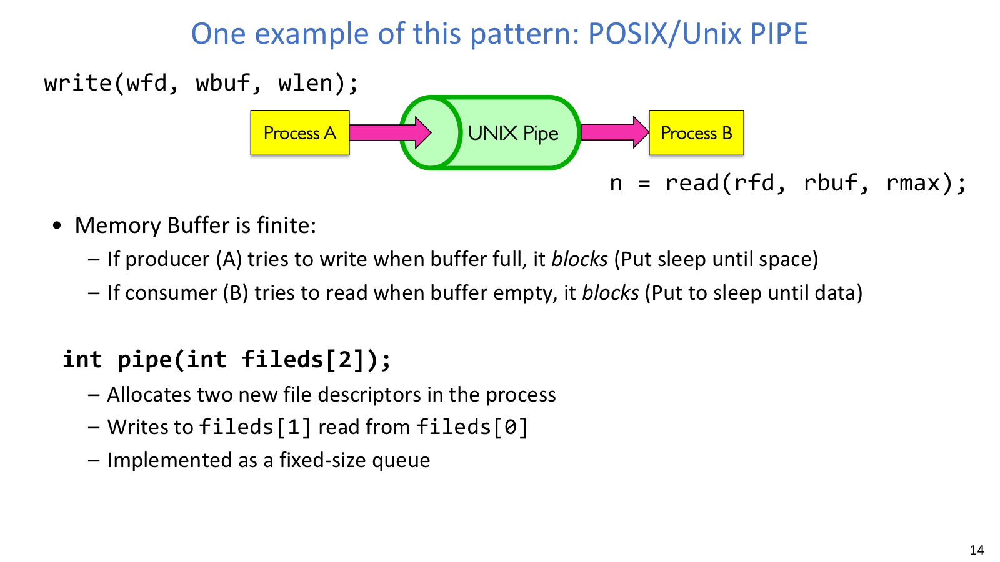
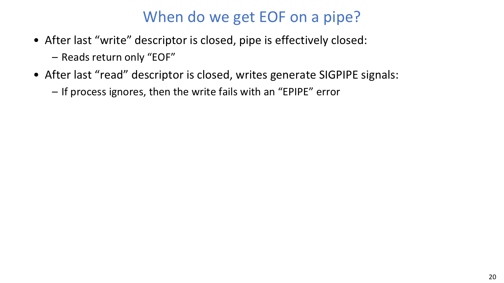
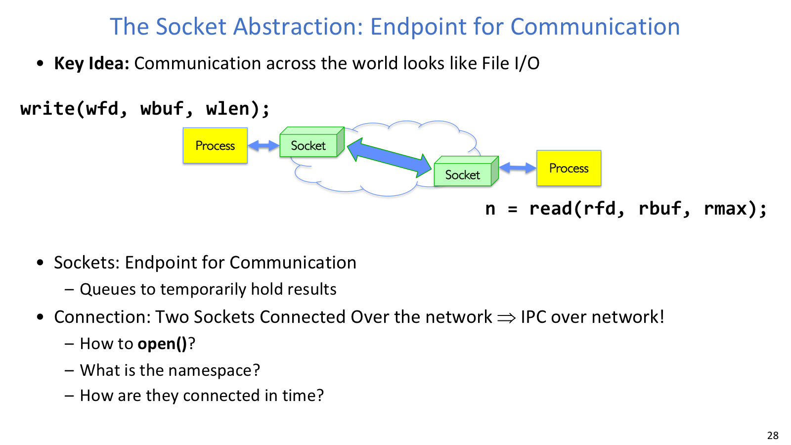
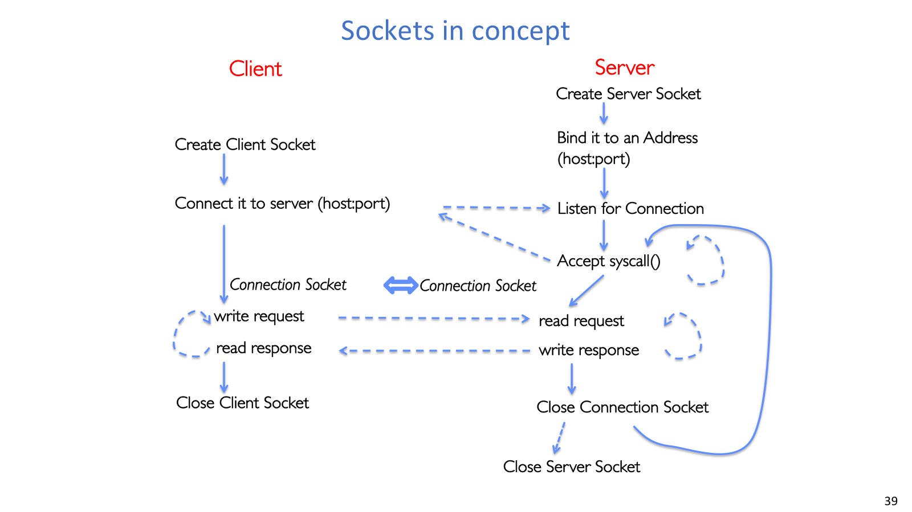
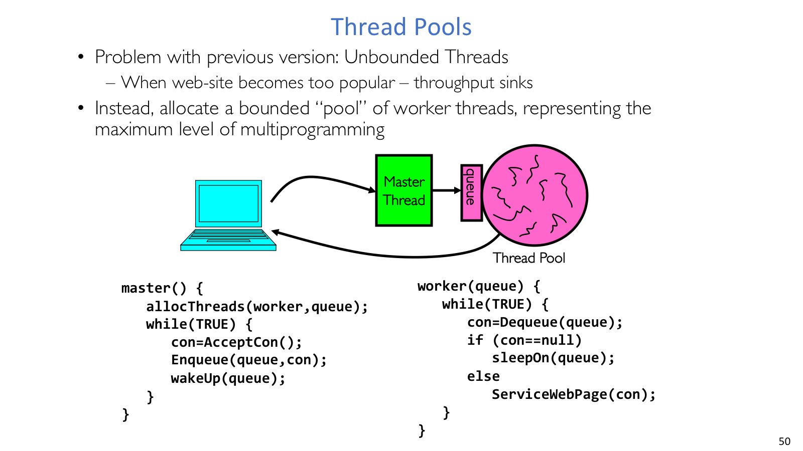

## IPC

进程抽象的设计初衷是隔离：独立地址空间防止一个程序随意读写另一个程序。但现实应用常常需要协作，例如 shell pipeline、父子进程传数据、服务器把连接交给 worker。于是 OS 要提供受控的 inter-process communication。

最笨的通信方式是文件：A 写到磁盘，B 再读出来。它通用且持久，但对临时、瞬时通信代价太高，也很难表达“只给某几个进程读”的短生命周期通道。

更自然的办法是让内核维护一段 in-memory queue，只能通过系统调用访问。写入的数据暂存在内核队列，读者按顺序取走。这样没有磁盘 I/O，权限和生命周期也能由内核控制。

## Pipe



Pipe 的有限内存队列解释了阻塞读写和流式通信语义。



EOF/SIGPIPE 不是单个 fd 的属性，而是所有端点引用共同决定的结果。

`pipe(pipefd)` 创建一个匿名管道：

```c
int pipefd[2];
pipe(pipefd);

// pipefd[0] 是 read end
// pipefd[1] 是 write end
```

普通 pipe 常用于同机、有继承关系的进程之间。通常先 `pipe`，再 `fork`，父子进程通过继承得到同一个内核队列的两个 fd。它是字节流，不保存应用层消息边界；写端写入字节，读端按顺序读出。

管道缓冲区有限。缓冲区满时，写者阻塞；缓冲区空时，读者阻塞。这与普通文件不同：文件读到 EOF 通常立即返回，而 pipe 的空队列可能只是“未来还会有人写”。

单向父写子读的基本形状是：

```c
int pipefd[2];
pipe(pipefd);

pid_t pid = fork();
if (pid == 0) {
    close(pipefd[1]);
    read(pipefd[0], rbuf, rmax);
    close(pipefd[0]);
} else {
    close(pipefd[0]);
    write(pipefd[1], wbuf, wlen);
    close(pipefd[1]);
}
```

关键不是只会 `read/write`，而是关闭不用的一端。fork 后父子都会持有读端和写端副本；如果不用的一端不关，引用计数就不符合协议预期，读者可能迟迟看不到 EOF，写者也可能迟迟收不到 `SIGPIPE`。

## fd 生命周期

Pipe 的结束条件看所有引用，而不是看某个局部变量还在不在：

- 所有 write fd 都关闭后，read end 再读会返回 EOF。
- 所有 read fd 都关闭后，write end 再写通常触发 `SIGPIPE`；若忽略信号，`write` 失败并设置 `EPIPE`。

这也是为什么管道代码里常见 “child 关闭写端，parent 关闭读端”。不是为了整洁，而是为了让内核知道这条通信方向上还有没有可能产生数据。

Pipe 轻量、接口简单、适合临时流式通信；但普通匿名 pipe 缺少路径名，通常依赖父子继承传递 fd。它也通常是单向的。如果需要跨无亲缘关系进程、跨机器或双向通信，就要换其他 IPC 机制，socket 是其中最重要的一类。

## 协议

一旦有通信通道，双方还需要约定如何解释字节。只写 `read/write` 不是协议；真正的协议要说明消息格式、消息顺序，以及每一步对双方状态的影响。

协议通常包含两层：

- Syntax：消息如何结构化，例如字段、长度、顺序、编码。
- Semantics：消息是什么意思，例如收到请求后执行什么动作、异常时如何恢复。

状态机和消息事务图常用于描述协议。跨网络通信时还要处理不同机器的数据表示、编码和错误模型；RPC 工具把远程调用包装得像本地函数，但底层仍然绕不开协议、序列化、超时和失败处理。

## Socket



Socket 把网络连接包装成像文件一样可读写的通信端点。



C/S 建链流程展示了 client socket、server socket 和 connection socket 的分工。

Socket 是网络连接的一个端点，也是一种 IPC 机制。Linux 中 socket 可以表现为 fd，因此很多情况下也用 `read/write/close` 操作。TCP socket 提供可靠、有序、双向字节流；可以把一条连接理解成两个方向独立的队列：A 到 B 一条，B 到 A 一条。

它和普通文件的区别同样重要：TCP 是字节流，不保留应用消息边界；一次 `write` 不保证对应对方一次 `read`。应用层必须设计 framing，例如先发送长度再发送 payload。Socket 也不能像普通文件那样随机 `lseek`。

Client 通常主动连接 server：

```c
int sock_fd = socket(server->ai_family,
                     server->ai_socktype,
                     server->ai_protocol);

connect(sock_fd, server->ai_addr, server->ai_addrlen);
run_client(sock_fd);
close(sock_fd);
```

Server 的经典流程是：

```c
int server_socket = socket(server->ai_family,
                           server->ai_socktype,
                           server->ai_protocol);

bind(server_socket, server->ai_addr, server->ai_addrlen);
listen(server_socket, MAX_QUEUE);

while (1) {
    int conn_socket = accept(server_socket, NULL, NULL);
    serve_client(conn_socket);
    close(conn_socket);
}
```

`server_socket` 是 listening socket，用于接收连接请求，不能直接读写某个 client 的业务数据。`accept` 返回的 `conn_socket` 才对应一条具体 TCP connection。

## 连接身份

网络寻址要分层看：hostname/DNS 找到主机，IP 找到网络接口，port 找到主机上的服务端点。Client 通常让内核自动分配 ephemeral port；Server 必须绑定固定端口，否则 client 不知道连接哪里。

一条 TCP connection 通常由五元组区分：

- Source IP Address。
- Destination IP Address。
- Source Port Number。
- Destination Port Number。
- Protocol。

这就是为什么同一个 server port 可以同时服务多个 client：每条连接的 client IP/port 不同，五元组不同。

## 并发服务器



线程池用固定 worker 数限制并发上限，避免一个连接一个线程无限增长。

串行 server 每次 `accept` 一个连接，处理完才接下一个。内核可以排队连接，网络栈也有缓冲，但应用层服务仍会被长请求拖住。

常见并发模型有三类：

| 模型 | 优点 | 代价 |
| --- | --- | --- |
| 多进程 | 隔离强，一个连接崩溃不易破坏其他连接 | 创建和切换成本高，共享状态麻烦 |
| 多线程 | 共享缓存、日志、账户表方便，创建切换较轻 | 需要严格同步，线程数可能无限增长 |
| 事件驱动 | 少线程、高并发友好 | 控制流拆成状态机，错误处理复杂 |

一个连接一个线程或进程容易理解，但高峰期可能无界增长。线程池提前创建固定数量 worker，主线程负责 accept 并把任务放入队列，worker 循环取任务处理。它限制最大并发量，减少创建销毁抖动，但队列和共享状态需要同步。

并发服务器的设计回答要交代四件事：谁负责 `accept`，谁处理 request，任务如何排队，上限在哪里。常见 bug 包括混淆 listen fd 与 conn fd、忽略短读短写、没有应用层 framing、fork 后忘记关闭不用 fd、为了“并发”又在 accept 循环里立刻 `wait/join`。
