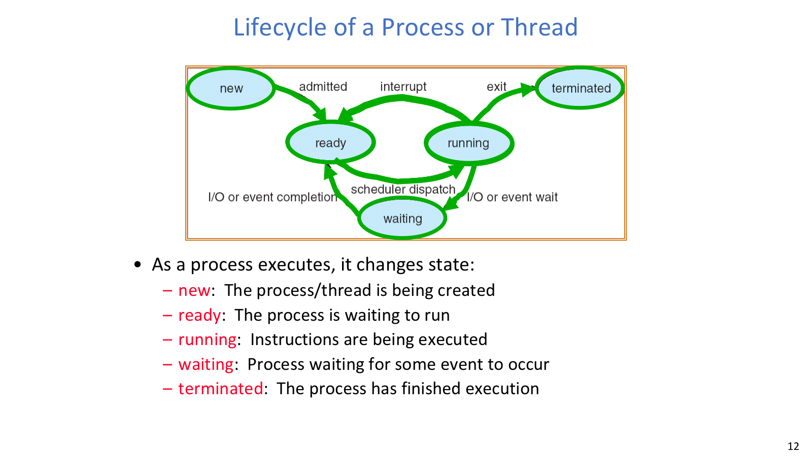
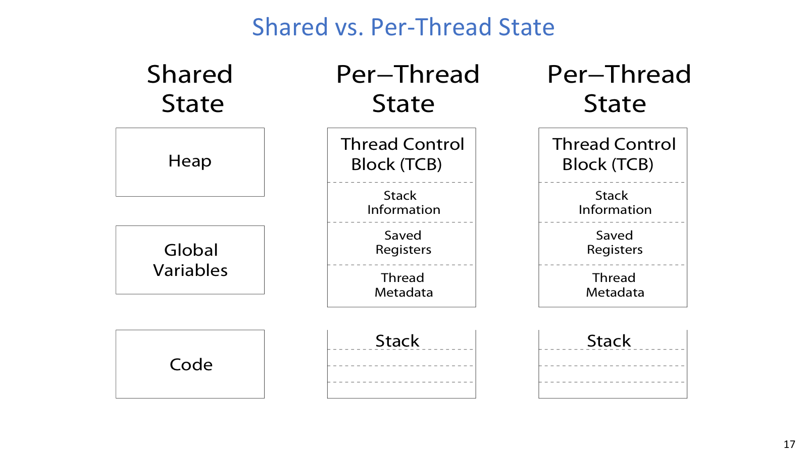
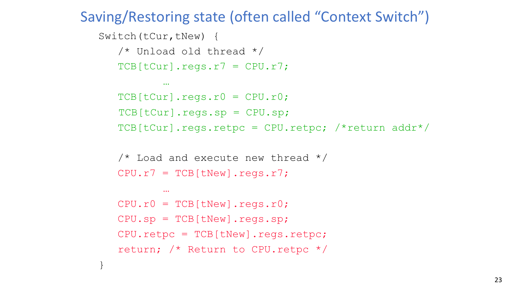
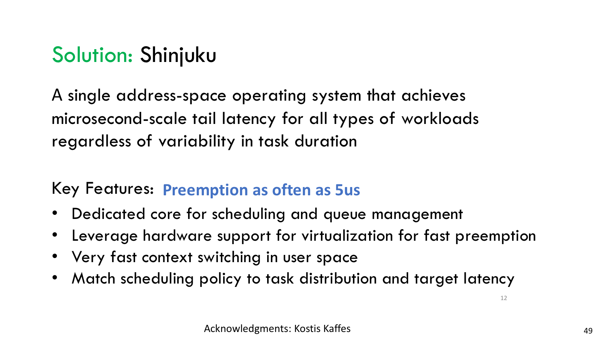
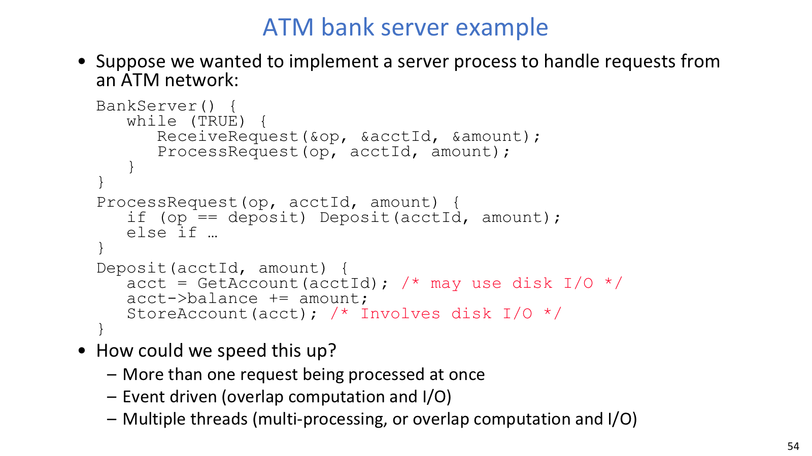

## 线程状态

### 控制块

线程和进程离开 CPU 后，状态仍保存在内核中，等待下一次调度、唤醒或终止。OS 负责维护这些状态，并在需要运行时把执行上下文装回 CPU。

进程通常由 PCB 表示。PCB 记录进程状态、寄存器快照、PID、用户、可执行文件、优先级、执行时间、内存和 I/O 资源引用等。线程则需要 TCB，记录 PC、SP、寄存器、线程栈、线程状态等“下一条指令从哪继续”的信息。

PCB 与 TCB 保存的内容有所不同：

| 控制块 | 更关心什么 | 典型内容 |
| --- | --- | --- |
| PCB | 进程拥有什么资源 | 地址空间、文件表、权限、资源引用、进程级状态 |
| TCB | 线程如何继续执行 | PC、SP、寄存器、线程栈、线程状态 |

同一进程中的多个线程共享 PCB 指向的地址空间和全局资源，但每个线程必须有自己的 TCB 和 stack，否则它们无法独立暂停和恢复。

### 生命周期





进程或线程的生命周期可用几个状态描述。它们不是静态标签，而是调度器和等待事件共同推动的队列位置：

- new：正在创建。
- ready：已经可以运行，等待 CPU。
- running：指令正在执行。
- waiting / blocked：等待 I/O、锁、条件、join 等事件。
- terminated：执行结束。

调度本质上是队列管理。ready queue 里放可运行实体；不同设备、信号或条件可有不同等待队列。scheduler 决定从哪个队列、按什么策略取出下一个实体运行。

状态迁移可以按事件解释：

| 迁移 | 触发原因 |
| --- | --- |
| `created -> ready` | 控制块和初始资源建好，等待 CPU |
| `ready -> running` | scheduler 选中并 dispatch |
| `running -> blocked` | 发起 I/O、等待锁/条件、等待 join |
| `blocked -> ready` | I/O 完成、锁释放、signal/broadcast |
| `running -> ready` | timer interrupt 抢占，或主动 yield 后仍可运行 |

## 调度与切换

### Dispatch loop



调度循环可以抽象成：

```c
Loop {
    RunThread();
    ChooseNextThread();
    SaveStateOfCPU(curTCB);
    LoadStateOfCPU(newTCB);
}
```

`RunThread()` 会把线程状态装入 CPU，包括寄存器、PC、栈指针，以及必要的执行环境，例如地址空间。线程会一直运行，直到它阻塞、主动 yield、结束，或者被外部中断抢占。之后 OS 选择下一个 ready 线程，保存当前 CPU 状态，装载新线程状态。

线程切换通常比进程切换轻，因为同一进程内的线程共享地址空间，不需要切换完整内存映射。但它仍有成本：保存恢复寄存器、切换栈、进入退出内核路径、破坏缓存局部性，甚至影响 TLB。

### Context switch

Context switch 的代码骨架如下：

```c
Switch(tCur, tNew) {
    TCB[tCur].regs.r7 = CPU.r7;
    TCB[tCur].regs.r0 = CPU.r0;
    TCB[tCur].regs.sp = CPU.sp;
    TCB[tCur].regs.retpc = CPU.retpc;

    CPU.r7 = TCB[tNew].regs.r7;
    CPU.r0 = TCB[tNew].regs.r0;
    CPU.sp = TCB[tNew].regs.sp;
    CPU.retpc = TCB[tNew].regs.retpc;
    return;
}
```

真实系统要保存的状态更多。旧线程必须留下足够的状态，才能在以后从原位置继续；新线程也要恢复完整的执行上下文。

如果切换代码漏保存某个寄存器，错误可能非常隐蔽。只有当被换下的线程仍依赖该寄存器，并且某次 interleaving 恰好覆盖它时，程序才会出错。测试很难覆盖所有调度点和寄存器使用组合，因此 context switch 代码通常保持简单、通用和保守。

### 抢占控制

线程把控制权交回内核有两类路径：

- 内部事件：线程主动 `yield`、发起阻塞 I/O、等待锁/条件、等待其他线程信号。
- 外部事件：timer interrupt 等硬件中断强制打断当前线程。

如果只有内部事件，一个纯计算线程可能永远不主动让出 CPU。定时器中断解决了这个问题：硬件每隔一小段时间打断当前执行流，切到内核 handler，内核做 housekeeping，再决定是否调度其他线程。

`yield()` 通常会 trap 到 OS。内核从 ready queue 选出新线程，调用低层 switch 保存当前线程并恢复新线程。等旧线程以后重新被调度回来，它会从当初 trap/yield 返回路径继续执行，并做必要的 thread housekeeping。

新线程启动也需要预先布置 TCB 和栈：栈指针指向新栈顶，PC 或 return address 指向启动桩 `ThreadRoot`，参数寄存器放入用户函数指针和参数。`ThreadRoot` 做启动 bookkeeping，切到用户态，调用用户函数，结束后执行 `ThreadFinish` 唤醒 join 等待者并释放资源。

## 多核执行

### 多核与 SMT

单核上并发来自时间复用，同一时刻只有一个线程的指令在执行。多核上多个线程可以真正并行运行。SMT / Hyperthreading 则在一个物理核心上暴露多个逻辑线程，让不同线程的指令填充执行单元空隙。

多核并行提升吞吐，但共享缓存、内存带宽和锁竞争会让加速不是线性的。SMT 的收益也不是线性，因为逻辑线程共享同一个物理核心的执行资源。OS 调度器把逻辑线程当成可调度 CPU，但性能判断必须记住底层资源仍然共享。

### Tail latency



平均延迟好看不代表系统体验稳定。Tail latency 关注最慢的一小部分请求，例如 p99 或 p99.9。短请求如果排在长请求后面，会被队头阻塞拖高尾部。

微秒级系统里，普通 OS 的 interrupt、kernel crossing、scheduler 和 context switch 开销都可能太大。OS bypass、polling、run-to-completion 可以减少中断和调度开销，但如果长短任务混在一起，短请求仍可能被长请求占住核心。

Shinjuku 用专用 scheduling/queue core、硬件虚拟化辅助抢占和用户态快速 context switch，把抢占带回微秒级服务，并根据任务时长分布选择调度策略。尾延迟目标越苛刻，调度路径自身的开销就越不能忽略。

## 共享状态与同步



ATM bank server 要同时处理多个请求，又不能破坏账户数据库或多发钱。线程让每个请求接近顺序程序的写法，但多个请求共享数据库时就会出现 race。

并发程序必须面对 non-determinism：调度器能以任意顺序运行线程，也能在许多点切换。独立线程没有共享状态，结果通常更可复现；协作线程共享状态，就要保证所有 interleaving 都正确。

常见同步概念如下：

| 概念 | 含义 |
| --- | --- |
| Synchronization | 线程之间围绕共享数据或事件进行协调 |
| Mutual exclusion | 同一时间只允许一个线程做某件事 |
| Critical section | 必须互斥执行的代码片段 |
| Lock | 提供 acquire/release 的互斥对象 |
| Semaphore | 非负整数同步对象，可做 mutex 或事件通知 |

多线程模型让每个请求可以“从头跑到尾”，业务代码接近顺序逻辑；代价是共享数据库、缓存、日志等都要同步。事件驱动模型减少线程数量和共享状态竞争，但把控制流拆成 callback 或状态机。工程上常见经验是先用正确的粗粒度锁打底，再根据热点和延迟目标细化。
