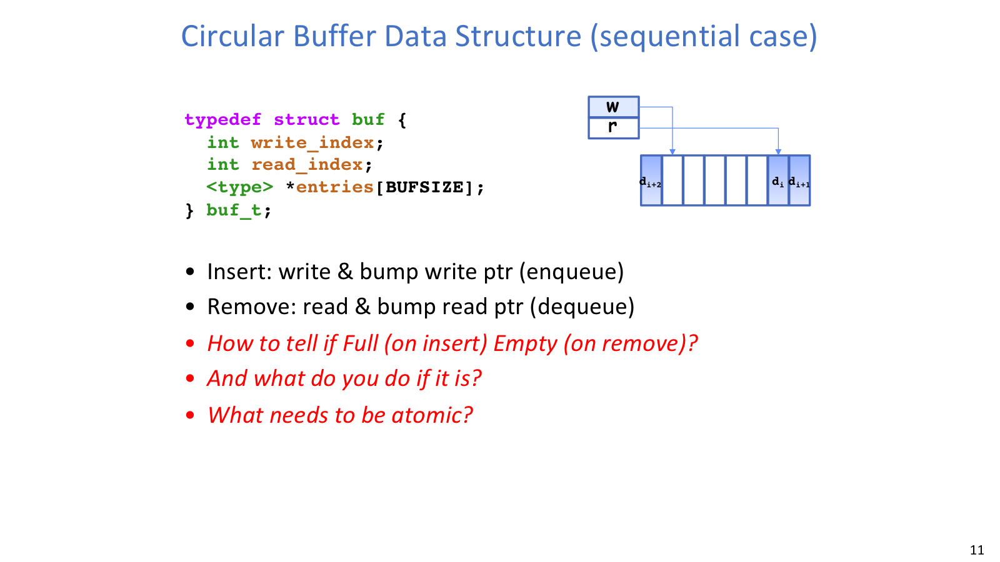
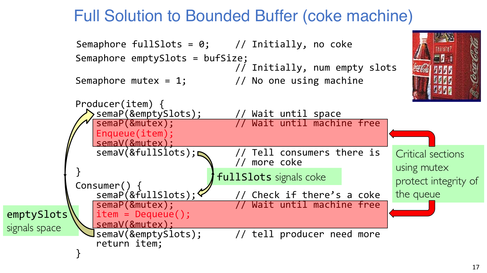
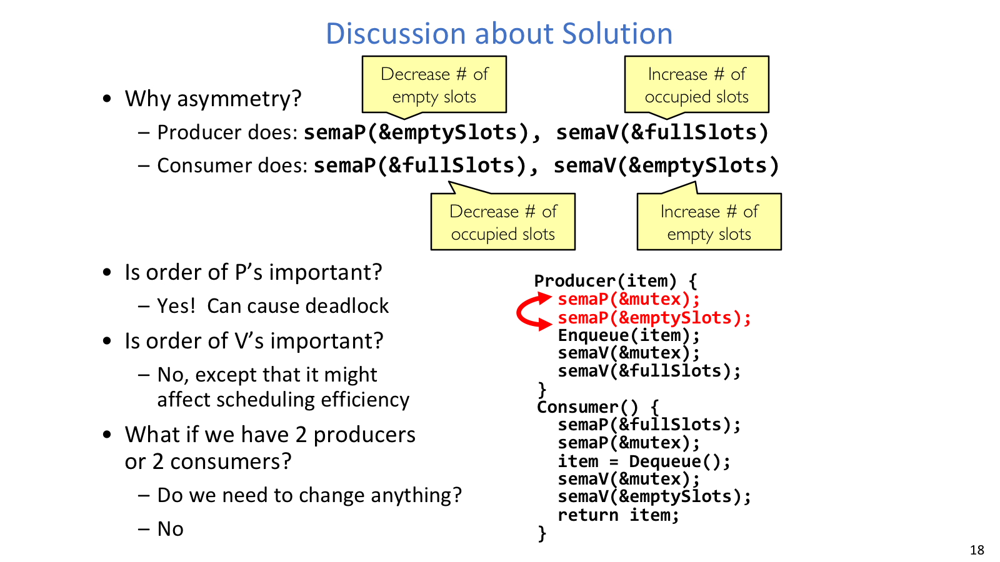
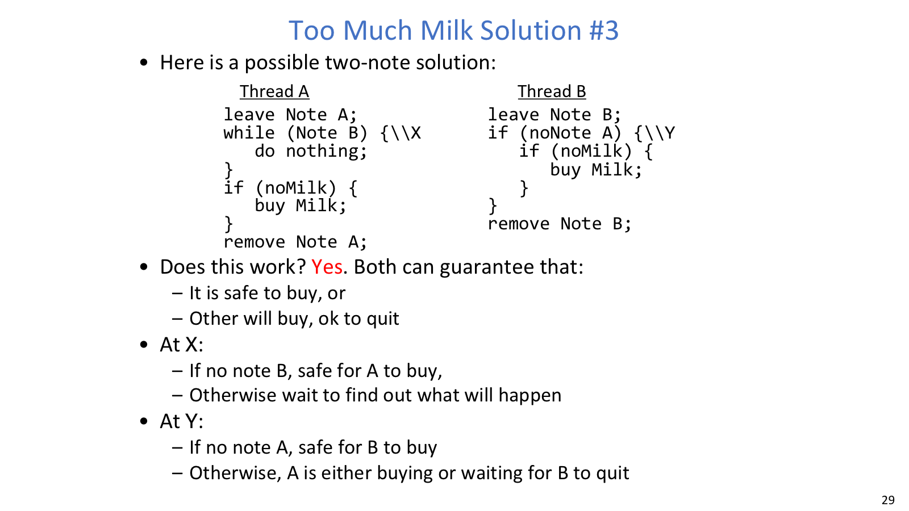
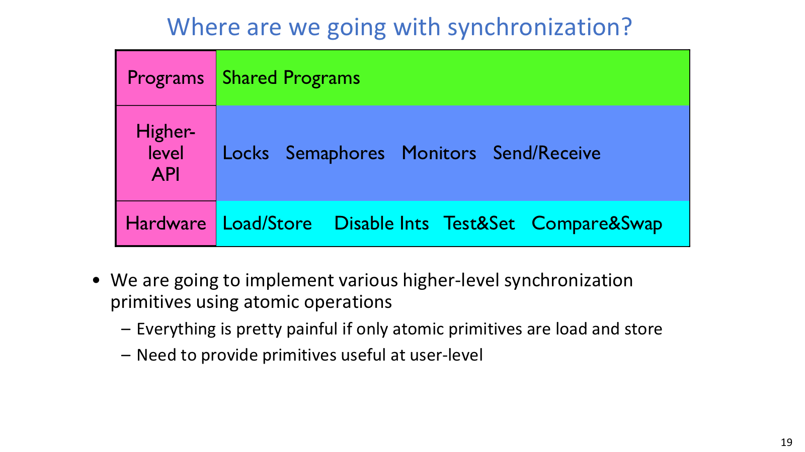

## 原子性

原子操作的意思是执行过程中不会被其他线程观察到中间状态。很多机器上单个内存 load/store 可以近似看作原子，但这不代表一句高级语言语句也是原子的。`x = x + 1` 至少包含读、算、写三步，只要中间发生 context switch，两个线程就可能读到同一个旧值并覆盖彼此的更新。

因此，分析并发程序时第一步不是急着加锁，而是先圈出哪些状态变化必须不可分割。银行账户例子里，`withdraw`、`deposit`、`getBalance` 都围绕同一个 `balance` 共享对象工作；只保护其中一个方法并不够，所有访问同一共享对象的路径必须使用同一把锁。Critical section 指访问共享状态且不能被交错的代码段，mutual exclusion 则是同一时刻最多一个线程处在这段代码里的性质。

锁的使用边界也很重要。进入临界区前 `acquire`，离开后 `release`；真正不访问共享状态的慢计算不应该被塞进锁里，否则虽然安全，整个系统的并发度会被白白压低。

## Bounded Buffer



Circular buffer 把 `read_index`、`write_index` 和 `count` 这些共享状态摆到台面上，方便讨论哪些操作必须互斥。

Producer/consumer 问题表面上只是“生产者放东西、消费者拿东西”，真正需要同步的是三件事：

| 约束 | 含义 | 同步对象 |
| --- | --- | --- |
| 空槽数量 | 缓冲区满时 producer 不能继续放 | `emptySlots`，初值为 buffer 容量 |
| 已有元素数量 | 缓冲区空时 consumer 不能继续取 | `fullSlots`，初值为 0 |
| 队列结构互斥 | `head/tail/count` 等共享状态不能被同时改 | `mutex`，初值为 1 |

可以观察到，circular buffer 里的 `read_index`、`write_index`、`count` 都是共享状态。判断 full/empty 和真正 enqueue/dequeue 必须作为一套受保护的协议来写，而不是散在 producer 和 consumer 的普通代码里。

只用一把 lock 很容易犯两个错误。第一种是 producer 拿着锁等待 buffer 不满，此时 consumer 需要同一把锁才能取走元素、制造空位，系统就卡死了。第二种是反复 release/acquire 轮询条件，安全性也许暂时没坏，但线程一直抢锁、释放、再抢锁，把 CPU 时间浪费在碰运气上。



Producer/consumer 的 semaphore 写法展示了三个约束如何分别落到 `emptySlots`、`fullSlots` 和 `mutex`。

Semaphore 的标准解法把资源等待放在互斥之前：

```c
Producer(item) {
    P(emptySlots);
    P(mutex);
    enqueue(item);
    V(mutex);
    V(fullSlots);
}

Consumer() {
    P(fullSlots);
    P(mutex);
    item = dequeue();
    V(mutex);
    V(emptySlots);
    return item;
}
```

读这段代码时，可以把 producer 理解成“先消耗一个空槽，再产生一个满槽”，consumer 则是“先消耗一个满槽，再释放一个空槽”。`mutex` 只保护真正修改队列结构的那一小段，所以等待资源和修改队列不会混在一起。

## P/V 顺序



这里的重点不是记代码形状，而是看懂为什么 `P` 的顺序会影响死锁。

`P` 的顺序是正确性问题。若 producer 先 `P(mutex)` 再 `P(emptySlots)`，当 buffer 已满时，producer 会在持有 `mutex` 的状态下睡眠。consumer 需要 `mutex` 才能进入临界区取走 item，于是没有人能改变 `emptySlots`，死锁就形成了。consumer 侧同理，必须先等 `fullSlots`，再进入 `mutex`。

`V` 的顺序通常不改变互斥安全性，因为共享状态已经在临界区里更新完。但它会影响唤醒时机和调度效率。例如 consumer 先 `V(emptySlots)` 再释放 `mutex`，producer 可能被唤醒却马上卡在 `mutex` 上；反过来先释放 `mutex` 再通知资源变化，常常更顺滑。这里要把两类问题分开看：`P` 顺序错会死锁，`V` 顺序更多影响性能和调度行为。

多个 producer 或多个 consumer 不需要新协议，只要所有线程共享同一组 `emptySlots/fullSlots/mutex`，并且所有队列修改都在 `mutex` 内完成。

## Too Much Milk



Too Much Milk 用生活场景暴露 race condition：检查、留纸条、行动之间都可能被切走。

Too Much Milk 的故事是两个室友看到冰箱没牛奶，都可能出门买，最后买多了。它抽象出的约束很简单：如果需要牛奶，应该有人买；但绝对不能超过一个人去买。难点在于“检查冰箱、检查纸条、留下纸条、出门”这些动作不是一个原子整体。

第一类方案是先检查有没有纸条，再留纸条。问题是两个线程都可能在对方留纸条前完成检查，于是都认为自己该去买。第二类方案是先留自己的纸条再检查，但自己的纸条也会挡住自己，可能导致没人买。即使用 A/B 两种标签写出不对称协议，也要靠非常精细的 interleaving 推理，才能相信它没有“双方都等”或“双方都买”的路径。

最终可以用忙等循环把某些两人版本修到可工作，但代价很明显：代码复杂、只适合固定人数、等待线程一直占用 CPU。这个例子的价值不在于背某个买牛奶算法，而在于理解为什么我们需要硬件 atomic primitives，并在其上封装 lock、semaphore、condition variable 这类高层同步抽象。

Too Much Milk 的价值不是背生活化算法，而是说明普通读写很难可靠表达“检查后行动”的原子性，因此需要硬件 atomic primitive 和更高层同步抽象。

## 同步抽象



同步抽象不是硬件直接给出的魔法，而是从 atomic operations 逐层封装出来的。

硬件通常不会直接提供完整的 semaphore 或 monitor，而是提供更低层的 atomic operations。课程里的分层关系可以这样读：

```text
hardware atomic operations
        -> locks / semaphores / monitors / send-receive
        -> shared programs
```

直接用 atomic load/store 或读改写指令写业务同步，程序会很快变得难以验证。好的同步抽象应该同时处理正确性、等待效率和可扩展性。Bounded buffer 中的 semaphore 解法就是一个典型例子：它把“还有多少空位”“已有多少数据”“谁能改队列”分别命名，让推理从难以捕捉的时序变成可检查的协议。
