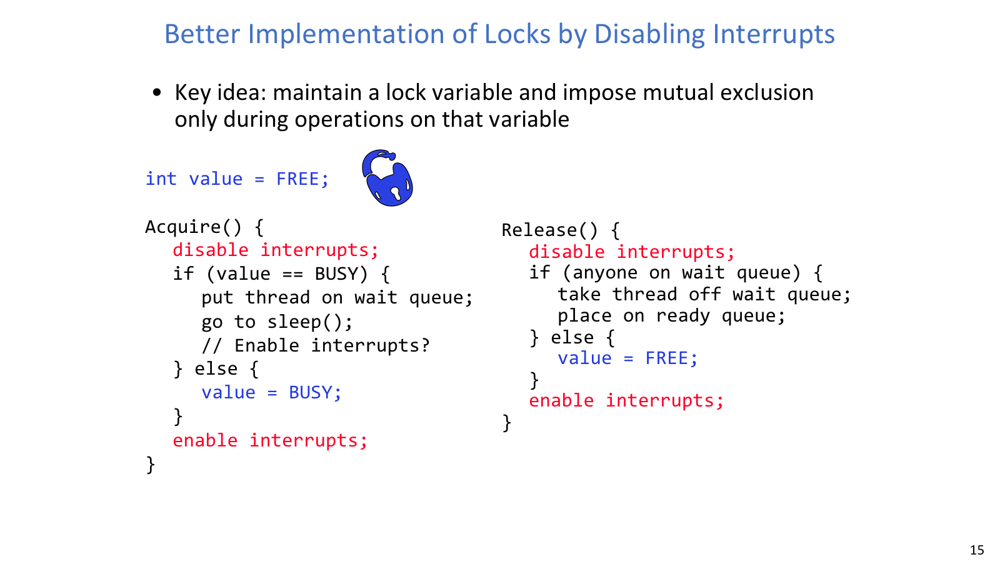
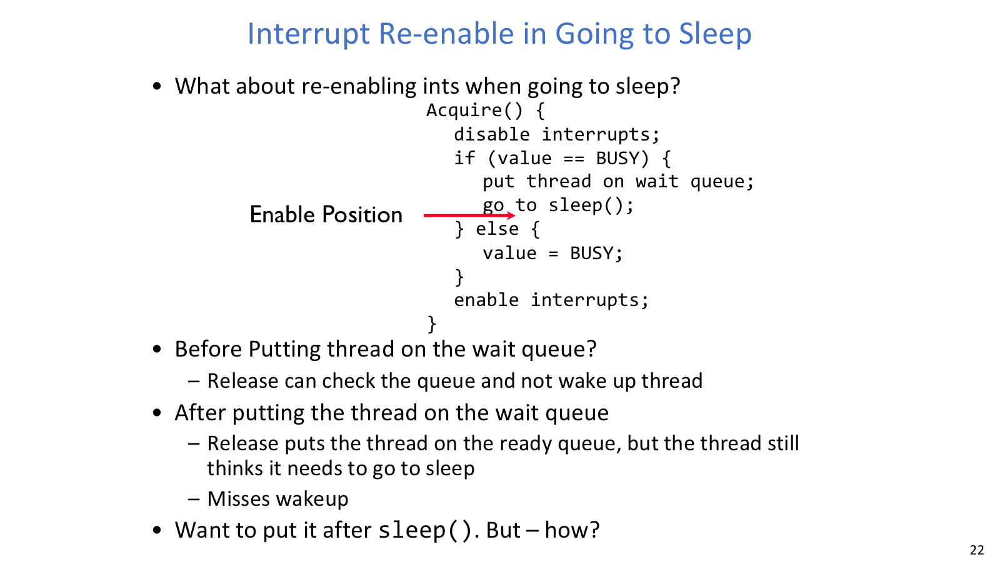
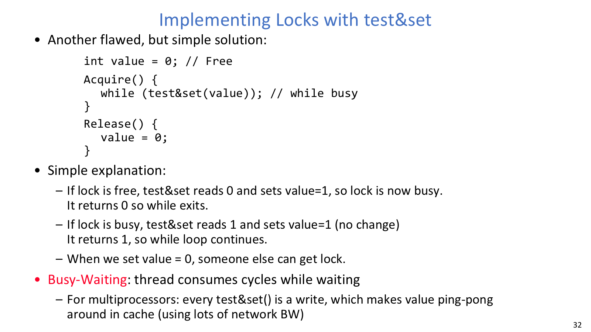
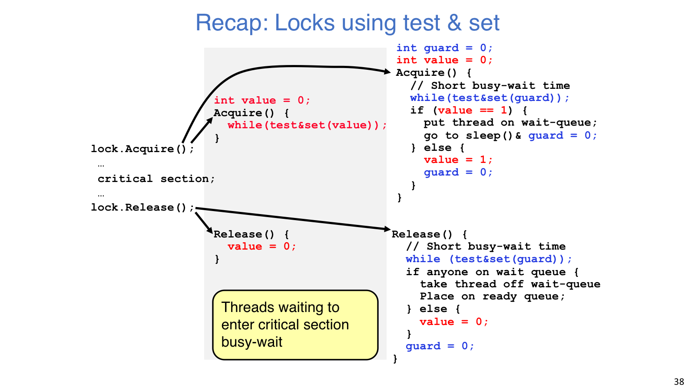
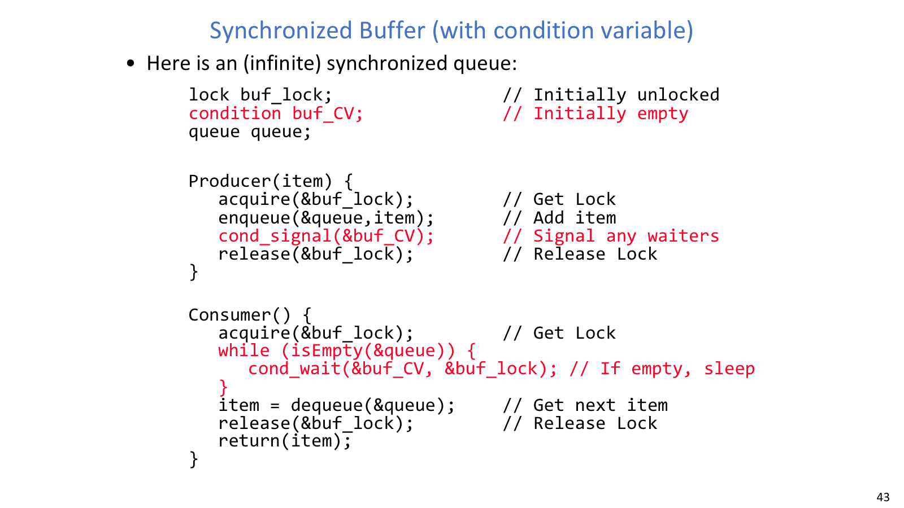

# Lecture 07: Synchronization 3 - Lock Implementation, Atomic Instructions, Monitors

## 导读

上一讲把 semaphore 当作可用抽象来写 producer/consumer，本讲则往下一层追问：如果 lock 本身也有共享状态，那么 lock 又该怎么实现？这个问题会把我们带到关中断、硬件原子指令，以及等待队列和 scheduler 的交界处。

可以把全讲看成在不断缩小“必须原子”的内部窗口。关中断适合单核内核里的短路径，test-and-set、swap、CAS 让多处理器也能安全竞争同一内存位置；而 guard + wait queue 进一步把长时间等待从 busy-wait 改成 sleep。需要注意的是，只要涉及睡眠和唤醒，lost wakeup 就会成为核心风险。Monitor 和 condition variable 则是在更高层把锁、共享状态和等待队列重新封装起来，减少直接手写 `P/V` 的误用。

## 本讲地图

| 主题 | 解决的问题 |
| --- | --- |
| Lock 语义 | 定义 `acquire/release` 必须保证什么 |
| Disable interrupts | 在单处理器内核短路径保护 lock 元数据 |
| Lost wakeup | 解释睡眠和唤醒为什么必须与状态更新原子衔接 |
| Atomic read-modify-write | 用 test-and-set、swap、CAS 支持多处理器锁 |
| Guard + wait queue | 把长时间等待从 busy-wait 改成 sleep |
| Monitor / CV | 用共享状态加条件队列表达等待条件 |
| Mesa vs Hoare | 解释为什么 Mesa monitor 中等待必须写 `while` |

## 正文

Lock 自己也是一段并发程序。关中断、Test-and-Set、sleep/wakeup 和 monitor 其实都在回答同一个问题：等待者如何安全地睡下，又如何不漏掉唤醒。

### Lock

Lock 的接口看起来很小：进入临界区前 `acquire`，离开临界区后 `release`。它真正承诺的是同一时刻至多一个线程持有锁。如果锁已经被别人拿着，当前线程要等待；如果等待时间可能很长，理想行为是睡眠，而不是一直占着 CPU 空转。

实现 lock 时要区分两层 critical section。用户真正想保护的是银行账户、队列、数据库等业务共享状态；lock 实现内部也有自己的共享状态，例如 `value`、wait queue、ready queue。底层机制只应该短暂保护这些元数据，不能把用户任意长的临界区都放进“关中断”或“自旋”里。

### 关中断



关中断版本展示了 lock 内部状态、wait queue 和 ready queue 的关系。

在单处理器上，调度器获得控制权通常来自内部事件和外部中断。若内核在修改 lock 元数据时暂时关闭中断，就能避免“检查锁空闲”和“把锁标为忙”之间被切走。换句话说，关中断不是拿来保护用户临界区的粗暴大锁，而是保护内核短路径的一种手段。

朴素方案是在 `Acquire` 中 disable interrupts，在 `Release` 中 enable interrupts，但这不能开放给普通用户程序。用户若拿锁后死循环，时钟中断也进不来，内核会失去重新调度的机会。实时系统中也不能让中断关闭时间不可控，否则 I/O、timer 和紧急事件响应都会被推迟。

正确边界是：只在 lock 内部元数据更新时短暂关中断。

```c
int value = FREE;

Acquire() {
    disable interrupts;
    if (value == BUSY) {
        put thread on wait queue;
        go to sleep();
    } else {
        value = BUSY;
    }
    enable interrupts;
}

Release() {
    disable interrupts;
    if (anyone on wait queue) {
        take thread off wait queue;
        place on ready queue;
    } else {
        value = FREE;
    }
    enable interrupts;
}
```

这段代码的重点是：关中断保护的是 `value` 与等待队列，而不是保护用户代码本身。多处理器上，关闭当前 CPU 的中断并不能阻止其他 CPU 同时访问同一内存位置，所以还需要硬件原子读改写指令。

### Lost Wakeup



Lost wakeup 的窗口通常藏在“准备睡”和“真正睡着”之间。

线程准备睡眠时，中断最终当然要重新打开，否则系统无法处理时钟和 I/O。危险在于开中断的时机，因为睡眠不是一句孤立的函数调用，而是一段会修改等待队列和线程状态的协议。

如果线程 A 判断锁忙后过早打开中断，线程 B 可能释放锁并检查等待队列；此时 A 还没入队，B 以为没人等，唤醒事件就丢了。之后 A 再把自己放进 wait queue 并睡下去，就可能永远没人叫醒。另一种窗口是 A 已经入队，B 把 A 放进 ready queue，但 A 继续执行旧路径又调用 sleep，把自己重新睡回去。

因此，“加入等待队列、标记 sleeping、释放内部保护、切换到其他线程”必须在 sleep/scheduler 路径中原子衔接。Lost wakeup 不是某个 API 名字的问题，而是所有阻塞同步都要避免的时序漏洞。

### Test-and-Set



Test-and-set 把检查旧值与写入新值合成一个硬件原子动作。

更通用的锁实现依赖 atomic read-modify-write 指令。它们把“读旧值、判断、写新值”合成一个不可分割的硬件动作。典型指令包括 `test_and_set`、`swap` 和 `compare_and_swap`，共同点都是让多个 CPU 不能同时基于同一个旧值做出“我拿到锁了”的判断。

```c
test_and_set(address) {
    result = M[address];
    M[address] = 1;
    return result;
}
```

用 `test_and_set` 写最简单的 spinlock：

```c
int value = 0;        // 0 means free, 1 means busy

Acquire() {
    while (test_and_set(&value)) {
        ;             // busy wait
    }
}

Release() {
    value = 0;
}
```

硬件保证同时执行 `test_and_set` 的多个 CPU 会排出一个先后顺序，因此不会有两个线程同时看到旧值为 0。这个版本简单、可在用户态使用、也支持多处理器；缺点是锁忙时一直 busy-wait。竞争严重时，等待线程浪费 CPU，甚至可能抢走持锁线程运行机会；在多核上，同一 cache line 还会在多个 cache 间来回迁移。

| 指令 | 原子动作 | 锁实现中的常见用法 |
| --- | --- | --- |
| `test_and_set(addr)` | 读旧值并写成 1 | 旧值为 0 表示抢到锁 |
| `swap(addr, reg)` | 交换内存和寄存器 | 用寄存器里的 1 反复交换直到旧值为 0 |
| `compare_and_swap(addr, old, new)` | 只有旧值匹配时写新值 | 乐观更新，失败后重试 |

这些指令只解决锁变量本身的竞争，不自动解决等待效率、优先级反转或 cache ping-pong。

### Guard + Wait Queue



Guard + wait queue 是“短自旋、长阻塞”的关键设计。

直接 spinlock 的问题是等待时间等于用户临界区长度。改进思路是只对 lock 内部元数据短暂自旋；如果真正的锁拿不到，就把线程放进等待队列并睡眠。这样忙等只出现在很短的内部窗口里，长等待交给 scheduler 处理。

```c
int guard = 0;
int value = FREE;

Acquire() {
    while (test_and_set(&guard)) {
        ;
    }

    if (value == BUSY) {
        put thread on wait queue;
        go to sleep and set guard = 0;
    } else {
        value = BUSY;
        guard = 0;
    }
}

Release() {
    while (test_and_set(&guard)) {
        ;
    }

    if (anyone on wait queue) {
        take thread off wait queue;
        place on ready queue;
    } else {
        value = FREE;
    }
    guard = 0;
}
```

`guard` 不是用户看到的锁，而是保护 `value` 和 wait queue 的短锁。`go to sleep and set guard = 0` 必须作为一条受控调度路径理解：线程已经入队并准备睡眠，同时保证后继线程能看到 `guard` 被释放。`Release` 发现有人等待时通常直接唤醒等待者，而不是把 `value` 改成 `FREE`，这样可以避免第三个线程趁空插队并造成两个线程都以为自己拥有锁。

### Monitor 与 Condition Variable



Condition variable 让线程在条件不满足时释放锁并睡眠。

Semaphore 很适合资源计数，但大型程序里 `P/V` 顺序容易写散。Monitor 是一种把共享数据、访问函数、锁和条件变量放在一起管理的并发编程范式。锁保护 monitor 内部共享状态，condition variable 负责让“不满足条件”的线程睡在合适队列上。这样写程序时关注点会从“先 P 哪个、后 V 哪个”转向“条件是否成立、状态是否在锁内更新”。

```c
lock monitor_lock;
condition cv;
shared_state state;

MonitorOperation() {
    acquire(&monitor_lock);

    while (condition_not_satisfied(state)) {
        cond_wait(&cv, &monitor_lock);
    }

    update_shared_state(state);

    cond_signal(&cv);
    release(&monitor_lock);
}
```

Condition variable 不是布尔变量，也不是计数器；真正的条件在受锁保护的共享状态里。`cond_wait(&cv, &lock)` 必须在持有锁时调用，它会原子地释放锁并睡眠，被唤醒返回前重新拿回同一把锁。`signal` 唤醒一个等待者，`broadcast` 唤醒所有等待者；如果 signal 发生时没人等待，这次 signal 没有历史可保存。

这也是 CV 与 semaphore 的根本差异。Semaphore 的 `V` 会积累许可，未来的 `P` 可以消耗；condition variable 的 signal 只对当前等待者有效。因此不能简单把 `semaP` 当作 `cond_wait`，也不能把 `semaV` 当作 `cond_signal`。

### Mesa vs Hoare

Hoare monitor 的语义是 signal 后 waiter 立即获得锁并运行，因此被唤醒时条件在语义上成立。但这种实现需要强制上下文切换，成本高，也复杂。

Mesa monitor 更接近真实系统：signaler 继续持锁运行，被唤醒线程只是进入 ready queue。等 waiter 真正运行时，条件可能又被别的线程改变了。所以 Mesa 风格下等待必须写成：

```c
while (!condition) {
    cond_wait(&cv, &lock);
}
```

`while` 不是 busy-wait。线程在 `cond_wait` 里睡眠，醒来后重新检查共享状态。它保护的是“signal 只表示条件可能成立”的现实语义。
