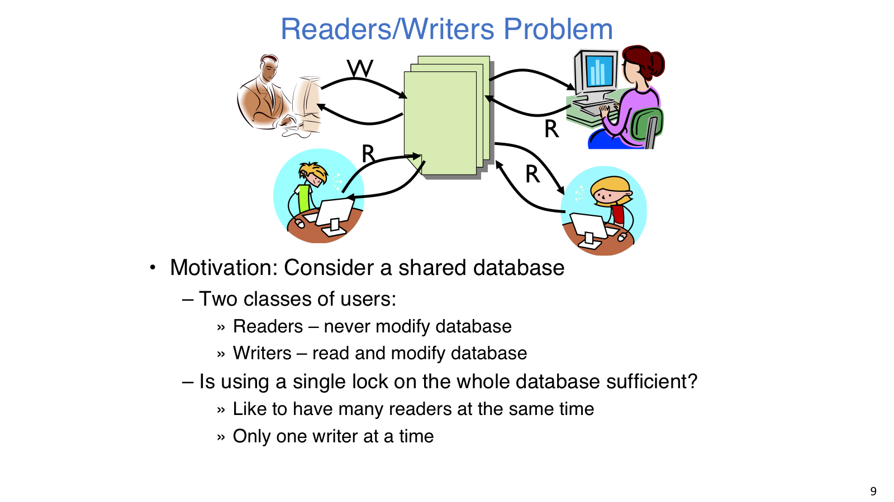
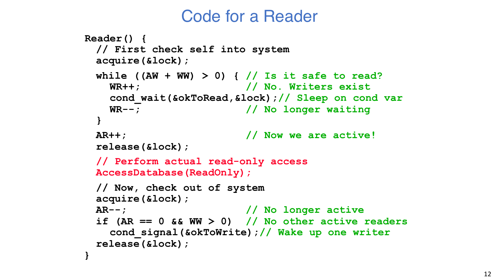
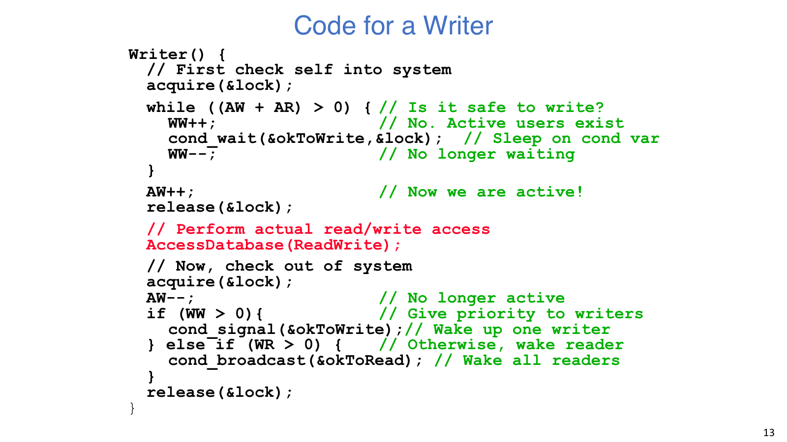
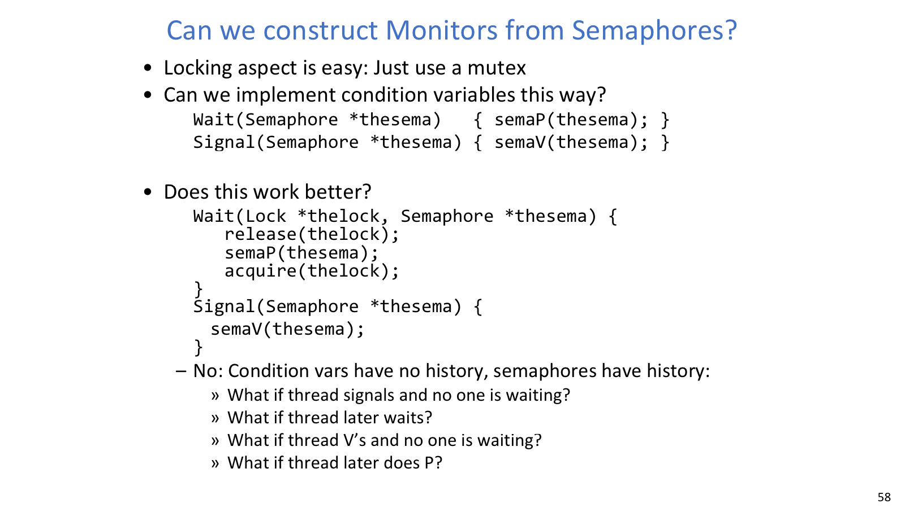
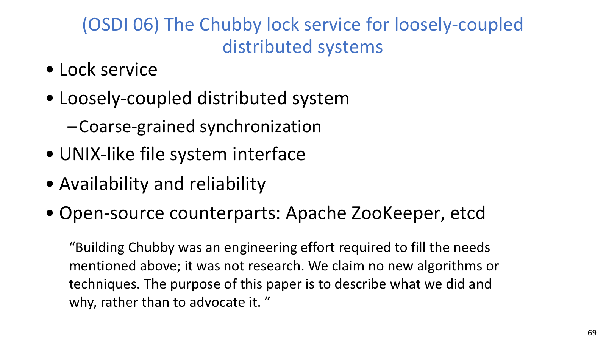

## Readers/Writers



Readers/Writers 的安全条件很直观：reader 可并行，writer 必须排他。

Readers/Writers lock 解决的是读多写少场景中的并发控制。多个 reader 只读共享数据，因此可以并行；writer 会修改共享数据，所以必须独占。正确性条件可以压成两句话：有 writer 正在写时，不能有任何 reader 或其他 writer 进入；有 reader 正在读时，writer 不能进入。

读写锁不能因为 writer 需要独占，就把所有 reader 也串行化。它需要在吞吐、公平和实现复杂度之间取舍。Reader-priority 的读吞吐较高，但连续 reader 到来时 writer 可能饥饿；writer-priority 能减少 writer starvation，但 writer 持续到来时 reader 也可能长期进不去。读写锁用更细的状态机描述不同角色的互斥条件。

### Monitor 状态



Monitor 解法通常维护四个计数：

| 变量 | 含义 | 典型更新位置 |
| --- | --- | --- |
| `AR` | active readers | reader 入场成功后 `AR++`，退场时 `AR--` |
| `WR` | waiting readers | reader 睡在 `okToRead` 前后维护 |
| `AW` | active writers | writer 入场成功后 `AW++`，退场时 `AW--` |
| `WW` | waiting writers | writer 睡在 `okToWrite` 前后维护 |

Monitor lock 只保护这些状态变量和 condition queues。真正访问数据库的读写阶段不一定持有 monitor lock：reader 已经确认没有 writer，可以并发读；writer 已经确认没有 reader 或 writer，可以独占写。Monitor lock 只管理谁可以进场，不会把整段数据库访问串行化。

典型结构是：

```c
acquire(&lock);
while (condition_not_satisfied) {
    cond_wait(&cv, &lock);
}
update_state_to_enter();
release(&lock);

// do real work outside monitor lock

acquire(&lock);
update_state_to_leave();
signal_or_broadcast_waiters();
release(&lock);
```

`cond_wait(&cv, &lock)` 会原子地释放 `lock` 并睡眠，被唤醒返回前重新拿回 `lock`。Mesa 语义下，醒来只表示条件可能成立，所以必须回到 `while` 重新检查。

### 入场协议



Writer-priority 版本中，reader 的等待条件常写作 `(AW + WW) > 0`：只要有活跃 writer 或等待 writer，新 reader 就不要继续插队。入场成功后 `AR++`，退场时 `AR--`；如果自己是最后一个 reader，并且有 writer 等待，就 `signal(okToWrite)`。

Writer 的等待条件通常是 `(AW + AR) > 0`：只要有人正在读或写，writer 都不能进入。Writer 写完后，如果还有 writer 等待，可以先 `signal(okToWrite)`，这样降低 writer starvation；否则如果有 reader 等待，就 `broadcast(okToRead)` 放一批 reader 并发进入。这里的代码形状看起来比 mutex 复杂，但每个计数都对应一个很具体的问题：当前谁在场、谁在门口等、下一步该叫醒哪一类线程。

```c
Reader() {
    acquire(&lock);
    while ((AW + WW) > 0) {
        WR++;
        cond_wait(&okToRead, &lock);
        WR--;
    }
    AR++;
    release(&lock);

    AccessDBase(ReadOnly);

    acquire(&lock);
    AR--;
    if (AR == 0 && WW > 0) {
        cond_signal(&okToWrite);
    }
    release(&lock);
}

Writer() {
    acquire(&lock);
    while ((AW + AR) > 0) {
        WW++;
        cond_wait(&okToWrite, &lock);
        WW--;
    }
    AW++;
    release(&lock);

    AccessDBase(ReadWrite);

    acquire(&lock);
    AW--;
    if (WW > 0) {
        cond_signal(&okToWrite);
    } else if (WR > 0) {
        cond_broadcast(&okToRead);
    }
    release(&lock);
}
```

Reader 退场处的 `AR == 0 && WW > 0` 不是装饰。只有最后一个 reader 离开时，writer 的入场条件才可能满足；只有确实有 writer 等待时，signal 才有意义。过早唤醒通常会造成无意义上下文切换，甚至让该推进的线程没有被及时叫醒。

### signal / broadcast

`signal` 更精准，开销更低；`broadcast` 更稳健，但会把很多醒来后又睡回去的线程一起叫醒。Readers/Writers 里对 writer 用 `signal` 是自然的，因为同一时刻最多只能有一个 writer 进入。对 reader 用 `broadcast` 则合理，因为多个 reader 可以一起读，唤醒一批 reader 能利用并行性。

只用一个 condition variable 也能写出正确程序，但通常必须依赖 `broadcast + while`。例如一个 reader 正在读，writer 和另一个 reader 都睡在同一个 CV 上。最后一个 active reader 退出时如果只 `signal`，调度器可能唤醒 reader，而 writer-priority 条件又让它睡回去；真正该运行的 writer 没被叫醒。分两个 CV 的价值就是区分“等待读”和“等待写”两类条件，减少惊群，也让公平策略更清楚。

公平性没有免费午餐。Writer-priority 降低 writer 饥饿，却可能让 reader 在 writer 持续到来时饥饿；reader-priority 则相反。系统到底偏向吞吐、延迟还是公平，要看 workload 和业务目标。

## CV vs Semaphore



用 semaphore 模拟 condition variable 会暴露“CV 无历史”的语义差异。

Semaphore 有计数历史：先发生的 `V` 会留下许可，未来的 `P` 可以消耗它。Condition variable 没有历史：如果 signal 发生时没人等待，这次 signal 就消失了。CV 的真正条件不在 CV 本身，而在受锁保护的共享状态里，例如队列是否为空、`AR/AW/WW` 是否满足入场条件。

`cond_wait` 需要原子地“释放 lock + 睡眠 + 醒来后重新拿 lock”，单独 `P` 一个 semaphore 不具备这种 monitor 语义。反过来，试图通过观察 semaphore 等待队列来模拟 CV，也会在释放锁和真正睡眠之间重新制造 lost wakeup 窗口。

## 语言级同步

当代码里有多个锁、多个错误返回、异常或 non-local exit 时，最常见的工程事故是漏释放锁。C 语言里常用 `goto cleanup` 把释放路径集中到一个出口，减少每个 `if (error)` 分支都手写释放的重复。

C++ 的 RAII 更系统：`std::lock_guard<std::mutex>` 构造时拿锁，离开作用域时析构释放。无论正常返回还是异常抛出，锁都会释放。

```cpp
#include <mutex>
std::mutex global_mutex;
int global_i = 0;

void safe_increment() {
    std::lock_guard<std::mutex> lock(global_mutex);
    global_i++;
}
```

Python 的 `with lock:` 是同类上下文管理；Java 的 `synchronized` 方法或代码块会在进入时获得对象 monitor lock，退出时自动释放。Java 的 `wait()`、`notify()`、`notifyAll()` 也必须在对应对象的 synchronized 区域内使用。语言级支持不能替你选择正确的公平策略，但能显著降低“异常路径把锁带走”的概率。

## Chubby



Chubby 代表把锁服务工程化到分布式系统中的思路。

单机锁关注线程互斥和调度；分布式锁还要面对网络分区、节点故障、租约超时、时钟偏差和一致性。Chubby 是 Google 的粗粒度分布式锁服务，提供类似 UNIX 文件系统的接口，强调可用性、可靠性和工程落地。它不是给单机临界区做纳秒级 fast path 的 mutex，而是给松耦合分布式系统提供协调和命名服务。

ZooKeeper、etcd 也属于常见的协调服务。同步抽象一旦跨越机器，正确性除互斥外，还要覆盖故障恢复以及锁持有者是否仍然存活。
