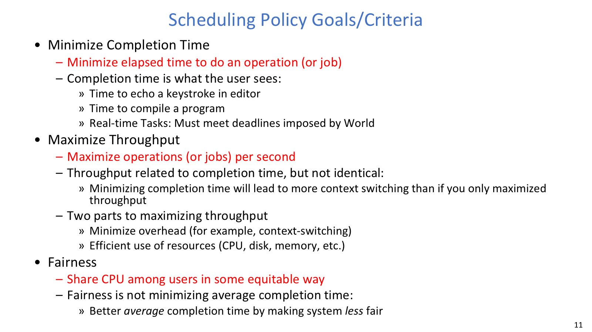
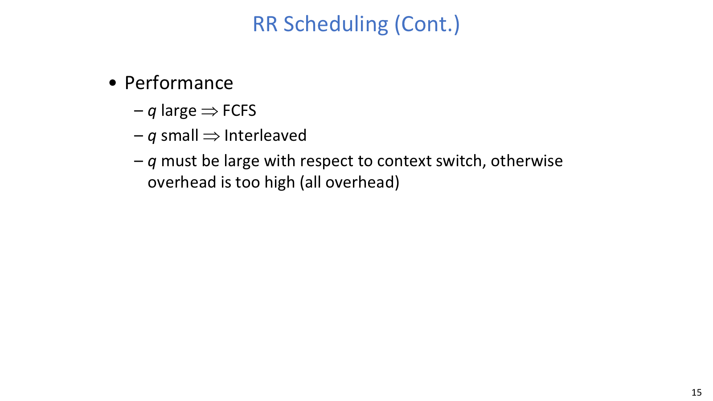
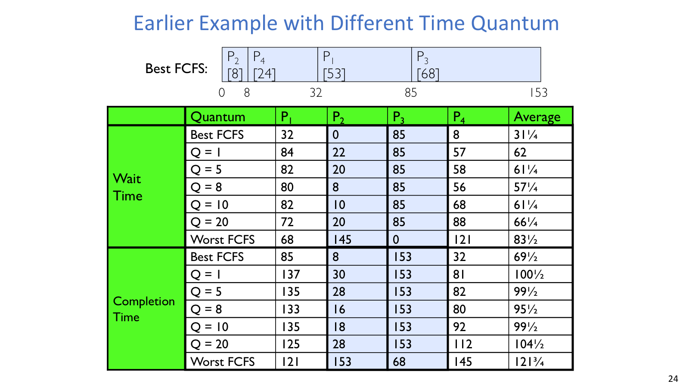
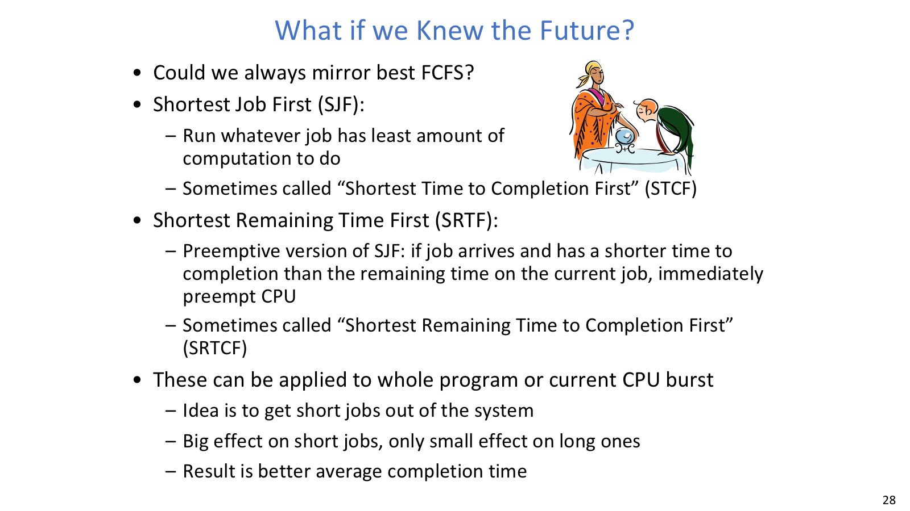

# Lecture 09: Scheduling 1 - Concepts and Classic Policies

## 导读

本讲开始进入 CPU scheduling。调度器看起来只是在 ready queue 里选下一个 runnable thread，但不同选择背后对应着完全不同的目标：有人想让任务尽快完成，有人更关心第一次响应，有人希望吞吐高，也有人要求 CPU 份额公平。

所以评价调度策略时，不能把“好”混成一个词。FCFS 简单但容易出现 head-of-line blocking；Round Robin 用时间片换交互响应，却引入切换和缓存扰动；SJF/SRTF 在平均完成时间上很漂亮，但它们依赖未来 burst 信息，也可能让长任务长期得不到机会。

## 本讲地图

| 主题 | 解决的问题 |
| --- | --- |
| 调度模型 | 定义 ready queue、CPU burst 和 I/O burst |
| 评价指标 | 说明不同策略到底在优化什么 |
| FCFS | 展示最简单策略及 head-of-line blocking |
| Round Robin | 用时间片换取交互响应和等待时间公平 |
| Priority Scheduling | 表达重要性，但引入 starvation 和 priority inversion |
| SJF/SRTF | 用短作业优先最小化平均完成时间 |

## 正文

调度不是简单地选下一个线程。不同策略会把 completion time、response time、throughput 和 fairness 放在不同位置。

### 调度问题


Ready queue 是调度器每次选择 next thread 的直接输入。

调度器的基本动作可以写成：

```c
run_new_thread() {
    if (readyThreads(TCBs)) {
        nextTCB = selectThread(TCBs);
        run(nextTCB);
    } else {
        run_idle_thread();
    }
}
```

课程一开始常做简化假设：每个程序只有一个用户，每个进程只有一个线程，进程之间独立。这些假设能让策略分析更清楚，但现实系统里并不成立。公平到底是用户之间公平，还是进程之间公平？切换进程和切换线程的开销是否相同？这些问题都会影响真实调度器。

程序也不是一直占着 CPU。大多数 workload 在 CPU burst 和 I/O burst 之间交替：计算一段，等待 I/O，再计算一段。每次调度，本质上是在决定下一段 CPU 时间给哪个 runnable task。如果策略偏好短 CPU burst，通常会改善交互响应，因为 I/O-bound 或交互任务能更快运行一点点，然后继续等待外部事件。

### 调度指标



调度目标不是单一数字，不同指标会推动不同策略。

常见指标可以先分成几类：

| 指标 | 含义 |
| --- | --- |
| Completion/Turnaround time | 从任务到达到完成经过多久 |
| Waiting time | 在 ready queue 中等待 CPU 的总时间 |
| Response time | 从到达到第一次运行经过多久 |
| Throughput | 单位时间完成多少任务 |
| Fairness | CPU 时间如何在用户或任务之间共享 |

在确定性 workload 里，最稳的做法通常是先画时间线，再填每个 job 的完成时刻、首次运行时刻和等待区间：

```text
turnaround_time = finish_time - arrival_time
waiting_time = turnaround_time - total_CPU_burst_time
response_time = first_run_time - arrival_time
throughput = completed_jobs / elapsed_time
```

这些指标不总是同向变化。减少平均完成时间可能偏向短任务，牺牲长任务公平；提高吞吐可能减少上下文切换，却让交互任务等得更久；追求等待时间公平，也可能让平均完成时间变差。因此调度策略的讨论，通常都是在说明自己愿意牺牲什么来换取什么。

### FCFS

First Come, First Serve 按到达顺序运行任务：

```c
while (!ready_queue.empty()) {
    job = ready_queue.pop_front();
    run_until_block_or_finish(job);
}
```

它的优点是简单、开销低，也容易解释。问题是 head-of-line blocking：一个短任务如果排在长任务后面，会被长时间挡住。若所有任务长度相同，FCFS 不差；但任务长度差异越大，队头长任务造成的平均完成时间损失越明显。

FCFS 也提示我们：非抢占式调度器依赖任务主动阻塞或结束。如果一个任务一直不让出 CPU，后面的任务就没有进展机会。

### Round Robin



Round Robin 的时间片决定响应时间和上下文切换开销之间的平衡。



时间片过大近似 FCFS，过小则把吞吐浪费在切换和缓存扰动上。

Round Robin 给每个任务一个最多连续运行 `q` 的时间片，用完就被 timer interrupt 抢占并放回队尾：

```c
while (!ready_queue.empty()) {
    job = ready_queue.pop_front();
    run_for_at_most(job, quantum);

    if (!job.finished && !job.blocked) {
        ready_queue.push_back(job);
    }
}
```

如果 ready queue 中有 `n` 个任务，每个任务近似不会等超过 `(n - 1)q` 就再次运行。这让 RR 很适合改善交互响应和等待时间公平。但它并不保证 average completion time 总优于 FCFS。若短任务本来排在前面，FCFS 已经能让它们快速完成；RR 反而可能把短任务切碎，让完成时间变晚。

时间片选择是 RR 的关键。`q` 无限大时，RR 退化成 FCFS；`q` 太大时，交互任务等待时间变差；`q` 太小时，上下文切换、cache/TLB 扰动和调度开销会吞掉吞吐。即使显式 context switch cost 为 0，频繁轮转也可能破坏 cache locality，让总运行时间变长。课件给出的经验范围通常是 10ms 到 100ms，但具体题目应以给定参数为准。

### Priority Scheduling

Priority scheduling 给每个 job 一个优先级，调度器总是先运行最高优先级的 runnable task。Strict priority 的规则很清楚：只要高优先级队列非空，低优先级任务就不运行。因此它能表达重要性，也天然带来低优先级 starvation 风险。

为了公平，系统可以给低优先级队列保留 CPU 份额，或对长时间没得到服务的任务做 aging。代价是平均完成时间和高优先级响应可能变差。公平不是调度策略的附属品，而是目标函数的一部分。

Priority inversion 是另一个工程风险。典型三线程场景是：低优先级线程 L 先拿到锁；高优先级线程 H 后来需要这把锁，只能等待 L；中优先级线程 M 不需要锁，却不断抢占 L，导致 L 无法释放锁，H 被间接卡住。常见修复是 priority inheritance 或 donation：临时把持锁的 L 提升到 H 的优先级，让它尽快运行并释放锁。

### SJF / SRTF



SJF/SRTF 的优势来自让短任务尽快离开系统。

Shortest Job First 在非抢占场景下选择总计算量最短的 job；Shortest Remaining Time First 是抢占式版本，选择剩余时间最短的 job，新来的短任务可以抢占当前长任务。

```c
// non-preemptive SJF
job = argmin(ready_queue, job.total_burst_time);
run_until_block_or_finish(job);

// preemptive SRTF
on_job_arrival_or_timer_interrupt() {
    job = argmin(ready_queue, job.remaining_time);
    run(job);
}
```

它们的直觉很强：尽快让短任务离开系统，减少短任务被长任务挡住的等待时间。因此在课件模型中，SJF 最小化非抢占场景的 average completion time，SRTF 最小化抢占场景的 average completion time。如果所有 job 长度相同，SJF/SRTF 与 FCFS 差别不大；长度差异越大，SRTF 越能避免 head-of-line blocking。

现实问题是未来不可知。系统通常不知道 job 总长度或下一段 CPU burst，只能用历史估计、用户提示或后续的 MLFQ 之类反馈策略近似。另一个代价是长任务可能被源源不断的短任务推迟，产生 starvation。

### 小结

没有单一最优调度器。FCFS 简单但怕长任务挡路；RR 改善响应但牺牲一部分 cache locality 和吞吐；priority 表达重要性但要处理饥饿和反转；SJF/SRTF 优化平均完成时间但依赖预测且不公平。真实系统通常混合这些策略，并根据 workload、硬件成本和公平目标做折中。
