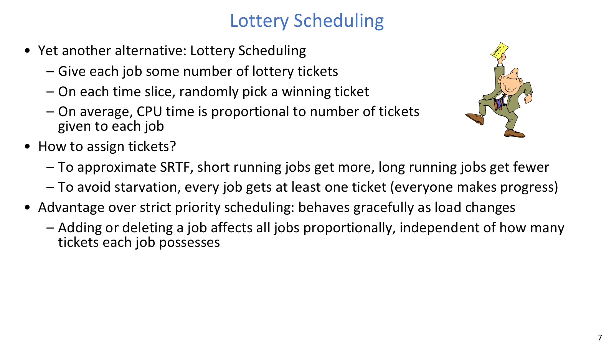
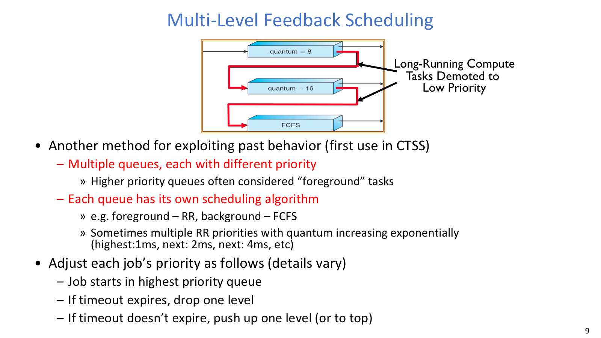
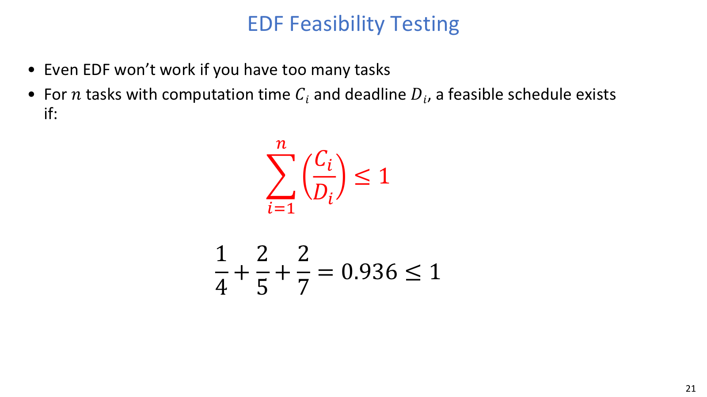
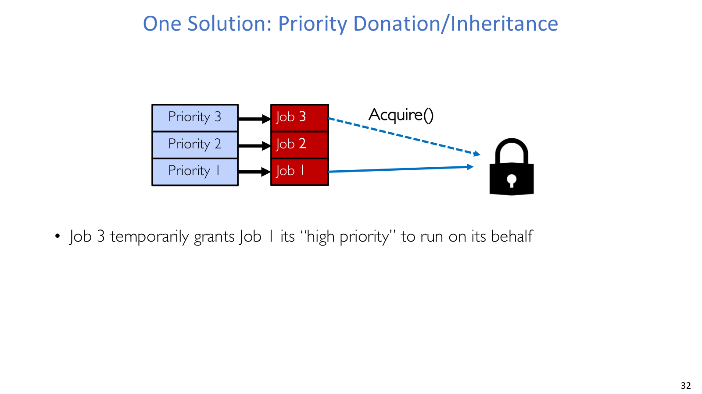
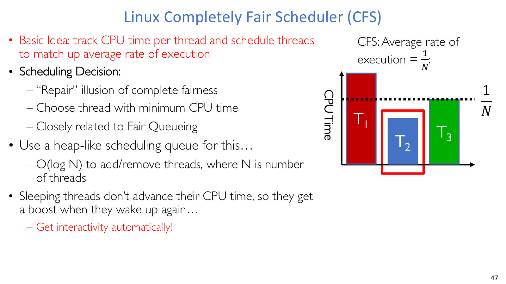

# Lecture 10: Scheduling 2 - Fairness, Real Time, and Linux Schedulers

## 导读

上一讲讨论了 FCFS、RR、priority、SJF/SRTF 这些经典策略，本讲开始把它们放回更接近真实系统的环境里。调度器不知道未来，只能从历史行为中估计；它还要面对多核 cache 成本、同步等待、deadline，以及系统是否真的在 forward progress。

Lottery scheduling 用概率表达 proportional share，MLFQ 用反馈近似短任务优先和交互优先。实时调度关心的不是平均更快，而是 deadline 和最坏响应时间能不能被预测。最后的 Linux O(1) scheduler 与 CFS，则展示了现实调度器如何从大量经验规则逐步走向基于 `vruntime` 的加权公平。

## 本讲地图

| 主题 | 解决的问题 |
| --- | --- |
| Adaptive scheduling | 用过去行为估计未来 CPU burst |
| Lottery scheduling | 用票数表达长期 CPU 份额 |
| MLFQ | 通过多级反馈识别交互任务和 CPU-bound 任务 |
| 多核调度 | 处理 cache affinity、per-core queue 和并行程序协同 |
| Real-time scheduling | 为 deadline 和最坏响应时间提供可预测性 |
| Forward progress | 区分 starvation、deadlock、priority inversion |
| Linux O(1) / CFS | 看现实调度器如何折中公平、延迟和吞吐 |

## 正文

更真实的调度器不能假装自己知道未来，只能用历史行为、概率份额、多核局部性和实时约束来做近似。

### Adaptive Scheduling

SJF/SRTF 的问题是需要知道未来 job length 或 CPU burst length。现实系统不知道未来，只能利用过去行为做估计。一个常见形式是指数平滑：

```text
tau_(n+1) = alpha * t_n + (1 - alpha) * tau_n
```

其中 `t_n` 是刚观察到的 burst，`tau_n` 是旧估计。直觉是程序行为通常有一定稳定性：过去经常 I/O block 的任务，将来也可能继续短 burst；过去持续计算的任务，将来也更像 CPU-bound。如果程序行为完全随机，反馈调度就没有信息可用。

现代调度器的很多机制都建立在这个折中上：不追求知道未来，而是把历史行为变成优先级、时间片或 CPU 份额。换句话说，adaptive scheduling 不是预言未来，而是在“过去大概率会延续一点点”这个假设上做工程近似。

### Lottery Scheduling



Lottery scheduling 把 CPU 份额变成抽票概率，而不是固定优先级边界。

Lottery scheduling 给每个任务一些 tickets。每个时间片抽一张中奖票，持有该票的任务运行。长期平均看，任务获得的 CPU 份额约等于：

```text
job_tickets / total_tickets
```

票数可以表达策略。短任务或重要任务给更多票，长任务给少一些票，就能概率性近似 SRTF 或 priority。每个 job 至少保留一张票，可以避免 strict priority 那种绝对饿死；但这不保证短任务一定快完成，负载过高时所有任务都会变慢。

相比固定优先级，Lottery 的一个优点是负载变化更平滑。新增或删除任务会按比例影响所有任务，而不是突然跨过某个优先级边界。它适合表达 proportional share，但不适合需要严格 deadline 保证的场景。

### MLFQ



MLFQ 用多级队列和反馈规则近似“短任务/交互任务优先”。

Multi-Level Feedback Queue 使用多个优先级队列，每个队列可以有自己的时间片和内部策略。任务通常从最高优先级开始；如果用完整个时间片，说明更像 CPU-bound，就降低优先级；如果经常提前阻塞、睡眠或等待 I/O，说明更像交互任务，就留在高优先级或被提升。

这让 MLFQ 不用提前知道 job 长度，也能近似 SRTF：短 CPU burst 的任务靠近高优先级，长期占用 CPU 的任务逐步下沉。队列内部常用 RR，低优先队列可以给更长时间片；队列之间可以 strict priority，也可以按比例分配 CPU。

MLFQ 的风险是 gaming。程序可以故意在时间片快用完前 `yield`、sleep 或做无意义 I/O，让调度器误以为它是交互任务。常见反制包括统计累计 CPU 使用而不只看单次是否用完整片、周期性 priority boost、防止任务永远停在高优先级。

“短 burst = 交互任务”只是经验规则。同一应用可能先睡很久再大量计算，也可能是必须周期运行的后台任务。调度器只能在交互、吞吐和可预测性之间不断校准。

### 多核调度

多核调度在策略层和单核类似，工程层却多了不少成本。Cache affinity 是其中一个核心词：线程最好回到上次运行的 CPU，复用 warm cache，减少跨核迁移和 cache coherence 成本。Per-core run queue 能降低全局队列锁竞争，但会带来负载均衡问题；某个 core 空闲时，可能需要从其他 core 偷任务。

锁的等待策略在多核上也要重看。自旋锁在短等待时可能比睡眠好，尤其在 barrier 附近只差最后几个线程；等待较长时仍应睡眠。基础 `test_and_set` 每次尝试都是写，会让同一个 cache line 在多个 core 之间 ping-pong。`test_and_test_and_set` 先普通读，看到可能空闲时再执行原子写，可以减少无意义写争用。

并行程序还需要协同调度。Gang scheduling 尽量让相关线程一起运行，避免某个线程 spin-wait 等待一个已经被 OS 挂起的伙伴。Scheduler activations 则让 OS 告知应用当前可用核心数，应用据此调整并行度。这里调度的不只是“线程还是进程”，还包括空间共享、缓存局部性和同步等待的总成本。

### Real-Time



实时调度中，deadline 可行性比平均响应更重要。

实时系统的目标是性能可预测，尤其是最坏情况响应时间。Hard real-time 用在安全关键系统中，deadline 必须满足，通常需要 admission control：只有系统能提前判断任务可完成，才允许任务进入。Soft real-time 常见于多媒体场景，目标是高概率满足 deadline。

典型算法包括 EDF、RMS 和 DM。EDF, Earliest Deadline First, 每次选择 absolute deadline 最近的 active task。课程模型中常见可行性测试是：

```text
sum(C_i / D_i) <= 1
```

其中 `C_i` 是任务每次释放需要的 CPU 计算时间，`D_i` 是相对 deadline。直觉是所有周期任务要求的 CPU 利用率总和不能超过 100%。这个公式不是现实世界所有实时任务的万能判定；在课程语境中，通常默认任务独立、可抢占，并满足题设里的 period/deadline 条件。

实时调度和普通吞吐调度的差别在目标函数。普通系统可以先运行再观察平均表现；实时系统需要在运行前证明或高度确信 deadline 能满足。

### Forward Progress



Priority donation 用临时提升持锁者优先级来缓解 priority inversion。

Forward progress 关心系统是否真的在推进。Starvation、deadlock 和 priority inversion 很容易混在一起，但它们不同：

| 现象 | 特征 |
| --- | --- |
| Starvation | 某线程长期没有进展，系统整体可能仍在处理别的线程 |
| Deadlock | 线程之间形成资源循环等待，大家都无法继续 |
| Priority inversion | 高优先级线程等待低优先级线程持有的锁，中优先级线程可能间接阻止释放 |

Strict priority、LCFS、SRTF/MLFQ 下短任务不断到来，都可能造成 starvation。Deadlock 的关键是资源循环等待。Priority inversion 的经典场景是低优先级 L 持锁，高优先级 H 等锁，中优先级 M 不需要锁却不断抢占 L，导致 H 间接停住。

Priority donation 或 inheritance 的目标是让持锁的低优先级线程临时继承高优先级，尽快释放锁。代价是实现复杂、调度行为更难预测。它提醒我们：调度策略和锁策略不能分开看，否则系统可能“看起来有线程在运行”，但关键任务没有推进。

### O(1) Scheduler

Linux O(1) scheduler 的名字来自选择下一个任务的时间与 runnable task 数量无关。它维护 140 个优先级队列，并用 bitmap 快速找到当前最高优先级的非空队列。优先级数字越小越高：`0-99` 是实时/内核范围，`100-139` 是普通用户任务范围。

它有 active 和 expired 两组队列。Active 中任务用完时间片后进入 expired；active 空了，两组交换。这避免同一轮里某些任务无限重复运行。同一优先级内部通常 RR，不同优先级有不同 timeslice，nice 值会映射到普通任务的优先级和时间片。

O(1) scheduler 也使用大量 heuristic：`sleep_avg`、interactive credit、I/O-bound 奖励、starvation 保护。睡得久、经常等待 I/O 的任务更像交互任务，会得到优先级奖励；跑得久的 CPU-bound 任务则可能被压低。它很工程化，也因此规则多、调参多。

### CFS



CFS 用 `vruntime` 和权重把公平调度落到数据结构上。

Completely Fair Scheduler 试图少猜“谁是交互任务”，转而直接记录每个 runnable task 已经用了多少 CPU。核心变量是 `vruntime`，可以理解成按权重归一化后的已用 CPU 时间。实际运行越多，`vruntime` 越大；权重越高，同样实际运行时间增加的 `vruntime` 越慢。

CFS 选择红黑树中 `vruntime` 最小的 runnable task，也就是当前“相对最没被服务”的任务；插入和删除是 `O(log n)`。睡眠线程睡着时不增加 `vruntime`，醒来后相对落后，因此自然获得一定交互性 boost；实现上也会防止落后太多导致过度补偿。相比 O(1) scheduler，CFS 的味道更像把公平目标直接落到数据结构和权重公式上。

两个约束让 CFS 不只是纯公平公式。Target latency 希望在一段固定时间内每个 runnable task 至少运行一次；minimum granularity 防止任务太多时每个时间片小到上下文切换开销爆炸。等权时可以近似理解为：

```text
Q_i = Target Latency / N
```

带权重时：

```text
Q_i = (w_i / sum(w_p)) * Target Latency
```

nice 在 CFS 中主要映射为权重：nice 越低，权重越大，获得的 CPU 份额越高。它不是简单的固定优先级，而是 proportional share。

### 评估调度器

评估调度算法可以用确定性建模、排队模型或真实实现。确定性建模给定 workload，手算各策略指标；排队模型用数学分布分析随机 workload；真实实现则在实际系统和实际数据上测量。

调度策略在资源不紧张时差别可能不明显，一旦利用率接近饱和，响应时间会在 knee 附近急剧变坏。真正的系统设计不等到 100% 利用率才关心调度，而是在接近饱和前就要考虑公平、延迟、吞吐和可预测性的折中。
