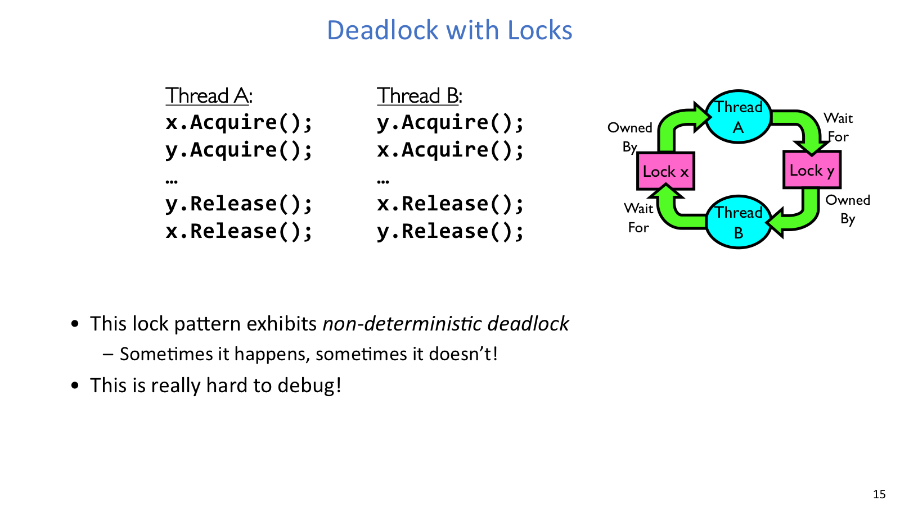
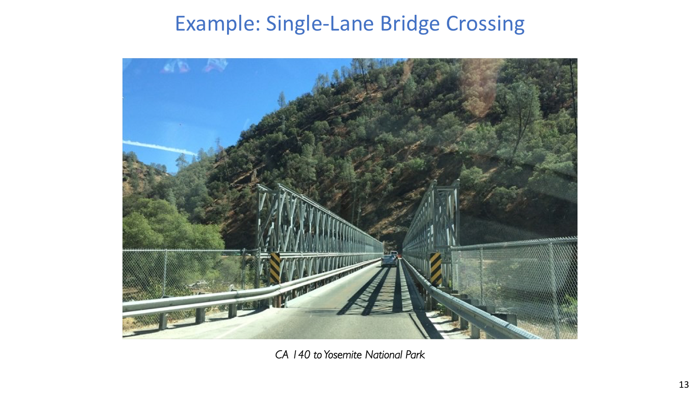
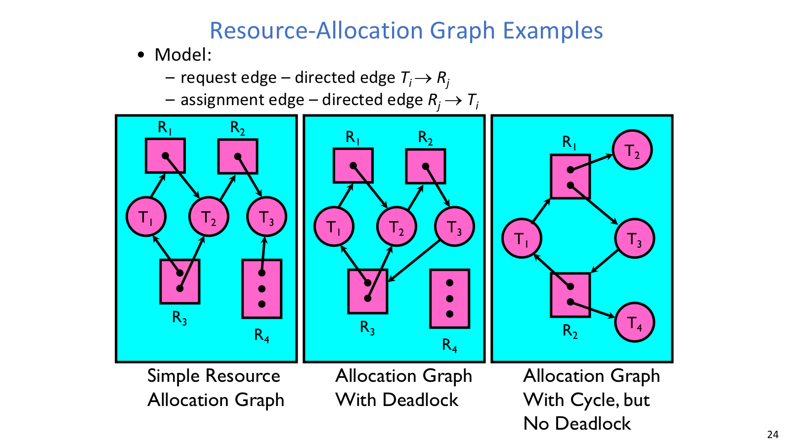
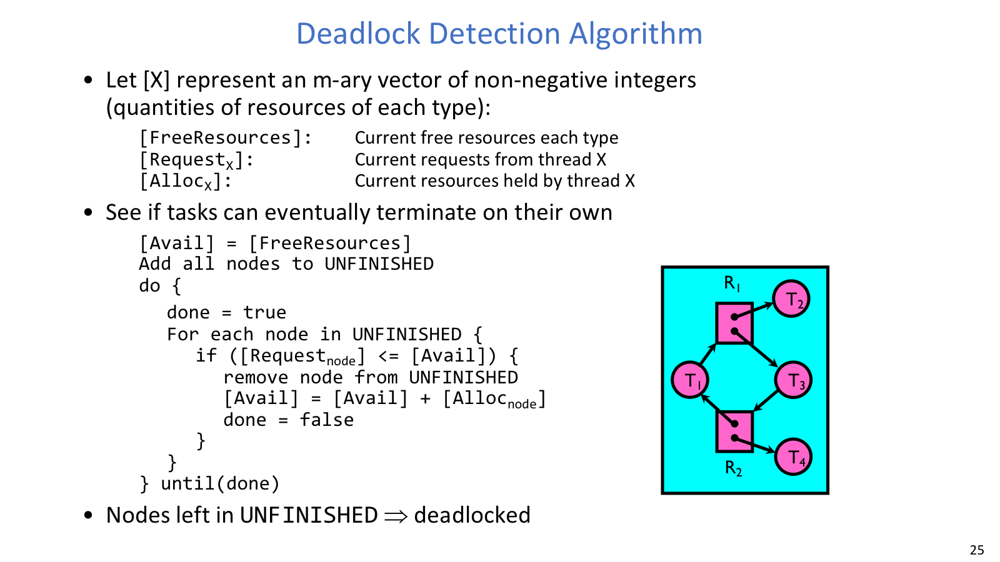
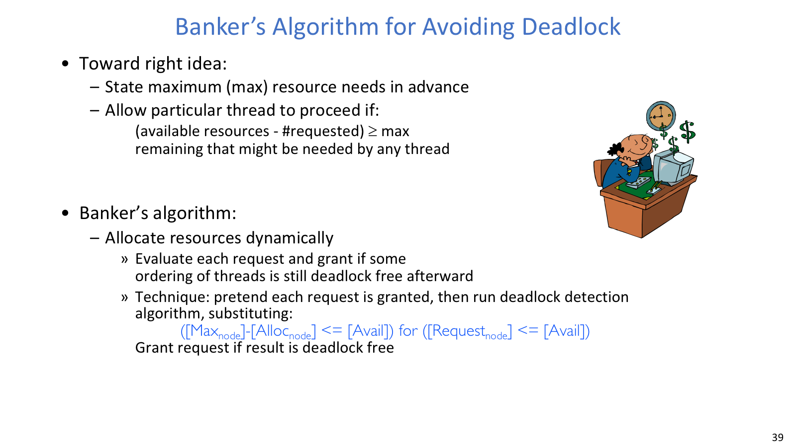

## 前向进展

### 问题

starvation 是线程长期没有进展，deadlock 是一种更强的 starvation：线程之间形成循环等待，并且在没有外部干预时无法自行解除。严格优先级、LCFS、SRTF/MLFQ 的某些负载形态都可能让低优先级或长任务饥饿；RR 通常在等待时间上更公平，但不一定优化吞吐或平均完成时间。

priority inversion 则是另一类前向进展问题。低优先级线程持有锁，高优先级线程等待这个锁，中优先级线程又不断抢占低优先级线程，最后的效果是高优先级线程反而被间接压住。常见修复是 priority donation / inheritance：让持锁的低优先级线程临时继承高优先级线程的优先级，尽快跑完临界区并释放资源。

### 机制

分析死锁时，第一步不是急着套算法，而是说清楚“谁持有什么资源、又在等谁释放”。例如单行桥上，每辆车所在路段是已经占有的资源，下一段路是正在请求的资源；如果两边车辆都进入桥上，就可能互相等待。哲学家/律师吃饭问题也是同一结构：每个人拿到一根筷子，同时等待另一根筷子，系统中没有人能继续完成。

双锁代码的经典例子是：

```text
Thread A: x.Acquire(); y.Acquire(); ... y.Release(); x.Release();
Thread B: y.Acquire(); x.Acquire(); ... x.Release(); y.Release();
```

这段代码不保证每次死锁。如果 A 连续拿到 `x` 和 `y`，它可以顺利释放；但如果 A 先拿到 `x`，B 先拿到 `y`，随后 A 等 `y`、B 等 `x`，等待环就出现了。因此分析这类题时要写出会卡住的 interleaving，而不是只看单线程顺序。

## 四个条件



双锁交叉获取展示了代码本身不一定每次死锁，但某个 interleaving 会形成等待环。

死锁发生需要四个必要条件同时成立。它们不是四种死锁，而是同一个等待局面里的四个侧面：

| 条件 | 含义 |
| --- | --- |
| Mutual exclusion | 一个资源同一时间只能被一个线程使用 |
| Hold and wait | 线程已经持有至少一个资源，同时还在等待其他资源 |
| No preemption | 资源不能被系统强行夺走，只能由持有者释放 |
| Circular wait | 一组线程形成首尾相接的等待环 |

因此，预防死锁的基本思想就是破坏其中一个条件。例如一次性申请所有资源可以破坏 hold-and-wait，但会降低并发度并要求线程提前知道未来需求；全局锁顺序可以破坏 circular wait，例如所有线程都先拿 `x` 再拿 `y`。

## 资源图



单行桥把“每一段路都是资源”的直觉讲得很清楚，是后面循环等待和恢复策略的入口。



资源分配图是从直觉例子过渡到形式化检测的关键表示。

### 机制

Resource Allocation Graph 把前面的直觉画成图。图里有两类节点：线程节点 `T_i` 和资源类型节点 `R_j`。`T_i -> R_j` 是 request edge，表示线程正在请求资源；`R_j -> T_i` 是 assignment edge，表示某个资源实例已经分配给线程。

如果每种资源只有一个实例，图中出现 cycle 就意味着 deadlock。环上的每个线程都在等待下一个资源，而这些资源都由环中其他线程持有，没有任何一个线程能先完成。

如果某种资源有多个实例，cycle 只是危险信号，不一定已经死锁。原因是环外线程或同类资源的其他实例可能先完成并释放资源，让环中的某个请求得到满足。多实例场景需要进一步使用向量化的检测算法。

### 例子

Dining Lawyers 可以有两种建模方式。若把 5 根筷子看成同类资源 `[5]`，当 5 个 lawyer 各持有 1 根且各请求 1 根时，`Available = [0]`，没有人的请求能被满足，所有人都留在未完成集合里。若把 5 根筷子看成不同资源 `[1,1,1,1,1]`，每个人持有左边筷子并请求右边筷子，资源分配图中形成明确循环，向量检测同样无法推进。

## 检测算法



检测算法把“谁还能完成”转化成 `Available/Request/Allocation` 的迭代消元。

### 机制

检测算法回答的是：在当前状态下，不再发新请求，只看已经存在的请求，系统能否找到一个顺序让所有线程完成？

设系统有 `m` 类资源：

```text
Available = 当前空闲资源向量
Request_i = 线程 i 当前还在请求的资源向量
Allocation_i = 线程 i 已经持有的资源向量
UNFINISHED = 所有线程

重复：
  找一个满足 Request_i <= Available 的线程 i
  若找到，认为它最终可完成：
    Available = Available + Allocation_i
    从 UNFINISHED 移除 i
  若一整轮都找不到，停止

停止后仍在 UNFINISHED 中的线程就是死锁相关线程。
```

### 例子

哲学家吃饭的单类资源版中，`Available = [0]`，每个哲学家的 `Allocation_i = [1]`，`Request_i = [1]`。因为所有请求都大于当前可用资源，没有任何线程能先完成，检测算法判定死锁。

有环但不死锁的情形也很重要。假设资源类型 `R` 有多个实例，图里可能有 `T1 -> R -> T2 -> R -> T1` 这样的环；如果环外还有线程将释放一个 `R` 实例，系统仍可继续推进。图上的 cycle 只是提醒我们进入向量检测。

## 处理策略

### 机制

Deadlock prevention 是在设计上让四条件之一永远不成立。常见做法包括一次性原子申请多个资源、规定全局资源获取顺序、或用虚拟化制造“近似无限”的资源视图。它的代价也很直接：并发度下降、资源估计困难，或系统复杂度上升。

Deadlock recovery 是允许死锁发生，再终止线程、抢占资源或回滚事务。它在数据库事务里常见，但操作系统内核不喜欢随意杀掉持锁线程，因为共享数据可能已处于不一致状态。

Deadlock avoidance 介于二者之间：系统不要求从设计上彻底消灭死锁条件，而是在运行时延迟或拒绝某些请求，保持系统不进入 unsafe state。Banker 算法属于这一类。

Deadlock denial，也叫 Ostrich Algorithm，是低概率场景下选择忽略，出问题时重启应用或系统。它不是理论上优雅的方案，但在某些工程场景中确实可能是成本最低的选择。

## Banker 算法



Banker 算法用最大需求 `Max` 和当前分配 `Allocation` 推出 `Need`，提前拒绝会进入 unsafe state 的请求。

### 问题

检测算法是事后问“现在是否已经死锁”。Banker 算法是事前问“如果现在批准这个请求，系统是否仍然安全”。它依赖一个强前提：每个线程必须提前声明最大资源需求。

### 机制

Banker 算法维护的状态比检测算法多一层最大需求：

```text
Available
Max_i
Allocation_i
Need_i = Max_i - Allocation_i
```

当线程提出 `Request_i` 时，系统先检查请求是否没有超过声明需求，也没有超过当前可用资源：

```text
Request_i <= Need_i
Request_i <= Available
```

若基本条件通过，再进行试分配：

```text
Available = Available - Request_i
Allocation_i = Allocation_i + Request_i
Need_i = Need_i - Request_i
```

随后运行安全性检查：能否反复找到某个 `Need_i <= Available` 的线程，让它完成并释放 `Allocation_i`。如果这个过程能覆盖所有线程，请求被批准；否则回滚试分配并让线程等待。

### 例子 / 推导

Dining Lawyers 中，如果 5 根筷子是同类资源，每个 lawyer 最大需求是 2 根。当 4 个 lawyer 各拿 1 根，系统还剩 1 根时，状态仍然安全，因为可以让某个已持有 1 根的人再拿 1 根，吃完后释放 2 根，资源继续流动。

但如果批准第 5 个 lawyer 拿最后 1 根，系统会变成 5 个人都 `Allocation = [1]`、`Need = [1]`、`Available = [0]`。此时没有任何人能完成，系统进入 unsafe state。注意它还不一定已经 deadlock，但已经没有可证明安全的完成顺序，所以 Banker 必须拒绝这次请求。

### 取舍

Banker 的价值在于提前拦截危险请求，但它也保守：为了避免 unsafe state，可能拒绝一些实际运行中未必会导致死锁的请求。它还要求最大需求可预知，这在通用 OS 中很难，在数据库或受控资源管理器中更可行。
