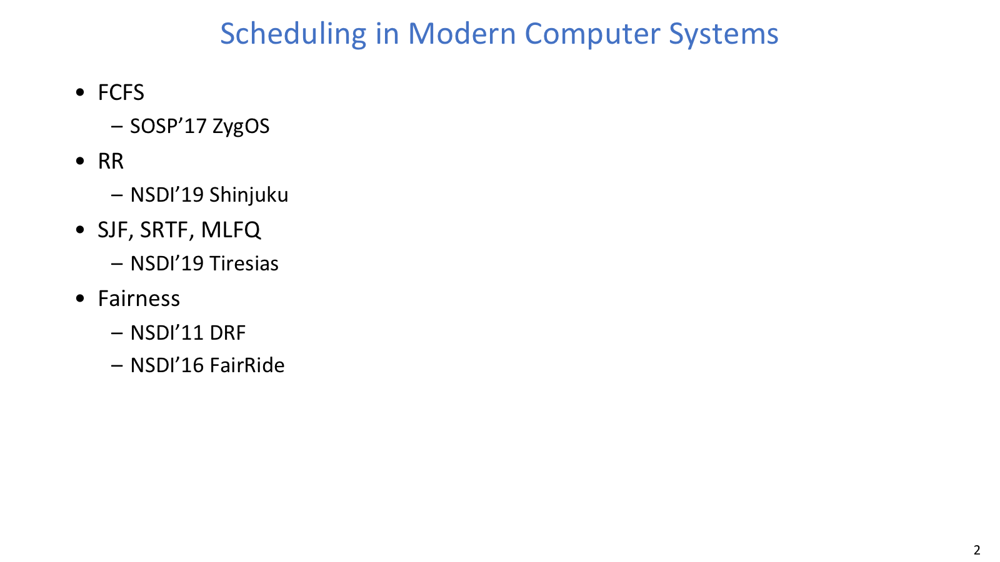
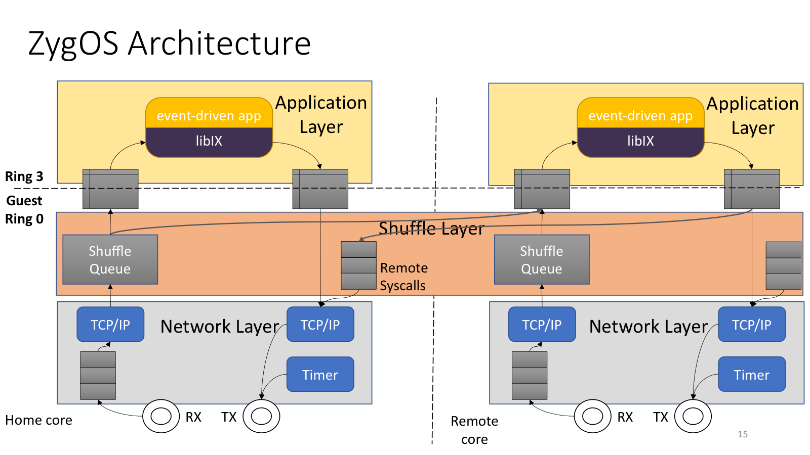
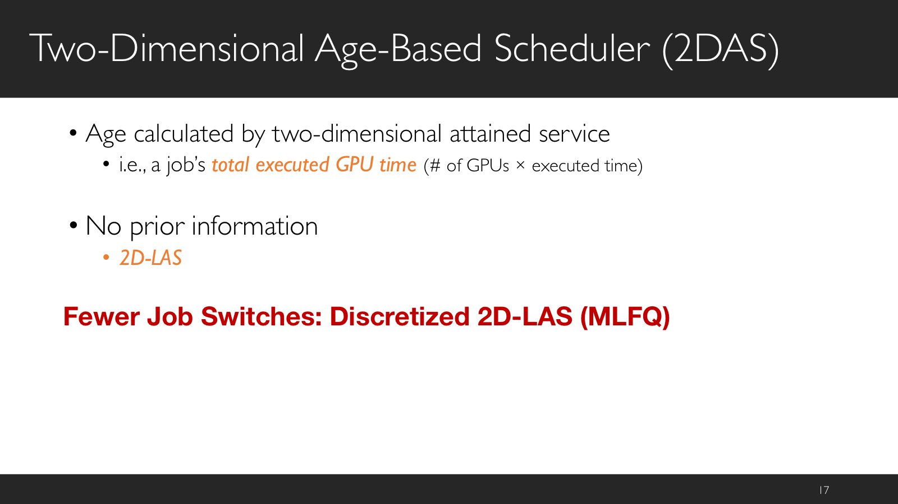
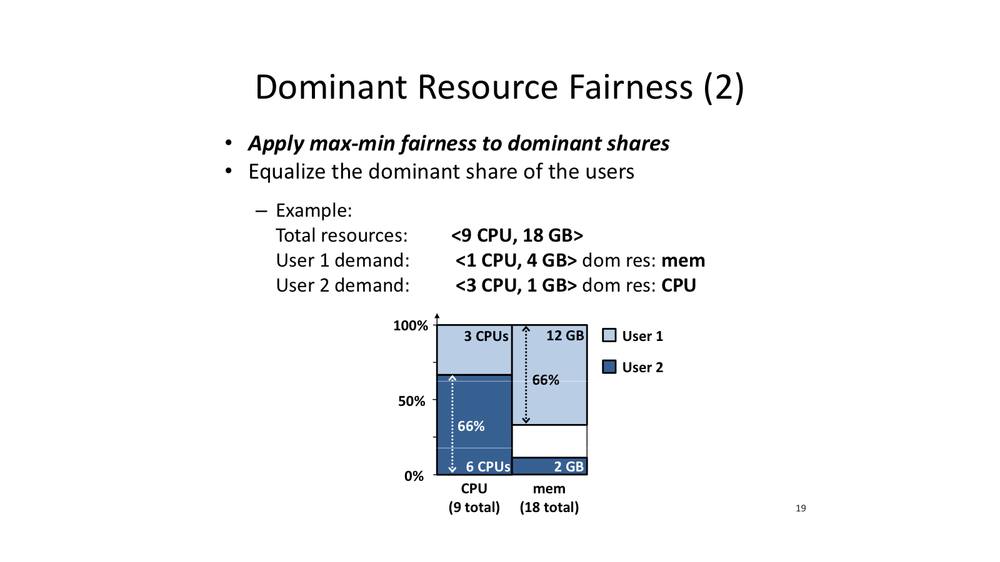
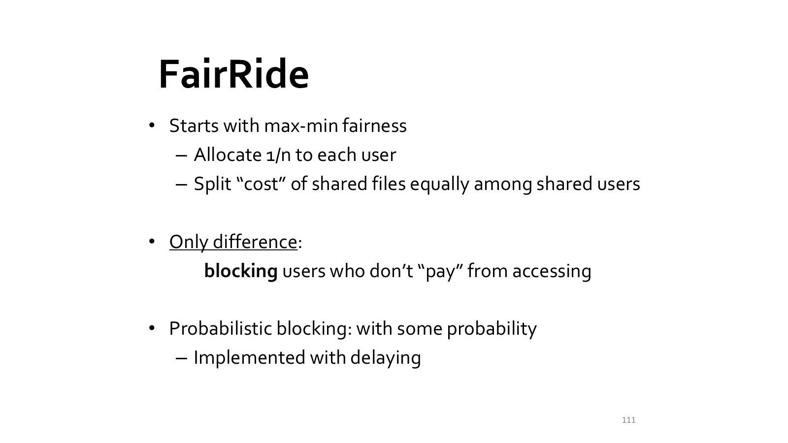

# Lecture 12: Scheduling in Modern Computer Systems

## 导读

本讲把 FCFS、RR、SJF/SRTF/MLFQ 和公平性这些经典调度思想放进现代系统里重新理解。现代调度已经不只是在 CPU 上排队，还会牵涉 tail latency、JCT、GPU 利用率、多资源公平，以及用户是否会通过策略性行为占便宜。

Lecture 12 最适合按“论文/系统”来读：每篇论文都可以看成一个经典调度思想在新约束下的变形。原始课件实际展开了 ZygOS、Tiresias、DRF 和 FairRide；Shinjuku 在目录中出现，笔记中保留它与 RR / processor sharing 的联系，作为微秒级抢占调度的参照点。

## 本讲地图

| 经典思想 | 现代系统 | 主要问题 | 关键机制 |
| --- | --- | --- | --- |
| FCFS / queueing | ZygOS | 微秒级 RPC 的 99th tail latency 与吞吐 | dataplane + work stealing，逼近 single queue |
| RR / processor sharing | Shinjuku | run-to-completion 让短请求被长请求挡住 | 微秒级抢占、专用调度核、快速上下文切换 |
| SJF / SRTF / MLFQ | Tiresias | GPU 训练任务长度未知，平均 JCT 高 | 2D attained service、离散化 2DAS、模型驱动放置 |
| Max-min fairness | DRF | 多资源需求异构，一维公平不够 | dominant resource / dominant share |
| 公平 + 抗策略 | FairRide | 共享缓存中用户可能作弊 | share guarantee + probabilistic blocking |

## 正文

这一组论文可以按“经典调度思想在现代系统里怎么变形”来读。先看旧策略哪里不够，再看系统在哪一层重写机制。

### 读论文



目录页把本讲所有系统论文和经典调度思想对应起来，是整讲的阅读索引。

#### 问题

系统论文很容易让人陷入实现细节。本讲更适合用“经典策略在现代约束下如何改造”的视角阅读：先判断旧方法哪里不够，再看论文用什么机制修正，再回头看它改善了哪个指标。

#### 机制

第一遍可以只读 Title、Abstract、Introduction、Conclusion 和小节标题，回答 five C's：`Category`、`Context`、`Correctness`、`Contributions`、`Clarity`。这一遍的目的不是复现系统，而是判断论文属于什么问题，以及是否值得深读。

第二遍再抓主线：problem、motivation、design、evaluation、limitation。系统论文的核心经常藏在架构图和请求流里：请求从哪里进来，排在哪个队列，调度器如何做决策，瓶颈在哪里。

第三遍是假装自己要复现系统：沿着论文假设重新推导设计选择，挑战 workload、硬件和 SLO 变化后的结论，并整理“创新点 + 失败边界”。

### ZygOS



ZygOS 的架构图展示了每核 dataplane 和跨核 work stealing 如何合在一起。

#### 问题

KV store、内存数据库和 leaf service 中，RPC 服务时间可到微秒级。系统目标不是单纯提高平均吞吐，而是在激进的 99th tail-latency SLO 下承受更高 load。fan-out/fan-in 会把单个 leaf 的尾延迟放大成整体请求的 tail-at-scale 问题。

#### 机制

传统 single queue 理论上更 work-conserving：只要系统还有请求、还有空闲 worker，空闲 worker 就能拿到活，瞬时负载不均衡小。但 centralized queue 需要共享队列，同步开销高，放到微秒级 RPC 里会直接吃掉延迟预算。

dataplane 系统走的是另一条路：路径短、同步少、cache/coherence 开销低，但通常采用每核队列，可能 not work-conserving。换句话说，某个 worker 的队列已经很忙，另一个 worker 却仍然空闲。

ZygOS 的折中是保留 dataplane 风格的 share-nothing 网络处理，同时通过 work stealing 让空闲核从繁忙核偷 ready connection，逼近 single queue 行为。它的结构可以分成三层：

| 层次 | 作用 |
| --- | --- |
| Application layer | 事件驱动应用，对 stealing 透明 |
| Shuffle layer | 每核 ready queue，支持跨核窃取 |
| Network layer | 尽量减少同步、coherence 和网络路径开销 |

#### 取舍

ZygOS 的贡献不是“简单回到单队列”，而是承认 centralized queue 和 dataplane 各有代价。课件中的 Silo TPC-C 结果显示，相比 Linux，吞吐约提升 `1.63x`，99 分位延迟约降低 `3.68x`。这说明低开销路径与近似 single queue 的 work conservation 可以同时服务 tail latency 和吞吐。

### Shinjuku

#### 问题

Shinjuku 的背景是微秒级低延迟服务中，请求分布可能非常偏：绝大多数请求很短，少数请求很长。run-to-completion 或 FCFS 一旦让短请求排在长请求后面，p99 / p99.9 latency 就会被少量长请求显著拖高。

#### 机制

它可以看成 RR / processor sharing 思想在微秒级系统中的工程化：目标不是传统毫秒级时间片公平轮转，而是在低开销用户态路径中实现足够细粒度的 preemption。核心机制包括 single address-space OS、dedicated scheduling core、硬件虚拟化辅助快速抢占，以及用户态快速上下文切换。

#### 取舍

Shinjuku 与 ZygOS 的差别是：ZygOS 主要解决队列组织和 work conservation，Shinjuku 主要解决长请求压住短请求。普通 Linux 式抢占的路径和调度粒度太重，所以它必须围绕微秒级 workload 重新设计调度环境。

### Tiresias



Tiresias 用 `#GPUs * executed time` 定义二维 age，把 LAS/MLFQ 思想搬到 GPU 集群。

#### 问题

深度学习训练任务大量增长后，GPU 集群调度的目标是降低平均 JCT，同时保持 GPU 利用率。难点有两个：训练时长难以准确预测；过度 consolidation 会造成资源碎片、排队时延和网络热点。

#### 机制

Tiresias 先把调度和放置拆开。调度决定队列中谁先跑，放置决定 job 真正落到哪些 GPU 或机器上：

| 决策 | 问题 | 机制 |
| --- | --- | --- |
| Scheduling | 队列中先跑谁 | 用二维 attained service 近似短任务优先 |
| Placement | 放在哪些 GPU/机器上 | 根据 model profile 判断是否需要 consolidation |

二维 age 定义为：

```text
age = #GPUs * executed time
```

无完整先验时，`2D-LAS` 优先服务已获得服务少的 job，从而保护短 job，获得接近 SRTF 的收益；离散化后行为像 MLFQ，可以减少频繁 job switches。有部分分布信息时，可切换到 `2D-Gittins` 风格。

#### 取舍

把一个 job 尽量放在同一台机器可能减少跨机通信，但所有 job 都过度集中会制造碎片和排队。Tiresias 的 model profile-based placement 用 tensor size 等模型特征判断是否值得 consolidation。课件给出的结果是：60-GPU 测试床相对 YARN-CS 平均 JCT 改善约 `5.5x`，2000-GPU trace 仿真相对 Gandiva 平均 JCT 改善约 `2x`。

### DRF



DRF 示例说明公平对象不是资源总和，而是每个用户的 dominant share。

#### 问题

单资源 max-min fairness 很直观：每个用户获得公平份额。但数据中心作业的需求往往是向量化的，例如 CPU、内存、磁盘和 I/O。只看一个资源时，CPU-intensive 和 memory-intensive 用户之间到底谁更“占便宜”会变得模糊。

#### 机制

DRF 的做法是先把每个用户最紧张的资源找出来，再围绕这个瓶颈资源比较公平性。它定义两个核心概念：

| 概念 | 含义 |
| --- | --- |
| dominant resource | 用户当前占比最高的资源类型 |
| dominant share | 用户在 dominant resource 上的资源占比 |

DRF 对所有用户的 dominant share 做 max-min fairness。计算例子流程是：先算每个用户在每种资源上的占比，再取最大占比作为 dominant share，分配时优先照顾 dominant share 最小的用户，直到某些用户被拉齐或资源耗尽。

#### 例子

课件示例中，总资源是 `<9 CPU, 18 GB>`。用户 1 的任务需求是 `<1 CPU, 4 GB>`，主导资源是内存；用户 2 的任务需求是 `<3 CPU, 1 GB>`，主导资源是 CPU。DRF 不把资源份额简单相加，而是让二者在各自瓶颈资源上的 dominant share 达到同层公平。

#### 取舍

Asset fairness 看起来资源总和相等，但可能让某个用户在真正瓶颈资源上吃亏。CEEI 等市场思路可能提高利用率，但课件重点强调 DRF 的 share guarantee 和 strategy-proofness。

### FairRide



FairRide 从 max-min fairness 出发，通过 blocking/delaying 抑制不付成本的策略性访问。

#### 问题

传统 `LRU/LFU` 优化全局命中率，可能让某些用户拿到很小缓存份额，也容易被 spurious access 等策略性行为利用。FairRide 关注的是共享缓存中的三目标冲突：isolation/share guarantee、strategy-proofness、Pareto efficiency。

#### 机制

课件给出的核心结论是三者无法同时完全满足。FairRide 从 max-min fairness 出发，先给每个用户 share guarantee，再对共享文件的访问成本进行分摊。如果用户不付出对应成本却想访问共享文件，系统就通过 blocking 或 delaying 让它不能无偿占用资源。

概率阻断公式是：

```text
p(n_j) = 1 / (n_j + 1)
```

其中 `n_j` 是共享该文件的其他用户数。例如 `p(1)=50%`，`p(4)=20%`。

#### 取舍

deterministic blocking 的直觉是让 cheating always gives worst performance，从而降低策略性访问收益；probabilistic blocking 可以减少无谓阻塞，但阻塞太少又不能防作弊。FairRide 的定位是 near-optimal：在 fairness / strategy-proofness 和效率之间做折中。

### 迁移到现代系统

现代系统并没有抛弃经典算法，而是把它们放进新的约束里重写：

| 经典思想 | 现代化后的关键变化 |
| --- | --- |
| FCFS | 从单 CPU 队列变成低开销 dataplane 与近似 single queue 的折中 |
| RR | 从时间片公平变成微秒级 preemption 保护短请求 tail latency |
| SJF/SRTF | 从已知 job length 变成未知长度下的 attained service |
| MLFQ | 从 CPU 反馈队列变成 GPU 集群中的离散化二维年龄队列 |
| Fairness | 从一维资源份额变成 dominant share 与 strategy-proofness |

因此，读系统论文时最有用的问题是：旧策略保留了哪个思想，现实系统又迫使它在哪一层重写？
