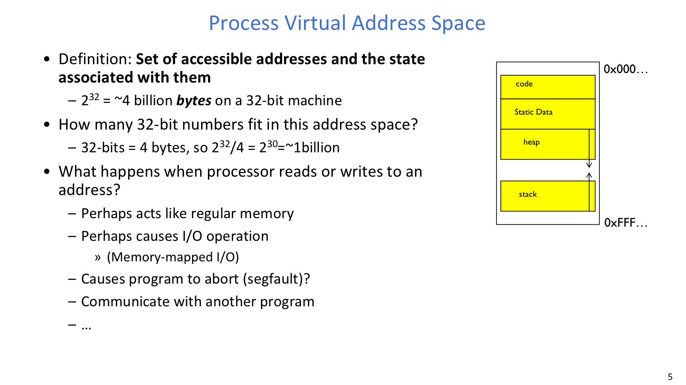
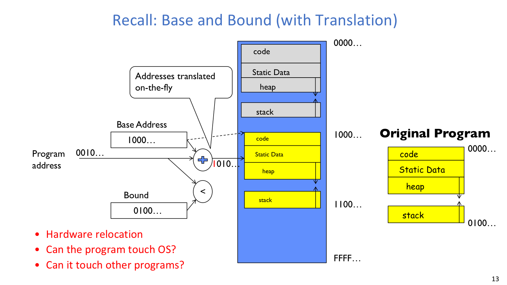
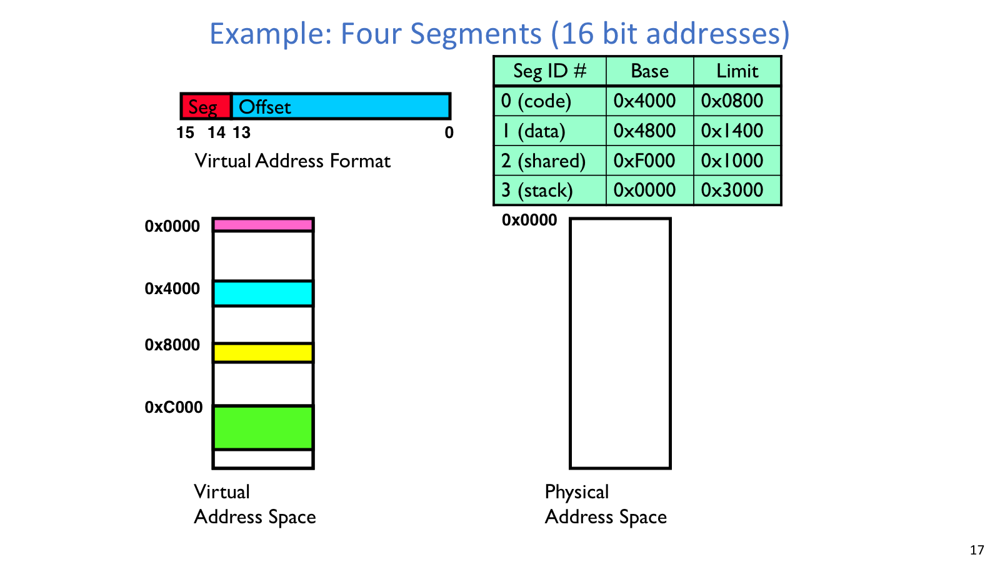
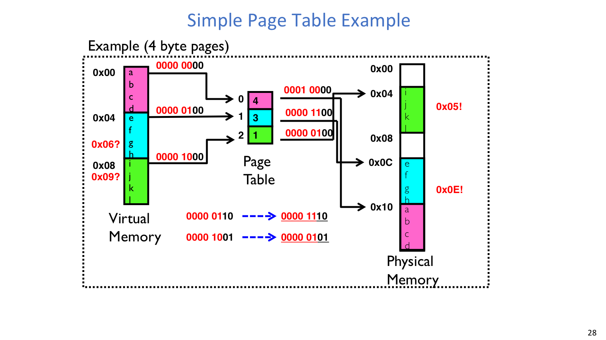
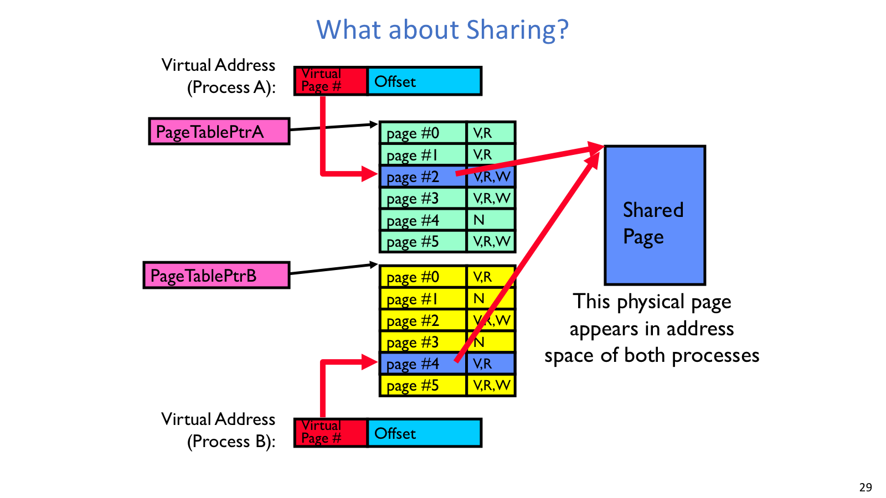

# Lecture 13: Address Translation and Virtual Memory

## 导读

本讲回答一个虚拟内存的基本问题：多个进程为什么都能看到“自己的”地址空间，同时又不能任意读写彼此的内存？主线从没有 translation/protection 的早期方案出发，逐步引出 `base and bound`、segmentation 和 paging。

segmentation 把一个进程拆成多个逻辑段，paging 则把虚拟内存和物理内存都切成固定大小块。无论采用哪种机制，地址翻译的核心动作都相似：拆地址、查表、检查权限，再决定得到 physical address 还是 fault。

## 本讲地图

| 主题 | 解决的问题 |
| --- | --- |
| Virtual address space | 给每个进程一个独立、统一、可保护的地址视图 |
| Memory multiplexing | 同时满足 protection、translation 和 controlled overlap |
| Base and bound | 用一个连续物理区间提供最简单的保护与翻译 |
| Segmentation | 支持 code/data/heap/stack 等逻辑段和稀疏地址空间 |
| Paging | 用固定大小 page/frame 减少 external fragmentation |
| Page sharing | 让多个进程的 PTE 指向同一 physical page，实现受控共享 |

## 正文

虚拟地址空间把程序看到的地址和真实物理内存拆开。Base/bound、segmentation 和 paging 都是在这条线上做不同取舍。

### Virtual Address Space



进程虚拟地址空间说明“地址集合”不是物理内存本身，而是程序可见的命名空间。

#### 问题

物理现实中，不同进程和线程共享同一套硬件内存。如果所有程序都直接使用物理地址，一个 bug 就可能写坏别的进程或 OS。操作系统需要在不让每次 load/store 都陷入内核的前提下，同时提供保护、重定位和受控共享。

#### 机制

`address space` 是程序可读写的地址集合，以及这些地址关联的状态。在 `virtual address space` 中，CPU 产生 virtual address，物理内存使用 physical address，中间由 MMU 做 translation。

32-bit 地址空间大小是 `2^32` bytes，约 4GB；如果一个 32-bit integer 占 4 bytes，则可容纳 `2^30` 个整数。地址位数题默认按 byte-addressable 理解：`k` bit 地址能指向 `2^k` 个 byte，而不是 `2^k` 个 word。

虚拟地址空间不是“已经占用了这么多物理内存”。它是进程可见的完整地址命名空间；真正驻留多少页由映射和 residency 决定。访问某个地址也不一定只是普通内存读写，可能是 memory-mapped I/O、segfault/abort，或触发 OS 介入。

### 三个目标

#### 机制

内存复用不是简单地把内存切成几块，还要同时满足三件事：

| 目标 | 含义 |
| --- | --- |
| Protection | 进程不能访问别的进程私有内存；用户态不能随便访问 kernel data |
| Translation | 把 virtual address 翻译成 physical address，避免物理地址冲突 |
| Controlled overlap | 默认隔离，但需要时允许 shared memory、shared libraries、kernel region |

OS 对 I/O 可以通过 syscall 介入，对 CPU 可以通过 interrupt/preemption 介入，但不能对每次内存访问都 trap。load/store 太频繁，如果都走内核，普通指令执行会被系统调用级开销拖垮。因此结构必须分成 fast path 和 slow path：常见合法访问由硬件 MMU/TLB 直接翻译并检查权限，缺页、非法访问或权限错误才进入 OS。

### Base and Bound



`base + program address` 和 bounds check 是理解后续所有 translation 机制的最小模型。

#### 问题

`Uniprogramming` 中只有一个应用运行，没有 translation/protection，应用可以访问任意物理地址。`Primitive multiprogramming` 把多个程序同时放入物理内存，用 loader/linker 调整地址，但仍没有真正保护；一个程序的错误写入仍可能破坏其他程序或 OS。

#### 机制

`base and bound` 是最简单的保护模型：

```text
base  = 进程在物理内存中的起始地址
bound = 进程允许访问的范围

若 program_address < bound:
  physical_address = base + program_address
否则:
  fault
```

它给每个进程一个连续物理区间。context switch 时，OS 只需要切换当前进程对应的 base/bound 寄存器，硬件即可在每次访问时检查。

#### 取舍

base and bound 很简单，但表达力有限。不同进程大小不同，长期运行会产生 external fragmentation；一个进程的 code/data/heap/stack 可能很稀疏，单个连续区间不够灵活；进程间共享 code segment 或 shared memory 也不自然。后面的 segmentation 和 paging，基本都是在修补这些限制。

### Segmentation



四段示例把 `segment # + offset -> base + offset` 的翻译流程具体化。

#### 机制

segmentation 把一个进程的地址空间分成多个逻辑段，例如 code、data、heap、stack 和 shared segment。每个 segment 都像一个独立的小地址空间，拥有自己的：

| 字段 | 作用 |
| --- | --- |
| base | 该段在物理内存中的起点 |
| limit | 该段大小上界 |
| valid bit | 该段是否存在或可用 |
| protection bits | read/write/execute、user/kernel 等权限 |

地址翻译流程是：

```text
Virtual Address = segment number | offset

1. 用 segment number 查 segment table。
2. 检查 valid bit。
3. 检查 offset < limit。
4. 检查访问权限。
5. Physical Address = base + offset。
```

如果 `offset >= limit`，或权限不匹配，就触发 fault。可以把每个段理解成一个小号 base and bound，因此 code/data/stack 可以分别放到物理内存不同位置。

#### 取舍

segmentation 支持稀疏地址空间和共享段，也能自然表达 code 只读、heap 可写、stack 向下增长等语义。但段仍是变长块，长期运行会出现 external fragmentation；必要时可能搬移/compaction，代价很高。swapping 可以看作极端 context switch：为了腾出内存，把某些进程或段换到磁盘，之后再换回。

### Paging



简单分页例子展示 `VPN -> PPN`，offset 在翻译中保持不变。

#### 问题

segmentation 仍然要把变长段塞进物理内存。即使总空闲空间够，也可能因为没有足够大的连续空洞而放不下某个段。paging 的核心动机，就是消除这种 external fragmentation。

#### 机制

paging 把虚拟地址空间和物理内存都切成固定大小块：

| 名称 | 含义 |
| --- | --- |
| virtual page | 虚拟地址空间中的固定大小页 |
| page frame | 物理内存中同样大小的页框 |
| page table | 把 `VPN` 映射到 `PPN` |
| offset | 页内偏移，在虚拟地址和物理地址中保持不变 |

地址翻译流程是：

```text
Virtual Address = VPN | offset

1. CPU 产生 virtual address。
2. MMU 用 VPN 查 page table。
3. PTE 给出 PPN 和权限位。
4. 检查 valid/protection。
5. Physical Address = PPN | offset。
```

如果 page size 是 4KB，则 offset 需要 `log2(4KB) = 12` bits。32-bit 地址下，VPN 有 `32 - 12 = 20` bits，因此简单线性页表需要 `2^20` 个 PTE。

#### 取舍

固定大小 page 让物理内存分配变简单：每个 frame 一样大，可用 bitmap/free list 管理，基本消除 external fragmentation。代价是最后一页可能用不满，产生 internal fragmentation；page size 太大浪费空间，太小则 PTE 数量和管理开销上升。

### 翻译流程

#### Segmentation

```text
VA = seg | offset
查 seg table -> base, limit, valid, permission
valid? offset < limit? permission OK?
PA = base + offset
否则说明 fault 类型
```

写推导时要明确 fault 的原因：invalid segment、offset 越界，或权限不允许。

#### Paging

```text
VA = VPN | offset
PTE[VPN] -> PPN + flags
valid/protection OK?
PA = PPN | offset
```

小例子：4-byte page 表示 offset 是 2 bits。虚拟地址 `0x06` 拆成 `VPN=1`、`offset=2`；如果 `PTE[1] = PPN 3`，物理地址就是 `3 * 4 + 2 = 0x0E`。

### Page Sharing



共享页图说明两个进程可以通过不同页表项指向同一物理页。

不同虚拟页可以映射到同一个物理页，这就是 paging 支持受控共享的关键。典型用途包括：

| 场景 | 共享方式 |
| --- | --- |
| kernel region | 每个进程高地址区域映射相同 kernel pages，user mode 不可访问 |
| same binary | 多个进程共享只读代码页 |
| shared libraries | 库代码页可 execute-only/read-only 共享 |
| shared memory | 不同进程把同一物理页映射到自己的地址空间用于通信 |

共享不是复制物理页，而是多个 PTE 指向同一个 `PPN`。权限可以不同，例如同一个物理页在一个进程中只读，在另一个进程中可执行。若 shared memory 中直接存指针，最好把共享页映射到各进程地址空间的同一虚拟位置，否则指针值在另一个进程中可能没有相同含义。

simple page table 的规模问题也由这里埋下伏笔：虚拟地址空间有多少 virtual page，线性页表就要有多少 PTE；稀疏地址空间中大量 PTE 可能是 invalid/null。因此下一讲会用 multi-level page table 压缩空洞。
